# Microsoft Fabric - Fabric Analyst in a Day - 实验室 2

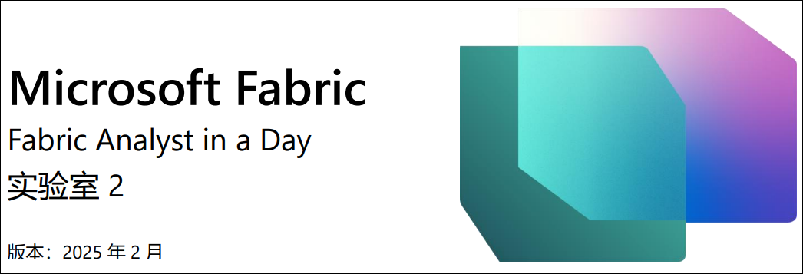

# 目录	
- 简介	
- Fabric 许可证	
    - 任务 1：启用 Microsoft Fabric 试用许可证
- Fabric 工作区	
    - 任务 2：创建 Fabric 工作区	
    - 任务 3：创建湖屋
- Fabric 体验概述	
    - 任务 4：Data Factory 体验	
    - 任务 5：Industry Solutions 体验	
    - 任务 6：Real-Time Intelligence 体验	
    - 任务 7：Data Engineering 体验	
    - 任务 8：Data Science 体验	
    - 任务 9：Data Warehouse 体验	
- 参考	

# 简介

今天，您将学习 Microsoft Fabric
的多种主要功能。这是一个介绍性研讨会，旨在向您介绍 Fabric
中提供的各种产品体验和项目。在本次研讨会结束时，您将学习如何使用湖屋、数据流
Gen2、 数据管道和 DirectLake 等。

在本实验室结束时，您将了解到：

- 如何创建 Fabric 工作区

- 如何创建湖屋

# Fabric 许可证

## 任务 1：启用 Microsoft Fabric 试用许可证

1. 打开**浏览器**并导航到 [Microsoft Power BI Portal](https://app.powerbi.com)。系统会将您导航到登录页面。

   **注意**：如果您使用的是实验室环境，它可能会直接让您登录。

   **注意** 如果您未使用实验室环境，并且已经有 Power BI 帐户，您可能希望在隐私/无痕模式下使用浏览器。

2. 复制**用户名**，并将其粘贴到对话框的**电子邮件**字段中，然后选择**提交**。

    - **电子邮件/用户名**：<inject key="AzureAdUserEmail"></inject>

      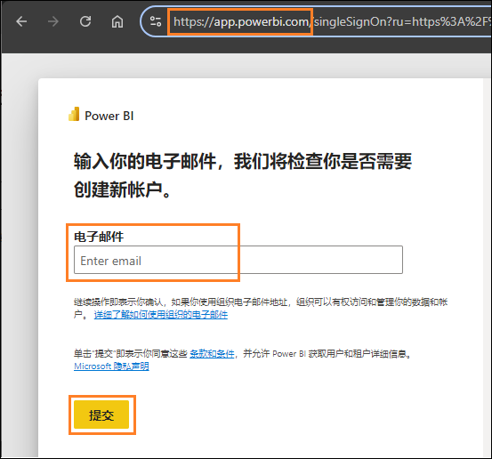

3. 在**登录到 Microsoft Azure** 选项卡上，您将看到登录屏幕，在该屏幕中输入以下**电子邮件/用户名**，然后单击**下一步**。

    - 电子邮件/用户名：<inject key="AzureAdUserEmail"></inject>

      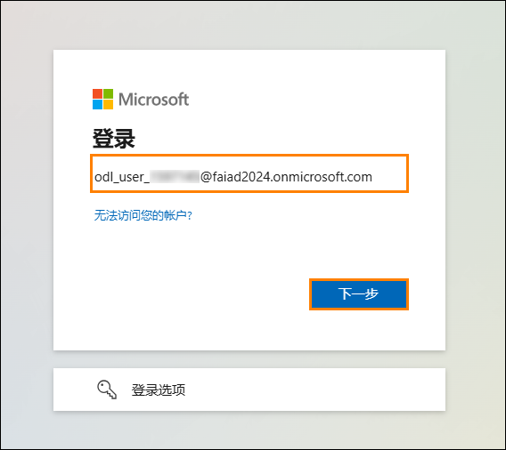

4. 现在，输入以下**密码**，然后单击**登录**。

    - 密码：<inject key="AzureAdUserPassword"></inject>

      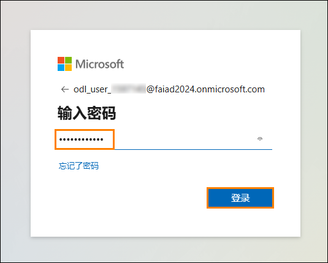

5. 系统会将您导航到熟悉的 **Power BI 服务主页**。

6. 我们假设您熟悉 Power BI
    服务的布局。如果您有任何问题，请随时询问讲师。

   您当前位于**我的工作区**。若要使用 Fabric 项目，您需要试用许可证和分配有 Fabric 许可证的工作区。让我们开始设置。

7. 在屏幕右上角，选择**用户图标**。

8. 选择**免费试用**。

   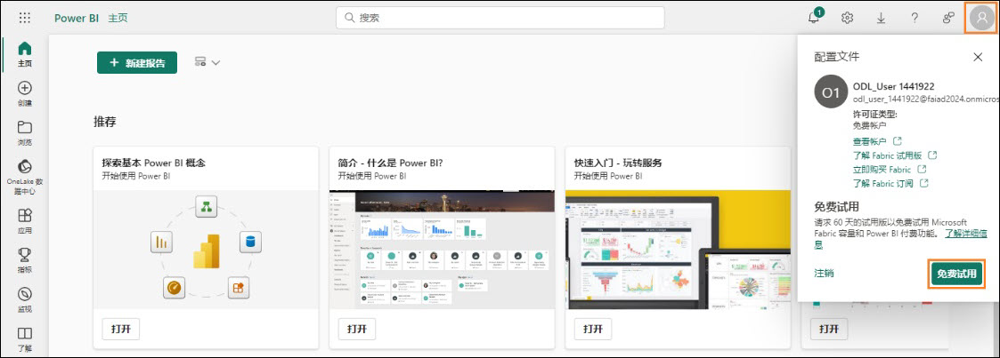

9. "升级到 Microsoft Fabric 免费试用版"对话框随即打开。选择**激活**。

    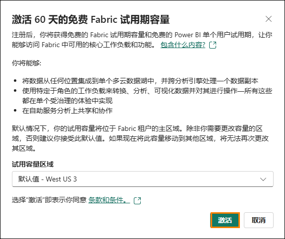

11. "已成功升级到 Microsoft Fabric"对话框随即打开。选择 **Fabric Home
    Page**。

    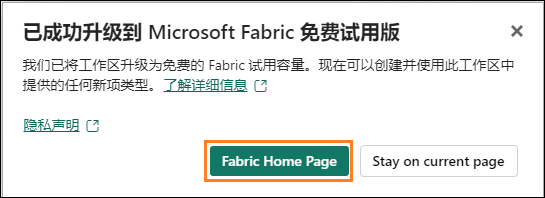

12. 您将导航到 **Microsoft** **Fabric 主页**。

    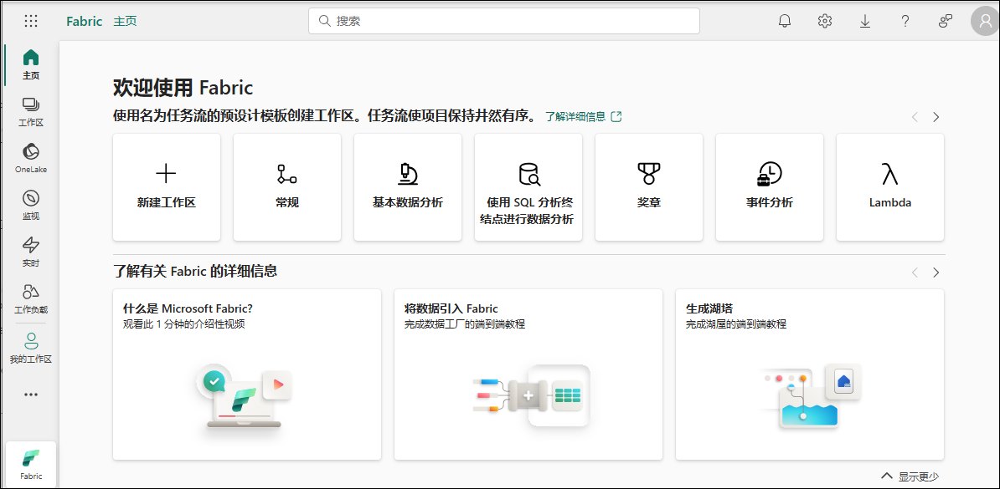

# Fabric 工作区

## 任务 2：创建 Fabric 工作区

1. 现在，让我们创建一个具有 Fabric 许可证的工作区。从左侧导航栏中选择 **工作区 (1)** 。对话框随即打开。

2. 单击在弹出菜单底部找到的 **+ 新建工作区 (2)**

   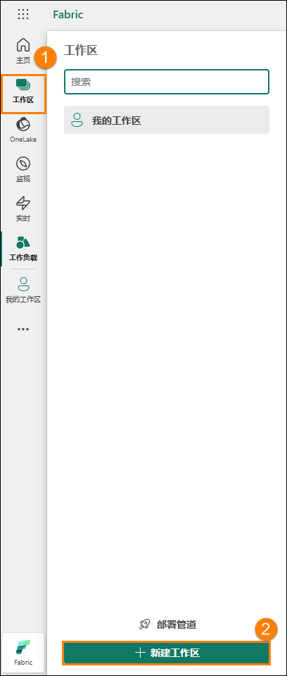

3. 浏览器右侧将打开**创建工作区**对话框。

4. 在**名称**字段中输入 **FAIAD_<inject key="Deployment ID" enableCopy="false"/>**

   **注意**：工作区名称必须唯一。确保"名称"字段下方显示带有"此名称可用"的绿色复选标记。

5. 您可以选择输入工作区的描述。这是选填字段。

6. 点击高级以展开此部分。

   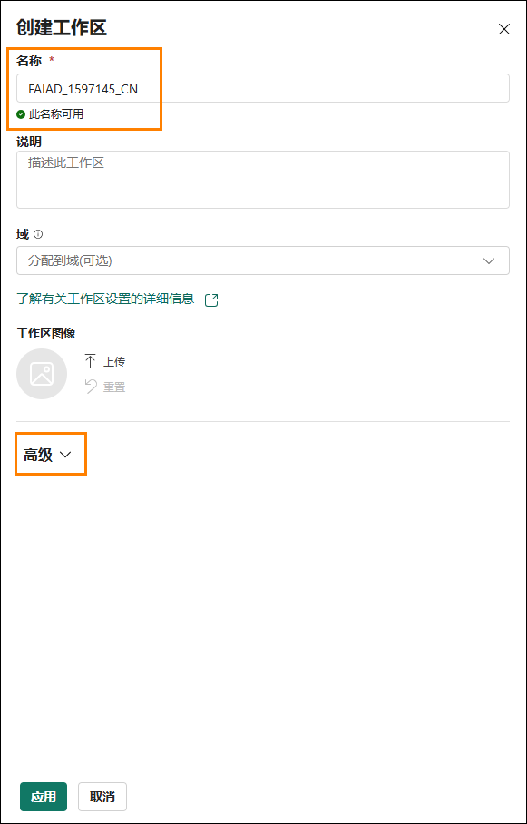

7. 在**许可证模式**下，确保选择**试用版**。（这应该已默认选中。）

8. 选择**应用**以创建新工作区。

   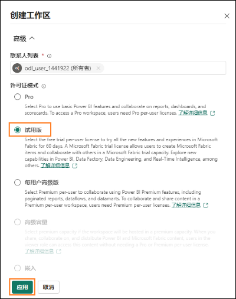

   新工作区已创建，并且系统会将您导航到此工作区。我们将来自不同数据源的数据引入湖屋，并使用湖屋中的数据来构建模型并生成报表。第一步是创建湖屋。

## 任务 3：创建湖屋

1. 在新创建的工作区 **FAIAD_<inject key="Deployment ID" enableCopy="false"/>** 中，在左侧导航窗格中找到 **+ 新建项 (1)** 按钮。 在此处，您可以开始在工作区中创建新项目。

2. 在搜索框中，键入**湖屋 (2)**，然后从搜索结果中，选择**湖屋 (3)** 选项。这将使您能够创建一个新湖屋来存储、查询和管理您的大数据。

   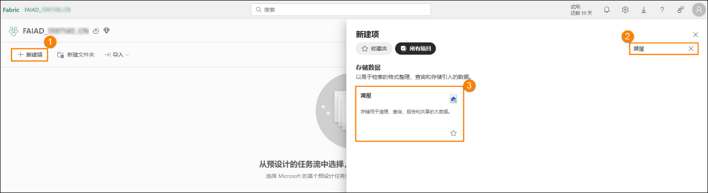

3. "新建 lakehouse"对话框随即显示。在"名称"文本框中输入"lh_FAIAD"。

    **注意**：这里的 lh 是指湖屋。我们添加 lh 前缀是为了便于识别和搜索。

4. 选择**创建**。

   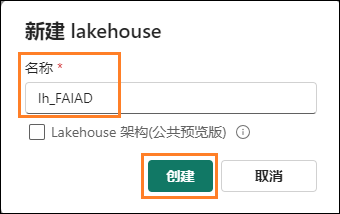

   湖屋很快就会创建完毕，您将导航到湖屋 界面。在**左侧面板**中，请注意工作区下方有 一个湖屋 图标。您可以随时单击此图标轻松导航到湖屋。

   在湖屋资源管理器中，您将看到**Tables** 和 **Files**。湖屋的文件部分下可能会显示 Azure Data Lake Storage Gen2 文件，或者数据流可能会将数据加载到湖屋表中。有各种选项可用。我们将在以下实验室中向您展示其中一些选项。

   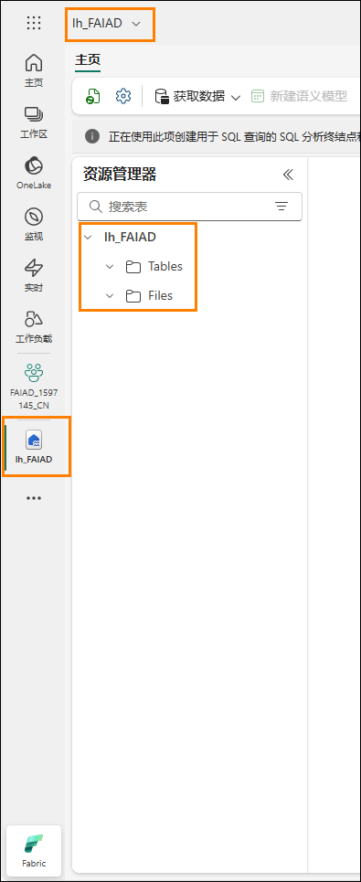

# Fabric 体验概述

## 任务 4：Data Factory 体验

1. 选择屏幕左侧的"工作负载"图标。将打开一个包含 Fabric
    体验列表的对话框。体验列表包括 Power BI、Data Factory、Industry
    Solutions、Real-Time Intelligence、Data Engineering、Data Science 和
    Data Warehouse。让我们来探索吧。

   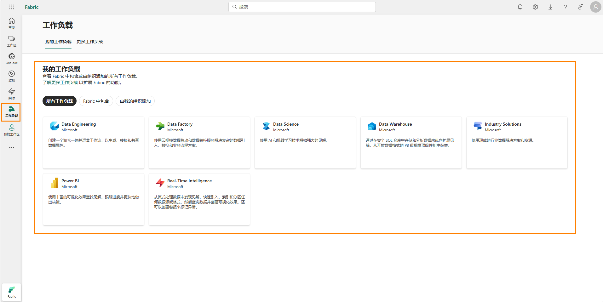

2. 选择 **Data Factory**。

   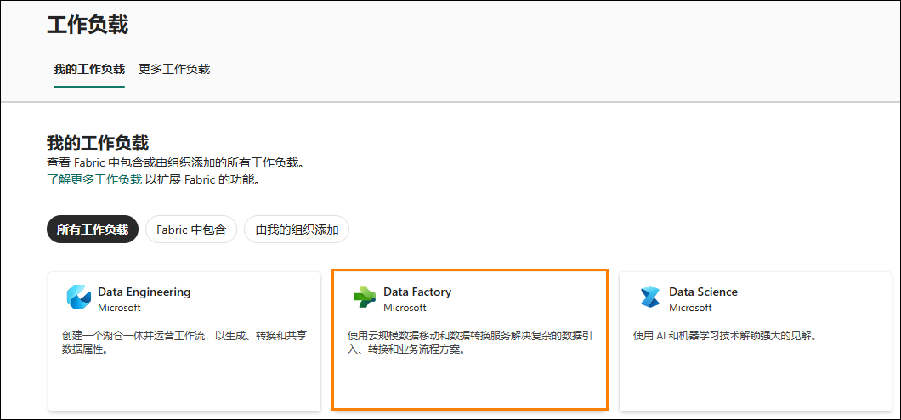

3. 系统会将您定向到 Data Factory 主页。下面是其各部分的详细说明，旨在指导您逐步有效地使用 Data Factory。数据流 Gen2 是新一代数据流。

   ### 什么是 Data Factory？

   Data Factory 是一种工具，可帮助您管理和组织来自不同源的数据。它允许您收集、准备和转换数据，以便有效地使用数据。无论您是初学者还是专家，Data
Factory 都能提供用于更轻松、更高效地转换数据的工具。

   ### 项目类型：

   a. **数据流**：数据流就像转换数据的配方。它们提供 300 多种不同的转换，您可以将其应用于您的数据。这意味着您可以通过多种方式清理、合并和更改数据，以满足您的需求。

   b. **管道**：管道是帮助您自动执行数据流程的工作流。它们允许您创建可根据您的特定要求量身定制的灵活数据工作流。这样便可以更轻松地以结构化方式管理和处理数据。

   c. **Azure 数据工厂（预览版:）** Azure 数据工厂是一种基于云的数据集成服务，允许您创建数据驱动的工作流，以协调和自动执行数据移动和数据转换。

   d. **Apache Airflow 作业（预览版:** Apache Airflow 是一个开放源代码平台，用于以编程方式创作、计划和监视工作流。在 Data Factory 中，它允许您创建、计划和管理复杂的数据工作流。

   e. **复制作业（预览版）:** 复制作业是允许您将数据从一个源复制到另一个源的功能。它提供了一种在不同的数据存储之间移动数据的简单高效的方法。

   f. **镜像数据库（预览版）:** 用于创建数据库的镜像版本以进行备份、测试或只读访问的功能。

   ### 入门：

   若要开始使用 Data Factory，您可以按照以下步骤操作：

   a. **了解如何使用 Data Factory:** 本部分可帮助您开始使用 Data Factory。它提供有关如何开始有效使用该工具的指南。

   b. **创建您的第一个数据流:** 您可以在此处了解如何创建您的第一个数据流。数据流对于根据需要转换数据至关重要。

   c. **创建您的第一个数据管道:** 本部分指导您如何创建您的第一个数据管道。管道有助于高效地自动执行和管理数据流程。

   d. **了解如何监视 Data Factory:** 监视对于确保数据流程顺利运行至关重要。本部分指导您如何监视 Data Factory 活动。

   e. **了解如何使用数据流转换数据:** 本部分可帮助您了解如何使用数据流有效地转换数据。

   f. **为 GraphQL 创建您的第一个 API:** 如果您有兴趣将 API 与 GraphQL 结合使用，本部分将指导您如何开始。

   g. **.创建您的第一个用户数据功能:** 本部分可帮助您创建用户数据功能，这些功能对于管理和转换用户数据非常有用。

      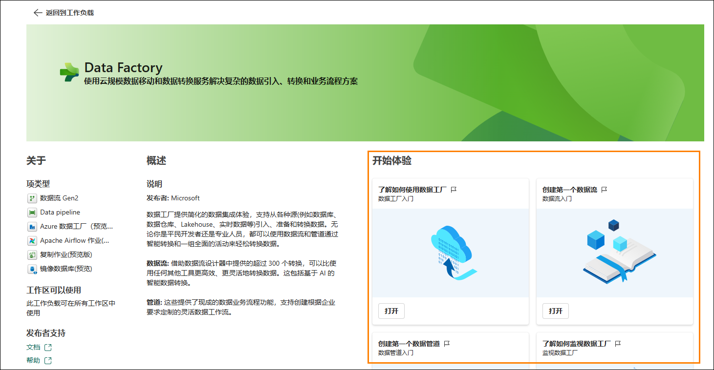

4. 单击屏幕左上角的**返回到工作负载**。此操作会将您转到主工作负荷页面，您可以在该页面中探索其他工具或部分。

   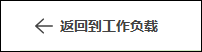

## 任务 5：Industry Solutions 体验

1. 从**工作负载**页面中，单击 **Industry Solutions** 以继续。

   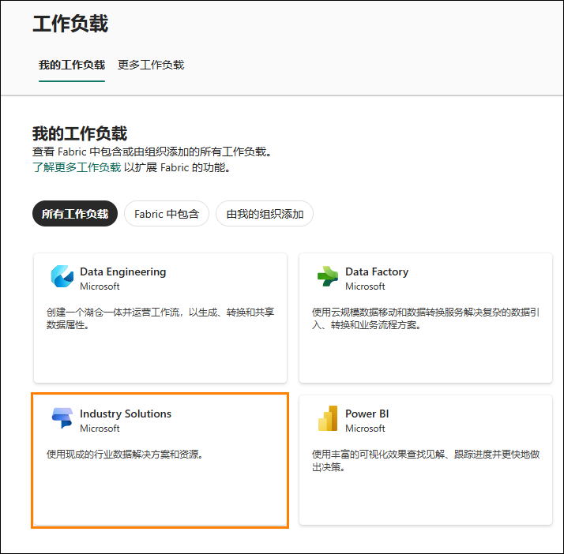

2. 系统会将您定向到 **Industry Solutions** 主页。下面是其各部分的详细概述，旨在帮助您有效地逐步使用 **Industry** **Solutions**。

   ### 什么是 Industry Solutions？

   Industry Solutions 是 Microsoft Fabric 中随时可用的数据解决方案，为各个行业提供解决方案和资源。Industry Solutions 使用与行业相关的数据模型、连接器、转换、报表和其他资产，帮助您开始使用关键业务应用场景。

   ### 项目类型：

   a. **可持续性解决方案** 支持引入、标准化和分析环境、社会和治理 (ESG) 数据。

   b. **零售解决方案**：有助于管理大量数据，整合来自各个来源的数据，并提供实时分析以促进及时做出决策。零售商可以使用这些解决方案进行库存优化、客户细分、销售预测、动态定价和欺诈检测。

   c. **医疗保健解决方案**：经过战略设计，旨在通过满足将医疗保健数据有效转换为适合格式以供分析的关键需求，加快客户实现价值的时间。

   ### 入门：

   若要开始使用 Industry Solutions，请按照以下步骤操作：

   a. **了解医疗保健数据解决方案**：单击"了解详细信息"按钮以了解医疗保健数据解决方案，并了解如何在您的项目中使用它们。

   b. **部署医疗保健数据解决方案**：单击"部署"按钮以开始部署医疗保健数据解决方案并在您的项目中实施它们。

   c. **了解可持续性解决方案**：单击"了解详细信息"按钮以了解可持续性解决方案，并了解如何在您的项目中使用它们。

   d. **部署可持续性解决方案**：单击"部署"按钮以开始部署可持续性解决方案并在您的项目中实施它们。

   e. **了解零售解决方案**：单击"了解详细信息"按钮以了解零售解决方案，并了解如何在您的项目中使用它们。

   f. **部署零售解决方案**：单击"部署"按钮以开始部署零售解决方案并在您的项目中实施它们。3.单击屏幕左上角的"返回到工作负载"。此操作会将您转到主工作负荷页面，您可以在该页面中探索其他工具或部分。

      
   
1. 单击屏幕左上角的"返回到工作负载"。此操作会将您转到主工作负荷页面，您可以在该页面中探索其他工具或部分。

   

## 任务 6：Real-Time Intelligence 体验

1. 从**工作负载**页面中，单击 **Real-Time Intelligence** 以继续。

   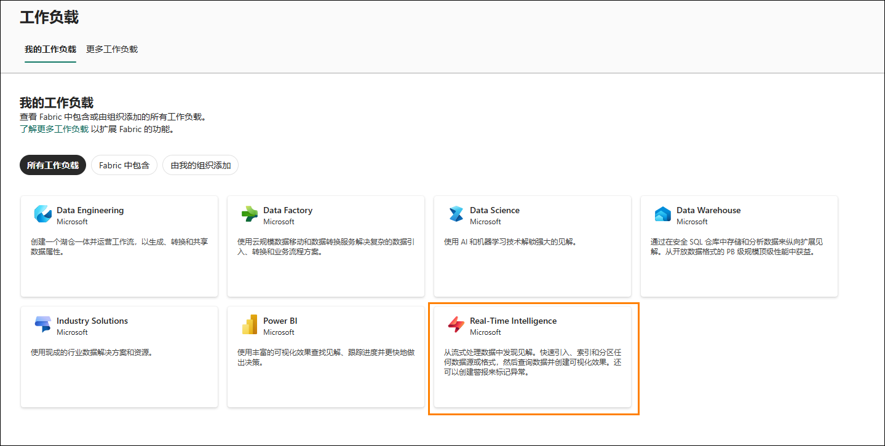

2. 系统会将您定向到 **Real-Time Intelligence** 主页。下面是其各部分的详细概述，旨在帮助您有效地逐步使用 **Real-Time Intelligence**。

   ### 什么是 Real-Time Intelligence？

   Real-Time Intelligence 是可帮助您管理和分析来自各种来源的大量高粒度数据的工具。它允许您实时引入、分析数据并对其采取行动，从而通过及时做出决策和采取行动来改善业务操作。

   ### 项目类型：

   a. **Eventhouse**：用于创建一个或多个 KQL 数据库的工作区，可跨项目共享。

   b. **KQL 查询集**：用于对数据运行查询以生成可共享的表和视觉对象。

   c. **实时仪表板**：用于在数据引入后的几秒钟内可视化实时仪表板。

   d. **Eventstream**：用于捕获、转换和传递实时事件流。

   e. **Activator**：用于监视数据集、查询和事件流中的模式。

   ### 入门：

   若要开始使用 Real-Time Intelligence，请按照以下步骤操作：

   a. **探索 Real-Time Intelligence 示例**：单击"打开"按钮以使用示例探索实时数据分析。

   b. **探索示例**：单击"选择"按钮以使用示例并了解 Real-Time Intelligence。

   c. **. Real-Time Intelligence 简介**：单击"打开"按钮以获 Real-Time Intelligence 的概述，并开始有效地使用该工具。

   d. **. 使用示例数据了解 KQL**：单击"打开"按钮以使用示例数据了解 KQL。

   e. **什么是实时中心**：单击"打开"按钮以了解实时中心的概念以及使用方式。

   f. **探索示例 Activator**：单击"打开"按钮以使用示例激活器并了解 Real-Time Intelligence 的特性和功能。

   g. **开始使用 Activator**：单击"打开"按钮以开始使用激活器概念并开始有效地使用该工具。

      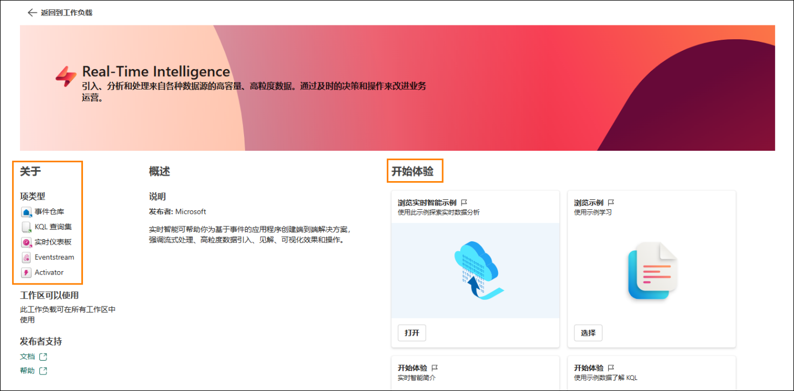

3. 单击屏幕左上角的"返回到工作负载"。此操作会将您转到主工作负荷页面，您可以在该页面中探索其他工具或部分。

   

## 任务 7：Data Engineering 体验

1. 从**工作负载**页面中，单击 **Data Engineering** 以继续。

   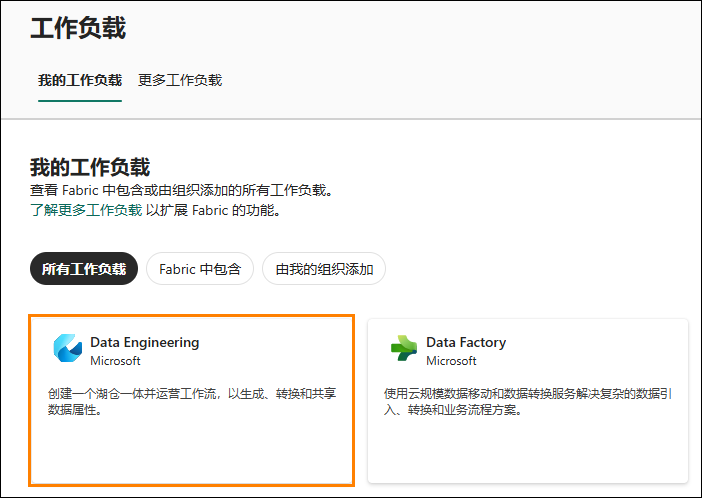

2. 系统会将您定向到 **Data Engineering** 主页。下面是其各部分的详细概述，旨在帮助您有效地逐步使用 **Data** **Engineering**。

   ### 什么是 Data Engineering？

   Data Engineering 是一种工具，可帮助您设计、生成和维护用于收集、存储、处理和分析大量数据的基础结构和系统。它允许您创建湖屋并操作工作流来生成、转换和共享数据资产。

   项目类型：

   a. **湖屋**：用于存储大数据以供清理、查询、报告和共享。

   b. **笔记本**：用于使用 Python、R 和 Scala 等各种语言进行数据引入、准备、分析和其他与数据相关的任务。

   c. **环境**：用于为笔记本和 Spark 作业定义设置共享库、Spark 计算设置和资源。

   d. **Spark 作业定义**：用于定义、计划和管理 Apache 作业。

   e. **数据管道**：用于编排数据解决方案。

   f. **API for GraphQL**：是用于查询多个数据源的 API。

   g. **导入笔记本**：用于从本地计算机导入笔记本。

   ### 入门：

   若要开始使用 Data Engineering，请按照以下步骤操作：

   a. **探索示例**：单击"选择"按钮以使用示例并了解 Data Engineering。

   b. **什么是湖屋？：** 单击"打开"按钮以了解湖屋及其使用方式。

   c. **在湖屋中获得数据体验**：单击"打开"按钮以通过湖屋开始使用数据工程。

   d. **开始使用 Spark 作业定义**：单击"打开"按钮以了解如何使用 Spark 作业定义进行数据处理。

   e. **开发和执行笔记本**：单击"打开"按钮以了解如何开发和执行笔记本进行数据分析。

   f. **如何使用 NotebookUtils**：单击"打开"按钮以了解如何使用NotebookUtils 进行增强的数据分析。

   g. **将笔记本用于您的湖屋**：单击"打开"按钮以了解如何为您的湖屋利用笔记本。

   h. **将数据集用于您的湖屋**：单击"打开"按钮以了解如何为您的湖屋利用数据集。

   i. **创建您的第一个用户数据功能**：单击"打开"按钮以了解如何创建用户数据功能。

   j. **为 GraphQL 创建您的第一个 API**：单击"打开"按钮以了解如何为GraphQL 创建 API。

      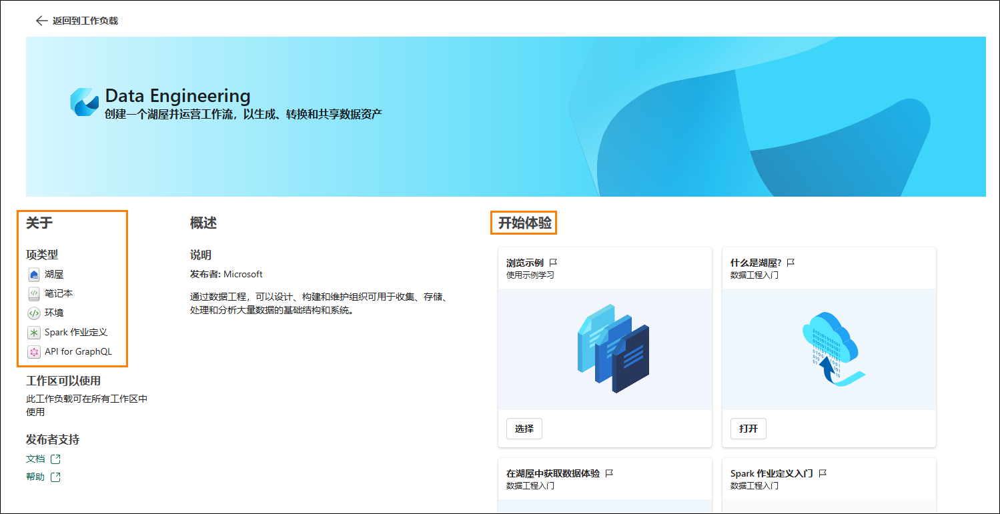

3. 单击屏幕左上角的**返回到工作负载**。此操作会将您转到主工作负荷页面，您可以在该页面中探索其他工具或部分。

   

## 任务 8：Data Science 体验

1. 从**工作负载**页面中，单击 **Data** **Science** 以继续。

   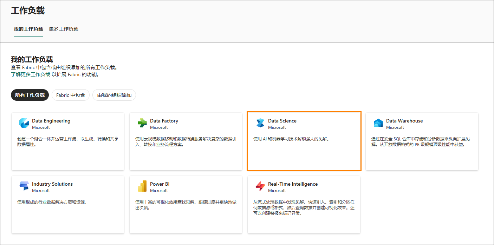

2. 系统会将您定向到 **Data Science** 主页。下面是其各部分的详细概述，旨在帮助您有效地使用 **DataScience**。

   ### 什么是 Data Science？

   Data Science 是可帮助您使用 AI 和机器学习技术发现深刻的见解的工具。它提供 AI 工具，旨在帮助您完成全面的数据科学工作流，并利用 AI 进行数据扩充和获取业务见解。

   ### 项目类型：

   a. **.ML 模型**：用于创建机器学习模型。

   b. **试验**：用于创建、运行和跟踪多个模型的开发。

   c. **笔记本**：用于探索数据和生成机器学习解决方案。

   d. **环境**：用于为笔记本和 Spark 作业定义设置共享库、Spark 计算设置和资源。

   e. **AI 技能**：用于生成您自己的生成式 AI 体验。

   f. **Python 笔记本**：用于从本地计算机导入 Python 笔记本。

   ### 入门：

   若要开始使用 Data Science，请按照以下步骤操作：

   a. **探索示例**：单击"选择"按钮以使用示例并了解 Data Science。

   b. **开始使用 ML 模型**：单击"打开"按钮以了解如何开始使用机器学习模型。

   c. **开始使用 ML 试验**：单击"打开"按钮以了解如何执行机器学习试验。

   d. **开发和执行笔记本**：单击"打开"按钮以了解如何开发和执行笔记本进行数据分析。

   e. **开始使用 ML 笔记本**：单击"打开"按钮以了解如何开始使用笔记本。

      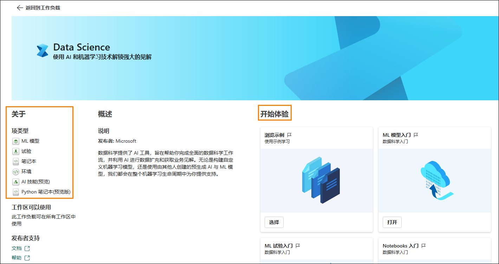

3. 单击屏幕左上角的**返回到工作负载**。此操作会将您转到主工作负荷页面，您可以在该页面中探索其他工具或部分。

   

## 任务 9：Data Warehouse 体验

1. 从**工作负载**页面中，单击 **Data Warehouse** 以继续。

   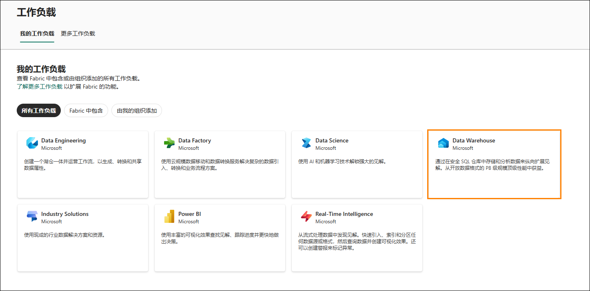

2. 系统会将您定向到 **Data Warehouse** 主页。下面是其各部分的详细概述，旨在帮助您有效地逐步使用 **Data Warehouse**。

   ### 什么是 Data Warehouse？

   Data Warehouse 是可帮助您在安全的 SQL 仓库中存储和分析数据的工具。它可提供开放数据格式的 PB 级的出色性能，使您能够扩展见解。

   ### 项目类型：

   a. **仓库**：用于创建 Data Warehouse。

   b. **示例仓库**：用于通过预先配置的数据集和模型探索和测试数据仓库功能。

   c. **数据管道**：用于编排数据解决方案。

   d. **笔记本**：用于创建和共享交互式数据分析和可视化任务。

   e. **镜像的 Azure SQL 数据库**：用于镜像 Azure SQL 数据库。

   f. **镜像的 Azure Databricks 目录**：用于镜像来自 Azure Databricks 的数据以增强集成和分析。

   g. **镜像的 Snowflake**：用于镜像 Snowflake 数据库。

   h. **镜像的 Azure Cosmos DB**：用于镜像 Azure Cosmos DB。

   i. **镜像的 Azure SQL 托管数据库**：用于镜像 Azure SQL 托管数据库以实现高可用性和灾难恢复。

   j. **镜像的数据库**：用于复制数据库以实现高可用性和灾难恢复。

   ### 入门：

   若要开始使用 Data Warehouse，请按照以下步骤操作：

   a. **开始使用仓库**：单击"打开"按钮以了解如何使用仓库分析数据。

      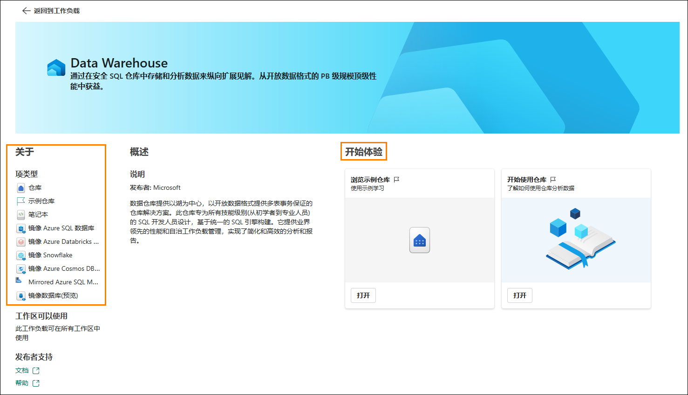

1. 单击屏幕左上角的**返回到工作负载**。此操作会将您转到主工作负荷页面，您可以在该页面中探索其他工具或部分。

      

   在本实验室中，我们探索了 Fabric 界面，并创建了 Fabric 工作区和湖屋。在下一个实验室中，我们将了解如何使用湖屋中的快捷方式连接到 ADLS Gen2 数据以及如何使用视图转换此数据。

# 参考

Fabric Analyst in a Day (FAIAD) 介绍了 Microsoft Fabric
中提供的一些主要功能。在服务菜单中，"帮助
(?)"部分包含指向一些优质资源的链接。

   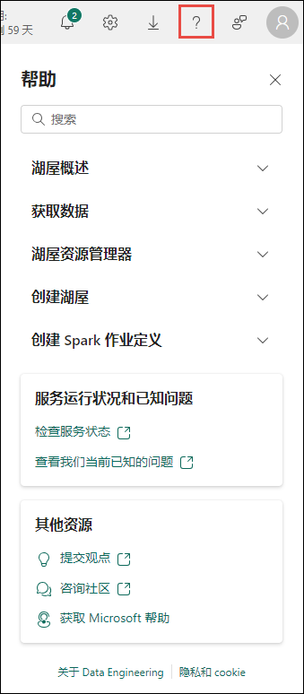

以下更多参考资源可帮助您进行与 Microsoft Fabric 相关的后续步骤。

- 请参阅博客文章以阅读完整的 [Microsoft Fabric GA
    公告](https://aka.ms/Fabric-Hero-Blog-Ignite23)

- 通过[引导式教程](https://aka.ms/Fabric-GuidedTour)探索 Fabric

- 注册 [Microsoft Fabric 免费试用版](https://aka.ms/try-fabric)

- 访问 [Microsoft Fabric 网站](https://aka.ms/microsoft-fabric)

- 通过探索 [Fabric 学习模块](https://aka.ms/learn-fabric)学习新技能

- 探索 [Fabric 技术文档](https://aka.ms/fabric-docs)

- 阅读[有关 Fabric
    入门指南的免费电子书](https://aka.ms/fabric-get-started-ebook)

- 加入 [Fabric
    社区](https://aka.ms/fabric-community)发布问题、分享反馈并向他人学习

阅读更多深度 Fabric 体验公告博客:

- [Fabric 中的 Data Factory
    体验博客](https://aka.ms/Fabric-Data-Factory-Blog) 

- [Fabric 中的 Synapse Data Engineering
    体验博客](https://aka.ms/Fabric-DE-Blog) 

- [Fabric 中的 Synapse Data Science
    体验博客](https://aka.ms/Fabric-DS-Blog) 

- [Fabric 中的 Synapse Data Warehousing
    体验博客](https://aka.ms/Fabric-DW-Blog) 

- [Fabric 中的 Synapse Real-Time Analytics
    体验博客](https://aka.ms/Fabric-RTA-Blog)

- [Power BI 公告博客](https://aka.ms/Fabric-PBI-Blog)

- [Fabric 中的 Data Activator 体验博客](https://aka.ms/Fabric-DA-Blog)

- [Fabric 中的管理和治理博客](https://aka.ms/Fabric-Admin-Gov-Blog)

- [Fabric 中的 OneLake 博客](https://aka.ms/Fabric-OneLake-Blog)

- [Dataverse 和 Microsoft Fabric
    集成博客](https://aka.ms/Dataverse-Fabric-Blog)

© 2025 Microsoft Corporation. 保留所有权利。

使用此演示/实验即表示您已同意以下条款:

本演示/实验中的技术/功能由 Microsoft Corporation
出于获取反馈和提供学习体验的目的提供。只能将本演示/实验用于评估这些技术特性和功能以及向
Microsoft
提供反馈。不得用于任何其他用途。不得对此演示/实验或其任何部分进行修改、复制、分发、传送、显示、执行、复制、公布、许可、转让、销售或基于以上内容创建衍生作品。

严禁将本演示/实验（或其任何部分）复制到任何其他服务器或位置以便进一步复制或再
分发。

本演示/实验出于上述目的，在不涉及复杂设置或安装操作的模拟环境中提供特定软件技术/产品特性和功能，包括潜在的新功能和概念。本演示/实验中展示的技术/概念可能不是完整的功能，可能会以不同于最终版本的工作方式工作。我们也可能不会发布此类功能或概念的最终版本。在物理环境中使用此类特性和功能的体验可能也有所不同。

**反馈**。如您针对本演示/实验中所述的技术特性、功能和/或概念向
Microsoft 提供反馈，则意味着您向 Microsoft
无偿提供以任何方式、出于任何目的使用和分享您的反馈并将其商业化的权利。您同样无偿为第三方提供其产品、技术和服务使用或配合使用包含此反馈的
Microsoft
软件或服务的任何特定部分所需的任何专利权。如果根据某项许可的规定，Microsoft
由于在其软件或文档中包含了您的反馈需要向第三方授予该软件或文档的许可，请不要提供这样的反馈。这些权利在本协议终止后继续有效。

对于本演示/实验，Microsoft Corporation
不提供任何明示、暗示或法定的保证和条件，包括有关适销性、针对特定目的的适用性、所有权和不侵权的所有保证和条件。对于使用本演示/实验产生的结果或输出内容的准确性，或者出于任何目的包含本演示/实验中的信息的适用性，Microsoft
不做任何保证或陈述。

**免责声明**

本演示/实验仅包含 Microsoft Power BI
的部分新功能和增强功能。在产品的后续版本中，部分功能可能有所更改。在本演示/实验中，可了解部分新功能，但并非全部新功能。
