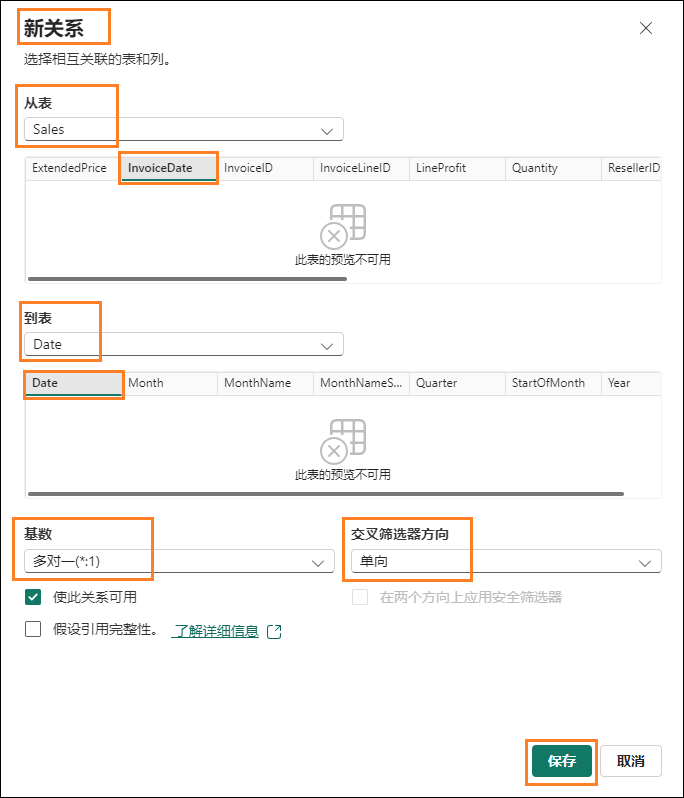

# Microsoft Fabric - Fabric Analyst in a Day - 实验室 6


# 目录
- 简介	
- 湖屋 - 分析数据	
    - 任务 1：使用 SQL 查询数据	
    - 任务 2：可视化 T-SQL 结果	
- 湖屋 - 语义建模	
    - 任务 3：创建语义模型	
    - 任务 4：创建关系	
    - 任务 5：创建度量值	
    - 任务 6：可选部分 - 创建关系	
    - 任务 7：可选部分 - 创建度量值	
- 参考	

# 简介

我们已将来自不同来源的数据引入到湖屋中。在本实验室中，您将使用语义模型。通常，我们在
Power BI Desktop
中执行创建关系、添加度量值等建模活动。接下来，我们将了解如何在该服务中执行这些建模活动。

在本实验室结束时，您将了解到：

- 在 SQL 分析终结点中使用 SQL 视图

- 如何创建语义模型

# **湖屋 - 分析数据**

### 任务 1：使用 SQL 查询数据

1. 让我们导航回您在实验室 2 任务 8 中创建的 Fabric 工作区
    **FAIAD__<inject key="Deployment ID" enableCopy="false"/>**。

2. 您可以选择**最小化任务流**以查看完整的项目列表。

3. 您将看到三种类型的 lh_FAIAD - 湖屋、语义模型和 SQL
    终结点。我们在之前的实验室中探索了湖屋并使用 SQL
    分析终结点创建了视觉对象查询。选择 **lh_FAIAD SQL
    分析终结点**选项以继续探索此选项。系统会将您导航回资源管理器的 **SQL
    视图**。

   

   如果您想在创建数据模型之前探索数据，可以使用 SQL
执行此操作。可通过两个选项使用
SQL。选项一是视觉对象查询，我们在之前的实验室中使用了此查询。选项二是编写 TSQL 代码。此选项适合开发人员。让我们来探索一下此选项。

   假设您想要使用 SQL 快速找出供应商销售的单位数量。

   请注意，在湖屋、SQL 分析终结点的左侧面板中，您可以查看表。展开表后，可以查看组成表的列。此外，还有创建 SQL 视图、函数和存储过程的选项。如果您具备 SQL 背景知识，请随意探索这些选项。我们来尝试编写一个简单的 SQL 查询。

4. 从**顶部菜单**中选择**新建 SQL 查询**，或从屏幕中心单击**新建 SQL
    查询**。您将导航到 SQL 查询视图。

   

5. 将**以下 SQL 查询**粘贴到**查询窗口**中。此查询将返回"units by
    Supplier"名称。它将 Sales 表与 Product 和 Supplier
    表联接起来以实现此目的。

    ```
    SELECT su.SupplierName, SUM(Quantity) as Units
    FROM dbo.Sales s
    JOIN dbo.Product p on p.StockItemID = s.StockItemID
    JOIN dbo.Supplier su on su.SupplierID = p.SupplierID
    GROUP BY su.SupplierName
    ```

6. 在 SQL 编辑器菜单中单击**运行**以查看结果。

7. 请注意，有一个选项用于通过选择**另存为视图**来将此查询另存为视图。

8. **左侧资源管理器**面板上的**查询**部分下，请注意此查询保存在**我的查询**下，为 **SQL query1**。这里提供一个选项用于重命名并保存该查询以供将来使用。还有一个选项用于使用
    **Shared queries** 文件夹查看与您共享的查询。

   **注意：** 您在之前的实验室中创建的视觉对象查询也可在"My
queries"文件夹下找到。

   

###  任务 2：可视化 T-SQL 结果

1. 我们还可以可视化该查询的结果。在查询窗格中**突出显示查询**

2. 在"结果"窗格菜单中，选择**探索此数据(预览) -\> 可视化结果**。

   

3. **可视化结果**对话框随即打开。选择**继续**。

   **可视化结果**对话框随即打开，外观类似于 Power BI Desktop
报表视图。它具有 Power BI Desktop 报表视图中提供的所有功能，您可以设置页面格式、选择不同的视觉对象、设置视觉对象格式、添加筛选器等。在本课程中，我们不会探索这些选项。

4. 展开**数据**窗格并展开 **SQL 查询 1**。

5. 选择 **Supplier_Name** 和 **Units** **字段**。表视觉对象已创建。

   

6. 从**可视化**部分中，通过选择**堆积柱形图**更改视觉对象类型。

7. 选择屏幕右下角的**另存为报表**。

   

8. "保存报表"对话框随即打开。在**为报表输入名称**文本框中，键入 **Units by Supplier**。

9. 确保目标工作区是您的 Fabric 工作区 **FAIAD__<inject key="Deployment ID" enableCopy="false"/>**

10. 选择**保存**。

   

   系统会将您导航回"SQL 查询"屏幕。

# **湖屋 - 语义建模**

### 任务 3：创建语义模型

1. 从湖屋中打开 **SQL 分析终结点**。

2. 从资源管理器窗格中，向下滚动并选择**模型布局**。您会注意到，中间窗格类似于我们在 Power BI Desktop 中看到的模型视图。

   

   这是湖屋创建的默认模型。但是，默认模型存在一些限制（例如，设置度量值格式的功能等）。此外，我们的模型中只需要一小部分表。因此，我们将创建一个新的语义模型。

3. 从菜单的**右上角**，**选择 SQL 分析终结点旁边的箭头**。

4. 选择**湖屋**以导航到湖屋视图。

   

5. 从**菜单**中，选择**报告 -\> 新建语义模型**。

6. "新建语义模型"对话框随即打开。输入 **sm_FAIAD** 作为 Direct Lake 语义模型名称。

7. 默认情况下，我们可以选择表的子集。请记住，我们在之前的实验室中创建了视图。我们希望在模型中包含这些视图。展开 **dbo** 架构，从这里您可以查看湖屋中的所有表和视图。

   

8. **选择**以下表/视图：

    a. **Date**

    b. **People**

    c. **Customer**

    d. **PO**

    e. **Supplier**

    f. **Geo**

    g. **Reseller**

    h. **Sales**

    i. **Product**

9. 选择**确认**。

   

### 任务 4：创建关系

您将导航到包含所选表的新语义模型。根据需要随意**重新排列**表。请注意，某些表（Geo、Reseller、Sales
和
Product）的右上角会显示警告标志。这是因为这些是视图。使用这些视图中的字段创建的任何视觉对象都将处于
Direct Query 模式，而不是 Direct Lake 模式。

**注意：** Direct Lake 模式比 Direct Query 模式更快。

1. 让我们导航回 **Fabric 工作区**，然后选择 **sm_FAIAD** 语义模型。

   

2. 单击**打开数据模型**。

   

3. 第一步是创建这些表之间的关系。

   

4. 让我们在 Sales 和 Reseller 表之间创建关系。从 **Sales** 表中选择 **ResellerID**，并将其拖动到 **Reseller** 表中的**ResellerID**。

   

5. "新建关系"对话框随即打开。确保**从表**是 **Sales**，**列**是
    **ResellerID**。

6. 确保**到表**是 **Reseller**，**列**是 **ResellerID**。

7. 确保**基数**是**多对一(\*:1)**。

8. 确保**交叉筛选器方向**是**单向**。

9. 选择**保存**。

   

10. 同样，在 Sales 和 Date 表之间创建关系。从 **Sales** 表中选择
    **InvoiceDate**，并将其拖动到 **Date** 表中的 **Date**。

11. "新建关系"对话框随即打开。确保**从表**是 **Sales**，**列**是
    **InvoiceDate**。

12. 确保**到表**是 **Date**，**列**是 **Date**。

13. 确保**基数**是**多对一(\*:1)**。

14. 确保**交叉筛选器方向**是**单向**。

15. 选择**保存**。

   

16. 同样，在 **Sales** 和 **Product** 表之间创建**多对一**关系。从 **Sales** 表中选择 **StockItemID**，\ 从 **Product** 表中选择 **StockItemID**。

   **注意：** 我们的所有更新将自动保存。

   **检查点：**您的模型应在 Sales 和 Reseller 表、Sales 和 Date 表以及 Sales 和 Product 表之间建立三种关系，如下面的屏幕截图所示：

   

   为了节省时间，我们不会创建所有关系。如果时间允许，在实验室结束后，您可以完成可选部分。可选部分将引导您完成创建其余关系的步骤。

### 任务 5：创建度量值

让我们添加一些创建 Sales 仪表板所需的度量值。

1. 从模型视图中选择 **Sales 表**。我们想要将度量添加到 Sales 表中。

2. 从顶部菜单中，选择**主页 -\> 新建度量值**。请注意，编辑栏已显示。

3. 在**编辑栏**中输入 **Sales = SUM('Sales'\[Sales Amount\])**。

4. 单击编辑栏左侧的**复选标记**，或单击 **Enter** 按钮。

5. 展开右侧的"属性"面板。

6. 展开**格式化**部分。

7. 从**格式**下拉菜单中，选择**货币**。

8. 将小数位数设置为 **0**。

   

9. 从顶部菜单中选择 **Sales 表**后，选择**主页 -\>新建度量值**。请注意，编辑栏已显示。

10. 在**编辑栏**中输入 **Units = SUM('Sales'\[Quantity\])**。

11. 点击编辑栏左侧的**复选标记**，或点击 **Enter** 按钮。

12. 在右侧的"属性"面板中，展开**格式化**部分（加载"属性"面板可能需要一些时间）。

13. 从**格式**下拉菜单中，选择**整数**。

14. 使用滑块将**千位分隔符**设置为**是**。

    

15. 从顶部菜单中选择 **Sales 表**后，选择**主页 -\>新建度量值**。请注意，编辑栏已显示。

16. 在**编辑栏**中输入 **Sales Orders = DISTINCTCOUNT('Sales'\[InvoiceID\])**。

17. 点击编辑栏左侧的**复选标记**，或点击 **Enter** 按钮。

18. 在右侧的"属性"面板中，展开**格式化**部分。

19. 从**格式**下拉菜单中，选择**整数**。

20. 使用滑块将**千位分隔符**设置为**是**。

    

21. 在**数据面板**（右侧）中，选择**模型**。请注意，这将提供一个视图，该视图有助于组织语义模型中的所有项。

22. 展开**语义模型 -\> 度量值**以查看您刚创建的所有度量值。

23. 您还可以**展开单个表**以查看每个表中的列、层次结构和度量值。

    

   同样，为了节省时间，我们不会创建所有度量值。如果时间允许，在实验室结束后，您可以完成可选部分。可选部分将指导您完成创建其余度量值的步骤。

   我们已经创建了语义模型，下一步是创建报表。我们将在下一个实验室中执行此操作。

### 任务 6：可选部分 - 创建关系

让我们来添加其余关系。

1. 从菜单中，选择**"主页 -\> 管理关系"**。

2. "管理关系"对话框随即打开。选择 **+ 新建关系**。

   

3. "新建关系"对话框随即打开。确保**从表**是 **Sales**，**列**是
    **SalespersonPersonID**。

4. 确保**到表**是 **People**，**列**是 **PersonID**。

5. 确保**基数**是**多对一(\*:1)**。

6. 确保 是**单向**。

7. 选择**保存**。"管理关系"对话框随即打开，其中已添加新关系。

   

8. 现在，让我们在 Product 和 Supplier 之间创建关系。选择 **+
    新建关系**。

9. 确保**从表**是 **Product**，**列**是 **SupplierID**。

10. 确保**到表**是 **Supplier**，**列**是 **SupplierID**。

11. 确保**基数**是**多对一(\*:1)**。

12. 确保**交叉筛选器方向**是**双向**。

13. 选择**保存**。

    

14. 现在，让我们在 Reseller 和 Geo 之间创建关系。选择 **+ 新建关系**。

15. "新建关系"对话框随即打开。确保**从表**是 **Reseller**，**列**是 **PostalCityID**。

16. 确保**到表**是 **Geo**，**列**是 **CityID**。

17. 确保**基数**是**多对一(\*:1)**。

18. 确保**交叉筛选器方向**是**双向**。

19. 选择**保存**。

    

20. 同样，在 Customer 和 Reseller 之间创建关系。选择 **+ 新建关系**。

21. "新建关系"对话框随即打开。确保**从表**是 **Customer**，**列**是 **ResellerID**。

22. 确保**到表**是 **Reseller**，**列**是 **ResellerID**。

23. 确保**基数**是**多对一(\*:1)**。

24. 确保**交叉筛选器方向**是**单向**。

25. 选择**保存**。

    **检查点：** 管理关系应类似于下面的屏幕截图。

    

26. 同样，在 **PO** 和 **Date** 之间创建**多对一**关系。从 **PO** 中选择 **Order_Date**，从 **Date** 中选择 **Date**。

27. 同样，在 **PO** 和 **Product** 之间创建**多对一**关系。从 **PO** 中选择 **StockItemID**，从 **Product** 中选择 **StockItemID**。

28. 同样，在 **PO** 和 **People** 之间创建**多对一**关系。从 **PO** 中选择 **ContactPersonID**，从 **People** 中选择 **PersonID**。

29. 选择**关闭**以关闭"管理关系"对话框。我们已经创建了所有关系。

   **检查点：** 您的模型应类似于下面的屏幕截图。

   

### 任务 7：可选部分 - 创建度量值

让我们来添加其余度量值。

1. 选择 **Sales** 表，然后从顶部菜单中选择**主页 -\> 新建度量值**。

2. 在编辑栏中输入 **Avg Order = DIVIDE(\[Sales\], \[Sales Orders\])**。

3. 单击编辑栏中的**复选标记**，或单击 Enter 按钮。

4. 展开右侧的"属性"面板。

5. 展开**格式化**部分。

6. 从**格式**下拉菜单中，选择**货币**。

7. 将小数位数设置为 0。

   

8. 按照相似的步骤添加以下度量值：

    a. 在 **Sales** 表中，**GM = SUM('Sales'\[LineProfit\])**
        的格式已**设置**为**不带小数位数的货币**。

    b. 在 **Sales** 表中，**GM% = DIVIDE(\[GM\], \[Sales\])**
        的格式已设置为**不带小数位数的百分比**。

    c. 在 **Customer** 表中，**No of Customers = COUNTROWS(Customer)**
        格式已设置为**已启用千位分隔符的整数**。

# **参考**

Fabric Analyst in a Day (FAIAD) 向您介绍了 Microsoft Fabric
中提供的一些主要功能。在服务菜单中，"帮助
(?)"部分包含指向一些优质资源的链接。

   

Nachfolgend finden Sie weitere Angebote zur weiteren Arbeit mit
Microsoft Fabric.

- Die vollständige [Ankündigung der allgemeinen Verfügbarkeit von
    Microsoft Fabric](https://aka.ms/Fabric-Hero-Blog-Ignite23) finden
    Sie im Blogbeitrag.

- Fabric bei einer [interaktiven
    Vorstellung](https://aka.ms/Fabric-GuidedTour) kennenlernen

- Zur [kostenlosen Testversion von Microsoft
    Fabric](https://aka.ms/try-fabric) anmelden

- [Website von Microsoft Fabric](https://aka.ms/microsoft-fabric)
    besuchen

- Mit Modulen von [Fabric Learning](https://aka.ms/learn-fabric) neue
    Qualifikationen erwerben

- [Technische Dokumentation zu Fabric](https://aka.ms/fabric-docs)
    lesen

- [Kostenloses E-Book zum Einstieg in
    Fabric](https://aka.ms/fabric-get-started-ebook) lesen

- Mitglied der [Fabric-Community](https://aka.ms/fabric-community)
    werden, um Fragen zu stellen, Feedback zu geben und sich mit anderen
    auszutauschen

Lesen Sie die detaillierteren Blogs zur Ankündigung der Fabric-Umgebung:

- [Blog zum Data Factory-Funktionsbereich in
    Fabric](https://aka.ms/Fabric-Data-Factory-Blog) 

- [Blog zum Data Engineering-Funktionsbereich von Synapse in
    Fabric](https://aka.ms/Fabric-DE-Blog) 

- [Blog zum Data Science-Funktionsbereich von Synapse in
    Fabric](https://aka.ms/Fabric-DS-Blog) 

- [Blog zum Data Warehousing-Funktionsbereich von Synapse in
    Fabric](https://aka.ms/Fabric-DW-Blog) 

- [Blog zum Real-Time Analytics-Funktionsbereich von Synapse in
    Fabric](https://aka.ms/Fabric-RTA-Blog)

- [Blog mit Ankündigungen zu Power BI](https://aka.ms/Fabric-PBI-Blog)

- [Blog zum Data Activator-Funktionsbereich in
    Fabric](https://aka.ms/Fabric-DA-Blog) 

- [Blog zu Verwaltung und Governance in
    Fabric](https://aka.ms/Fabric-Admin-Gov-Blog)

- [Blog zu OneLake in Fabric](https://aka.ms/Fabric-OneLake-Blog)

- [Blog zur Dataverse- und Microsoft
    Fabric-Integration](https://aka.ms/Dataverse-Fabric-Blog)

© 2025 Microsoft Corporation. Alle Rechte vorbehalten.

Durch die Verwendung der vorliegenden Demo/Übung stimmen Sie den
folgenden Bedingungen zu:

Die in dieser Demo/Übung beschriebene Technologie/Funktionalität wird
von der Microsoft Corporation bereitgestellt, um Feedback von Ihnen zu
erhalten und Ihnen Wissen zu vermitteln. Sie dürfen die Demo/Übung nur
verwenden, um derartige Technologiefeatures und Funktionen zu bewerten
und Microsoft Feedback zu geben. Es ist Ihnen nicht erlaubt, sie für
andere Zwecke zu verwenden. Es ist Ihnen nicht gestattet, diese
Demo/Übung oder einen Teil derselben zu ändern, zu kopieren, zu
verbreiten, zu übertragen, anzuzeigen, auszuführen, zu
vervielfältigen, zu veröffentlichen, zu lizenzieren, zu transferieren
oder zu verkaufen oder aus ihr abgeleitete Werke zu erstellen.

DAS KOPIEREN ODER VERVIELFÄLTIGEN DER DEMO/ÜBUNG (ODER EINES TEILS
DERSELBEN) AUF EINEN/EINEM ANDEREN SERVER ODER SPEICHERORT FÜR DIE
WEITERE VERVIELFÄLTIGUNG ODER VERBREITUNG IST AUSDRÜCKLICH UNTERSAGT.

DIESE DEMO/ÜBUNG STELLT BESTIMMTE
SOFTWARE-TECHNOLOGIE-/PRODUKTFEATURES UND FUNKTIONEN, EINSCHLIESSLICH
POTENZIELLER NEUER FEATURES UND KONZEPTE, IN EINER SIMULIERTEN
UMGEBUNG OHNE KOMPLEXE EINRICHTUNG ODER INSTALLATION FÜR DEN OBEN
BESCHRIEBENEN ZWECK BEREIT. DIE TECHNOLOGIE/KONZEPTE IN DIESER
DEMO/ÜBUNG ZEIGEN MÖGLICHERWEISE NICHT DAS VOLLSTÄNDIGE
FUNKTIONSSPEKTRUM UND FUNKTIONIEREN MÖGLICHERWEISE NICHT WIE DIE
ENDGÜLTIGE VERSION. UNTER UMSTÄNDEN VERÖFFENTLICHEN WIR AUCH KEINE
ENDGÜLTIGE VERSION DERARTIGER FEATURES ODER KONZEPTE. IHRE ERFAHRUNG
BEI DER VERWENDUNG DERARTIGER FEATURES UND FUNKTIONEN IN EINER
PHYSISCHEN UMGEBUNG KANN FERNER ABWEICHEND SEIN.

**FEEDBACK**. Wenn Sie Feedback zu den Technologiefeatures, Funktionen
und/oder Konzepten geben, die in dieser Demo/Übung beschrieben werden,
gewähren Sie Microsoft das Recht, Ihr Feedback in jeglicher Weise und
für jeglichen Zweck kostenlos zu verwenden, zu veröffentlichen und
gewerblich zu nutzen. Außerdem treten Sie Dritten kostenlos sämtliche
Patentrechte ab, die erforderlich sind, damit deren Produkte,
Technologien und Dienste bestimmte Teile einer Software oder eines
Dienstes von Microsoft, welche/welcher das Feedback enthält, verwenden
oder eine Verbindung zu dieser/diesem herstellen können. Sie geben
kein Feedback, das einem Lizenzvertrag unterliegt, aufgrund dessen
Microsoft Drittparteien eine Lizenz für seine Software oder
Dokumentation gewähren muss, weil wir Ihr Feedback in diese aufnehmen.
Diese Rechte bestehen nach Ablauf dieser Vereinbarung fort.

DIE MICROSOFT CORPORATION LEHNT HIERMIT JEGLICHE GEWÄHRLEISTUNGEN UND
GARANTIEN IN BEZUG AUF DIE DEMO/ÜBUNG AB, EINSCHLIESSLICH ALLER
AUSDRÜCKLICHEN, KONKLUDENTEN ODER GESETZLICHEN GEWÄHRLEISTUNGEN UND
GARANTIEN DER HANDELSÜBLICHKEIT, DER EIGNUNG FÜR EINEN BESTIMMTEN
ZWECK, DES RECHTSANSPRUCHS UND DER NICHTVERLETZUNG VON RECHTEN
DRITTER. MICROSOFT MACHT KEINERLEI ZUSICHERUNGEN BZW. ERHEBT KEINERLEI
ANSPRÜCHE IM HINBLICK AUF DIE RICHTIGKEIT DER ERGEBNISSE UND DES AUS
DER VERWENDUNG DER DEMO/ÜBUNG RESULTIERENDEN ARBEITSERGEBNISSES BZW.
BEZÜGLICH DER EIGNUNG DER IN DER DEMO/ÜBUNG ENTHALTENEN INFORMATIONEN
FÜR EINEN BESTIMMTEN ZWECK.

**HAFTUNGSAUSSCHLUSS**

Diese Demo/Übung enthält nur einen Teil der neuen Features und
Verbesserungen in Microsoft Power BI. Einige Features können sich
unter Umständen in zukünftigen Versionen des Produkts ändern. In
dieser Demo/Übung erhalten Sie Informationen über einige, aber nicht
über alle neuen Features.