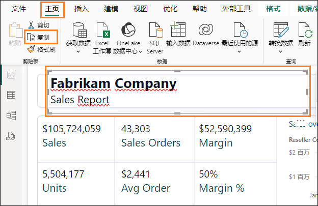

# Microsoft Fabric - Fabric Analyst in a Day - 实验室 7


# 目录
- 简介	
- Power BI	
    - 任务 1：自动创建报表	
    - 任务 2：为新报表配置背景	
    - 任务 3：向报表中添加标头	
    - 任务 4：向报表中添加 KPI	
    - 任务 5：向报表中添加折线图	
    - 任务 6：保存报表	
    - 任务 7：配置 Date 表中的 Year 列	
    - 任务 8：在“Date”表中配置“Month Name”列	
    - 任务 9：设置折线图的格式	
    - 任务 10：将 Power BI Desktop 连接到语义模型	
    - 任务 11：添加新数据以模拟 Direct Lake 模式	
- 清理实验环境	
- 参考	


# 简介

在本课程中，您已经了解了湖屋，将来自不同数据源的数据引入到湖屋中，为数据源设置了刷新计划并创建了数据模型。现在，您将创建报表。

本实验结束后，您将学会：

- 如何自动创建报表

- 如何从空白画布开始生成报表

- 如何使用 Power BI Desktop 生成报表

- 如何体验 Direct Lake 模式以自动刷新数据

# Power BI

### 任务 1：自动创建报表

我们先使用自动创建报表选项。稍后在实验中，我们将重新创建 Power BI
中的报表。

1. 让我们导航回您在实验室 2 中创建的名为 **FAIAD_<inject key="Deployment ID" enableCopy="false"/>** 的 **Fabric** **工作区**。

2. 在左侧面板底部，选择 **Fabric 体验选择器**图标。

   

3. Fabric 体验对话框随即打开。选择 **Power BI**。您将导航到 **Power BI主页**。

   

4. 从顶部菜单中选择**新建报告**。

   

5. 您将导航到**生成第一个报表屏幕**。可以选择使用 excel、csv
    生成报表，手动输入数据，或选择已发布的语义模型。我们在之前的实验中创建了一个语义模型。我们来使用该模型。选择**选择发布的语义模型**选项。

   

6. "选择要在报表中使用的语义模型"页面随即打开。请注意，我们有多个选项。\ 选择 **sm_FAIAD**。

    a. **sm_FAIAD：** 这是我们已创建并希望用于生成报表的语义模型。

    b. **lh_FAIAD：** 这是我们将所有数据引入到的湖屋。

    c. **Units by Supplier：** 这是我们使用 T-SQL 创建的数据集。

7. 点击 **"自动创建报表"按钮旁边的箭头**。请注意，有两个选项："自动创建报表"和"创建空白报表"。我们来尝试自动创建报表，因此选择**自动创建报表**。

   

8. Power BI 将开始自动创建报表。报表准备就绪后，屏幕右上角会出现一个对话框。选择**立即查看报表或报表在几秒钟后自动加载**。

   

   **检查点：** 您将得到一份与下面的屏幕截图相似的报表。有一些 KPI
和一些趋势视觉图。如果您要分析新模型并需要快速启动，可以从这里入手。

   **注意：** 请注意，在顶部菜单上，您可以选择"编辑报表"或以表的形式查看某些数据。请随意浏览这些选项。

9. 我们保存该报表。从顶部菜单中选择**保存**。

10. "保存报表"对话框随即打开。将报表命名为 **rpt_Sales_Auto_Report**\ **注意：**我们在报表名称前加上 rpt（报表的缩写）作为前缀。

11. 确保将报表保存在您的工作区 **FAIAD_<inject key="Deployment ID" enableCopy="false"/>。**

12. 选择**保存。**

    

    **注意：** 您看到的自动创建的报表可能有所不同，因为它是"自动创建的"。它还取决于您在上一个实验（实验 6）中创建的关系和度量值。

    如果您创建了所有关系和度量值（包括可选关系，实验 6），则上面的屏幕截图显示了自动创建的报表**可能**显示的样子。

    如果您不创建可选关系和度量值（实验 6），则下面的屏幕截图显示了自动创建的报表**可能**显示的样子。

    

### 任务 2：为新报表配置背景

我们使用空白画布创建新报表。

1. 在**左侧面板**中，选择您的工作区名称 **FAIAD_<inject key="Deployment ID" enableCopy="false"/>** 以导航到该工作区。

2. 从顶部菜单中，选择**新建项目 -\>报表**。您将导航到"生成您的第一个报表"页面。

   

3. 选择**选择发布的语义模型，**这样就可以选择我们创建的模型。

   

4. "选择要在报表中使用的语义模型"对话框随即打开。选择 **sm_FAIAD**。

5. 点击**"自动创建报表"按钮旁边的箭头**。选择**创建空白报表。**系统会将您**导航到**与 Power BI Desktop 报表页面类似的报表页面。

   

6. 如果您还未打开 **FAIAD.pbix**，请打开它。它位于您的实验室环境的桌面的 **Reports** 文件夹中。

   我们将使用这份报表作为参考。先添加画布背景。我们将创建报表标头，添加几个 KPI，并创建随时间变化的销售额折线图。为了节省时间，并且鉴于您具有在 Power BI Desktop 中生成视觉对象的经验，我们不会创建所有视觉对象。

   

7. 在浏览器中导航到 **Power BI 画布**。

8. 在"可视化"窗格中，选择**设置页面格式图标**。

9. 展开**画布背景部分**。

10. 从**图像**选项中选择**浏览**。"文件资源管理器"对话框随即打开。

11. 导航到实验室环境的桌面上的 **Reports** 文件夹。

12. 选择 **Summary Background.png。**

13. 将**图像匹配度**下拉菜单设置为**填充**。

14. 然后将"透明度"设置为 **0%**。

    

### 任务 3：向报表中添加标头

1. 我们在上边距中添加标头。从**菜单**中选择**文本框**。

2. 在文本框的第一行输入 **Fabrikam Company**。

3. 在文本框的第二行输入 **Sales Report**。

4. 突出显示 **Fabrikam Company**，并将**字体**设置为 **Segoe
    UI**，**字体大小**设置为 **18，粗体**。

5. 突出显示 **Sales Report**，并将**字体**设置为 **Segoe
    UI**，**字体大小**设置为 **14。**

6. **选中文本框**后，在右侧的"设置文本框格式"窗格中，**展开效果**。

7. 使用**背景**滑块将其设置为**关闭**。

8. 调整**文本框的大小以适合上边距**。

   

### 任务 4：向报表中添加 KPI

1. 我们添加销售 KPI。选择画布中的**空白区域**，以将焦点从文本框上移开。

2. 从**可视化部分**，选择**多行卡视觉对象**。

3. 从**数据部分**展开 **Sales 表**。

4. 选择 **Sales 度量**。

   

5. 选择**多行卡视觉对象**后，从"可视化"部分选择**设置视觉对象格式图标**。

6. 展开**类别标签**部分。

7. 将**字体大小**增大到 **14**。

8. 选择**颜色下拉列表**。调色板对话框随即打开。

9. 选择**更多颜色**。

10. 将十六进制值设置为 **#004753**。

    

11. 展开**卡**部分。

12. 使用**强调栏**滑块将其设置为**关闭**。

    

13. 在"可视化"窗格中选择**常规**。

14. 展开**效果部分**。

15. 使用**背景**滑块将其设置为**关闭**。

16. 对**视觉对象**调整大小，并将其移到**左侧框，如屏幕截图所示**。

    

17. 我们再添加一个 KPI。选择我们刚刚创建的 **Sales
    多行卡片**。通过从键盘中选择 **Ctrl+C** 来**复制**视觉对象。

18. 通过从键盘中选择 **Ctrl+V**
    来**粘贴**视觉对象。请注意，视觉对象已粘贴到画布上。

19. **突出显示新视觉对象**后，在**可视化窗格 -\> 生成视觉对象 -\>
    字段**部分删除 **Sales** 度量。

20. 从**数据**部分展开 **Sales** 表，并选择 **Units** 度量。

21. 对**视觉对象**调整大小，并将其**放置在 Sales 视觉对象下方的框中**。

    

### 任务 5：向报表中添加折线图

我们创建一个折线图来可视化经销商公司随时间变化的销售额。

1. 选择画布中的**空白区域**，以将焦点从多行卡片视觉对象上移开。

2. 在**可视化部分**中选择**折线图**。

3. 从**数据部分**展开 **Date** 表。

4. 选择 **Year** 字段。请注意，Year 默认为求和值并添加到 Y
    轴。我们来更正一下吧。

   

### 任务 6：保存报表

在我们导航离开报表并对模型进行更改之前，我们先保存该报表。

1. 从顶部菜单中，选择**文件 -\> 保存**。

2. "保存报表"对话框随即打开。将报表命名为 **rpt_Sales_Report**\
    **注意：**我们在报表名称前加上 rpt（报表的缩写）作为前缀。

3. 确保将报表保存在 **FAIAD_<inject key="Deployment ID" enableCopy="false"/>** 工作区 **。**

4. 选择**保存。**请**注意**，报表已保存，并且您处于视图模式。

   

### 任务 7：配置 Date 表中的 Year 列

1. 从**顶部菜单**中，选择**编辑**以返回到编辑模式。

2. 从**顶部菜单**中，选择**打开数据模型**。请注意，语义模型在新的浏览器窗口/选项卡中打开。

   

3. 从右侧的**数据**面板**中**，选择"表"。

4. 展开 **Date** 表。

5. 选择 **Year** 列。

6. 在右侧**属性**窗格中，展开**高级**部分。

7. 在**汇总依据**下拉列表中，选择**无**。

   

8. 导航回浏览器的**报表窗口/选项卡**。

9. 在右侧的**数据窗格**上，展开 **Date**
    表。请注意，"Year"不是求和字段。

10. 选择**折线图视觉对象**后，从 Y 轴**删除 Year 的总和**。

11. 选择 **Year** 字段，它将添加到 **X 轴**。

12. 展开 **Sales** 表，并选择 **Sales 度量**。

    

### 任务 8：在"Date"表中配置"Month Name"列

1. 从"Date"表中，将 **MonthNameShort** 字段拖动到 **X** **轴**中的 **Year** 下方。我们将按 **MonthNameShort** 对其进行排序。

2. 选择视觉对象右上角的**省略号 (...)**。

3. 选择**排列轴 -\> Year Short_Month_Name**。

4. 选择视觉对象右上角的**省略号 (...)**。

5. 选择**排列轴 -\> 以升序排序**。

   

   **注意：** 月份按字母顺序排序。让我们来解决这个问题。

   

6. 导航回已打开语义模型的**浏览器窗口/选项卡**。

7. 在**数据**窗格中，展开 **Date** 表。

8. 选择 **MonthNameShort** 列。

9. 在右侧**属性**窗格中，展开**高级**部分。

10. 在**按列排序**下拉列表中，选择 **Month**。

    

11. 导航回浏览器的**报表窗口/选项卡**。请注意，现在月份已正确排序。

    

### 任务 9：设置折线图的格式

请注意，在生成报表时，更新语义模型很容易。这实现了像 Power BI Desktop
一样的无缝交互。

1. **选择折线图视觉对象**后，在**数据部分**，展开 **Reseller** 表。

2. 将 **Reseller -\> Reseller Company** 字段拖到**图例**部分。

   

3. **选择折线图视觉对象**后，从**可视化**部分选择**设置视觉对象格式图标 -\> 常规**。

4. 展开**标题**部分。

5. 将**标题**文本设置为 **Sales over time**。

6. 展开**效果**部分。

7. 使用**背景**滑块将其设置为**关闭**。

   

8. 在**可视化**部分中，选择**设置视觉对象格式图标 -\> 视觉对象**。

9. 展开**行**部分。

10. 在**将设置应用于 -\> 系列下拉列表**中，选择 **Tailspin Toys**。

11. 展开**颜色**部分。

12. 将**颜色**设置为 **#F17925**

13. 在**将设置应用于 -\> 系列下拉列表**中，选择 **Wingtip Toys**。

14. 将**颜色**设置为 **#004753**

15. 对**视觉对象**调整大小，并将其移到**右上方框，如屏幕截图所示**。

16. 滚动到视觉对象的右侧，**请注意，我们拥有截至 2024 年 4 月的数据**。

    

17. 我们保存报表，从菜单中选择**文件 -\> 保存**。

    如前所述，我们不会在本实验中生成所有视觉对象。如果您有时间，可以自行生成更多视觉\
对象。

### 任务 10：将 Power BI Desktop 连接到语义模型

现在，让我们看一下将 Power BI Desktop
连接到语义模型并生成视觉对象有多容易。

1. 打开 **FAIADTemplate.pbix**，它位于您的实验室环境的**桌面**的
    **Reports** 文件夹中。

2. 从功能区中，选择**主页 -\> OneLake 数据中心 -\> Power BI
    语义模型**。

   

3. OneLake 数据中心对话框随即打开。选择我们创建的语义模型
    **sm_FAIAD**。

4. 选择**连接**。请注意，在"数据"窗格中，我们包含语义模型中的表。

   

5. 从**左侧面板**中，选择**模型视图**。请注意，我们可以查看表之间的关系。

   

6. 从**左侧面板**中，选择**报表视图**以导航回报表视图。

7. 如果您尚未打开 **FAIAD.pbix**，请打开它。它位于您的实验室环境的**桌面**的 **Reports** 文件夹中。

8. 选择**报表标题视觉对象**。

9. 从功能区中，选择**主页 -\> 复制**。

   

10. 导航回 **FAIADTemplate.pbix** ，然后选择报表画布。

11. 从功能区中，选择**主页 -\> 粘贴**。

    

12. 同样，复制并粘贴**销售和单位 KPI**。仅供参考 -
    可以复制多个视觉对象并将其粘贴在一起。

    

    注意，可以轻松从现有报表中复制视觉对象并将其粘贴到连接到语义模型的报表。请注意，表名称、列名称、度量值名称必须相同，复制和粘贴才能正常工作。如果它们不相同，您可能会遇到错误，但这很容易解决。

13. 导航到 **FAIAD.pbix** ，并创建随时间变化的销售折线图。

14. 从功能区中，选择**主页 -\> 复制**。

15. 导航回 **FAIADTemplate.pbix**，然后选择报表画布。

16. 从功能区中，选择**主页 -\>粘贴**。请注意，不会呈现视觉对象。这是因为当前语义模型未从日期字段创建层次结构。

17. 让我们来解决这个问题。在**可视化**窗格中，在 **X 轴**下，删除
    **StartOfMonth**。

    

18. 18.从**数据**窗格中，展开 **Date** 表。

19. 将 **StartOfMonth** 字段拖放到 **X轴**中。这将修复视觉对象。您可能必须设置视觉对象的格式。

    

20. 让我们保存报表，从功能区中选择**文件 -\> 保存**。

### 任务 11：添加新数据以模拟 Direct Lake 模式

在 Import 模式下，刷新源中的数据后，我们通常需要刷新 Power BI
模型，以更新报表中的数据。通过使用 Direct Query
模式，刷新源中的数据后，这些数据就可以在 Power BI
报表中使用。然而，direct query 模式通常很慢。为了解决这个问题，Microsoft
Fabric 引入了 Direct Lake 模式。Direct Lake 是一种将数据从湖中直接加载到
Power BI 引擎中以供分析的快速路径。

让我们来探索以下应用场景：在 ADLS Gen2 中更新数据，更改立即反映在 Power
BI 报表中，无需运行任何刷新。

在实际应用场景中，数据在源进行更新。由于我们处于训练环境中，因此我们将对此进行模拟。我们拥有截至
2024 年 4 月的数据。让我们通过在 ADLS Gen2 中创建 2024 年 5
月文件的快捷方式并更新"销售"视图，添加 2024 年 5 月的销售数据。

1. 导航回**浏览器**。

2. 在左侧菜单栏中，选择 **FAIAD_<inject key="Deployment ID" enableCopy="false"/>** 以导航到工作区主页。

3. 选择 **lh_FAIAD** 以导航到湖屋。

   

4. 从左侧的**资源管理器窗格**中，选择**表**旁边的**省略号**。

5. 选择**新建快捷方式**。

   

6. "新建快捷方式"对话框随即打开。在**外部源**下，选择 **Azure Data Lake Storage Gen2**。

   

7. 由于您之前在实验中创建了连接，因此无需创建新连接，将在现有连接下看到 ADLS 连接。

8. 如果您之前未在本课程中创建此连接，请单击**创建新连接**并完成以下步骤：

9. 在**"连接设置"-\>"URL"**下，输入以下链接
    <https://stvnextblobstorage.dfs.core.windows.net/fabrikam-sales>

10. 选择**下一步**。

    

11. 您将连接到 ADLS Gen2，目录结构显示在左侧面板中。展开
    **Delta-Parquet-Format-FY25**。

12. 选择 **Sales.Invoices_May**。

13. 选择**下一步**。

    

14. 系统会将您的导航到下一个对话框，我们可以在其中编辑名称。针对
    **Sales.Invoices_May**，在"操作"下选择**编辑图标**。

15. 将 **Sales.Invoices_May 重命名为 InvoicesMay**。

16. 选中名称旁边的**复选标记**以保存更改。

17. 选择**创建**。

    

    请注意，在左侧的**资源管理器窗格**中，我们有"InvoicesMay"表。现在我们需要更新\ Sales 视图。

18. 在屏幕的**右上角**，选择**湖屋 -\> SQL 分析终结点**。

    

19. 从顶部菜单中，选择**主页 -\> 新建 SQL 查询**。"新建 SQL
    查询"窗格随即打开。

20. **复制**下面的代码，然后将其**粘贴**到 SQL 查询窗格中。

    ```
    ALTER VIEW [dbo].[Sales] AS (
    select [$Outer].[InvoiceLineID] as [InvoiceLineID],
        [$Outer].[InvoiceID] as [InvoiceID],
        [$Outer].[StockItemID] as [StockItemID],
        [$Outer].[Quantity] as [Quantity],
        [$Outer].[UnitPrice] as [UnitPrice],
        [$Outer].[TaxRate] as [TaxRate],
        [$Outer].[TaxAmount] as [TaxAmount],
        [$Outer].[LineProfit] as [LineProfit],
        [$Outer].[ExtendedPrice] as [ExtendedPrice],
        [$Outer].[CustomerID] as [ResellerID],
        [$Outer].[SalespersonPersonID] as [SalespersonPersonID],
        [$Outer].[InvoiceDate] as [InvoiceDate],
        [$Outer].[t0_0] as [Sales Amount]
    from 
    (
        select [_].[InvoiceLineID] as [InvoiceLineID],
            [_].[InvoiceID] as [InvoiceID],
            [_].[StockItemID] as [StockItemID],
            [_].[Quantity] as [Quantity],
            [_].[UnitPrice] as [UnitPrice],
            [_].[TaxRate] as [TaxRate],
            [_].[TaxAmount] as [TaxAmount],
            [_].[LineProfit] as [LineProfit],
            [_].[ExtendedPrice] as [ExtendedPrice],
            [_].[CustomerID] as [CustomerID],
            [_].[SalespersonPersonID] as [SalespersonPersonID],
            [_].[InvoiceDate] as [InvoiceDate],
            [_].[ExtendedPrice] - [_].[TaxAmount] as [t0_0]
        from 
        (
            select [$Outer].[InvoiceLineID],
                [$Outer].[InvoiceID],
                [$Outer].[StockItemID],
                [$Outer].[Quantity],
                [$Outer].[UnitPrice],
                [$Outer].[TaxRate],
                [$Outer].[TaxAmount],
                [$Outer].[LineProfit],
                [$Outer].[ExtendedPrice],
                [$Inner].[CustomerID],
                [$Inner].[SalespersonPersonID],
                [$Inner].[InvoiceDate]
            from [lh_FAIAD].[dbo].[InvoiceLineItems] as [$Outer]
            inner join 
            (
                select [_].[InvoiceID] as [InvoiceID2],
                    [_].[CustomerID] as [CustomerID],
                    [_].[BillToResellerID] as [BillToResellerID],
                    [_].[OrderID] as [OrderID],
                    [_].[DeliveryMethodID] as [DeliveryMethodID],
                    [_].[ContactPersonID] as [ContactPersonID],
                    [_].[AccountsPersonID] as [AccountsPersonID],
                    [_].[SalespersonPersonID] as [SalespersonPersonID],
                    [_].[PackedByPersonID] as [PackedByPersonID],
                    [_].[InvoiceDate] as [InvoiceDate],
                    [_].[CustomerPurchaseOrderNumber] as [CustomerPurchaseOrderNumber],
                    [_].[IsCreditNote] as [IsCreditNote],
                    [_].[CreditNoteReason] as [CreditNoteReason],
                    [_].[Comments] as [Comments],
                    [_].[DeliveryInstructions] as [DeliveryInstructions],
                    [_].[InternalComments] as [InternalComments],
                    [_].[TotalDryItems] as [TotalDryItems],
                    [_].[TotalChillerItems] as [TotalChillerItems],
                    [_].[DeliveryRun] as [DeliveryRun],
                    [_].[RunPosition] as [RunPosition],
                    [_].[ReturnedDeliveryData] as [ReturnedDeliveryData],
                    [_].[ConfirmedDeliveryTime] as [ConfirmedDeliveryTime],
                    [_].[ConfirmedReceivedBy] as [ConfirmedReceivedBy],
                    [_].[LastEditedBy] as [LastEditedBy2],
                    [_].[LastEditedWhen] as [LastEditedWhen2]
                from 
                (
                    select [$Table].[InvoiceID] as [InvoiceID],
                        [$Table].[CustomerID] as [CustomerID],
                        [$Table].[BillToResellerID] as [BillToResellerID],
                        [$Table].[OrderID] as [OrderID],
                        [$Table].[DeliveryMethodID] as [DeliveryMethodID],
                        [$Table].[ContactPersonID] as [ContactPersonID],
                        [$Table].[AccountsPersonID] as [AccountsPersonID],
                        [$Table].[SalespersonPersonID] as [SalespersonPersonID],
                        [$Table].[PackedByPersonID] as [PackedByPersonID],
                        [$Table].[InvoiceDate] as [InvoiceDate],
                        [$Table].[CustomerPurchaseOrderNumber] as [CustomerPurchaseOrderNumber],
                        [$Table].[IsCreditNote] as [IsCreditNote],
                        [$Table].[CreditNoteReason] as [CreditNoteReason],
                        [$Table].[Comments] as [Comments],
                        [$Table].[DeliveryInstructions] as [DeliveryInstructions],
                        [$Table].[InternalComments] as [InternalComments],
                        [$Table].[TotalDryItems] as [TotalDryItems],
                        [$Table].[TotalChillerItems] as [TotalChillerItems],
                        [$Table].[DeliveryRun] as [DeliveryRun],
                        [$Table].[RunPosition] as [RunPosition],
                        [$Table].[ReturnedDeliveryData] as [ReturnedDeliveryData],
                        [$Table].[ConfirmedDeliveryTime] as [ConfirmedDeliveryTime],
                        [$Table].[ConfirmedReceivedBy] as [ConfirmedReceivedBy],
                        [$Table].[LastEditedBy] as [LastEditedBy],
                        [$Table].[LastEditedWhen] as [LastEditedWhen]
                    from [lh_FAIAD].[dbo].[Invoices] as [$Table]
                    union all select [$Table].[InvoiceID] as [InvoiceID],
                        [$Table].[CustomerID] as [CustomerID],
                        [$Table].[BillToResellerID] as [BillToResellerID],
                        [$Table].[OrderID] as [OrderID],
                        [$Table].[DeliveryMethodID] as [DeliveryMethodID],
                        [$Table].[ContactPersonID] as [ContactPersonID],
                        [$Table].[AccountsPersonID] as [AccountsPersonID],
                        [$Table].[SalespersonPersonID] as [SalespersonPersonID],
                        [$Table].[PackedByPersonID] as [PackedByPersonID],
                        [$Table].[InvoiceDate] as [InvoiceDate],
                        [$Table].[CustomerPurchaseOrderNumber] as [CustomerPurchaseOrderNumber],
                        [$Table].[IsCreditNote] as [IsCreditNote],
                        [$Table].[CreditNoteReason] as [CreditNoteReason],
                        [$Table].[Comments] as [Comments],
                        [$Table].[DeliveryInstructions] as [DeliveryInstructions],
                        [$Table].[InternalComments] as [InternalComments],
                        [$Table].[TotalDryItems] as [TotalDryItems],
                        [$Table].[TotalChillerItems] as [TotalChillerItems],
                        [$Table].[DeliveryRun] as [DeliveryRun],
                        [$Table].[RunPosition] as [RunPosition],
                        [$Table].[ReturnedDeliveryData] as [ReturnedDeliveryData],
                        [$Table].[ConfirmedDeliveryTime] as [ConfirmedDeliveryTime],
                        [$Table].[ConfirmedReceivedBy] as [ConfirmedReceivedBy],
                        [$Table].[LastEditedBy] as [LastEditedBy],
                        [$Table].[LastEditedWhen] as [LastEditedWhen]
                    from [lh_FAIAD].[dbo].[InvoicesMay] as [$Table]
                ) as [_]
            ) as [$Inner] on ([$Outer].[InvoiceID] = [$Inner].[InvoiceID2] or [$Outer].[InvoiceID] is null and [$Inner].[InvoiceID2] is null)
        ) as [_]
    ) as [$Outer]
    where exists 
    (
        select 1
        from 
        (
            select [ResellerID]
            from [lh_FAIAD].[dbo].[Reseller] as [$Table]
        ) as [$Inner]
        where [$Outer].[CustomerID] = [$Inner].[ResellerID] or [$Outer].[CustomerID] is null and [$Inner].[ResellerID] is null
    )
    )
    ```

21. 从视觉对象查询菜单中，选择**运行**以执行代码。

    执行代码后，我们更新了"Sales"表，以包含 2024 年 5 月的数据。

    

22. 从左侧菜单栏选择 **rpt_Sales_Report**，以导航回到报表 **。**

23. 从顶部菜单中选择**刷新**。请注意，折线图中现在有 2024 年 5
    月的数据。此外还要注意，销售额和单位数有所增加。

    

    当数据更改时，我们不必刷新数据模型和报表。这是 Direct Lake 和 Direct Query 的优点。

我们来回顾一下问题陈述中列出的挑战：

- **您每天要刷新数据集至少 3 次，以适应不同数据源的不同更新时间。**

我们使用 Direct Lake
解决了这个问题。每个单独的数据流都按计划刷新。数据集和报表无需刷新。

- **刷新操作需要很长时间，因为您每次都需要完全刷新，以捕获源系统中的所有更新。**

我们仍然使用 Direct Lake
解决了这个问题。每个单独的数据流都按计划刷新。数据集和报表无需刷新，因此我们无需执行完全刷新。

- **用于提取数据的任何数据源中一旦发生任何错误，都将导致数据集刷新中断。很多时候，员工文件没有按时上传，导致数据集刷新中断。**

数据管道有助于解决此问题，因为它能够在刷新失败时以不同间隔再次尝试刷新。

- **由于数据量大且转换复杂，对数据模型进行任何更改都需要很长时间，因为
    Power Query 需要很长时间刷新预览。**

我们注意到，数据流和湖屋不仅高效，而且方便更改。通常，数据流和湖屋中的预览无需很长时间即可加载。

- **您需要使用 Windows PC 才能使用 Power BI Desktop，但企业标配的是
    Mac。**

Microsoft Fabric 是一种 SaaS
产品/服务。我们只需要使用浏览器来访问该服务即可。\
无需在桌面上安装任何软件。

# 清理实验环境

准备好清理实验环境后，请按照以下步骤操作。

1. 从左侧面板中选择 **FAIAD_<inject key="Deployment ID" enableCopy="false"/>** 工作区，以导航到工作区主页。

2. 从顶部菜单中，选择**工作区设置**。

   

3. "工作区设置"对话框随即打开。在**常规**部分中，向下滚动。

4. 选择**删除此工作区**。

5. "删除工作区"对话框随即打开。选择**删除**。

   这将删除工作区以及工作区中包含的所有项目。

   

# 参考

Fabric Analyst in a Day (FAIAD) 介绍了 Microsoft Fabric
中提供的一些主要功能。在服务菜单中，"帮助
(?)"部分包含指向一些优质资源的链接。

   

以下更多参考资源可帮助您进行与 Microsoft Fabric 相关的后续步骤。

- 请参阅博客文章以阅读完整的 [Microsoft Fabric GA
    公告](https://aka.ms/Fabric-Hero-Blog-Ignite23)

- 通过[引导式教程](https://aka.ms/Fabric-GuidedTour)探索 Fabric

- 注册 [Microsoft Fabric 免费试用版](https://aka.ms/try-fabric)

- 访问 [Microsoft Fabric 网站](https://aka.ms/microsoft-fabric)

- 通过探索 [Fabric 学习模块](https://aka.ms/learn-fabric)学习新技能

- 探索 [Fabric 技术文档](https://aka.ms/fabric-docs)

- 阅读[有关 Fabric
    入门指南的免费电子书](https://aka.ms/fabric-get-started-ebook)

- 加入 [Fabric
    社区](https://aka.ms/fabric-community)发布问题、分享反馈并向他人学习

阅读更多深度 Fabric 体验公告博客：

- [Fabric 中的 Data Factory
    体验博客](https://aka.ms/Fabric-Data-Factory-Blog) 

- [Fabric 中的 Synapse Data Engineering
    体验博客](https://aka.ms/Fabric-DE-Blog) 

- [Fabric 中的 Synapse Data Science
    体验博客](https://aka.ms/Fabric-DS-Blog) 

- [Fabric 中的 Synapse Data Warehousing
    体验博客](https://aka.ms/Fabric-DW-Blog) 

- [Fabric 中的 Synapse Real-Time Analytics
    体验博客](https://aka.ms/Fabric-RTA-Blog)

- [Power BI 公告博客](https://aka.ms/Fabric-PBI-Blog)

- [Fabric 中的 Data Activator 体验博客](https://aka.ms/Fabric-DA-Blog)

- [Fabric 中的管理和治理博客](https://aka.ms/Fabric-Admin-Gov-Blog)

- [Fabric 中的 OneLake 博客](https://aka.ms/Fabric-OneLake-Blog)

- [Dataverse 和 Microsoft Fabric
    集成博客](https://aka.ms/Dataverse-Fabric-Blog)

© 2025 Microsoft Corporation.保留所有权利。

使用此演示/实验即表示您已同意以下条款：

本演示/实验中的技术/功能由 Microsoft Corporation
出于获取反馈和提供学习体验的目的提供。只能将本演示/实验用于评估这些技术特性和功能以及向
Microsoft
提供反馈。不得用于任何其他用途。不得对此演示/实验或其任何部分进行修改、复制、分发、传送、显示、执行、复制、公布、许可、转让、销售或基于以上内容创建衍生作品。

严禁将本演示/实验（或其任何部分）复制到任何其他服务器或位置以便进一步复制或再\
分发。

本演示/实验出于上述目的，在不涉及复杂设置或安装操作的模拟环境中提供特定软件技术/产品特性和功能，包括潜在的新功能和概念。本演示/实验中展示的技术/概念可能不是完整的功能，可能会以不同于最终版本的工作方式工作。我们也可能不会发布此类功能或概念的最终版本。在物理环境中使用此类特性和功能的体验可能也有所不同。

**反馈**。如您针对本演示/实验中所述的技术特性、功能和/或概念向
Microsoft 提供反馈，则意味着您向 Microsoft
无偿提供以任何方式、出于任何目的使用和分享您的反馈并将其商业化的权利。您同样无偿为第三方提供其产品、技术和服务使用或配合使用包含此反馈的
Microsoft
软件或服务的任何特定部分所需的任何专利权。如果根据某项许可的规定，Microsoft
由于在其软件或文档中包含了您的反馈需要向第三方授予该软件或文档的许可，请不要提供这样的反馈。这些权利在本协议终止后继续有效。

对于本演示/实验，Microsoft Corporation
不提供任何明示、暗示或法定的保证和条件，包括有关适销性、针对特定目的的适用性、所有权和不侵权的所有保证和条件。对于使用本演示/实验产生的结果或输出内容的准确性，或者出于任何目的包含本演示/实验中的信息的适用性，Microsoft
不做任何保证或陈述。

**免责声明**

本演示/实验仅包含 Microsoft Power BI
的部分新功能和增强功能。在产品的后续版本中，部分功能可能有所更改。在本演示/实验中，可了解部分新功能，但并非全部新功能。