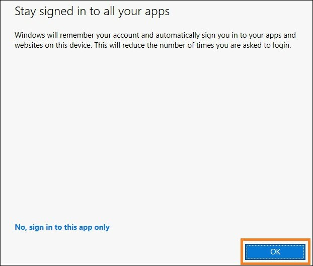

# **Microsoft Fabric - Fabric Analyst in a Day - Lab 1**

## Contents	

- Document Structure

- Scenario / Problem Statement

- Overview of Power BI Desktop Report
    
    - Task 1: Set up Power BI Desktop in lab environment
    
    - Task 2: Analyze Power BI Desktop Report
    
    - Task 3: Review Power Queries

# Document Structure

The lab includes steps for the user to follow along with associated
screenshots that provide visual aid. In each screenshot, sections are
highlighted with orange boxes to indicate the area(s) user should focus
on.

**Note**: Some of the screenshots may be out of date due to ongoing
product updates.

# Scenario / Problem Statement

Fabrikam, Inc. is a wholesale novelty goods distributor. As a
wholesaler, Fabrikam's customers are mostly companies that resell to
individuals. Fabrikam sells to retail customers across the United States
including specialty stores, supermarkets, computing stores, and tourist
attraction shops. Fabrikam also sells to other wholesalers via a network
of agents who promote the products on Fabrikam's behalf. While all of
Fabrikam's customers are currently based in the United States, the
company intends to push for expansion into other countries/regions.

You are a Data Analyst in the Sales team. You collect, clean, and
interpret data sets to solve business problems. You also put together
visualizations like charts and graphs, write reports, and present them
to the decision-makers in the organization.

In order to draw valuable insights from the data, you pull data from
multiple systems, clean it and mash it together. You pull data from the
following sources:

- **Sales Data**: comes from the ERP system and data is stored in anADLS Gen2 database. It gets updated at noon / 12 PM every day.

- **Supplier Data**: comes from different suppliers and data is storedin a Snowflake database. It gets updated at midnight / 12 AM everyday.

- **Customer Data**: comes from Customer Insights and data is storedin Dataverse. The data is always up to date.

- **Employee Data**: comes from the HR system; it is stored as anexport file in a SharePoint folder. It gets updated every morning at9 AM.

    

You are currently building a dataset on Power BI Premium that pulls the
data from the above source systems to satisfy your reporting needs as
well as provide end users with the ability to self-serve. You use Power
Query to update your model.

**You are facing the following challenges:**

- You need to refresh your dataset at least three times a day toaccommodate the different update times for the different datasources.

- Your refreshes take a long time as you need to do a full refreshevery time to capture any updates that happened to the sourcesystems.

- Any errors in any of the data sources that you are pulling from willresult in your dataset refresh breaking. A lot of times the employeefile does not upload on time resulting in your dataset refreshbreaking.

- It takes a very long time to make any changes to your data model asPower Query takes a long time to refresh your previews, given thelarge data sizes and complex transformations.

- You need a Windows PC to use Power BI Desktop even though thecorporate standard is Mac. You heard about Microsoft Fabric anddecided to try it to see if it will address your challenges.

### Overview of Power BI Desktop Report

Before we start with Fabric, let's look at the current Report in Power
BI Desktop to understand the transformations and the model.

### Task 1: Set up Power BI Desktop in lab environment

1. Open the **FAIAD.pbix** located in the **Reports** folder on the **desktop** of your lab environment. The file will open in Power BIDesktop.

    

2. Once the "Enter your email address" dialog appears, copy the **Username** and paste it into the **Email** field of the dialog and select **Continue**.

    - Email/Username:

      

3. On the Sign into Microsoft Azure tab you will see the login screen,in that enter the following Email/Username and then click on Next.

    - Email/Username:

4. Now enter the following **Password** and click on **Sign in.**

    

5. **Stay Signed in to all your apps** dialog opens. Select **OK**.

    

6. **You're all set !** dialog opens. Select **Done**.

### Task 2: Analyze Power BI Desktop Report

The report below analyzes Sales for Fabrikam. KPIs are listed on the
left top of the page. The remaining visuals highlight Sales over time,
by Territory, Product Group, and Reseller Company.

**Note**: In this training, we are focusing on data acquisition
transformation, and modeling using tools available in Fabric. We will
not be focusing on report development or navigation. Let's spend a
couple of minutes understanding the report and move to the next steps.

1. Let's analyze data by Sales Territory. Select **New England from the Sales Territory** (Scatter plot) visual. Notice from the Sales overtime, Reseller Tailspin Toys has more sales compared to Wingtip Toysin New England. If you look at the Sales YoY% column chart you willnotice that Wingtip Toys sales growth has been low and decliningquarter over quarter during the past year. After a small rebound inQ3 it went down again in Q4.

    

2. Let's compare this to the Rocky Mountain territory. Select **Rocky Mountain from Sales Territory** (Scatter plot) visual. Notice in theSales YoY% column chart, that sales for Wingtip Toys have increaseddramatically in 2023 Q4 after being low for the previous twoquarters.

    

3. Select **Rocky Mountain from Sales Territory** to remove the filter.

4. From the Scatter plot visual on the bottom center of the screen(Sales Orders) select the outlier on the top right (4th quadrant).Notice the margin % is 52%, which is above the average of 50%. Also,the Sales YoY% has gone up in the last two quarters of 2023.

    

5. Select the outlier Reseller in the Scatter plot visual to **remove the filter**.

6. Let's get the Product details by Product Group and Reseller. Fromthe Sales by Product Group and Reseller Company bar chart visual, **right click on the Packaging Materials bar for Tailspin Toys** andfrom the dialog select **Drill through -> Product Detail**.

    

7. You will be navigated to the page which provides the ProductDetails. Notice there are some future orders in place as well.

8. Once you are done reviewing this page, select the **Ctrl+ backarrow** on the top right of the page to be navigated back to theSales Report.

    

9. Feel free to further analyze the report. Once ready let's look atthe model view. From the left panel, select Model view icon.

    

10. Notice there are two fact tables, **Sales** and **PO**.

    a. Granularity of Sales data is by Date, Reseller, Product, and People.
    Date, Reseller, Product, and People connect to Sales.

    b. Granularity of PO data is by Date, Product, and People. Date,
    Product, and People connect to PO.

    c. We have Supplier data by Product. Supplier connects to Product.

    d. We have Reseller's location data by Geo. Geo connects to Reseller.

    e. We have Customer information by Reseller. Customer connects to
    Reseller.

### Task 3: Review Power Queries

1. Let's look at Power Query to understand the data sources. From theribbon select **Home -> Transform data.**

    

2. The Power Query window opens. From the ribbon, select **Home -> Data source settings**. Data source settings dialog opens. As youscroll through the list you will notice there are four data sourcesas mentioned in the problem statement:

    a. Snowflake

    b. SharePoint

    c. ADLS Gen2

    d. Dataverse

3. Select **Close** to close the Data source settings dialog.

    

4. In the left Queries panel, notice the queries are grouped by datasource.

5. Notice **DataverseData** folder has Customer data available in fourdifferent queries: BabyBoomer, GenX, GenY, and GenZ. These fourqueries are appended to create a Customer query.

6. Click on the **Customer** Query from the Queries window. Selectingthis query will require that you re-enter your Dataversecredentials. Click **Edit Credentials**.

    

    

7. Click on **Sign in** to log into your account.

8. You can enter the credentials for the Dataverse data source byentering the **Username** and **Password**. The credentials areprovided below and Select **Connect**.

    - Email/Username:

    - Password:

9. Click on the **ADLS Base Folder** Query from the Queries window.Selecting this query will require the credentials. Click **EditCredentials**.

    

10. For the **ADLS** data source, choose **the Shared access signature (SAS)** option and enter the **SAS token** provided below. Then, select **Connect**.

    - **SAS token**:

      

11. Notice the **ADLSData** folder has multiple dimensions: Geo, Product, Reseller, and Date. It also has Sales facts.

    a. **Geo dimension** is created by merging data from Cities, Countries, and States query.

    b. **Product dimension** is created by merging data from Product Groups and Product Item Group query.

    c. **Reseller dimension** is filtered using BuyingGroup query.

    d. **Sales fact** is created by merging InvoiceLineItems with Invoice query.

12. For the Snowflake data source, select the **SupplierCategories** query from the Queries window. Selecting this query will prompt youfor credentials. Click **Edit Credentials**.

    

13. Enter the **Snowflake Username** and **Snowflake Password** provided below. Use these credentials to connect all the tables underSnowflake to Snowflake and then select Connect.

    - Snowflake Username:

    - Snowflake Password:

    **Note:** If you encounter any issues connecting to Snowflake using the
credentials from the environment details, please use the credentials
provided below.

    - Snowflake Username: SNOWFLAKE_BACKUP

    - Snowflake Password: 8UpfRpExVDXv2AC1

14. Notice the **SnowflakeData** folder has Supplier dimension and PO(Order / Spend) fact.

    a. **Supplier dimension** is created by merging Suppliers query with
    SupplierCategories query.

    b. **PO fact** is created by merging PO with PO Line Items query.

15. For the SharePoint data source, select the **People** query from theQueries window. Selecting this query will prompt you for credentials. Click **Edit Credentials**.

    

16. Select the **Microsoft account** option, then click **Sign in**. Enter the Username and Password provided below, and then selectConnect.

    - Email/Username:

    - Password:

    

17. Notice the **SharepointData** folder has People dimension.

    

Now we know what we are dealing with. In the following labs, we will
create a similar Power Query using Dataflow Gen2 and model using
Lakehouse.

