# Microsoft Fabric - Fabric Analyst in a Day - Lab 1

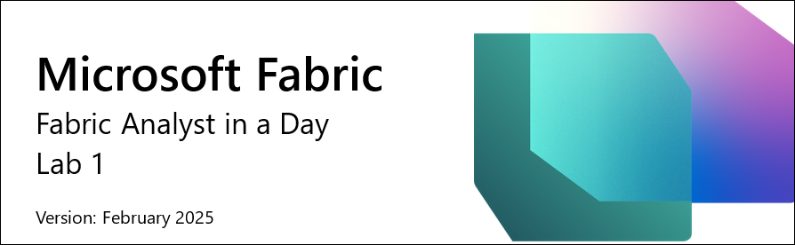

# Contents	

- Document Structure

- Scenario / Problem Statement

- Overview of Power BI Desktop Report
    
    - Task 1: Set up Power BI Desktop in lab environment
    
    - Task 2: Analyze Power BI Desktop Report
    
    - Task 3: Review Power Queries

# Document Structure

The lab includes steps for the user to follow along with associated
screenshots that provide visual aid. In each screenshot, sections are
highlighted with orange boxes to indicate the area(s) the user should focus
on.

>**Note:** Some of the screenshots may be out of date due to ongoing
product updates.

# Scenario/ Problem Statement

Fabrikam, Inc. is a wholesale novelty goods distributor. As a
wholesaler, Fabrikam's customers are mostly companies that resell to
individuals. Fabrikam sells to retail customers across the United States
including specialty stores, supermarkets, computing stores, and tourist
attraction shops. Fabrikam also sells to other wholesalers via a network
of agents who promote the products on Fabrikam's behalf. While all of
Fabrikam's customers are currently based in the United States, the
company intends to push for expansion into other countries/ regions.

You are a data analyst on the sales team. You collect, clean, and
interpret data sets to solve business problems. You also put together
visualizations like charts and graphs, write reports, and present them
to the decision-makers in the organization.

In order to draw valuable insights from the data, you pull data from
multiple systems, clean it and mash it together. You pull data from the
following sources:

- **Sales Data:** Comes from the ERP system, and data is stored in an ADLS Gen2 database. It gets updated at noon/ 12 PM every day.

- **Supplier Data:** Comes from different suppliers, and data is stored in a Snowflake database. It gets updated at midnight/ 12 AM every day.

- **Customer Data:** Comes from Customer Insights and data is stored in Dataverse. The data is always up to date.

- **Employee Data:** Comes from the HR system; it is stored as an export file in a SharePoint folder. It gets updated every morning at 9 AM.

    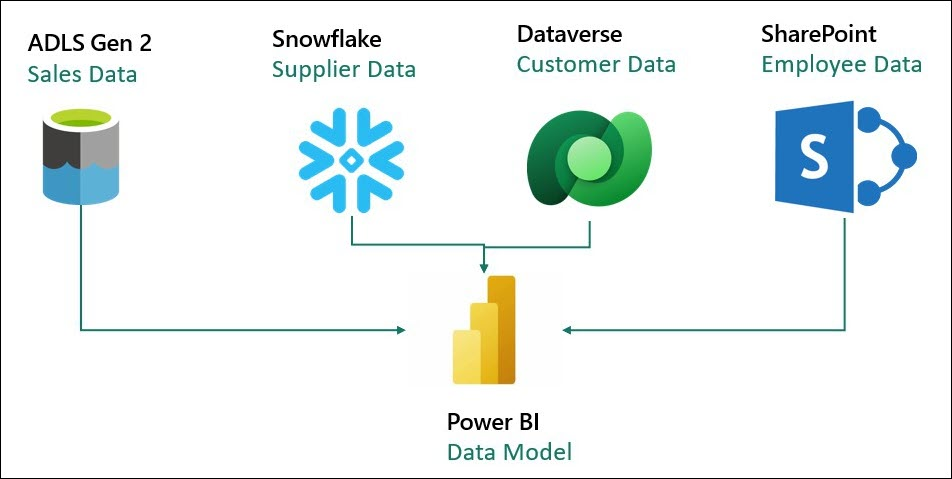

You are currently building a dataset on Power BI Premium that pulls the
data from the above source systems to satisfy your reporting needs as
well as provide end users with the ability to self-serve. You use Power
Query to update your model.

**You are facing the following challenges:**

- You need to refresh your dataset at least three times a day to accommodate the different update times for the different data sources.

- Your refreshes take a long time as you need to do a full refresh every time to capture any updates that happened to the source systems.

- Any errors in any of the data sources that you are pulling from will result in your dataset refresh breaking. A lot of times the employee file does not upload on time resulting in your dataset refresh breaking.

- It takes a very long time to make any changes to your data model as Power Query takes a long time to refresh your previews, given the large data sizes and complex transformations.

- You need a Windows PC to use Power BI Desktop even though the corporate standard is Mac. You heard about Microsoft Fabric and decided to try it to see if it will address your challenges.

### Overview of Power BI Desktop Report

Before we start with Fabric, let's look at the current Report in Power
BI Desktop to understand the transformations and the model.

## Task 1: Set up Power BI Desktop in lab environment

1. Open the **FAIAD.pbix** located in the **Reports** folder on the **desktop** of your lab environment. The file will open in Power BI Desktop.

    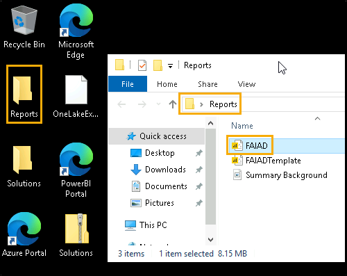

2. Once the "Enter your email address" dialog appears, copy the **Username** and paste it into the **Email** field of the dialog and select **Continue**.

   * Email/Username: <inject key="AzureAdUserEmail"></inject>

      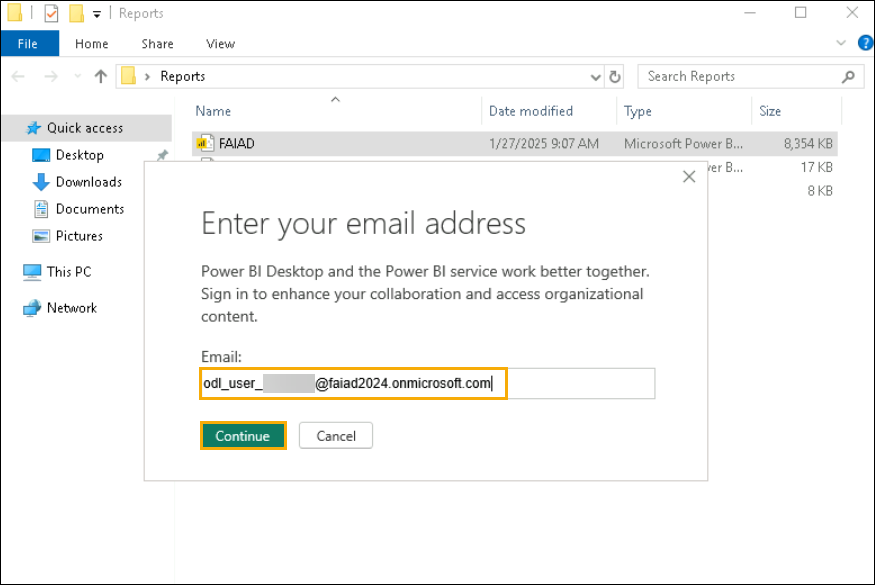

3. On the Sign into Microsoft Azure tab you will see the login screen, in that enter the following Email/ Username and then click on Next.

   * Email/Username: <inject key="AzureAdUserEmail"></inject>

     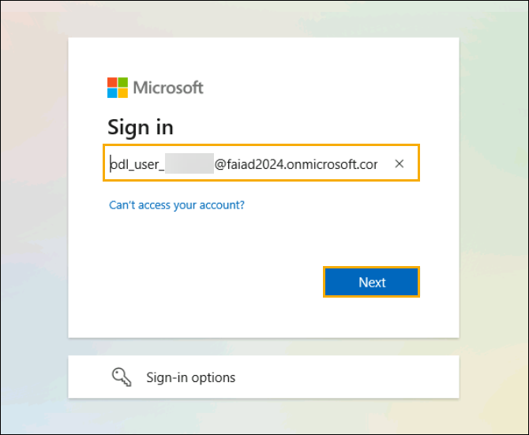

4. Now enter the following **Password** and click on **Sign in**.

    * Password: <inject key="AzureAdUserPassword"></inject>

      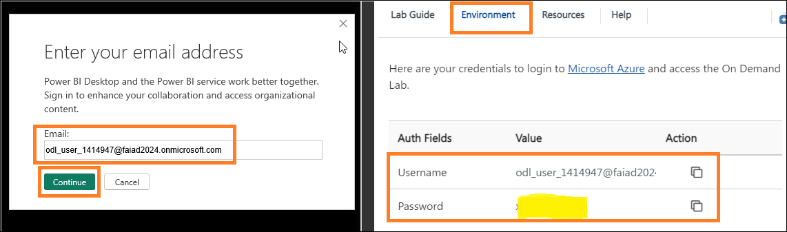

5. **Automatically sign in to all desktop apps and websites on this device?** dialog opens. Select **Yes, all apps**.

    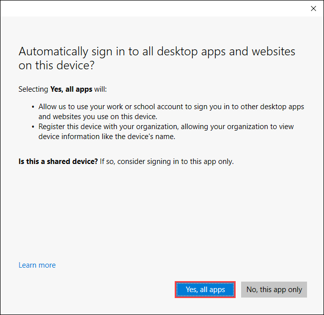

6. **You're all set!** dialog opens. Select **Done**.

## Task 2: Analyze Power BI Desktop Report

The report below analyzes Sales for Fabrikam. KPIs are listed at the top left of the page. The remaining visuals highlight Sales over time by Territory, Product Group, and Reseller Company.

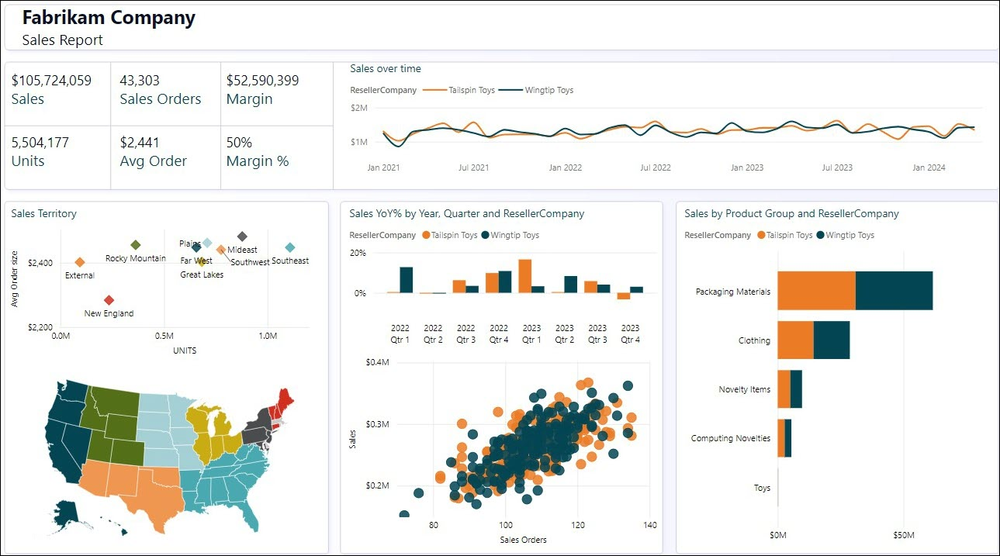

>**Note:** In this training, we are focusing on data acquisition
transformation, and modeling using tools available in Fabric. We will
not be focusing on report development or navigation. Let's spend a
couple of minutes understanding the report and move to the next steps.

1. Let's analyze data by Sales Territory. Select **New England from the Sales Territory** (Scatter plot) visual. Notice from the Sales overtime, Reseller Tailspin Toys has more sales compared to Wingtip Toys in New England. If you look at the Sales YoY% column chart you will notice that Wingtip Toys sales growth has been low and declining quarter over quarter during the past year. After a small rebound in Q3, it went down again in Q4.

    

2. Let's compare this to the Rocky Mountain territory. Select **Rocky Mountain from Sales Territory** (Scatter plot) visual. Notice in the sales YoY% column chart, that sales for Wingtip Toys have increased dramatically in 2023 Q4 after being low for the previous two quarters.

    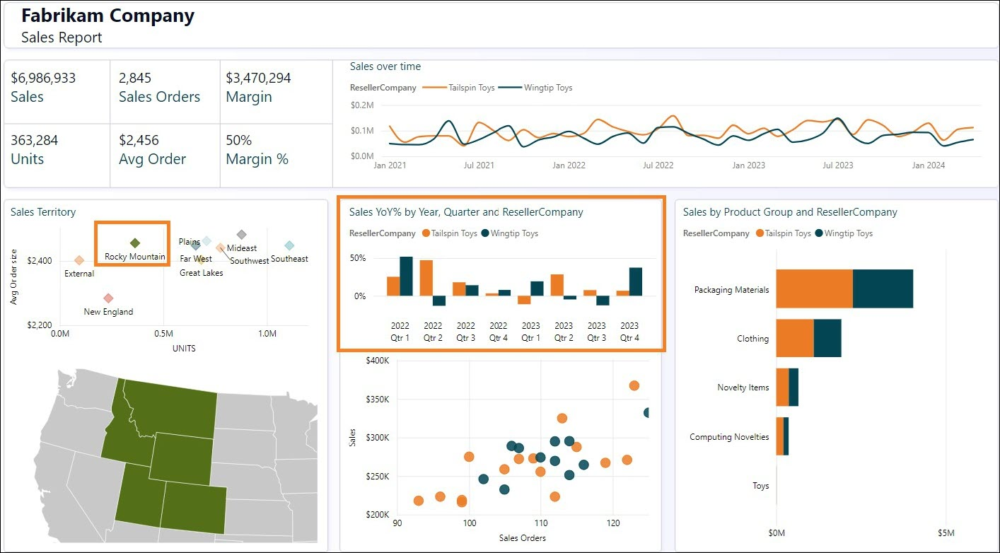

3. Select **Rocky Mountain from Sales Territory** to remove the filter.

4. From the Scatter plot visual on the bottom center of the screen (Sales Orders), select the outlier on the top right (4th quadrant). Notice that the margin % is 52%, which is above the average of 50%. Also, the Sales YoY% has gone up in the last two quarters of 2023.

    

5. Select the outlier Reseller in the Scatter plot visual to **remove the filter**.

6. Let's get the Product details by Product Group and Reseller. From the Sales by Product Group and Reseller Company bar chart visual, **right click on the Packaging Materials bar for Tailspin Toys** and from the dialog select **Drill through -> Product Detail**.

    

7. You will be navigated to the page which provides the Product Details. Notice there are some future orders in place as well.

8. Once you are done reviewing this page, select the **Ctrl+ back arrow** on the top right of the page to be navigated back to the sales Report.

    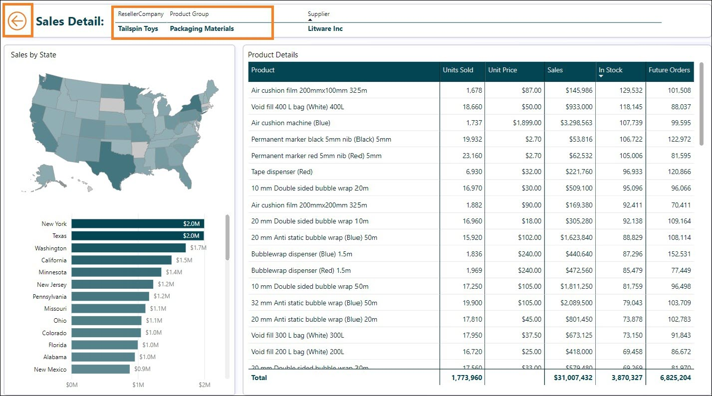

9. Feel free to further analyze the report. Once ready let's look at the model view. From the left panel, select Model view icon.

    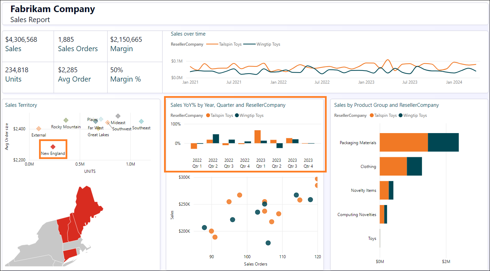

10. Notice there are two fact tables, **Sales** and **PO**.

    a. Granularity of Sales data is by Date, Reseller, Product, and People. Date, Reseller, Product, and People connect to Sales.

    b. Granularity of PO data is by Date, Product, and People. Date, Product and People connect to PO.

    c. We have Supplier data by Product. Supplier connects to Product.

    d. We have Reseller's location data by Geo. Geo connects to Reseller.

    e. We have Customer information by Reseller. Customer connects to
    Reseller.

## Task 3: Review Power Queries

1. Let's look at Power Query to understand the data sources. From the ribbon select **Home -> Transform data**.

    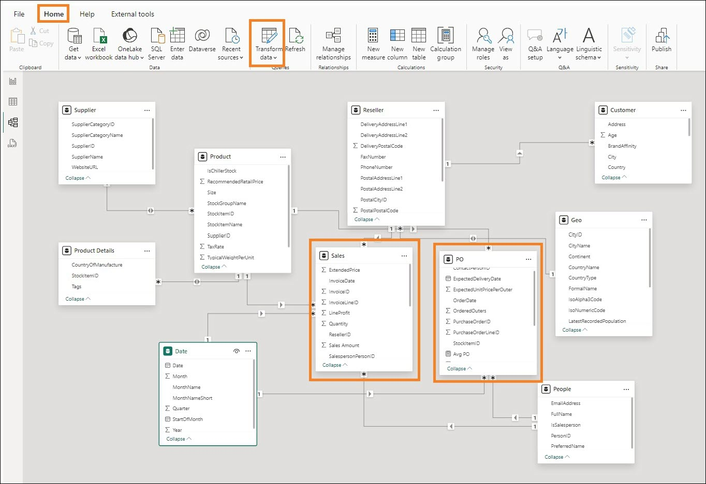

2. The Power Query window opens. From the ribbon, select **Home -> Data source settings**. Data source settings dialog opens. As you scroll through the list, you will notice there are four data sources as mentioned in the problem statement:

    a. Snowflake

    b. SharePoint

    c. ADLS Gen2

    d. Dataverse

3. Select **Close** to close the Data source settings dialog.

    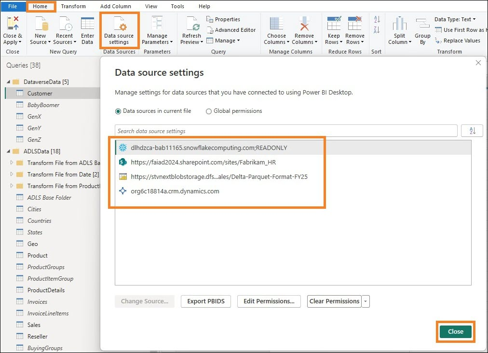

4. In the left Queries panel, notice the queries are grouped by datasource.

5. Notice **DataverseData** folder has Customer data available in four different queries: BabyBoomer, GenX, GenY, and GenZ. These four queries are appended to create a Customer query.

6. Click on the **Customer** Query from the Queries window. Selecting this query will require that you re-enter your Dataverse credentials. Click **Edit Credentials**.

    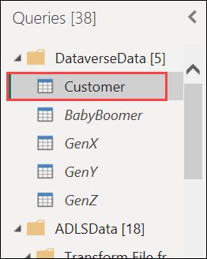

    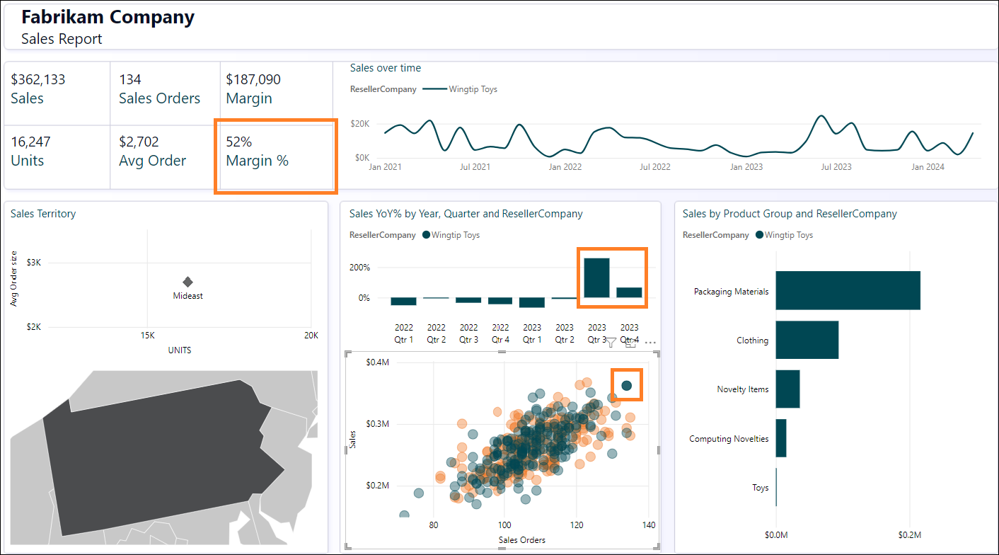

7. Click on **Sign in** to log into your account.

8. You can enter the credentials for the Dataverse data source by entering the **Username** and **Password**. The credentials are provided below. Select **Connect**.

    * Email/Username: <inject key="AzureAdUserEmail"></inject>

    * Password: <inject key="AzureAdUserPassword"></inject>

9. Click on the **ADLS Base Folder** Query from the Queries window. Selecting this query will require credentials. Click **Edit Credentials**.

    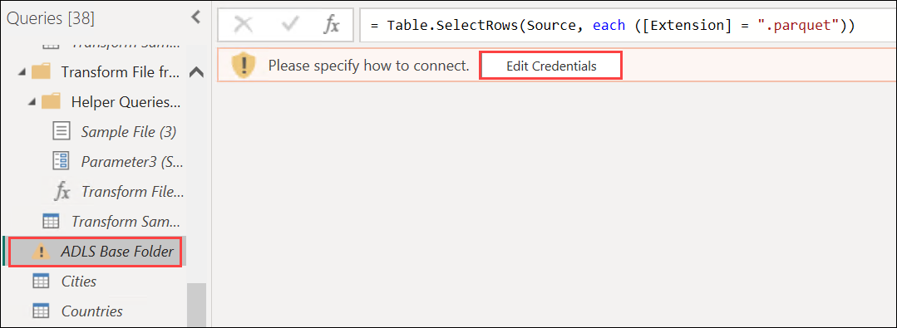

10. For the **ADLS** data source, choose the **Shared access signature (SAS)** option and enter the **SAS token** provided below. Then, select **Connect**.

    * **SAS token:** <inject key="Sas token"></inject>

      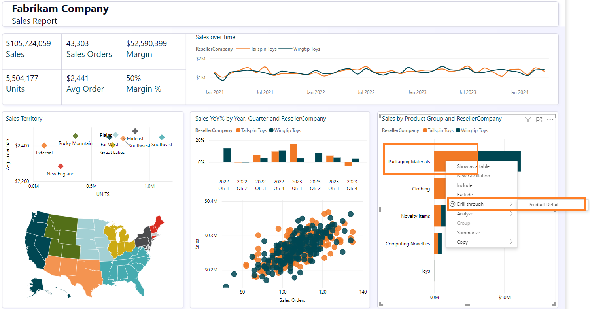

11. Notice the **ADLSData** folder has multiple dimensions: Geo, Product, Reseller, and Date. It also has Sales facts.

    a. **Geo dimension** is created by merging data from the Cities, Countries, and States query.

    b. **Product dimension** is created by merging data from Product Groups and Product Item Group query.

    c. **Reseller dimension** is filtered using BuyingGroup query.

    d. **Sales fact** is created by merging InvoiceLineItems with Invoice query.

12. For the Snowflake data source, select the **SupplierCategories** query from the Queries window. Selecting this query will prompt you for credentials. Click **Edit Credentials**.

    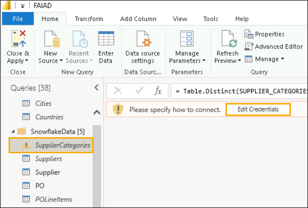

13. Enter the **Snowflake Username** and **Snowflake Password** provided below. Use these credentials to connect all the tables under Snowflake to Snowflake and then select Connect.

    * Snowflake Username: <inject key="SnowFlake Username"></inject>
    
    * Snowflake Password: <inject key="SnowFlake Password"></inject>

    >**Note:** If you encounter any issues connecting to Snowflake using the credentials from the environment details, please use the credentials provided below.

    - Snowflake Username: SNOWFLAKE_BACKUP

    - Snowflake Password: 8UpfRpExVDXv2AC1

    >**Note:** Please Do Not enter the wrong username or password more than three times, as this will lock the Snowflake account for everyone. If you’re having trouble logging in, please contact `cloudlabs-support@spektrasystems.com` instead of trying multiple times.

14. Notice the **SnowflakeData** folder has Supplier dimension and PO(Order / Spend) fact.

    a. **Supplier dimension** is created by merging Suppliers query with SupplierCategories query.

    b. **PO fact** is created by merging PO with PO Line Items query.

15. For the SharePoint data source, select the **People** query from the Queries window. Selecting this query will prompt you for credentials. Click **Edit Credentials**.

    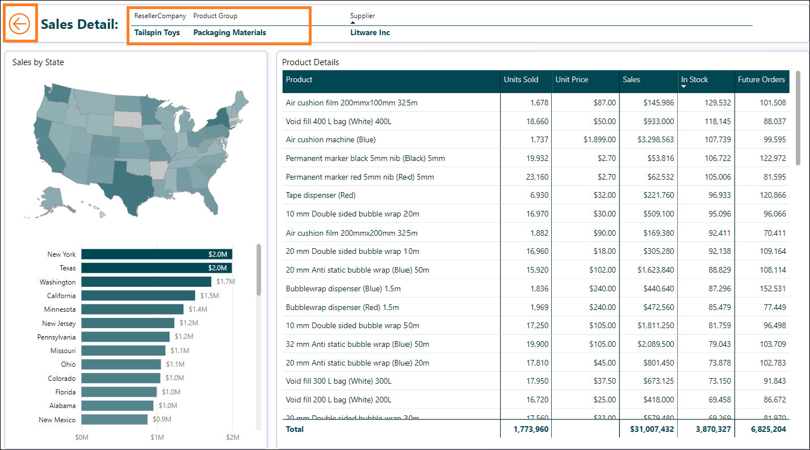

16. Select the **Microsoft account** option, then click **Sign in**. Enter the Username and Password provided below, and then select **Connect**.

    * Email/Username: <inject key="AzureAdUserEmail"></inject>

    * Password: <inject key="AzureAdUserPassword"></inject>

      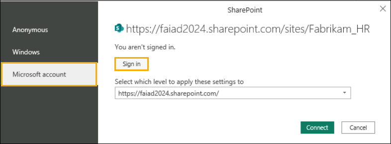

17. Notice the **SharepointData** folder has People dimension.

    

Now we know what we are dealing with. In the following labs, we will create a similar Power Query using Dataflow Gen2 and model using Lakehouse.

### References
Fabric Analyst in a Day (FAIAD) introduces you to some of the key functions available in Microsoft Fabric. In the menu of the service, the Help (?) section has links to some great resources.

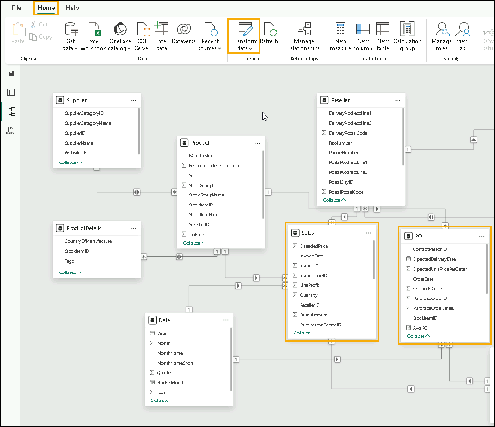
 
Here are a few more resources that will help you with your next steps with Microsoft Fabric.

- See the blog post to read the full [Microsoft Fabric GA announcement](https://aka.ms/Fabric-Hero-Blog-Ignite23)
- Explore Fabric through the [Guided Tour](https://aka.ms/Fabric-GuidedTour)
- Sign up for the [Microsoft Fabric free trial](https://aka.ms/try-fabric)
- Visit the [Microsoft Fabric website](https://aka.ms/microsoft-fabric)
- Learn new skills by exploring the [Fabric Learning modules](https://aka.ms/learn-fabric)
- Explore the [Fabric technical documentation](https://aka.ms/fabric-docs)
- Read the [free e-book on getting started with Fabric](https://aka.ms/fabric-get-started-ebook)
- Join the [Fabric community ](https://aka.ms/fabric-community) to post your questions, share your feedback, and learn from others

Read more in-depth Fabric experience announcement blogs:

- [Data Factory experience in Fabric blog](https://aka.ms/Fabric-Data-Factory-Blog) 
- [Synapse Data Engineering experience in Fabric blog](https://aka.ms/Fabric-DE-Blog) 
- [Synapse Data Science experience in Fabric blog](https://aka.ms/Fabric-DS-Blog) 
- [Synapse Data Warehousing experience in Fabric blog](https://aka.ms/Fabric-DW-Blog) 
- [Synapse Real-Time Analytics experience in Fabric blog](https://aka.ms/Fabric-RTA-Blog)
- [Power BI announcement blog](https://aka.ms/Fabric-PBI-Blog)
- [Data Activator experience in Fabric blog](https://aka.ms/Fabric-DA-Blog) 
- [Administration and governance in Fabric blog](https://aka.ms/Fabric-Admin-Gov-Blog)
- [OneLake](https://aka.ms/Fabric-OneLake-Blog)[ in Fabric blog](https://aka.ms/Fabric-OneLake-Blog)
- [Dataverse and Microsoft Fabric integration blog](https://aka.ms/Dataverse-Fabric-Blog)

© 2025 Microsoft Corporation. All rights reserved.

By using this demo/ lab, you agree to the following terms:

The technology/ functionality described in this demo/ lab is provided by Microsoft Corporation for the purposes of obtaining your feedback and providing you with a learning experience. You may only use the demo/ lab to evaluate such technology features and functionality and provide feedback to Microsoft. You may not use it for any other purpose. You may not modify, copy, distribute, transmit, display, perform, reproduce, publish, license, create derivative works from, transfer, or sell this demo/ lab or any portion thereof.

COPYING OR REPRODUCTION OF THE DEMO/ LAB (OR ANY PORTION OF IT) TO ANY OTHER SERVER OR LOCATION FOR FURTHER REPRODUCTION OR REDISTRIBUTION IS EXPRESSLY PROHIBITED.

THIS DEMO/ LAB PROVIDES CERTAIN SOFTWARE TECHNOLOGY/ PRODUCT FEATURES AND FUNCTIONALITY, INCLUDING POTENTIAL NEW FEATURES AND CONCEPTS, IN A SIMULATED ENVIRONMENT WITHOUT COMPLEX SET-UP OR INSTALLATION FOR THE PURPOSE DESCRIBED ABOVE. THE TECHNOLOGY/ CONCEPTS REPRESENTED IN THIS DEMO/ LAB MAY NOT REPRESENT FULL FEATURE FUNCTIONALITY AND MAY NOT WORK THE WAY A FINAL VERSION MAY WORK. WE ALSO MAY NOT RELEASE A FINAL VERSION OF SUCH FEATURES OR CONCEPTS. YOUR EXPERIENCE WITH USING SUCH FEATURES AND FUNCTIONALITY IN A PHYSICAL ENVIRONMENT MAY ALSO BE DIFFERENT.

**FEEDBACK**. If you give feedback about the technology features, functionality and/ or concepts described in this demo/ lab to Microsoft, you give to Microsoft, without charge, the right to use, share and commercialize your feedback in any way and for any purpose. You also give to third parties, without charge, any patent rights needed for their products, technologies and services to use or interface with any specific parts of a Microsoft software or service that includes the feedback. You will not give feedback that is subject to a license that requires Microsoft to license its software or documentation to third parties because we include your feedback in them. These rights survive this agreement.

MICROSOFT CORPORATION HEREBY DISCLAIMS ALL WARRANTIES AND CONDITIONS WITH REGARD TO THE DEMO/ LAB, INCLUDING ALL WARRANTIES AND CONDITIONS OF MERCHANTABILITY, WHETHER EXPRESS, IMPLIED OR STATUTORY, FITNESS FOR A PARTICULAR PURPOSE, TITLE AND NON-INFRINGEMENT. MICROSOFT DOES NOT MAKE ANY ASSURANCES OR REPRESENTATIONS WITH REGARD TO THE ACCURACY OF THE RESULTS, OUTPUT THAT DERIVES FROM USE OF DEMO/ LAB, OR SUITABILITY OF THE INFORMATION CONTAINED IN THE DEMO/LAB FOR ANY PURPOSE.

**DISCLAIMER**

This demo/ lab contains only a portion of new features and enhancements in Microsoft Power BI. Some of the features might change in future releases of the product. In this demo/ lab, you will learn about some, but not all, new features.
