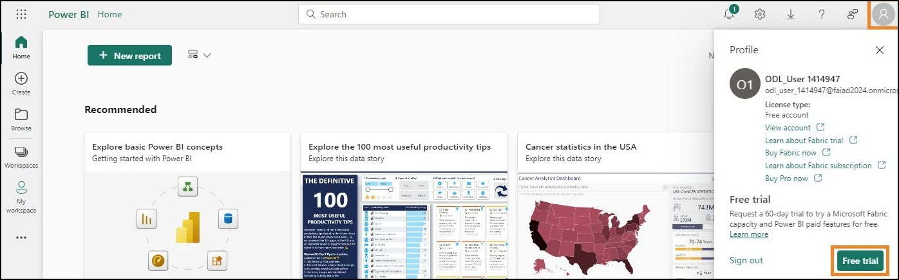
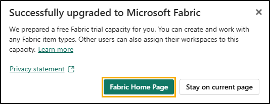
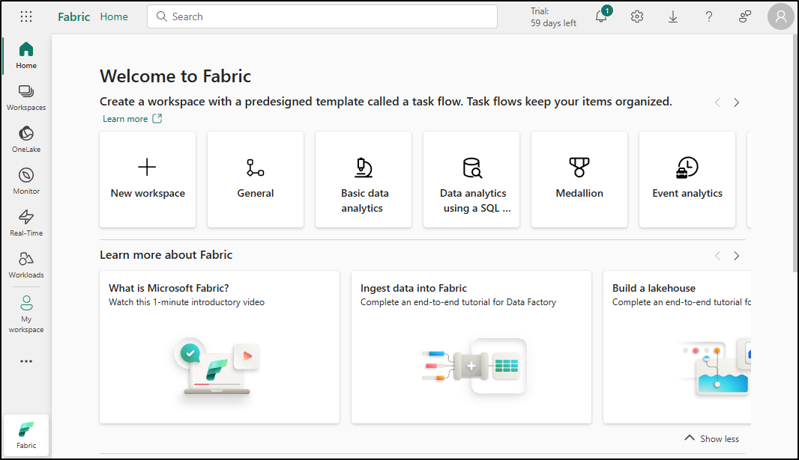
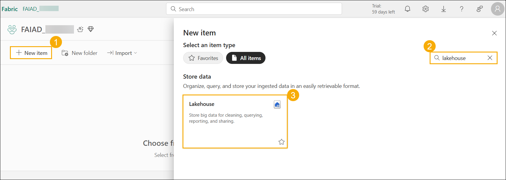

# Microsoft Fabric - Fabric Analyst in a Day - Lab 2
## Contents	
- Introduction
- Fabric License
    - Task 1: Enable a Microsoft Fabric trial license
- Overview of Fabric Experiences
    - Task 2: Data Factory Experience
    - Task 3: Industry Solutions Experience
    - Task 4: Real-Time Intelligence Experience
    - Task 5: Data Engineering Experience
    - Task 6: Data Science Experience
    - Task 7: Data Warehouse Experience
- Fabric Workspace
    - Task 8: Create a Fabric Workspace
    - Task 9: Create a Lakehouse
- References

# Introduction 

Today you will learn about various key features of Microsoft Fabric.
This is an introductory workshop intended to introduce you to the
various product experiences and items available in Fabric. By the end of
this workshop, you will learn how to use Lakehouse, Dataflow Gen2, Data
Pipeline, DirectLake and more.

By the end of this lab, you will have learned:

- How to create a Fabric workspace

- How to create a Lakehouse

# Fabric License

### Task 1: Enable a Microsoft Fabric trial license

1. Open the **browser** and navigate to [Microsoft Power BI Portal](https://app.powerbi.com). You will be navigated to the login page.

    **Note**: If you're using the lab environment, it may sign you in
    directly.

    **Note:** If you are not using the lab environment and have an existing
    Power BI account, you may want to use the browser in private  incognito
    mode.

2. Copy the **Username** and paste it into the **Email** field of the dialog and select **Submit**.

   * Email/Username: <inject key="AzureAdUserEmail"></inject>

     

3. On the **Sign into Microsoft Azure** tab you will see the login
screen, in that enter the following **EmailUsername** and then
click on **Next**.

   * Email/Username: <inject key="AzureAdUserEmail"></inject>

     

4. Now enter the following **Password** and click on **Sign in**.

   * Password: <inject key="AzureAdUserPassword"></inject>

     

5. You will be navigated to the familiar **Power BI Service Home
page**.

6. We assume you are familiar with the layout of Power BI Service. If
you have any questions, please do not hesitate to ask the
instructor.

    Currently, you are in **My Workspace**. To work with Fabric items, you
    will need a trial license and a workspace that has a Fabric license
    assigned. Let's set this up.

7. On the top right corner of the screen, select the **User icon**.

8. Select **Free trial**.

   

9. Upgrade to a free Microsoft Fabric trial dialog opens. Select
**Activate.**

   

10. Successfully upgraded to Microsoft Fabric dialog opens. Select
**Fabric Home Page**.

    

11. You will be navigated to the **Microsoft** **Fabric Home page**.

    

# Overview of Fabric Experiences

### Task 2: Data Factory Experience

1. Select Workloads icon on the left of your screen. A dialog with the
list of Fabric experiences will open. The list of experiences
includes Power BI, Data Factory, Industry Solutions, Real-Time
Intelligence, Data Engineering, Data Science and Data Warehouse.
Let's explore.

   

2. Select **Data Factory**.

   

3. You will be directed to the Data Factory Home page. Below is a
detailed explanation of its sections, designed to guide you
step-by-step in effectively using Data Factory. Dataflow Gen2 is the
next generation of Dataflow.

   ### What is Data Factory?

   Data Factory is a tool that helps you manage and organize data from
   different sources. It allows you to collect, prepare, and transform data
   so that it can be used effectively. Whether you are a beginner or an
   expert, Data Factory provides tools to make data transformation easier
   and more efficient.

   ### Item types:

   a. **Dataflows**: Dataflows are like recipes for transforming data.
    They offer over 300 different transformations that you can apply to
    your data. This means you can clean, combine, and change your data in
    many ways to suit your needs.

   b. **Pipelines**: Pipelines are workflows that help you automate data
    processes. They allow you to create flexible data workflows that can
    be tailored to your specific requirements. This makes it easier to
    manage and process data in a structured way.

   c. **Azure Data Factory (preview):** Azure Data Factory is a
    cloud-based data integration service that allows you to create
    data-driven workflows for orchestrating and automating data movement
    and data transformation.

   d. **Apache Airflow Job (preview):** Apache Airflow is an open-source
    platform used to programmatically author, schedule, and monitor
    workflows. In Data Factory, it allows you to create, schedule, and
    manage complex data workflows.

   e. **Copy Job (preview):** Copy Job is a feature that allows you to
    copy data from one source to another. It provides a simple and
    efficient way to move data between different data stores.

   f. **Mirrored Database (preview):** A feature for creating mirrored
    versions of databases for backup, testing, or read-only access.

   ### Get Started:

   To start using Data Factory, you can follow these steps:

   a. **Learn to Use Data Factory:** This section helps you get started
    with Data Factory. It provides guidance on how to begin using the tool
    effectively.

   b. **Create Your First Dataflow:** Here, you can learn how to create
    your first dataflow. Dataflows are essential for transforming your
    data according to your needs.

   c. **Create Your First Data Pipeline:** This section guides you on
    how to create your first data pipeline. Pipelines help automate and
    manage your data processes efficiently.

   d. **Learn to Monitor Data Factory:** Monitoring is crucial to ensure
    that your data processes are running smoothly. This section teaches
    you how to monitor your Data Factory activities.

   e. **Learn to Transform Data with Dataflows:** This section helps you
    understand how to use dataflows to transform your data effectively.

   f. **Create Your First API for GraphQL:** If you are interested in
    using APIs with GraphQL, this section will guide you on how to get
    started.

   g. **Create Your First User Data Functions:** This section helps you
    create user data functions, which are useful for managing and
    transforming user data.

    

4. Click on **Return to workloads** at the top left corner of the
screen. This action will take you to the main workloads page, where
you can explore other tools or sections.

   

### Task 3: Industry Solutions Experience

1. From the **Workloads** page, click on **Industry Solutions** to
proceed.

   

2. You will be directed to the **Industry Solutions** Home page. Below
is a detailed overview of its sections, designed to help you use
**Industry** **Solutions** effectively and step-by-step.

   ### What are Industry Solutions?

    Industry Solutions are ready-to-use data solutions in Microsoft Fabric
    that provide solutions and resources for various industries. Industry
    Solutions help you get started with key business scenarios using
    industry-related data models, connectors, transformations, reports, and
    other assets.

   ### Item types:

   a. **Sustainability solutions:** supports the ingestion,
    standardization, and analysis of Environmental, Social, and Governance
    (ESG) data.

   b. **Retail solutions**: helps in managing large volumes of data,
    integrating data from various sources, and providing real-time
    analytics for prompt decision-making. Retailers can use these
    solutions for inventory optimization, customer segmentation, sales
    forecasting, dynamic pricing, and fraud detection.

   c. **Healthcare solutions**: are strategically designed to accelerate
    the time to value for customers by addressing the critical need to
    efficiently transform healthcare data into a suitable format for
    analysis.

   ### Get Started:

   To start using Industry Solutions, follow these steps:

   a. **Learn About Healthcare Data Solutions**: Click on the "Learn
    more" button to read about healthcare data solutions and understand
    how they can be used in your projects.

   b. **Deploy Healthcare Data Solutions**: Click on the "Deploy" button
    to start deploying healthcare data solutions and implement them in
    your projects.

   c. **Learn About Sustainability Solutions**: Click on the "Learn
    more" button to read about sustainability solutions and understand how
    they can be used in your projects.

   d. **Deploy Sustainability Solutions**: Click on the "Deploy" button
    to start deploying sustainability solutions and implement them in your
    projects.

   e. **Learn About Retail Solutions**: Click on the "Learn more" button
    to read about retail solutions and understand how they can be used in
    your projects.

   f. **Deploy Retail Solutions**: Click on the "Deploy" button to start
    deploying retail solutions and implement them in your projects.

3. Click on **Return to workloads** at the top left corner of the screen.
    This action will take you to the main workloads page, where you can
    explore other tools or sections.

    

### Task 4: Real-Time Intelligence Experience

1. From the **Workloads** page, click on **Real-Time Intelligence** to
proceed.

   

2. You will be directed to the **Real-Time Intelligence** Home page.
Below is a detailed overview of its sections, designed to help you
use **Real-Time Intelligence** effectively and step-by-step.

   ### What is Real-Time Intelligence?

   Real-Time Intelligence is a tool that helps you manage and analyze
   high-volume, high-granularity data from various sources. It allows you
   to ingest, analyze, and take action on your data in real-time, improving
   your business operations with timely decision-making and actions.

   ### Item types:

   a. **Eventhouse**: Used to create a workspace of one or multiple KQL
    databases, which can be shared across projects.

   b. **KQL Queryset**: Used to run queries on the data to produce
    shareable tables and visuals.

   c. **Real-Time Dashboard**: Used to visualize real-time dashboards
    within seconds from data ingestion.

   d. **Eventstream**: Used to capture, transform, and route real-time
    event stream.

   e. **Activator**: Used to monitor datasets, queries, and event
    streams for patterns.

   ### Get Started:

   To start using Real-Time Intelligence, follow these steps:

   a. **Explore Real-Time Intelligence Sample**: Click on the "Open"
    button to explore real-time data analysis with a sample.

   b. **Explore a Sample**: Click on the "Select" button to use a sample
    and learn about Real-Time Intelligence.

   c. **Introduction to Real-Time Intelligence**: Click on the "Open"
    button to get an overview of Real-Time Intelligence and begin using
    the tool effectively.

   d. **Learn KQL with Sample Data**: Click on the "Open" button to learn
    KQL using sample data.

   e. **What's a Real-Time Hub**: Click on the "Open" button to learn
    what a Real-Time Hub is and how it can be used.

   f. **Explore a Sample Activator**: Click on the "Open" button to use
    a sample activator and understand the features and capabilities of
    Real-Time Intelligence.

   g. **Get Started with Activator**: Click on the "Open" button to get
    started with activator concepts and begin using the tool effectively.

    

3. Click on **Return to workloads** at the top left corner of the screen.
This action will take you to the main workloads page, where you can
explore other tools or sections.

   

### Task 5: Data Engineering Experience

1. From the **Workloads** page, click on **Data Engineering** to
proceed.

   

2. You will be directed to the **Data Engineering** Home page. Below is
a detailed overview of its sections, designed to help you use
**Data** **Engineering** effectively and step-by-step.

   ### What is Data Engineering?

   Data Engineering is a tool that helps you design, build, and maintain
   infrastructures and systems for collecting, storing, processing, and
   analyzing large volumes of data. It allows you to create a lakehouse and
   operationalize your workflow to build, transform, and share your data
   estate.

   Item types:

   a. **Lakehouse**: Used to store big data for cleaning, querying,
    reporting, and sharing.

   b. **Notebook**: Used for data ingestion, preparation, analysis and
    other data-related tasks using various languages like Python, R and
    Scala.

   c. **Environment**: Used to set up shared libraries, spark compute
    settings and resources for notebooks and spark job definitions.

   d. **Spark Job Definition**: Used to define, schedule, and manage
    Apache jobs.

   e. **Data pipeline**: Used to orchestrate data solution.

   f. **API for GraphQL**: Is an API to query multiple data sources.

   g. **Import notebook**: Used to import notebooks from a local
    machine.

   ### Get Started:

   To start using Data Engineering, follow these steps:

   a. **Explore a Sample**: Click on the "Select" button to use a sample
    and learn about Data Engineering.

   b. **What's a Lakehouse?:** Click on the "Open" button to learn about
    lakehouses and how they can be used.

   c. **Get Data Experience in Lakehouse**: Click on the "Open" button
    to get started with data engineering using Lakehouses.

   d. **Get Started with Spark Job Definitions**: Click on the "Open"
    button to learn how to use Spark Job Definitions for data processing.

   e. **Develop and Execute Notebooks**: Click on the "Open" button to
    learn how to develop and execute notebooks for data analysis.

   f. **How to Use NotebookUtils**: Click on the "Open" button to learn
    how to use NotebookUtils for enhanced data analysis.

   g. **Leverage Notebooks for Your Lakehouse**: Click on the "Open"
    button to learn how to leverage notebooks for your lakehouse.

   h. **Leverage Datasets for Your Lakehouse**: Click on the "Open"
    button to learn how to leverage datasets for your lakehouse.

   i. **Create Your First User Data Functions**: Click on the "Open"
    button to learn how to create user data functions.

   j. **Create Your First API for GraphQL**: Click on the "Open" button
    to learn how to create an API for GraphQL.

    

3. Click on **Return to workloads** at the top left corner of the
screen. This action will take you to the main workloads page, where
you can explore other tools or sections.

   

### Task 6: Data Science Experience

1. From the **Workloads** page, click on **Data** **Science** to
proceed.

   

2. You will be directed to the **Data Science** Home page. Below is a
detailed overview of its sections, designed to help you use **Data
Science** effectively.

   ### What is Data Science?

   Data Science is a tool that helps you unlock powerful insights using AI
   and machine learning technology. It provides AI tools designed to help
   you complete full-scale data science workflows and harness AI for data
   enrichment and business insights.

   ### Item types:

   a. **ML model**: Used to create machine learning models.

   b. **Experiment**: Used to create, run, and track the development of
    multiple models.

   c. **Notebook**: Used to explore data and build machine learning
    solutions.

   d. **Environment**: Used to set up shared libraries, spark compute
    settings and resources for notebooks and spark job definitions.

   e. **AI Skill**: Used to build your own generative AI experience.

   f. **Python Notebook**: Used to import Python notebooks from a local
    machine.

   ### Get Started:

   To start using Data Science, follow these steps:

   a. **Explore a Sample**: Click on the "Select" button to use a sample
    and learn about Data Science.

   b. **Get Started with ML Models**: Click on the "Open" button to
    learn how to get started with machine learning models.

   c. **Get Started with ML Experiments**: Click on the "Open" button to
    learn how to conduct machine learning experiments.

   d. **Develop and Execute Notebooks**: Click on the "Open" button to
    learn how to develop and execute notebooks for data analysis.

   e. **Get Started with Notebooks**: Click on the "Open" button to
    learn how to get started with notebooks.

    

3. Click **on Return to workloads** at the top left corner of the
screen. This action will take you to the main workloads page, where
you can explore other tools or sections.

   

### Task 7: Data Warehouse Experience

1. From the **Workloads** page, click on **Data Warehouse** to proceed.

   

2. You will be directed to the **Data Warehouse** Home page. Below is a
detailed overview of its sections, designed to help you use **Data
Warehouse** effectively and step-by-step.

   ### What is Data Warehouse?

   Data Warehouse is a tool that helps you store and analyze data in a
   secure SQL warehouse. It allows you to scale up your insights by
   benefiting from top-tier performance at petabyte scale in an open-data
   format.

   ### Item types:

   a. **Warehouse**: Used to create a Data Warehouse.

   b. **Sample Warehouse**: Used to explore and test data warehousing
    capabilities with pre-configured datasets and models.

   c. **Data pipeline**: Used to orchestrate data solutions.

   d. **Notebook**: Used for creating and sharing interactive data
    analysis and visualization tasks.

   e. **Mirrored Azure SQL Database**: Used to mirror Azure SQL
    Database.

   f. **Mirrored Azure Databricks Catalog**: Used to mirror data from
    Azure Databricks for enhanced integration and analytics.

   g. **Mirrored Snowflake**: Used to mirror Snowflake Database.

   h. **Mirrored Azure Cosmos DB**: Used to mirror Azure Cosmos DB.

   i. **Mirrored Azure SQL Managed Database**: Used to mirror Azure SQL
    Managed Databases for high availability and disaster recovery.

   j. **Mirrored Database**: Used to replicate databases for high
    availability and disaster recovery.

   ### Get Started:

   To start using Data Warehouse, follow the below step:

   a. **Get Started with Warehouse**: Click on the "Open" button to
    learn how to use a warehouse to analyze data.

    

1. Click on **Return to workloads** at the top left corner of the screen.
    This action will take you to the main workloads page, where you can
    explore other tools or sections.

    

# Fabric Workspace

### Task 8: Create a Fabric Workspace

1. Now let's create a workspace with a Fabric license. **Select
Workspaces (1)** from the left navigation bar. A dialog opens.

2. Click **+ New workspace (2)** found at the bottom of the pop-out
menu

   

3. **Create a workspace** dialog opens on the right side of the
browser.

4. In the **Name** field enter **FAIAD_<inject key="Deployment ID" enableCopy="false"/>**

    **Note**: The workspace name must be unique. Make sure a green check
mark with "This name is available" is displayed below the Name field.

5. If you choose, you can enter a Description for the workspace. This
is an optional field.

6. Click on Advanced to expand the section.

   

7. Under **License mode**, make sure **Trial** is selected. (It should
be selected by default.)

8. Select **Apply** to create a new workspace.

   

A new workspace is created, and you will be navigated into this
workspace. We will bring data from the different data sources into
Lakehouse and use the data from the Lakehouse to build our model and
report on it. The first step is to create a Lakehouse.

### Task 9: Create a Lakehouse

1. In the newly created workspace **FAIAD_<inject key="Deployment ID" enableCopy="false"/>**, locate the **+ New item (1)** button on the left-hand navigation pane. This is where you can begin creating new items in your workspace.

2. In the search box, type **Lakehouse (2)** and, from the search
results, select the **Lakehouse (3)** option. This will enable you
to create a new Lakehouse to store, query, and manage your big data.

   

3. A New lakehouse dialog will appear. Enter lh_FAIAD in the Name
textbox.

   **Note**: lh here refers to Lakehouse. We are prefixing lh so that it is easy to identify and search.

4. Select **Create**.

   

Within a few moments, a Lakehouse is created, and you will be navigated
to the Lakehouse interface. On the **left panel**, notice that below
your workspace, you will have the Lakehouse icon. You can easily
navigate to the Lakehouse by clicking on this icon at any time.

Within the Lakehouse Explorer, you will notice **Tables** and **Files**.
Lakehouse could expose Azure Data Lake Storage Gen2 files under the
files section, or a dataflow could load data to Lakehouse tables. There
are various options available. We are going to show you some of the
options in the following labs.

   

In this lab, we explored the Fabric interface and created a Fabric
workspace and a Lakehouse. In the next lab, we will learn how to use
Shortcuts in Lakehouse to connect to ADLS Gen2 data and how to transform
this data using views.

### References
Fabric Analyst in a Day (FAIAD) introduces you to some of the key functions available in Microsoft Fabric. In the menu of the service, the Help (?) section has links to some great resources.

 
Here are a few more resources that will help you with your next steps with Microsoft Fabric.

- See the blog post to read the full [Microsoft Fabric GA announcement](https:aka.msFabric-Hero-Blog-Ignite23)
- Explore Fabric through the [Guided Tour](https:aka.msFabric-GuidedTour)
- Sign up for the [Microsoft Fabric free trial](https:aka.mstry-fabric)
- Visit the [Microsoft Fabric website](https:aka.msmicrosoft-fabric)
- Learn new skills by exploring the [Fabric Learning modules](https:aka.mslearn-fabric)
- Explore the [Fabric technical documentation](https:aka.msfabric-docs)
- Read the [free e-book on getting started with Fabric](https:aka.msfabric-get-started-ebook)
- Join the [Fabric community ](https:aka.msfabric-community) to post your questions, share your feedback, and learn from others

Read the more in-depth Fabric experience announcement blogs:

- [Data Factory experience in Fabric blog](https:aka.msFabric-Data-Factory-Blog) 
- [Synapse Data Engineering experience in Fabric blog](https:aka.msFabric-DE-Blog) 
- [Synapse Data Science experience in Fabric blog](https:aka.msFabric-DS-Blog) 
- [Synapse Data Warehousing experience in Fabric blog](https:aka.msFabric-DW-Blog) 
- [Synapse Real-Time Analytics experience in Fabric blog](https:aka.msFabric-RTA-Blog)
- [Power BI announcement blog](https:aka.msFabric-PBI-Blog)
- [Data Activator experience in Fabric blog](https:aka.msFabric-DA-Blog) 
- [Administration and governance in Fabric blog](https:aka.msFabric-Admin-Gov-Blog)
- [OneLake](https:aka.msFabric-OneLake-Blog)[ in Fabric blog](https:aka.msFabric-OneLake-Blog)
- [Dataverse and Microsoft Fabric integration blog](https:aka.msDataverse-Fabric-Blog)

© 2025 Microsoft Corporation. All rights reserved.

By using this demolab, you agree to the following terms:

The technologyfunctionality described in this demolab is provided by Microsoft Corporation for the purposes of obtaining your feedback and providing you with a learning experience. You may only use the demolab to evaluate such technology features and functionality and provide feedback to Microsoft. You may not use it for any other purpose. You may not modify, copy, distribute, transmit, display, perform, reproduce, publish, license, create derivative works from, transfer, or sell this demolab or any portion thereof.

COPYING OR REPRODUCTION OF THE DEMOLAB (OR ANY PORTION OF IT) TO ANY OTHER SERVER OR LOCATION FOR FURTHER REPRODUCTION OR REDISTRIBUTION IS EXPRESSLY PROHIBITED.

THIS DEMOLAB PROVIDES CERTAIN SOFTWARE TECHNOLOGYPRODUCT FEATURES AND FUNCTIONALITY, INCLUDING POTENTIAL NEW FEATURES AND CONCEPTS, IN A SIMULATED ENVIRONMENT WITHOUT COMPLEX SET-UP OR INSTALLATION FOR THE PURPOSE DESCRIBED ABOVE. THE TECHNOLOGYCONCEPTS REPRESENTED IN THIS DEMOLAB MAY NOT REPRESENT FULL FEATURE FUNCTIONALITY AND MAY NOT WORK THE WAY A FINAL VERSION MAY WORK. WE ALSO MAY NOT RELEASE A FINAL VERSION OF SUCH FEATURES OR CONCEPTS. YOUR EXPERIENCE WITH USING SUCH FEATURES AND FUNCTIONALITY IN A PHYSICAL ENVIRONMENT MAY ALSO BE DIFFERENT.

**FEEDBACK**. If you give feedback about the technology features, functionality andor concepts described in this demolab to Microsoft, you give to Microsoft, without charge, the right to use, share and commercialize your feedback in any way and for any purpose. You also give to third parties, without charge, any patent rights needed for their products, technologies and services to use or interface with any specific parts of a Microsoft software or service that includes the feedback. You will not give feedback that is subject to a license that requires Microsoft to license its software or documentation to third parties because we include your feedback in them. These rights survive this agreement.

MICROSOFT CORPORATION HEREBY DISCLAIMS ALL WARRANTIES AND CONDITIONS WITH REGARD TO THE DEMOLAB, INCLUDING ALL WARRANTIES AND CONDITIONS OF MERCHANTABILITY, WHETHER EXPRESS, IMPLIED OR STATUTORY, FITNESS FOR A PARTICULAR PURPOSE, TITLE AND NON-INFRINGEMENT. MICROSOFT DOES NOT MAKE ANY ASSURANCES OR REPRESENTATIONS WITH REGARD TO THE ACCURACY OF THE RESULTS, OUTPUT THAT DERIVES FROM USE OF DEMO LAB, OR SUITABILITY OF THE INFORMATION CONTAINED IN THE DEMOLAB FOR ANY PURPOSE.

**DISCLAIMER**

This demolab contains only a portion of new features and enhancements in Microsoft Power BI. Some of the features might change in future releases of the product. In this demolab, you will learn about some, but not all, new features.

