# Microsoft Fabric - Fabric Analyst in a Day - Labo 1

# Sommaire
- Structure du document
- Scénario/Énoncé du problème
- Présentation de l’état Power BI Desktop
    - Tâche 1: Configurer Power BI Desktop dans l’environnement de labo
    - Tâche 2: Analyser l’état Power BI Desktop
    - Tâche 3: Examiner les requêtes Power Query
- Références

# Structure du document

Le labo comprend des étapes à suivre par l'utilisateur, ainsi que des
captures d'écran associées qui fournissent une aide visuelle. Dans
chaque capture d'écran, des sections sont mises en évidence avec des
encadrés orange afin de souligner la ou les zones sur
laquelle/lesquelles l'utilisateur doit se concentrer.

**Remarque** **:** certaines captures d'écran peuvent être obsolètes en
raison des mises à jour produit en cours.

# Scénario/Énoncé du problème

Fabrikam, Inc. est un grossiste en produits innovants. Ses clients sont
majoritairement des sociétés qui revendent aux particuliers. Fabrikam
vend à des clients de détail à travers les États-Unis, notamment des
magasins spécialisés, des supermarchés, des magasins d'informatique et
des magasins d'attractions touristiques. Fabrikam vend également à
d'autres grossistes au moyen d'un réseau d'agents qui font la promotion
des produits au nom de Fabrikam. Bien que tous les clients de Fabrikam
soient actuellement basés aux États-Unis, la société a l'intention de
développer son expansion dans d'autres pays/régions.

Vous êtes Analyste Données au sein de l'équipe commerciale. Vous
recueillez, nettoyez et interprétez des jeux de données pour résoudre
des problèmes métier. Vous créez également des visualisations telles que
des tableaux et des graphiques, rédigez des états et les présentez aux
décideurs de l'organisation.

Afin de tirer de précieux insights des données, vous extrayez les
données de plusieurs systèmes, les nettoyez et les agrégez. Vous
extrayez des données des sources suivantes:

- **Données ventes** **:** Proviennent du système ERP et sont stockées
    dans une base de données ADLS Gen2. Elles sont mises à jour au
    quotidien à midi.

- **Données fournisseur** **:** Proviennent de différents fournisseurs
    et les données sont stockées dans une base de données Snowflake.
    Elles sont mises à jour au quotidien à minuit.

- **Données client** **:** Proviennent de Customer Insights et les
    données sont stockées dans Dataverse. Les données sont
    systématiquement à jour.

- **Données collaborateur** **:** Proviennent du système RH ; elles
    sont stockées sous forme de fichier d'exportation dans un dossier
    SharePoint. Elles sont mises à jour tous les matins à 9 h.

   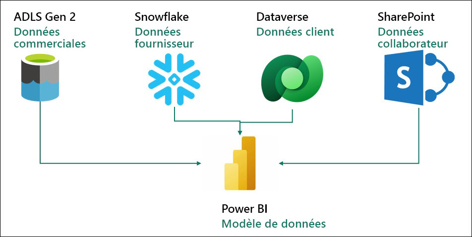

Vous créez actuellement un jeu de données dans Power BI Premium qui
extrait les données des systèmes sources ci-dessus pour répondre à vos
besoins en matière de reporting et fournir un libre-service aux
utilisateurs finaux. Vous mettez à jour votre modèle à l'aide de Power
Query.

**Vous êtes confronté aux défis suivants:**

- Vous devez actualiser votre jeu de données au moins trois fois par
    jour pour tenir compte des différentes heures de mise à jour des
    différentes sources de données.

- Vos actualisations prennent beaucoup de temps, car vous devez
    effectuer chaque fois une actualisation complète pour capturer
    toutes les mises à jour survenues sur les systèmes sources.

- Toute erreur dans l'une des sources de données à partir desquelles
    vous extrayez des données entraîne une interruption de
    l'actualisation de votre jeu de données. Il arrive souvent que le
    fichier collaborateur ne soit pas chargé à temps, ce qui aboutit à
    une interruption de l'actualisation de votre jeu de données.

- Apporter des modifications à votre modèle de données est un
    processus chronophage, car Power Query prend beaucoup de temps pour
    actualiser vos aperçus, compte tenu du gros volume de données et des
    transformations complexes.

- Vous avez besoin d'un PC Windows pour utiliser Power BI Desktop,
    même si le standard de l'entreprise est Mac. Vous avez entendu
    parler de Microsoft Fabric et décidé de l'essayer pour voir s'il
    peut relever vos défis.

### Présentation de l'état Power BI Desktop

Avant de prendre en main Fabric, examinons l'état actuel dans Power BI
Desktop pour comprendre les transformations et le modèle.

## Tâche 1: Configurer Power BI Desktop dans l'environnement de labo

1. Ouvrez le fichier **FAIAD.pbix** situé dans le dossier **Reports**
    sur le **Bureau** de votre environnement de labo. Le fichier s'ouvre
    alors dans Power BI Desktop.

   

2. Lorsque la boîte de dialogue « Saisissez votre adresse e-mail »
    apparaît, copiez le **nom d'utilisateur** et collez-le dans le champ
    **E-mail** de la boîte de dialogue, puis cliquez sur **Continuer**.

    - Adresse e-mail/nom d'utilisateur: <inject key="AzureAdUserEmail"></inject>

        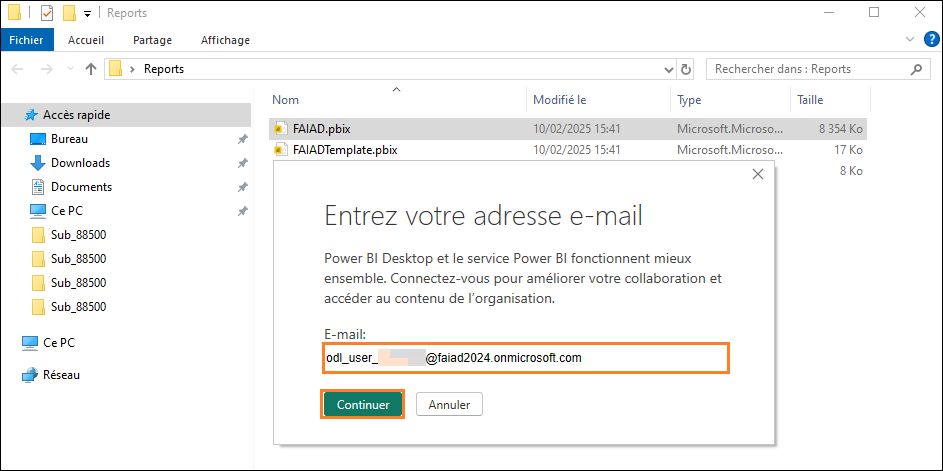

3. Sur l'onglet Se connecter à Microsoft Azure, vous verrez l'écran de
    connexion ; saisissez l'adresse e-mail/nom d'utilisateur suivant,
    puis cliquez sur Suivant.

    - Adresse e-mail/nom d'utilisateur: <inject key="AzureAdUserEmail"></inject>

4. Saisissez maintenant le **Mot de passe** suivant et cliquez sur **Se
    connecter.**

    - Mot de passe: <inject key="AzureAdUserPassword"></inject>

      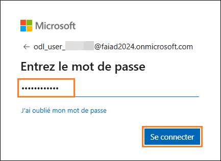

5. La boîte de dialogue **Rester connecté à toutes vos applications**
    s'ouvre alors. Cliquez sur **OK**.

   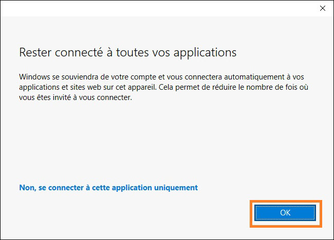

6. La boîte de dialogue **Vous êtes prêt !** s'ouvre alors.
    Sélectionnez **Terminé**.

## Tâche 2: Analyser l'état Power BI Desktop

L'état ci-dessous analyse les ventes de Fabrikam. Les KPI sont
répertoriés en haut de la page à gauche. Les visuels restants mettent en
évidence les ventes au fil du temps, par secteur de vente, groupe de
produits et revendeur.

   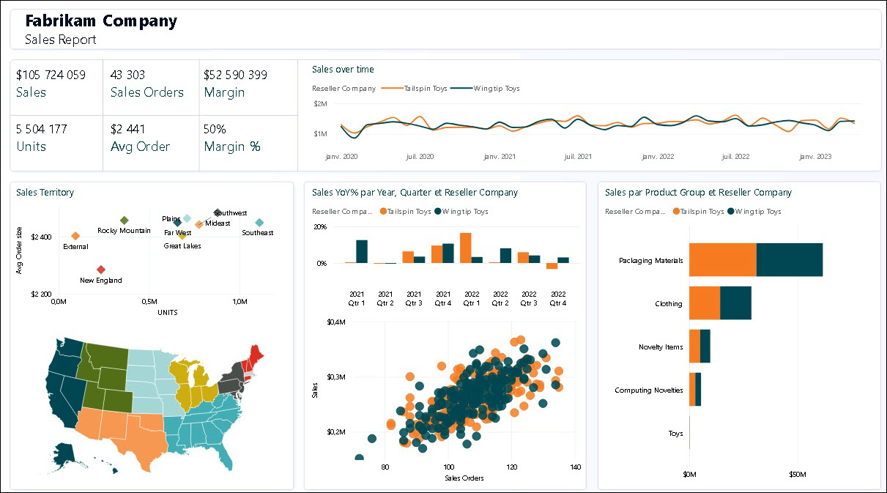

**Remarque:** dans cette formation, nous nous concentrons sur
l'acquisition, la transformation et la modélisation de données à l'aide
des outils disponibles dans Fabric. Nous n'aborderons pas l'élaboration
d'états ou la navigation dans les états. Consacrons quelques minutes à
la compréhension de l'état et passons aux étapes suivantes.

1. Analysons les données par secteur de vente. Cliquez sur **New
    England** dans le visuel Secteur de vente (nuage de points). Dans le
    visuel Ventes au fil du temps, notez que le revendeur Tailspin Toys
    réalise plus de ventes que Wingtip Toys en Nouvelle-Angleterre. Sur
    l'histogramme % des ventes en glissement annuel, notez que la
    croissance des ventes de Wingtip Toys a été faible et en baisse d'un
    trimestre à l'autre au cours de l'année écoulée. Après un léger
    rebond au troisième trimestre, elle a de nouveau diminué au
    quatrième trimestre.

   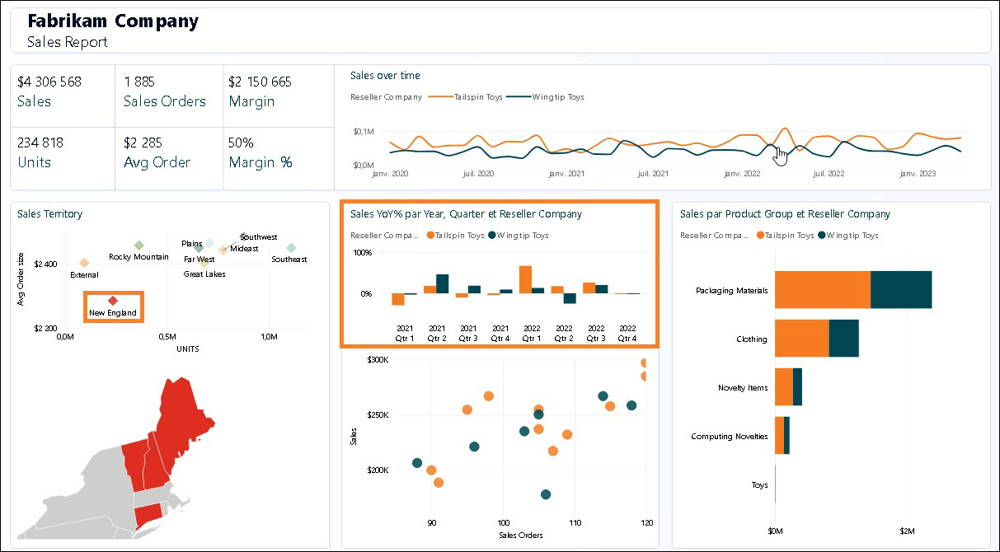

2. Comparons cela au secteur de vente des Rocheuses. Cliquez sur
    **Rocky Mountain** dans le visuel Secteur de vente (nuage de
    points). Sur l'histogramme % des ventes en glissement annuel, les
    ventes de Wingtip Toys ont considérablement augmenté au quatrième
    trimestre 2023 après avoir été faibles au cours des deux trimestres
    précédents.

   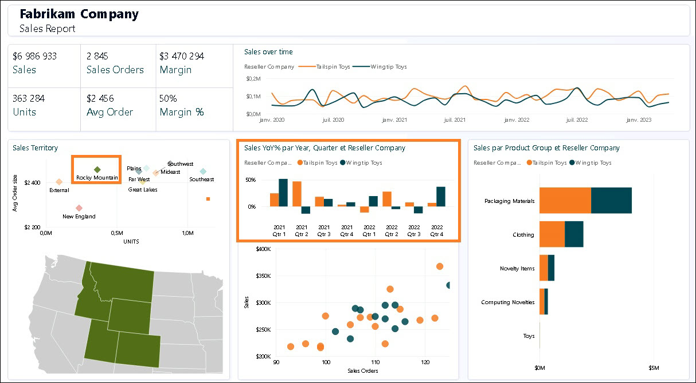

3. Cliquez sur **Rocky Mountain** dans le visuel Secteur de vente pour
    supprimer le filtre.

4. Dans le visuel Nuage de points en bas au centre de l'écran (Sales
    Orders), cliquez sur la valeur hors norme en haut à droite
    (4e quadrant). Notez que le % de marge est de 52 %, ce qui est
    supérieur à la moyenne de 50 %. En outre, le % des ventes en
    glissement annuel a augmenté au cours des deux derniers trimestres
    de 2023.

   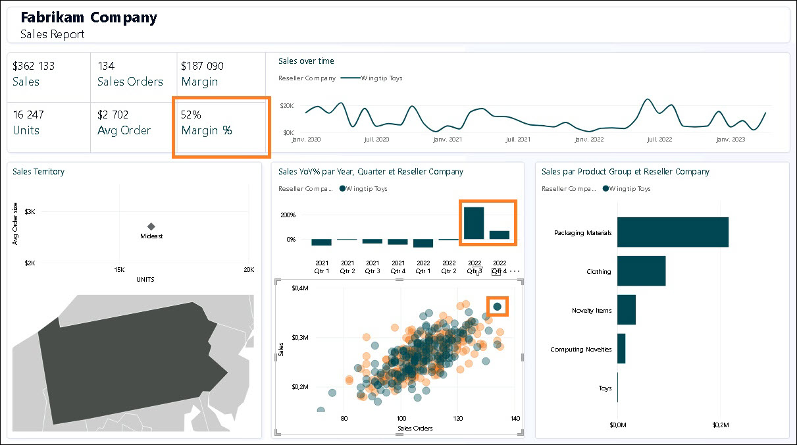

5. Cliquez sur la valeur Reseller hors norme dans le visuel Nuage de
    points pour **supprimer le filtre**.

6. Obtenons les détails produit par groupe de produits et revendeur. À
    partir du visuel Histogramme Ventes par groupe de produits et
    revendeur, **cliquez avec le bouton droit sur la barre Packaging
    Materials pour Tailspin Toys**, puis sélectionnez **Extraire ->
    Product Detail** dans la boîte de dialogue.

   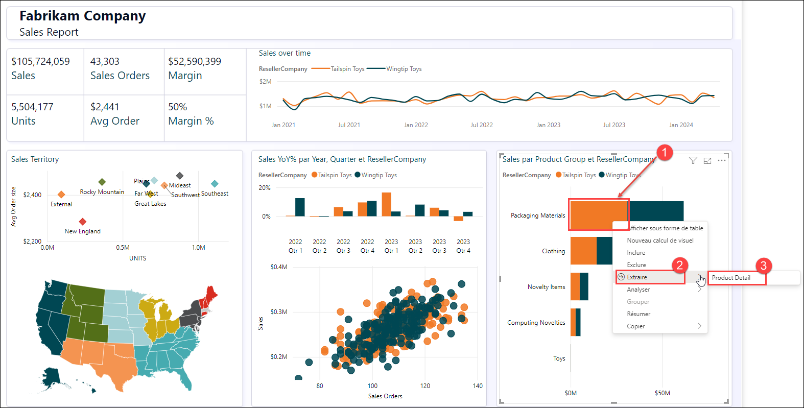

7. Vous êtes alors redirigé vers la page qui fournit les détails
    produit. Notez que de futures commandes sont également en cours.

8. Après avoir examiné cette page, revenez à l'état sur les ventes à
    l'aide du raccourci **Ctrl + flèche Précédent** en haut de la page à
    droite.

   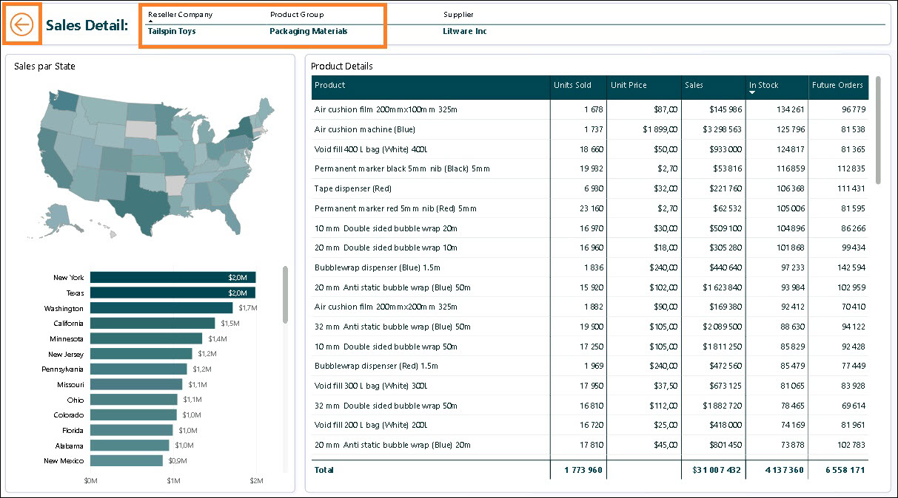

9. N'hésitez pas à analyser davantage l'état. Une fois prêt, jetez un
    œil à la vue de modèle. Dans le volet gauche, cliquez sur Icône de
    vue de modèle.

   

10. Notez qu'il existe deux tables de fait: **Sales** et **PO**.

    a. La granularité des données Sales est par valeur Date, Reseller,
    Product et People. Les valeurs Date, Reseller, Product et People sont
    liées à la table Sales.

    b. La granularité des données PO est par valeur Date, Product et
    People. Les valeurs Date, Product et People sont liées à la table PO.

    c. Nous disposons de données Supplier par Product. La valeur Supplier
    est liée à la table Product.

    d. Nous disposons des données d'emplacement du Reseller par Geo. La
    valeur Geo est liée à la valeur Reseller.

    e. Nous avons des informations Customer par Reseller. La valeur
    Customer est liée à la valeur Reseller.

## Tâche 3: Examiner les requêtes Power Query

1. Examinons à présent Power Query pour comprendre les sources de
    données. Dans le ruban, cliquez sur **Accueil -> Transformer les
    données**.

   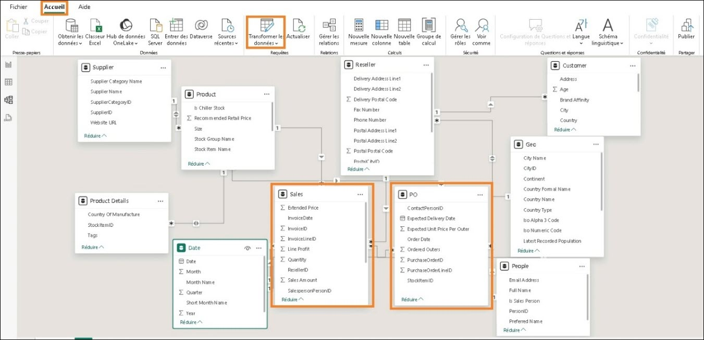

2. La fenêtre Power Query s'ouvre alors. Dans le ruban, cliquez sur
    **Accueil -> Paramètres de la source de données**. La boîte de
    dialogue Paramètres de la source de données s'ouvre alors.
    En parcourant la liste, notez que quatre sources de données
    principales sont mentionnées dans l'énoncé du problème:

    a. Snowflake

    b. SharePoint

    c. ADLS Gen2

    d. Dataverse

3. Cliquez sur **Fermer** pour fermer la boîte de dialogue Paramètres
    de la source de données.

   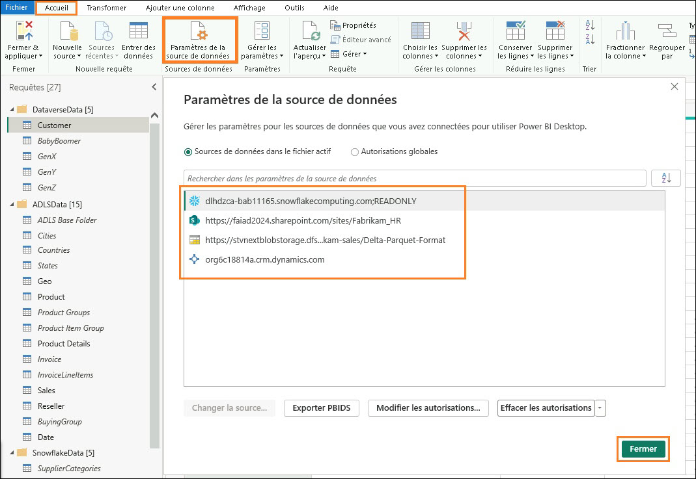

4. Dans le volet gauche Queries, notez que les requêtes sont regroupées
    par source de données.

5. Notez que le dossier **DataverseData** comporte des données Customer
    disponibles dans quatre requêtes différentes: BabyBoomer, GenX,
    GenY et GenZ. Ces quatre requêtes sont ajoutées pour créer une
    requête Customer.

6. Cliquez sur la requête **Customer** dans la fenêtre de requêtes. En
    sélectionnant cette requête, vous devrez entrer à nouveau vos
    informations d'identification Dataverse. Cliquez sur **Modifier les
    informations d'identification**.

   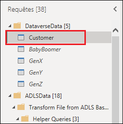

   

7. Cliquez sur **Se connecter** pour vous connecter à votre compte.

8. Vous pouvez saisir les informations d'identification de la source de
    données Dataverse en saisissant le **Nom d'utilisateur** et le **Mot
    de passe**. Les informations d'identification sont fournies
    ci-dessous, puis cliquez sur **Connecter**.

    - Adresse e-mail/nom d'utilisateur: inject key="AzureAdUserEmail"></inject>

    - Mot de passe: <inject key="AzureAdUserPassword"></inject>

9. Cliquez sur la requête **ADLS Base Folder** dans la fenêtre de
    requêtes. En sélectionnant cette requête, vous devrez entrer les
    informations d'identification. Cliquez sur **Modifier les
    informations d'identification**.

   

10. Pour la source de données **ADLS**, sélectionnez l'option
    **Signature d'accès partagé (SAS)**, puis saisissez le **jeton SAS**
    fourni ci-dessous. Cliquez ensuite sur **Connecter**.

    - **Jeton SAS** **:** <inject key="Sas token"></inject>

      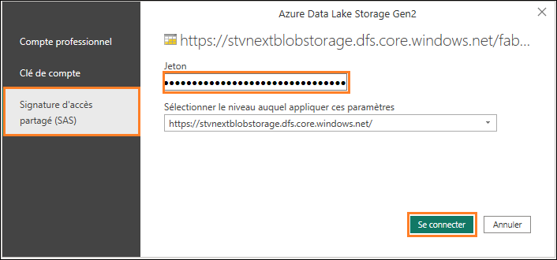

11. Notez que le dossier **ADLSData** comporte plusieurs dimensions:
    Geo, Product, Reseller et Date. Il comporte également des faits
    Sales.

    a. **La dimension Geo** est créée en fusionnant les données des
    requêtes Cities, Countries et States.

    b. **La dimension Product** est créée en fusionnant les données des
    requêtes Product Groups et Product Item Group.

    c. **La dimension Reseller** est filtrée à l'aide de la requête
    BuyingGroup.

    d. **Le fait Sales** est créé en fusionnant la requête InvoiceLineItems
    avec la requête Invoice.

12. Pour la source de données Snowflake, sélectionnez la requête
    **SupplierCategories** dans la fenêtre Requêtes. En sélectionnant
    cette requête, vous devrez saisir les informations d'identification.
    Cliquez sur **Modifier les informations d'identification**.

    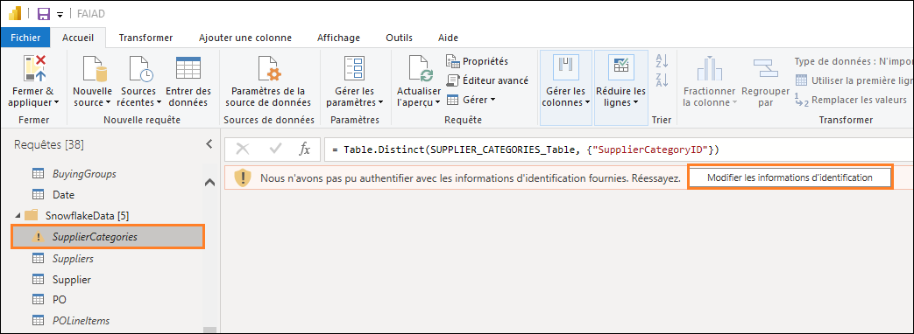

13. Saisissez le **nom d'utilisateur Snowflake** et le **mot de passe
    Snowflake** fournis ci-après. Utilisez ces informations
    d'identification pour connecter toutes les tables sous Snowflake à
    Snowflake, puis cliquez sur Connecter.

    - Nom d'utilisateur Snowflake: <inject key="SnowFlake Username"></inject>

    - Mot de passe Snowflake: <inject key="SnowFlake Password"></inject>

    **Remarque:** si vous avez des difficultés à vous connecter à Snowflake
avec les informations d'identification des détails de l'environnement,
veuillez utiliser les informations d'identification fournies ci-après.

    - Nom d'utilisateur Snowflake: SNOWFLAKE_BACKUP

    - Mot de passe Snowflake: 8UpfRpExVDXv2AC1

14. Notez que le dossier **SnowflakeData** comporte une dimension
    Supplier et un fait PO (Commande/Dépense).

    a. **La dimension Supplier** est créée en fusionnant la requête
    Suppliers avec la requête SupplierCategories.

    b. **Le fait PO** est créé en fusionnant la requête PO avec la requête
    PO Line Items.

15. Pour la source de données SharePoint, sélectionnez la requête
    **People** dans la fenêtre Requêtes. En sélectionnant cette requête,
    vous devrez saisir les informations d'identification. Cliquez sur
    **Modifier les informations d'identification**.

    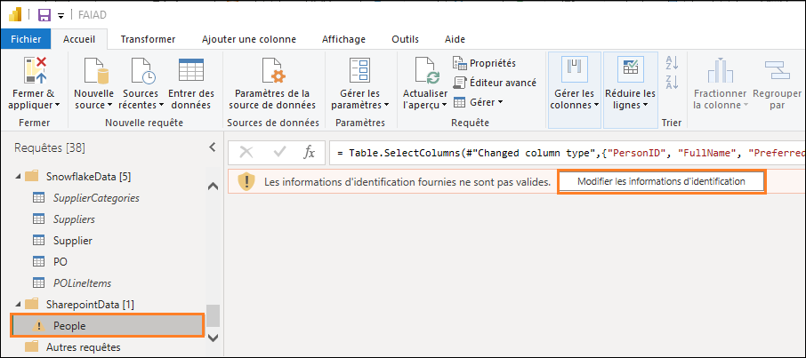

16. Cliquez sur l'option **Compte Microsoft**, puis sur **Se
    connecter**. Saisissez le nom d'utilisateur et le mot de passe
    fournis ci-dessous, puis cliquez sur Connecter.

    - Adresse e-mail/nom d'utilisateur: <inject key="AzureAdUserEmail"></inject>

    - Mot de passe: <inject key="AzureAdUserPassword"></inject>

      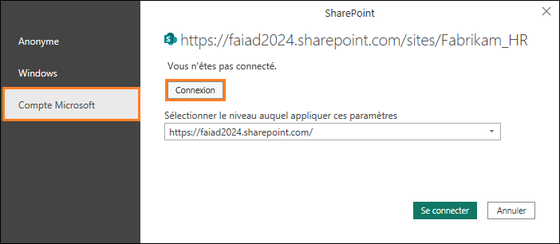

17. Notez que le dossier **SharepointData** comporte la dimension
    People.

    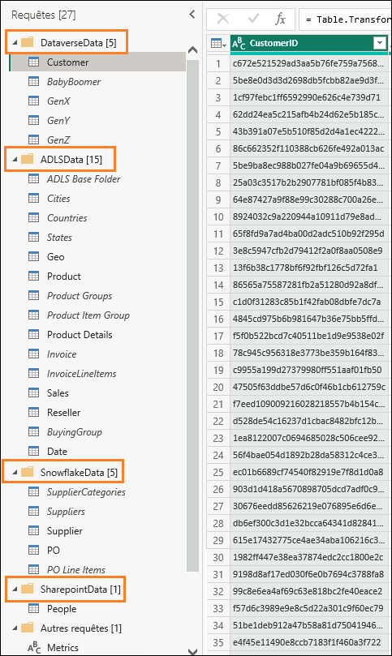

Nous savons désormais à quoi nous avons affaire. Dans les labos
suivants, nous allons créer une requête Power Query similaire à l'aide
de Dataflow Gen2 et un modèle à l'aide de la fonctionnalité Lakehouse.

# Références

Fabric Analyst in a Day (FAIAD) vous présente certaines des fonctions
clés de Microsoft Fabric. Dans le menu du service, la section Aide (?)
comporte des liens vers d'excellentes ressources.

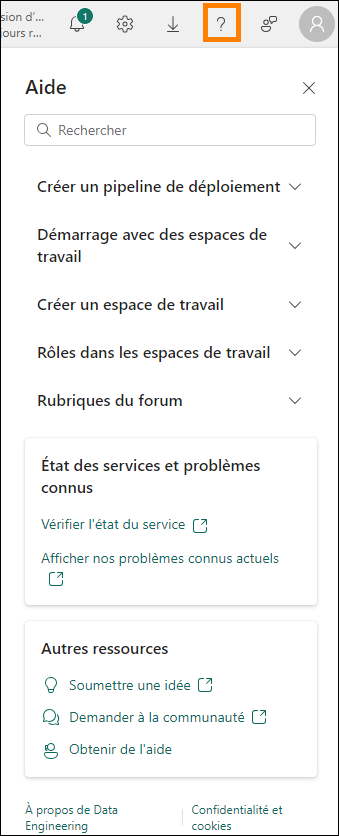

Voici quelques autres ressources qui vous aideront lors de vos
prochaines étapes avec Microsoft Fabric:

- Consultez le billet de blog pour lire l'intégralité de l'[annonce de
la GA de Microsoft
Fabric](https://aka.ms/Fabric-Hero-Blog-Ignite23).

- Explorez Fabric grâce à la [visite
guidée](https://aka.ms/Fabric-GuidedTour).

- Inscrivez-vous pour bénéficier d'un [essai gratuit de Microsoft
Fabric](https://aka.ms/try-fabric).

- Rendez-vous sur le [site web Microsoft
Fabric](https://aka.ms/microsoft-fabric).

- Acquérez de nouvelles compétences en explorant les [modules
d'apprentissage Fabric](https://aka.ms/learn-fabric).

- Explorez la [documentation technique
Fabric](https://aka.ms/fabric-docs).

- Lisez le [livre électronique gratuit sur la prise en main de
Fabric](https://aka.ms/fabric-get-started-ebook).

- Rejoignez la [communauté Fabric](https://aka.ms/fabric-community)
pour publier vos questions, partager vos commentaires et apprendre
des autres.

Lisez les blogs d'annonces plus détaillés sur l'expérience Fabric:

- [Blog Expérience Data Factory dans
Fabric](https://aka.ms/Fabric-Data-Factory-Blog) 

- [Blog Expérience Synapse Data Engineering dans
Fabric](https://aka.ms/Fabric-DE-Blog) 

- [Blog Expérience Synapse Data Science dans
Fabric](https://aka.ms/Fabric-DS-Blog) 

- [Blog Expérience Synapse Data Warehousing dans
Fabric](https://aka.ms/Fabric-DW-Blog) 

- [Blog Expérience Synapse Real-Time Analytics dans
Fabric](https://aka.ms/Fabric-RTA-Blog)

- [Blog Annonce Power BI](https://aka.ms/Fabric-PBI-Blog)

- [Blog Expérience Data Activator dans
Fabric](https://aka.ms/Fabric-DA-Blog) 

- [Blog Administration et gouvernance dans
Fabric](https://aka.ms/Fabric-Admin-Gov-Blog)

- [Blog OneLake dans Fabric](https://aka.ms/Fabric-OneLake-Blog)

- [Blog Intégration de Dataverse et Microsoft
Fabric](https://aka.ms/Dataverse-Fabric-Blog)

© 2025 Microsoft Corporation. Tous droits réservés.

En effectuant cette démonstration/ce labo, vous acceptez les
conditions suivantes:

La technologie/fonctionnalité décrite dans cette démonstration/ces
travaux pratiques est fournie par Microsoft Corporation en vue
d'obtenir vos commentaires et de vous fournir une expérience
d'apprentissage. Vous pouvez utiliser cette démonstration/ces ateliers
uniquement pour évaluer ces technologies et fonctionnalités, et pour
fournir des commentaires à Microsoft. Vous ne pouvez pas l'utiliser à
d'autres fins. Vous ne pouvez pas modifier, copier, distribuer,
transmettre, afficher, effectuer, reproduire, publier, accorder une
licence, créer des œuvres dérivées, transférer ou vendre tout ou une
partie de cette démonstration/ces ateliers.

LA COPIE OU LA REPRODUCTION DE CETTE DÉMONSTRATION/CES TRAVAUX
PRATIQUES (OU DE TOUTE PARTIE DE CEUX-CI) SUR TOUT AUTRE SERVEUR OU
AUTRE EMPLACEMENT EN VUE D'UNE AUTRE REPRODUCTION OU REDISTRIBUTION
EST EXPRESSÉMENT INTERDITE.

CETTE DÉMONSTRATION/CES TRAVAUX PRATIQUES FOURNISSENT CERTAINES
FONCTIONNALITÉS DE PRODUIT/TECHNOLOGIES LOGICIELLES, NOTAMMENT
D'ÉVENTUELS NOUVEAUX CONCEPTS ET FONCTIONNALITÉS, DANS UN
ENVIRONNEMENT SIMULÉ SANS INSTALLATION OU CONFIGURATION COMPLEXE AUX
FINS DÉCRITES CI-DESSUS. LES TECHNOLOGIES/CONCEPTS REPRÉSENTÉS DANS
CETTE DÉMONSTRATION/CES TRAVAUX PRATIQUES PEUVENT NE PAS REPRÉSENTER
LES FONCTIONNALITÉS COMPLÈTES ET PEUVENT NE PAS FONCTIONNER DE LA MÊME
MANIÈRE QUE DANS UNE VERSION FINALE. IL EST ÉGALEMENT POSSIBLE QUE
NOUS NE PUBLIIONS PAS DE VERSION FINALE DE CES FONCTIONNALITÉS OU
CONCEPTS. VOTRE EXPÉRIENCE D'UTILISATION DE CES FONCTIONNALITÉS
DANS UN ENVIRONNEMENT PHYSIQUE PEUT ÉGALEMENT ÊTRE DIFFÉRENTE.

**COMMENTAIRES**. Si vous envoyez des commentaires sur les
fonctionnalités, technologies et/ou concepts décrits dans ces
ateliers/cette démonstration à Microsoft, vous accordez à Microsoft,
sans frais, le droit d'utiliser, de partager et de commercialiser vos
commentaires de quelque manière et à quelque fin que ce soit. Vous
accordez également à des tiers, sans frais, les droits de brevet
nécessaires pour leurs produits, technologies et services en vue de
l'utilisation ou de l'interface avec des parties spécifiques d'un
logiciel ou d'un service Microsoft incluant les commentaires. Vous
n'enverrez pas de commentaires soumis à une licence exigeant que
Microsoft accorde une licence pour son logiciel ou sa documentation à
des tiers du fait que nous y incluons vos commentaires. Ces droits
survivent à ce contrat.

MICROSOFT CORPORATION DÉCLINE TOUTES LES GARANTIES ET CONDITIONS EN CE
QUI CONCERNE CETTE DÉMONSTRATION/CES TRAVAUX PRATIQUES, Y COMPRIS
TOUTES LES GARANTIES ET CONDITIONS DE QUALITÉ MARCHANDE, QU'ELLES
SOIENT EXPLICITES, IMPLICITES OU LÉGALES, D'ADÉQUATION À UN USAGE
PARTICULIER, DE TITRE ET D'ABSENCE DE CONTREFAÇON. MICROSOFT N'OFFRE
AUCUNE GARANTIE OU REPRÉSENTATION EN CE QUI CONCERNE LA PRÉCISION DES
RÉSULTATS, LA CONSÉQUENCE QUI DÉCOULE DE L'UTILISATION DE CETTE
DÉMONSTRATION/CES ATELIERS, OU L'ADÉQUATION DES INFORMATIONS CONTENUES
DANS CETTE DÉMONSTRATION/CES ATELIERS À QUELQUE FIN QUE CE SOIT.

**CLAUSE D'EXCLUSION DE RESPONSABILITÉ**

Cette démonstration/Ce labo comporte seulement une partie des
nouvelles fonctionnalités et améliorations disponibles dans Microsoft
Power BI. Certaines fonctionnalités sont susceptibles de changer dans
les versions ultérieures du produit. Dans ce labo/cette démonstration,
vous allez découvrir comment utiliser certaines nouvelles
fonctionnalités, mais pas toutes.