# Microsoft Fabric - Fabric Analyst in a Day - Labo 2
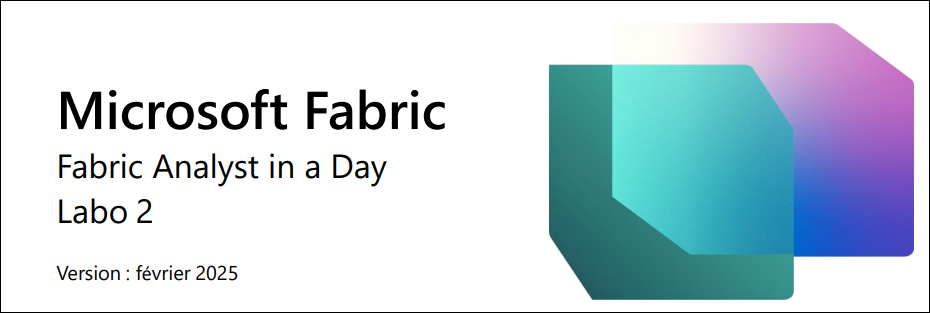
# Sommaire
- Introduction
- Licence Fabric
    - Tâche 1 : activer une licence d’essai Microsoft Fabric
- Espace de travail Fabric
    - Tâche 2 : créer un espace de travail Fabric
    - Tâche 3 : créer une lakehouse
- Présentation des expériences Fabric
    - Tâche 4 : expérience Data Factory
    - Tâche 5 : expérience Industry Solutions
    - Tâche 6 : expérience Real-Time Intelligence
    - Tâche 7 : expérience Data Engineering
    - Tâche 8 : expérience Data Science
    - Tâche 9 : expérience Data Warehouse
- Références

# Introduction 

Aujourd'hui, vous allez découvrir diverses fonctionnalités clés de
Microsoft Fabric. Il s'agit d'un atelier d'introduction destiné à vous
présenter les différentes expériences produit et les divers éléments
disponibles dans Fabric. À la fin de cet atelier, vous saurez comment
utiliser Lakehouse, Dataflow Gen2, un pipeline de données, DirectLake et
plus encore.

À la fin de ce labo, vous saurez:

- comment créer un espace de travail Fabric

- comment créer une lakehouse

# Licence Fabric

## Tâche 1: activer une licence d'essai Microsoft Fabric

1. Ouvrez le **navigateur** et accédez à <https:/app.powerbi.com/.
    Vous êtes alors redirigé(e) vers la page de connexion.

    **Remarque:** si vous utilisez l'environnement de labo, vous serez
    peut-être connecté(e) directement.

    **Remarque:** si vous n'utilisez pas l'environnement de labo et que
    vous disposez d'un compte Power BI existant, vous pouvez utiliser le
    navigateur en mode privé/incognito.

2. Copiez le **Nom d'utilisateur** et collez-le dans le champ
    **E-mail** de la boîte de dialogue et sélectionnez **Envoyer**.

    - **Adresse e-mail/nom d'utilisateur** **:** <inject key="AzureAdUserEmail"></inject>

      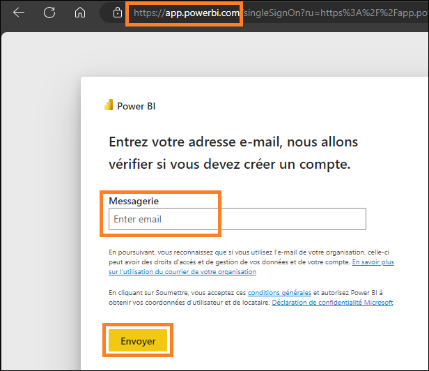

3. Sur l'onglet **Se connecter à Microsoft Azure**, vous verrez l'écran
    de connexion ; saisissez **l'adresse
    e-mail/nom d'utilisateur** suivant, puis cliquez sur **Suivant**.

    - Adresse e-mail/nom d'utilisateur: <inject key="AzureAdUserEmail"></inject>

      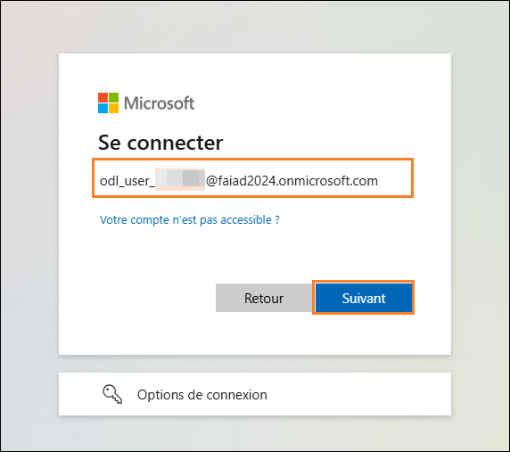

4. Saisissez maintenant le **Mot de passe** suivant et cliquez sur **Se
    connecter**.

    - Mot de passe: <inject key="AzureAdUserPassword"></inject>

      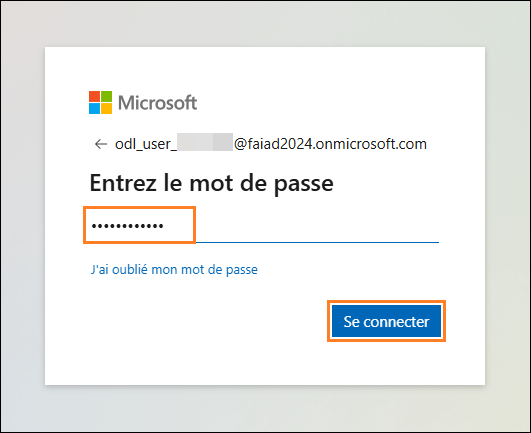

5. Vous êtes alors redirigé(e) vers la **page d'accueil Service Power
    BI** familière.

6. Nous supposons que vous connaissez la disposition du service Power
    BI. Si vous avez une question, n'hésitez pas à la poser au
    formateur.

    Vous êtes actuellement dans **Mon espace de travail**. Pour utiliser des
    éléments Fabric, vous avez besoin d'une licence d'essai et d'un espace
    de travail doté d'une licence Fabric. En avant pour la configuration.

7. Dans le coin supérieur droit de l'écran, cliquez sur l'**icône
    utilisateur**.

8. Cliquez sur **Essai gratuit**.

   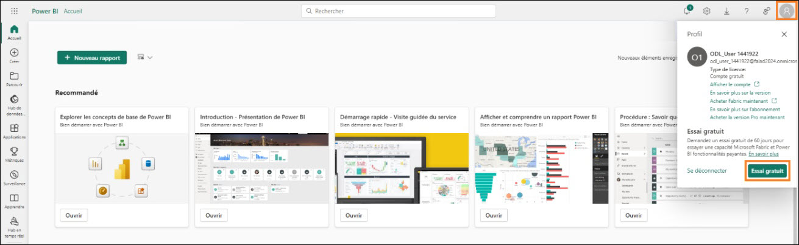

9. La boîte de dialogue de mise à niveau vers un essai gratuit
    Microsoft Fabric s'ouvre alors. Cliquez sur **Activer.**

   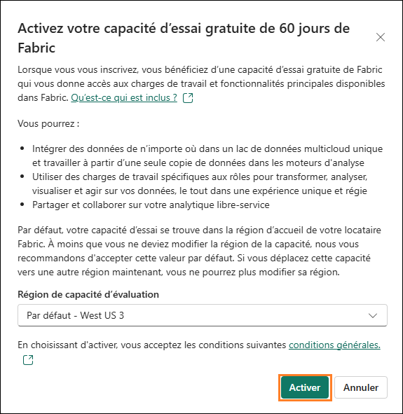

10. La boîte de dialogue Mise à niveau réussie vers Microsoft Fabric
    s'ouvre alors. Cliquez sur **Page d'accueil Fabric**.

    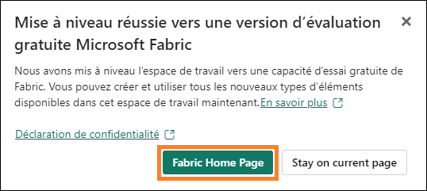

11. Vous êtes alors redirigé(e) vers la **page d'accueil**
    **Microsoft Fabric**.

    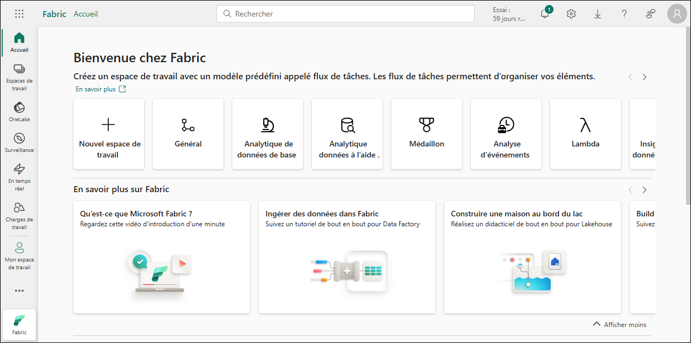

# Espace de travail Fabric

## Tâche 2: créer un espace de travail Fabric

1. Créons maintenant un espace de travail avec la licence Fabric.
    **Cliquez sur Espaces de travail (1)** dans la barre de navigation
    gauche. Une boîte de dialogue s'ouvre alors.

2. Cliquez sur **+ Nouvel espace de travail (2)** en bas du menu
    contextuel

   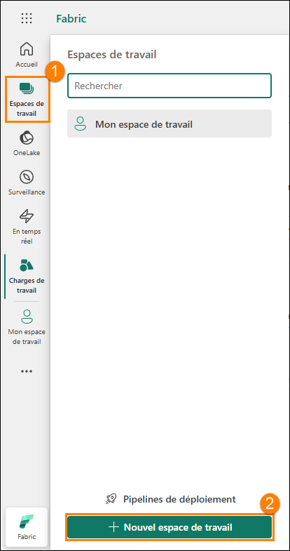

3. La boîte de dialogue **Créer un espace de travail** s'ouvre alors
    sur le côté droit du navigateur.

4. Dans le champ **Nom**, saisissez **FAIAD_<inject key="Deployment ID" enableCopy="false"/>**

    **Remarque** **:** le nom de l'espace de travail doit être unique.
    Assurez-vous qu'une coche verte avec « Ce nom est disponible » s'affiche
    sous le champ Nom.

5. Si vous le souhaitez, vous pouvez saisir une Description pour
    l'espace de travail. Il s'agit d'un champ facultatif.

6. Cliquez sur Options avancées pour développer la section.

   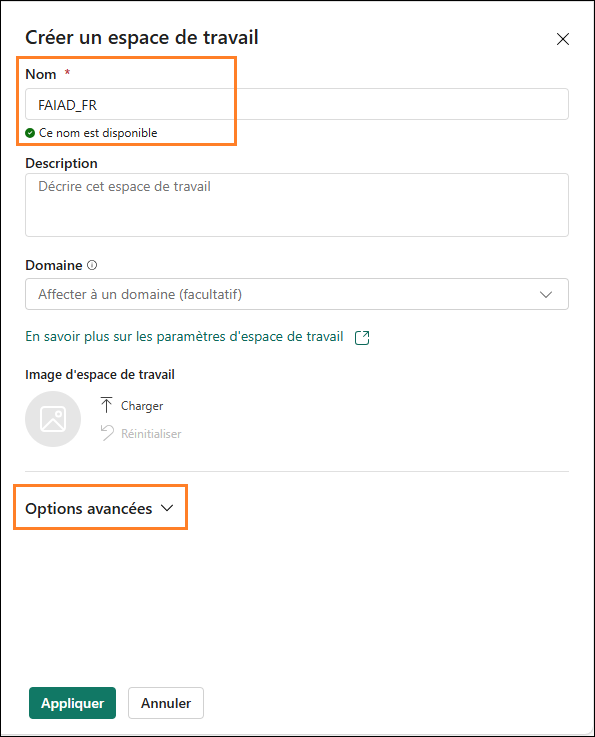

7. Sous **Modèle de Licence**, assurez-vous que la case **Essai** est
    cochée. (Elle devrait l'être par défaut.)

8. Cliquez sur **Appliquer** pour créer un espace de travail.

   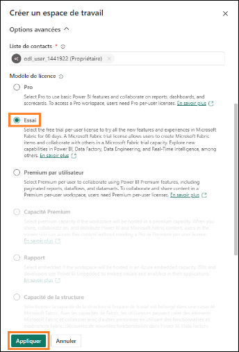

Un espace de travail est alors créé et vous êtes redirigé(e) vers cet
espace de travail. Nous allons importer les données des différentes
sources de données dans la lakehouse et créer notre modèle à l'aide des
données de la lakehouse et en rendre compte. La première étape consiste
à créer une lakehouse.

## Tâche 3: créer une lakehouse

1. Dans l'espace de travail **FAIAD_<inject key="Deployment ID" enableCopy="false"/>**
    nouvellement créé, recherchez le bouton **+ Nouvel élément (1)**
    dans le volet de navigation de gauche. C'est dans cette section que
    vous pouvez commencer à créer des éléments dans votre espace de
    travail.

2. Dans la zone de recherche, saisissez **Lakehouse (2)** puis, dans
    les résultats de la recherche, sélectionnez l'option **Lakehouse
    (3)**. Vous pourrez alors créer un Lakehouse pour stocker,
    interroger et gérer vos Big Data.

   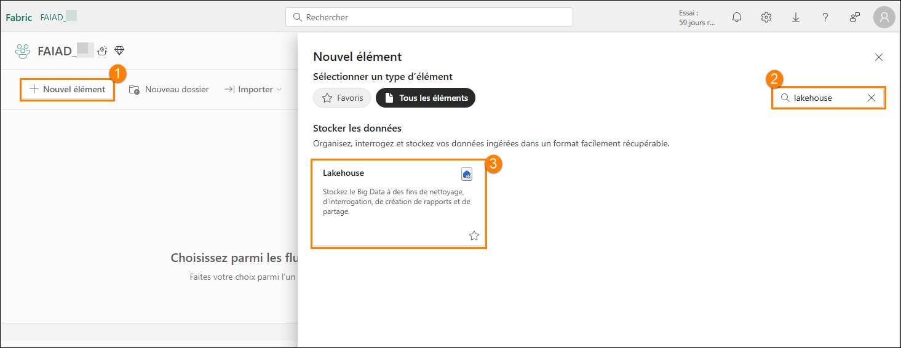

3. Une boîte de dialogue Nouveau lakehouse apparaît. Saisissez lh_FAIAD
    dans la zone de texte Nom.

    **Remarque** **:** lh fait ici référence à la fonctionnalité Lakehouse.
    Nous ajoutons le préfixe lh afin de faciliter l'identification et la
    recherche.

4. Cliquez sur **Créer**.

   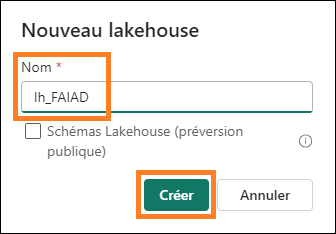

    Quelques instants après, une lakehouse est créée et vous êtes
    redirigé(e) vers l'interface Lakehouse. Dans le **volet gauche**, notez
    l'icône Lakehouse sous votre espace de travail. Vous pouvez facilement
    accéder à la lakehouse en cliquant sur cette icône à tout moment.

    Dans l'Explorateur Lakehouse, notez des **tables** et **fichiers**.
    Lakehouse peut exposer des fichiers Azure Data Lake Storage Gen2 sous la
    section Fichiers ou un flux de données peut charger des données dans des
    tables Lakehouse. Diverses options sont disponibles. Nous allons vous
    montrer certaines des options dans les labos suivants.

   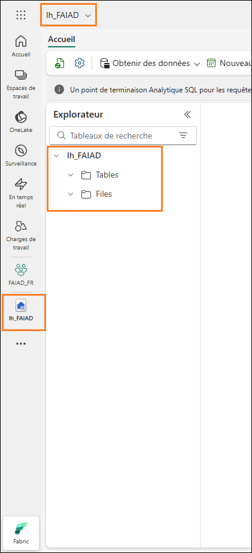

# Présentation des expériences Fabric

## Tâche 4: expérience Data Factory

1. Cliquez sur l'icône Charges de travail à gauche de votre écran. Une
    boîte de dialogue avec la liste des expériences Fabric s'ouvre
    alors. La liste des expériences inclut Power BI, Data Factory,
    Industry Solutions, Real-Time Intelligence, Data Engineering, Data
    Science et Data Warehouse. Explorons.

   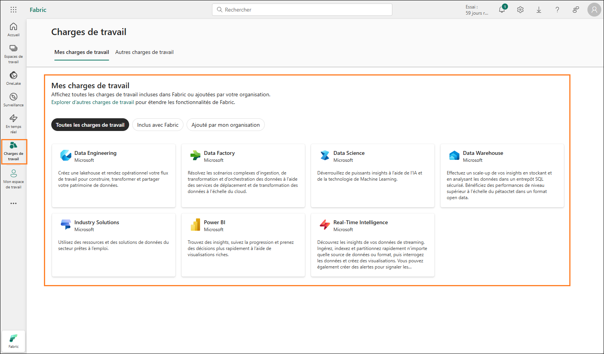

2. Cliquez sur **Data Factory**.

   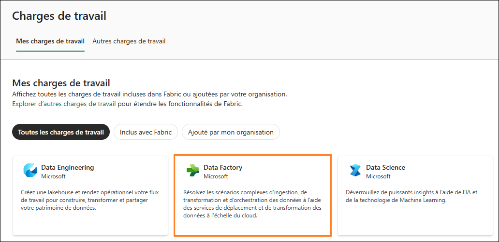

3. Vous êtes alors redirigé(e) vers la page d'accueil de Data Factory.
    Ses sections sont présentées en détail ci-après, afin de vous guider
    pas à pas pour vous aider à utiliser efficacement Data Factory.
    Dataflow Gen2 est la nouvelle génération de Dataflow.

    ### Qu'est-ce que Data Factory ?

    Data Factory est un outil qui vous aide à gérer et à organiser les
    données issues de différentes sources. Il vous permet de recueillir, de
    préparer et de transformer des données pour les utiliser efficacement.
    Que vous soyez débutant ou expert, Data Factory fournit des outils qui
    rendent la transformation des données plus simple et plus efficace.

    ### Types d'élément:

    a. **Flux de données** **:** les flux de données sont comme des
    recettes de transformation des données. Ils proposent plus de
    300 transformations différentes à appliquer à vos données. Vous pouvez
    ainsi nettoyer, combiner et modifier vos données de plusieurs
    manières, selon vos besoins.

    b. **Pipelines** **:** les pipelines sont des flux de travail qui
    vous aident à automatiser les processus de données. Ils vous
    permettent de créer des flux de travail de données flexibles qui
    peuvent être adaptés à vos besoins spécifiques. Cela facilite la
    gestion et le traitement des données d'une manière structurée.

    c. **Azure Data Factory (version préliminaire):** Azure Data Factory
    est un service d'intégration de données informatique, qui vous permet
    de créer des flux de travail pilotés par les données pour orchestrer
    et automatiser le déplacement et la transformation des données.

    d. **Tâche Apache Airflow (version préliminaire):** Apache Airflow
    est une plateforme open source utilisée pour créer, planifier et
    surveiller par programme des flux de travail. Data Factory vous permet
    de créer, planifier et gérer des flux de travail de données complexes.

    e. **Copier la tâche (version préliminaire):** la tâche de copie est
    une fonctionnalité qui vous permet de copier des données d'une source
    vers une autre. Elle fournit ainsi un moyen simple et efficace de
    déplacer des données entre différentes banques de données.

    f. **Base de données en miroir (version préliminaire):** une
    fonctionnalité permettant de créer des versions en miroir de bases de
    données pour la sauvegarde, les tests ou un accès en lecture seule.

    ### Démarrer:

    Pour commencer à utiliser Data Factory, procédez comme suit:

    a. **Apprendre à utiliser Data Factory:** cette section vous aide à
    démarrer avec Data Factory. Vous y trouverez des conseils afin
    d'utiliser efficacement l'outil.

    b. **Créer votre premier flux de données:** ici, vous pouvez
    apprendre à créer votre premier flux de données. Les flux de données
    sont essentiels pour transformer vos données selon vos besoins.

    c. **Créer votre premier pipeline de données:** cette section vous
    guide afin de vous aider à créer votre premier pipeline de données.
    Les pipelines permettent d'automatiser et de gérer efficacement vos
    processus de traitement de données.

    d. **Apprendre à surveiller Data Factory:** la surveillance est
    essentielle pour garantir le bon fonctionnement de vos processus de
    traitement des données. Cette section explique comment surveiller vos
    activités dans Data Factory.

    e. **Découvrez comment transformer des données avec des flux de
    données:** cette section vous explique comment utiliser des flux de
    données afin de transformer efficacement vos données.

    f. **Créer votre première API pour GraphQL:** si vous souhaitez
    utiliser des API avec GraphQL, cette section vous explique comment
    démarrer.

    g. **Créer vos premières fonctions de données utilisateur:** cette
    section vous permet de créer des fonctions de données utilisateur,
    lesquelles sont utiles pour gérer et transformer les données
    utilisateur.

   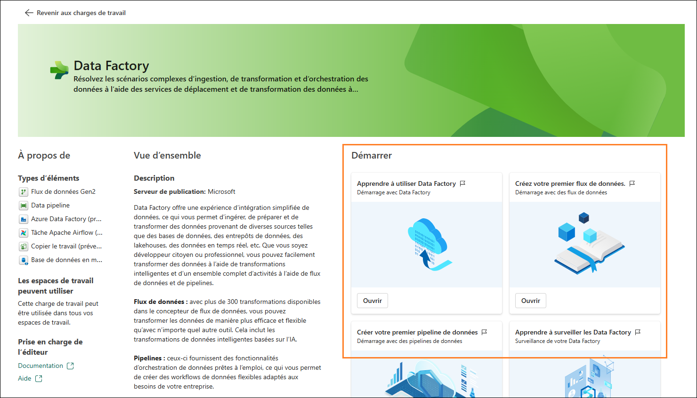

4. Cliquez sur **Retour aux charges de travail** en haut à gauche de
    l'écran. Vous serez alors redirigé(e) vers la page principale des
    charges de travail, où vous pourrez explorer d'autres outils ou
    sections.

   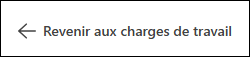

## Tâche 5: expérience Industry Solutions

1. Sur la page **Charges de travail**, cliquez sur **Industry
    Solutions** pour continuer.

   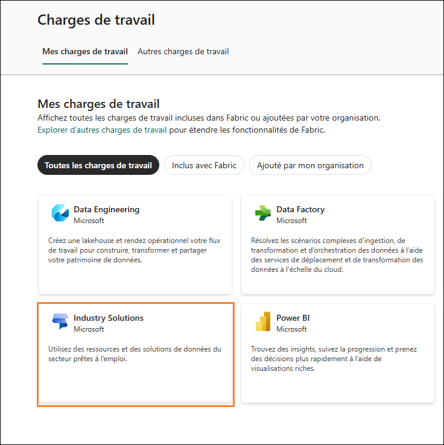

2. Vous êtes alors redirigé(e) vers la page d'accueil **Industry
    Solutions**. Vous trouverez ci-dessous un aperçu détaillé des
    sections qui se trouvent sur cette page, lesquelles vous aideront à
    utiliser les **Industry Solutions** efficacement et pas à pas.

    ### En quoi consiste Industry Solutions ?

    Industry Solutions sont des solutions de données prêtes à l'emploi dans
    Microsoft Fabric, qui fournissent des solutions et des ressources pour
    différents secteurs. Industry Solutions vous aident à démarrer avec des
    scénarios commerciaux clés en utilisant des modèles de données, des
    connecteurs, des transformations, des états et d'autres ressources
    sectorielles.

    ### Types d'élément:

    a. **Solutions Durabilité:** ces solutions prennent en charge
    l'ingestion, la normalisation et l'analyse des données
    environnementales, sociales et de gouvernance (ESG).

    b. **Solutions Vente au détail** **:** ces solutions aident à gérer
    de vastes volumes de données, à intégrer des données provenant de
    diverses sources et à fournir des analyses en temps réel pour une
    prise de décision rapide. Les détaillants peuvent utiliser ces
    solutions pour l'optimisation des stocks, la segmentation des clients,
    la prévision des ventes, la tarification dynamique et la détection des
    fraudes.

    c. **Solutions Santé** **:** ces solutions sont stratégiquement
    conçues pour accélérer le délai de création de valeur ajoutée pour les
    clients en répondant au besoin crucial visant à transformer
    efficacement les données de santé dans un format approprié pour
    l'analyse.

    ### Démarrer:

    Pour commencer à utiliser Industry Solutions, procédez comme suit:

    a. **En savoir plus sur les Solutions Données de santé** **:**
    cliquez sur « En savoir plus » pour en apprendre davantage sur les
    solutions de données de santé et comprendre comment les utiliser dans
    vos projets.

    b. **Déployer les Données (Solutions Données de santé)** **:**
    cliquez sur le bouton « Déployer » pour commencer à déployer des
    solutions de données de santé et les implémenter dans vos projets.

    a. **En savoir plus sur les Solutions Durabilité** **:** cliquez sur
    « En savoir plus » pour en apprendre davantage sur les solutions de
    durabilité et comprendre comment les utiliser dans vos projets.

    d. **Déployer les Solutions Durabilité** **:** cliquez sur le bouton
    « Déployer » pour commencer à déployer des solutions de durabilité et
    les implémenter dans vos projets.

    e. **En savoir plus sur les Solutions Vente au détail** **:** cliquez
    sur le bouton « En savoir plus » pour en apprendre davantage sur les
    solutions de vente au détail et comprendre comment les utiliser dans
    vos projets.

    f. **Déployer les Solutions Vente au détail** **:** cliquez sur le
    bouton « Déployer » pour commencer à déployer des solutions de vente
    au détail et les implémenter dans vos projets.

3. Cliquez sur Retour aux charges de travail en haut à gauche de
l'écran. Vous serez alors redirigé(e) vers la page principale des
charges de travail, où vous pourrez explorer d'autres outils ou
sections.

   

## Tâche 6: expérience Real-Time Intelligence

1. Sur la page **Charges de travail**, cliquez sur **Real-Time
    Intelligence** pour continuer.

   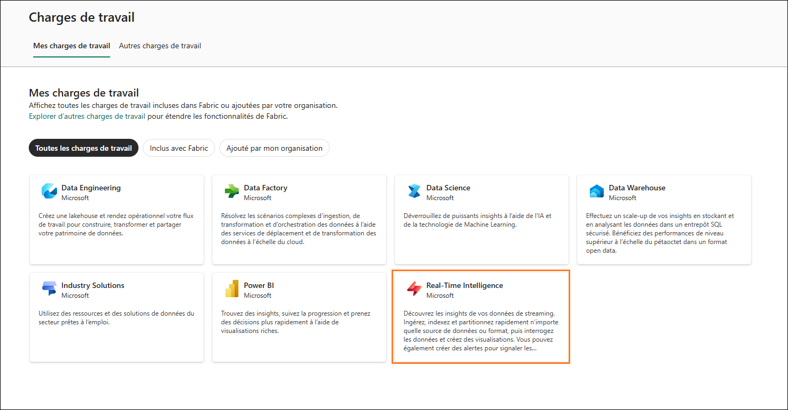

2. Vous êtes alors redirigé(e) vers la page d'accueil **Real-Time
    Intelligence**. Vous trouverez ci-dessous un aperçu détaillé des
    sections qui se trouvent sur cette page, lesquelles vous aideront
    à utiliser **Real-Time Intelligence** efficacement et pas à pas.

    ### En quoi consiste Real-Time Intelligence ?

    Real-Time Intelligence est un outil qui vous aide à gérer et à analyser
    des données à haut volume et à granularité élevée issues de diverses
    sources. Il vous permet d'ingérer, d'analyser et d'agir sur vos données
    en temps réel, pour optimiser vos opérations d'entreprise grâce à des
    décisions et des mesures prises en temps opportun.

    ### Types d'élément:

    a. **Eventhouse:** permet de créer un espace de travail d'une ou
    plusieurs bases de données KQL, qui peuvent être partagées entre les
    projets.

    b. **Jeu de requêtes KQL** **:** permet d'exécuter des requêtes sur
    les données afin de produire des tables et visuels qui peuvent être
    partagés.

    c. **Tableau de bord en temps réel:** permet de visualiser des
    tableaux de bord en temps réel dans les secondes qui suivent
    l'ingestion des données.

    d. **Eventstream** **:** permet de capturer, de transformer et
    d'acheminer un flux d'événements en temps réel.

    e. **Activator** **:** permet de surveiller les jeux de données, les
    requêtes et les flux d'événements à la recherche de modèles.

    ### Démarrer:

    Pour commencer à utiliser Real-Time Intelligence, procédez comme suit:

    a. **Explorer un échantillon Real-Time Intelligence** **:** cliquez
    sur le bouton « Ouvrir » pour explorer l'analyse des données en temps
    réel avec un échantillon.

    b. **Explorer un échantillon** **:** cliquez sur « Sélectionner »
    pour utiliser un échantillon et en savoir plus sur Real-Time
    Intelligence.

    c. **Introduction à Real-Time Intelligence** **:** cliquez sur le
    bouton « Ouvrir » pour obtenir un aperçu de Real-Time Intelligence et
    commencer à utiliser efficacement l'outil.

    d. **Apprendre à utiliser KQL avec des exemples de données** **:**
    cliquez sur le bouton « Ouvrir » pour apprendre à utiliser KQL à
    l'aide d'exemples de données.

    e. **Qu'est-ce qu'un Hub en temps réel** **:** cliquez sur le bouton
    « Ouvrir » pour découvrir ce qu'est un Hub en temps réel et comment
    l'utiliser.

    f. **Explorer un exemple Activator** **:** cliquez sur le bouton
    « Ouvrir » pour utiliser un exemple Activator et comprendre en quoi
    consistent les fonctionnalités et les capacités de Real-Time
    Intelligence.

    g. **Démarrer avec Activator** **:** cliquez sur « Ouvrir » pour
    démarrer avec les concepts d'Activator et commencer à utiliser
    efficacement l'outil.

    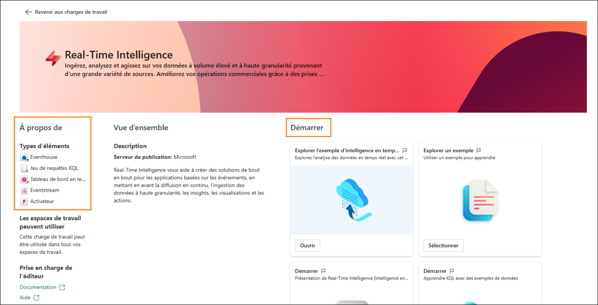

3. Cliquez sur Retour aux charges de travail en haut à gauche de
    l'écran. Vous serez alors redirigé(e) vers la page principale des
    charges de travail, où vous pourrez explorer d'autres outils ou
    sections.

   

## Tâche 7: expérience Data Engineering

1. Sur la page **Charges de travail**, cliquez sur **Data Engineering**
    pour continuer.

   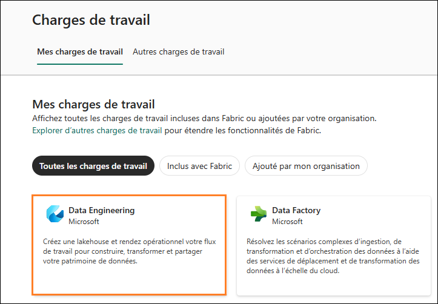

2. Vous êtes alors redirigé(e) vers la page d'accueil **Data
    Engineering**. Vous trouverez ci-dessous un aperçu détaillé des
    sections qui se trouvent sur cette page, lesquelles vous aideront à
    utiliser **Engineering** **données** efficacement et pas à pas.

    ### En quoi consiste Data Engineering ?

    Data Engineering est un outil qui vous aide à concevoir, construire et
    maintenir des infrastructures et des systèmes de collecte, de stockage,
    de traitement et d'analyse de vastes volumes de données. Il vous permet
    de créer un lakehouse et de rendre opérationnel votre flux de travail
    pour construire, transformer et partager votre parc de données.

    Types d'élément:

    a. **Lakehouse** **:** permet de stocker les Big Data à des fins de
    nettoyage, d'interrogation, de reporting et de partage.

    b. **Notebook** **:** utilisé pour l'ingestion de données, la
    préparation, l'analyse et d'autres tâches liées aux données à l'aide
    de divers langages tels que Python, R et Scala.

    c. **Environnement** **:** permet de configurer les bibliothèques
    partagées, les paramètres de calcul Spark et les ressources pour les
    notebooks et les définitions de tâche Spark.

    d. **Définition de travail Spark** **:** permet de définir, planifier
    et gérer des tâches Apache.

    e. **Pipeline de données** **:** permet d'orchestrer la solution de
    données.

    f. **API pour GraphQL** **:** une API permettant d'interroger
    plusieurs sources de données.

    g. **Importer un notebook** **:** permet d'importer des notebooks à
    partir d'une machine locale.

    ### Démarrer:

    Pour commencer à utiliser Data Engineering, procédez comme suit:

    a. **Explorer un échantillon** **:** cliquez sur le bouton
    « Sélectionner » pour utiliser un échantillon et en savoir plus sur
    Data Engineering.

    b. **Qu'est-ce qu'un lakehouse ?:** cliquez sur « Ouvrir » pour en
    savoir plus sur les lakehouses et leur utilisation.

    c. **Acquérir de l'expérience en matière de données dans
    Lakehouse** **:** cliquez sur « Ouvrir » pour commencer à utiliser
    Data Engineering avec les lakehouse.

    d. **Démarrer avec les définitions de tâche Spark** **:** cliquez sur
    « Ouvrir » pour savoir comment utiliser les définitions de tâche Spark
    en vue du traitement des données.

    e. **Développer et exécuter des notebooks** **:** cliquez sur
    « Ouvrir » pour apprendre à développer et à exécuter des notebooks en
    vue de l'analyse de données.

    f. **Utiliser NotebookUtils** **:** cliquez sur « Ouvrir » pour
    apprendre à utiliser NotebookUtils en vue d'une analyse optimale des
    données.

    g. **Utiliser Notebooks pour votre lakehouse** **:** cliquez sur
    « Ouvrir » pour tirer parti des notebooks pour votre lakehouse.

    h. **Utiliser des ensembles de données pour votre lakehouse** **:**
    cliquez sur « Ouvrir » pour tirer parti des ensembles de données pour
    votre lakehouse.

    i. **Créer vos premières fonctions de données utilisateur** **:**
    cliquez sur « Ouvrir » pour apprendre à créer des fonctions de données
    utilisateur.

    j. **Créer votre première API pour GraphQL** **:** cliquez sur
    « Ouvrir » pour apprendre à créer une API pour GraphQL.

    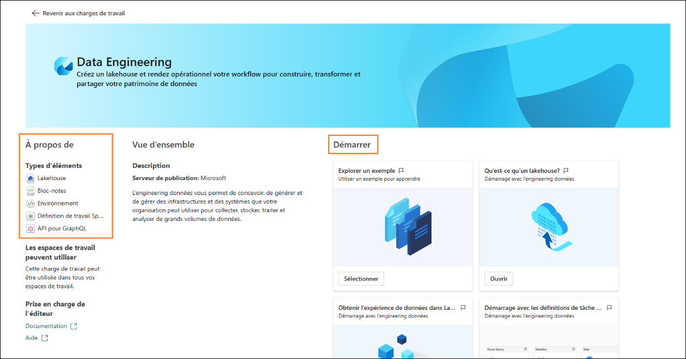

3. Cliquez sur **Retour aux charges de travail** en haut à gauche de
    l'écran. Vous serez alors redirigé(e) vers la page principale des
    charges de travail, où vous pourrez explorer d'autres outils ou
    sections.

   

## Tâche 8: expérience Data Science

1. Sur la page **Charges de travail**, cliquez sur **Data Science**.

   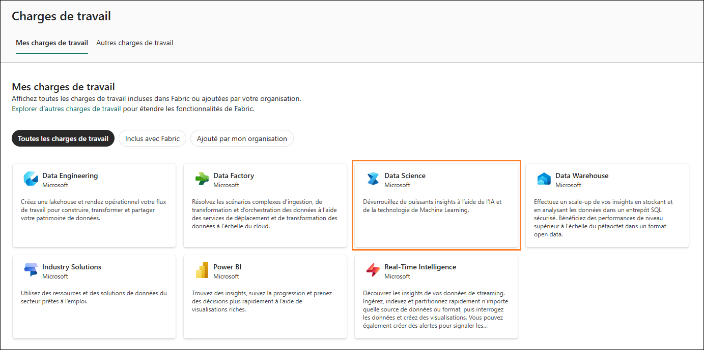

2. Vous êtes alors redirigé(e) vers la page d'accueil **Data Science**.
    Vous trouverez ci-dessous un aperçu détaillé des sections qui se
    trouvent sur cette page, lesquelles vous aideront à utiliser **Data
    Science** efficacement et pas à pas.

    ### Qu'est-ce que Data Science ?

    Data Science est un outil qui vous aide à obtenir des informations
    stratégiques cruciales, à l'aide de technologies d'IA et du machine
    learning. Il fournit des outils d'IA conçus pour vous aider à réaliser
    des flux de travail de science des données à grande échelle et à
    exploiter l'IA pour l'enrichissement des données et pour obtenir des
    données d'entreprise stratégiques.

    ### Types d'élément:

    a. **Modèle ML** **:** permet de créer des modèles Machine Learning.

    b. **Expérience** **:** permet de créer, d'exécuter et de suivre le
    développement de plusieurs modèles.

    c. **Notebook** **:** permet d'explorer des données et de créer des
    solutions de Machine Learning.

    d. **Environnement** **:** utilisé pour configurer les bibliothèques
    partagées, les paramètres de calcul Spark et les ressources pour les
    notebooks et les définitions de tâche Spark.

    e. **Compétence d'IA** **:** vous permet de créer votre propre
    expérience d'IA générative.

    f. **Notebook Python** **:** permet d'importer des notebooks Python à
    partir d'une machine locale.

    ### Démarrer:

    Pour commencer à utiliser Data Science, procédez comme suit:

    a. **Explorer un échantillon** **:** cliquez sur le bouton
    « Sélectionner » pour utiliser un échantillon et en savoir plus sur
    Data Science.

    b. **Démarrer avec les modèles ML** **:** cliquez sur « Ouvrir » pour
    apprendre à démarrer avec les modèles Machine Learning.

    c. **Démarrer avec les expériences ML** **:** cliquez sur « Ouvrir »
    pour apprendre à mener à bien des expériences Machine Learning.

    d. **Développer et exécuter des notebooks** **:** cliquez sur
    « Ouvrir » pour apprendre à développer et à exécuter des notebooks en
    vue de l'analyse de données.

    e. **Démarrer avec les notebooks** **:** cliquez sur « Ouvrir » pour
    apprendre à démarrer avec les modèles notebooks.

    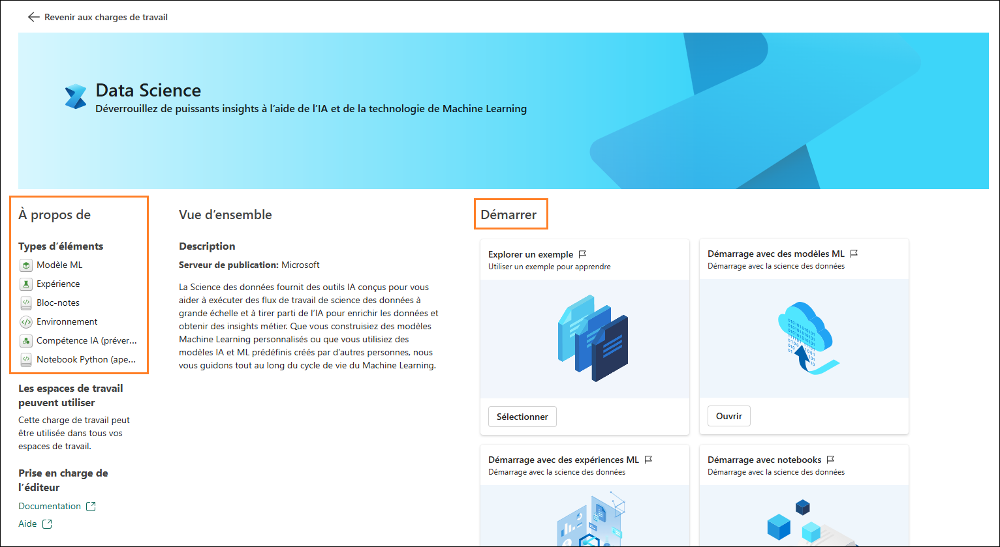

3. Cliquez sur **Retour aux charges de travail** en haut à gauche de
    l'écran. Vous serez alors redirigé(e) vers la page principale des
    charges de travail, où vous pourrez explorer d'autres outils ou
    sections.

   

## Tâche 9: expérience Data Warehouse

1. Sur la page **Charges de travail**, cliquez sur **Data Warehouse**
    pour continuer.

   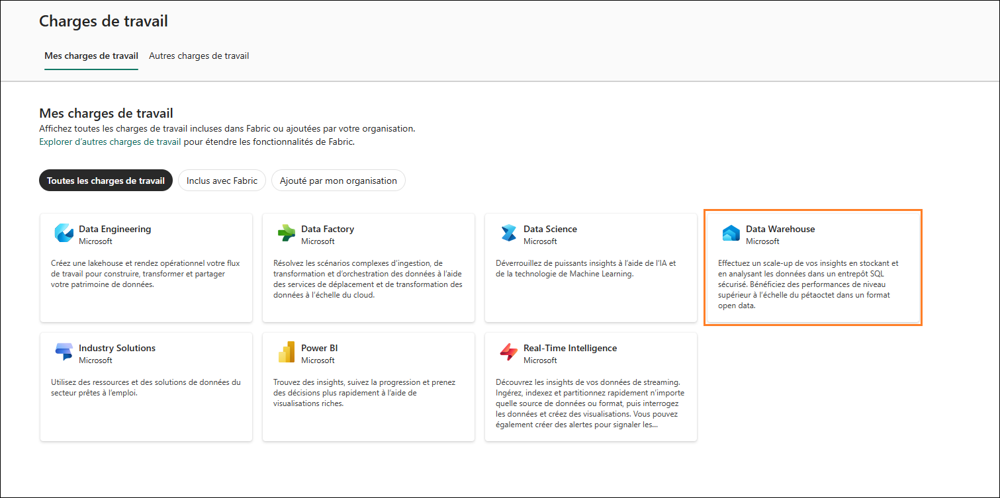

2. Vous êtes alors redirigé(e) vers la page d'accueil **Data
    Warehouse**. Vous trouverez ci-dessous un aperçu détaillé des
    sections qui se trouvent sur cette page, lesquelles vous aideront à
    utiliser **Data Warehouse** efficacement et pas à pas.

    ### Qu'est-ce que Data Warehouse ?

    Data Warehouse est un outil qui vous permet de stocker et d'analyser des
    données dans un entrepôt SQL sécurisé. Il vous permet d'effectuer un
    scale-up de vos informations stratégiques en bénéficiant de performances
    de premier plan à l'échelle du pétaoctet dans un format de données
    ouvertes.

    ### Types d'élément:

    a. **Entrepôt** **:** utilisé pour créer un Data Warehouse.

    b. **Exemple d'entrepôt** **:** permet d'explorer et de tester les
    fonctionnalités d'entreposage de données à l'aide de jeux de données
    et de modèles préconfigurés.

    c. **Pipeline de données** **:** permet d'orchestrer les solutions de
    données.

    d. **Notebook** **:** permet de créer et de partager des tâches
    interactives d'analyse et de visualisation des données.

    e. **Azure SQL Database en miroir** **:** permet de mettre en miroir
    d'Azure SQL Database.

    f. **Catalogue Azure Databricks en miroir** **:** permet de mettre en
    miroir des données d'Azure Databricks pour une intégration et une
    analyse améliorées.

    g. **Snowflake en miroir** **:** permet de mettre en miroir la base
    de données Snowflake.

    h. **Azure Cosmos DB en miroir** **:** permet de mettre en miroir
    Azure Cosmos DB.

    i. **Base de données gérée par Azure SQL en miroir** **:** permet de
    mettre en miroir les bases de données gérées par Azure SQL à des fins
    de haute disponibilité et de récupération d'urgence.

    j. **Base de données en miroir** **:** permet de répliquer des bases
    de données à des fins de haute disponibilité et de récupération
    d'urgence.

    ### Démarrer:

    Pour commencer à utiliser Data Warehouse, procédez comme suit:

    a. **Démarrer avec Entrepôt** **:** cliquez sur « Ouvrir » pour
    savoir comment utiliser un entrepôt afin d'analyser les données.

    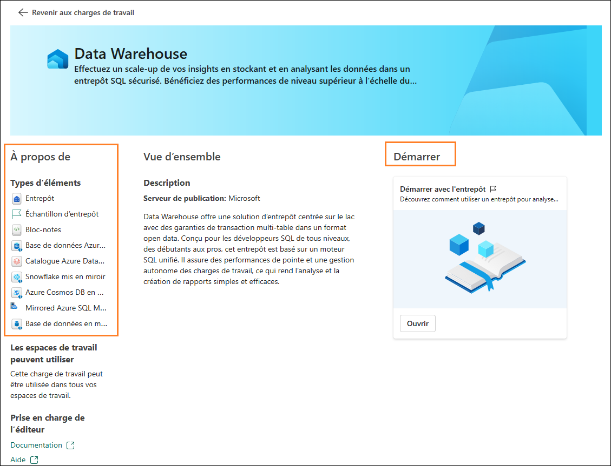

1. Cliquez sur **Retour aux charges de travail** en haut à gauche de
l'écran. Vous serez alors redirigé(e) vers la page principale des
charges de travail, où vous pourrez explorer d'autres outils ou
sections.

   

Dans ce laboratoire, nous avons exploré l'interface Fabric et créé un espace de travail Fabric et un Lakehouse. Dans le prochain laboratoire, nous apprendrons à utiliser les raccourcis dans Lakehouse pour nous connecter aux données ADLS Gen2 et à transformer ces données à l'aide de vues.

# Références

Fabric Analyst in a Day (FAIAD) vous présente certaines des fonctions
clés de Microsoft Fabric. Dans le menu du service, la section Aide (?)
comporte des liens vers d'excellentes ressources.

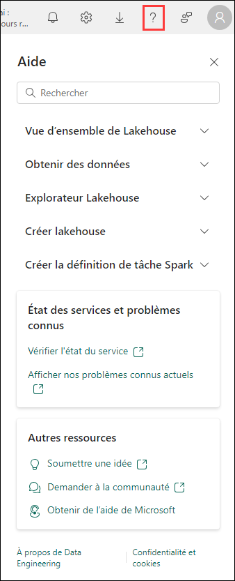

Voici quelques autres ressources qui vous aideront lors de vos
prochaines étapes avec Microsoft Fabric:

- Consultez le billet de blog pour lire l'intégralité de l'[annonce de
la GA de Microsoft
Fabric](https:/aka.ms/Fabric-Hero-Blog-Ignite23).

- Explorez Fabric grâce à la [visite
guidée](https:/aka.ms/Fabric-GuidedTour).

- Inscrivez-vous pour bénéficier d'un [essai gratuit de Microsoft
Fabric](https:/aka.ms/try-fabric).

- Rendez-vous sur le [site web Microsoft
Fabric](https:/aka.ms/microsoft-fabric).

- Acquérez de nouvelles compétences en explorant les [modules
d'apprentissage Fabric](https:/aka.ms/learn-fabric).

- Explorez la [documentation technique
Fabric](https:/aka.ms/fabric-docs).

- Lisez le [livre électronique gratuit sur la prise en main de
Fabric](https:/aka.ms/fabric-get-started-ebook).

- Rejoignez la [communauté Fabric](https:/aka.ms/fabric-community)
pour publier vos questions, partager vos commentaires et apprendre
des autres.

Lisez les blogs d'annonces plus détaillés sur l'expérience Fabric:

- [Blog Expérience Data Factory dans
Fabric](https:/aka.ms/Fabric-Data-Factory-Blog) 

- [Blog Expérience Synapse Data Engineering dans
Fabric](https:/aka.ms/Fabric-DE-Blog) 

- [Blog Expérience Synapse Data Science dans
Fabric](https:/aka.ms/Fabric-DS-Blog) 

- [Blog Expérience Synapse Data Warehousing dans
Fabric](https:/aka.ms/Fabric-DW-Blog) 

- [Blog Expérience Synapse Real-Time Analytics dans
Fabric](https:/aka.ms/Fabric-RTA-Blog)

- [Blog Annonce Power BI](https:/aka.ms/Fabric-PBI-Blog)

- [Blog Expérience Data Activator dans
Fabric](https:/aka.ms/Fabric-DA-Blog) 

- [Blog Administration et gouvernance dans
Fabric](https:/aka.ms/Fabric-Admin-Gov-Blog)

- [Blog OneLake dans Fabric](https:/aka.ms/Fabric-OneLake-Blog)

- [Blog Intégration de Dataverse et Microsoft
Fabric](https:/aka.ms/Dataverse-Fabric-Blog)

© 2025 Microsoft Corporation. Tous droits réservés.

En effectuant cette démonstration/ce labo, vous acceptez les
conditions suivantes:

La technologie/fonctionnalité décrite dans cette démonstration/ces
travaux pratiques est fournie par Microsoft Corporation en vue
d'obtenir vos commentaires et de vous fournir une expérience
d'apprentissage. Vous pouvez utiliser cette démonstration/ces ateliers
uniquement pour évaluer ces technologies et fonctionnalités, et pour
fournir des commentaires à Microsoft. Vous ne pouvez pas l'utiliser à
d'autres fins. Vous ne pouvez pas modifier, copier, distribuer,
transmettre, afficher, effectuer, reproduire, publier, accorder une
licence, créer des œuvres dérivées, transférer ou vendre tout ou une
partie de cette démonstration/ces ateliers.

LA COPIE OU LA REPRODUCTION DE CETTE DÉMONSTRATION/CES TRAVAUX
PRATIQUES (OU DE TOUTE PARTIE DE CEUX-CI) SUR TOUT AUTRE SERVEUR OU
AUTRE EMPLACEMENT EN VUE D'UNE AUTRE REPRODUCTION OU REDISTRIBUTION
EST EXPRESSÉMENT INTERDITE.

CETTE DÉMONSTRATION/CES TRAVAUX PRATIQUES FOURNISSENT CERTAINES
FONCTIONNALITÉS DE PRODUIT/TECHNOLOGIES LOGICIELLES, NOTAMMENT
D'ÉVENTUELS NOUVEAUX CONCEPTS ET FONCTIONNALITÉS, DANS UN
ENVIRONNEMENT SIMULÉ SANS INSTALLATION OU CONFIGURATION COMPLEXE AUX
FINS DÉCRITES CI-DESSUS. LES TECHNOLOGIES/CONCEPTS REPRÉSENTÉS DANS
CETTE DÉMONSTRATION/CES TRAVAUX PRATIQUES PEUVENT NE PAS REPRÉSENTER
LES FONCTIONNALITÉS COMPLÈTES ET PEUVENT NE PAS FONCTIONNER DE LA MÊME
MANIÈRE QUE DANS UNE VERSION FINALE. IL EST ÉGALEMENT POSSIBLE QUE
NOUS NE PUBLIIONS PAS DE VERSION FINALE DE CES FONCTIONNALITÉS OU
CONCEPTS. VOTRE EXPÉRIENCE D'UTILISATION DE CES FONCTIONNALITÉS
DANS UN ENVIRONNEMENT PHYSIQUE PEUT ÉGALEMENT ÊTRE DIFFÉRENTE.

**COMMENTAIRES**. Si vous envoyez des commentaires sur les
fonctionnalités, technologies et/ou concepts décrits dans ces
ateliers/cette démonstration à Microsoft, vous accordez à Microsoft,
sans frais, le droit d'utiliser, de partager et de commercialiser vos
commentaires de quelque manière et à quelque fin que ce soit. Vous
accordez également à des tiers, sans frais, les droits de brevet
nécessaires pour leurs produits, technologies et services en vue de
l'utilisation ou de l'interface avec des parties spécifiques d'un
logiciel ou d'un service Microsoft incluant les commentaires. Vous
n'enverrez pas de commentaires soumis à une licence exigeant que
Microsoft accorde une licence pour son logiciel ou sa documentation à
des tiers du fait que nous y incluons vos commentaires. Ces droits
survivent à ce contrat.

MICROSOFT CORPORATION DÉCLINE TOUTES LES GARANTIES ET CONDITIONS EN CE
QUI CONCERNE CETTE DÉMONSTRATION/CES TRAVAUX PRATIQUES, Y COMPRIS
TOUTES LES GARANTIES ET CONDITIONS DE QUALITÉ MARCHANDE, QU'ELLES
SOIENT EXPLICITES, IMPLICITES OU LÉGALES, D'ADÉQUATION À UN USAGE
PARTICULIER, DE TITRE ET D'ABSENCE DE CONTREFAÇON. MICROSOFT N'OFFRE
AUCUNE GARANTIE OU REPRÉSENTATION EN CE QUI CONCERNE LA PRÉCISION DES
RÉSULTATS, LA CONSÉQUENCE QUI DÉCOULE DE L'UTILISATION DE CETTE
DÉMONSTRATION/CES ATELIERS, OU L'ADÉQUATION DES INFORMATIONS CONTENUES
DANS CETTE DÉMONSTRATION/CES ATELIERS À QUELQUE FIN QUE CE SOIT.

**CLAUSE D'EXCLUSION DE RESPONSABILITÉ**

Cette démonstration/Ce labo comporte seulement une partie des
nouvelles fonctionnalités et améliorations disponibles dans Microsoft
Power BI. Certaines fonctionnalités sont susceptibles de changer dans
les versions ultérieures du produit. Dans ce labo/cette démonstration,
vous allez découvrir comment utiliser certaines nouvelles
fonctionnalités, mais pas toutes.