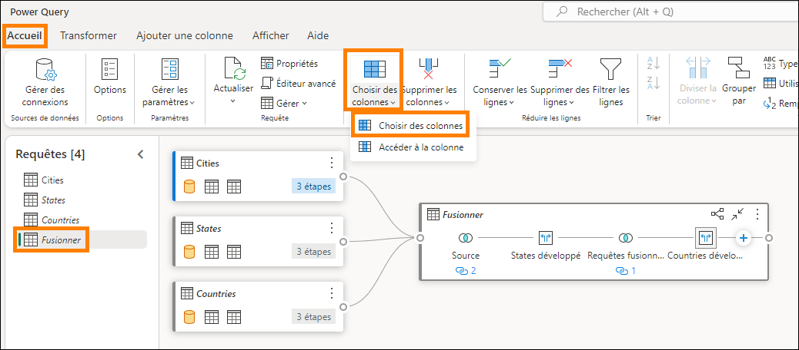

# Microsoft Fabric - Fabric Analyst in a Day - Labo 3


# Sommaire
- Introduction
- Raccourci vers ADLS Gen2
    - Tâche 1: créer un raccourci
- Transformer des données à l’aide d’une requête visuelle
    - Tâche 2: créer une vue Geo à l’aide d’une requête visuelle
    - Tâche 3: créer une vue Reseller à l’aide d’une requête visuelle
    - Tâche 4: créer une vue Sales à l’aide d’une requête visuelle
    - Tâche 5: créer une vue Product à l’aide d’une requête visuelle
- Références

# Introduction 

Dans notre scénario, les données Sales proviennent du système ERP et
sont stockées dans une base de données ADLS Gen2. Elles sont mises à
jour au quotidien à midi. Nous devons transformer et ingérer ces données
dans Lakehouse et les utiliser dans notre modèle.

Plusieurs moyens permettent d'ingérer ces données.

- **Raccourcis:** ce moyen nous permet de créer un lien avec les
    données et nous pouvons les transformer à l'aide de vues Requête
    visuelle. Nous allons utiliser des raccourcis dans ce labo.

- **Notebooks:** ce moyen nous oblige à écrire du code. Il s'agit
    d'une approche conviviale pour les développeurs.

- **Dataflow Gen2:** vous connaissez probablement Power Query ou
    Dataflow Gen1. Dataflow Gen2, comme son nom l'indique, est la
    version la plus récente de Dataflow. Elle offre toutes les
    fonctionnalités de Power Query/Dataflow Gen1 avec la possibilité
    supplémentaire de transformer et d'ingérer des données dans
    plusieurs sources de données. Nous allons aborder cela dans les
    prochains labos.

- **Pipeline de données:** il s'agit d'un outil d'orchestration. Les
    activités peuvent être orchestrées pour extraire, transformer et
    ingérer des données. Le pipeline de données va nous permettre
    d'exécuter l'activité Dataflow Gen2 qui à son tour effectue
    l'extraction, la transformation et l'ingestion.

Nous allons commencer par créer un raccourci pour ingérer des données
dans une lakehouse à partir de la source de données ADLS Gen2. Une fois
les données ingérées, nous allons les transformer à l'aide de vues
Requête visuelle.

À la fin de ce labo, vous saurez:

- Comment créer des raccourcis vers votre Lakehouse

- Comment transformer des données à l'aide d'une fonctionnalité
    Requête visuelle

# Raccourci vers ADLS Gen2

## Tâche 1: créer un raccourci

Des raccourcis permettent de créer un lien vers l'emplacement cible. Les
raccourcis permettent d'accéder aux données sans avoir besoin de les
déplacer physiquement dans la lakehouse. Cela s'apparente à la création
de raccourcis sur le bureau Windows.

1. Revenons à l'**espace de travail Fabric** **(1)** que vous avez créé
    dans le labo 2, durant la tâche 8.

2. Si vous ne l'avez pas quitté après le labo précédent, vous vous
    trouvez sur l'écran Lakehouse. Si vous l'avez quitté, ce n'est pas
    grave. Cliquez sur **lh_FAIAD** (**2)** pour accéder à la lakehouse.

3. Dans le volet **Explorateur**, cliquez sur les **points de
    suspension (3)** en regard de **Tables**.

4. Cliquez sur **Nouveau raccourci (4)**.

   

5. La boîte de dialogue **Nouveau raccourci** s'ouvre alors. Sous
    **Sources externes**, sélectionnez **Azure Data Lake Storage Gen2**.

   

6. Cliquez sur **+ Créer une connexion (1)**.

7. Entrez le lien suivant pour la propriété **URL**: `https://stvnextblobstorage.dfs.core.windows.net/fabrikam-sales` **(2):**

8. Sélectionnez **Signature d'accès partagé (SAS) (3)** dans la liste
    déroulante Type d'authentification.

9. Copiez le jeton SAS et collez-le dans le champ Jeton SAS (4).

    - **Jeton SAS:** <inject key="Sas token"></inject>

10. Cliquez sur **Suivant (5)** en bas de l'écran à droite.

    

11. connecté(e) à ADLS Gen2 avec la structure de répertoires s'affichant
    dans le volet gauche. Développez **Delta-Parquet-Format-FY25 (1).**

12. **Sélectionnez** les répertoires suivants **(2),** puis cliquez sur
    **Suivant (3):**

    a. Application.Cities

    b. Application.Countries

    c. Application.StateProvinces

    d. DateDim

    e. Sales.BuyingGroups

    f. Sales.Customers

    g. Sales.InvoiceLines

    h. Sales.Invoices

    i. Warehouse.StockGroups

    j. Warehouse.StockItemStockGroups

    k. Warehouse.StockItems

    **Remarque:** Sales.Invoices_May est le seul répertoire **non**
    sélectionné.

    

13. Vous êtes alors redirigé(e) vers la boîte de dialogue suivante dans
    laquelle nous pouvons modifier les noms. Cliquez sur l'**icône
    Modifier (1)** sous Actions pour **Application.Cities**.

14. Redéfinissez le nom du répertoire **Application.Cities sur Cities
    (2).**

15. Cliquez sur la coche en regard du nom pour enregistrer la
    modification **(3)**.

    

16. De même, redéfinissez le nom des raccourcis comme ci-dessous:

    a. Application.Countries sur **Countries**

    b. Application.StateProvinces sur **States**

    c. DateDim sur **Date**

    d. Sales.BuyingGroups sur **BuyingGroups**

    e. Sales.Customers sur **Customers**

    f. Sales.InvoiceLines sur **InvoiceLineItems**

    g. Sales.Invoices sur **Invoices**

    h. Warehouse.StockGroups sur **ProductGroups**

    i. Warehouse.StockItemStockGroups sur **ProductItemGroup**

    j. Warehouse.StockItems sur **ProductItem**

    > **Remarque**: vérifiez les noms. Une faute de frappe peut provoquer
    des erreurs lors du labo.

17. Cliquez sur **Créer** pour créer le raccourci.

    

18. Notez que tous les raccourcis sont créés sous forme de tables.
    Sélectionnez la table **BuyingGroups** et notez que nous pouvons
    voir une version préliminaire des données dans le volet de données.

    

L'étape suivante consiste à transformer les données afin de pouvoir
créer un modèle sémantique. Nous allons créer des vues pour transformer
les données.

# Transformer des données à l'aide d'une requête visuelle

## Tâche 2: créer une vue Geo à l'aide d'une requête visuelle

1. Nous pouvons accéder à la lakehouse à l'aide d'un point de
    terminaison SQL. Ainsi, nous pouvons interroger les données et créer
    des vues. En **haut à droite** de l 'écran, cliquez sur
    **Lakehouse (1) -> Point de terminaison Analytique SQL (2)**.

   

    Vous êtes alors redirigé(e) vers le point de terminaison analytique SQL.
    Notez que le volet Explorateur a changé. Vous pouvez désormais créer des
    vues, des procédures stockées, des requêtes et bien plus encore. Nous
    allons créer une requête visuelle, car elle fournit du low code, comme
    interface Power Query. Nous allons enregistrer le résultat en tant que
    vue.

    Nous allons commencer par créer une vue Geo. Nous devons fusionner les
    données des requêtes Cities, States et Countries pour créer la vue Geo.

2. Dans le menu supérieur, cliquez sur le menu déroulant en regard de
    **Nouvelle requête SQL (1)**, puis sélectionnez **Nouvelle requête
    visuelle (2)**.

   

3. Pour construire une requête, nous devons ajouter des tables au volet
    Visual Query. Cliquez sur les points de suspension à côté de la
    table **Cities (1)** et sélectionnez **Insérer dans canevas (2).**

   

4. Procédez de la même manière pour les tables **States** et
    **Countries**.

    Nous devons ensuite fusionner ces requêtes. L'éditeur de requête
    visuelle permet d'utiliser l'éditeur Power Query. Utilisons-le,
    puisqu'il nous est familier.

5. Dans le menu de l'éditeur de requête visuelle, cliquez sur l'icône
    **Ouvrir dans une fenêtre contextuelle** (vers la droite). Vous êtes
    alors redirigé(e) vers l'éditeur Power Query.

   

6. Avec la requête Cities sélectionnée (1), cliquez sur **Accueil (2) -> Combiner (3) -> Menu déroulant Fusionner les requêtes (4) -> Fusionner les requêtes comme nouvelles (5)** dans le ruban de l'éditeur Power Query. La boîte de dialogue Fusionner des requêtes s'ouvre alors.

   

7. Dans le champ **Table de gauche pour la fusion**, sélectionnez
    **Cities**.

8. Dans le champ **Table de droite pour la fusion**, sélectionnez
    **States**.

9. Sélectionnez la colonne **StateProvinceID** dans les deux tables.
    Nous allons les joindre à l'aide de cette colonne.

10. Sélectionnez **Interne** comme **Type de jointure**.

11. Cliquez sur **OK**.

    

    Notez qu'une requête nommée Merge a été créée. Nous avons besoin de
    quelques colonnes de la table States.

12. Dans la **vue Données** (volet inférieur), cliquez sur la **double
    flèche** en regard de la colonne **States** (dernière colonne à
    droite).

13. Un volet s'ouvre alors. **Sélectionnez** les colonnes suivantes:

    a. StateProvinceCode

    b. StateProvinceName

    c. CountryID

    d. SalesTerritory

14. Cliquez sur **OK**.

    

    Nous devons maintenant fusionner la requête Countries.

15. Avec la requête Merge sélectionnée (1), cliquez sur **Accueil (2) -> Combiner (3) -> Menu déroulant Fusionner les requêtes (4) -> Fusionner les requêtes (5)**.

    

16. La boîte de dialogue Fusionner des requêtes s'ouvre alors. Dans le
    champ **Table de droite pour la fusion**, sélectionnez
    **Countries**.

17. Sélectionnez la colonne **CountryID** dans les deux tables. Nous
    allons les joindre à l'aide de cette colonne.

18. Sélectionnez **Interne** comme **Type de jointure**.

19. Cliquez sur **OK**.

    

    Nous avons besoin de quelques colonnes de la table Countries.

20. Dans la **vue Données** (volet inférieur), cliquez sur la **double
    flèche** en regard de la colonne **Countries**.

21. Un volet s'ouvre alors. **Sélectionnez** les colonnes suivantes:

    a. CountryName

    b. FormalName

    c. IsoAlpha3Code

    d. IsoNumericCode

    e. CountryType

    f. Continent

    g. Region

    h. Subregion

22. Cliquez sur **OK**.

    

    Nous n'avons pas besoin de toutes les colonnes. Veillez à sélectionner
    uniquement ceux dont nous avons besoin.

23. Avec la requête Merge sélectionnée, cliquez sur **Accueil -  >
    Choisir des colonnes -> Choisir des colonnes** dans le ruban.

    > **Remarque:** si l'option Choisir des colonnes n'est pas visible, vous pouvez la trouver sous Gérer les colonnes.

    

24. La boîte de dialogue Choisir des colonnes s'ouvre alors.
    **Décochez** les colonnes suivantes:

    a. StateProvinceID

    b. Location

    c. LastEditedBy

    d. ValidFrom

    e. ValidTo

    f. CountryID

25. Cliquez sur **OK**.

    

    Notez que le processus est similaire à celui de Power Query: toutes les
    étapes sont enregistrées à la fois dans le volet Étapes appliquées à
    droite et dans la vue visuelle. Renommons la requête Merge et activons
    le chargement, afin que les données soient chargées à partir de cette
    requête.

26. **Cliquez avec le bouton droit** sur la requête **Merge** dans le
    volet (gauche) Requêtes. Sélectionnez **Renommer** et redéfinissez
    le nom de la requête sur **Geo**.

27. **Cliquez avec le bouton droit** sur la requête **Geo** dans le
    volet (gauche) Requêtes. Sélectionnez **Activer le chargement** pour
    activer cette requête.

28. Assurez-vous que les requêtes Cities, States et Countries sont
    **désactivées**.

29. Cliquez sur **Enregistrer** en bas à droit de l'Éditeur Power Query.

    

    Nous sommes alors redirigés vers l'éditeur de requête visuelle.
    Enregistrons maintenant cette requête en tant que vue.

    > **Remarque**: toutes les étapes que nous avons effectuées à l'aide de l'éditeur Power Query peuvent également être réalisées à l'aide de
    l'éditeur de requête visuelle.

30. Dans le menu de l'éditeur de requête visuelle, sélectionnez **Enregistrer en tant que vue**.

    

    La boîte de dialogue Enregistrer en tant que vue s'ouvre alors. Notez
    que la requête SQL est disponible. Vous pouvez la passer en revue si
    vous souhaitez examiner le SQL.

31. Saisissez **Geo** dans le champ **Nom de la vue**.

32. Cliquez sur **OK** pour enregistrer la vue.

    

    Une alerte s'affiche une fois la vue enregistrée.

33. Dans le volet (gauche) Explorateur, développez **Views**. Nous
    disposons de la vue Geo venant d'être créée.

    

## Tâche 3: créer une vue Reseller à l'aide d'une requête visuelle

Créons une vue Reseller en fusionnant la table Customers avec la table
BuyingGroups. Cette fois-ci, nous allons créer la vue à l'aide d'une
requête visuelle.

1. Dans le menu supérieur, cliquez sur le menu déroulant en regard de
    **Nouvelle requête SQL (1)**, puis sélectionnez **Nouvelle requête
    visuelle (2)**.

2. Pour construire une requête, nous devons ajouter des tables au volet
    Visual Query. Cliquez sur les points de suspension à côté de la
    table **BuyingGroups (1)** et sélectionnez **Insérer dans canevas
    (2)**.

   

3. Procédez de la même manière pour la table **Customers**.

4. **Sélectionnez la requête** Customers. Une fois sélectionnée, la
    requête Customers a une bordure bleue et un signe « **+** »
    s'affiche après Table. (Ce signe indique que nous ajoutons une étape
    après Table. Si vous ne voyez pas le signe « **+** » après Table,
    vous avez peut-être sélectionné une autre étape. Sélectionnez Table
    et vous serez prêt.)

5. Dans le menu Requête visuelle, cliquez sur **Combiner -> Fusionner
    des requêtes**.

   

    La boîte de dialogue Fusionner s'ouvre alors avec Customers sélectionnée
    comme table supérieure.

6. Dans le champ **Table de droite pour la fusion**, sélectionnez
    **BuyingGroups**.

7. Sélectionnez la colonne **BuyingGroupID** dans les deux tables. Nous
    allons les joindre à l'aide de cette colonne.

8. Sélectionnez **Interne** comme **Type de jointure**.

9. Cliquez sur **OK**.

   

10. Dans la **vue Données** (volet inférieur), cliquez sur la **double
    flèche** en regard de la colonne **BuyingGroups** (dernière colonne
    à droite) pour sélectionner les colonnes dont nous avons besoin dans
    la table BuyingGroups.

11. Un volet s'ouvre alors. **Sélectionnez** la colonne
    **BuyingGroupName**.

12. Cliquez sur **OK**.

    

    Nous n'avons pas besoin de toutes les colonnes. Nous allons sélectionner
    uniquement celles dont nous avons besoin.

13. Dans le menu Requête visuelle, cliquez sur **Gérer les colonnes ->
    Choisir des colonnes**.

    

14. La boîte de dialogue Choisir des colonnes s'ouvre alors.
    **Sélectionnez** les colonnes suivantes:

    a. ResellerID

    b. ResellerName

    c. PostalCityID

    d. PhoneNumber

    e. FaxNumber

    f. WebsiteURL

    g. DeliveryAddressLine1

    h. DeliveryAddressLine2

    i. DeliveryPostalCode

    j. PostalAddressLine1

    k. PostalAddressLine2

    l. PostalPostalCode

    m. BuyingGroupName

15. Cliquez sur **OK**.

    

16. Renommons la colonne BuyingGroupName. Dans la **vue Données,
    double-cliquez sur l'en-tête de colonne BuyingGroupName** pour le
    rendre modifiable.

17. **Redéfinissez le nom** de la colonne sur **ResellerCompany**.

    

    Notez que toutes les étapes sont documentées dans la table Customers. À
    présent, enregistrons cette vue.

18. Nous devons enregistrer la requête Customer comme elle inclut toutes
    les étapes. Nous devons activer le chargement. Sélectionnez les
    **points de suspension** dans la zone de requête **Customer**.

19. Assurez-vous que l'option **Activer le chargement** est cochée.

    

    > **Remarque**: si l'option Activer le chargement est activée, une
    bordure bleue apparaît autour de la zone **Customer**.

20. Dans le menu Requête visuelle, sélectionnez **Enregistrer en tant
    que vue**.

    

    La boîte de dialogue Enregistrer en tant que vue s'ouvre alors. Notez
    que la requête SQL est disponible. Vous pouvez l'examiner, si vous la
    sélectionnez.

21. Saisissez **Reseller** dans le champ **Nom de la vue**.

22. Cliquez sur **OK** pour enregistrer la vue.

    

    Une alerte s'affiche une fois la vue enregistrée.

23. Dans le volet (gauche) Explorateur, développez **Views**. Nous
    disposons de la vue Reseller venant d'être créée.

    

## Tâche 4: créer une vue Sales à l'aide d'une requête visuelle

Créons la vue Sales en fusionnant les tables InvoiceLineItems et
Invoices avec la vue Reseller. Nous disposons de cette requête dans
Power BI Desktop. Nous allons copier le code depuis l'Éditeur avancé.
Mais avant de copier le code, nous devons créer une table de fusion à
l'aide d'une requête visuelle, car la création d'une requête vide n'est
pas possible dans la requête visuelle. Essayons cette méthode.

1. Dans le menu supérieur, cliquez sur le menu déroulant en regard de
    **Nouvelle requête SQL**, puis sélectionnez **Nouvelle requête
    visuelle**.

   

2. Dans la section **Explorateur -> Table**, nous devons ajouter les
    tables au volet Requête visuelle. Cliquez sur les points de
    suspension à côté de la table **InvoiceLineItems** et sélectionnez
    **Insérer dans canevas**.

3. Procédez de la même manière pour la table **Invoices**.

4. Dans la section **Explorateur -> Vues**, nous devons ajouter les
    tables au volet Requête visuelle. Cliquez sur les points de
    suspension à côté de la table **Reseller** et sélectionnez **Insérer
    dans canevas**.

5. Dans l'éditeur de requête visuelle, cliquez sur l'icône **Ouvrir
    dans une fenêtre contextuelle** pour ouvrir l'Éditeur Power Query.

   

6. Avec la requête **InvoiceLineItems** sélectionnée, cliquez sur
    **Accueil (2) -> Combiner (3) -> Menu déroulant Fusionner les
    requêtes (4) -> Fusionner les requêtes comme nouvelles (5) sur le
    ruban.** La boîte de dialogue Fusionner des requêtes s'ouvre alors.

   

7. Dans le champ **Table de gauche pour la fusion**, sélectionnez
    **InvoiceLineItems**.

8. Dans le champ **Table de droite pour la fusion**, sélectionnez
    **Invoices**.

9. Sélectionnez la colonne **InvoiceID** dans les deux tables. Nous
    allons les joindre à l'aide de cette colonne.

10. Sélectionnez **Interne** comme **Type de jointure**.

11. Cliquez sur **OK**.

    

    Nous allons copier le code depuis Power BI Desktop et le coller à l'aide
    de l'Éditeur avancé.

12. Si vous ne l'avez pas encore ouvert, ouvrez le fichier
    **FAIAD.pbix** situé dans le dossier **Reports** sur le bureau de
    votre environnement de labo.

13. Dans le ruban, cliquez sur **Accueil -> Transformer les données**.
    Une fenêtre Power Query s'ouvre alors. Comme vous l'avez remarqué
    dans le labo précédent, les requêtes du volet gauche sont organisées
    par source de données.

    

14. Dans le volet gauche **Requêtes** sous **ADLSData** **(1)**,
    sélectionnez la requête **Sales (2).**

15. Dans le ruban, cliquez sur **Accueil -  > Éditeur avancé (3)**. La
    boîte de dialogue Éditeur avancé s'ouvre alors.

    

    > **Remarque:** si vous ne trouvez pas l'Éditeur avancé, vous pouvez y accéder sous **Accueil -> Requête -> Éditeur avancé**.

16. **Sélectionnez le code de la ligne 3** (# "Expanded Invoice "...)
    jusqu'à la dernière ligne de code.

17. **Cliquez avec le bouton droit** et sélectionnez **Copier**.

18. Cliquez sur **Annuler** pour fermer l'Éditeur avancé.

    

19. **Revenez au navigateur** dans lequel l'Éditeur Power Query est
    ouvert.

20. Assurez-vous que la requête **Merge** est sélectionnée.

21. Dans le ruban, cliquez sur **Accueil -> Éditeur avancé**. La boîte
    de dialogue Éditeur avancé s'ouvre alors.

    

22. À la **fin de la ligne 2, ajoutez une virgule** (Source =
    Table.NestedJoin(InvoiceLineItems, { "InvoiceID "}, Invoices,
    { "InvoiceID "},  "Invoices ", JoinKind.Inner).

23. Appuyez sur **Entrée** pour commencer une nouvelle ligne.

24. À l'aide du raccourci clavier **Ctrl + V**, collez le code que vous
    avez copié depuis Power BI Desktop.

    > **Remarque**: si vous travaillez dans l'environnement de labo,
    cliquez sur les **points de suspension ( ...)** en haut de l'écran à
    droite. Utilisez le curseur pour **activer** **le Presse-papiers natif
    de VM**. Cliquez sur OK dans la boîte de dialogue. Après avoir collé
    les requêtes, vous pouvez désactiver cette option.

    

    

25. Mettez en surbrillance les deux dernières lignes de code (dans
    Source) et **supprimez**-les.

26. Cliquez sur **OK** pour enregistrer les modifications.

    

    Si c'est plus facile, supprimez tout le code dans l'Éditeur avancé et
    collez le code ci-dessous à la place:

    ```
    let
      Source = Table.NestedJoin(InvoiceLineItems, {"InvoiceID"}, Invoices, {"InvoiceID"}, "Invoices", JoinKind.Inner),
        #"Expanded Invoice" = Table.ExpandTableColumn(Source, "Invoices", {"CustomerID", "BillToCustomerID", "SalespersonPersonID", "InvoiceDate"}, {"CustomerID", "BillToCustomerID", "SalespersonPersonID", "InvoiceDate"}),
        #"Removed Other Columns" = Table.SelectColumns(#"Expanded Invoice",{"InvoiceLineID", "InvoiceID", "StockItemID", "Quantity", "UnitPrice", "TaxRate", "TaxAmount", "LineProfit", "ExtendedPrice", "CustomerID", "SalespersonPersonID", "InvoiceDate"}),
        #"Renamed Columns" = Table.RenameColumns(#"Removed Other Columns",{{"CustomerID", "ResellerID"}}),
        #"Merged Queries" = Table.NestedJoin(#"Renamed Columns", {"ResellerID"}, Reseller, {"ResellerID"}, "Customer", JoinKind.Inner),
        #"Added Custom" = Table.AddColumn(#"Merged Queries", "Sales Amount", each [ExtendedPrice] - [TaxAmount]),
        #"Changed Type" = Table.TransformColumnTypes(#"Added Custom",{{"Sales Amount", type number}}),
        #"Removed Columns" = Table.RemoveColumns(#"Changed Type",{"Customer"})
    in
        #"Removed Columns"
    ```

27. Vous êtes alors redirigé(e) vers l'Éditeur Power Query. Dans le
    volet gauche Requêtes, **double-cliquez sur la requête Merge** pour
    la renommer.

28. **Redéfinissez le nom** de la requête Merge sur **Sales**.

29. Cliquez avec le bouton droit sur la requête Sales et sélectionnez
    **Activer le chargement** pour permettre le chargement de la
    requête.

    

30. Cliquez sur **Enregistrer** pour enregistrer et fermer la boîte de
    dialogue Power Query. Vous serez alors redirigé(e) vers l'éditeur de
    requête visuelle.

31. Dans le menu Requête visuelle, sélectionnez **Enregistrer en tant
    que vue**. La boîte de dialogue Enregistrer en tant que vue s'ouvre
    alors. Notez que la requête SQL est disponible. Vous pouvez
    l'examiner, le cas échéant.

32. Saisissez **Sales** dans le champ **Nom de la vue (1)**.

33. Cliquez sur **OK (2)** pour enregistrer la vue.

    

    Une alerte s'affiche une fois la vue enregistrée.

34. Dans le volet Explorateur (à gauche), développez **Views**. Nous
    disposons de la vue Sales venant d'être créée.

    

## Tâche 5: créer une vue Product à l'aide d'une requête visuelle

Créons la vue Product en fusionnant les tables **ProductItem**,
**ProductItemGroup** et **ProductGroups**. Pour faire avancer les
choses, nous allons copier le code dans l'Éditeur avancé.

1. Dans le menu supérieur, cliquez sur le menu déroulant en regard de
    **Nouvelle requête SQL (1)**, puis sélectionnez **Nouvelle requête
    visuelle (2)**.

   

2. Dans la section Explorateur, nous devons ajouter les tables au volet
    Requête visuelle. Cliquez sur les points de suspension à côté de la
    table **ProductItem (1)** et sélectionnez **Insérer dans canevas
    (2)**.

   

3. Procédez de la même manière pour les tables **ProductItemGroup** et
    **ProductGroups**.

4. Dans l'éditeur de requête visuelle, cliquez sur l'**icône Mode
    Focus** pour ouvrir l'éditeur Power Query.

   

5. Avec la requête **ProductItem** sélectionnée, cliquez sur **Accueil (1) -> Combiner (2) -> Menu déroulant Fusionner les requêtes (3) -> Fusionner les requêtes comme nouvelles (4) sur le ruban.** La boîte de dialogue Fusionner s'ouvre alors.

   

6. Dans le champ **Table de gauche pour la fusion**, sélectionnez
    **ProductItem**.

7. Dans le champ **Table de droite pour la fusion**, sélectionnez
    **ProductItemGroup**.

8. Sélectionnez la colonne **StockItemID** dans les deux tables. Nous
    allons les joindre à l'aide de cette colonne.

9. Sélectionnez **Externe gauche** dans le champ **Type de jointure**.

10. Cliquez sur **OK.** Une requête Merge est alors créée.

    

11. Avec la requête Merge sélectionnée, cliquez sur **Accueil ->
    Éditeur avancé** dans le ruban. La boîte de dialogue Éditeur avancé
    s'ouvre alors.

    

    > **Remarque:** si vous ne trouvez pas l'Éditeur avancé, vous pouvez y
    accéder sous **Accueil -> Requête -> Éditeur avancé**.

12. **Sélectionnez tout le code** dans l'Éditeur avancé et
    **supprimez**-le.

13. **Collez** le code ci-dessous dans l'Éditeur avancé:

    ```
    let
       Source = Table.NestedJoin(ProductItem, {"StockItemID"}, ProductItemGroup, {"StockItemID"}, "ProductItemGroup", JoinKind.LeftOuter),
       #"Expanded ProductItemGroup" = Table.ExpandTableColumn(Source, "ProductItemGroup", {"StockGroupID"}, {"StockGroupID"}),
       #"Merged queries" = Table.NestedJoin(#"Expanded ProductItemGroup", {"StockGroupID"}, ProductGroups, {"StockGroupID"}, "ProductGroups", JoinKind.LeftOuter),
       #"Expanded ProductGroups" = Table.ExpandTableColumn(#"Merged queries", "ProductGroups", {"StockGroupName"}, {"StockGroupName"}),
       #"Choose columns" = Table.SelectColumns(#"Expanded ProductGroups", {"StockItemID", "StockItemName", "SupplierID", "Size", "IsChillerStock", "TaxRate", "UnitPrice", "RecommendedRetailPrice", "TypicalWeightPerUnit", "StockGroupName"})
    in
       #"Choose columns"
    ```

14. Cliquez sur **OK** pour fermer l'Éditeur avancé. Vous êtes alors
    redirigé(e) vers l'Éditeur Power Query.

    

15. Dans le volet Requêtes à gauche, **double-cliquez sur la requête
    Merge** pour la renommer.

16. **Renommez** la requête Merge **Product**.

17. Cliquez avec le bouton droit sur la requête Product et sélectionnez
    **Activer le chargement** pour permettre le chargement de la
    requête.

18. Cliquez sur **Enregistrer** pour enregistrer et fermer la boîte de
    dialogue Power Query. Vous êtes alors redirigé vers la requête
    visuelle.

    

19. Dans le menu Requête visuelle, sélectionnez **Enregistrer en tant
    que vue**. La boîte de dialogue Enregistrer en tant que vue s'ouvre
    alors. Notez que la requête SQL est disponible. Vous pouvez
    l'examiner, le cas échéant.

20. Saisissez **Product** dans le champ **Nom de la vue**.

21. Cliquez sur **OK** pour enregistrer la vue.

    

    Une alerte s'affiche une fois la vue enregistrée.

22. Dans le volet (gauche) Explorateur, développez **Views**. Nous
    disposons de la vue Product venant d'être créée.

    

    Nous avons transformé les données de la source de données ADLS Gen2.
    Dans ce labo, nous avons découvert comment créer des raccourcis et
    exploré diverses options permettant de transformer des données à l'aide
    de vues de requête visuelle.

    Dans le prochain labo, nous allons découvrir comment utiliser
    Dataflow Gen2 et créer un raccourci vers une autre lakehouse.

# Références

Fabric Analyst in a Day (FAIAD) vous présente certaines des fonctions
clés de Microsoft Fabric. Dans le menu du service, la section Aide (?)
comporte des liens vers d'excellentes ressources.


Voici quelques autres ressources qui vous aideront lors de vos
prochaines étapes avec Microsoft Fabric:

- Consultez le billet de blog pour lire l'intégralité de l'[annonce de
la GA de Microsoft
Fabric](https:/aka.ms/Fabric-Hero-Blog-Ignite23).

- Explorez Fabric grâce à la [visite
guidée](https:/aka.ms/Fabric-GuidedTour).

- Inscrivez-vous pour bénéficier d'un [essai gratuit de Microsoft
Fabric](https:/aka.ms/try-fabric).

- Rendez-vous sur le [site web Microsoft
Fabric](https:/aka.ms/microsoft-fabric).

- Acquérez de nouvelles compétences en explorant les [modules
d'apprentissage Fabric](https:/aka.ms/learn-fabric).

- Explorez la [documentation technique
Fabric](https:/aka.ms/fabric-docs).

- Lisez le [livre électronique gratuit sur la prise en main de
Fabric](https:/aka.ms/fabric-get-started-ebook).

- Rejoignez la [communauté Fabric](https:/aka.ms/fabric-community)
pour publier vos questions, partager vos commentaires et apprendre
des autres.

Lisez les blogs d'annonces plus détaillés sur l'expérience Fabric:

- [Blog Expérience Data Factory dans
Fabric](https:/aka.ms/Fabric-Data-Factory-Blog) 

- [Blog Expérience Synapse Data Engineering dans
Fabric](https:/aka.ms/Fabric-DE-Blog) 

- [Blog Expérience Synapse Data Science dans
Fabric](https:/aka.ms/Fabric-DS-Blog) 

- [Blog Expérience Synapse Data Warehousing dans
Fabric](https:/aka.ms/Fabric-DW-Blog) 

- [Blog Expérience Synapse Real-Time Analytics dans
Fabric](https:/aka.ms/Fabric-RTA-Blog)

- [Blog Annonce Power BI](https:/aka.ms/Fabric-PBI-Blog)

- [Blog Expérience Data Activator dans
Fabric](https:/aka.ms/Fabric-DA-Blog) 

- [Blog Administration et gouvernance dans
Fabric](https:/aka.ms/Fabric-Admin-Gov-Blog)

- [Blog OneLake dans Fabric](https:/aka.ms/Fabric-OneLake-Blog)

- [Blog Intégration de Dataverse et Microsoft
Fabric](https:/aka.ms/Dataverse-Fabric-Blog)

© 2025 Microsoft Corporation. Tous droits réservés.

En effectuant cette démonstration/ce labo, vous acceptez les
conditions suivantes:

La technologie/fonctionnalité décrite dans cette démonstration/ces
travaux pratiques est fournie par Microsoft Corporation en vue
d'obtenir vos commentaires et de vous fournir une expérience
d'apprentissage. Vous pouvez utiliser cette démonstration/ces ateliers
uniquement pour évaluer ces technologies et fonctionnalités, et pour
fournir des commentaires à Microsoft. Vous ne pouvez pas l'utiliser à
d'autres fins. Vous ne pouvez pas modifier, copier, distribuer,
transmettre, afficher, effectuer, reproduire, publier, accorder une
licence, créer des œuvres dérivées, transférer ou vendre tout ou une
partie de cette démonstration/ces ateliers.

LA COPIE OU LA REPRODUCTION DE CETTE DÉMONSTRATION/CES TRAVAUX
PRATIQUES (OU DE TOUTE PARTIE DE CEUX-CI) SUR TOUT AUTRE SERVEUR OU
AUTRE EMPLACEMENT EN VUE D'UNE AUTRE REPRODUCTION OU REDISTRIBUTION
EST EXPRESSÉMENT INTERDITE.

CETTE DÉMONSTRATION/CES TRAVAUX PRATIQUES FOURNISSENT CERTAINES
FONCTIONNALITÉS DE PRODUIT/TECHNOLOGIES LOGICIELLES, NOTAMMENT
D'ÉVENTUELS NOUVEAUX CONCEPTS ET FONCTIONNALITÉS, DANS UN
ENVIRONNEMENT SIMULÉ SANS INSTALLATION OU CONFIGURATION COMPLEXE AUX
FINS DÉCRITES CI-DESSUS. LES TECHNOLOGIES/CONCEPTS REPRÉSENTÉS DANS
CETTE DÉMONSTRATION/CES TRAVAUX PRATIQUES PEUVENT NE PAS REPRÉSENTER
LES FONCTIONNALITÉS COMPLÈTES ET PEUVENT NE PAS FONCTIONNER DE LA MÊME
MANIÈRE QUE DANS UNE VERSION FINALE. IL EST ÉGALEMENT POSSIBLE QUE
NOUS NE PUBLIIONS PAS DE VERSION FINALE DE CES FONCTIONNALITÉS OU
CONCEPTS. VOTRE EXPÉRIENCE D'UTILISATION DE CES FONCTIONNALITÉS
DANS UN ENVIRONNEMENT PHYSIQUE PEUT ÉGALEMENT ÊTRE DIFFÉRENTE.

**COMMENTAIRES**. Si vous envoyez des commentaires sur les
fonctionnalités, technologies et/ou concepts décrits dans ces
ateliers/cette démonstration à Microsoft, vous accordez à Microsoft,
sans frais, le droit d'utiliser, de partager et de commercialiser vos
commentaires de quelque manière et à quelque fin que ce soit. Vous
accordez également à des tiers, sans frais, les droits de brevet
nécessaires pour leurs produits, technologies et services en vue de
l'utilisation ou de l'interface avec des parties spécifiques d'un
logiciel ou d'un service Microsoft incluant les commentaires. Vous
n'enverrez pas de commentaires soumis à une licence exigeant que
Microsoft accorde une licence pour son logiciel ou sa documentation à
des tiers du fait que nous y incluons vos commentaires. Ces droits
survivent à ce contrat.

MICROSOFT CORPORATION DÉCLINE TOUTES LES GARANTIES ET CONDITIONS EN CE
QUI CONCERNE CETTE DÉMONSTRATION/CES TRAVAUX PRATIQUES, Y COMPRIS
TOUTES LES GARANTIES ET CONDITIONS DE QUALITÉ MARCHANDE, QU'ELLES
SOIENT EXPLICITES, IMPLICITES OU LÉGALES, D'ADÉQUATION À UN USAGE
PARTICULIER, DE TITRE ET D'ABSENCE DE CONTREFAÇON. MICROSOFT N'OFFRE
AUCUNE GARANTIE OU REPRÉSENTATION EN CE QUI CONCERNE LA PRÉCISION DES
RÉSULTATS, LA CONSÉQUENCE QUI DÉCOULE DE L'UTILISATION DE CETTE
DÉMONSTRATION/CES ATELIERS, OU L'ADÉQUATION DES INFORMATIONS CONTENUES
DANS CETTE DÉMONSTRATION/CES ATELIERS À QUELQUE FIN QUE CE SOIT.

**CLAUSE D'EXCLUSION DE RESPONSABILITÉ**

Cette démonstration/Ce labo comporte seulement une partie des
nouvelles fonctionnalités et améliorations disponibles dans Microsoft
Power BI. Certaines fonctionnalités sont susceptibles de changer dans
les versions ultérieures du produit. Dans ce labo/cette démonstration,
vous allez découvrir comment utiliser certaines nouvelles
fonctionnalités, mais pas toutes.

