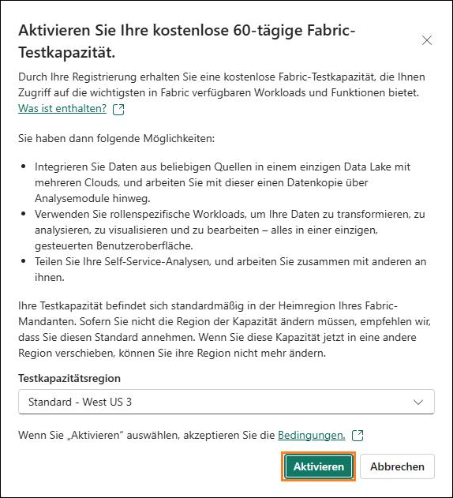
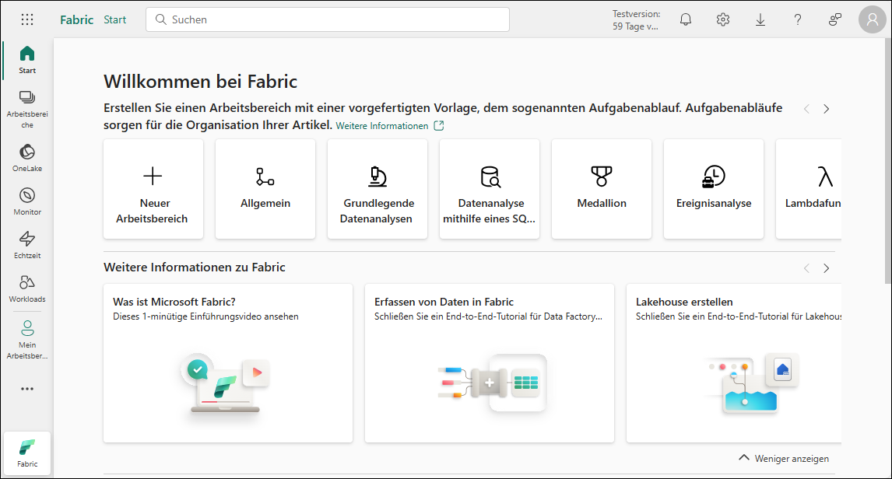
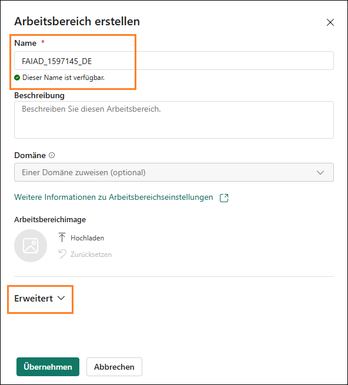

# Microsoft Fabric Fabric Analyst in a Day - Übung 2

 
# Inhalt

- Einführung	
- Fabric-Lizenz	
    - Aufgabe 1: Lizenz für Testversion von Microsoft Fabric aktivieren
- Fabric-Arbeitsbereich	
    - Aufgabe 2: Fabric-Arbeitsbereich erstellen	
    - Aufgabe 3: Lakehouse erstellen
- Übersicht über die Funktionsbereiche in Fabric	
    - Aufgabe 4: Data Factory-Funktionsbereich	
    - Aufgabe 5: Industry Solutions-Funktionsbereich	
    - Aufgabe 6: Real-Time Intelligence-Funktionsbereich	
    - Aufgabe 7: Data Engineering-Funktionsbereich	
    - Aufgabe 8: Data Science-Funktionsbereich	
    - Aufgabe 9: Data Warehouse-Funktionsbereich		
- Referenzen	

# Einführung 

Heute geht es um die verschiedenen Hauptfunktionen von Microsoft Fabric. In diesem Einführungsworkshop werden die verschiedenen Funktionsbereiche und Bestandteile von Fabric vorgestellt. Am Ende des Workshops erfahren Sie zudem, wie Sie Lakehouse, Dataflow Gen2, Data Pipeline, DirectLake und mehr verwenden.

Am Ende dieser Übung haben Sie Folgendes gelernt: 

- Wie Sie einen Fabric-Arbeitsbereich erstellen
- Wie Sie ein Lakehouse erstellen 

# Fabric-Lizenz

## Aufgabe 1: Lizenz für Testversion von Microsoft Fabric aktivieren

1. Öffnen Sie den **Browser**, und rufen Sie https://app.powerbi.com/ 
    auf. Die Anmeldeseite wird angezeigt.

    **Hinweis:** Sie werden möglicherweise direkt angemeldet, wenn Sie die
    Übungsumgebung verwenden.
    
    **Hinweis:** Wenn Sie nicht die Übungsumgebung nutzen und bereits ein
    Power BI-Konto haben, können Sie den Browser im privaten
    Modus/Inkognito-Modus verwenden.

2. Kopieren Sie den **Benutzernamen**, fügen Sie ihn im **E-Mail-Feld** des Dialogfelds ein, und wählen Sie **Absenden** aus.

   - **E-Mail-Adresse/Benutzername:** <inject key="AzureAdUserEmail"></inject> 

      

3. Auf der Registerkarte **Bei Microsoft Azure anmelden** sehen Sie den Anmeldebildschirm, in dem Sie die folgende **E-Mail-Adresse/Benutzernamen** eingeben und dann auf **Weiter**
    klicken.

   - E-Mail-Adresse/Benutzername: <inject key="AzureAdUserEmail"></inject> 

      

5. Geben Sie nun das folgende **Kennwort** ein, und klicken Sie auf **Anmelden**.

   - Kennwort: <inject key="AzureAdUserPassword"></inject>

      

6. Sie werden zur bereits bekannten **Startseite des Power
    BI-Dienstes** geleitet.

7. Es wird angenommen, dass Ihnen der Aufbau des Power BI-Dienstes
    bekannt ist. Bei Fragen wenden Sie sich einfach an den Kursleiter.

   Derzeit sind Sie in **Mein Arbeitsbereich**. Wenn Sie mit
Fabric-Elementen arbeiten möchten, benötigen Sie eine Testlizenz und
einen Arbeitsbereich mit einer zugewiesenen Fabric-Lizenz. Lassen Sie
uns das einrichten.

7. Klicken Sie oben rechts auf dem Bildschirm auf das
    **Benutzersymbol**.

8. Wählen Sie **Kostenlose Testversion** aus.

    

9. Das Dialogfeld „Upgrade auf eine kostenlose Testversion von
    Microsoft Fabric" wird geöffnet. Wählen Sie **Aktivieren** aus.

    

10. Das Dialogfeld „Erfolgreiches Upgrade auf Microsoft Fabric" wird
    geöffnet. Wählen Sie **Fabric Home Page** aus.

     

11. Sie werden zur **Startseite von Microsoft** **Fabric** geleitet.

     

# Fabric-Arbeitsbereich

## Aufgabe 2: Fabric-Arbeitsbereich erstellen

1. Erstellen wir jetzt einen Arbeitsbereich mit einer Fabric-Lizenz.
    Wählen Sie in der Navigationsleiste links die Option
    **Arbeitsbereiche (1)** aus. Ein Dialogfeld wird geöffnet.

2. Klicken Sie auf **+ Neuer Arbeitsbereich (2)** unten im Popup-Menü.

    

3. Rechts im Browser wird das Dialogfeld **Arbeitsbereich erstellen**
    geöffnet.

4. Geben Sie im Feld **Name** den Text **FAIAD_<inject key="Deployment ID" enableCopy="false"/>** ein.

    **Hinweis:** Der Name des Arbeitsbereichs muss eindeutig sein. Achten
    Sie darauf, dass unter dem Feld für den Namen ein grünes Häkchen mit dem
    Text „Dieser Name ist verfügbar" zu sehen ist.

5. Wenn Sie möchten, können Sie eine Beschreibung des Arbeitsbereichs
    eingeben. Dieses Feld ist optional.

6. Erweitern Sie den Abschnitt mit Erweitert.

    

7. Überprüfen Sie unter **Lizenzmodus**, dass die Option
    **Testversion** ausgewählt ist. (Standardmäßig ist dies der Fall.)

8. Erstellen Sie den neuen Arbeitsbereich durch Klicken auf
    **Übernehmen**.

    

Ein neuer Arbeitsbereich wird erstellt, und Sie werden zu diesem
weitergeleitet. Als Nächstes importieren wir Daten aus verschiedenen
Quellen in das Lakehouse, entwickeln damit ein Modell und nutzen die
Daten für Berichte. Erstellen wir zunächst ein Lakehouse.

## Aufgabe 3: Lakehouse erstellen

1. Suchen Sie im neu erstellten Arbeitsbereich
    **FAIAD_<inject key="Deployment ID" enableCopy="false"/>** im linken Navigationsbereich die
    Schaltfläche **+ Neues Element (1)**. Hier können Sie neue Elemente
    in Ihrem Arbeitsbereich erstellen.

2. Geben Sie im Suchfeld **Lakehouse (2)** ein, und wählen Sie in den
    Suchergebnissen die Option **Lakehouse (3)** aus. Auf diese Weise
    können Sie ein neues Lakehouse erstellen, um Ihre Big Data zu
    speichern, abzufragen und zu verwalten.

    

3. Das Dialogfeld „Neues Lakehouse" wird angezeigt. Geben Sie im
    Textfeld für den Namen die Bezeichnung lh_FAIAD ein.

   **Hinweis:** „lh" bezieht sich hier auf Lakehouse. Die Buchstaben „lh"
   werden vorangestellt, damit das Lakehouse leichter erkannt und
   gefunden werden kann.

4. Wählen Sie **Erstellen** aus.

    

    Das Lakehouse wird in kurzer Zeit erstellt, und Sie werden zur
Lakehouse-Oberfläche weitergeleitet. Beachten Sie, dass **links** unter
dem Arbeitsbereich jetzt das Lakehouse-Symbol zu sehen ist. Durch
Klicken auf dieses Symbol können Sie das Lakehouse jederzeit aufrufen.

    Im Lakehouse-Explorer werden **Tabellen** und **Dateien** angezeigt. In
einem Lakehouse können im Abschnitt mit den Dateien auch Dateien von
Azure Data Lake Storage Gen2 stehen, oder mit einem Dataflow können
Daten in Lakehouse-Tabellen geladen werden. Es stehen mehrere
Möglichkeiten zur Auswahl. In den folgenden Übungen werden einige dieser
Möglichkeiten vorgestellt.

    

# Übersicht über die Funktionsbereiche in Fabric

## Aufgabe 4: Data Factory-Funktionsbereich

1. Wählen Sie links das Workloads-Symbol aus. Ein Dialogfeld mit einer Liste der Funktionsbereiche von Fabric wird geöffnet. Die Liste der Funktionsbereiche umfasst Power BI, Data Factory, Industry Solutions, Real-Time Intelligence, Data Engineering, Data Science und Data Warehouse. Sehen wir uns die Funktionsbereiche nun gesondert an.

    

2. Wählen Sie **Data Factory** aus.

    

3. Sie werden zur Data Factory-Startseite weitergeleitet. Im Folgenden finden Sie eine ausführliche Erläuterung der Abschnitte, die Sie Schritt für Schritt für eine effektive Verwendung von Data Factory leitet. Dataflow Gen2 ist die nächste Generation von Dataflow.

    ### Was ist Data Factory?

    Data Factory hilft Ihnen dabei, Daten aus verschiedenen Quellen zu
    verwalten und zu organisieren. Es ermöglicht Ihnen, Daten zu sammeln,
    aufzubereiten und zu transformieren, um sie effektiv einsetzen zu
    können. Egal, ob Sie Anfänger oder Experte sind, Data Factory stellt
    Ihnen Tools zu Verfügung, mit denen Sie die Datentransformation
    einfacher und effizienter gestalten können.

    ### Elementtypen:

    a. **Dataflows:** Dataflows sind wie Rezepte zum Transformieren von
    Daten. Sie bieten über 300 verschiedene Transformationen, die Sie auf
    Ihre Daten anwenden können. Das bedeutet, dass Sie Ihre Daten auf
    vielfältige Weise bereinigen, kombinieren und ändern können, um sie
    ganz an Ihre Anforderungen anzupassen.
    
    b. **Pipelines:** Pipelines sind Workflows, mit denen Sie Ihre
    Datenprozesse automatisieren können. Sie ermöglichen es Ihnen,
    flexible Daten-Workflows zu erstellen, die auf Ihre speziellen
    Anforderungen zugeschnitten werden können. Das erleichtert es, Daten
    strukturiert zu verwalten und zu verarbeiten.
    
    c. **Azure Data Factory (Vorschauversion):** Azure Data Factory ist
    ein cloudbasierter Datenintegrationsdienst, mit dem Sie
    datengesteuerte Workflows zur Orchestrierung und Automatisierung von
    Datenverschiebungen und Datentransformationen erstellen können.
    
    d. **Apache Airflow Job (Vorschauversion):** Apache Airflow ist eine
    Open-Source-Plattform, die für das programmgesteuerte Erstellen,
    Planen und Überwachen von Workflows verwendet wird. In Data Factory
    können Sie damit komplexe Datenworkflows erstellen, planen und
    verwalten.
    
    e. **Projekt kopieren (Vorschauversion):** Mit der Funktion „Projekt
    kopieren" können Sie Daten von einer Quelle in eine andere kopieren.
    Sie bietet eine einfache und effiziente Möglichkeit, Daten zwischen
    verschiedenen Datenspeichern zu verschieben.
    
    f. **Gespiegelte Datenbank (Vorschauversion):** Eine Funktion zum
    Erstellen gespiegelter Versionen von Datenbanken für Sicherungen,
    Tests oder schreibgeschützten Zugriff.

    ### Los geht's:

    Sie können folgende Schritte ausführen, um mit Data Factory loszulegen:

    a. **Data Factory verwenden:** Dieser Abschnitt hilft Ihnen beim
    Einstieg in Data Factory. Er zeigt Ihnen, wie Sie das Tool effektiv
    verwenden können.
    
    b. **Ersten Dataflow erstellen:** Hier erfahren Sie, wie Sie Ihren
    ersten Dataflow erstellen. Dataflows sind unerlässlich, um Ihre Daten
    entsprechend Ihren Anforderungen zu transformieren.
    
    c. **Erste Datenpipeline erstellen:** In diesem Abschnitt erfahren
    Sie, wie Sie Ihre erste Datenpipeline erstellen. Pipelines helfen
    Ihnen dabei, Ihre Datenprozesse effizient zu automatisieren und zu
    verwalten.
    
    d. **Data Factory überwachen:** Die Überwachung ist entscheidend, um
    sicherzustellen, dass Ihre Datenprozesse reibungslos ablaufen. In
    diesem Abschnitt erfahren Sie, wie Sie Ihre Data Factory-Aktivitäten
    überwachen.
    
    e. **Daten mit Dataflows transformieren:** In diesem Abschnitt
    erfahren Sie, wie Sie Dataflows verwenden, um Ihre Daten effektiv zu
    transformieren.
    
    f. **Erste API für GraphQL erstellen:** Wenn Sie APIs mit GraphQL
    verwenden möchten, finden Sie in diesem Abschnitt Informationen zu den
    ersten Schritten.
    
    g. **Erste Benutzerdatenfunktionen erstellen:** In diesem Abschnitt
    erfahren Sie, wie Sie Benutzerdatenfunktionen erstellen, die zum
    Verwalten und Transformieren von Benutzerdaten nützlich sind.

    

4. Klicken Sie in der oberen linken Ecke des Bildschirms auf **Zurück
    zu Workloads**. Auf diese Weise gelangen Sie zur
    Workloads-Hauptseite, auf der Sie andere Tools oder Abschnitte
    erkunden können.

    

## Aufgabe 5: Industry Solutions-Funktionsbereich

1. Klicken Sie auf der Seite **Workloads** auf **Industry Solutions**,
    um fortzufahren.

    

2. Sie werden zur Startseite von **Industry Solutions** weitergeleitet.
    Nachfolgend finden Sie eine detaillierte Übersicht über die
    Abschnitte, die Ihnen helfen sollen, **Industry** **Solutions**
    effektiv und Schritt für Schritt zu nutzen.

    ### Was ist Industry Solutions?

    Industry Solutions sind einsatzbereite Datenlösungen in Microsoft
    Fabric, die Lösungen und Ressourcen für verschiedene Branchen
    bereitstellen. Industry Solutions unterstützt Sie beim Einstieg in
    wichtige Geschäftsszenarien mit branchenbezogenen Datenmodellen,
    Konnektoren, Transformationen, Berichten und anderen Anlagen.

    ### Elementtypen:

    a. **Nachhaltigkeitslösungen:** unterstützen die Erfassung,
    Standardisierung und Analyse von Umwelt-, Sozial- und Governance-Daten
    (ESG).
    
    b. **Lösungen für den Einzelhandel:** helfen bei der Verwaltung
    großer Datenmengen, der Integration von Daten aus verschiedenen
    Quellen und der Bereitstellung von Echtzeitanalysen für eine
    schnelle Entscheidungsfindung. Einzelhändler können diese Lösungen zur
    Bestandsoptimierung, Kundensegmentierung, Umsatzprognose, dynamischen
    Preisgestaltung und Betrugserkennung nutzen.
    
    c. **Lösungen für das Gesundheitswesen:** sind strategisch darauf
    ausgelegt, die Zeit bis zur Wertschöpfung für die Kunden zu verkürzen,
    indem die kritische Notwendigkeit der effizienten Umwandlung von Daten
    aus dem Gesundheitswesen in ein geeignetes Format für die Analyse
    erfüllt wird.

    ### Los geht's:

    Sie können folgende Schritte ausführen, um mit Industry Solutions
    loszulegen:

    a. **Mehr über Datenlösungen für das Gesundheitswesen erfahren:**
    Klicken Sie auf die Schaltfläche „Weitere Informationen", um mehr über
    Datenlösungen für das Gesundheitswesen zu erfahren und zu verstehen,
    wie Sie diese in Ihren Projekten einsetzen können.
    
    b. **Datenlösungen für das Gesundheitswesen bereitstellen:** Klicken
    Sie auf die Schaltfläche „Bereitstellen", um mit dem Bereitstellen von
    Datenlösungen für das Gesundheitswesen zu beginnen und diese in Ihre
    Projekten zu implementieren.
    
    c. **Mehr über Nachhaltigkeitslösungen erfahren:** Klicken Sie auf
    die Schaltfläche „Weitere Informationen", um mehr über
    Nachhaltigkeitslösungen zu erfahren und zu verstehen, wie Sie diese in
    Ihren Projekten einsetzen können.
    
    d. **Nachhaltigkeitslösungen bereitstellen:** Klicken Sie auf die
    Schaltfläche „Bereitstellen", um mit dem Bereitstellen von
    Nachhaltigkeitslösungen zu beginnen und diese in Ihre Projekten zu
    implementieren.
    
    e. **Mehr über Lösungen für den Einzelhandel erfahren:** Klicken Sie
    auf die Schaltfläche „Weitere Informationen", um mehr über Lösungen
    für den Einzelhandel zu erfahren und zu verstehen, wie Sie diese in
    Ihren Projekten einsetzen können.
    
    f. **Lösungen für den Einzelhandel bereitstellen:** Klicken Sie auf
    die Schaltfläche „Bereitstellen", um mit dem Bereitstellen von
    Lösungen für den Einzelhandel zu beginnen und diese in Ihre Projekten
    zu implementieren.

3. Klicken Sie in der oberen linken Ecke des Bildschirms auf **„Zurück zu
Workloads"**. Auf diese Weise gelangen Sie zur Workloads-Hauptseite, auf
der Sie andere Tools oder Abschnitte erkunden können.

   

## Aufgabe 6: Real-Time Intelligence-Funktionsbereich

1. Klicken Sie auf der Seite **Workloads** auf **Real-Time
    Intelligence**, um fortzufahren.

   

2. Sie werden zur Startseite von **Real-Time Intelligence**
    weitergeleitet. Nachfolgend finden Sie eine detaillierte Übersicht
    über die Abschnitte, die Ihnen helfen sollen, **Real-Time
    Intelligence** effektiv und Schritt für Schritt zu nutzen.

    ### Was ist Real-Time Intelligence?

    Mit Real-Time Intelligence können Sie große Mengen an Daten aus
    verschiedenen Quellen mit hoher Granularität verwalten und analysieren.
    Die Funktion ermöglicht es Ihnen, Ihre Daten in Echtzeit aufzunehmen, zu
    analysieren und zu verwenden und so Ihre Geschäftsvorgänge durch
    zeitnahe Entscheidungen und Maßnahmen zu verbessern.

    ### Elementtypen:

    a. **Eventhouse:** Dient dem Erstellen einer Arbeitsbereichs mit
    einer oder mehreren
    KQL-Datenbanken, der projektübergreifend genutzt werden kann.
    
    b. **KQL Queryset:** Wird verwendet, um Abfragen für die Daten
    auszuführen, um freigabefähige Tabellen und Visuals zu erstellen.
    
    c. **Echtzeit-Dashboard:** Wird verwendet, um Echtzeit-Dashboards
    innerhalb von Sekunden nach der Datenerfassung zu visualisieren.
    
    d. **Eventstream:** Hiermit werden Ereignisströme in Echtzeit
    erfasst, umgewandelt und weitergeleitet.
    
    e. **Activator:** Dient zur Überwachung von Datensätzen, Abfragen und
    Ereignisströmen auf Muster.

    ### Los geht's:

    Sie können folgende Schritte ausführen, um mit Real-Time Intelligence
    loszulegen:

    a. **Ein Real-Time Intelligence-Beispiel erkunden:** Sie auf die
    Schaltfläche „Öffnen", um die Datenanalyse in Echtzeit anhand eines
    Beispiels zu erkunden.
    
    b. **Ein Beispiel erkunden:** Klicken Sie auf die Schaltfläche
    „Auswählen", um ein Beispiel zu verwenden und mehr über Real-Time
    Intelligence zu erfahren.
    
    c. **Einführung in Real-Time Intelligence:** Klicken Sie auf die
    Schaltfläche „Öffnen", um einen Überblick über Real-Time Intelligence
    zu erhalten und das Tool effektiv zu nutzen.
    
    d. **KQL mit Beispieldaten lernen:** Klicken Sie auf die Schaltfläche
    „Öffnen", um KQL anhand von Beispieldaten zu lernen.
    
    e. **Echtzeit-Hub kennenlernen:** Klicken Sie auf die Schaltfläche
    „Öffnen", um zu erfahren, was ein Echtzeit-Hub ist und wie er
    verwendet werden kann.
    
    f. **Einen Beispiel-Activator erkunden:** Klicken Sie auf die
    Schaltfläche „Öffnen", um einen Beispiel-Activator zu verwenden und
    die Funktionen und Möglichkeiten von Real-Time Intelligence zu
    verstehen.
    
    g. **Erste Schritte mit Activator:** Klicken Sie auf die Schaltfläche
    „Öffnen", um mit Aktivator-Konzepten zu beginnen und das Tool effektiv
    zu nutzen.

    

3. Klicken Sie in der oberen linken Ecke des Bildschirms auf **„Zurück zu Workloads"**. Auf diese Weise gelangen Sie zur Workloads-Hauptseite, auf der Sie andere Tools oder Abschnitte erkunden können.

    

## Aufgabe 7: Data Engineering-Funktionsbereich

1. Klicken Sie auf der Seite **Workloads** auf **Data Engineering**, um
    fortzufahren.

    

2. Sie werden zur Startseite von **Data Engineering** weitergeleitet.
    Nachfolgend finden Sie eine detaillierte Übersicht über die
    Abschnitte, die Ihnen helfen sollen, **Data** **Engineering**
    effektiv und Schritt für Schritt zu nutzen.

    ### Was ist Data Engineering?

    Data Engineering hilft Ihnen beim Entwerfen, Erstellen und Verwalten von
    Infrastrukturen und Systemen zum Erfassen, Speichern, Verarbeiten und
    Analysieren großer Datenmengen. Es ermöglicht Ihnen, ein Lakehouse zu
    erstellen und Ihren Workflow zu operationalisieren, um Ihren
    Datenbestand zu erstellen, zu transformieren und zu teilen.

    Elementtypen:

    a. **Lakehouse:** Dient zum Speichern großer Datenmengen, die
    bereinigt, abgefragt, in Berichten verwendet und freigegeben werden
    können.
    
    b. **Notebook:** Dient zur Datenerfassung, -aufbereitung, -analyse
    und anderen datenbezogenen Aufgaben mithilfe verschiedener Sprachen
    wie Python, R und Scala.
    
    c. **Umgebung:** Dient dem Einrichten gemeinsam genutzter
    Bibliotheken, Spark-Compute-Einstellungen und Ressourcen für Notebooks
    und Spark-Auftragsdefinitionen.
    
    d. **Spark-Auftragsdefinition:** Dient zum Definieren, Planen und
    Verwalten von Apache-Aufträgen.
    
    e. **Datenpipeline:** Hiermit wird die Datenlösung orchestriert.
    
    f. **API für GraphQL:** Ist eine API zum Abfragen mehrerer
    Datenquellen.
    
    g. **Notebook importieren:** Hiermit werden Notebooks von einem
    lokalen Computer importiert.

    ### Los geht's:

    Sie können folgende Schritte ausführen, um mit Data Engineering
    loszulegen:

    a. **Ein Beispiel erkunden:** Klicken Sie auf die Schaltfläche
    „Auswählen", um ein Beispiel zu verwenden und mehr über Data
    Engineering zu erfahren.
    
    b. **Was ist ein Lakehouse?:** Klicken Sie auf die Schaltfläche
    „Öffnen", um mehr darüber zu erfahren, was ein Lakehouse ist und wie
    Sie es verwenden können.
    
    c. **Daten in Lakehouse nutzen:** Klicken Sie auf die Schaltfläche
    „Öffnen", um Datentechnik mittels Lakehouses zu nutzen.
    
    d. **Erste Schritte mit Spark-Auftragsdefinitionen:** Klicken Sie auf
    die Schaltfläche „Öffnen", um zu erfahren, wie Sie
    Spark-Auftragsdefinitionen für die Datenverarbeitung verwenden können.
    
    e. **Notebooks entwickeln und ausführen:** Klicken Sie auf die
    Schaltfläche „Öffnen", um zu erfahren, wie Sie Notebooks für die
    Datenanalyse entwickeln und ausführen.
    
    f. **NotebookUtils verwenden:** Klicken Sie auf die Schaltfläche
    „Öffnen", um zu erfahren, wie Sie NotebookUtils für die erweiterte
    Datenanalyse verwenden können.
    
    g. **Notebooks für das eigene Lakehouse verwenden:** Klicken Sie auf
    die Schaltfläche „Öffnen", um zu erfahren, wie Sie Notebooks für Ihr
    Lakehouse nutzen können.
    
    h. **Datasets für das eigene Lakehouse verwenden:** Klicken Sie auf
    die Schaltfläche „Öffnen", um zu erfahren, wie Sie Datasets für Ihr
    Lakehouse nutzen können.
    
    i. **Erste Benutzerdatenfunktionen erstellen:** Klicken Sie auf die
    Schaltfläche „Öffnen", um zu erfahren, wie Sie Benutzerdatenfunktionen
    erstellen.
    
    j. **Erste API für GraphQL erstellen:** Klicken Sie auf die
    Schaltfläche „Öffnen", um zu erfahren, wie Sie eine API für GraphQL
    erstellen.

    

3. Klicken Sie in der oberen linken Ecke des Bildschirms auf **Zurück
    zu Workloads**. Auf diese Weise gelangen Sie zur
    Workloads-Hauptseite, auf der Sie andere Tools oder Abschnitte
    erkunden können.

    

## Aufgabe 8: Data Science-Funktionsbereich

1. Klicken Sie auf der Seite **Workloads** auf **Data** **Science**, um
    fortzufahren.

    

2. Sie werden zur Startseite von **Data Science** weitergeleitet.
    Nachfolgend finden Sie eine detaillierte Übersicht über die
    Abschnitte, die Ihnen helfen sollen, **Data Science** effektiv und
    Schritt für Schritt zu nutzen.

    ### Was ist Data Science?

    Data Science ist ein Tool, über das Sie mithilfe von KI und maschinellem
    Lernen aussagekräftige Erkenntnisse gewinnen können. Es bietet KI-Tools,
    mit denen Sie umfassende Data Science-Workflows durchführen und KI für
    die Datenanreicherung und Geschäftseinblicke nutzen können.

    ### Elementtypen:

    a. **ML-Modell:** Hiermit werden Machine-Learning-Modelle erstellt.
    
    b. **Experiment:** Dies dient zum Entwickeln und Ausführen von
    Modellen und zur Nachverfolgung der Modellentwicklung.
    
    c. **Notebook:** Hiermit werden Daten ausgewertet und
    Machine-Learning-Lösungen entwickelt.
    
    d. **Umgebung:** Dient dem Einrichten gemeinsam genutzter
    Bibliotheken, Spark-Compute-Einstellungen und Ressourcen für Notebooks
    und Spark-Auftragsdefinitionen.
    
    e. **KI Fertigkeit:** Wird verwendet, um Ihre eigene generative
    KI-Erfahrung zu erstellen.
    
    f. **Python Notebook:** Hiermit werden Python-Notebooks von einem
    lokalen Computer importiert.

    ### Los geht's:

    Sie können folgende Schritte ausführen, um mit Data Science loszulegen:

    a. **Ein Beispiel erkunden:** Klicken Sie auf die Schaltfläche
    „Auswählen",
    um ein Beispiel zu verwenden und mehr über Data Science zu erfahren.
    
    b. **Erste Schritte mit ML-Modellen:** Klicken Sie auf die
    Schaltfläche „Öffnen",
    um zu erfahren, wie Sie mit Machine-Learning-Modelle beginnen können.
    
    c. **Erste Schritte mit ML-Experimenten:** Klicken Sie auf die
    Schaltfläche „Öffnen",
    um zu erfahren, wie Sie Machine-Learning-Experimente durchführen
    können.
    
    d. **Notebooks entwickeln und ausführen:** Klicken Sie auf die
    Schaltfläche „Öffnen",
    um zu erfahren, wie Sie Notebooks für die Datenanalyse entwickeln und
    ausführen.
    
    e. **Erste Schritte mit Notebooks:** Klicken Sie auf die Schaltfläche
    „Öffnen",
    um zu erfahren, wie Sie mit Notebooks beginnen können.

    

3. Klicken Sie in der oberen linken Ecke des Bildschirms auf **Zurück
    zu Workloads**. Auf diese Weise gelangen Sie zur
    Workloads-Hauptseite, auf der Sie andere Tools oder Abschnitte
    erkunden können.

    

## Aufgabe 9: Data Warehouse-Funktionsbereich

1. Klicken Sie auf der Seite **Workloads** auf **Data Warehouse**, um
    fortzufahren.

    

2. Sie werden zur Startseite von **Data Warehouse** weitergeleitet.
    Nachfolgend finden Sie eine detaillierte Übersicht über die
    Abschnitte, die Ihnen helfen sollen, **Data Warehouse** effektiv und
    Schritt für Schritt zu nutzen.

    ### Was ist Data Warehouse?

    Data Warehouse ist ein Tool, mit dem Sie Daten in einem sicheren
    SQL-Warehouse speichern und analysieren können. Damit können Sie Ihre
    Erkenntnisse erweitern, indem Sie von erstklassiger Leistung im
    Petabytebereich in einem offenen Datenformat profitieren.

    ### Elementtypen:

    a. **Warehouse:** Dient dem Erstellen eines Data Warehouse.
    
    b. **Beispiel-Warehouse:** Wird verwendet, um Data
    Warehousing-Funktionen mit vorkonfigurierten Datensätzen und Modellen
    zu erkunden und zu testen.
    
    c. **Datenpipeline:** Hiermit werden Datenlösungen orchestriert.
    
    d. **Notebook:** Wird für das Erstellen und Teilen interaktiver
    Datenanalyse‑ und Visualisierungsaufgaben verwendet.
    
    e. **Gespiegelte Azure SQL-Datenbank:** Wird verwendet, um die Azure
    SQL-Datenbank zu spiegeln.
    
    f. **Gespiegelter Azure Databricks-Katalog:** Wird zum Spiegeln von
    Daten von Azure Databricks für verbesserte Integration und Analyse
    verwendet.
    
    g. **Gespiegeltes Snowflake:** Wird verwendet, um die
    Snowflake-Datenbank zu spiegeln.
    
    h. **Gespiegelte Azure Cosmos DB:** Wird verwendet, um Azure Cosmos
    DB zu spiegeln.
    
    i. **Gespiegelte verwalte Azure SQL-Datenbank:** Wird zum Spiegeln
    verwalteter Azure SQL-Datenbanken für hohe Verfügbarkeit und
    Notfallwiederherstellung verwendet.
    
    j. **Gespiegelte Datenbank:** Wird für das Replizieren von
    Datenbanken für hohe Verfügbarkeit und Notfallwiederherstellung
    verwendet.

    ### Los geht's:

    Sie können folgende Schritte ausführen, um mit Data Warehouse
    loszulegen:

    a. **Erste Schritte mit Warehouse:** Klicken Sie auf die Schaltfläche
    „Öffnen", um zu erfahren, wie Sie ein Warehouse zum Analysieren von
    Daten verwenden können.

    

1. Klicken Sie in der oberen linken Ecke des Bildschirms auf **Zurück zu Workloads**. Auf diese Weise gelangen Sie zur Workloads-Hauptseite, auf der Sie andere Tools oder Abschnitte erkunden können.

   

In diesem Labor haben wir die Fabric-Schnittstelle erkundet und einen Fabric-Arbeitsbereich und ein Lakehouse erstellt. Im nächsten Labor lernen wir, wie Sie mithilfe von Verknüpfungen in Lakehouse eine Verbindung zu ADLS Gen2-Daten herstellen und wie Sie diese Daten mithilfe von Ansichten transformieren.

# Referenzen

Bei Fabric Analyst in a Day (FAIAD) lernen Sie einige der wichtigsten
Funktionen von Microsoft Fabric kennen. Im Menü des Dienstes finden Sie
in der Hilfe (?) Links zu praktischen
Informationen.

Nachfolgend finden Sie weitere Angebote zur weiteren Arbeit mit
Microsoft Fabric.

   - Die vollständige [Ankündigung der allgemeinen Verfügbarkeit von
    Microsoft Fabric](https://aka.ms/Fabric-Hero-Blog-Ignite23) finden
    Sie im Blogbeitrag.

   - Fabric bei einer [interaktiven
    Vorstellung](https://aka.ms/Fabric-GuidedTour) kennenlernen

   - Zur [kostenlosen Testversion von Microsoft
    Fabric](https://aka.ms/try-fabric) anmelden

   - [Website von Microsoft Fabric](https://aka.ms/microsoft-fabric)
    besuchen

   - Mit Modulen von [Fabric Learning](https://aka.ms/learn-fabric) neue
    Qualifikationen erwerben

   - [Technische Dokumentation zu Fabric](https://aka.ms/fabric-docs)
    lesen

   - [Kostenloses E-Book zum Einstieg in
    Fabric](https://aka.ms/fabric-get-started-ebook) lesen

   - Mitglied der [Fabric-Community](https://aka.ms/fabric-community)
    werden, um Fragen zu stellen, Feedback zu geben und sich mit anderen
    auszutauschen

Lesen Sie die detaillierteren Blogs zur Ankündigung der Fabric-Umgebung:

   - [Blog zum Data Factory-Funktionsbereich in
    Fabric](https://aka.ms/Fabric-Data-Factory-Blog) 

   - [Blog zum Data Engineering-Funktionsbereich von Synapse in
    Fabric](https://aka.ms/Fabric-DE-Blog) 

   - [Blog zum Data Science-Funktionsbereich von Synapse in
    Fabric](https://aka.ms/Fabric-DS-Blog) 

   - [Blog zum Data Warehousing-Funktionsbereich von Synapse in
    Fabric](https://aka.ms/Fabric-DW-Blog) 

   - [Blog zum Real-Time Analytics-Funktionsbereich von Synapse in
    Fabric](https://aka.ms/Fabric-RTA-Blog)

   - [Blog mit Ankündigungen zu Power BI](https://aka.ms/Fabric-PBI-Blog)

   - [Blog zum Data Activator-Funktionsbereich in
    Fabric](https://aka.ms/Fabric-DA-Blog) 

   - [Blog zu Verwaltung und Governance in
    Fabric](https://aka.ms/Fabric-Admin-Gov-Blog)

   - [Blog zu OneLake in Fabric](https://aka.ms/Fabric-OneLake-Blog)

   - [Blog zur Dataverse- und Microsoft
    Fabric-Integration](https://aka.ms/Dataverse-Fabric-Blog)

   © 2025 Microsoft Corporation. Alle Rechte vorbehalten.
 
   Durch die Verwendung der vorliegenden Demo/Übung stimmen Sie den
   folgenden Bedingungen zu:
 
   Die in dieser Demo/Übung beschriebene Technologie/Funktionalität wird
   von der Microsoft Corporation bereitgestellt, um Feedback von Ihnen zu
   erhalten und Ihnen Wissen zu vermitteln. Sie dürfen die Demo/Übung nur
   verwenden, um derartige Technologiefeatures und Funktionen zu bewerten
   und Microsoft Feedback zu geben. Es ist Ihnen nicht erlaubt, sie für
   andere Zwecke zu verwenden. Es ist Ihnen nicht gestattet, diese
   Demo/Übung oder einen Teil derselben zu ändern, zu kopieren, zu
   verbreiten, zu übertragen, anzuzeigen, auszuführen, zu
   vervielfältigen, zu veröffentlichen, zu lizenzieren, zu transferieren
   oder zu verkaufen oder aus ihr abgeleitete Werke zu erstellen.
 
   DAS KOPIEREN ODER VERVIELFÄLTIGEN DER DEMO/ÜBUNG (ODER EINES TEILS
   DERSELBEN) AUF EINEN/EINEM ANDEREN SERVER ODER SPEICHERORT FÜR DIE
   WEITERE VERVIELFÄLTIGUNG ODER VERBREITUNG IST AUSDRÜCKLICH UNTERSAGT.
 
   DIESE DEMO/ÜBUNG STELLT BESTIMMTE
   SOFTWARE-TECHNOLOGIE-/PRODUKTFEATURES UND FUNKTIONEN, EINSCHLIESSLICH
   POTENZIELLER NEUER FEATURES UND KONZEPTE, IN EINER SIMULIERTEN
   UMGEBUNG OHNE KOMPLEXE EINRICHTUNG ODER INSTALLATION FÜR DEN OBEN
   BESCHRIEBENEN ZWECK BEREIT. DIE TECHNOLOGIE/KONZEPTE IN DIESER
   DEMO/ÜBUNG ZEIGEN MÖGLICHERWEISE NICHT DAS VOLLSTÄNDIGE
   FUNKTIONSSPEKTRUM UND FUNKTIONIEREN MÖGLICHERWEISE NICHT WIE DIE
   ENDGÜLTIGE VERSION. UNTER UMSTÄNDEN VERÖFFENTLICHEN WIR AUCH KEINE
   ENDGÜLTIGE VERSION DERARTIGER FEATURES ODER KONZEPTE. IHRE ERFAHRUNG
   BEI DER VERWENDUNG DERARTIGER FEATURES UND FUNKTIONEN IN EINER
   PHYSISCHEN UMGEBUNG KANN FERNER ABWEICHEND SEIN.
 
   **FEEDBACK**. Wenn Sie Feedback zu den Technologiefeatures, Funktionen
   und/oder Konzepten geben, die in dieser Demo/Übung beschrieben werden,
   gewähren Sie Microsoft das Recht, Ihr Feedback in jeglicher Weise und
   für jeglichen Zweck kostenlos zu verwenden, zu veröffentlichen und
   gewerblich zu nutzen. Außerdem treten Sie Dritten kostenlos sämtliche
   Patentrechte ab, die erforderlich sind, damit deren Produkte,
   Technologien und Dienste bestimmte Teile einer Software oder eines
   Dienstes von Microsoft, welche/welcher das Feedback enthält, verwenden
   oder eine Verbindung zu dieser/diesem herstellen können. Sie geben
   kein Feedback, das einem Lizenzvertrag unterliegt, aufgrund dessen
   Microsoft Drittparteien eine Lizenz für seine Software oder
   Dokumentation gewähren muss, weil wir Ihr Feedback in diese aufnehmen.
   Diese Rechte bestehen nach Ablauf dieser Vereinbarung fort.
 
   DIE MICROSOFT CORPORATION LEHNT HIERMIT JEGLICHE GEWÄHRLEISTUNGEN UND
   GARANTIEN IN BEZUG AUF DIE DEMO/ÜBUNG AB, EINSCHLIESSLICH ALLER
   AUSDRÜCKLICHEN, KONKLUDENTEN ODER GESETZLICHEN GEWÄHRLEISTUNGEN UND
   GARANTIEN DER HANDELSÜBLICHKEIT, DER EIGNUNG FÜR EINEN BESTIMMTEN
   ZWECK, DES RECHTSANSPRUCHS UND DER NICHTVERLETZUNG VON RECHTEN
   DRITTER. MICROSOFT MACHT KEINERLEI ZUSICHERUNGEN BZW. ERHEBT
   KEINERLEI ANSPRÜCHE IM HINBLICK AUF DIE RICHTIGKEIT DER ERGEBNISSE UND
   DES AUS DER VERWENDUNG DER DEMO/ÜBUNG RESULTIERENDEN
   ARBEITSERGEBNISSES BZW. BEZÜGLICH DER EIGNUNG DER IN DER DEMO/ÜBUNG
   ENTHALTENEN INFORMATIONEN FÜR EINEN BESTIMMTEN ZWECK.
 
   **HAFTUNGSAUSSCHLUSS**
 
   Diese Demo/Übung enthält nur einen Teil der neuen Features und
   Verbesserungen in Microsoft Power BI. Einige Features können sich
   unter Umständen in zukünftigen Versionen des Produkts ändern. In
   dieser Demo/Übung erhalten Sie Informationen über einige, aber nicht
   über alle neuen Features.
