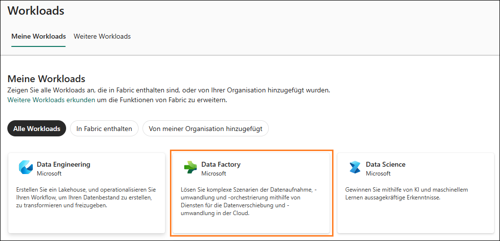

# Microsoft Fabric Fabric Analyst in a Day - Übung 2

# Inhalt

- Einführung	
- Fabric-Lizenz
    - Aufgabe 1: Lizenz für Testversion von Microsoft Fabric aktivieren	
- Übersicht über die Funktionsbereiche in Fabric	
    - Aufgabe 2: Data Factory-Funktionsbereich	
    - Aufgabe 3: Industry Solutions-Funktionsbereich	
    - Aufgabe 4: Real-Time Intelligence-Funktionsbereich	
    - Aufgabe 5: Data Engineering-Funktionsbereich	
    - Aufgabe 6: Data Science-Funktionsbereich	
    - Aufgabe 7: Data Warehouse-Funktionsbereich	
- Fabric-Arbeitsbereich
    - Aufgabe 8: Fabric-Arbeitsbereich erstellen	
    - Aufgabe 9: Lakehouse erstellen	
- Referenzen	

# Einführung 

Heute geht es um die verschiedenen Hauptfunktionen von Microsoft Fabric. In diesem Einführungsworkshop werden die verschiedenen Funktionsbereiche und Bestandteile von Fabric vorgestellt. Am Ende des Workshops erfahren Sie zudem, wie Sie Lakehouse, Dataflow Gen2, Data Pipeline, DirectLake und mehr verwenden.

Am Ende dieser Übung haben Sie Folgendes gelernt: 

-	Wie Sie einen Fabric-Arbeitsbereich erstellen
-	Wie Sie ein Lakehouse erstellen 

### Aufgabe 1: Power BI Desktop in einer Übungsumgebung einrichten

1. Öffnen Sie in der Übungsumgebung auf dem **Desktop** im Ordner **Reports** die Datei **FAIAD.pbix**. Die Datei wird in Power BI
Desktop geöffnet.

   

2. Sobald das Dialogfeld „Geben Sie Ihre E-Mail-Adresse ein" angezeigt wird, kopieren Sie den **Benutzernamen**, fügen Sie ihn in das Feld **E-Mail-Adresse** des Dialogfelds ein, und wählen Sie **Weiter** aus.

   - E-Mail-Adresse/Benutzername:  <inject key="AzureAdUserEmail"></inject>

     

3. Auf der Registerkarte „Bei Microsoft Azure anmelden" sehen Sie den
    Anmeldebildschirm, in dem Sie die folgende
    E-Mail-Adresse/Benutzernamen eingeben und dann auf „Weiter" klicken.

    - E-Mail-Adresse/Benutzername: <inject key="AzureAdUserEmail"></inject>

4. Geben Sie nun das folgende **Kennwort** ein, und klicken Sie auf **Anmelden.**

    •	Kennwort: <inject key="AzureAdUserPassword"></inject>

   

5. Das Dialogfeld **Bei all Ihren Apps angemeldet bleiben** wird
    geöffnet. Klicken Sie auf **OK**.

   

6. Das Dialogfeld **Die Einrichtung ist abgeschlossen!** wird geöffnet.
    Klicken Sie auf **Fertig**.

### Aufgabe 2: Power BI Desktop-Bericht analysieren

Im nachstehenden Bericht werden die Verkäufe von Fabrikam analysiert.
Die KPIs stehen oben links auf der Seite. Die restlichen Visuals zeigen
die Verkaufszahlen im Laufe der Zeit, nach Gebiet, Produktgruppe und
Wiederverkäuferfirma.

   

**Hinweis:** Bei diesem Training geht es um die Erfassung,
Transformation und Modellierung von Daten mithilfe der in Fabric
verfügbaren Tools. Es geht weder um die Anfertigung von Berichten noch
die Navigation. Sehen wir uns den Bericht kurz an und fahren dann fort.

1. Analysieren wir die Daten nach dem Vertriebsgebiet. Wählen Sie im
    Streudiagramm **Sales Territory** die Region **„New England"** aus.
    Unter „Sales over time" sehen Sie, dass der Handelspartner Tailspin
    Toys im Vergleich zu Wingtip Toys in Neuengland mehr Verkäufe
    erzielt. Wenn Sie sich das Säulendiagramm „Sales YoY%" ansehen,
    werden Sie feststellen, dass das Umsatzwachstum von Wingtip Toys im
    vergangenen Jahr gering war und von Quartal zu Quartal weniger
    wurde. Nach einer kleinen Erholung im dritten Quartal ging es im
    vierten Quartal wieder bergab.

   

2. Vergleichen wir dies mit dem Vertriebsgebiet „Rocky Mountain".
    Wählen Sie im Streudiagrammvisual **Sales Territory** die Region
    **„Rocky Mountain"** aus. Beachten Sie im Säulendiagramm „Sales
    YoY%", dass die Umsätze von Wingtip Toys im vierten Quartal 2023
    enorm zugelegt haben, nachdem sie in den beiden vorangegangenen
    Quartalen niedrig waren.

   

3. Wählen Sie im Streudiagramm **Sales Territory** die Region **„Rocky
    Mountain"** aus, um den Filter zu entfernen.

4. Wählen Sie im Streudiagrammvisual unten in der Mitte des Bildschirms
    (Sales Orders) den Ausreißer oben rechts aus (4. Quadrant). Beachten
    Sie, dass die Marge % 52 % beträgt, was über dem Durchschnitt von
    50 % liegt. Außerdem ist der Umsatz im Jahresvergleich in % in den
    letzten beiden Quartalen des Jahres 2023 gestiegen.

   

5. Wählen Sie im Streudiagrammvisual den Reseller mit dem Ausreißer
    aus, um den **Filter zu entfernen**.

6. Sehen wir nun die Produktinformationen nach Produktgruppe und
    Wiederverkäufer an. Klicken Sie im Balkendiagrammvisual „Sales by
    Product Group and Reseller Company" mit der rechten Maustaste auf
    den Balken **Packaging Materials** **von Tailspin Toys**, und wählen
    Sie im Dialogfeld die Option **Drillthrough ausführen -\> Product
    Detail** aus.

   

7. Sie gelangen zu der Seite mit den Produktinformationen. Dort sind
    auch einige zukünftige Bestellungen aufgeführt.

8. Sobald Sie die Informationen gelesen haben, wählen Sie oben auf der
    Seite den **STRG+Zurückpfeil** aus, um zum Umsatzbericht
    zurückzukehren.

   

9. Sehen Sie sich den Bericht gerne noch genauer an. Anschließend
    betrachten wir die Modellansicht. Wählen Sie links das Symbol für
    die Modellansicht aus.

    

10. Beachten Sie, dass es zwei Faktentabellen gibt: **Sales** und
    **PO**.

    a\. Die Genauigkeit der Sales-Daten richtet sich nach Date, Reseller,Product und People. Date, Reseller, Product und People sind mit Sales in
Zusammenhang gesetzt.

    b\. Die Genauigkeit von PO-Daten richtet sich nach Date, Product und
People. Date, Product und People sind mit PO in Zusammenhang gesetzt.

    c\. Wir haben Supplier-Daten nach Product. Supplier steht mit Product in
Zusammenhang.

    d\. Wir haben Reseller-Standortdaten nach Geo. Geo steht in Zusammenhang
mit Reseller.

    e\. Wir haben Customer-Informationen nach Reseller. Customer steht in
Zusammenhang mit Reseller.

### Aufgabe 3: Power Query-Abfragen überprüfen

1. Beschäftigen wir uns in Power Query mit den Datenquellen. Wählen Sie
    im Menüband **Start \> Daten transformieren** aus.

   

2. Das Power Query-Fenster wird geöffnet. Wählen Sie im Menüband die
    Option **Start -\> Datenquelleneinstellungen** aus. Das Dialogfeld
    mit den Datenquelleneinstellungen wird geöffnet. Wenn Sie durch die
    Liste blättern, werden Sie sehen, dass es vier Datenquellen gibt,
    die in der Problemstellung genannt sind:

    a\. Snowflake

    b\. SharePoint

    c\. ADLS Gen2

    d\. Dataverse

3. Schließen Sie das Dialogfeld mit den Einstellungen für die
    Datenquellen mit **Schließen**.

   

4. Beachten Sie, dass die Abfragen auf der linken Seite nach
    Datenquelle angeordnet sind.

5. Hinweis: Der Ordner **DataverseData** enthält Customer-Daten zu vier
    verschiedenen Abfragen: BabyBoomer, GenX, GenY und GenZ. Diese vier
    Abfragen werden angefügt, um eine Customer-Abfrage zu erstellen.

6. Klicken Sie im Fenster „Abfragen" auf die Abfrage **Customer**. Sie
    müssen Ihre Dataverse-Anmeldeinformationen erneut eingeben, wenn Sie
    diese Abfrage auswählen. Klicken Sie auf **Anmeldeinformationen
    bearbeiten**.

   

   

7. Klicken Sie auf **Anmelden**, um sich an Ihrem Konto anzumelden.

8. Sie können die Anmeldeinformationen für die Dataverse-Datenquelle
    eingeben, indem Sie den **Benutzernamen** und das **Kennwort**
    eingeben. Die Anmeldeinformationen werden unten angegeben. Wählen
    Sie **Verbinden** aus.

    - E-Mail-Adresse/Benutzername:

    - Kennwort:

9. Klicken Sie im Fenster „Abfragen" auf die Abfrage **ADLS Base
    Folder**. Sie müssen die Anmeldeinformationen erneut eingeben, wenn
    Sie diese Abfrage auswählen. Klicken Sie auf **Anmeldeinformationen
    bearbeiten**.

   

10. Wählen Sie für die **ADLS**-Datenquelle die Option **Shared Access
    Signature (SAS)** aus, und geben Sie das unten angegebene
    **SAS-Token** ein. Wählen Sie dann **Verbinden** aus.

    - **SAS-Token:**

      

11. Beachten Sie, dass der Ordner **ADLSData** mehrere Dimensionen
    beinhaltet: Geo, Product, Reseller und Date. Zudem sind
    Sales-Element enthalten.

    a\. **Die Geo-Dimension** ergibt sich durch die Zusammenführung von
    Daten aus den Abfragen „Cities", „Countries" und „States".

    b\. **Die Product-Dimension** ergibt sich durch die Zusammenführung von
    Daten aus den Abfragen „Product Groups" und „Product Item Group".

    c\. **Die Reseller-Dimension** wird mithilfe der Abfrage „BuyingGroup"
    gefiltert.

    d\. **Das Sales-Element** ergibt sich durch die Zusammenführung der
    Abfragen „InvoiceLineItems" und „Invoice".

12. Für die Datenquelle „Snowflake" wählen Sie im Fenster „Abfragen" die
    Abfrage **SupplierCategories** aus. Wenn Sie diese Abfrage
    auswählen, werden Sie aufgefordert, Ihre Anmeldeinformationen erneut
    einzugeben. Klicken Sie auf **Anmeldeinformationen bearbeiten**.

    

13. Geben Sie den **Benutzernamen für Snowflake** und das **Kennwort für
    Snowflake** ein, die unten angegeben sind. Verwenden Sie diese
    Anmeldeinformationen, um alle Tabellen unter Snowflake mit Snowflake
    zu verbinden, und wählen Sie dann „Verbinden".

    - Snowflake-Benutzername:

    - Snowflake-Kennwort:

Hinweis: Wenn Sie Probleme beim Herstellen einer Verbindung zu Snowflake
mit den Anmeldeinformationen aus den Umgebungsdetails haben, verwenden
Sie bitte die die nachfolgenden Anmeldeinformationen.

    - Snowflake-Benutzername: SNOWFLAKE_BACKUP

    - Snowflake-Kennwort: 8UpfRpExVDXv2AC1

14. Beachten Sie, dass der Ordner **SnowflakeData** die Dimension
    „Supplier" und das Element „PO" (Bestellung/Ausgabe) enthält.

    a\. Die **Supplier-Dimension** ergibt sich durch die Zusammenführung der
    Abfragen „Suppliers" und „SupplierCategories".

    b\. **Das Element „PO"** ergibt sich durch die Zusammenführung der
    Abfragen „PO" und „PO Line Items".

15. Für die Datenquelle „SharePoint" wählen Sie im Fenster „Abfragen"
    die Abfrage **People** aus. Wenn Sie diese Abfrage auswählen, werden
    Sie aufgefordert, Ihre Anmeldeinformationen erneut einzugeben.
    Klicken Sie auf **Anmeldeinformationen bearbeiten**.

    

16. Wählen Sie die Option **Microsoft-Konto** aus, und klicken Sie dann
    auf **Anmelden**. Geben Sie den unten angegebenen Benutzernamen und
    das Kennwort ein, und wählen Sie dann „Verbinden" aus.

    - E-Mail-Adresse/Benutzername:

    - Kennwort:

      

17. Beachten Sie, dass der Ordner **SharepointData** die Dimension
    „People" enthält.

    

Nun wissen wir, worum es geht. In den folgenden Übungen erstellen wir
eine ähnliche Power Query unter Nutzung der Dataflow Gen2-Datenbank und
eines Modells mit Lakehouse.

Referenzen
Bei Fabric Analyst in a Day (FAIAD) lernen Sie einige der wichtigsten Funktionen von Microsoft Fabric kennen. Im Menü des Dienstes finden Sie in der Hilfe (?) Links zu praktischen Informationen. 

Nachfolgend finden Sie weitere Angebote zur weiteren Arbeit mit Microsoft Fabric.
 - Die vollständige Ankündigung der allgemeinen Verfügbarkeit von Microsoft Fabric finden Sie im Blogbeitrag.
 - Fabric bei einer interaktiven Vorstellung kennenlernen
 - Zur kostenlosen Testversion von Microsoft Fabric anmelden
 - Website von Microsoft Fabric besuchen
 - Mit Modulen von Fabric Learning neue Qualifikationen erwerben
 - Technische Dokumentation zu Fabric lesen
 - Kostenloses E-Book zum Einstieg in Fabric lesen
 - Mitglied der Fabric-Community werden, um Fragen zu stellen, Feedback zu geben und sich mit anderen auszutauschen
Lesen Sie die detaillierteren Blogs zur Ankündigung der Fabric-Umgebung:
 - Blog zum Data Factory-Funktionsbereich in Fabric 
 - Blog zum Data Engineering-Funktionsbereich von Synapse in Fabric 
 - Blog zum Data Science-Funktionsbereich von Synapse in Fabric 
 - Blog zum Data Warehousing-Funktionsbereich von Synapse in Fabric 
 - Blog zum Real-Time Analytics-Funktionsbereich von Synapse in Fabric
 - Blog mit Ankündigungen zu Power BI
 - Blog zum Data Activator-Funktionsbereich in Fabric 
 - Blog zu Verwaltung und Governance in Fabric
 - Blog zu OneLake in Fabric
 - Blog zur Dataverse- und Microsoft Fabric-Integration

© 2023 Microsoft Corporation. Alle Rechte vorbehalten.
Durch die Verwendung der vorliegenden Demo/Übung stimmen Sie den folgenden Bedingungen zu:
Die in dieser Demo/Übung beschriebene Technologie/Funktionalität wird von der Microsoft Corporation bereitgestellt, um Feedback von Ihnen zu erhalten und Ihnen Wissen zu vermitteln. Sie dürfen die Demo/Übung nur verwenden, um derartige Technologiefeatures und Funktionen zu bewerten und Microsoft Feedback zu geben. Es ist Ihnen nicht erlaubt, sie für andere Zwecke zu verwenden. Es ist Ihnen nicht gestattet, diese Demo/Übung oder einen Teil derselben zu ändern, zu kopieren, zu verbreiten, zu übertragen, anzuzeigen, auszuführen, zu vervielfältigen, zu veröffentlichen, zu lizenzieren, zu transferieren oder zu verkaufen oder aus ihr abgeleitete Werke zu erstellen.
DAS KOPIEREN ODER VERVIELFÄLTIGEN DER DEMO/ÜBUNG (ODER EINES TEILS DERSELBEN) AUF EINEN/EINEM ANDEREN SERVER ODER SPEICHERORT FÜR DIE WEITERE VERVIELFÄLTIGUNG ODER VERBREITUNG IST AUSDRÜCKLICH UNTERSAGT.
DIESE DEMO/ÜBUNG STELLT BESTIMMTE SOFTWARE-TECHNOLOGIE-/PRODUKTFEATURES UND FUNKTIONEN, EINSCHLIESSLICH POTENZIELLER NEUER FEATURES UND KONZEPTE, IN EINER SIMULIERTEN UMGEBUNG OHNE KOMPLEXE EINRICHTUNG ODER INSTALLATION FÜR DEN OBEN BESCHRIEBENEN ZWECK BEREIT. DIE TECHNOLOGIE/KONZEPTE IN DIESER DEMO/ÜBUNG ZEIGEN MÖGLICHERWEISE NICHT DAS VOLLSTÄNDIGE FUNKTIONSSPEKTRUM UND FUNKTIONIEREN MÖGLICHERWEISE NICHT WIE DIE ENDGÜLTIGE VERSION. UNTER UMSTÄNDEN VERÖFFENTLICHEN WIR AUCH KEINE ENDGÜLTIGE VERSION DERARTIGER FEATURES ODER KONZEPTE. IHRE ERFAHRUNG BEI DER VERWENDUNG DERARTIGER FEATURES UND FUNKTIONEN IN EINER PHYSISCHEN UMGEBUNG KANN FERNER ABWEICHEND SEIN.
FEEDBACK. Wenn Sie Feedback zu den Technologiefeatures, Funktionen und/oder Konzepten geben, die in dieser Demo/Übung beschrieben werden, gewähren Sie Microsoft das Recht, Ihr Feedback in jeglicher Weise und für jeglichen Zweck kostenlos zu verwenden, zu veröffentlichen und gewerblich zu nutzen. Außerdem treten Sie Dritten kostenlos sämtliche Patentrechte ab, die erforderlich sind, damit deren Produkte, Technologien und Dienste bestimmte Teile einer Software oder eines Dienstes von Microsoft, welche/welcher das Feedback enthält, verwenden oder eine Verbindung zu dieser/diesem herstellen können. Sie geben kein Feedback, das einem Lizenzvertrag unterliegt, aufgrund dessen Microsoft Drittparteien eine Lizenz für seine Software oder Dokumentation gewähren muss, weil wir Ihr Feedback in diese aufnehmen. Diese Rechte bestehen nach Ablauf dieser Vereinbarung fort.
DIE MICROSOFT CORPORATION LEHNT HIERMIT JEGLICHE GEWÄHRLEISTUNGEN UND GARANTIEN IN BEZUG AUF DIE DEMO/ÜBUNG AB, EINSCHLIESSLICH ALLER AUSDRÜCKLICHEN, KONKLUDENTEN ODER GESETZLICHEN GEWÄHRLEISTUNGEN UND GARANTIEN DER HANDELSÜBLICHKEIT, DER EIGNUNG FÜR EINEN BESTIMMTEN ZWECK, DES RECHTSANSPRUCHS UND DER NICHTVERLETZUNG VON RECHTEN DRITTER. MICROSOFT MACHT KEINERLEI ZUSICHERUNGEN BZW. ERHEBT KEINERLEI ANSPRÜCHE IM HINBLICK AUF DIE RICHTIGKEIT DER ERGEBNISSE UND DES AUS DER VERWENDUNG DER DEMO/ÜBUNG RESULTIERENDEN ARBEITSERGEBNISSES BZW. BEZÜGLICH DER EIGNUNG DER IN DER DEMO/ÜBUNG ENTHALTENEN INFORMATIONEN FÜR EINEN BESTIMMTEN ZWECK.
HAFTUNGSAUSSCHLUSS
Diese Demo/Übung enthält nur einen Teil der neuen Features und Verbesserungen in Microsoft Power BI. Einige Features können sich unter Umständen in zukünftigen Versionen des Produkts ändern. In dieser Demo/Übung erhalten Sie Informationen über einige, aber nicht über alle neuen Features.

