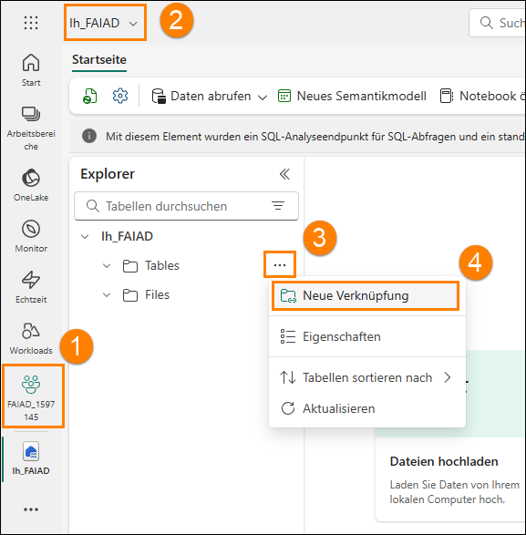
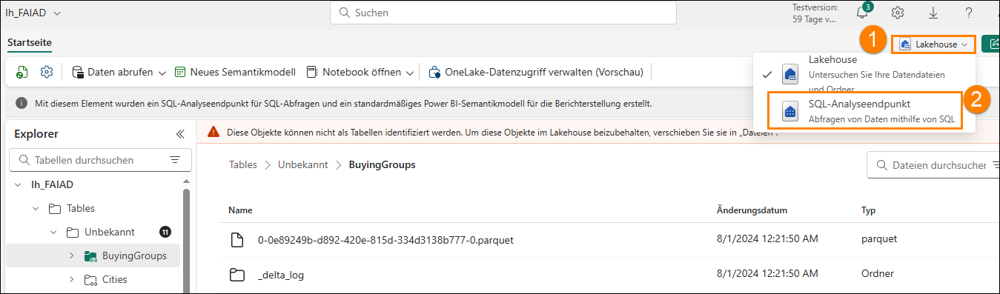
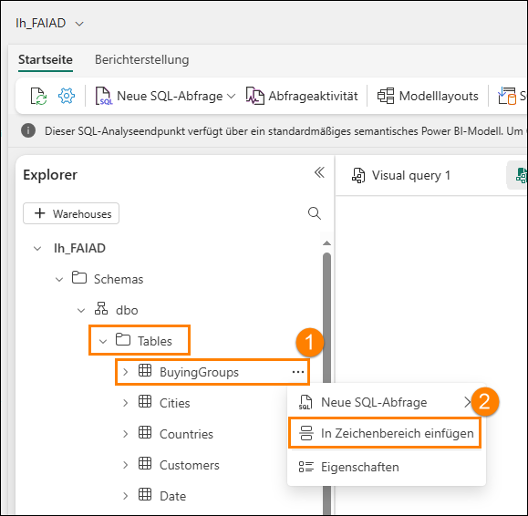
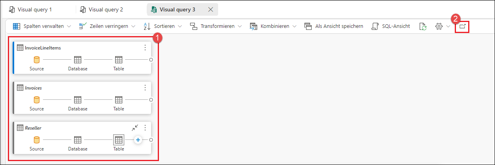

# Inhalt

- Einführung
- Verknüpfung zu ADLS Gen2
    - Aufgabe1: Verknüpfung erstellen
- Daten mithilfe einer Visual-Abfrage transformieren
    - Aufgabe 2: Ansicht „Geo“ mithilfe einer Visual-Abfrage erstellen
    - Aufgabe 3: Ansicht „Reseller“ mithilfe einer Visual-Abfrage erstellen
    - Aufgabe 4: Ansicht „Sales“ mithilfe einer Visual-Abfrage erstellen
    - Aufgabe 5: Ansicht „Product“ mithilfe einer Visual-Abfrage erstellen
- Referenzen

# Einführung 

In unserem Szenario stammen die Verkaufsdaten aus dem ERP-System und
werden in einer ADLS Gen2 gespeichert. Jeden Tag um 12 Uhr mittags
werden die Daten aktualisiert. Wir müssen diese Daten transformieren, in
Lakehouse erfassen und in unserem Modell verwenden.

Es gibt mehrere Möglichkeiten, diese Daten zu erfassen.

- **Verknüpfungen:** Hiermit wird eine Verknüpfung zu den Daten
    erstellt, und wir können sie anhand von Ansichten für visuelle
    Abfragen transformieren. Wir werden Verknüpfungen in dieser Übung
    verwenden.

- **Notebooks:** Dafür müssen wir Code schreiben. Es handelt sich um
    einen entwicklerfreundlichen Ansatz.

- **Dataflow Gen2:** Sie sind wahrscheinlich mit Power Query oder
    Dataflow Gen1 vertraut. Dataflow Gen2 ist, wie der Name schon sagt,
    die neuere Version von Dataflow. Es bietet alle Funktionen von Power
    Query/Dataflow Gen1 und ermöglicht zusätzlich die Transformation und
    Erfassung von Daten in mehreren Datenquellen. Wir werden dies in den
    nächsten Übungen vorstellen.

- **Datenpipeline:** Dies ist ein Orchestrierungstool. Aktivitäten
    können orchestriert werden, um Daten zu extrahieren, zu
    transformieren und zu erfassen. Wir werden Data Pipeline verwenden,
    um Dataflow Gen2-Aktivitäten auszuführen, die wiederum Extraktion,
    Transformation und Aufnahme durchführen.

Wir beginnen mit der Erstellung einer Verknüpfung, um Daten aus der ADLS
Gen2-Datenquelle in ein Lakehouse zu erfassen. Nach der Erfassung
transformieren wir sie mit Ansichten für Visual-Abfragen.

Am Ende dieser Übung haben Sie Folgendes gelernt:

- Erstellen einer Verknüpfung zu Lakehouse

- Transformieren von Daten mithilfe der Visual-Abfrage

# Verknüpfung zu ADLS Gen2

### Aufgabe1: Verknüpfung erstellen

Verknüpfungen werden verwendet, um eine Verknüpfung zum Zielort zu
erstellen. Mit Verknüpfungen kann auf die Daten zugegriffen werden, ohne
dass die Daten physisch in das Lakehouse gebracht werden müssen. Dies
ist vergleichbar mit der Erstellung von Verknüpfungen auf dem Windows
Desktop.

1. Navigieren wir zurück zum **Fabric-Arbeitsbereich**, den Sie in
    Übung 2, Aufgabe 8, erstellt haben.

2. Wenn Sie nach der vorherigen Übung nicht zu einem anderen Bereich
    navigiert sind, befinden Sie sich im Lakehouse-Bildschirm. Wenn Sie
    zu einem anderen Bereich navigiert sind, ist das in Ordnung. Wählen
    Sie **lh_FAIAD** aus, um zum Lakehouse zu navigieren.

3. Wählen Sie im Bereich **Explorer** die **Auslassungspunkte** neben
    **Tables** aus.

4. Wählen Sie **Neue Verknüpfung** aus.

    

5. Das Dialogfeld **Neue Verknüpfung** wird geöffnet. Wählen Sie unter
    **Externe Quellen** die Option **Azure Data Lake Storage Gen2** aus.

    

6. Wählen Sie „Neue Verbindung erstellen" aus.

7. Geben Sie den folgenden Link für die **URL**-Eigenschaft ein:
    <https://stvnextblobstorage.dfs.core.windows.net/fabrikam-sales>

8. Wählen Sie **Shared Access Signature (SAS)** aus der Dropdown-Liste
    „Authentifizierungsart" aus.

9. Kopieren Sie das **SAS-Token** von der Registerkarte
    **Umgebungsvariablen** (neben der Registerkarte „Lab-Anleitung"),
    und fügen Sie ihn in das Feld **SAS-Token** ein.

10. Wählen Sie unten rechts auf dem Bildschirm **Weiter** aus.

    

11. Sie werden mit ADLS Gen2 verbunden und die Verzeichnisstruktur wird
    im linken Bereich angezeigt. Erweitern Sie
    **Delta-Parquet-Format-FY25**.

12. **Wählen** Sie die folgenden Verzeichnisse aus:

    a. Application.Cities

    b. Application.Countries

    c. Application.StateProvinces

    d. DateDim

    e. Sales.BuyingGroups

    f. Sales.Customers

    g. Sales.InvoiceLines

    h. Sales.Invoices

    i. Warehouse.StockGroups

    j. Warehouse.StockItemStockGroups

    k. Warehouse.StockItems

**Hinweis:** „Sales.Invoices_May" ist das einzige Verzeichnis, das
**nicht** ausgewählt ist.

13. Wählen Sie **Weiter** aus.

    

14. Sie werden zum nächsten Dialogfeld weitergeleitet, in dem Sie die
    Namen bearbeiten können. Wählen Sie das **Symbol „Bearbeiten"**
    unter Aktionen für **Application.Cities** aus.

15. Benennen Sie **Application.Cities in „Cities"** um.

16. Aktivieren Sie das Häkchen neben dem Namen, um die Änderung zu
    speichern.

    

17. Benennen Sie auch die Namen der Verknüpfungen wie folgt um:

    a. Application.Countries in **Countries**

    b. Application.StateProvinces in **States**

    c. DateDim in **Date**

    d. Sales.BuyingGroups in **BuyingGroups**

    e. Sales.Customers in **Customers**

    f. Sales.InvoiceLines in **InvoiceLineItems**

    g. Sales.Invoices in **Invoices**

    h. Warehouse.StockGroups in **ProductGroups**

    i. Warehouse.StockItemStockGroups in **ProductItemGroup**

    j. Warehouse.StockItems in **ProductItem**

    > **Hinweis:** Überprüfen Sie die Namen. Ein Tippfehler kann während der
    
    > Übung zu Fehlern führen.

18. Wählen Sie **Erstellen** aus, um die Verknüpfung zu erstellen.

    

19. Beachten Sie, dass alle Verknüpfungen als Tabellen erstellt werden.
    Wählen Sie die Tabelle **BuyingGroups** aus, und beachten Sie, dass
    im Datenbereich eine Vorschau der Daten angezeigt wird.

    

Das nächste Schritt besteht darin, die Daten zu transformieren, damit
wir ein semantisches Modell erstellen können. Wir erstellen Ansichten,
um die Daten zu transformieren.

# Daten mithilfe einer Visual-Abfrage transformieren

### Aufgabe 2: Ansicht „Geo" mithilfe einer Visual-Abfrage erstellen

1. Wir können Lakehouse über einen SQL-Endpunkt aufrufen. Dies bietet
    die Möglichkeit, die Daten abzufragen und Ansichten zu erstellen.
    Wählen Sie **oben rechts** auf dem Bildschirm **Lakehouse -\>
    SQL-Analyseendpunkt** aus.

    

Sie werden zum SQL-Analyseendpunkt weitergeleitet. Beachten Sie, dass
sich das Explorer-Bereich geändert hat. Sie können jetzt Ansichten,
gespeicherte Prozeduren, Abfragen und mehr erstellen. Wir erstellen eine
Visual-Abfrage, da sie eine Power Query-ähnliche Schnittstelle bietet,
und speichern diese als Ansicht.

Wir beginnen mit der Erstellung einer Ansicht „Geo". Wir müssen Daten
aus den Abfragen „Cities", „Countries" und „States" zusammenführen, um
die Ansicht „Geo" zu erstellen.

2. Klicken Sie im oberen Menü auf das Dropdownmenü neben **Neue
    SQL-Abfrage**, und wählen Sie dann **Neue visuelle Abfrage** aus.

    

3. Wir müssen Tabellen in den visuellen Abfragebereich ziehen, um eine
    Abfrage zu erstellen. Lassen Sie uns die Abfragen „Cities", „States"
    und „Countries" in den Bereich für Visual-Abfragen ziehen.

    

Wir müssen diese Abfragen zusammenführen. Und die Visual-Abfrage wird
mit der Option zum Verwenden des Power Query-Editors bereitgestellt.
Lassen Sie uns diese verwenden, da wir damit vertraut sind.

4. Klicken Sie im Menü des Editors für Visual-Abfragen auf das Symbol
    **Im Popup-Fenster öffnen** (rechts). Sie werden zum Power
    Query-Editor weitergeleitet.

    

5. Wählen Sie bei ausgewählter Abfrage „Cities" im Menüband des Power
    Query-Editors **Start -\> Abfragen zusammenführen -\> Abfragen als
    neue Abfrage zusammenführen**. Das Dialogfeld „Abfragen
    zusammenführen" wird geöffnet.

**Hinweis:** Wenn Sie „Abfragen zusammenführen" nicht in der Startleiste
sehen, klicken Sie auf das Dropdownmenü für „Kombinieren" und auf die
Option „Abfragen zusammenführen".

6. Wählen Sie in **Linke Tabelle für Zusammenführung** die Option
    **Cities**.

7. Wählen Sie in **Rechte Tabelle für Zusammenführung** die Option
    **States**.

8. Wählen Sie **StateProvinceID**-Spalten aus beiden Tabellen aus. Wir
    führen eine Verknüpfung über diese Spalte aus.

9. Wählen Sie **Innerhalb** als **Art des Joins** aus.

10. Wählen Sie **OK** aus.

    

Beachten Sie, dass eine neue Abfrage mit dem Namen „Zusammenführen"
erstellt wurde. Wir benötigen einige Spalten aus „States".

11. Klicken Sie in der **Datenansicht** (unterer Bereich) auf den
    **Doppelpfeil** neben der Spalte **States** (letzte Spalte rechts).

12. Es wird ein Bereich geöffnet. **Wählen** Sie die folgenden Spalten
    aus:

    a. StateProvinceCode

    b. StateProvinceName

    c. CountryID

    d. SalesTerritory

13. Wählen Sie **OK** aus.

    

Wir müssen jetzt die Abfrage „Countries" zusammenführen.

14. Wählen Sie bei ausgewählter Zusammenführen-Abfrage im Menüband
    **Start -\> Abfragen zusammenführen -\> Abfragen zusammenführen**
    aus.

**Hinweis:** Wenn Sie „Abfragen zusammenführen" nicht in der Startleiste
sehen, klicken Sie auf das Dropdownmenü für „Kombinieren" und auf die
Option „Abfragen zusammenführen".

15. Das Dialogfeld „Zusammenführen-Abfrage" wird geöffnet. Wählen Sie in
    der **rechten zusammenzuführenden Tabelle** **Countries** aus.

16. Wählen Sie **CountryID**-Spalten aus beiden Tabellen aus. Wir führen
    eine Verknüpfung über diese Spalte aus.

17. Wählen Sie **Innerhalb** als **Art des Joins** aus.

18. Wählen Sie **OK** aus.

    

Wir benötigen einige Spalten aus „Countries".

19. Klicken Sie in der **Datenansicht** (unterer Bereich) auf den
    **Doppelpfeil** neben der Spalte **Countries**.

20. Es wird ein Bereich geöffnet. **Wählen** Sie die folgenden Spalten
    aus:

    a. CountryName

    b. FormalName

    c. IsoAlpha3Code

    d. IsoNumericCode

    e. CountryType

    f. Continent

    g. Region

    h. Subregion

21. Wählen Sie **OK** aus.

    

Wir benötigen nicht alle Spalten. Wir wählen nur die aus, die wir
benötigen.

22. Wählen Sie bei Zusammenführen-Abfrage im Menüband **Start -\>
    Spalten auswählen -\> Spalten auswählen** aus.

**Hinweis:** Wenn die Option „Spalten auswählen" nicht angezeigt wird,
finden Sie sie unter „Spalten verwalten".

23. Das Dialogfeld „Spalten auswählen" wird geöffnet. **Deaktivieren**
    Sie die folgenden Spalten.

    a. StateProvinceID

    b. Location

    c. LastEditedBy

    d. ValidFrom

    e. ValidTo

    f. CountryID

24. Wählen Sie **OK** aus.

    

Beachten Sie, dass der Prozess dem von Power Query ähnelt. Alle Schritte
sind sowohl im Bereich „Angewendete Schritte" rechts als auch in der
visuellen Ansicht aufgezeichnet. Wir benennen „Zusammenführen-Abfrage"
und „Laden aktivieren" um, damit die Daten aus dieser Abfrage geladen
werden.

25. **Klicken Sie** im Bereich „Abfragen" (links) **mit der rechten
    Maustaste auf „Zusammenführen-Abfrage"**. Wählen Sie **Umbenennen**
    aus, und benennen Sie die Abfrage in **Geo** um.

26. **Klicken Sie** im Bereich „Abfragen" (links) **mit der rechten
    Maustaste auf „Geo-Abfrage"**. Wählen Sie **Laden aktivieren** aus,
    um diese Abfrage zu aktivieren.

27. Stellen Sie sicher, dass die Abfragen „Cities", „States" und
    „Countries" **deaktiviert** sind.

28. Wählen Sie **Speichern** unten rechts im Power Query-Editor aus.

    

    Wir werden zum visuellen Abfrage-Editor weitergeleitet. Jetzt speichern wir diese Abfrage als Ansicht.

    **Hinweis:** Alle Schritte, die wir mit dem Power Query-Editor ausgeführt haben, können auch mit dem Editor für Visual-Abfragen ausgeführt werden.

29. Wählen Sie im Menü des Editors für Visual-Abfragen **Als Ansicht
    speichern** aus.

    

Das Dialogfeld „Als Ansicht speichern" wird geöffnet. Beachten Sie, dass
die SQL-Abfrage verfügbar ist. Sie können sie bei Bedarf überprüfen.

30. Geben Sie als **Ansichtsname** **Geo** ein.

31. Wählen Sie **OK** aus, um die Ansicht zu speichern.

    

Sie erhalten eine Benachrichtigung, nachdem die Ansicht gespeichert
wurde.

32. Erweitern Sie im Explorer-Bereich (links) **Views**. Wir haben die
    neu erstellte Ansicht „Geo".

    

### Aufgabe 3: Ansicht „Reseller" mithilfe einer Visual-Abfrage erstellen

Wir erstellen die Ansicht „Reseller", indem wir die Tabelle „Customers"
mit der Tabelle „BuyingGroups" zusammenführen. Dieses Mal erstellen wir
die Ansicht mithilfe einer Visual-Abfrage.

1. Klicken Sie im oberen Menü auf das Dropdownmenü neben **Neue
    SQL-Abfrage**, und wählen Sie dann **Neue visuelle Abfrage** aus.

2. Ziehen Sie die Tabellen „Customers" und „BuyingGroups" aus dem
    Explorer-Bereich in den Abschnitt „Visual-Abfrage".

    

    

3. Wählen Sie die Abfrage **„Customers"** aus. Wenn die Abfrage
    „Customers" ausgewählt ist, weist es einen blauen Rand auf und
    hinter „Table" befindet sich ein „+"-Zeichen (dies gibt an, dass wir
    nach „Table" einen Schritt hinzufügen). Wenn kein „+"-Zeichen hinter
    „Table" angezeigt wird, haben Sie möglicherweise einen anderen
    Schritt ausgewählt. Wählen Sie „Table" aus und es kann losgehen).

4. Wählen Sie im Menü der Visual-Abfrage **Kombinieren -\> Abfragen
    zusammenführen** aus.

    

Das Dialogfeld „Zusammenführen" wird geöffnet, wobei „Customers" als
oberste Tabelle ausgewählt ist.

5. Wählen Sie in der **rechten zusammenzuführenden Tabelle** die Option
    **BuyingGroups** aus.

6. Wählen Sie **BuyingGroupID**-Spalten aus beiden Tabellen aus. Wir
    führen eine Verknüpfung über diese Spalte aus.

7. Wählen Sie **Innerhalb** als **Art des Joins** aus.

8. Wählen Sie **OK** aus.

    

9. Klicken Sie in der **Datenansicht** (unterer Bereich) auf den
    **Doppelpfeil** neben der Spalte **BuyingGroups** (letzte Spalte
    rechts), um die Spalten von BuyingGroups auszuwählen.

10. Es wird ein Bereich geöffnet. **Wählen Sie die Spalte**
    **BuyingGroupName** aus.

11. Wählen Sie **OK** aus.

    

Wir benötigen nicht alle Spalten. Wir wählen nur die aus, die wir
benötigen.

12. Wählen Sie im Menü der Visual-Abfrage **Spalten verwalten -\>
    Spalten auswählen** aus.

    

13. Das Dialogfeld „Spalten auswählen" wird geöffnet. **Wählen Sie** die
    folgenden Spalten aus.

    a. ResellerID

    b. ResellerName

    c. PostalCityID

    d. PhoneNumber

    e. FaxNumber

    f. WebsiteURL

    g. DeliveryAddressLine1

    h. DeliveryAddressLine2

    i. DeliveryPostalCode

    j. PostalAddressLine1

    k. PostalAddressLine2

    l. PostalPostalCode

    m. BuyingGroupName

14. Wählen Sie **OK** aus.

    

15. Wir benennen die Spalte „BuyingGroupName" um. **Doppelklicken Sie in
    der Datenansicht auf die Spaltenüberschrift „BuyingGroupName"**,
    damit sie bearbeitet werden kann.

16. **Benennen** Sie die Spalte in **ResellerCompany** um.

    

Beachten Sie, dass in der Tabelle „Customers" alle Schritte dokumentiert
sind. Jetzt speichern wir diese Ansicht.

17. Wir müssen die Abfrage Customer speichern, da sie alle Schritte
    umfasst. Wir müssen das Laden aktivieren. Wählen Sie die
    **Auslassungspunkte** im Abfragefeld **Customer** aus.

18. Stellen Sie sicher, dass die Option „**Laden aktivieren**" aktiviert
    ist.

    

**Hinweis:** Das Feld **Customer** sollte einen blauen Rand haben, wenn
die Option „Laden aktivieren" aktiviert ist.

19. Wählen Sie im Menü der Visual-Abfrage **Als Ansicht speichern** aus.

    

Das Dialogfeld „Als Ansicht speichern" wird geöffnet. Beachten Sie, dass
die SQL-Abfrage verfügbar ist. Sie können sie bei Bedarf überprüfen.

20. Geben Sie als **Ansichtsname** **Reseller** ein.

21. Wählen Sie **OK** aus, um die Ansicht zu speichern.

    

Sie erhalten eine Benachrichtigung, nachdem die Ansicht gespeichert
wurde.

22. Erweitern Sie im Explorer-Bereich (links) **Views**. Wir haben die
    neu erstellte Ansicht „Reseller".

    

### Aufgabe 4: Ansicht „Sales" mithilfe einer Visual-Abfrage erstellen

Lassen Sie uns die Ansicht „Sales" erstellen, die durch das
Zusammenführen der Tabellen „InvoiceLineItems" und „Invoices" sowie der
Ansicht „Reseller" erstellt wird. Wir haben diese Abfrage in Power BI
Desktop. Wir kopieren den Code aus „Erweiterter Editor". Aber bevor wir
den Code kopieren, müssen wir mit der Visual-Abfrage eine
Zusammenführungstabelle erstellen, da in der Visual-Abfrage keine leere
Abfrage erstellt werden kann. Lassen Sie uns diese Methode ausprobieren.

1. Klicken Sie im oberen Menü auf das Dropdownmenü neben **Neue
    SQL-Abfrage**, und wählen Sie dann **Neue visuelle Abfrage** aus.

    

2. Ziehen Sie aus dem Abschnitt **Explorer -\> Tables** die Tabellen
    **InvoiceLineItems** und **Invoices** in den Abschnitt für
    Visual-Abfragen.

3. Ziehen Sie aus dem Abschnitt **Explorer -\> Views** die Ansicht
    **Reseller** in den Abschnitt für Visual-Abfragen.

4. Wählen Sie im Editor für Visual-Abfragen das **Im Popup-Fenster
    öffnen** aus, um den Power Query-Editor zu öffnen.

    

5. Wählen Sie bei ausgewählter Abfrage „InvoiceLineItems" im Menüband
    **Start -\> Abfragen zusammenführen -\> Abfragen als neue Abfrage
    zusammenführen** aus.

**Hinweis:** Wenn Sie „Abfragen zusammenführen" nicht in der Startleiste
sehen, klicken Sie auf das Dropdownmenü für „Kombinieren" und auf die
Option „Abfragen zusammenführen".

    

Das Dialogfeld zum Zusammenführen wird geöffnet.

6. Wählen Sie in **Linke Tabelle für Zusammenführung** die Option
    **InvoiceLineItems** aus.

7. Wählen Sie in **Rechte Tabelle für Zusammenführung** die Option
    **Invoices** aus.

8. Wählen Sie **InvoiceID**-Spalten aus beiden Tabellen aus. Wir führen
    eine Verknüpfung über diese Spalte aus.

9. Wählen Sie **Innerhalb** als **Art des Joins** aus.

10. Wählen Sie **OK** aus.

    

Wir kopieren den Code aus Power BI Desktop, und fügen ihn über
„Erweiterter Editor" ein.

11. Öffnen Sie **FAIAD.pbix** im Ordner **Reports** auf dem Desktop
    Ihrer Übungsumgebung, falls dies noch nicht erfolgt ist.

12. Wählen Sie im Menüband **Start \> Daten transformieren** aus. Das
    Power Query-Fenster wird geöffnet. Wie Sie in der vorherigen Übung
    festgestellt haben, sind die Abfragen im linken Bereich nach
    Datenquelle organisiert.

    

13. Wählen Sie links unter dem Ordner „ADLSData" die Abfrage **Sales**
    aus.

14. Wählen Sie im Menüband die Registerkarte **Start -\> Erweiterter
    Editor** aus. Das Dialogfenster „Erweiterter Editor" wird geöffnet.

    

**Hinweis:** Wenn Sie den erweiterten Editor nicht finden können, können
Sie unter **Start-\> Abfrage -\> Erweiterter Editor** darauf zugreifen.

15. **Wählen Sie Code aus Zeile 3** (#\"Expanded Invoice\" ...) bis zur
    letzten Codezeile aus.

16. **Klicken Sie mit der rechten Maustaste**, und wählen Sie **Copy**
    aus.

17. Wählen Sie **Abbrechen** aus, um „Erweiterter Editor" zu schließen.

    

18. **Navigieren Sie zurück zum Browser**, in dem der Power Query-Editor
    geöffnet ist.

19. Stellen Sie sicher, dass Sie die Abfrage **Zusammenführen**
    ausgewählt haben.

20. Wählen Sie im Menüband die Registerkarte **Start -\> Erweiterter
    Editor** aus. Das Dialogfenster „Erweiterter Editor" wird geöffnet.

    

21. Fügen Sie am **Ende von Zeile 2 ein Komma** hinzu (Source =
    Table.NestedJoin(InvoiceLineItems, {\"InvoiceID\"}, Invoices,
    {\"InvoiceID\"}, \"Invoices\", JoinKind.Inner).

22. Klicken Sie auf die **Eingabetaste**, um eine neue Zeile zu
    beginnen.

23. Geben Sie auf Ihrer Tastatur **STRG+V** ein, um den Code einzufügen,
    den Sie aus Power BI Desktop kopiert haben.

**Hinweis:** Wenn Sie in der Übungsumgebung arbeiten, wählen Sie die
**Auslassungspunkte (...)** oben rechts auf dem Bildschirm aus.
Verwenden Sie den Schieberegler, um das **VM Native Clipboard** **zu
aktivieren**. Wählen Sie im Dialogfeld OK aus. Nachdem Sie die Abfragen
eingefügt haben, können Sie diese Option deaktivieren.

24. Markieren Sie die letzten beiden Codezeilen (in der Quelle) und
    **löschen** Sie sie.

25. Wählen Sie **OK** aus, um die Änderungen zu speichern.

    

Wenn es einfacher ist, löschen Sie den gesamten Code im erweiterten
Editor, und fügen Sie den folgenden Code in „Erweiterter Editor" ein.

[let]{.mark}

[  Source = Table.NestedJoin(InvoiceLineItems, {\"InvoiceID\"},
Invoices, {\"InvoiceID\"}, \"Invoices\", JoinKind.Inner),]{.mark}

[    #\"Expanded Invoice\" = Table.ExpandTableColumn(Source,
\"Invoices\", {\"CustomerID\", \"BillToCustomerID\",
\"SalespersonPersonID\", \"InvoiceDate\"}, {\"CustomerID\",
\"BillToCustomerID\", \"SalespersonPersonID\",
\"InvoiceDate\"}),]{.mark}

[    #\"Removed Other Columns\" = Table.SelectColumns(#\"Expanded
Invoice\",{\"InvoiceLineID\", \"InvoiceID\", \"StockItemID\",
\"Quantity\", \"UnitPrice\", \"TaxRate\", \"TaxAmount\", \"LineProfit\",
\"ExtendedPrice\", \"CustomerID\", \"SalespersonPersonID\",
\"InvoiceDate\"}),]{.mark}

[    #\"Renamed Columns\" = Table.RenameColumns(#\"Removed Other
Columns\",{{\"CustomerID\", \"ResellerID\"}}),]{.mark}

[    #\"Merged Queries\" = Table.NestedJoin(#\"Renamed Columns\",
{\"ResellerID\"}, Reseller, {\"ResellerID\"}, \"Customer\",
JoinKind.Inner),]{.mark}

[    #\"Added Custom\" = Table.AddColumn(#\"Merged Queries\", \"Sales
Amount\", each \[ExtendedPrice\] - \[TaxAmount\]),]{.mark}

[    #\"Changed Type\" = Table.TransformColumnTypes(#\"Added
Custom\",{{\"Sales Amount\", type number}}),]{.mark}

[    #\"Removed Columns\" = Table.RemoveColumns(#\"Changed
Type\",{\"Customer\"})]{.mark}

[in]{.mark}

[    #\"Removed Columns\"]{.mark}

26. Sie werden zum Power Query-Editor weitergeleitet. Im linken Bereich
    „Abfragen" müssen Sie **kauf die „Zusammenführen-Abfrage
    doppelklicken**, um sie umzubenennen.

27. **Benennen Sie** Zusammenführen-Abfrage in **Sales** um.

28. Klicken Sie mit der rechten Maustaste auf die Abfrage „Sales", und
    wählen Sie **Laden aktivieren** aus, damit die Abfrage geladen
    werden kann.

    

29. Wählen Sie **Speichern** aus, um das Power Query-Dialogfeld zu
    speichern und zu schließen. Die werden zur visuellen Abfrage
    weitergeleitet.

30. Wählen Sie im Menü der Visual-Abfrage **Als Ansicht speichern** aus.
    Das Dialogfeld „Als Ansicht speichern" wird geöffnet. Beachten Sie,
    dass die SQL-Abfrage verfügbar ist. Sie können sie bei Bedarf
    überprüfen.

31. Geben Sie als **Ansichtsname** **Sales** ein.

32. Wählen Sie **OK** aus, um die Ansicht zu speichern.

    

Sie erhalten eine Benachrichtigung, nachdem die Ansicht gespeichert
wurde.

33. Erweitern Sie im Explorer-Bereich (links) **Views**. Wir haben die
    neu erstellte Ansicht „Sales".

    

### Aufgabe 5: Ansicht „Product" mithilfe einer Visual-Abfrage erstellen

Wir erstellen die Ansicht „Product", die durch das Zusammenführen der
Tabellen **„ProductItem"**, **„ProductItemGroup"** und
**„ProductGroups"** erstellt wird. Um voranzukommen, kopieren wir den
Code in „Erweiterter Editor".

1. Wählen Sie in der Menüleiste von Lakehouse **Start -\> Neue
    SQL-Abfrage-Dropdown 🡪 Neue visuelle Abfrage** aus. Es wird eine
    neue Visual-Abfrage geöffnet.

2. Ziehen Sie die Tabellen **ProductItem, ProductItemGroup und
    ProductGroups** aus dem Abschnitt „Explorer" in den Abschnitt für
    visuelle Abfragen.

3. Wählen Sie im Editor für Visual-Abfragen das **Symbol für den
    Fokusmodus** aus, um den Power Query-Editor zu öffnen.

    

4. Wählen Sie bei ausgewählter Abfrage **ProductItem** im Menüband
    **Start -\> Abfragen zusammenführen -\> Abfragen als neue Abfrage
    zusammenführen** aus. Das Dialogfeld zum Zusammenführen wird
    geöffnet.

    

5. Wählen Sie in **Linke Tabelle für Zusammenführung** die Option
    **ProductItem** aus.

6. Wählen Sie in **Rechte Tabelle für Zusammenführung** die Option
    **ProductItemGroup** aus.

7. Wählen Sie **StockItemID**-Spalten aus beiden Tabellen aus. Wir
    führen eine Verknüpfung über diese Spalte aus.

8. Wählen Sie als **Art des Joins** die Option **Linker äußerer** aus.

9. Wählen Sie **OK** aus. Es wird eine neue Merge-Abfrage erstellt.

    

10. Wählen Sie bei ausgewählter Zusammenführen-Abfrage im Menüband
    **Start -\> Erweiterter Editor** aus. Das Dialogfenster „Erweiterter
    Editor" wird geöffnet.

    

**Hinweis:** Wenn Sie den erweiterten Editor nicht finden können, können
Sie unter **Start-\> Abfrage -\> Erweiterter Editor** darauf zugreifen.

11. **Wählen Sie den gesamten Code** in „Erweiterter Editor" aus, und
    **löschen** Sie ihn.

12. Fügen Sie den folgenden Code in „Erweiterter Editor" ein.

[let]{.mark}

[Source = Table.NestedJoin(ProductItem, {\"StockItemID\"},
ProductItemGroup, {\"StockItemID\"}, \"ProductItemGroup\",
JoinKind.LeftOuter),]{.mark}

[#\"Expanded ProductItemGroup\" = Table.ExpandTableColumn(Source,
\"ProductItemGroup\", {\"StockGroupID\"}, {\"StockGroupID\"}),]{.mark}

[#\"Merged queries\" = Table.NestedJoin(#\"Expanded ProductItemGroup\",
{\"StockGroupID\"}, ProductGroups, {\"StockGroupID\"},
\"ProductGroups\", JoinKind.LeftOuter),]{.mark}

[#\"Expanded ProductGroups\" = Table.ExpandTableColumn(#\"Merged
queries\", \"ProductGroups\", {\"StockGroupName\"},
{\"StockGroupName\"}),]{.mark}

[#\"Choose columns\" = Table.SelectColumns(#\"Expanded ProductGroups\",
{\"StockItemID\", \"StockItemName\", \"SupplierID\", \"Size\",
\"IsChillerStock\", \"TaxRate\", \"UnitPrice\",
\"RecommendedRetailPrice\", \"TypicalWeightPerUnit\",
\"StockGroupName\"})]{.mark}

[in]{.mark}

[#\"Choose columns\"]{.mark}

13. Wählen Sie **OK** aus, um „Erweiterter Editor" zu schließen. Sie
    werden zum Power Query-Editor weitergeleitet.

    

14. Im linken Bereich „Abfragen" müssen Sie **auf die
    „Zusammenführen-Abfrage doppelklicken**, um sie umzubenennen.

15. **Benennen Sie** Zusammenführen-Abfrage in **Product** um.

16. Klicken Sie mit der rechten Maustaste auf die Abfrage „Product", und
    wählen Sie **Laden aktivieren** aus, damit die Abfrage geladen
    werden kann.

17. Wählen Sie **Speichern** aus, um das Power Query-Dialogfeld zu
    speichern und zu schließen. Die werden zur visuellen Abfrage
    weitergeleitet.

    

18. Wählen Sie im Menü der Visual-Abfrage **Als Ansicht speichern** aus.
    Das Dialogfeld „Als Ansicht speichern" wird geöffnet. Beachten Sie,
    dass die SQL-Abfrage verfügbar ist. Sie können sie bei Bedarf
    überprüfen.

19. Geben Sie als **Ansichtsname** **Product** ein.

20. Wählen Sie **OK** aus, um die Ansicht zu speichern.

    

Sie erhalten eine Benachrichtigung, nachdem die Ansicht gespeichert
wurde.

21. Erweitern Sie im Explorer-Bereich (links) **Views**. Wir haben die
    neu erstellte Ansicht „Product".

    

Wir haben die Daten aus der ADLS Gen2-Datenquelle transformiert. In
dieser Übung haben wir gelernt, wie man Verknüpfungen erstellt und
verschiedene Optionen zur Verwendung von Ansichten für Visual-Abfragen
zum Transformieren von Daten erkundet.

In der nächsten Übung erfahren wir, wie man Dataflow Gen2 verwendet und
eine Verknüpfung zu einem anderen Lakehouse erstellt.

# Referenzen

Bei Fabric Analyst in a Day (FAIAD) lernen Sie einige der wichtigsten
Funktionen von Microsoft Fabric kennen. Im Menü des Dienstes finden Sie
in der Hilfe (?) Links zu praktischen Informationen.

Nachfolgend finden Sie weitere Angebote zur weiteren Arbeit mit
Microsoft Fabric.

- Die vollständige [Ankündigung der allgemeinen Verfügbarkeit von
    Microsoft Fabric](https://aka.ms/Fabric-Hero-Blog-Ignite23) finden
    Sie im Blogbeitrag.

- Fabric bei einer [interaktiven
    Vorstellung](https://aka.ms/Fabric-GuidedTour) kennenlernen

- Zur [kostenlosen Testversion von Microsoft
    Fabric](https://aka.ms/try-fabric) anmelden

- [Website von Microsoft Fabric](https://aka.ms/microsoft-fabric)
    besuchen

- Mit Modulen von [Fabric Learning](https://aka.ms/learn-fabric) neue
    Qualifikationen erwerben

- [Technische Dokumentation zu Fabric](https://aka.ms/fabric-docs)
    lesen

- [Kostenloses E-Book zum Einstieg in
    Fabric](https://aka.ms/fabric-get-started-ebook) lesen

- Mitglied der [Fabric-Community](https://aka.ms/fabric-community)
    werden, um Fragen zu stellen, Feedback zu geben und sich mit anderen
    auszutauschen

Lesen Sie die detaillierteren Blogs zur Ankündigung der Fabric-Umgebung:

- [Blog zum Data Factory-Funktionsbereich in
    Fabric](https://aka.ms/Fabric-Data-Factory-Blog) 

- [Blog zum Data Engineering-Funktionsbereich von Synapse in
    Fabric](https://aka.ms/Fabric-DE-Blog) 

- [Blog zum Data Science-Funktionsbereich von Synapse in
    Fabric](https://aka.ms/Fabric-DS-Blog) 

- [Blog zum Data Warehousing-Funktionsbereich von Synapse in
    Fabric](https://aka.ms/Fabric-DW-Blog) 

- [Blog zum Real-Time Analytics-Funktionsbereich von Synapse in
    Fabric](https://aka.ms/Fabric-RTA-Blog)

- [Blog mit Ankündigungen zu Power BI](https://aka.ms/Fabric-PBI-Blog)

- [Blog zum Data Activator-Funktionsbereich in
    Fabric](https://aka.ms/Fabric-DA-Blog) 

- [Blog zu Verwaltung und Governance in
    Fabric](https://aka.ms/Fabric-Admin-Gov-Blog)

- [Blog zu OneLake in Fabric](https://aka.ms/Fabric-OneLake-Blog)

- [Blog zur Dataverse- und Microsoft
    Fabric-Integration](https://aka.ms/Dataverse-Fabric-Blog)

> © 2023 Microsoft Corporation. Alle Rechte vorbehalten.
>
> Durch die Verwendung der vorliegenden Demo/Übung stimmen Sie den
> folgenden Bedingungen zu:
>
> Die in dieser Demo/Übung beschriebene Technologie/Funktionalität wird
> von der Microsoft Corporation bereitgestellt, um Feedback von Ihnen zu
> erhalten und Ihnen Wissen zu vermitteln. Sie dürfen die Demo/Übung nur
> verwenden, um derartige Technologiefeatures und Funktionen zu bewerten
> und Microsoft Feedback zu geben. Es ist Ihnen nicht erlaubt, sie für
> andere Zwecke zu verwenden. Es ist Ihnen nicht gestattet, diese
> Demo/Übung oder einen Teil derselben zu ändern, zu kopieren, zu
> verbreiten, zu übertragen, anzuzeigen, auszuführen, zu
> vervielfältigen, zu veröffentlichen, zu lizenzieren, zu transferieren
> oder zu verkaufen oder aus ihr abgeleitete Werke zu erstellen.
>
> DAS KOPIEREN ODER VERVIELFÄLTIGEN DER DEMO/ÜBUNG (ODER EINES TEILS
> DERSELBEN) AUF EINEN/EINEM ANDEREN SERVER ODER SPEICHERORT FÜR DIE
> WEITERE VERVIELFÄLTIGUNG ODER VERBREITUNG IST AUSDRÜCKLICH UNTERSAGT.
>
> DIESE DEMO/ÜBUNG STELLT BESTIMMTE
> SOFTWARE-TECHNOLOGIE-/PRODUKTFEATURES UND FUNKTIONEN, EINSCHLIESSLICH
> POTENZIELLER NEUER FEATURES UND KONZEPTE, IN EINER SIMULIERTEN
> UMGEBUNG OHNE KOMPLEXE EINRICHTUNG ODER INSTALLATION FÜR DEN OBEN
> BESCHRIEBENEN ZWECK BEREIT. DIE TECHNOLOGIE/KONZEPTE IN DIESER
> DEMO/ÜBUNG ZEIGEN MÖGLICHERWEISE NICHT DAS VOLLSTÄNDIGE
> FUNKTIONSSPEKTRUM UND FUNKTIONIEREN MÖGLICHERWEISE NICHT WIE DIE
> ENDGÜLTIGE VERSION. UNTER UMSTÄNDEN VERÖFFENTLICHEN WIR AUCH KEINE
> ENDGÜLTIGE VERSION DERARTIGER FEATURES ODER KONZEPTE. IHRE ERFAHRUNG
> BEI DER VERWENDUNG DERARTIGER FEATURES UND FUNKTIONEN IN EINER
> PHYSISCHEN UMGEBUNG KANN FERNER ABWEICHEND SEIN.
>
> **FEEDBACK.** Wenn Sie Feedback zu den Technologiefeatures, Funktionen
> und/oder Konzepten geben, die in dieser Demo/Übung beschrieben werden,
> gewähren Sie Microsoft das Recht, Ihr Feedback in jeglicher Weise und
> für jeglichen Zweck kostenlos zu verwenden, zu veröffentlichen und
> gewerblich zu nutzen. Außerdem treten Sie Dritten kostenlos sämtliche
> Patentrechte ab, die erforderlich sind, damit deren Produkte,
> Technologien und Dienste bestimmte Teile einer Software oder eines
> Dienstes von Microsoft, welche/welcher das Feedback enthält, verwenden
> oder eine Verbindung zu dieser/diesem herstellen können. Sie geben
> kein Feedback, das einem Lizenzvertrag unterliegt, aufgrund dessen
> Microsoft Drittparteien eine Lizenz für seine Software oder
> Dokumentation gewähren muss, weil wir Ihr Feedback in diese aufnehmen.
> Diese Rechte bestehen nach Ablauf dieser Vereinbarung fort.
>
> DIE MICROSOFT CORPORATION LEHNT HIERMIT JEGLICHE GEWÄHRLEISTUNGEN UND
> GARANTIEN IN BEZUG AUF DIE DEMO/ÜBUNG AB, EINSCHLIESSLICH ALLER
> AUSDRÜCKLICHEN, KONKLUDENTEN ODER GESETZLICHEN GEWÄHRLEISTUNGEN UND
> GARANTIEN DER HANDELSÜBLICHKEIT, DER EIGNUNG FÜR EINEN BESTIMMTEN
> ZWECK, DES RECHTSANSPRUCHS UND DER NICHTVERLETZUNG VON RECHTEN
> DRITTER. MICROSOFT MACHT KEINERLEI ZUSICHERUNGEN BZW. ERHEBT KEINERLEI
> ANSPRÜCHE IM HINBLICK AUF DIE RICHTIGKEIT DER ERGEBNISSE UND DES AUS
> DER VERWENDUNG DER DEMO/ÜBUNG RESULTIERENDEN ARBEITSERGEBNISSES BZW.
> BEZÜGLICH DER EIGNUNG DER IN DER DEMO/ÜBUNG ENTHALTENEN INFORMATIONEN
> FÜR EINEN BESTIMMTEN ZWECK.
>
> **HAFTUNGSAUSSCHLUSS**
>
> Diese Demo/Übung enthält nur einen Teil der neuen Features und
> Verbesserungen in Microsoft Power BI. Einige Features können sich
> unter Umständen in zukünftigen Versionen des Produkts ändern. In
> dieser Demo/Übung erhalten Sie Informationen über einige, aber nicht
> über alle neuen Features.
