# Microsoft Fabric Analyst in a Day - Lab 2

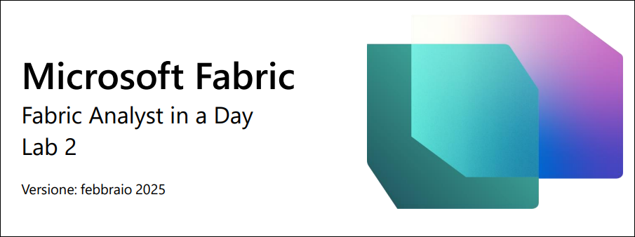

# Sommario
- Introduzione
- Licenza di Fabric
    - Attività 1 - Abilitazione di una licenza di valutazione per Microsoft Fabric
- Area di lavoro di Fabric
    - Attività 2 - Creazione di un'area di lavoro di Fabric
    - Attività 3 - Creazione di un lakehouse
- Panoramica delle esperienze in Fabric
    - Attività 4 - Esperienza Data Factory
    - Attività 5 - Esperienza Industry Solutions
    - Attività 6 - Esperienza Real-Time Intelligence
    - Attività 7 - Esperienza Data Engineering
    - Attività 8 - Esperienza Data Science
    - Attività 9 - Esperienza Data Warehouse
- Riferimenti

# Introduzione 

Oggi si apprenderanno alcune funzionalità chiave di Microsoft Fabric.
Questo è un workshop introduttivo che ha lo scopo di presentare le
diverse esperienze di uso del prodotto e i vari elementi disponibili in
Fabric. Al termine del workshop, si imparerà a usare le funzionalità
Lakehouse, Dataflow Gen2, Pipeline di dati, DirectLake e altre ancora.

In questo lab si imparerà a:

- Creare un'area di lavoro di Fabric

- Creare un lakehouse

# Licenza di Fabric

## Attività 1 - Abilitazione di una licenza di valutazione per Microsoft Fabric

1. Aprire il **browser** e andare all'indirizzo [Microsoft Power BI Portal](https://app.powerbi.com). Si aprirà la pagina di accesso.

    **Nota:** se si usa l'ambiente lab, si può effettuare l'accesso
    direttamente.

    **Nota:** se non si usa l'ambiente lab e si dispone di un account Power
    BI esistente, potrebbe essere opportuno usare il browser in modalità
    privata o in incognito.

2. Copiare il **Nome utente** e incollarlo nel campo **Posta
    elettronica** della finestra di dialogo, quindi selezionare
    **Invia**.

    - **Posta elettronica/nome utente:** <inject key="AzureAdUserEmail"></inject>

        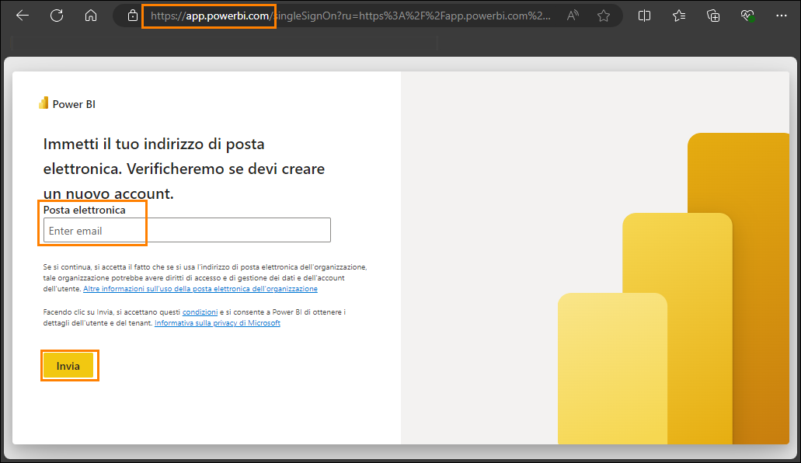

3. Immettere i dati **Posta elettronica/nome utente** seguenti nella
    schermata di accesso visualizzata nella scheda **Accedi a Microsoft
    Azure**, quindi fare clic su **Avanti**.

    - Posta elettronica/nome utente: <inject key="AzureAdUserEmail"></inject>

        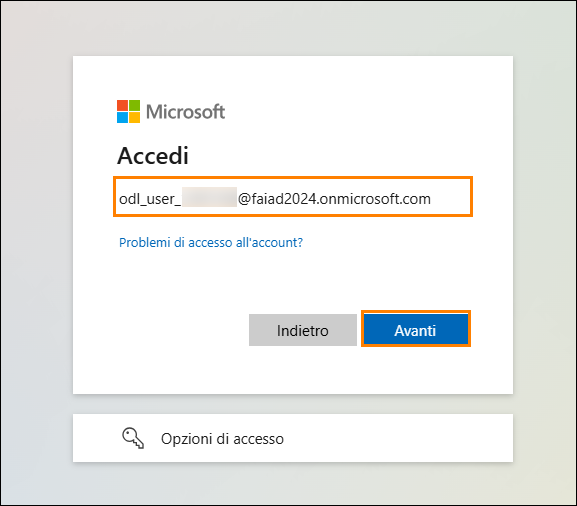

4. Immettere la **Password** seguente e fare clic su **Accedi**.

    - Password: <inject key="AzureAdUserPassword"></inject>

        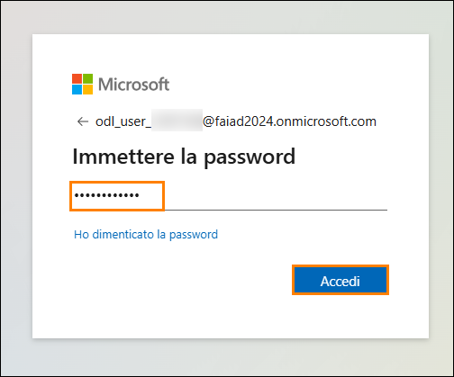

5. Si aprirà la **home page del servizio Power BI** abituale.

6. Si presuppone che si abbia familiarità con il layout del servizio
    Power BI. Per eventuali domande, rivolgersi all'istruttore.

    A questo punto, ci si trova nell'**Area di lavoro personale**. Per
    lavorare con gli elementi di Fabric, sono necessarie una licenza di
    valutazione e un'area di lavoro con una licenza di Fabric assegnata.
    Avviare la configurazione.

7. Nell'angolo in alto a destra della schermata selezionare l'**icona
    utente**.

8. Selezionare **Versione di valutazione gratuita**.

    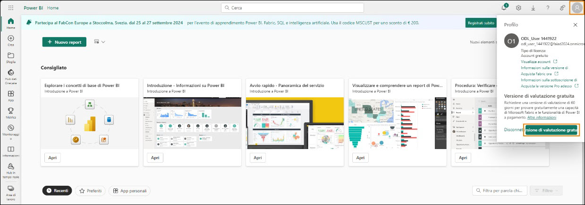

9. Si apre la finestra di dialogo Esegui l'aggiornamento a una
    versione di valutazione gratuita
    di Microsoft Fabric. Selezionare **Attiva**.

    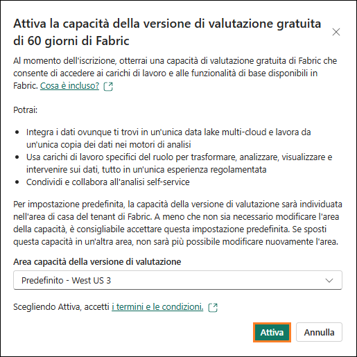

10. Si apre la finestra di dialogo Aggiornamento a Microsoft Fabric
    riuscito. Selezionare
    **Fabric Home Page**.

    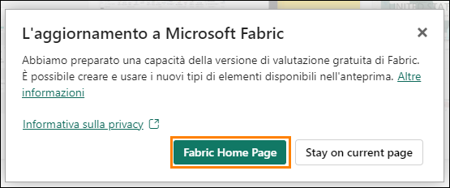

11. Si aprirà la **home page** di **Microsoft Fabric**.

    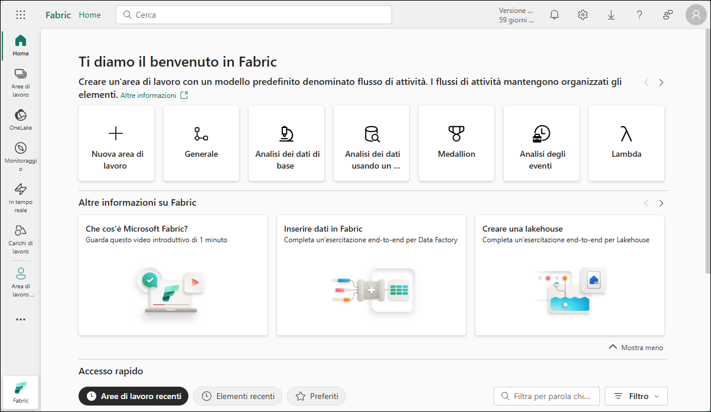

# Area di lavoro di Fabric

## Attività 2 - Creazione di un'area di lavoro di Fabric

1. Ora creeremo un'area di lavoro con una licenza di Fabric.
    Selezionare **Aree di lavoro (1)** nella barra di spostamento a
    sinistra. Si apre una finestra di dialogo.

2. Fare clic su **+ Nuova area di lavoro (2)** nella parte inferiore
    del menu popup.

    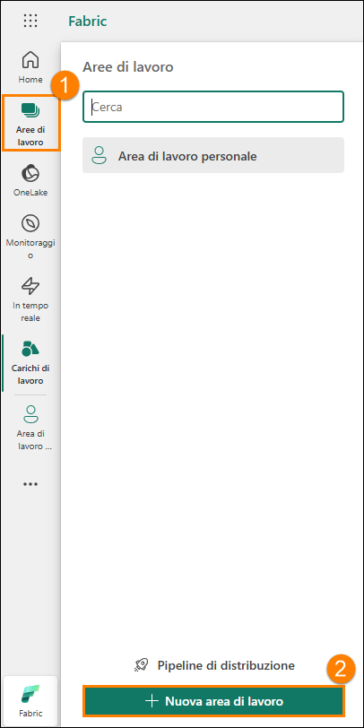

3. Si apre la finestra di dialogo **Crea un'area di lavoro** sul lato
    destro del browser.

4. Nel campo **Nome** immettere **FAIAD_<inject key="Deployment ID" enableCopy="false"/>**

    **Nota:** il nome dell'area di lavoro deve essere univoco. Assicurarsi
    che sotto il campo Nome sia presente un segno di spunta verde e che sia
    indicato "Questo nome è disponibile".

5. Se lo si desidera, è possibile immettere una Descrizione per l'area
    di lavoro. Questo campo è facoltativo.

6. Fare clic su **Avanzate** per espandere la sezione.

    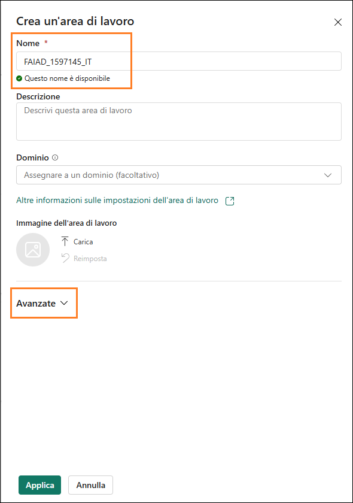

7. In **Modalità licenza** assicurarsi che si sia selezionato
    **Versione di prova** (deve essere selezionato per impostazione
    predefinita).

8. Selezionare **Applica** per creare una nuova area di lavoro.

    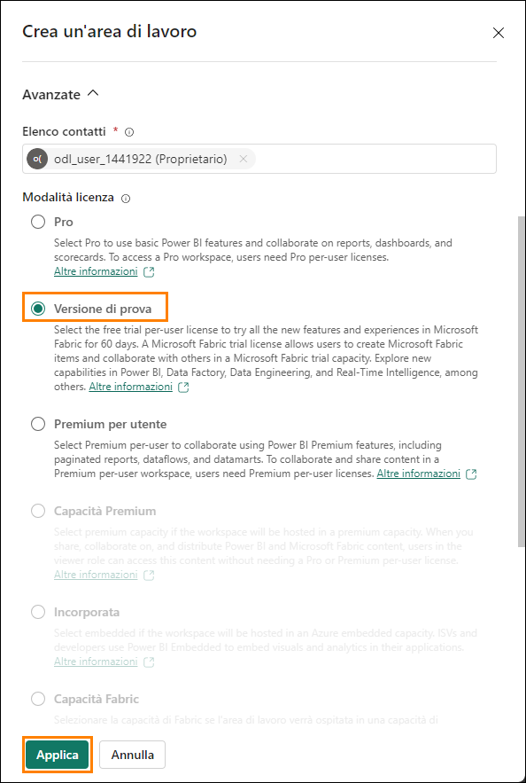

    Si crea una nuova area di lavoro e si passa a essa. Importeremo dati da
    diverse origini dati in Lakehouse e li useremo da Lakehouse per creare
    il modello e il report relativi. Il primo passaggio consiste nel creare
    un lakehouse.

## Attività 3 - Creazione di un lakehouse

1. Nella nuova area di lavoro creata **FAIAD_<inject key="Deployment ID" enableCopy="false"/>** individuare il pulsante **+ Nuovo elemento (1)** nel riquadro di spostamento a sinistra. Qui è possibile iniziare a creare nuovi elementi nell'area di lavoro.

2. Nella casella di ricerca digitare **Lakehouse (2)** e, dai risultati
    della ricerca, selezionare l'opzione **Lakehouse (3)**. Si creerà
    un nuovo lakehouse per le attività di archiviazione, query e
    gestione
    dei Big Data.

    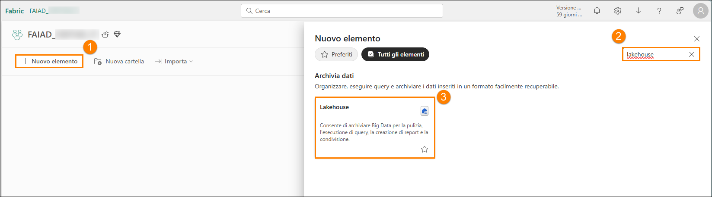

3. Si apre una finestra di dialogo Nuovo lakehouse. Immettere lh_FAIAD
    nella casella di testo Nome.

    **Nota:** lh indica Lakehouse. Aggiungiamo il prefisso lh per agevolarne
    l'identificazione e la ricerca.

4. Selezionare **Crea**.

    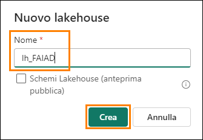

    Dopo qualche istante viene creato un lakehouse e si passerà
    all'interfaccia di Lakehouse. Nel **pannello sinistro** notare che
    sotto all'area di lavoro è ancora presente l'icona di Lakehouse.
    È possibile passare agevolmente al lakehouse facendo clic su questa
    icona in qualsiasi momento.

    In Lakehouse Explorer sono presenti **Tabelle** e **File**. Il lakehouse
    può esporre file di Azure Data Lake Storage Gen2 nella sezione file
    oppure un flusso di dati può caricare dati nelle tabelle di Lakehouse.
    Sono disponibili diverse opzioni. Illustreremo alcune di queste opzioni
    nei lab seguenti.

    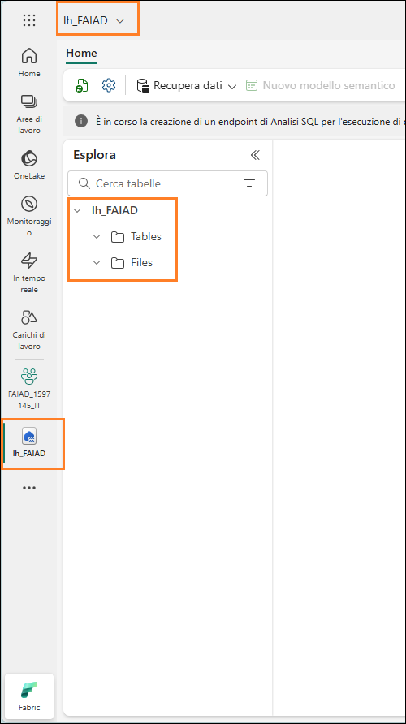

# Panoramica delle esperienze in Fabric

## Attività 4 - Esperienza Data Factory

1. Selezionare l'icona Carichi di lavoro a sinistra della schermata.
    Si apre una finestra di dialogo contenente l'elenco delle
    esperienze in Fabric. L'elenco di esperienze include Power BI, Data
    Factory, Industry Solutions, Real-Time Intelligence, Data
    Engineering, Data Science e Data Warehouse. Procediamo a esaminarle.

    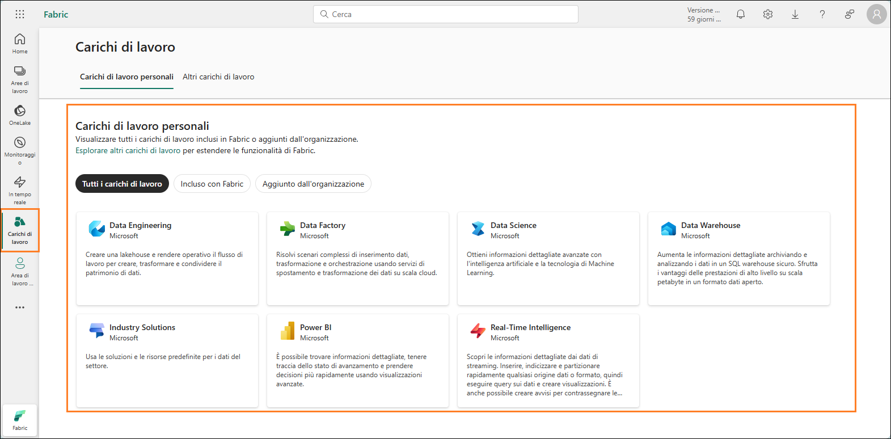

2. Selezionare **Data Factory**.

    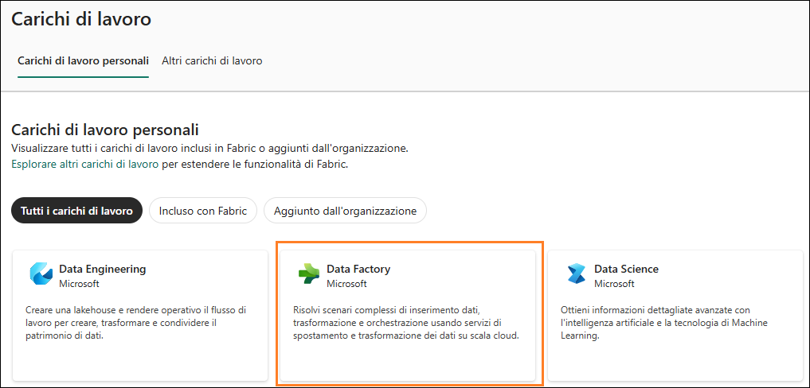

3. Si apre la home page di Data Factory. Di seguito è riportata una
    spiegazione dettagliata delle sezioni per offrire una guida
    specifica per l'uso efficace di Data Factory. Dataflow Gen2 è la
    nuova generazione di Dataflow.

    ### Che cos'è Data Factory?

    Data Factory è uno strumento che permette di gestire e organizzare i
    dati provenienti da origini diverse. Permette di raccogliere, preparare
    e trasformare i dati per poterli usare in modo efficace. Data Factory
    fornisce a principianti ed esperti gli strumenti necessari per
    semplificare e rendere più efficiente la trasformazione dei dati.

    ### Tipi di elemento

    a. **Flussi di dati:** i flussi di dati sono come ricette per
    trasformare i dati. Offrono oltre 300 trasformazioni diverse da
    applicare ai dati. Ciò significa che è possibile pulire, combinare
    e modificare i dati in molti modi in base alle diverse esigenze.

    b. **Pipeline:** le pipeline sono flussi di lavoro per automatizzare
    i processi di dati. Permettono di creare flussi di lavoro di dati
    flessibili e personalizzabili in base ai requisiti specifici. In
    questo modo, è possibile gestire ed elaborare più agevolmente i dati
    in modo strutturato.

    c. **Azure Data Factory (anteprima):** Azure Data Factory è un
    servizio di integrazione dei dati basato sul cloud che consente di
    creare flussi di lavoro basati sui dati per l'orchestrazione
    e l'automazione dello spostamento e della trasformazione dei dati.

    d. **Processo Apache Airflow (anteprima):** Apache Airflow è una
    piattaforma open source usata per creare, pianificare e monitorare i
    flussi di lavoro a livello programmatico. In Data Factory permette di
    creare, pianificare e gestire flussi di lavoro di dati complessi.

    e. **Copia processo (anteprima):** Copia processo è una funzionalità
    che permette di copiare i dati da un'origine a un'altra. È un modo
    semplice ed efficiente di spostare i dati tra archivi dati diversi.

    f. **Database con mirroring (anteprima):** una funzionalità per la
    creazione di versioni con mirroring di database per backup, test o
    accesso in sola lettura.

    ### Attività iniziali

    Per iniziare a usare Data Factory, effettuare i passaggi seguenti:

    a. **Informazioni su come usare Data Factory:** questa sezione spiega
    come iniziare a usare Data Factory. Fornisce indicazioni su come
    iniziare a usare lo strumento in modo efficace.

    b. **Creare il primo flusso di dati:** fornisce informazioni su come
    creare il primo flusso di dati. I flussi di dati sono essenziali per
    trasformare i dati in base alle esigenze.

    c. **Creare la prima pipeline:** questa sezione fornisce indicazioni
    per la creazione della prima pipeline di dati. Le pipeline permettono
    di automatizzare e gestire i processi di dati in modo efficiente.

    d. **Informazioni su come monitorare Data Factory:** il monitoraggio
    è fondamentale per garantire un funzionamento fluido dei processi di
    dati. Questa sezione illustra come monitorare le attività di Data
    Factory.

    e. **Informazioni su come trasformare i dati con i flussi di dati:**
    questa sezione descrive come usare i flussi di dati per trasformare i
    dati in modo efficace.

    f. **Creare la prima API per GraphQL:** questa sezione illustra le
    operazioni iniziali per l'uso di API con GraphQL.

    g. **Creare le prime funzioni per i dati utente:** questa sezione
    descrive come creare funzioni per i dati utente, utili per la gestione
    e la trasformazione dei dati utente.

    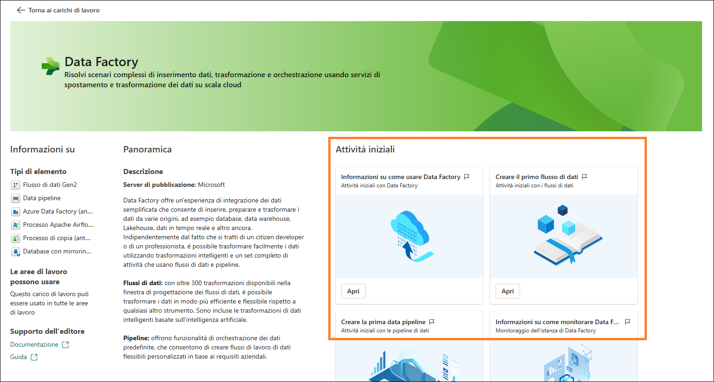

4. Fare clic su **Torna ai carichi di lavoro** nell'angolo in alto a
    sinistra della schermata. Si apre la pagina principale dei carichi
    di lavoro, in cui è possibile esplorare altri strumenti o sezioni.

    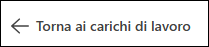

## Attività 5 - Esperienza Industry Solutions

1. Nella pagina **Carichi di lavoro** fare clic su **Industry
    Solutions** per procedere.

    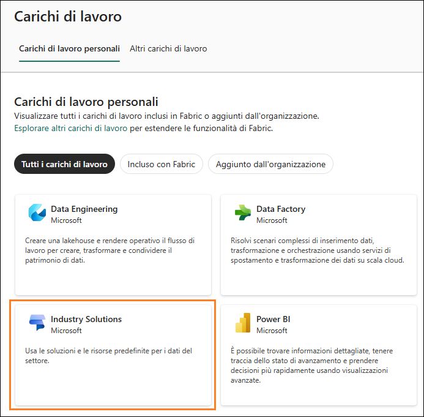

2. Si apre la home page di **Industry Solutions**. Di seguito è
    riportata una panoramica dettagliata delle sezioni per favorire un
    uso efficace di **Industry** **Solutions**.

    ### Che cos'è Industry Solutions?

    Industry Solutions è un insieme di soluzioni di dati pronte all'uso in
    Microsoft Fabric che fornisce soluzioni e risorse per vari settori.
    Industry Solutions permette di avvicinarsi agli scenari aziendali
    chiave con modelli di dati specifici del settore, connettori,
    trasformazioni, report e altre risorse.

    ### Tipi di elemento

    a. **Soluzioni per la sostenibilità:** supporta l'inserimento, la
    standardizzazione e l'analisi di dati ambientali, sociali e di
    governance (ESG).

    b. **Soluzioni per la vendita al dettaglio:** permette di gestire
    grandi volumi di dati, di integrare dati provenienti da origini
    diverse e di fornire analisi in tempo reale per un processo
    decisionale rapido e tempestivo. I rivenditori possono usare queste
    soluzioni per l'ottimizzazione delle scorte, la segmentazione dei
    clienti, la previsione delle vendite, la determinazione dinamica
    dei prezzi e il rilevamento delle frodi.

    c. **Soluzioni per il settore sanitario:** sono progettate
    strategicamente per accelerare il time-to-value per i clienti
    rispondendo all'esigenza critica di trasformare in modo efficiente i
    dati sanitari in un formato adatto per l'analisi.

    ### Attività iniziali

    Per iniziare a usare Industry Solutions, effettuare i passaggi seguenti:

    a. **Informazioni sulle soluzioni per i dati sanitari:** fare clic
    sul pulsante "Altre informazioni" per informazioni sulle soluzioni
    per i dati sanitari e su come usarle nei propri progetti.

    b. **Distribuzione delle soluzioni per i dati sanitari:** fare clic
    sul pulsante "Distribuisci" per iniziare a distribuire le soluzioni
    per i dati sanitari e implementarle nei propri progetti.

    c. **Informazioni sulle soluzioni per la sostenibilità:** fare clic
    sul pulsante "Altre informazioni" per informazioni sulle soluzioni
    per la sostenibilità e su come usarle nei propri progetti.

    d. **Distribuzione delle soluzioni per la sostenibilità:** fare clic
    sul pulsante "Distribuisci" per iniziare a distribuire le soluzioni
    per la sostenibilità e implementarle nei propri progetti.

    e. **Informazioni sulle soluzioni per la vendita al dettaglio:** fare
    clic sul pulsante "Altre informazioni" per informazioni sulle
    soluzioni per la vendita al dettaglio e su come usarle nei propri
    progetti.

    f. **Distribuzione delle soluzioni per la vendita al dettaglio:**
    fare clic sul pulsante "Distribuisci" per iniziare a distribuire le
    soluzioni per la vendita al dettaglio e implementarle nei propri
    progetti.

3. Fare clic su Torna ai carichi di lavoro nell'angolo in alto a
    sinistra della schermata. Si apre la pagina principale dei carichi di
    lavoro, in cui è possibile esplorare altri strumenti o sezioni.

    

## Attività 6 - Esperienza Real-Time Intelligence

1. Nella pagina **Carichi di lavoro** fare clic su **Real-Time Intelligence** per procedere.

    

2. Si apre la home page di **Real-Time Intelligence**. Di seguito è
    riportata una panoramica dettagliata delle sezioni per favorire un
    uso efficace di **Real-Time Intelligence**.

    ### Che cos'è Real-Time Intelligence?

    Real-Time Intelligence è uno strumento che permette di gestire e
    analizzare volumi elevati di dati ad alta granularità provenienti da
    origini diverse. Permette di inserire e analizzare i dati ed eseguire
    azioni su di essi in tempo reale, migliorando le operazioni aziendali
    con azioni e processi decisionali tempestivi.

    ### Tipi di elemento

    a. **Casa eventi:** permette di creare un'area di lavoro di uno o
    più database KQL, che è possibile condividere tra progetti.

    b. **Set di query KQL:** permette di eseguire query sui dati per
    produrre tabelle e oggetti visivi condivisibili.

    c. **Dashboard in tempo reale:** permette visualizzare dashboard in
    tempo reale entro pochi secondi dall'inserimento dati.

    d. **Eventstream:** permette di acquisire, trasformare e instradare
    il flusso di eventi in tempo reale.

    e. **Attivatore:** permette di monitorare set di dati, query e flussi
    di eventi per individuare schemi.

    ### Attività iniziali

    Per iniziare a usare Real-Time Intelligence, effettuare i passaggi
    seguenti:

    a. **Esplora l'esempio di Real-Time Intelligence:** fare clic sul
    pulsante "Apri" per esplorare un'analisi di dati in tempo reale con
    un esempio.

    b. **Esplorare un esempio** fare clic sul pulsante "Seleziona" per
    imparare a usare Real-Time Intelligence mediante un esempio.

    c. **Introduzione a Real-Time Intelligence:** fare clic sul pulsante
    "Apri" per ottenere una panoramica di Real-Time Intelligence e
    iniziare a usare questo strumento in modo efficace.

    d. **Informazioni su KQL con dati di esempio:** fare clic sul pulsante
    "Apri" per imparare a usare KQL mediante dati di esempio.

    e. **Che cos'è Real-Time Hub:** fare clic sul pulsante "Apri" per
    informazioni su Real-Time Hub
    e su come usarlo.

    f. **Esplorare un Sample Activator:** fare clic sul pulsante "Apri"
    per usare un Sample Activator e comprendere caratteristiche e
    funzionalità di Real-Time Intelligence.

    g. **Introduzione ad Activator:** fare clic sul pulsante "Apri" per
    informazioni iniziali su Activator e iniziare a usare questo strumento
    in modo efficace.

    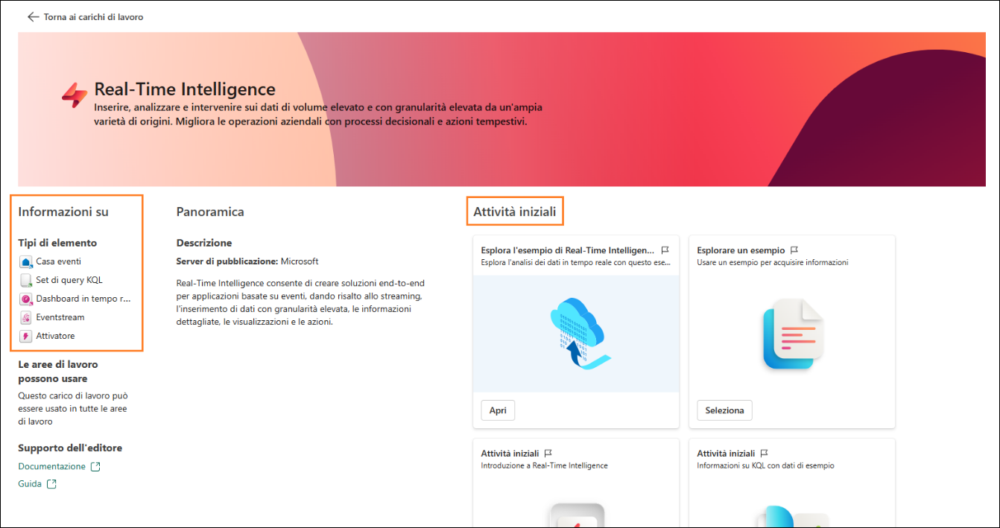

3. Fare clic su Torna ai carichi di lavoro nell'angolo in alto a
    sinistra della schermata. Si apre la pagina principale dei carichi
    di lavoro, in cui è possibile esplorare altri strumenti o sezioni.

    

## Attività 7 - Esperienza Data Engineering

1. Nella pagina **Carichi di lavoro** fare clic su **Data Engineering**
    per procedere.

    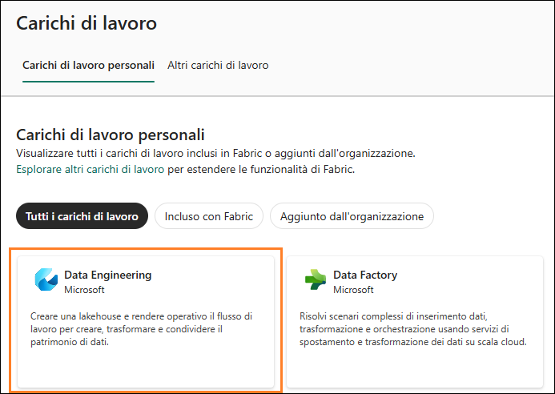

2. Si apre la home page di **Data Engineering**. Di seguito è riportata
    una panoramica dettagliata delle sezioni per favorire un uso
    efficace di **Data** **Engineering**.

    ### Che cos'è Data Engineering?

    Data Engineering è uno strumento per progettare, creare e gestire
    infrastrutture e sistemi per la raccolta, l'archiviazione,
    l'elaborazione e l'analisi di grandi volumi di dati. Permette di
    creare un lakehouse e rendere operativo il flusso di lavoro per creare,
    trasformare e condividere il patrimonio di dati.

    ### Tipi di elemento

    a. **Lakehouse:** permette di archiviare Big Data per operazioni di
    pulizia, query, reporting e condivisione.

    b. **Blocco appunti:** permette l'inserimento, la preparazione,
    l'analisi e altre attività correlate
    ai dati usando diversi linguaggi come Python, R e Scala.

    c. **Ambiente:** permette di configurare librerie condivise,
    impostazioni di calcolo Spark e risorse per notebook e definizioni di
    processi Spark.

    d. **Definizione del processo Spark:** permette di definire,
    pianificare e gestire i processi Apache.

    e. **Pipeline di dati:** permette di orchestrare la soluzione di
    dati.

    f. **API per GraphQL:** API per l'esecuzione di query su più origini
    dati.

    g. **Importa notebook**: permette di importare notebook da un
    computer locale.

    ### Attività iniziali

    Per iniziare a usare Data Engineering, effettuare i passaggi seguenti:

    a. **Esplorare un esempio:** fare clic sul pulsante "Seleziona" per
    imparare a usare Data Engineering mediante un esempio.

    b. **Che cos'è un lakehouse?:** fare clic sul pulsante "Apri" per
    informazioni sui lakehouse
    e su come usarli.

    c. **Esperienza sui dati in lakehouse:** fare clic sul pulsante
    "Apri" per informazioni iniziali sull'ingegneria dei dati mediante
    lakehouse.

    d. **Attività iniziali con le definizioni dei processi Spark:** fare
    clic sul pulsante "Apri" per informazioni su come usare le
    definizioni dei processi Spark per l'elaborazione dati.

    e. **Sviluppo ed esecuzione di notebook:** fare clic sul pulsante
    "Apri" per informazioni su come sviluppare ed eseguire notebook per
    l'analisi dei dati.

    f. **Come usare NotebookUtils:** fare clic sul pulsante "Apri" per
    informazioni su come usare NotebookUtils per l'analisi avanzata dei
    dati.

    g. **Uso dei notebook per il lakehouse:** fare clic su "Apri" per
    informazioni su come sfruttare i notebook per il proprio lakehouse.

    h. **Uso dei set di dati per il lakehouse:** fare clic su "Apri"
    per informazioni su come sfruttare
    i set di dati per il proprio lakehouse.

    i. **Creazione delle prime funzioni per i dati utente:** fare clic
    sul pulsante "Apri" per informazioni su come creare funzioni per i
    dati utente.

    j. **Creazione della prima API per GraphQL:** fare clic sul pulsante
    "Apri" per informazioni su come creare un'API per GraphQL.

    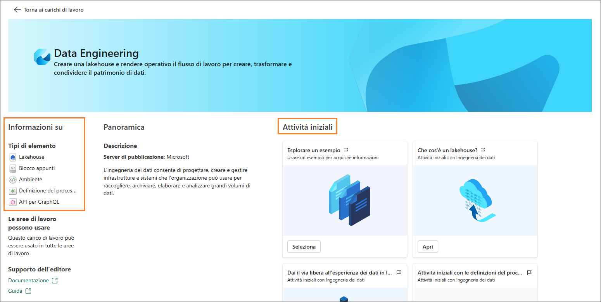

3. Fare clic su **Torna ai carichi di lavoro** nell'angolo in alto a
    sinistra della schermata. Si apre la pagina principale dei carichi
    di lavoro, in cui è possibile esplorare altri strumenti o sezioni.

    

## Attività 8 - Esperienza Data Science

1. Nella pagina **Carichi di lavoro** fare clic su **Data** **Science**
    per procedere.

    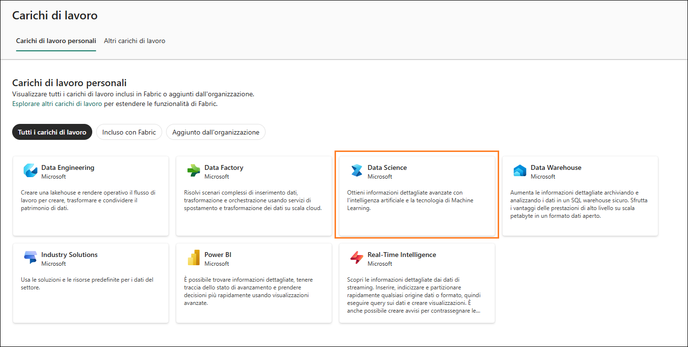

2. Si apre la home page di **Data Science**. Di seguito è riportata una
    panoramica dettagliata delle sezioni per consentire un uso efficace
    di **Data Science**.

    ### Che cos'è Data Science?

    Data Science è uno strumento che permette di ottenere informazioni
    dettagliate mediante la IA e la tecnologia Machine Learning. Fornisce
    strumenti di IA progettati per completare flussi di lavoro di
    data science su larga scala, sfruttare l'IA per l'arricchimento dei
    dati e ottenere informazioni aziendali dettagliate.

    ### Tipi di elemento:

    a. **Modello di Machine Learning:** permette di creare modelli di
    Machine Learning.

    b. **Esperimento:** permette di creare, eseguire e monitorare lo
    sviluppo di più modelli.

    c. **Blocco appunti:** permette di esplorare dati e creare soluzioni
    di Machine Learning.

    d. **Ambiente:** permette di configurare librerie condivise,
    impostazioni di calcolo Spark e risorse per notebook e definizioni di
    processi Spark.

    e. **Competenza IA:** permette di creare un'esperienza personale di
    intelligenza artificiale generativa.

    f. **Notebook Python:** permette di importare notebook Python da un
    computer locale.

    ### Attività iniziali

    Per iniziare a usare Data Science, effettuare i passaggi seguenti:

    a. **Esplorare un esempio:** fare clic sul pulsante "Seleziona" per
    imparare a usare Data Science mediante un esempio.

    b. **Attività iniziali con Modelli ML:** fare clic sul pulsante
    "Apri" per informazioni sulle attività iniziali con i modelli di
    Machine Learning.

    c. **Attività iniziali con Esperimenti ML:** fare clic sul pulsante
    "Apri" per informazioni su come condurre esperimenti di Machine
    Learning.

    d. **Sviluppo ed esecuzione di notebook:** fare clic sul pulsante
    "Apri" per informazioni su come sviluppare ed eseguire notebook per
    l'analisi dei dati.

    e. **Attività iniziali con Notebooks:** fare clic sul pulsante
    "Apri" per informazioni sulle attività iniziali con i notebook.

    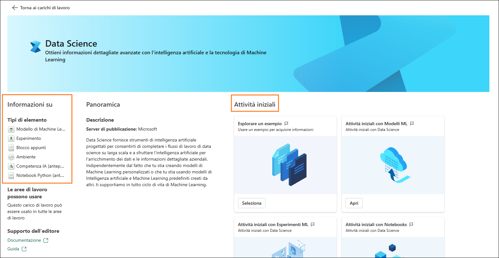

3. Fare clic su **Torna ai carichi di lavoro** nell'angolo in alto a
    sinistra della schermata. Si apre la pagina principale dei carichi
    di lavoro, in cui è possibile esplorare altri strumenti o sezioni.

    

## Attività 9 - Esperienza Data Warehouse

1. Nella pagina **Carichi di lavoro** fare clic su **Data Warehouse**
    per procedere.

    

2. Si apre la home page di **Data Warehouse**. Di seguito è riportata
    una panoramica dettagliata delle sezioni per favorire un uso
    efficace di **Data Warehouse**.

    ### Che cos'è Data Warehouse?

    Data Warehouse è uno strumento per archiviare e analizzare i dati in un
    warehouse SQL sicuro. Permette di ottenere grandi quantità di
    informazioni dettagliate grazie a prestazioni superiori a livello di
    petabyte in un formato di dati aperti.

    ### Tipi di elemento

    a. **Warehouse:** permette di creare un data warehouse.

    b. **Warehouse di esempio:** permette di esplorare e testare le
    funzionalità di data warehousing con set di dati e modelli
    preconfigurati.

    c. **Pipeline di dati:** permette di orchestrare le soluzioni di
    dati.

    d. **Blocco appunti:** permette di creare e condividere attività di
    analisi e visualizzazione di dati interattivi.

    e. **Database SQL di Azure con mirroring:** permette di eseguire il
    mirroring del database SQL di Azure.

    f. **Catalogo riflesso di Azure Databricks:** permette di eseguire il
    mirroring dei dati da Azure Databricks per migliorare l'integrazione
    e l'analisi.

    g. **Snowflake con mirroring:** permette di eseguire il mirroring del
    database Snowflake.

    h. **Azure Cosmos DB con mirroring:** permette di eseguire il
    mirroring di Azure Cosmos DB.

    i. **Database gestito Azure SQL con mirroring:** permette di eseguire
    il mirroring dei database gestiti Azure SQL per disponibilità elevata
    e ripristino di emergenza.

    j. **Database con mirroring:** permette di replicare i database per
    disponibilità elevata e ripristino di emergenza.

    ### Attività iniziali

    Per iniziare a usare Data Warehouse, effettuare il passaggio seguente:

    a. **Introduzione al warehouse:** fare clic su "Apri" per informazioni su come usare un warehouse per analizzare i dati.

    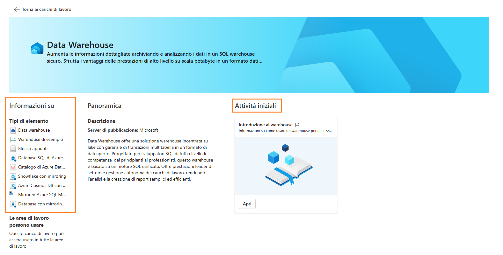

1. Fare clic su **Torna ai carichi di lavoro** nell'angolo in alto a
sinistra della schermata. Si apre la pagina principale dei carichi di
lavoro, in cui è possibile esplorare altri strumenti o sezioni.

    

In questo lab abbiamo esplorato l'interfaccia di Fabric e creato
un'area di lavoro di Fabric e un lakehouse. Nel prossimo lab si
imparerà a usare i collegamenti nel lakehouse per connettersi ai dati
ADLS Gen2 e a trasformare tali dati mediante l'uso delle viste.

# Riferimenti

Fabric Analyst in a Day (FAIAD) presenta alcune delle funzionalità
chiave disponibili in Microsoft Fabric. Nel menu di servizio, la sezione
Guida (?) include collegamenti ad alcune risorse utili.

Di seguito sono indicate altre risorse utili a progredire nell'uso di
Microsoft Fabric.

Di seguito sono riportate ulteriori risorse utili che consentiranno di progredire nell'uso di Microsoft Fabric.

- Vedere il post di blog per leggere l'[annuncio completo sulla disponibilità generale di Microsoft Fabric](https://aka.ms/Fabric-Hero-Blog-Ignite23)

- Esplorare Fabric attraverso la [Presentazione guidata](https://aka.ms/Fabric-GuidedTour)

- Iscriversi alla [versione di valutazione gratuita di Microsoft Fabric](https://aka.ms/try-fabric)

- Visitare il [sito Web di Microsoft Fabric](https://aka.ms/microsoft-fabric)

- Acquisire nuove competenze esplorando i [moduli di apprendimento su Fabric](https://aka.ms/learn-fabric)

- Consultare la [documentazione tecnica di Fabric](https://aka.ms/fabric-docs)

- Leggere l'[e-book gratuito introduttivo a Fabric](https://aka.ms/fabric-get-started-ebook)

- Unirsi alla [community di Fabric](https://aka.ms/fabric-community) per pubblicare domande, condividere feedback e imparare dagli altri

Leggere i blog di annunci più approfonditi sull'esperienza in Fabric:

- [Blog sull'esperienza Data Factory in Fabric](https://aka.ms/Fabric-Data-Factory-Blog) 

- [Blog sull'esperienza Synapse Data Engineering in Fabric](https://aka.ms/Fabric-DE-Blog) 

- [Blog sull'esperienza Synapse Data Science in Fabric](https://aka.ms/Fabric-DS-Blog) 

- [Blog sull'esperienza Synapse Data Warehousing in Fabric](https://aka.ms/Fabric-DW-Blog) 

- [Blog sull'esperienza Synapse Real-Time Analytics in Fabric](https://aka.ms/Fabric-RTA-Blog)

- [Blog di annunci di Power BI](https://aka.ms/Fabric-PBI-Blog)

- [Blog sull'esperienza Data Activator in Fabric](https://aka.ms/Fabric-DA-Blog) 

- [Blog su amministrazione e governance in Fabric](https://aka.ms/Fabric-Admin-Gov-Blog)

- [Blog su OneLake in Fabric](https://aka.ms/Fabric-OneLake-Blog)

- [Blog sull'integrazione di Dataverse e Microsoft Fabric](https://aka.ms/Dataverse-Fabric-Blog)

© 2025 Microsoft Corporation. Tutti i diritti sono riservati.

L'uso della demo/del lab implica l'accettazione delle seguenti
condizioni:

La tecnologia/le funzionalità descritte nella demo/nel lab sono fornite
da Microsoft Corporation allo scopo di ottenere feedback dall'utente e
offrire un'esperienza di apprendimento. L'utilizzo della demo/del lab
è consentito solo per la valutazione delle caratteristiche e delle
funzionalità di tale tecnologia e per l'invio di feedback a Microsoft.
L'utilizzo per qualsiasi altro scopo non è consentito. È vietato
modificare, copiare, distribuire, trasmettere, visualizzare, eseguire,
riprodurre, pubblicare, concedere in licenza, usare per la creazione di
lavori derivati, trasferire o vendere questa demo/questo lab o parte di
essi.

SONO ESPLICITAMENTE PROIBITE LA COPIA E LA RIPRODUZIONE DELLA DEMO/DEL
LAB (O DI QUALSIASI PARTE DI ESSI) IN QUALSIASI ALTRO SERVER O IN
QUALSIASI ALTRA POSIZIONE PER ULTERIORE RIPRODUZIONE O RIDISTRIBUZIONE.

QUESTA DEMO/QUESTO LAB RENDONO DISPONIBILI TECNOLOGIE
SOFTWARE/FUNZIONALITÀ DI PRODOTTO SPECIFICHE, INCLUSI NUOVI CONCETTI E
NUOVE FUNZIONALITÀ POTENZIALI, IN UN AMBIENTE SIMULATO, CON
UN'INSTALLAZIONE E UNA CONFIGURAZIONE PRIVE DI COMPLESSITÀ, PER GLI
SCOPI DESCRITTI IN PRECEDENZA. LA TECNOLOGIA/I CONCETTI RAPPRESENTATI IN
QUESTA DEMO/IN QUESTO LAB POTREBBERO NON CONTENERE LE FUNZIONALITÀ
COMPLETE E IL LORO FUNZIONAMENTO POTREBBE NON ESSERE LO STESSO DELLA
VERSIONE FINALE. È ANCHE POSSIBILE CHE UNA VERSIONE FINALE DI TALI
FUNZIONALITÀ O CONCETTI NON VENGA RILASCIATA. L'ESPERIENZA D'USO DI
TALI CARATTERISTICHE E FUNZIONALITÀ PUÒ INOLTRE RISULTARE DIVERSA IN UN
AMBIENTE FISICO.

**FEEDBACK**. L'invio a Microsoft di feedback sulle caratteristiche,
sulle funzionalità e/o sui concetti della tecnologia descritti in questa
demo/questo lab implica la concessione a Microsoft, a titolo gratuito,
del diritto di utilizzare, condividere e commercializzare tale feedback
in qualsiasi modo e per qualsiasi scopo. Implica anche la concessione a
titolo gratuito a terze parti del diritto di utilizzo di eventuali
brevetti necessari per i loro prodotti, le loro tecnologie e i loro
servizi al fine di utilizzare o interfacciarsi ai componenti software o
ai servizi Microsoft specifici che includono il feedback. L'utente si
impegna a non inviare feedback la cui inclusione all'interno di
software o documentazione Microsoft imponga a Microsoft di concedere in
licenza a terze parti tale software o documentazione. Questi diritti
sussisteranno anche dopo la scadenza del presente contratto.

CON LA PRESENTE MICROSOFT CORPORATION NON RICONOSCE ALCUNA GARANZIA O
CONDIZIONE RELATIVAMENTE ALLA DEMO/AL LAB, INCLUSE TUTTE LE GARANZIE E
CONDIZIONI DI COMMERCIABILITÀ, DI FATTO ESPRESSE, IMPLICITE O PRESCRITTE
DALLA LEGGE, ADEGUATEZZA PER UNO SCOPO SPECIFICO, TITOLARITÀ E NON
VIOLABILITÀ. MICROSOFT NON OFFRE GARANZIE O RAPPRESENTAZIONI IN
RELAZIONE ALL'ACCURATEZZA DEI RISULTATI E DELL'OUTPUT DERIVANTI
DALL'USO DELLA DEMO/DEL LAB O ALL'ADEGUATEZZA DELLE INFORMAZIONI
CONTENUTE NELLA DEMO/NEL LAB PER QUALSIASI SCOPO.

**CLAUSOLA DI RESPONSABILITÀ**

Questa demo/questo lab contiene solo una parte delle nuove funzionalità
e dei miglioramenti in Microsoft Power BI. Alcune funzionalità
potrebbero cambiare nelle versioni future del prodotto. In questa
demo/in questo lab si apprendono alcune delle nuove funzionalità, ma non
tutte.

