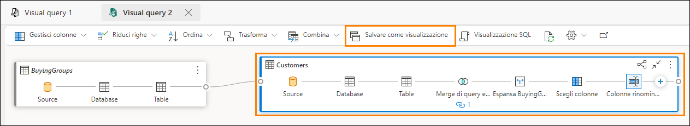

# Microsoft Fabric Analyst in a Day - Lab 3


# Sommario
- Introduzione
- Collegamento ad ADLS Gen2
    - Attività 1 - Creazione di un collegamento
- Trasformazione dei dati usando le query visive
    - Attività 2 - Creazione di una vista Geo mediante le query visive
    - Attività 3 - Creazione di una vista Reseller mediante le query visive
    - Attività 4 - Creazione di una vista Sales mediante le query visive
    - Attività 5 - Creazione di una vista Product mediante le query visive
- Riferimenti

# Introduzione 

Nel nostro scenario i dati vendita provengono dal sistema ERP e sono
archiviati in un ADLS Gen2. Vengono aggiornati alle 12.00 ogni giorno.
Dobbiamo trasformare e inserire questi dati in Lakehouse e usarli nel
nostro modello.

Esistono più modi per inserire questi dati.

- **Collegamenti:** Creano un collegamento ai dati e possiamo usare le
    viste delle query visive per trasformarli. Useremo i collegamenti in
    questo lab.

- **Notebook:** Richiedono la scrittura di codice. È un approccio
    pensato per gli sviluppatori.

- **Flusso di dati Gen2:** Probabilmente si ha familiarità con Power
    Query o Flusso di dati Gen1. Flusso di dati Gen2, come indica il
    nome, è la versione più recente di Flusso di dati. Fornisce tutte le
    funzionalità di Power Query/Flusso di dati Gen1 con la possibilità
    aggiuntiva di trasformare e inserire dati in più origini dati. Ne
    parleremo nei prossimi due lab.

- **Pipeline di dati:** Questo è uno strumento di orchestrazione. Le
    attività possono essere orchestrate per estrarre, trasformare e
    acquisire dati. Useremo Pipeline di dati per eseguire l'attività di
    Dataflow Gen2 che a sua volta eseguirà l'estrazione, la
    trasformazione e l'acquisizione.

Inizieremo creando un collegamento per inserire dati in un lakehouse
dall'origine dati ADLS Gen2. Una volta inseriti i dati, useremo le
viste delle query visive per trasformarli.

In questo lab si imparerà a:

- Come creare collegamenti nel lakehouse

- Come trasformare i dati usando la funzionalità query visiva

# Collegamento ad ADLS Gen2

## Attività 1 - Creazione di un collegamento

I collegamenti sono usati per creare un collegamento all'ubicazione di
destinazione e permettono di accedere ai dati senza la necessità di
spostarli fisicamente nel lakehouse. È come creare collegamenti
nel desktop di Windows.

1. Torniamo all'**area di lavoro di Fabric** **(1)** creata nel Lab 2,
    Attività 2.

2. Se non si è usciti dopo il lab precedente, ci si trova nella
    schermata Lakehouse. Se si è usciti, non c'è problema. Selezionare
    **lh_FAIAD** (**2)** per spostarsi nel lakehouse.

3. Nel pannello **Explorer** selezionare i **puntini di sospensione
    (3)** accanto a **Tables**.

4. Selezionare **Nuovo collegamento (4)**.

    

5. Si apre la finestra di dialogo **Nuovo collegamento**. In **Origini esterne** selezionare **Azure Data Lake Storage Gen2**.

    

6. Selezionare **Crea nuova connessione (1)**.

7. Immettere il collegamento seguente per la proprietà **URL**: `https://stvnextblobstorage.dfs.core.windows.net/fabrikam-sales` **(2)**

8. Selezionare **Firma di accesso condiviso (SAS) (3)** nel menu a
    discesa Tipo di autenticazione.

9. Copiare il token di firma di accesso condiviso e incollarlo nel
    campo Token di firma di accesso condiviso (4).

    - **Token di firma di accesso condiviso:** <inject key="Sas token"></inject>

10. Selezionare **Avanti (5)** in basso a destra della schermata.

    

11. Si stabilirà una connessione ad ADLS Gen2 con la struttura di
    directory visualizzata nel pannello di sinistra. Espandere
    **Delta-Parquet-Format-FY25 (1).**

12. **Selezionare** le directory seguenti **(2)** e fare clic su
    **Avanti (3):**

    a. Application.Cities

    b. Application.Countries

    c. Application.StateProvinces

    d. DateDim

    e. Sales.BuyingGroups

    f. Sales.Customers

    g. Sales.InvoiceLines

    h. Sales.Invoices

    i. Warehouse.StockGroups

    j. Warehouse.StockItemStockGroups

    k. Warehouse.StockItems

    **Nota:** Sales.Invoices_May è l'unica directory **non** selezionata.

    

13. Si verrà indirizzati alla finestra di dialogo successiva, dove si ha
    la possibilità di modificare
    i nomi. Selezionare l'**icona Modifica (1)** in Azioni per
    **Application.Cities**.

14. Rinominare **Application.Cities in Cities (2).**

15. Selezionare il segno di spunta accanto al nome per salvare la
    modifica **(3)**.

    

16. Allo stesso modo, rinominare i collegamenti come indicato di
    seguito:

    a. Application.Countries in **Countries**

    b. Application.StateProvinces in **States**

    c. DateDim in **Date**

    d. Sales.BuyingGroups in **BuyingGroups**

    e. Sales.Customers in **Customers**

    f. Sales.InvoiceLines in **InvoiceLineItems**

    g. Sales.Invoices in **Invoices**

    h. Warehouse.StockGroups in **ProductGroups**

    i. Warehouse.StockItemStockGroups in **ProductItemGroup**

    j. Warehouse.StockItems in **ProductItem**

    > **Nota**: ricontrollare i nomi. Un errore di digitazione potrebbe causare errori durante il lab.

17. Selezionare **Crea** per creare il collegamento.

    

18. Notare che tutti i collegamenti vengono creati come tabelle.
    Selezionare la tabella **BuyingGroups**; è possibile vedere
    un'anteprima dei dati nel pannello dati.

    

Il passaggio successivo consiste nel trasformare i dati, in modo da
poter creare un modello semantico. Creeremo delle viste per trasformare
i dati.

# Trasformazione dei dati usando le query visive

## Attività 2 - Creazione di una vista Geo mediante le query visive

1. Possiamo accedere al lakehouse usando un endpoint SQL. Questo
    permette di eseguire query sui dati e creare viste. In **alto a
    destra** della schermata selezionare **Lakehouse (1) -> Endpoint di
    Analisi SQL (2)**.

    

    Si verrà indirizzati all'endpoint di Analisi SQL. Il pannello Explorer
    è cambiato. Ora è possibile creare viste, stored procedure, query e
    altro ancora. Creeremo una query visiva poiché fornisce un'interfaccia
    con poco codice, come Power Query. Salveremo il risultato come vista.

    Inizieremo creando una vista Geo. Per creare la vista Geo, dobbiamo
    unire i dati delle tabelle Cities, States e Countries.

2. Nel menu in alto fare clic sul menu a discesa accanto a **Nuova
    query SQL (1)**, quindi selezionare **Nuova query visiva
    (2)**.
    
    

3. Per creare una query, dobbiamo aggiungere tabelle nel pannello Query
    visiva. Fare clic sui puntini di sospensione accanto alla tabella
    **Cities (1)** e selezionare **Inserisci nell'area di disegno
    (2).**

    

4. Ripetere gli stessi passaggi per le tabelle **States** e
    **Countries**.

    Ora dobbiamo unire queste query. L'editor di query visive include
    un'opzione che permette di usare l'editor di Power Query. Lo
    conosciamo, quindi lo useremo.

5. Nel menu dell'editor di query visive selezionare l'icona **Apri in
    popup** (verso destra). Si apre l'editor di Power Query.

    

6. Con la query Cities selezionata (1), nella barra multifunzione
    dell'editor di Power Query selezionare **Home (2) -> Combina (3)
    -> Elenco a discesa Esegui merge di query (4) -> Esegui merge di
    query come nuova (5)**. Si apre la finestra di dialogo Esegui merge
    di query.

    

7. Nella **tabella di sinistra per l'unione** selezionare **Cities**.

8. Nella **tabella di destra per l'unione** selezionare **States**.

9. Selezionare le colonne **StateProvinceID** da entrambe le tabelle.
    Useremo questa colonna
    per creare un join.

10. Selezionare **Inner** come **Tipo di join**.

11. Selezionare **OK**.

    

    Notare che è stata creata una nuova query denominata Merge. Abbiamo
    bisogno di alcune colonne da States.

12. Nella **vista dati** (pannello inferiore) fare clic sulla **freccia
    doppia** accanto alla colonna **States**
    (ultima colonna a destra).

13. Si apre un pannello. **Selezionare** le colonne seguenti:

    a. StateProvinceCode

    b. StateProvinceName

    c. CountryID

    d. SalesTerritory

14. Selezionare **OK**.

    

    Ora dobbiamo unire la query Countries.

15. Con la query di unione selezionata (1) selezionare **Home (2) ->
    Combina (3) -> Elenco a discesa Esegui merge di query (4) ->
    Esegui merge di query (5)**.

    

16. Si apre la finestra di dialogo Esegui merge di query. Nella
    **tabella di destra per l'unione**
    selezionare **Countries**.

17. Selezionare le colonne **ICountryID** da entrambe le tabelle.
    Useremo questa colonna
    per creare un join.

18. Selezionare **Inner** come **Tipo di join**.

19. Selezionare **OK**.

    

    Abbiamo bisogno di alcune colonne da Countries.

20. Nella **vista dati** (pannello inferiore) fare clic sulla **freccia
    doppia** accanto alla colonna **Countries**.

21. Si apre un pannello. **Selezionare** le colonne seguenti:

    a. CountryName

    b. FormalName

    c. IsoAlpha3Code

    d. IsoNumericCode

    e. CountryType

    f. Continent

    g. Region

    h. Subregion

22. Selezionare **OK**.

    

    Non tutte le colonne sono necessarie. Assicurarsi di selezionare solo
    quelle necessarie.

23. Con la query di unione selezionata nella barra multifunzione
    selezionare
    **Home -> Scegli colonne -> Scegli colonne**.

    **Nota:** se l'opzione Scegli colonne non è visibile, cercarla in
    Gestisci colonne.

    

24. Si apre la finestra di dialogo Scegli colonne. **Deselezionare** le
    colonne seguenti.

    a. StateProvinceID

    b. Location

    c. LastEditedBy

    d. ValidFrom

    e. ValidTo

    f. CountryID

25. Selezionare **OK**.

    

    Notare che il processo è simile a quello di Power Query, abbiamo tutti i
    passaggi registrati sia nel pannello Passaggi applicati a destra sia
    nella vista visiva. Rinominiamo la query di unione e scegliamo Abilita
    caricamento, in modo da caricare i dati da questa query.

26. **Fare clic con il pulsante destro del mouse** sulla query di
    **unione** nel pannello Query (a sinistra). Selezionare
    **Rinomina**, quindi rinominare la query in **Geo**.

27. **Fare clic con il pulsante destro del mouse** sulla query **Geo**
    nel pannello Query (a sinistra). Selezionare **Abilita caricamento**
    per abilitare questa query.

28. Assicurarsi che le query Cities, States e Countries siano
    **disabilitate**.

29. Selezionare **Salva** in basso a destra nell'editor di Power Query.

    

    Verremo indirizzati all'editor di query visive. Ora salviamo la query
    come vista.

    **Nota**: tutti i passaggi eseguiti mediante l'editor di Power Query
    possono anche essere eseguiti usando l'editor di query visive.

30. Dal menu Editor di query visive selezionare **Salva come
    visualizzazione**.

    

    Si apre la finestra di dialogo Salva come visualizzazione. La query SQL
    è ora disponibile. È possibile rivedere la query SQL.

31. Immettere **Geo** come **Nome visualizzazione**.

32. Selezionare **OK** per salvare la vista.

    

    Si riceverà un avviso una volta salvata la vista.

33. Nel pannello Explorer (a sinistra), espandere **Views.** Abbiamo la
    vista Geo appena creata.

    

## Attività 3 - Creazione di una vista Reseller mediante le query visive

Ora creeremo la vista Reseller unendo la tabella Customers alla tabella
BuyingGroups. Questa volta creeremo la vista usando una query visiva.

1. Nel menu in alto fare clic sul menu a discesa accanto a **Nuova
    query SQL (1)**, quindi selezionare
    **Nuova query visiva (2)**.

2. Per creare una query, dobbiamo aggiungere tabelle nel pannello Query
    visiva. Fare clic sui puntini di sospensione accanto alla tabella
    **BuyingGroups (1)** e selezionare **Inserisci nell'area di disegno
    (2)**.

    

3. Ripetere gli stessi passaggi per la tabella **Customers**.

4. **Selezionare la query Customers**. Una volta selezionata, Customers
    avrà un bordo blu e un segno "**+"** dopo Table (indica che stiamo
    aggiungendo un passaggio dopo Table). Se dopo Table non è visibile
    alcun segno **"+"**, è possibile che si sia selezionato un
    passaggio diverso. Selezionare Table e il problema è risolto).

5. Nel menu Query visiva selezionare **Combina -> Esegui merge di
    query**.

    

    Si apre la finestra di dialogo Unione con Customers selezionato come
    tabella superiore.

6. Nella **tabella di destra per l'unione** selezionare
    **BuyingGroups**.

7. Selezionare le colonne **BuyingGroupID** da entrambe le tabelle.
    Useremo questa colonna
    per creare un join.

8. Selezionare **Inner** come **Tipo di join**.

9. Selezionare **OK**.

    

10. Nella **vista dati** (pannello inferiore) fare clic sulla **freccia
    doppia** accanto alla colonna
    **BuyingGroups** (ultima colonna a destra) per selezionare le
    colonne necessarie da BuyingGroups.

11. Si apre un pannello. **Selezionare la colonna** **BuyingGroupName**.

12. Selezionare **OK**.

    

    Non tutte le colonne sono necessarie. Selezioniamo solo quelle di cui
    abbiamo bisogno.

13. Dal menu della query visiva selezionare **Gestisci colonne ->
    Scegli colonne**.

    

14. Viene visualizzata la finestra di dialogo Scegli colonne.
    **Selezionare** le seguenti colonne.

    a. ResellerID

    b. ResellerName

    c. PostalCityID

    d. PhoneNumber

    e. FaxNumber

    f. WebsiteURL

    g. DeliveryAddressLine1

    h. DeliveryAddressLine2

    i. DeliveryPostalCode

    j. PostalAddressLine1

    k. PostalAddressLine2

    l. PostalPostalCode

    m. BuyingGroupName

15. Selezionare **OK**.

    

16. Rinominiamo la colonna BuyingGroupName. Nella **vista Dati fare
    doppio clic sull'intestazione della colonna BuyingGroupName** per
    renderla modificabile.

17. **Rinominare** la colonna in **ResellerCompany**.

    

    Nella tabella Customer sono documentati tutti i passaggi. Ora salviamo
    la vista.

18. Dobbiamo salvare la query Customer poiché contiene tutti i passaggi.
    Dobbiamo abilitare il caricamento. Selezionare i **puntini di
    sospensione** nella casella della query **Customer**.

19. Assicurarsi che sia selezionato **Abilita caricamento**.

    

    **Nota**: se l'opzione Abilita caricamento è selezionata, la casella
    **Customer** deve avere un bordo blu.

20. Dal menu Query visiva selezionare **Salva come visualizzazione**.

    

    Si apre la finestra di dialogo Salva come visualizzazione. La query SQL
    è ora disponibile. Se lo desideriamo, possiamo rivederla.

21. Immettere **Reseller** come **Nome visualizzazione**.

22. Selezionare **OK** per salvare la vista.

    

    Si riceverà un avviso una volta salvata la vista.

23. Nel pannello Explorer (a sinistra), espandere **Views.** Abbiamo la
    vista Reseller appena creata.

    

## Attività 4 - Creazione di una vista Sales mediante le query visive

Ora creeremo la vista Sales, unendo le tabelle InvoiceLineItems e
Invoices e la vista Reseller. Abbiamo questa query in Power BI Desktop.
Copieremo il codice dall'Editor avanzato. Ma prima di copiare
il codice, dobbiamo creare una tabella di unione usando Query visiva,
poiché in Query visiva non è possibile creare una query vuota. Proviamo
a usare questo metodo.

1. Nel menu in alto fare clic sul menu a discesa accanto a **Nuova
    query SQL**, quindi selezionare **Nuova query visiva**.

    

2. Nella sezione **Explorer -> Tabella** è necessario aggiungere
    tabelle nel pannello Query visiva. Fare clic sui puntini di
    sospensione accanto alla tabella **InvoiceLineItems** e selezionare
    **Inserisci nell'area di disegno**.

3. Ripetere gli stessi passaggi per la tabella **Invoices**.

4. Nella sezione **Explorer -> Viste** è necessario aggiungere tabelle
    nel pannello Query visiva. Fare clic sui puntini di sospensione
    accanto alla tabella **Reseller** e selezionare **Inserisci
    nell'area di disegno**.

5. Nell'editor di query visive selezionare l'icona **Apri in popup**
    per aprire l'editor di Power Query.

    

6. Con la query **InvoiceLineItems** selezionata, nella barra
    multifunzione selezionare **Home (2) -> Combina (3) -> Elenco a
    discesa Esegui merge di query (4) -> Esegui merge di query come
    nuova (5).** Si apre la finestra di dialogo Esegui merge di query.

    

7. Nella **tabella di sinistra per l'unione** selezionare
    **InvoiceLineItems**.

8. Nella **tabella di destra per l'unione** selezionare **Invoices**.

9. Selezionare le colonne **InvoiceID** da entrambe le tabelle. Useremo
    questa colonna per creare un join.

10. Selezionare **Inner** come **Tipo di join**.

11. Selezionare **OK**.

    

    Copiamo il codice da Power BI Desktop e lo incolliamo usando l'editor
    avanzato.

12. Se non lo si è ancora aperto, aprire il file **FAIAD.pbix** nella
    cartella **Reports** sul desktop dell'ambiente lab.

13. Nella barra multifunzione selezionare **Home -> Trasforma dati**.
    Si apre la finestra Power Query. Come si è notato nel lab
    precedente, le query nel pannello di sinistra sono organizzate per
    origine dati.

    

14. Nel pannello di sinistra **Query**, nella cartella **ADLSData**
    **(1)** selezionare la query **Sales (2).**

15. Nella barra multifunzione selezionare **Home - > Editor avanzato
    (3)**. Si apre la finestra di dialogo dell'Editor avanzato.

    

    **Nota:** se non si riesce a trovare l'Editor avanzato, è possibile
    accedervi in **Home -> Query -> Editor avanzato**.

16. **Selezionare li codice dalla riga 3** (#"Expanded Invoice" ...)
    fino all'ultima riga di codice.

17. **Fare clic con il pulsante destro del mouse** e selezionare
    **Copy**.

18. Selezionare **Annulla** per chiudere l'Editor avanzato.

    

19. **Tornare alla finestra/scheda del browser** in cui è aperto
    l'editor di Power Query.

20. Accertarsi di aver selezionato la query **Merge**.

21. Nella barra multifunzione selezionare **Home -> Editor avanzato**.
    Viene visualizzata
    la finestra di dialogo dell'editor avanzato.

    

22. Alla **fine della riga 2 aggiungere una virgola** (Source =
    Table.NestedJoin(InvoiceLineItems, {"InvoiceID"}, Invoices,
    {"InvoiceID"}, "Invoices", JoinKind.Inner)

23. Fare clic su **INVIO** per iniziare una nuova riga.

24. Usare la combinazione di tasti **CTRL+V** per incollare il codice
    copiato da Power BI Desktop.

    **Nota**: se si lavora in un ambiente lab, selezionare i **puntini di
    sospensione (...)** in alto a destra nello schermo. Usare il dispositivo
    di scorrimento per **abilitare** **VM Native Clipboard**. Nella finestra
    di dialogo selezionare OK. Dopo aver incollato le query è possibile
    disabilitare questa opzione.

    

    

25. Evidenziare le ultime due righe di codice (in Origine) ed
    **eliminarle**.

26. Selezionare **OK** per salvare le modifiche.

    

    Se è più semplice, eliminare tutto il codice nell'editor avanzato e
    incollare il codice sottostante.

    ```
    let
      Source = Table.NestedJoin(InvoiceLineItems, {"InvoiceID"}, Invoices, {"InvoiceID"}, "Invoices", JoinKind.Inner),
        #"Expanded Invoice" = Table.ExpandTableColumn(Source, "Invoices", {"CustomerID", "BillToCustomerID", "SalespersonPersonID", "InvoiceDate"}, {"CustomerID", "BillToCustomerID", "SalespersonPersonID", "InvoiceDate"}),
        #"Removed Other Columns" = Table.SelectColumns(#"Expanded Invoice",{"InvoiceLineID", "InvoiceID", "StockItemID", "Quantity", "UnitPrice", "TaxRate", "TaxAmount", "LineProfit", "ExtendedPrice", "CustomerID", "SalespersonPersonID", "InvoiceDate"}),
        #"Renamed Columns" = Table.RenameColumns(#"Removed Other Columns",{{"CustomerID", "ResellerID"}}),
        #"Merged Queries" = Table.NestedJoin(#"Renamed Columns", {"ResellerID"}, Reseller, {"ResellerID"}, "Customer", JoinKind.Inner),
        #"Added Custom" = Table.AddColumn(#"Merged Queries", "Sales Amount", each [ExtendedPrice] - [TaxAmount]),
        #"Changed Type" = Table.TransformColumnTypes(#"Added Custom",{{"Sales Amount", type number}}),
        #"Removed Columns" = Table.RemoveColumns(#"Changed Type",{"Customer"})
    in
        #"Removed Columns"
    ```

27. Si tornerà all'editor di Power Query. A sinistra, nel pannello
    Query, **fare doppio clic sulla query Merge** per rinominarla.

28. **Rinominare** la query Merge in **Sales**.

29. Fare clic con il pulsante destro del mouse sulla query Sales e
    selezionare **Abilita caricamento** per abilitare il caricamento
    della query.

    

30. Selezionare **Salva** per salvare e chiudere la finestra di dialogo
    Power Query. Verremo indirizzati all'editor di query visive.

31. Dal menu Query visiva selezionare **Salva come visualizzazione**. Si
    apre la finestra di dialogo Salva come visualizzazione. La query SQL
    è ora disponibile. Se decidiamo, possiamo rivederla.

32. Immettere **Sales** come **Nome visualizzazione (1)**.

33. Selezionare **OK (2)** per salvare la vista.

    

    Si riceverà un avviso una volta salvata la vista.

34. Nel pannello Explorer (a sinistra), espandere **Views.** Abbiamo la
    vista Sales appena creata.

    

## Attività 5 - Creazione di una vista Product mediante le query visive

Ora creeremo la vista Product unendo le tabelle **ProductItem**,
**ProductItemGroup** e **ProductGroups**. Per procedere, copieremo il
codice nell'Editor avanzato.

1. Nel menu in alto fare clic sul menu a discesa accanto a **Nuova
    query SQL (1)**, quindi selezionare
    **Nuova query visiva (2).**

    

2. Nella sezione Explorer dobbiamo aggiungere tabelle nel pannello
    Query visiva. Fare clic sui puntini di sospensione accanto alla
    tabella **ProductItem (1)** e selezionare **Inserisci nell'area di
    disegno (2)**.

    

3. Ripetere gli stessi passaggi per le tabelle **ProductItemGroup** e
    **ProductGroups**.

4. Nell'editor di query visive selezionare l'**icona Modalità messa a
    fuoco** per aprire l'editor di Power Query.

    

5. Con la query **ProductItem** selezionata, nella barra multifunzione
    selezionare **Home (1) -> Combina (2) -> Elenco a discesa Esegui
    merge di query (3) -> Esegui merge di query come nuova (4).** Si
    apre la finestra di dialogo Unione.

    

6. Nella **tabella di sinistra per l'unione** selezionare
    **ProductItem**.

7. Nella **tabella di destra per l'unione** selezionare
    **ProductItemGroup**.

8. Selezionare le colonne **StockItemID** da entrambe le tabelle.
    Useremo questa colonna
    per creare un join.

9. Selezionare **Left outer** come **Tipo di join**.

10. Selezionare **OK.** La nuova query viene creata.

    

11. Con la query Merge selezionata, nella barra multifunzione
    selezionare **Home -> Editor avanzato**. Si apre la finestra di
    dialogo dell'Editor avanzato.

    

    **Nota:** se non si riesce a trovare l'Editor avanzato, è possibile
    accedervi in **Home -> Query -> Editor avanzato**.

12. **Selezionare tutto il codice** nell'Editor avanzato ed
    **eliminarlo**.

13. **Incollare** il codice di seguito nell'Editor avanzato.

    ```
    let
       Source = Table.NestedJoin(ProductItem, {"StockItemID"}, ProductItemGroup, {"StockItemID"}, "ProductItemGroup", JoinKind.LeftOuter),
       #"Expanded ProductItemGroup" = Table.ExpandTableColumn(Source, "ProductItemGroup", {"StockGroupID"}, {"StockGroupID"}),
       #"Merged queries" = Table.NestedJoin(#"Expanded ProductItemGroup", {"StockGroupID"}, ProductGroups, {"StockGroupID"}, "ProductGroups", JoinKind.LeftOuter),
       #"Expanded ProductGroups" = Table.ExpandTableColumn(#"Merged queries", "ProductGroups", {"StockGroupName"}, {"StockGroupName"}),
       #"Choose columns" = Table.SelectColumns(#"Expanded ProductGroups", {"StockItemID", "StockItemName", "SupplierID", "Size", "IsChillerStock", "TaxRate", "UnitPrice", "RecommendedRetailPrice", "TypicalWeightPerUnit", "StockGroupName"})
    in
       #"Choose columns"
    ```

14. Selezionare **OK** per chiudere l'Editor avanzato. Si aprirà
    nuovamente l'editor di Power Query.

    

15. Nel pannello Query sulla destra **fare doppio clic sulla query
    Merge** per rinominarla.

16. **Modificare il nome** della query Merge in **Product**.

17. Fare clic con il pulsante destro del mouse sulla query Product e
    selezionare **Abilita caricamento** per abilitare il caricamento
    della query.

18. Selezionare **Salva** per salvare e chiudere la finestra di dialogo
    Power Query. Si verrà indirizzati alla query visiva.

    

19. Dal menu Query visiva selezionare **Salva come visualizzazione**.
    Viene visualizzata la finestra di dialogo Salva come
    visualizzazione. Notare che la query SQL è disponibile. Se lo si
    desidera, è possibile rivederla.

20. Immettere **Product** come **Nome visualizzazione**.

21. Selezionare **OK** per salvare la vista.

    

    Si riceverà un avviso una volta salvata la vista.

22. Nel pannello Explorer (a sinistra), espandere **Views.** Abbiamo la
    vista Product appena creata.

    

    Abbiamo trasformato i dati dall'origine dati ADLS Gen2. In questo
    laboratorio è stato spiegato come creare collegamenti e sono state
    illustrate varie opzioni per usare le viste di query visive per
    trasformare i dati.

    Nel prossimo lab verrà descritto come usare Dataflow Gen2 e creare un
    collegamento a un altro lakehouse.

# Riferimenti

Fabric Analyst in a Day (FAIAD) presenta alcune delle funzionalità
chiave disponibili in Microsoft Fabric. Nel menu di servizio, la sezione
Guida (?) include collegamenti ad alcune risorse utili.


Di seguito sono indicate altre risorse utili a progredire nell'uso di
Microsoft Fabric.

Di seguito sono riportate ulteriori risorse utili che consentiranno di progredire nell'uso di Microsoft Fabric.

- Vedere il post di blog per leggere l'[annuncio completo sulla disponibilità generale di Microsoft Fabric](https://aka.ms/Fabric-Hero-Blog-Ignite23)

- Esplorare Fabric attraverso la [Presentazione guidata](https://aka.ms/Fabric-GuidedTour)

- Iscriversi alla [versione di valutazione gratuita di Microsoft Fabric](https://aka.ms/try-fabric)

- Visitare il [sito Web di Microsoft Fabric](https://aka.ms/microsoft-fabric)

- Acquisire nuove competenze esplorando i [moduli di apprendimento su Fabric](https://aka.ms/learn-fabric)

- Consultare la [documentazione tecnica di Fabric](https://aka.ms/fabric-docs)

- Leggere l'[e-book gratuito introduttivo a Fabric](https://aka.ms/fabric-get-started-ebook)

- Unirsi alla [community di Fabric](https://aka.ms/fabric-community) per pubblicare domande, condividere feedback e imparare dagli altri

Leggere i blog di annunci più approfonditi sull'esperienza in Fabric:

- [Blog sull'esperienza Data Factory in Fabric](https://aka.ms/Fabric-Data-Factory-Blog) 

- [Blog sull'esperienza Synapse Data Engineering in Fabric](https://aka.ms/Fabric-DE-Blog) 

- [Blog sull'esperienza Synapse Data Science in Fabric](https://aka.ms/Fabric-DS-Blog) 

- [Blog sull'esperienza Synapse Data Warehousing in Fabric](https://aka.ms/Fabric-DW-Blog) 

- [Blog sull'esperienza Synapse Real-Time Analytics in Fabric](https://aka.ms/Fabric-RTA-Blog)

- [Blog di annunci di Power BI](https://aka.ms/Fabric-PBI-Blog)

- [Blog sull'esperienza Data Activator in Fabric](https://aka.ms/Fabric-DA-Blog) 

- [Blog su amministrazione e governance in Fabric](https://aka.ms/Fabric-Admin-Gov-Blog)

- [Blog su OneLake in Fabric](https://aka.ms/Fabric-OneLake-Blog)

- [Blog sull'integrazione di Dataverse e Microsoft Fabric](https://aka.ms/Dataverse-Fabric-Blog)

© 2025 Microsoft Corporation. Tutti i diritti sono riservati.

L'uso della demo/del lab implica l'accettazione delle seguenti
condizioni:

La tecnologia/le funzionalità descritte nella demo/nel lab sono fornite
da Microsoft Corporation allo scopo di ottenere feedback dall'utente e
offrire un'esperienza di apprendimento. L'utilizzo della demo/del lab
è consentito solo per la valutazione delle caratteristiche e delle
funzionalità di tale tecnologia e per l'invio di feedback a Microsoft.
L'utilizzo per qualsiasi altro scopo non è consentito. È vietato
modificare, copiare, distribuire, trasmettere, visualizzare, eseguire,
riprodurre, pubblicare, concedere in licenza, usare per la creazione di
lavori derivati, trasferire o vendere questa demo/questo lab o parte di
essi.

SONO ESPLICITAMENTE PROIBITE LA COPIA E LA RIPRODUZIONE DELLA DEMO/DEL
LAB (O DI QUALSIASI PARTE DI ESSI) IN QUALSIASI ALTRO SERVER O IN
QUALSIASI ALTRA POSIZIONE PER ULTERIORE RIPRODUZIONE O RIDISTRIBUZIONE.

QUESTA DEMO/QUESTO LAB RENDONO DISPONIBILI TECNOLOGIE
SOFTWARE/FUNZIONALITÀ DI PRODOTTO SPECIFICHE, INCLUSI NUOVI CONCETTI E
NUOVE FUNZIONALITÀ POTENZIALI, IN UN AMBIENTE SIMULATO, CON
UN'INSTALLAZIONE E UNA CONFIGURAZIONE PRIVE DI COMPLESSITÀ, PER GLI
SCOPI DESCRITTI IN PRECEDENZA. LA TECNOLOGIA/I CONCETTI RAPPRESENTATI IN
QUESTA DEMO/IN QUESTO LAB POTREBBERO NON CONTENERE LE FUNZIONALITÀ
COMPLETE E IL LORO FUNZIONAMENTO POTREBBE NON ESSERE LO STESSO DELLA
VERSIONE FINALE. È ANCHE POSSIBILE CHE UNA VERSIONE FINALE DI TALI
FUNZIONALITÀ O CONCETTI NON VENGA RILASCIATA. L'ESPERIENZA D'USO DI
TALI CARATTERISTICHE E FUNZIONALITÀ PUÒ INOLTRE RISULTARE DIVERSA IN UN
AMBIENTE FISICO.

**FEEDBACK**. L'invio a Microsoft di feedback sulle caratteristiche,
sulle funzionalità e/o sui concetti della tecnologia descritti in questa
demo/questo lab implica la concessione a Microsoft, a titolo gratuito,
del diritto di utilizzare, condividere e commercializzare tale feedback
in qualsiasi modo e per qualsiasi scopo. Implica anche la concessione a
titolo gratuito a terze parti del diritto di utilizzo di eventuali
brevetti necessari per i loro prodotti, le loro tecnologie e i loro
servizi al fine di utilizzare o interfacciarsi ai componenti software o
ai servizi Microsoft specifici che includono il feedback. L'utente si
impegna a non inviare feedback la cui inclusione all'interno di
software o documentazione Microsoft imponga a Microsoft di concedere in
licenza a terze parti tale software o documentazione. Questi diritti
sussisteranno anche dopo la scadenza del presente contratto.

CON LA PRESENTE MICROSOFT CORPORATION NON RICONOSCE ALCUNA GARANZIA O
CONDIZIONE RELATIVAMENTE ALLA DEMO/AL LAB, INCLUSE TUTTE LE GARANZIE E
CONDIZIONI DI COMMERCIABILITÀ, DI FATTO ESPRESSE, IMPLICITE O PRESCRITTE
DALLA LEGGE, ADEGUATEZZA PER UNO SCOPO SPECIFICO, TITOLARITÀ E NON
VIOLABILITÀ. MICROSOFT NON OFFRE GARANZIE O RAPPRESENTAZIONI IN
RELAZIONE ALL'ACCURATEZZA DEI RISULTATI E DELL'OUTPUT DERIVANTI
DALL'USO DELLA DEMO/DEL LAB O ALL'ADEGUATEZZA DELLE INFORMAZIONI
CONTENUTE NELLA DEMO/NEL LAB PER QUALSIASI SCOPO.

**CLAUSOLA DI RESPONSABILITÀ**

Questa demo/questo lab contiene solo una parte delle nuove funzionalità
e dei miglioramenti in Microsoft Power BI. Alcune funzionalità
potrebbero cambiare nelle versioni future del prodotto. In questa
demo/in questo lab si apprendono alcune delle nuove funzionalità, ma non
tutte.

