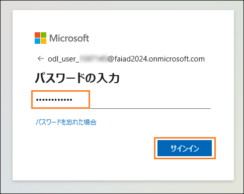
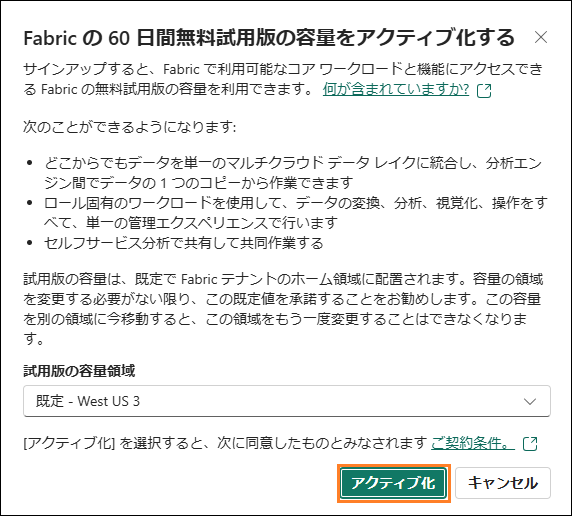
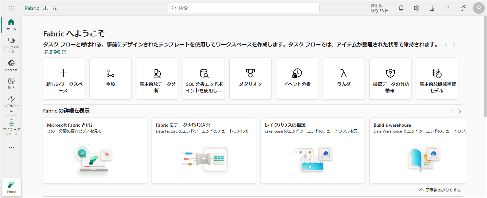
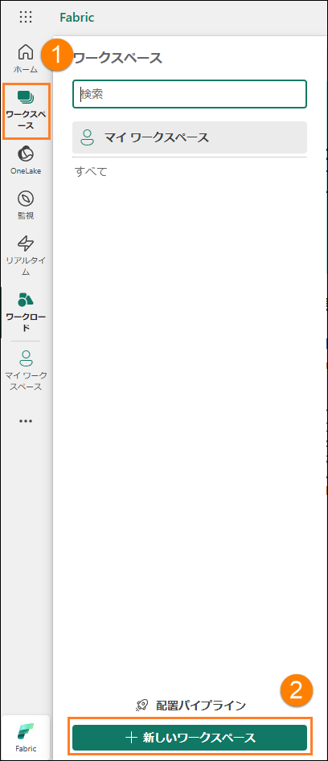
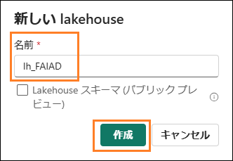
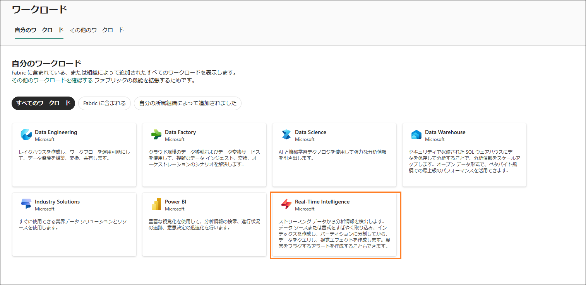
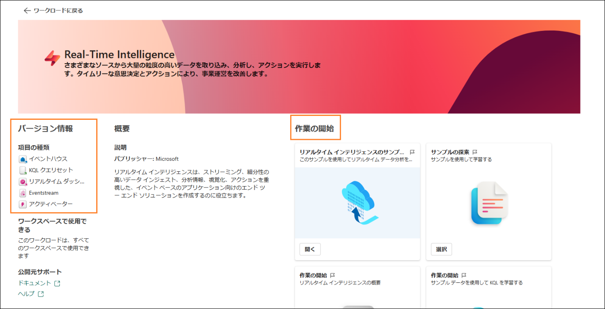
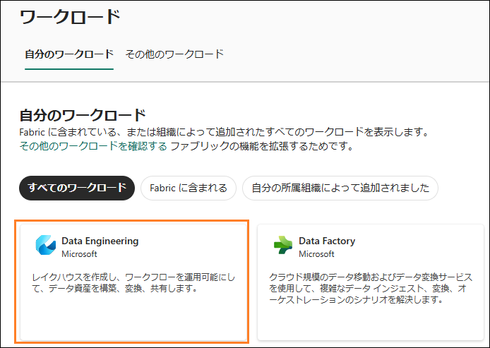
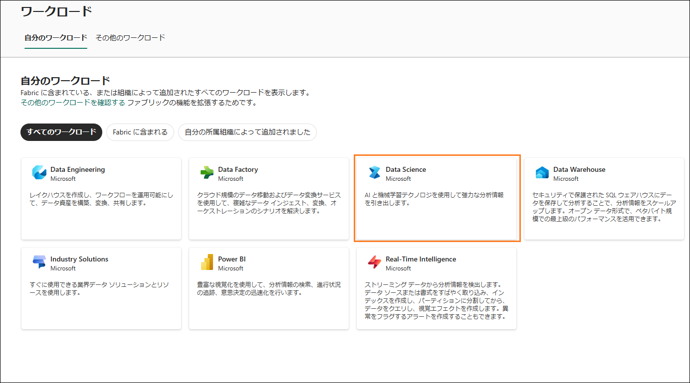
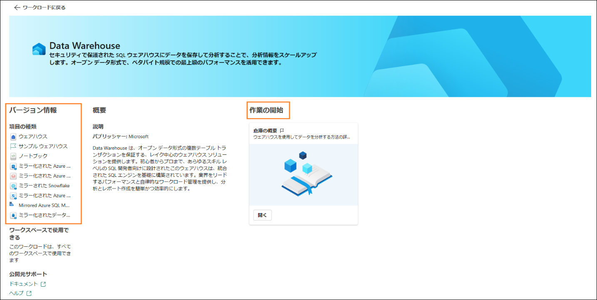

# Microsoft Fabric Analyst in a Day - ラボ 2

# 目次

- 概要
- Fabric ライセンス
    - タスク 1: Microsoft Fabric 試用版ライセンスを有効にする
- Fabric ワークスペース
    - タスク 2: Fabric ワークスペースを作成する
    - タスク 3: レイクハウスを作成する
- Fabric のエクスペリエンスの概要
    - タスク 4: Data Factory のエクスペリエンス
    - タスク 5: Industry Solutions のエクスペリエンス
    - タスク 6: Real-Time Intelligence エクスペリエンス
    - タスク 7: Data Engineering のエクスペリエンス
    - タスク 8: Data Science のエクスペリエンス
    - タスク 9: Data Warehouse のエクスペリエンス
- 参考資料

# 概要

今日は、Microsoft Fabric
のさまざまな主要機能について学習します。この入門ワークショップでは、Fabric
で利用できる製品のさまざまなエクスペリエンスやアイテムを紹介します。このワークショップを終了すると、レイクハウス、データフロー
(Gen2)、データ パイプライン、DirectLake などの使い方がわかります。

このラボを終了すると、次のことが学べます。

- Fabric ワークスペースの作成方法

- Lakehouse の作成方法

# Fabric ライセンス

## タスク 1: Microsoft Fabric 試用版ライセンスを有効にする

1. **ブラウザー**を開いて、[Microsoft Power BI Portal](https://app.powerbi.com) に移動します。ログイン ページが表示されます。

    **注:** ラボ環境を使用している場合は、直接サインインできることがあります。

    **注:** ラボ環境を使用しておらず、Power BI
    アカウントを既にお持ちの場合は、ブラウザーをプライベート
    モードやシークレット モードで使用することをお勧めします。

2. **ユーザー名**をコピーしてダイアログの**電子メール**
    フィールドに貼り付け、**送信**を選択します。

    - **メール/ユーザー名**: <inject key="AzureAdUserEmail"></inject>

      

3. **Microsoft Azure
    にサインインする**タブにログイン画面が表示されます。そこに次の**メール/ユーザー名**を入力し、**次へ**をクリックします。

    - メール/ユーザー名: <inject key="AzureAdUserEmail"></inject>

      

4. 次に、以下の**パスワード**を入力し、**サインイン**をクリックします。

    - パスワード: <inject key="AzureAdUserPassword"></inject>

      

5. 見慣れた **Power BI サービスのホーム ページ**が表示されます。

6. このラボは、Power BI
    サービスのレイアウトに精通していることを前提に進めます。不明な点がある場合は、講師に遠慮なく質問してください。

    現在、**マイ ワークスペース**が表示されています。Fabric
    のアイテムを操作するには、試用版ライセンスが必要になります。また、ワークスペースに
    Fabric
    ライセンスが割り当てられている必要があります。設定を始めましょう。

7. 画面右上の**ユーザー アイコン**を選択します。

8. **無料試用版**を選択します。

    

9. Microsoft Fabric
    の無料試用版にアップグレードするダイアログが開きます。**アクティ
    ブ化**を選択します。

    

10. Microsoft Fabric
    へのアップグレード成功のダイアログが開きます。**Fabric Home Page**
    を選択します。

    

11. **Microsoft** **Fabric のホーム ページ**が開きます。

    

# Fabric ワークスペース

## タスク 2: Fabric ワークスペースを作成する

1. 次は、Fabric
    ライセンスを使用してワークスペースを作成しましょう。左ナビゲーション
    バーから**ワークスペース (1) を選択**します。ダイアログが開きます。

2. ポップアップ メニューの下部に見つかる **+ 新しいワークスペース (2)**
    をクリックします

    

3. **ワークスペースの作成**ダイアログがブラウザーの右側に開きます。

4. **名前**フィールドに **FAIAD_<inject key="Deployment ID" enableCopy="false"/>** と入力します

    **注**: ワークスペース名は一意である必要があります。[名前]
    フィールドの下に、"この名前は使用できます" という緑色のチェック
    マークが表示されていることを確認してください。

5. 必要に応じて、ワークスペースの説明を入力できます。このフィールドはオプションです。

6. 詳細をクリックしてセクションを展開します。

    

7. **ライセンス モード**で、**試用版**が選択されていることを確認します
    (既定で選択されています)。

8. **適用**を選択して新しいワークスペースを作成します。

    

    新しくワークスペースが作成され、そのワークスペースが表示されます。さまざまなデータ
    ソースから Lakehouse にデータを取り込み、その Lakehouse
    からのデータを使用してモデルを構築し、レポートを作成します。最初のステップでは、レイクハウスを作成します。

## タスク 3: レイクハウスを作成する

1. 新しく作成したワークスペース **FAIAD_<inject key="Deployment ID" enableCopy="false"/>**
    で、左側のナビゲーション ウィンドウの **+ 新しい項目 (1)**
    ボタンを探します。ここからワークスペースへの新しい項目の作成を開始できます。

2. 検索ボックスに、**レイクハウス (2)**
    と入力し、検索結果から**レイクハウス (3)**
    オプションを選択します。これにより、ビッグ
    データの格納、クエリ、管理を行うための新しいレイクハウスを作成できます。

    

3. 新しいレイクハウスのダイアログが表示されます。[名前]
    テキストボックスに「lh_FAIAD」と入力します。

    **注**: ここでの lh
    はレイクハウスを指します。識別と検索を容易にするために、接頭辞として lh
    を付けています。

4. **作成**を選択します。

    

    しばらくすると Lakehouse が作成され、Lakehouse
    のインターフェイスが表示されます。**左パネル**の自分のワークスペースの下に
    Lakehouse
    のアイコンが表示されます。このアイコンをクリックすると、いつでも簡単にそのレイクハウスに移動できます。

    レイクハウス エクスプローラーには **Tables** と **Files**
    があります。レイクハウスで [Files] セクションの下に Azure Data Lake
    Storage Gen2
    のファイルを公開することも、データフローでデータをレイクハウスの
    [Tables]
    に読み込むこともできます。さまざまなオプションを利用できます。以降のラボでそのオプションをいくつか紹介します。

    

# Fabric のエクスペリエンスの概要

## タスク 4: Data Factory のエクスペリエンス

1. 画面左側のワークロード
    アイコンを選択します。ダイアログが開き、Fabric
    のエクスペリエンスの一覧が表示されます。このエクスペリエンスのリストには、Power
    BI、Data Factory、Industry Solutions、Real-Time Intelligence、Data
    Engineering、Data Science、Data Warehouse
    が含まれます。詳しく見ていきましょう。

    

2. **Data Factory** を選択します。

    

3. Data Factory のホーム ページが表示されます。以下は、Data Factory
    を効果的に使用するための手順を段階的に説明するように設計されたセクションの詳細な説明です。Dataflow
    Gen2 とは、次世代の Dataflow のことです。

    ### Data Factory とは

    Data Factory
    は、さまざまなソースからのデータを管理および整理するのに役立つツールです。これにより、データを収集、準備、変換して効率的に使用できます。初めての方でもエキスパートでも、Data
    Factory
    にはデータ変換をより簡単に、より効率的にするツールが用意されています。

    ### 項目の種類:

    a. **データフロー**:
    データフローは、データ変換のためのレシピのようなものです。
    データに適用できる 300
    種類以上の変換が提供されています。つまり、ニーズに合
    わせてデータをさまざまな方法でクリーニング、結合、変更できます。

    b. **パイプライン**: パイプラインは、データ
    プロセスの自動化に役立つワークフローです。特定の要件に合わせて調整可能な柔軟性のあるデータ
    ワークフローを作成できます。これにより、データを構造化された方法で管理および処理しやすくなります。

    c. **Azure Data Factory (プレビュー):** Azure Data Factory
    は、データ移動とデータ変換の
    オーケストレーションおよび自動化のためのデータ駆動型ワークフローを作成できる、クラウドベースのデータ統合サービスです。

    d. **Apache Airflow ジョブ (プレビュー):** Apache Airflow
    は、ワークフローをプログラムで作成、スケジュール、監視するために使用される、オープンソースのプラットフォームです。Data
    Factory でそれを使用して、複雑なデータ
    ワークフローを作成、スケジュール、管理できます。

    e. **コピー ジョブ (プレビュー):** コピー
    ジョブは、ソース間でデータをコピーできる機能です。さまざまなデータ
    ストア間でデータを移動する簡単で効率的な方法を提供します。

    f. **ミラー化されたデータベース (プレビュー):**
    バックアップ、テスト、または読み取り専用アクセス用にミラーリングされたバージョンのデータベースを作成する機能。

    ### 作業の開始:

    Data Factory の使用を開始するには、次の手順に従います。

    a. **Data Factory の使用方法を学びます:** このセクションは、Data
    Factory
    の使用を開始するのに役立ちます。このツールの有効な使い方についてのガイダンスが提供されます。

    b. **最初のデータフローを作成する:**
    最初のデータフローを作成する方法を学習できます。データフローは、ニーズに合わせてデータを変換するために不可欠です。

    c. **最初のデータ パイプラインを作成する:**
    このセクションでは、最初のデータ
    パイプラインの作成方法について説明します。パイプラインを使用すると、データ
    プロセスを効率的に自動化および管理できます。

    d. **Data Factory を監視する方法を学びます:** 監視は、データ
    プロセスを円滑に実行するために不可欠です。このセクションでは、Data
    Factory の活動を監視する方法について説明します。

    e. **データフローによるデータ変換の詳細:**
    このセクションは、データフローを使用してデータを効率的に変換する方法を理解するのに役立ちます。

    f. **GraphQL の最初の API を作成する:** GraphQL で API
    を使用することに関心がある場合は、使用を開始する方法についてこのセクションで確認できます。

    g. **最初のユーザー データ関数を作成する:**
    このセクションでは、ユーザー データの管理と変換に役立つユーザー
    データ関数の作成について説明します。

    

4. 画面の左上隅にある**ワークロードに戻る**をクリックします。このアクションによって主要なワークロードのページが表示され、そこで他のツールやセクションを探索できます。

    

## タスク 5: Industry Solutions のエクスペリエンス

1. **ワークロード** ページで、**Industry Solutions**
    をクリックして先に進みます。

    

2. **Industry Solutions** のホーム
    ページが表示されます。以下は、**Industry** **Solutions**
    を手順に従って効果的に使用できるように設計されたセクションの詳細な概要です。

    ### Industry Solutions とは

    Industry Solutions
    は、さまざまな業界向けのソリューションとリソースを提供する、Microsoft
    Fabric のすぐに使用できるデータ ソリューションです。Industry Solutions
    は、業界関連のデータ
    モデル、コネクタ、変換、レポート、その他の資産を使用して主要なビジネス
    シナリオを開始するのに役立ちます。

    ### 項目の種類:

    a. **持続可能性ソリューション:** 環境、社会、ガバナンス (ESG)
    に関するデータの取り込み、標準化、分析をサポートします。

    b. **小売ソリューション**:
    膨大なデータの管理、さまざまなソースのデータ統合、意思決定を加速させるリアルタイム分析の提供に役立ちます。小売業者は、在庫の最適化、顧客のセグメント化、売上予測、動的な価格、不正の検出に、これらのソリューションを使用できます。

    c. **医療ソリューション**:
    医療データを分析に適した形式に効率的に変換するという重要なニーズに対処し、顧客が価値を実現するまでの時間を短縮するように戦略的に設計されています。

    ### 作業の開始:

    Industry Solutions の使用を開始するには、次の手順に従います。

    a. **医療データ ソリューションについて学ぶ**: [詳細]
    ボタンをクリックして医療データ
    ソリューションについて読み、プロジェクトでどのように使用できるのかを理解します。

    b. **医療データ ソリューションを展開する**: [展開]
    ボタンをクリックして、医療データ
    ソリューションの展開とプロジェクトへの実装を開始します。

    c. **持続可能性ソリューションについて学ぶ**: [詳細]
    ボタンをクリックして持続可能性ソリューションについて読み、プロジェクトでどのように使用できるのかを理解します。

    d. **持続可能性ソリューションを展開する**: [展開]
    ボタンをクリックして、持続可能性ソリューションの展開とプロジェクトへの実装を開始します。

    e. **小売ソリューションについて学ぶ**: [詳細]
    ボタンをクリックして小売ソリューションについて読み、プロジェクトでどのように使用できるのかを理解します。

    f. **小売ソリューションを展開する**: [展開]
    ボタンをクリックして、小売ソリューションの展開とプロジェクトへの実装を開始します。

3. 画面の左上隅にある [ワークロードに戻る]
をクリックします。このアクションによって主要なワークロードのページが表示され、そこで他のツールやセクションを探索できます。

    

## タスク 6: Real-Time Intelligence エクスペリエンス

1. **ワークロード** ページで、**Real-Time Intelligence**
    をクリックして先に進みます。

    

2. **Real-Time Intelligence** のホーム
    ページが表示されます。以下は、**Real-Time Intelligence**
    を手順に従って効果的に使用できるように設計されたセクションの詳細な概要です。

    ### Real-Time Intelligence とは

    Real-Time Intelligence
    は、さまざまなソースからの大量で粒度の高いデータを管理および分析するのに役立つツールです。リアルタイムでデータを取り込んで分析し、アクションを実行できるため、タイムリーな意思決定と対処によって事業運営を改善できます。

    ### 項目の種類:

    a. **イベントハウス**: 1 つまたは複数の KQL
    データベースのワークスペースを作成するために使います。これはプロジェクト間で共有できます。

    b. **KQL クエリセット**:
    データに対してクエリを実行し、共有可能なテーブルとビジュアルを生成するために使用されます。

    c. **リアルタイム ダッシュボード**: データ
    インジェストから数秒以内にリアルタイム
    ダッシュボードを視覚化するために使用されます。

    d. **Eventstream**: リアルタイム イベント
    ストリームのキャプチャ、変換、ルーティングに使用されます。

    e. **アクティベーター**: データセット、クエリ、イベント
    ストリームのパターンを監視するために使用されます。

    ### 作業の開始:

    Real-Time Intelligence の使用を開始するには、次の手順に従います。

    a. **Real-Time Intelligence サンプルを探索する**: [開く]
    ボタンをクリックして、サンプルを使用してリアルタイム
    データ分析を探索します。

    b. **サンプルの探索**: [選択]
    ボタンをクリックし、サンプルを使用して Real-Time Intelligence
    について学びます。

    c. **Real-Time Intelligence の概要**: [開く]
    ボタンをクリックして、Real-Time Intelligence
    の概要を表示し、このツールの効果的な使用を開始します。

    d. **サンプル データを使用して KQL を学習する**: [開く]
    ボタンをクリックし、サンプル データを使用して KQL について学びます。

    e. **リアルタイム ハブとは**: [開く]
    ボタンをクリックして、リアルタイム
    ハブとは何か、どのような使い方ができるかを学びます。

    f. **サンプルの Activator を探索する**: [開く]
    ボタンをクリックし、サンプルの Activator を使用して Real-Time
    Intelligence の機能について理解します。

    g. **Activator の使用を開始する**: [開く]
    ボタンをクリックして、Activator
    の概念について概要を確認し、ツールの効果的な使用を開始します。

    

3. 画面の左上隅にある [ワークロードに戻る]
    をクリックします。このアクションによって主要なワークロードのページが表示され、そこで他のツールやセクションを探索できます。

    

## タスク 7: Data Engineering のエクスペリエンス

1. **ワークロード** ページで、**Data Engineering**
    をクリックして先に進みます。

    

2. **Data Engineering** のホーム ページが表示されます。以下は、**Data**
    **Engineering**
    を手順に従って効果的に使用できるように設計されたセクションの詳細な概要です。

    ### Data Engineering とは

    Data Engineering
    は、大量のデータを収集、保存、処理、分析するためのインフラストラクチャとシステムの設計、構築、管理を支援するツールです。これを使用すると、レイクハウスを作成してワークフローを運用化し、データ資産を構築、変換、共有できるようになります。

    ### 項目の種類:

    a. **レイクハウス**:
    クリーニング、クエリ実行、レポート作成、共有対象のビッグ
    データを格納するために使用されます。

    b. **ノートブック**: Python、R、Scala
    などのさまざまな言語を使用した、データの取り込み、準備、分析、その他のデータ関連タスクに使用されます。

    c. **環境**: 共有ライブラリ、Spark
    コンピューティングの設定、ノートブックと Spark
    ジョブ定義のリソースを設定するために使用されます。

    d. **Spark ジョブ定義**: Apache
    ジョブの定義、スケジュール、管理に使用されます。

    e. **データ パイプライン**: データ
    ソリューションのオーケストレーションに使用されます。

    f. **GraphQL 用 API**: 複数のデータ ソースに対してクエリを実行する
    API です。

    g. **ノートブックのインポート**: ローカル
    マシンからノートブックをインポートするために使用されます。

    ### 作業の開始:

    Data Engineering の使用を開始するには、次の手順に従います。

    a. **サンプルの探索**: [選択]
    ボタンをクリックし、サンプルを使用して Data Engineering
    について学びます。

    b. **レイクハウスとは:** [開く]
    ボタンをクリックして、レイクハウスについて学び、また、どのような使い方ができるかを学びます。

    c. **レイクハウスのデータを体験する**: [開く]
    ボタンをクリックし、レイクハウスを使用した Data Engineering
    の使用を開始します。

    d. **Spark ジョブ定義の使用を開始する**: [開く]
    ボタンをクリックして、データ処理に Spark
    ジョブ定義を使用する方法を学びます。

    e. **ノートブックを開発して実行する**: [開く]
    ボタンをクリックし、データ分析用のノートブックを開発して実行する方法を学びます。

    f. **NotebookUtils の使用方法**: [開く]
    ボタンをクリックして、拡張データ分析にNotebookUtils
    を使用する方法を学びます。

    g. **レイクハウス用にノートブックを活用する**: [開く]
    ボタンをクリックして、レイクハウス用にノートブックを活用する方法を学びます。

    h. **レイクハウス用にデータセットを活用する**: [開く]
    ボタンをクリックして、レイクハウス用にデータセットを活用する方法を学びます。

    i. **最初のユーザー データ関数を作成する**: [開く]
    ボタンをクリックして、ユーザー データ関数の作成方法を学びます。

    j. **GraphQL の初めての API を作成する**: [開く]
    ボタンをクリックして、GraphQL 用の API を作成する方法を学びます。

    

3. 画面の左上隅にある**ワークロードに戻る**をクリックします。このアクションによって主要なワークロードのページが表示され、そこで他のツールやセクションを探索できます。

    

## タスク 8: Data Science のエクスペリエンス

1. **ワークロード** ページで、**Data** **Science**
    をクリックして先に進みます。

    

2. **Data Science** のホーム ページが表示されます。以下は、**Data
    Science**
    を手順に従って効果的に使用できるように設計されたセクションの詳細な概要です。

    ### Data Science とは

    Data Science は、AI
    と機械学習の技術を使用して高度な分析情報を活用するのに役立つツールです。これにより、本格的なデータ
    サイエンス ワークフローの実行と、データ
    エンリッチメントおよびビジネス分析情報のための AI
    の活用を支援するように設計された AI ツールが提供されます。

    ### 項目の種類:

    a. **ML モデル**: 機械学習モデルの作成に使用されます。

    b. **実験**: 複数のモデルの作成、実行、開発の追跡に使用されます。

    c. **ノートブック**:
    データを調査し、機械学習ソリューションを構築するために使
    用されます。

    d. **環境**: 共有ライブラリ、Spark
    コンピューティングの設定、ノートブックと Spark
    ジョブ定義のリソースを設定するために使用されます。

    e. **AI スキル**: 独自の生成 AI
    エクスペリエンスを構築するために使用されます。

    f. **Python Notebook**: ローカル マシンから Python
    ノートブックをインポートする
    ために使用されます。

    ### 作業の開始:

    Data Science の使用を開始するには、次の手順に従います。

    a. **サンプルの探索**: [選択]
    ボタンをクリックし、サンプルを使用して Data Science
    について学びます。

    b. **ML モデルの使用を開始する**: [開く]
    ボタンをクリックして、機械学習モデルの使用を開始する方法を学びます。

    c. **ML 実験の使用を開始する**: [開く]
    ボタンをクリックして、Machine Learning 実験を実施する方法を学びます。

    d. **ノートブックを開発して実行する**: [開く]
    ボタンをクリックし、データ分析用のノートブックを開発して実行する方法を学びます。

    e. **ノートブックの使用を開始する**: [開く]
    ボタンをクリックして、ノートブックの使用を開始する方法を学びます。

    

3. 画面の左上隅にある**ワークロードに戻る**をクリックします。このアクションによって主要なワークロードのページが表示され、そこで他のツールやセクションを探索できます。

    

## タスク 9: Data Warehouse のエクスペリエンス

1. **ワークロード** ページで、**Data Warehouse**
    をクリックして先に進みます。

    

2. **Data Warehouse** のホーム ページが表示されます。以下は、**Data
    Warehouse**
    を手順に従って効果的に使用できるように設計されたセクションの詳細な概要です。

    ### Data Warehouse とは

    Data Warehouse は、セキュリティで保護された SQL
    ウェアハウスにデータを格納して分析するのに役立つツールです。これにより、トップクラスのパフォーマンスをペタバイト規模のオープン
    データ形式で利用して、分析情報をスケールアップすることができます。

    ### 項目の種類:

    a. **ウェアハウス**: データ ウェアハウスの作成に使用されます。

    b. **サンプル ウェアハウス**:
    構成済みのデータセットやモデルを使用して、データ
    ウェアハウジングの機能を確認およびテストするのに使用されます。

    c. **データ パイプライン**: データ
    ソリューションのオーケストレーションに使用されます。

    d. **ノートブック**:
    対話型のデータ分析および可視化タスクの作成や共有に使用されます。

    e. **ミラー化された Azure SQL Database**: Azure SQL Database
    をミラーリングするた
    めに使用されます。

    f. **ミラー化された Azure Databricks カタログ**:
    統合や分析の強化のために Azure Databricks
    からデータをミラーリングするのに使用されます。

    g. **ミラーされた Snowflake**: Snowflake
    データベースをミラーリングするために使用されます。

    h. **ミラー化された Azure Cosmos DB**: Azure Cosmos DB
    をミラーリングするために使用されます。

    i. **Mirrored Azure SQL Managed Database**: 高可用性とディザスター
    リカバリーのために Azure SQL Managed Database
    をミラーリングするのに使用されます。

    j. **ミラーリングされたデータベース**: 高可用性とディザスター
    リカバリーのためにデータベースを複製するのに使用されます。

    ### 作業の開始:

    Data Warehouse の使用を開始するには、次の手順に従います。

    a. **ウェアハウスの使用を開始する**: [開く]
    ボタンをクリックして、ウェアハウスを使用してデータを分析する方法を学びます。

    

1. 画面の左上隅にある**ワークロードに戻る**をクリックします。このアクションによって主要なワークロードのページが表示され、そこで他のツールやセクションを探索できます。

    

    このラボでは、Fabric インターフェースを調べ、Fabric ワークスペースと Lakehouse を作成しました。次のラボでは、Lakehouse のショートカットを使用して ADLS Gen2 データに接続する方法と、ビューを使用してこのデータを変換する方法を学習します。

# 参考資料

Fabric Analyst in a Day (FAIAD) では、Microsoft Fabric
で使用できる主要な機能の一部をご紹介します。サービスのメニューにあるヘルプ
(?) セクションには、いくつかの優れたリソースへのリンクがあります。

Microsoft Fabric
の次のステップに役立つリソースをいくつか以下に紹介します。

- ブログ記事で [Microsoft Fabric の GA
    に関するお知らせ](https://aka.ms/Fabric-Hero-Blog-Ignite23)の全文を確認する

- [ガイド付きツアー](https://aka.ms/Fabric-GuidedTour)を通じて Fabric
    を探索する

- [Microsoft Fabric
    の無料試用版](https://aka.ms/try-fabric)にサインアップする

- [Microsoft Fabric の Web
    サイト](https://aka.ms/microsoft-fabric)にアクセスする

- [Fabric
    の学習モジュール](https://aka.ms/learn-fabric)で新しいスキルを学ぶ

- [Fabric の技術ドキュメント](https://aka.ms/fabric-docs)を参照する

- [Fabric 入門編の無料の
    e-book](https://aka.ms/fabric-get-started-ebook) を読む

- [Fabric
    コミュニティ](https://aka.ms/fabric-community)に参加し、質問の投稿やフィードバックの共有を行い、
    他のユーザーから学びを得る

より詳しい Fabric
エクスペリエンスのお知らせに関するブログを参照してください。

- [Fabric の Data Factory
    エクスペリエンスに関するブログ](https://aka.ms/Fabric-Data-Factory-Blog) 

- [Fabric の Synapse Data Engineering
    エクスペリエンスに関するブログ](https://aka.ms/Fabric-DE-Blog) 

- [Fabric の Synapse Data Science
    エクスペリエンスに関するブログ](https://aka.ms/Fabric-DS-Blog) 

- [Fabric の Synapse Data Warehousing
    エクスペリエンスに関するブログ](https://aka.ms/Fabric-DW-Blog) 

- [Fabric の Synapse Real-Time Analytics
    エクスペリエンスに関するブログ](https://aka.ms/Fabric-RTA-Blog)

- [Power BI のお知らせに関するブログ](https://aka.ms/Fabric-PBI-Blog)

- [Fabric の Data Activator
    エクスペリエンスに関するブログ](https://aka.ms/Fabric-DA-Blog) 

- [Fabric
    の管理とガバナンスに関するブログ](https://aka.ms/Fabric-Admin-Gov-Blog)

- [Fabric の OneLake
    に関するブログ](https://aka.ms/Fabric-OneLake-Blog)

- [Dataverse と Microsoft Fabric
    の統合に関するブログ](https://aka.ms/Dataverse-Fabric-Blog)

© 2025 Microsoft Corporation.All rights reserved.

このデモ/ラボを使用すると、次の条件に同意したことになります。

このデモ/ラボで説明するテクノロジまたは機能は、ユーザーのフィードバックを取得し、学習エクスペリエンスを提供するために、Microsoft
Corporation によって提供されます。
ユーザーは、このようなテクノロジおよび機能を評価し、Microsoft
にフィードバックを提供するためにのみデモ/ラボを使用できます。それ以外の目的には使用できません。このデモ/ラボまたはその一部を、変更、コピー、配布、送信、表示、実行、再現、発行、ライセンス、著作物の作成、転送、または販売することはできません。

複製または再頒布のために他のサーバーまたは場所にデモ/ラボ
(またはその一部)
をコピーまたは複製することは明示的に禁止されています。

このデモ/ラボは、前に説明した目的のために複雑なセットアップまたはインストールを必要としないシミュレーション環境で潜在的な新機能や概念などの特定のソフトウェア
テクノロジ/製品の機能を提供します。このデモ/ラボで表されるテクノロジ/概念は、フル機能を表していない可能性があり、最終バージョンと動作が異なることがあります。また、そのような機能や概念の最終版がリリースされない場合があります。物理環境でこのような機能を使用するエクスペリエンスが異なる場合もあります。

**フィードバック**。このデモ/ラボで説明されているテクノロジ、機能、概念に関するフィードバックを
Microsoft
に提供する場合、ユーザーは任意の方法および目的でユーザーのフ
ィードバックを使用、共有、および商品化する権利を無償で Microsoft
に提供するものとします。また、ユーザーは、フィードバックを含む
Microsoft
のソフトウェアまたはサービスの特定部分を使用したり特定部分とインターフェイスを持ったりする製品、テクノロジ、サービスに必要な特許権を無償でサード
パーティに付与します。ユーザーは、フィードバックを含めるために
Microsoft がサード
パーティにソフトウェアまたはドキュメントをライセンスする必要があるライセンスの対象となるフィードバックを提供しません。これらの権限は、本契約の後も存続します。

Microsoft Corporation
は、明示、黙示、または法律上にかかわらず、商品性のすべての保証および条件、特定の目的、タイトル、非侵害に対する適合性など、デモ/ラボに関するすべての保証および条件を拒否します。Microsoft
は、デモ/ラボから派生する結果、出力の正確さ、任意の目的に対するデモ/ラボに含まれる情報の適合性に関して、いかなる保証または表明もしません。

**免責事項**

このデモ/ラボには、Microsoft Power BI
の新機能と機能強化の一部のみが含まれてい
ます。一部の機能は、製品の将来のリリースで変更される可能性があります。このデ
モ/ラボでは、新機能のすべてではなく一部について学習します。
