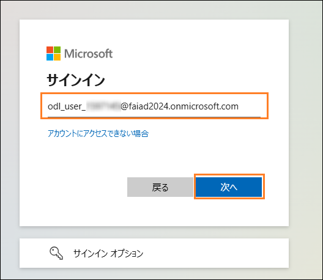
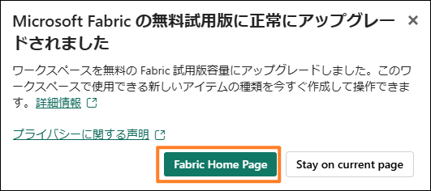
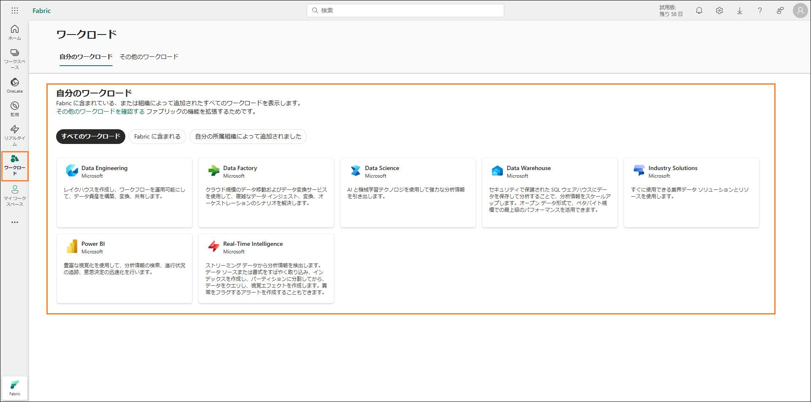
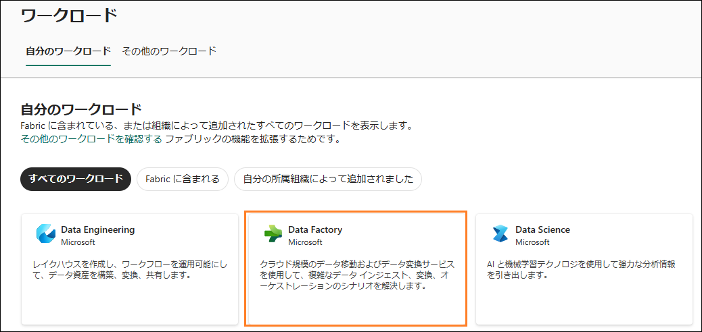
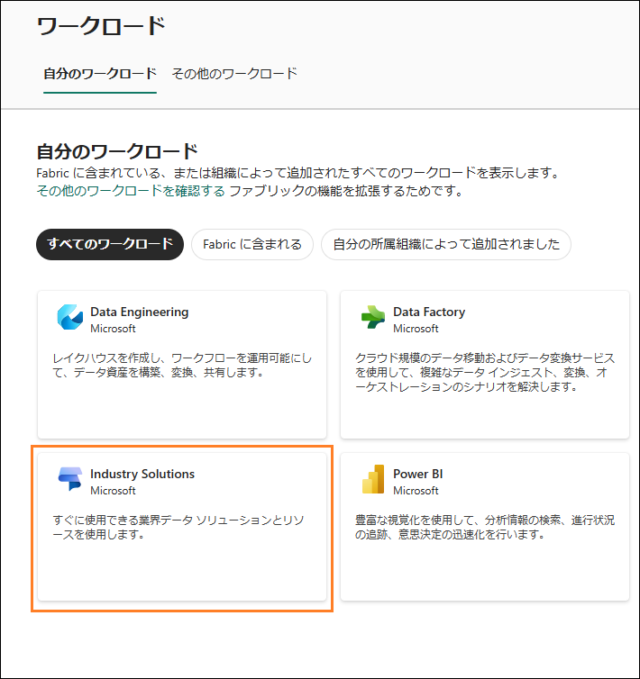
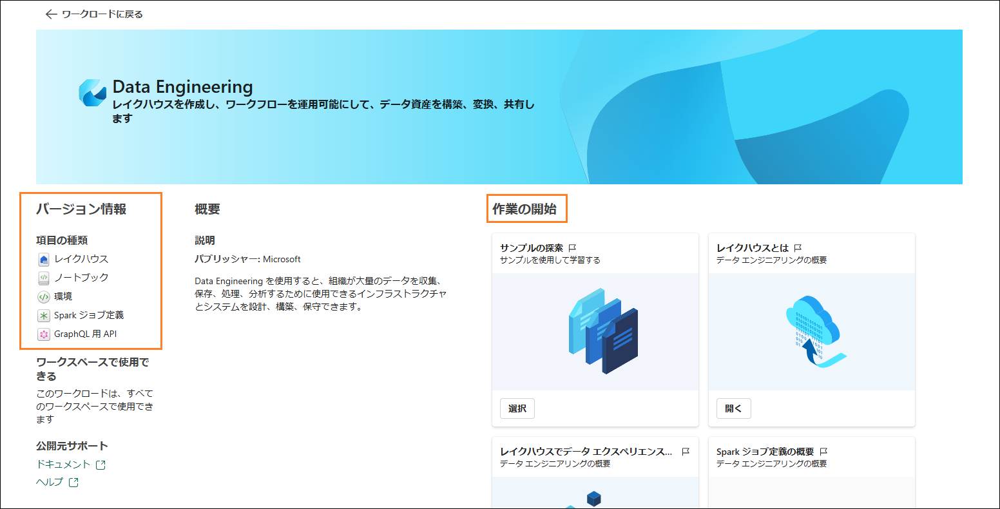
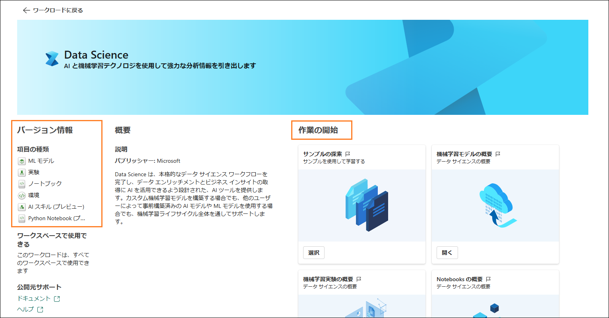
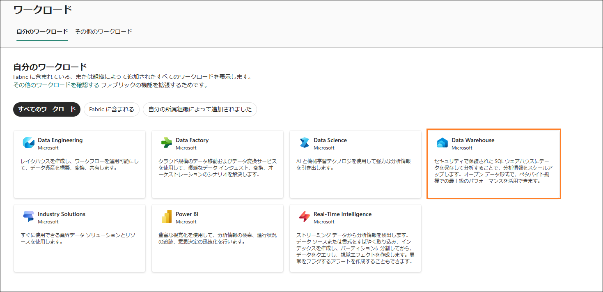

# Microsoft Fabric - Fabric Analyst in a Day - ラボ 2

- 目次
- 概要
- Fabric ライセンス
    - タスク 1: Microsoft Fabric 試用版ライセンスを有効にする
- Fabric のエクスペリエンスの概要
    - タスク 2: Data Factory のエクスペリエンス
    - タスク 3: Industry Solutions のエクスペリエンス
    - タスク 4: Real-Time Intelligence エクスペリエンス
    - タスク 5: Data Engineering のエクスペリエンス
    - タスク 6: Data Science のエクスペリエンス
    - タスク 7: Data Warehouse のエクスペリエンス
- Fabric ワークスペース
    - タスク 8: Fabric ワークスペースを作成する
    - タスク 9: レイクハウスを作成する
- リファレンス	17

# 概要

今日は、Microsoft Fabric
のさまざまな主要機能について学習します。この入門ワークショップでは、Fabric
で利用できる製品のさまざまなエクスペリエンスやアイテムを紹介します。このワークショップを終了すると、レイクハウス、Dataflow
Gen2、データ パイプライン、DirectLake などの使い方がわかります。

このラボを終了すると、次のことが学べます。

- Fabric ワークスペースの作成方法

- Lakehouse の作成方法

# Fabric ライセンス

### タスク 1: Microsoft Fabric 試用版ライセンスを有効にする

1.  **ブラウザー**を開いて、<https://app.powerbi.com/>
    に移動します。ログイン ページが表示されます。

    **注:**
    ラボ環境を使用している場合は、直接サインインできることがあります。

    **注:** ラボ環境を使用しておらず、Power BI
    アカウントを既にお持ちの場合は、ブラウザーをプライベート
    モードやシークレット モードで使用することをお勧めします。

2.  **環境変数**タブ (\[ラボ ガイド\] タブの横)
    で確認できる**ユーザー名**を**電子メール**として入力して、**送信**をクリックします。

    

3.  **パスワード**画面が表示されます。**環境変数**タブ (\[ラボ ガイド\]
    タブの横)
    で確認できる、講師から提供された**パスワード**を入力します。

4.  **サインイン**をクリックし、プロンプトに従って Fabric
    にサインインします。

    

5.  見慣れた **Power BI サービスのホーム ページ**が表示されます。

6.  このラボは、Power BI
    サービスのレイアウトに精通していることを前提に進めます。不明な点がある場合は、講師に遠慮なく質問してください。

現在、**マイ ワークスペース**が表示されています。Fabric
のアイテムを操作するには、試用版ライセンスが必要になります。また、ワークスペースに
Fabric
ライセンスが割り当てられている必要があります。設定を始めましょう。

7.  画面右上の**ユーザー** **アイコン**を選択します。

8.  **無料試用版**を選択します。

    

9.  Microsoft Fabric の無料試用版へのアップグレード
    ダイアログが開きます。**無料体験する**を選択します。

    

10. Microsoft Fabric
    に正常にアップグレードされたことを示すダイアログが開きます。**Fabric Home
    Page** を選択します。

    

11. **Microsoft** **Fabric のホーム ページ**が開きます。

    

# Fabric のエクスペリエンスの概要

### タスク 2: Data Factory のエクスペリエンス

1.  画面左下の **Microsoft Fabric** (Fabric エクスペリエンス セレクター)
    アイコンを選択します。ダイアログが開き、Fabric
    のエクスペリエンスの一覧が表示されます。このエクスペリエンスのリストには、Power
    BI、Data Factory、Industry Solutions、Real-Time Intelligence、Data
    Engineering、Data Science、および Data Warehouse
    が含まれます。詳しく見て行きましょう。

2.  **Data Factory** を選択します。

    

3.  **Data Factory のホーム** **ページ**が表示されます。このページは 4
    つのメイン セクションに分かれています。

    a.  **ワークスペースの作成:** このセクションでは、タスク
        フローというあらかじめデザインされたテンプレートを使用して、ワークスペースを作成する方法について説明します。これにより、Microsoft
        Fabric でアイテムを整理された状態に保つことができます。

    b.  **推奨:** Data Factory で利用できるアイテムの一覧 (Dataflow
        Gen2、データ パイプライン、データ ワークフロー、および GraphQL
        用 API) が表示されます。

    i.  Dataflow Gen2 とは、次世代の Dataflow のことです。

    ii. データ
            パイプラインはデータのオーケストレーションに使用されます。

    iii. データ ワークフローはワークフロー オーケストレーション
             マネージャーです。

    iv. GraphQL 用 API は、複数のデータ
            ソースに対してクエリを実行する API です。

    c.  **詳細情報**: このセクションからクイック
        スタート学習ドキュメントにアクセスできます。

    d.  **クイック アクセス**:
        このセクションには、最近使用したアイテムやお気に入りのアイテムの一覧が表示されます。

    

### タスク 3: Industry Solutions のエクスペリエンス

1.  画面左下にある **Fabric エクスペリエンス セレクター アイコン**
    (現在は Data Factory に設定されています) を選択します。Fabric
    エクスペリエンスのダイアログが開きます。

2.  ダイアログで **Industry Solutions** を選択します。**Industry
    Solutions ホーム ページ**が表示されます。Microsoft Fabric
    は業界に特化したデータ
    ソリューションを提供し、その堅牢なプラットフォームはデータ管理、分析、意思決定に役立ちます。これらのデータ
    ソリューションを利用すると、さまざまな業界が直面する特有の課題に対処して企業の業務を最適化し、さまざまなソースのデータを統合して効果的に分析できます。4
    つのセクションはこれまでのエクスペリエンスと似ていることに注意してください。\[推奨\]
    セクションには次のアイテムがあります。

    a.  **持続可能性ソリューション:** 環境、社会、ガバナンス (ESG)
        に関するデータの、\
        取り込み、標準化、分析をサポートします。

    b.  **小売ソリューション:**
        膨大なデータの管理、さまざまなソースのデータ統合、意思決定を加速させるリアルタイム分析の提供に役立ちます。小売業者は、在庫の最適化、顧客のセグメント化、売上予測、動的な価格、不正の検出に、これらのソリューションを使用できます。

    c.  **医療データ ソリューション:**
        医療データを分析に適した形式に効率的に変換するという重要なニーズに対処し、顧客が価値を実現するまでの時間を短縮するように戦略的に設計されています。

    

### タスク 4: Real-Time Intelligence エクスペリエンス

1.  画面の左下にある **Fabric エクスペリエンス セレクター** **アイコン**
    (現在は Industry Solutions に設定されています) を選択します。Fabric
    エクスペリエンスのダイアログが開きます。

2.  **Real-Time Intelligence** を選択します。**Real-Time Intelligence
    ホーム ページ**が表示されます。ここも 4
    つのセクションに分かれています。\[推奨\]
    セクションには次のアイテムがあります。

    a.  **イベントハウス:**
        データベースのワークスペースを作成するために使用されます。これはプロジェクト間で共有できます。

    b.  **KQL クエリセット:**
        データに対してクエリを実行し、共有可能なテーブルとビジュアルを生成するために使用されます。

    c.  **リアルタイム ダッシュボード:** データ
        インジェストから数秒以内にリアルタイム
        ダッシュボードを視覚化するために使用されます。

    d.  **Eventstream:** リアルタイム イベント
        ストリームのキャプチャ、変換、ルーティングに使用されます。

    e.  **Activator:** データセット、クエリ、イベント
        ストリームのパターンを監視するために使用されます。

    

### タスク 5: Data Engineering のエクスペリエンス

1.  画面の左下にある Fabric **エクスペリエンス セレクター アイコン**
    (現在は Real-Time Intelligence に設定されています)
    を選択します。Fabric エクスペリエンスのダイアログが開きます。

2.  **Data Engineering** を選択します。**Data Engineering のホーム
    ページ**が表示されます。このページも 4 つのメイン
    セクションに分かれています。\[推奨\]
    セクションには次のアイテムがあります。

    a.  **レイクハウス:**
        クリーニング、クエリ実行、レポート作成、共有対象のビッグ
        データを格納するために使用されます。

    b.  **ノートブック:** Python、R、Scala
        などのさまざまな言語を使用した、データの取り込み、準備、分析、その他のデータ関連タスクに使用されます。

    c.  **環境:** 共有ライブラリ、Spark
        コンピューティングの設定、ノートブックと Spark
        ジョブ定義のリソースを設定するために使用されます。

    d.  **Spark Job Definition:** Apache
        ジョブの定義、スケジュール、管理に使用されます。

    e.  **Data pipeline:** データ
        ソリューションのオーケストレーションに使用されます。

    f.  **GraphQL 用 API:** 複数のデータ ソースに対してクエリを実行する
        API です。

    g.  **Import notebook:** ローカル
        マシンからノートブックをインポートするために使用されます。

    

### タスク 6: Data Science のエクスペリエンス

1.  画面の左下にある **Fabric エクスペリエンス セレクター** **アイコン**
    (現在は Data Engineering に設定されています) を選択します。Fabric
    エクスペリエンスのダイアログが開きます。

2.  **Data Science** を選択します。**Data Science のホーム
    ページ**が表示されます。ここも 4
    つのセクションに分かれています。\[推奨\]
    セクションには次のアイテムがあります。

    a.  **ML モデル:** 機械学習モデルの作成に使用されます。

    b.  **実験:** 複数のモデルの作成、実行、開発の追跡に使用されます。

    c.  **ノートブック:**
        データを調査し、機械学習ソリューションを構築するために使用されます。

    d.  **環境:** 共有ライブラリ、Spark
        コンピューティングの設定、ノートブックと Spark
        ジョブ定義のリソースを設定するために使用されます。

    e.  **AI スキル:** 独自の生成 AI
        エクスペリエンスを構築するために使用されます。

    f.  **Import notebook:** ローカル
        マシンからノートブックをインポートするために使用されます。

**注:** ノートブック、環境、データ
パイプラインなどのアイテムは、これらの各エクスペリエンスで関連しているので、複数のエクスペリエンスで使用できます。

### タスク 7: Data Warehouse のエクスペリエンス

1.  画面の左下にある **Fabric エクスペリエンス セレクター** **アイコン**
    (現在は Data Science に設定されています) を選択します。Fabric
    エクスペリエンスのダイアログが開きます。

2.  **Data Warehouse** を選択します。**Data Warehouse のホーム
    ページ**が表示されます。ここも 3
    つのセクションに分かれています。\[新規\]
    セクションには次のアイテムがあります。

    a.  **ウェアハウス:** Data Warehouse の作成に使用されます。

    b.  **サンプル ウェアハウス:**
        構成済みのデータセットやモデルを使用して、データ
        ウェアハウジングの機能を確認およびテストするのに使用されます。

    c.  **Data pipeline:** データ
        ソリューションのオーケストレーションに使用されます。

    d.  **ノートブック:**
        対話型のデータ分析および可視化タスクの作成や共有に使用されます

    e.  **ミラーリングされた Azure SQL Database:** Azure SQL Database
        をミラーリングするために使用されます。

    f.  **ミラーリングされた Azure Databricks カタログ:**
        統合や分析の強化のために Azure Databricks
        からデータをミラーリングするのに使用されます。

    g.  **ミラーリングされる Snowflake:** Snowflake
        データベースをミラーリングするために使用されます。

    h.  **ミラーリングされる Azure Cosmos DB:** Azure Cosmos DB
        をミラーリングするために使用されます。

    i.  **ミラーリングされた Azure SQL Managed Database:**
        高可用性とディザスター リカバリーのために Azure SQL Managed
        Database をミラーリングするのに使用されます。

    j.  **ミラーリングされたデータベース:** 高可用性とディザスター
        リカバリーのためにデータベースを複製するのに使用されます。

    

# Fabric ワークスペース

### タスク 8: Fabric ワークスペースを作成する

1.  次は、Fabric
    ライセンスを使用してワークスペースを作成しましょう。左ナビゲーション
    バーから**ワークスペース**を選択します。ダイアログが開きます。

2.  ポップアップ メニューの下部に見つかる **+
    新しいワークスペース**をクリックします。

    

3.  **ワークスペースの作成**ダイアログがブラウザーの右側に開きます。

4.  **名前**フィールドに **FAIAD\_\<username\>** と入力します。

**注:**
ワークスペース名は一意である必要があります。ただし、自分のワークスペース名は異なるものにする必要があります。\[名前\]
フィールドの下に、**この名前は使用できます**という緑色のチェック
マークが表示されていることを確認してください。

5.  必要に応じて、ワークスペースの**説明**を入力できます。このフィールドはオプション\
    です。

6.  **詳細**をクリックしてセクションを展開します。

    

7.  **ライセンス モード**で、**試用版**が選択されていることを確認します
    (既定で選択されています)。

8.  **適用**を選択して新しいワークスペースを作成します。

    

新しくワークスペースが作成され、そのワークスペースが表示されます。さまざまなデータ
ソースからレイクハウスにデータを取り込み、そのレイクハウスからのデータを使用してモデルを構築し、レポートを作成します。最初のステップでは、レイクハウスを作成します。

### タスク 9: レイクハウスを作成する

1.  画面の左下にある **Fabric エクスペリエンス セレクター アイコン**
    (現在は Data Warehouse に設定されています) を選択します。Fabric
    エクスペリエンスのダイアログが開きます。

2.  **Data Engineering** を選択すると、Data Engineering のホーム
    ページが表示されます。

    

3.  **レイクハウス**を選択します。

    

4.  \[新しい lakehouse\] ダイアログが開きます。\[名前\]
    テキストボックスに **lh_FAIAD** と入力します。

**注:** ここでの lh は Lakehouse
を指します。識別と検索を容易にするために、接頭辞として lh
を付けています。

5.  **作成**を選択します。

    

しばらくすると Lakehouse が作成され、Lakehouse
のインターフェイスが表示されます。

**左パネル**の自分のワークスペースの下に Lakehouse
のアイコンが表示されます。このアイコンをクリックすると、いつでも簡単にその
Lakehouse に移動できます。

Lakehouse エクスプローラーには **Tables** と **Files**
があります。レイクハウスで \[Files\] セクションの下に Azure Data Lake
Storage Gen2 のファイルを公開することも、データフローでデータを
Lakehouse の \[Tables\]
に読み込むこともできます。さまざまなオプションを利用できます。以降のラボでそのオプションをいくつか紹介します。

このラボでは、Fabric インターフェイスの中を探索し、Fabric
ワークスペースと Lakehouse
を作成しました。次のラボでは、レイクハウスでショートカットを使用して
ADLS Gen2
データに接続する方法、およびビューを使用してこのデータを変換する方法を学習します。

# リファレンス

Fabric Analyst in a Day (FAIAD) では、Microsoft Fabric
で使用できる主要な機能の一部をご紹介します。サービスのメニューにあるヘルプ
(?) セクションには、いくつかの優れたリソースへのリンクがあります。

Microsoft Fabric
の次のステップに役立つリソースをいくつか以下に紹介します。

- ブログ記事で [Microsoft Fabric の GA
    に関するお知らせ](https://aka.ms/Fabric-Hero-Blog-Ignite23)の全文を確認する

- [ガイド付きツアー](https://aka.ms/Fabric-GuidedTour)を通じて Fabric
    を探索する

- [Microsoft Fabric
    の無料試用版](https://aka.ms/try-fabric)にサインアップする

- [Microsoft Fabric の Web
    サイト](https://aka.ms/microsoft-fabric)にアクセスする

- [Fabric
    の学習モジュール](https://aka.ms/learn-fabric)で新しいスキルを学ぶ

- [Fabric の技術ドキュメント](https://aka.ms/fabric-docs)を参照する

- [Fabric 入門編の無料の
    e-book](https://aka.ms/fabric-get-started-ebook) を読む

- [Fabric
    コミュニティ](https://aka.ms/fabric-community)に参加し、質問の投稿やフィードバックの共有を行い、他のユーザーから学びを得る

より詳しい Fabric
エクスペリエンスのお知らせに関するブログを参照してください。

- [Fabric の Data Factory
    エクスペリエンスに関するブログ](https://aka.ms/Fabric-Data-Factory-Blog) 

- [Fabric の Synapse Data Engineering
    エクスペリエンスに関するブログ](https://aka.ms/Fabric-DE-Blog) 

- [Fabric の Synapse Data Science
    エクスペリエンスに関するブログ](https://aka.ms/Fabric-DS-Blog) 

- [Fabric の Synapse Data Warehousing
    エクスペリエンスに関するブログ](https://aka.ms/Fabric-DW-Blog) 

- [Fabric の Synapse Real-Time Analytics
    エクスペリエンスに関するブログ](https://aka.ms/Fabric-RTA-Blog)

- [Power BI のお知らせに関するブログ](https://aka.ms/Fabric-PBI-Blog)

- [Fabric の Data Activator
    エクスペリエンスに関するブログ](https://aka.ms/Fabric-DA-Blog) 

- [Fabric
    の管理とガバナンスに関するブログ](https://aka.ms/Fabric-Admin-Gov-Blog)

- [Fabric の OneLake
    に関するブログ](https://aka.ms/Fabric-OneLake-Blog)

- [Dataverse と Microsoft Fabric
    の統合に関するブログ](https://aka.ms/Dataverse-Fabric-Blog)

> © 2023 Microsoft Corporation. All rights reserved.
>
> このデモ/ラボを使用すると、次の条件に同意したことになります。
>
> このデモ/ラボで説明するテクノロジまたは機能は、ユーザーのフィードバックを取得し、学習エクスペリエンスを提供するために、Microsoft
> Corporation
> によって提供されます。ユーザーは、このようなテクノロジおよび機能を評価し、Microsoft
> にフィードバックを提供するためにのみデモ/ラボを使用できます。それ以外の目的には使用できません。このデモ/ラボまたはその一部を、変更、コピー、配布、送信、表示、実行、再現、発行、ライセンス、著作物の作成、転送、または販売することはできません。
>
> 複製または再頒布のために他のサーバーまたは場所にデモ/ラボ
> (またはその一部)
> をコピーまたは複製することは明示的に禁止されています。
>
> このデモ/ラボは、前に説明した目的のために複雑なセットアップまたはインストールを必要としないシミュレーション環境で潜在的な新機能や概念などの特定のソフトウェア
> テクノロジ/製品の機能を提供します。このデモ/ラボで表されるテクノロジ/概念は、フル機能を表していない可能性があり、最終バージョンと動作が異なることがあります。また、そのような機能や概念の最終版がリリースされない場合があります。物理環境でこのような機能を使用するエクスペリエンスが異なる場合もあります。
>
> **フィードバック**。このデモ/ラボで説明されているテクノロジ、機能、概念に関するフィードバックを
> Microsoft
> に提供する場合、ユーザーは任意の方法および目的でユーザーのフィードバックを使用、共有、および商品化する権利を無償で
> Microsoft
> に提供するものとします。また、ユーザーは、フィードバックを含む
> Microsoft
> のソフトウェアまたはサービスの特定部分を使用したり特定部分とインターフェイスを持ったりする製品、テクノロジ、サービスに必要な特許権を無償でサード
> パーティに付与します。ユーザーは、フィードバックを含めるために
> Microsoft がサード
> パーティにソフトウェアまたはドキュメントをライセンスする必要があるライセンスの対象となるフィードバックを提供しません。これらの権限は、本契約の後も存続します。
>
> Microsoft Corporation
> は、明示、黙示、または法律上にかかわらず、商品性のすべての保証および条件、特定の目的、タイトル、非侵害に対する適合性など、デモ/ラボに関するすべての保証および条件を拒否します。Microsoft
> は、デモ/ラボから派生する結果、出力の正確さ、任意の目的に対するデモ/ラボに含まれる情報の適合性に関して、いかなる保証または表明もしません。
>
> **免責事項**
>
> このデモ/ラボには、Microsoft Power BI
> の新機能と機能強化の一部のみが含まれています。一部の機能は、製品の将来のリリースで変更される可能性があります。このデモ/ラボでは、新機能のすべてではなく一部について学習します。
