Microsoft Fabric - Fabric Analyst in a Day - ラボ 4

- 目次
- 概要
- データフロー (Gen2)
    - タスク 1: SharePoint のクエリをデータフローにコピーする
    - タスク 2: SharePoint への接続を作成する
    - タスク 3: People クエリのデータのコピー先を構成する
    - タスク 4: SharePoint の データフローを公開して名前を変更する
    - タスク 5: Snowflake のクエリをデータフローにコピーする
    - タスク 6: Snowflake への接続を作成する
    - タスク 7: Supplier クエリと PO クエリのデータのコピー先を構成する
    - タスク 8: Snowflake のデータフローの名前を変更して公開する
- ADLS Gen2 へのショートカット
    - タスク 9: Dataverse へのショートカットの作成方法
    - タスク 10: レイクハウスへのショートカットを作成する
- 参考資料

# 概要

このシナリオでは、Supplier データが Snowflake に、Customer データが
Dataverse に、Employee データが SharePoint にあります。これらのデータ
ソースはすべて、異なるタイミングで更新されます。データフローのデータ更新回数を最小限に抑えるために、Snowflake
や SharePoint のデータ ソースごとに個別のデータフローを作成します。

**注:** 1 つのデータフローは複数のデータ ソースに対応します。

IT チームは、既に Dataverse
へのリンクを確立しており、必要なデータ変換を適用して、その変換を Power
BI Desktop
ファイルにミラーリングしています。このデータは管理者ワークスペースのレイクハウスに取り込まれており、テーブルへのアクセスが許可されています。ここでは、IT
チームが作成したレイクハウス用のショートカットを作成します。

このラボを終了すると、次のことが学べます。

-   データフロー (Gen2) を使用して SharePoint
    に接続し、データをレイクハウスに取り込む方法

-   データフロー (Gen2) を使用して Snowflake
    に接続し、データをレイクハウスに取り込む方法

-   共有されているレイクハウスからデータを取り込む方法

# データフロー (Gen2)

### タスク 1: SharePoint のクエリをデータフローにコピーする

1.  ラボ 2 のタスク 8 で作成した Fabric ワークスペース
    **FAIAD\_\<ユーザー名\>** に戻りましょう。

2.  画面左下にある **Fabric エクスペリエンス セレクター**
    **アイコン**を選択します。Fabric
    エクスペリエンスのダイアログが開きます。

3.  ダイアログで **Data Factory** を選択します。**Data Factory のホーム
    ページ**に移動します。

    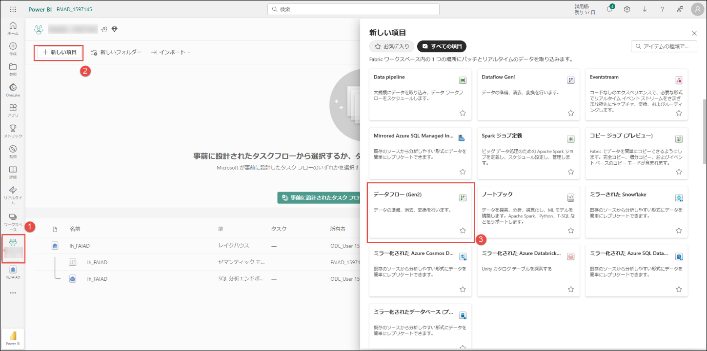

4.  \[推奨アイテム\] で、**データフロー (Gen2)** を選択します。

    

**データフローのページ**が表示されます。データフロー (Gen2)
のインターフェイスは、Power BI Desktop の Power Query
に似ています。クエリは、Power BI Desktop から データフロー (Gen2)
にコピーすることができます。これを試してみましょう。

5.  まだ開いていない場合は、お使いのラボ環境のデスクトップにある
    **Reports** フォルダー内の **FAIAD.pbix** を開きます。

6.  リボンから**ホーム -\> データの変換**を選択します。Power Query
    ウィンドウが開きます。前のラボで確認したように、左パネルのクエリはデータ
    ソースごとに整理されています。

7.  左パネルの SharepointData フォルダーにある **People**
    クエリを**選択**します。

8.  **右クリック**して**コピー**を選択します。

    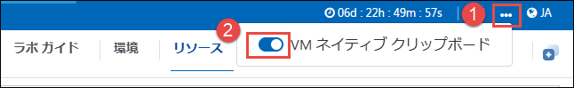

9.  ブラウザーの **データフローの画面**に戻ります。

10. **データフローのペイン**で、**Ctrl+V** を押します
    (現時点では右クリックの貼り付けには対応していません)。MAC
    デバイスを使用している場合は、Cmd+V
    キーを使用して貼り付けてください。

    **注**:
    ラボ環境で作業している場合は、画面の右側にある省略記号を選択してください。スライダーを使用して
    **VM ネイティブ クリップボード**を**有効**にします。ダイアログで \[OK\]
    を選択します。クエリの貼り付けが済んだら、このオプションを無効にしてかまいません。

     

クエリが貼り付けられ、左パネルで使用できます。SharePoint
への接続が作成されていないため、接続を構成するよう求める警告メッセージが表示されます。

### タスク 2: SharePoint への接続を作成する

1.  **接続の構成**を選択します。

    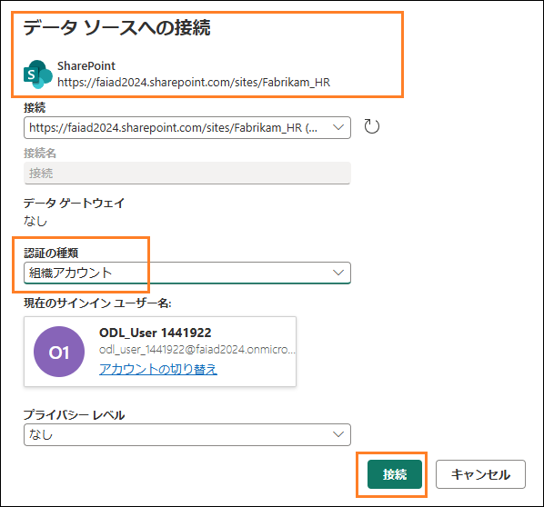

2.  \[データ ソースへの接続\]
    ダイアログが開きます。**接続**ドロップダウンで、**新しい接続の作成**が選択されていることを確認します。

3.  **認証の種類**は**組織アカウント**にします。

4.  **接続**を選択します。

    **注:**
    サインインは、資格情報を使用して行われます。資格情報は、次のスクリーンショットとは異なります。

    

### タスク 3: People クエリのデータのコピー先を構成する

接続が確立され、プレビュー パネルにデータが表示されます。クエリの
\[適用されたステップ\] を自由に見て回ってみましょう。次は、People
のデータをレイクハウスに取り込む必要があります。

1.  **People** クエリを選択します。

2.  リボンから**ホーム -\> データの同期先の追加 -\>
    レイクハウス**を選択します。

    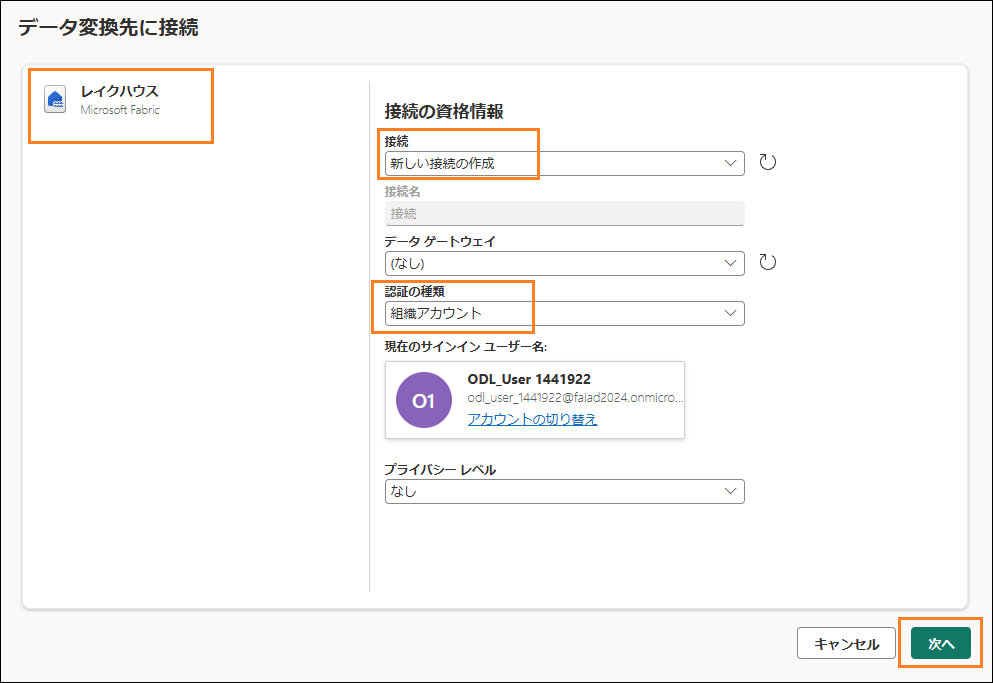

3.  データ変換先に接続ダイアログが開きます。レイクハウスへの新しい接続を作成する必要があります。**接続ドロップダウン**で**新しい接続の作成**を選択し、**認証の種類**を**組織アカウント**に設定して、**次へ**を選択します。

    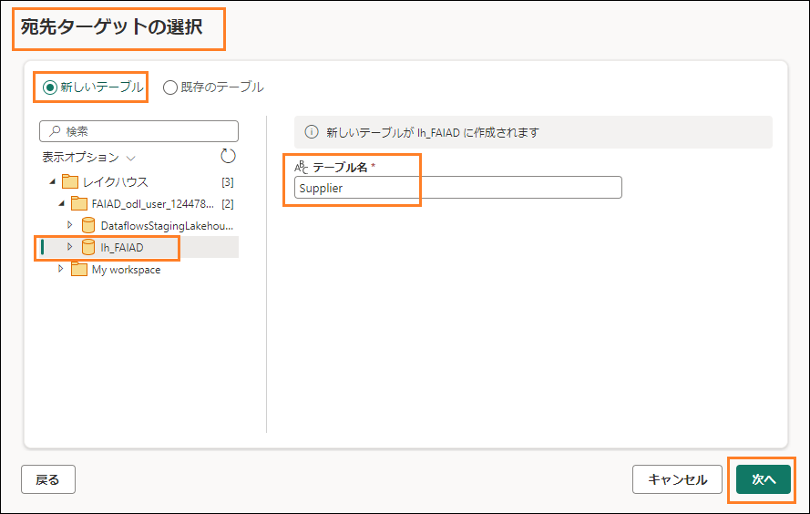

4.  宛先ターゲットの選択ダイアログが開きます。新しいテーブルを作成しているため、**新しいテーブル
    ラジオ ボタン**がオンになっていることを確認してください。

5.  先ほど作成したレイクハウスにテーブルを作成する必要があります。左パネルで、**レイクハウス
    -\> FAIAD\_\<ユーザー名\>** に移動します。

6.  **lh_FAIAD** を選択します。

7.  テーブル名は **People** のままにします。

8.  **次へ**を選択します。

    

9.  宛先の設定を選択するダイアログが開きます。**自動設定を使用する**が**有効になっている**ことを確認してください。

    **注**:
    自動設定は無効にすることができます。また、更新方法を設定するオプションやスキーマに関するオプションがあります。これらのオプション確認したら、**自動設定を使用する**が**有効になっている**ことを確認してください。

10. **設定の保存**を選択します。

     

### タスク 4: SharePoint の データフローを公開して名前を変更する

1.  **Power Query
    のウィンドウ**が表示されます。**右下隅**を見ると、\[データ同期先\]が**レイクハウス**に設定されています。

2.  右下隅の**公開**を選択します。

    

**注:** **FAIAD\_\<ユーザー名\>**
ワークスペースが表示されます。データフローが公開されるまで、しばらくかかる場合があります。

3.  ここで操作しているデータフローは Dataflow 1
    です。先に進む前に名前を変更しましょう。Dataflow 1
    の横にある**省略記号 (...)**
    をクリックします。**プロパティ**を選択します。

    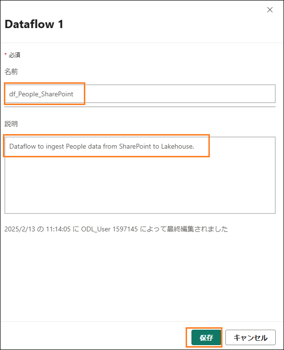

4.  データフローのプロパティ ダイアログが開きます。**名前**を
    **df_People_SharePoint** に変更します。

5.  **説明**テキスト ボックスに、**Dataflow to ingest People data from
    SharePoint to Lakehouse** と入力します。

6.  **保存**を選択します。

    

**FAIAD\_\<ユーザー名\> ワークスペース**が表示されます。

7.  **lh_FAIAD** を選択して、レイクハウスに移動します。

8.  レイクハウス ビューが表示されていることを確認してください (SQL
    分析エンドポイントではありません)。

9.  現在、**People**
    テーブルがレイクハウスで使用可能になっていることを確認してください。

**注:**
新しく作成されたテーブルが表示されない場合は、テーブルの横にある省略記号を選択し、\[更新\]
を選択してテーブルを更新してください。

### タスク 5: Snowflake のクエリをデータフローにコピーする

1.  Fabric ワークスペース **FAIAD\_\<ユーザー名\>** に戻りましょう。

2.  上部のメニューから**新しい項目 -\> データフロー (Gen2)**
    を選択します。

    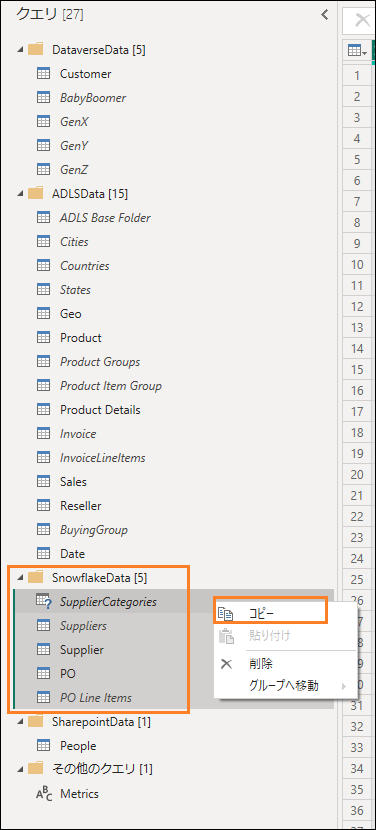

**データフローのページ**が表示されます。ここまでデータフローについて説明してきました。次は、Power
BI Desktop からデータフローにクエリをコピーしましょう。

3.  まだ開いていない場合は、お使いのラボ環境のデスクトップにある
    **Reports** フォルダー内の **FAIAD.pbix** を開きます。

4.  リボンから**ホーム -\> データの変換**を選択します。Power Query
    ウィンドウが開きます。前のラボで確認したように、左パネルのクエリはデータ
    ソースごとに整理されています。

5.  左パネルで、SnowflakeData フォルダーにある次のクエリを
    **Ctrl+Select** または Shift+Select を押しながら選択します。

    a.  SupplierCategories

    b.  Suppliers

    c.  Supplier

    d.  PO

    e.  PO Line Items

6.  **右クリック**して**コピー**を選択します。

    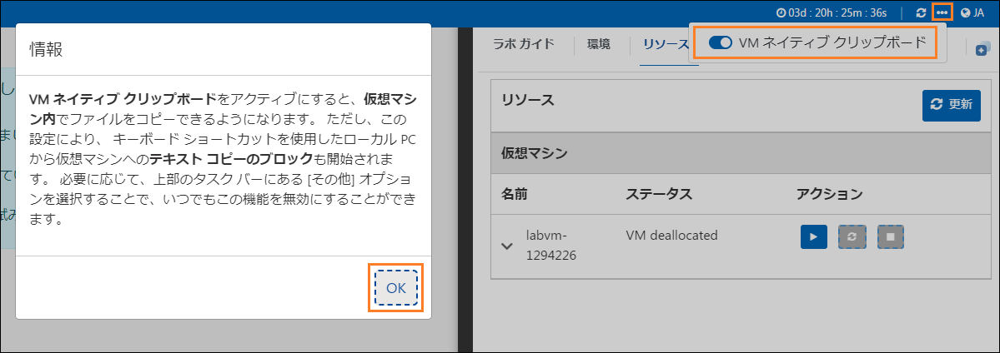

7.  **ブラウザー**に戻ります。

8.  **データフローのペイン**で**中央のペイン**を選択し、**Ctrl+V**
    を押します (現時点では右クリックの貼り付けには対応していません)。MAC
    デバイスを使用している場合は、Cmd+V
    キーを使用して貼り付けてください。

    **注:** ラボ環境で作業している場合は、画面の右側にある**省略記号
    (\...)** を選択してください。スライダーを使用して **VM ネイティブ
    クリップボード**を**有効**にします。ダイアログで \[OK\]
    を選択します。クエリの貼り付けが済んだら、このオプションを無効にしてかまいません。

    

### タスク 6: Snowflake への接続を作成する

5 つのクエリが貼り付けられ、左側に \[クエリ\]
パネルが表示されています。Snowflake
用の接続が作成されていないため、接続を構成するよう求める警告メッセージが表示されます。

1.  **接続の構成**を選択します。

    

2.  \[データ ソースへの接続\]
    ダイアログが開きます。**接続**ドロップダウンで、**新しい接続の作成**が選択されていることを確認します。

3.  **認証の種類**は **Snowflake** にします。

4.  \[環境変数\] タブ (\[ラボ ガイド\] タブの横) で確認できる
    **Snowflake のユーザー名とパスワード**を入力します。

5.  **接続**を選択します。

    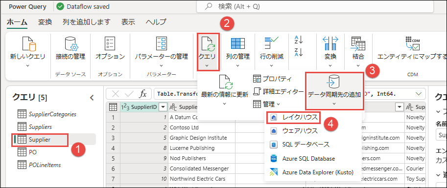

接続が確立され、プレビュー パネルにデータが表示されます。クエリの
\[適用されたステップ\] を自由に見て回ってみましょう。基本的に、Suppliers
クエリには仕入先の詳細が、SupplierCategories
にはその名前が示すように仕入先のカテゴリがあります。これら 2
つのテーブルを結合され、必要な列がある Supplier
ディメンションが作成されます。同様に、PO Line Items と PO
がマージされ、PO ファクトが作成されます。次は、Supplier と PO
のデータをレイクハウスに取り込む必要があります。

### タスク 7: Supplier クエリと PO クエリのデータのコピー先を構成する

1.  **Supplier** クエリを選択します。

2.  リボンから**ホーム -\> データの同期先の追加 -\>
    レイクハウス**を選択します。

    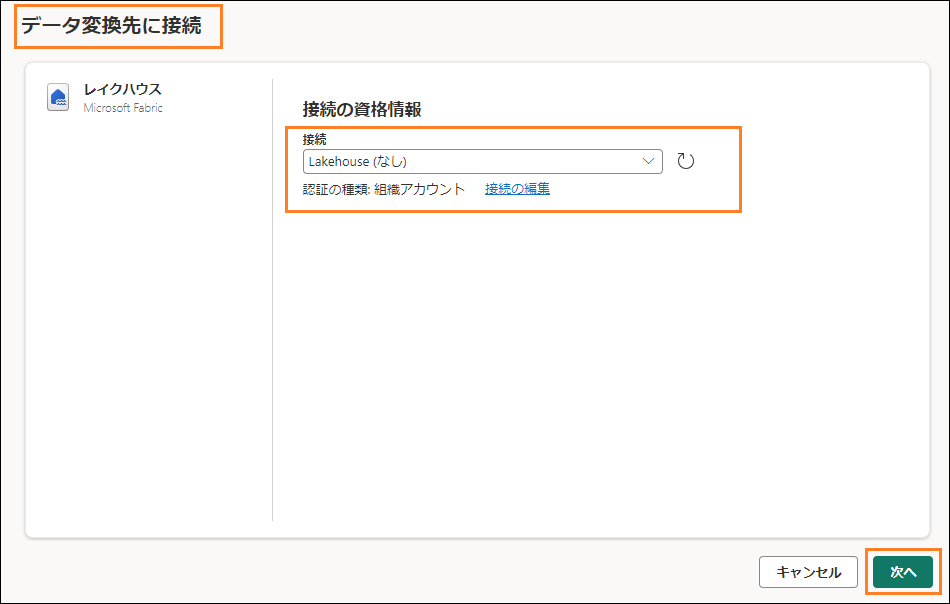

3.  データ変換先に接続ダイアログが開きます。**接続ドロップダウン**から
    **Lakehouse (なし)**を選択します。

4.  **次へ**を選択します。

    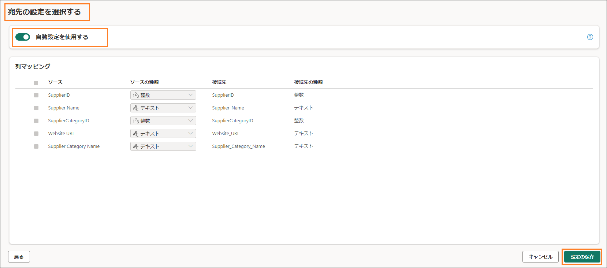

5.  宛先ターゲットの選択ダイアログが開きます。新しいテーブルを作成しているため、**新しいテーブル
    ラジオ ボタン**が**オン**になっていることを確認してください。

6.  先ほど作成したレイクハウスにテーブルを作成する必要があります。左パネルで、**レイクハウス
    -\> FAIAD\_\<ユーザー名\>** に移動します。

7.  **lh_FAIAD** を選択します。

8.  テーブル名は **Supplier** のままにします。

9.  **次へ**を選択します。

    

10. 宛先の設定を選択するダイアログが開きます。自動設定を使用します。これによりデータの完全な更新が行われます。また、必要に応じて列の名前も変更されます。**設定の保存**を選択します。

    

11. **Power Query
    のウィンドウ**が表示されます。**右下隅を見ると、\[データ同期先\]がレイクハウス**に設定されています。同様に、**PO
    クエリのデータのコピー先を設定します**。完了すると、以下のスクリーンショットに示すように、**PO**
    クエリの**データ同期先**が**レイクハウス**に設定されます。

    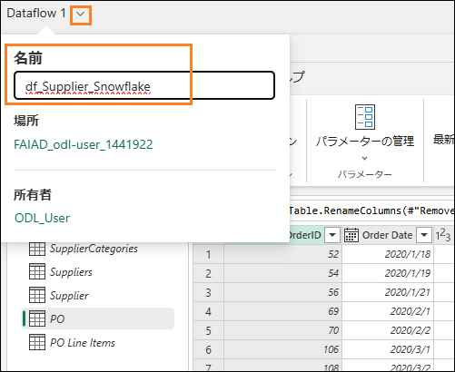

### タスク 8: Snowflake のデータフローの名前を変更して公開する

1.  画面上部で、**Dataflow 1
    の横にある矢印**を選択して名前を変更します。

2.  ダイアログで、名前を **df_Supplier_Snowflake** に変更します。

3.  **Enter** キーを押して名前の変更を保存します。

    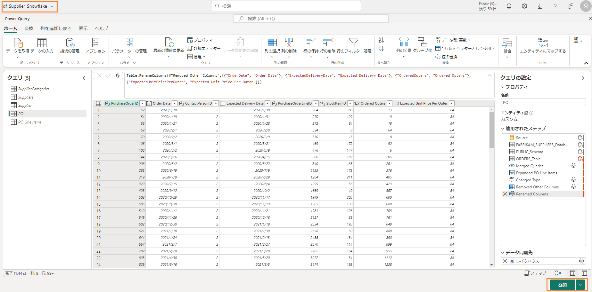

4.  右下隅の**公開**を選択します。

    

**FAIAD\_\<ユーザー名\>
ワークスペース**が表示されます。データフローが公開されるまで、しばらくかかる場合があります。

5.  **lh_FAIAD** を選択して、レイクハウスに移動します。

6.  レイクハウス ビューが表示されていることを確認してください (SQL
    分析エンドポイントではありません)。

7.  現在、**PO** テーブルと **Supplier**
    テーブルがレイクハウスで使用可能になっていることを確認してください。

**注:**
新しく作成されたテーブルが表示されない場合は、テーブルの横にある省略記号を選択し、\[更新\]
を選択してテーブルを更新してください。

次は、Dataverse からデータを取り込むショートカットを作成しましょう。

# ADLS Gen2 へのショートカット

### タスク 9: Dataverse へのショートカットの作成方法

レイクハウス **lh_FAIAD** が表示されているはずです。レイクハウス
ビューが表示されていることを確認してください (SQL
分析エンドポイントではありません)。

1.  **エクスプローラー** パネルで、**Tables**
    の横にある**省略記号**を選択します。

2.  **新しいショートカット**を選択します。

    

3.  \[新しいショートカット\]
    ダイアログが開きます。**外部ソース**で、**Dataverse** を選択します。

**注**: 前のラボでは、同様の手順に従って、Azure Data Lake Storage Gen2
へのショートカットを作成しました。

4.  \[接続設定\] ダイアログが開きます。**環境のドメイン**に
    **org6c18814a.crm.dynamics.com** と入力します。

5.  **認証の種類**は**組織アカウント**のままにします。

6.  **サインイン**を選択します。

    

7.  サインイン ダイアログ
    ボックスで、これらのラボで使用している**ユーザー
    アカウント**を選択します。\[アカウントにサインインする\]
    ダイアログが開きます。**ご自身のアカウントを選択して**、サインインします。

    **注**: 使用するアカウントは、次のスクリーンショットとは異なります。

    

8.  \[接続設定\] ダイアログで、**次へ**を選択します。

Dataverse
からさまざまなバケット/ディレクトリを選択できるダイアログが表示されます。数多くの多様なバケットを使用できることを確認してください。必要なバケットを選択して、ラボ
3 と同様のプロセスに従います (ビジュアル
クエリを使ってデータを変換し、ビューを作成します)。また、このラボの前の手順と同様に、データフロー
(Gen2) を使用して SharePoint
に接続することもできます。ただし、これらの**バケット/ディレクトリ**にはアクセスできません。

このシナリオでは、IT チームは、既に Dataverse
へのリンクを確立しており、必要なデータ変換を適用して、その変換を Power
BI Desktop
ファイルにミラーリングしています。このデータは管理者ワークスペースのレイクハウスに取り込まれており、テーブルへのアクセスが許可されています。IT
チームの貢献によってすべての作業が完了しているので、管理者ワークスペースでこのレイクハウスへのショートカットを作成することができます。

9.  \[新しいショートカット\]
    ダイアログで**キャンセル**を選択して、レイクハウスに戻ります。

    

### タスク 10: レイクハウスへのショートカットを作成する

1.  **エクスプローラー** パネルで、**Tables**
    の横にある**省略記号**を選択します。

2.  **新しいショートカット**を選択します。

    

3.  \[新しいショートカット\] ダイアログが開きます。\[内部ソース\] から
    **Microsoft OneLake** を選択します。

    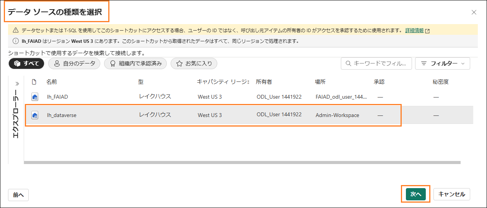

4.  データ ソースの種類を選択ダイアログが開きます。2 つのデータ
    ソースがあることに注意してください。

    a.  lh_FAIAD - これは、作成したレイクハウスです。

    b.  lh_dataverse - これは、作成したレイクハウス管理です。

5.  **lh_dataverse** を選択します。

6.  **次へ**を選択します。

    

7.  左パネルで、**lh_dataverse -\> Tables** を展開します。IT 管理者が
    Customer テーブルへのアクセスを許可していることを確認してください。

8.  **Customer** を選択します。

9.  **次へ**を選択します。

     

10. 次のダイアログで、**作成**を選択します。lh_FAIAD
    レイクハウスに戻ります。

    

11. 左側の**エクスプローラー** パネルで、新しい **Customer**
    テーブルが作成されていることを確認してください。

12. **Customer** テーブルを選択すると、プレビュー
    パネルにデータが表示されます。

別のレイクハウスへのショートカットが正常に作成されました。

これで、すべてのデータがレイクハウスに取り込まれました。次のラボでは、データフローの更新スケジュールを設定します。

次のラボでは、更新スケジュールを設定します。

# 参考資料

Fabric Analyst in a Day (FAIAD) では、Microsoft Fabric
で使用できる主要な機能の一部をご紹介します。サービスのメニューにあるヘルプ
(?) セクションには、いくつかの優れたリソースへのリンクがあります。

Microsoft Fabric
の次のステップに役立つリソースをいくつか以下に紹介します。

-   ブログ記事で [Microsoft Fabric の GA
    に関するお知らせ](https://aka.ms/Fabric-Hero-Blog-Ignite23)の全文を確認する

-   [ガイド付きツアー](https://aka.ms/Fabric-GuidedTour)を通じて Fabric
    を探索する

-   [Microsoft Fabric
    の無料試用版](https://aka.ms/try-fabric)にサインアップする

-   [Microsoft Fabric の Web
    サイト](https://aka.ms/microsoft-fabric)にアクセスする

-   [Fabric
    の学習モジュール](https://aka.ms/learn-fabric)で新しいスキルを学ぶ

-   [Fabric の技術ドキュメント](https://aka.ms/fabric-docs)を参照する

-   [Fabric 入門編の無料の
    e-book](https://aka.ms/fabric-get-started-ebook) を読む

-   [Fabric
    コミュニティ](https://aka.ms/fabric-community)に参加し、質問の投稿やフィードバックの共有を行い、他のユーザーから学びを得る

より詳しい Fabric
エクスペリエンスのお知らせに関するブログを参照してください。

-   [Fabric の Data Factory
    エクスペリエンスに関するブログ](https://aka.ms/Fabric-Data-Factory-Blog) 

-   [Fabric の Synapse Data Engineering
    エクスペリエンスに関するブログ](https://aka.ms/Fabric-DE-Blog) 

-   [Fabric の Synapse Data Science
    エクスペリエンスに関するブログ](https://aka.ms/Fabric-DS-Blog) 

-   [Fabric の Synapse Data Warehousing
    エクスペリエンスに関するブログ](https://aka.ms/Fabric-DW-Blog) 

-   [Fabric の Synapse Real-Time Analytics
    エクスペリエンスに関するブログ](https://aka.ms/Fabric-RTA-Blog)

-   [Power BI のお知らせに関するブログ](https://aka.ms/Fabric-PBI-Blog)

-   [Fabric の Data Activator
    エクスペリエンスに関するブログ](https://aka.ms/Fabric-DA-Blog) 

-   [Fabric
    の管理とガバナンスに関するブログ](https://aka.ms/Fabric-Admin-Gov-Blog)

-   [Fabric の OneLake
    に関するブログ](https://aka.ms/Fabric-OneLake-Blog)

-   [Dataverse と Microsoft Fabric
    の統合に関するブログ](https://aka.ms/Dataverse-Fabric-Blog)

> © 2023 Microsoft Corporation.All rights reserved.
>
> このデモ/ラボを使用すると、次の条件に同意したことになります。
>
> このデモ/ラボで説明するテクノロジまたは機能は、ユーザーのフィードバックを取得し、学習エクスペリエンスを提供するために、Microsoft
> Corporation
> によって提供されます。ユーザーは、このようなテクノロジおよび機能を評価し、Microsoft
> にフィードバックを提供するためにのみデモ/ラボを使用できます。それ以外の目的には使用できません。このデモ/ラボまたはその一部を、変更、コピー、配布、送信、表示、実行、再現、発行、ライセンス、著作物の作成、転送、または販売することはできません。
>
> 複製または再頒布のために他のサーバーまたは場所にデモ/ラボ
> (またはその一部)
> をコピーまたは複製することは明示的に禁止されています。
>
> このデモ/ラボは、前に説明した目的のために複雑なセットアップまたはインストールを必要としないシミュレーション環境で潜在的な新機能や概念などの特定のソフトウェア
> テクノロジ/製品の機能を提供します。このデモ/ラボで表されるテクノロジ/概念は、フル機能を表していない可能性があり、最終バージョンと動作が異なることがあります。また、そのような機能や概念の最終版がリリースされない場合があります。物理環境でこのような機能を使用するエクスペリエンスが異なる場合もあります。
>
> **フィードバック**。このデモ/ラボで説明されているテクノロジ、機能、概念に関するフィードバックを
> Microsoft
> に提供する場合、ユーザーは任意の方法および目的でユーザーのフィードバックを使用、共有、および商品化する権利を無償で
> Microsoft
> に提供するものとします。また、ユーザーは、フィードバックを含む
> Microsoft
> のソフトウェアまたはサービスの特定部分を使用したり特定部分とインターフェイスを持ったりする製品、テクノロジ、サービスに必要な特許権を無償でサード
> パーティに付与します。ユーザーは、フィードバックを含めるために
> Microsoft がサード
> パーティにソフトウェアまたはドキュメントをライセンスする必要があるライセンスの対象となるフィードバックを提供しません。これらの権限は、本契約の後も存続します。
>
> Microsoft Corporation
> は、明示、黙示、または法律上にかかわらず、商品性のすべての保証および条件、特定の目的、タイトル、非侵害に対する適合性など、デモ/ラボに関するすべての保証および条件を拒否します。Microsoft
> は、デモ/ラボから派生する結果、出力の正確さ、任意の目的に対するデモ/ラボに含まれる情報の適合性に関して、いかなる保証または表明もしません。
>
> **免責事項**
>
> このデモ/ラボには、Microsoft Power BI
> の新機能と機能強化の一部のみが含まれています。一部の機能は、製品の将来のリリースで変更される可能性があります。このデモ/ラボでは、新機能のすべてではなく一部について学習します。
