# Microsoft Fabric - Fabric Analyst in a Day - ラボ 7


# 目次
- 概要
- Power BI
    - タスク 1: レポートを自動作成する
    - タスク 2: 新しいレポートの背景を構成す
    - タスク 3: レポートにヘッダーを追加する
    - タスク 4: レポートに KPI を追加する
    - タスク 5: レポートに折れ線グラフを追加する
    - タスク 6: レポートを保存する
    - タスク 7: Date テーブルの Year 列を構成する
    - タスク 8: Date テーブルの Month Name 列を構成する
    - タスク 9: 折れ線グラフを書式設定する
    - タスク10: Power BI Desktop をセマンティック モデルに接続する
    - タスク 11: 新しいデータを追加して Direct Lake モードをシミュレートする
- ラボ環境をクリーンアップする
- リファレンス


# 概要

このコースではレイクハウスについて紹介し、さまざまなデータ
ソースからレイクハウスへのデータの取り込み、データ
ソースの更新スケジュールの設定、データ
モデルの作成を行いました。次は、レポートを作成します。

このラボを終了すると、次のことが学べます。

- レポートを自動的に作成する方法

- 空のキャンバスからレポートを構築する方法

- Power BI Desktop を使用してレポートを作成する方法

- データが自動的に更新される Direct Lake モードを体験する方法

# Power BI

## タスク 1: レポートを自動作成する

まず、レポートの自動作成オプションを使用してみましょう。ラボの後半では、Power
BI にあるレポートを作成し直します。

1. 前のラボで作成した **Fabric ワークスペース**に移動します。

2. 左側のパネルの下部にある **Fabric エクスペリエンス セレクター**
    アイコンを選択します。

3. Fabric エクスペリエンスのダイアログが開きます。**Power BI**
    を選択します。**Power BI ホーム ページ**が表示されます。

    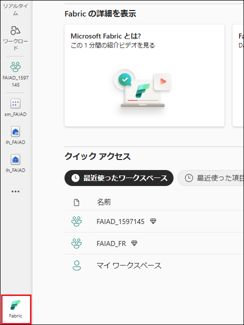

4. 上部のメニューから**新しいレポート**を選択します。

    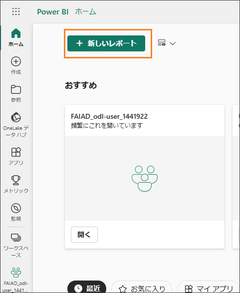

5. **最初のレポートの作成画面**が表示されます。レポートを作成するには、Excel
    や csv
    を使用する方法、データを手動で入力する方法、または公開されているセマンティック
    モデルを選択する方法があります。前のラボではセマンティック
    モデルを作成しました。それを使ってみましょう。**公開されたセマンティック
    モデルを選択**オプションを選択します。

    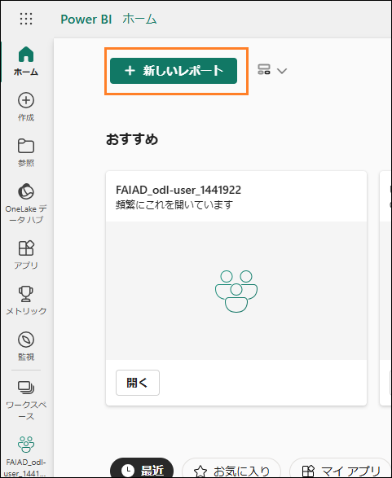

6. \[レポートで使用するデータセットを選択\]
    ページが開きます。複数のオプションがあります。**sm_FAIAD
    を選択します**。

    a. **sm_FAIAD:** これは作成したセマンティック モデルで、レポートの作成に使用します。

    b. **lh_FAIAD:** これは、すべてのデータが取り込まれているレイクハウスです。

    c. **Units by Supplier:** これは T-SQL を使用して作成したデータセットです。

    d. **DataflowsStagingWarehouse:** これは既定で作成されるステージング ウェアハウスです。データをステージングしなかったので、これは使用しませんでした。

    e. **DataflowsStagingLakehouse:** これは既定で作成されるステージング レイクハウスです。データをステージングしなかったので、これは使用しませんでした。

7. **レポートの自動作成ボタンの横の矢印**をクリックします。\[レポートの自動作成\]
    と \[空のレポートの作成\] という 2
    つのオプションがあることに注意してください。自動作成を試してみましょう。**レポートを自動作成する**を選択します。

    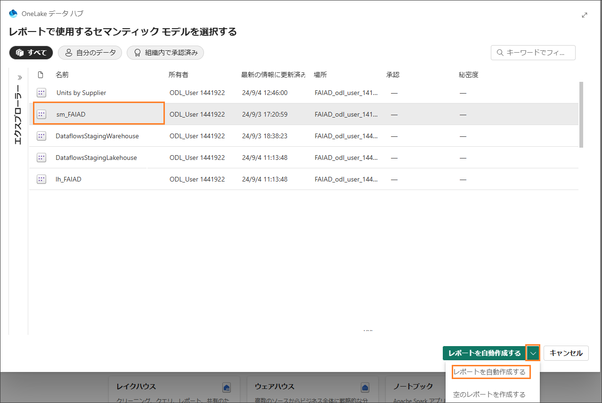

8. Power BI
    によって、レポートの自動作成が開始されます。\[データの事前選択\]
    オプションを選択することもできます。レポートの準備が完了すると、画面の右上にダイアログが表示されます。**レポートを今すぐ表示するか、数秒後に自動的に読み込む**を選択します。

    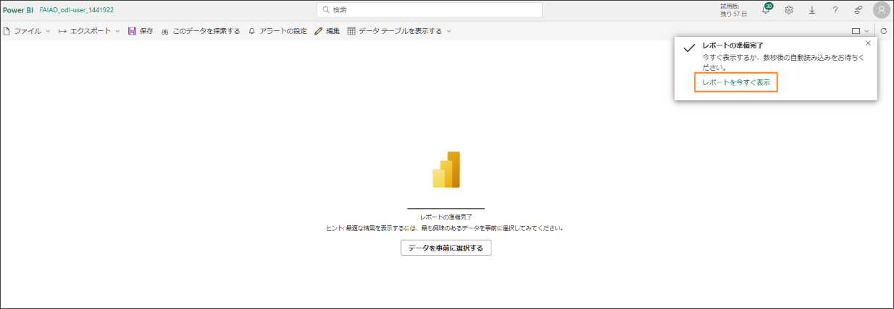

    **チェックポイント:**
    以下のスクリーンショットのようなレポートが表示されます。少数の KPI
    といくつかの傾向のビジュアルがあります。新しいモデルを分析しようとしており、すぐに開始する必要がある場合、これは良いスタート地点となります。

    **注:**
    上部のメニューには、レポートを編集したり、データをテーブルとして表示したりするオプションがあります。自由にこれらのオプションを試してみてください。

9. このレポートを保存しましょう。上部のメニューで **Save**
    を選択します。

10. \[レポートの保存\] ダイアログが開きます。レポートに
    **rpt_Sales_Auto_Report** という名前を付けます。

    **注:** レポート名の前に report の省略形である rpt を付けています。

11. レポートがワークスペース **FAIAD\_\<ユーザー名\>**
    に保存されることを確認します。

12. **保存**を選択します。

    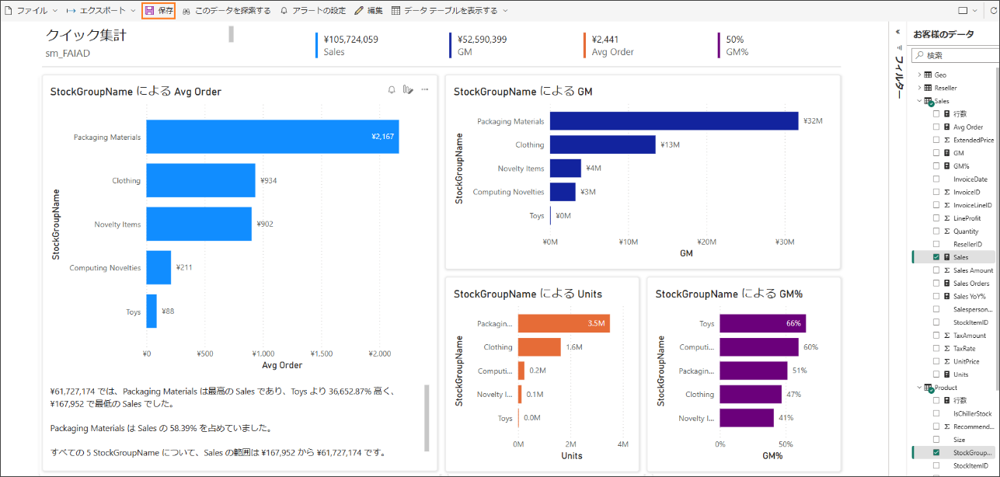

    **注:** 自動作成レポートは、\"自動作成\"
    されるのでユーザーによって外観が異なる場合があります。また、前のラボ
    (ラボ 6) で作成したリレーションシップとメジャーにも依存します。

    上のスクリーンショットは、オプションのリレーションシップ (ラボ 6)
    を含むすべてのリレーションシップとメジャーを作成した場合に、自動作成レポートがどのように表示される**可能性があるか**を示したものです。

    下のスクリーンショットは、オプションのリレーションシップとメジャー (ラボ
    6)
    の作成をスキップした場合に、自動作成レポートがどのように表示される**可能性があるか**を示したものです。

    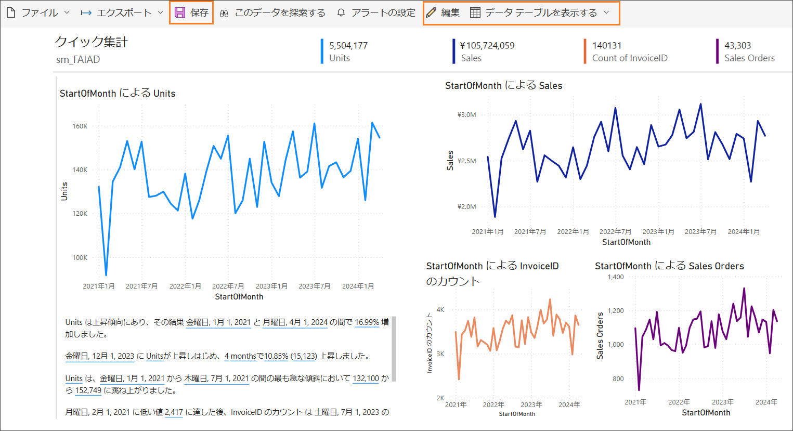

## タスク 2: 新しいレポートの背景を構成する

空のキャンバスを使用して新しいレポートを作成してみましょう。

1. **左側のパネル**で、ワークスペース名 **FAIAD\_\<ユーザー名\>**
    を選択して、ワークスペースに移動します。

2. 上部のメニューから**新規 -\>
    レポート**を選択します。\[最初のレポートを作成する\]
    ページが表示されます。

    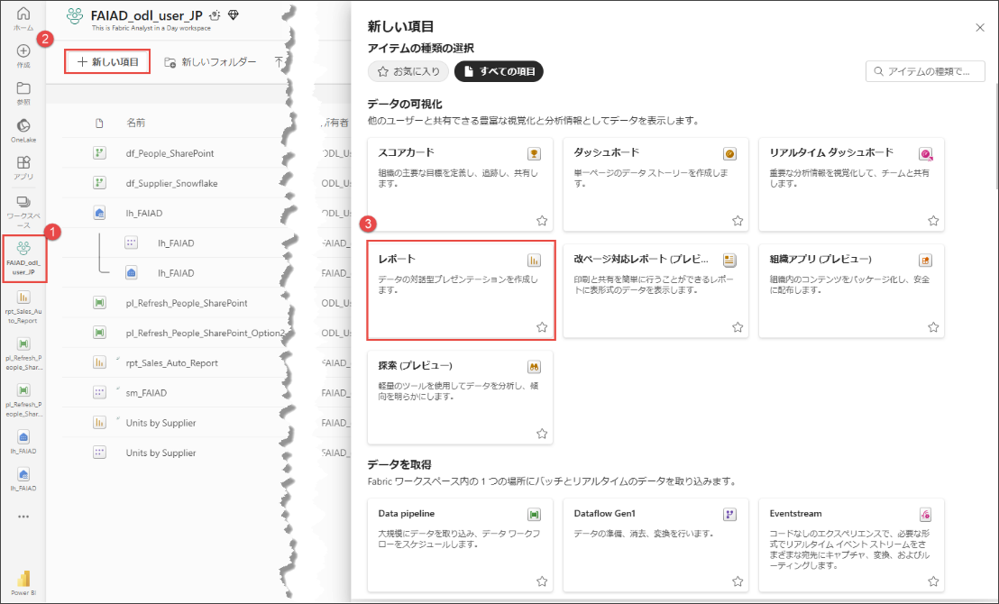

3. 作成したモデルを選択できるように、**公開されたセマンティック
    モデルを選択**を選択します。

    

4. \[レポートで使用するセマンティック モデルを選択する\]
    ダイアログが開きます。**sm_FAIAD** を選択します。

5. **レポートの自動作成ボタンの横の矢印**をクリックします。**空のレポートを作成する**を選択します。Power
    BI Desktop のレポート ページに類似したレポート
    ページが表示されます。

    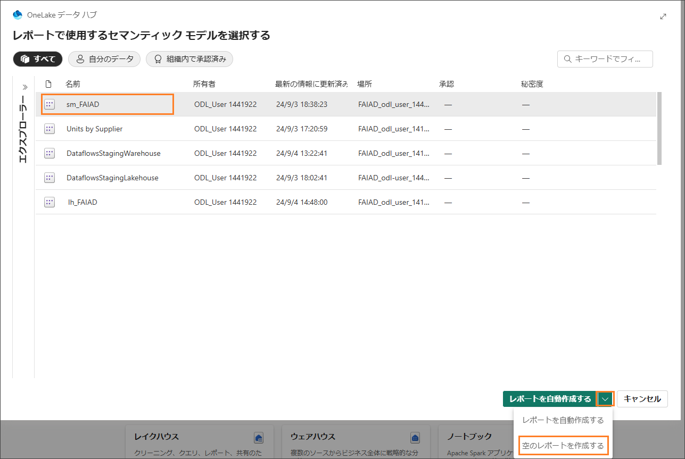

6. まだ開いていない場合は、お使いのラボ環境の**デスクトップ**にある
    **Reports** フォルダー内の **FAIAD.pbix** を開きます。

    このレポートを参考として使用します。まず最初にキャンバスの背景を追加します。レポート
    ヘッダーを作成し、いくつかの KPI
    を追加して、売上推移の折れ線グラフを作成します。時間の都合上、また出席者には
    Power BI Desktop
    でのビジュアル作成の経験があることをふまえ、すべてのビジュアルの作成は行いません。

    

7. ブラウザーで **Power BI キャンバス**に戻ります。

8. **\[視覚化\]** ペインで**ページの書式設定アイコン**を選択します。

9. **キャンバスの背景セクション**を展開します。

10. **画像**オプションの**参照**を選択します。エクスプローラー
    ダイアログが開きます。

11. ラボ環境の**デスクトップ**にある **Reports**
    フォルダーに移動します。

12. **Summary Background.png** を選択します。

13. **イメージのサイズ調整**ドロップダウンを**自動調整**に設定します。

14. \[透過性\] を **0%** に設定します。

    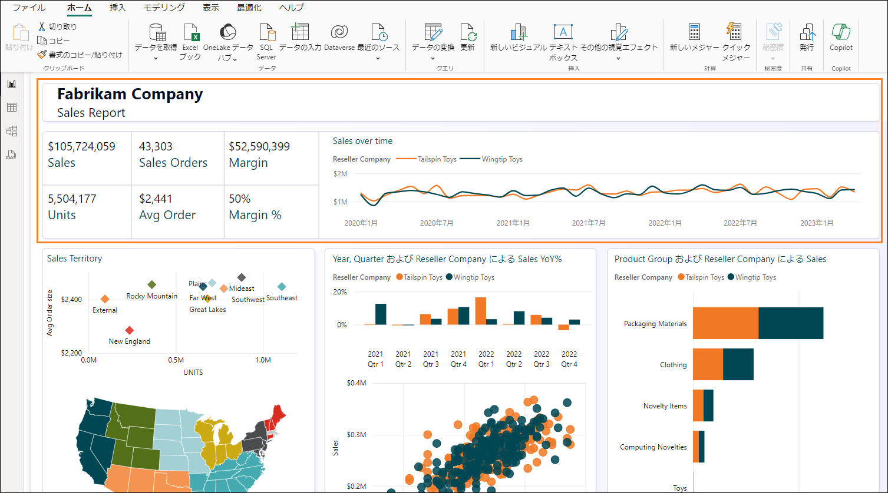

## タスク 3: レポートにヘッダーを追加する

1. 上部の余白にヘッダーを追加しましょう。**メニュー**で、**テキスト ボックス**を選択します。

2. テキスト ボックスの最初の行として **Fabrikam Company**
    と入力します。

3. テキスト ボックスの 2 行目として **Sales Report** と入力します。

4. **Fabrikam Company** を強調表示し、**フォント**を **Segoe
    UI**、**フォント サイズ**を **18、太字**に設定します。

5. **Sales Report** を強調表示し、**フォント**を **Segoe
    UI**、**フォント サイズ**を **14、太字**に設定します。

6. **テキスト ボックスを選択**した状態で、右側の \[書式設定テキスト
    ボックス\] ペインで\
    **\[効果\] を展開**します。

7. **背景**スライダーを使用して、**オフ**に設定します。

8. **上部の余白に収まるようにテキスト ボックス**のサイズを変更します。

    

## タスク 4: レポートに KPI を追加する

1. Sales KPI を追加しましょう。キャンバス内で**空白**を選択し、テキスト
    ボックスからフォーカスを外します。

2. **視覚化セクション**で、**複数行カード ビジュアル**を選択します。

3. **データ セクション**で、**Sales** **テーブル**を展開します。

4. **Sales メジャー**を選択します。

    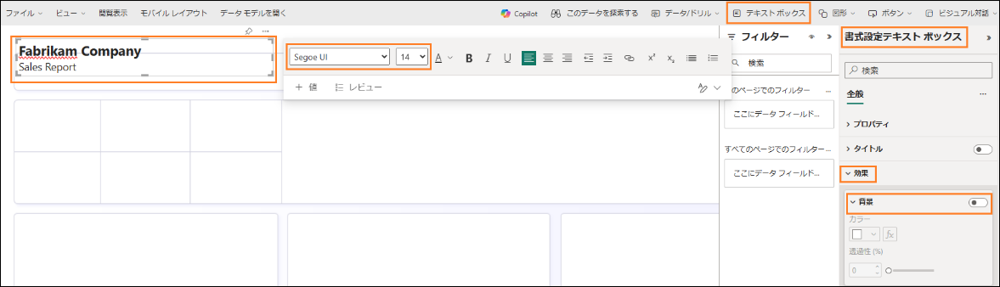

5. **複数行カード ビジュアルを選択**した状態で、\[視覚化\]
    セクションの**ビジュアルの書式設定アイコン**を選択します。

6. **カテゴリ ラベル** セクションを展開します。

7. **フォント サイズ**を **14** に上げます。

8. **色ドロップダウン**を選択します。\[カラー パレット\]
    ダイアログが開きます。

9. **その他の色**を選択します。

10. \[16 進\] の値を **#004753** に設定します。

    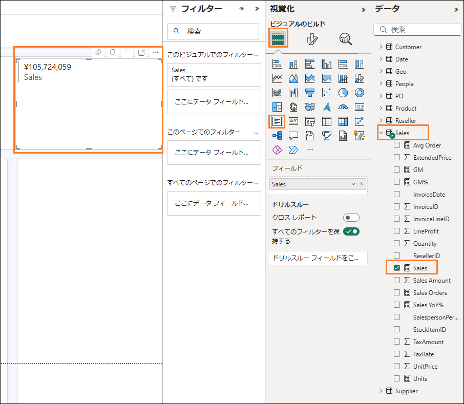

11. **カード** セクションを展開します。

12. **アクセント バー** スライダーを使用して、**オフ**に設定します。

    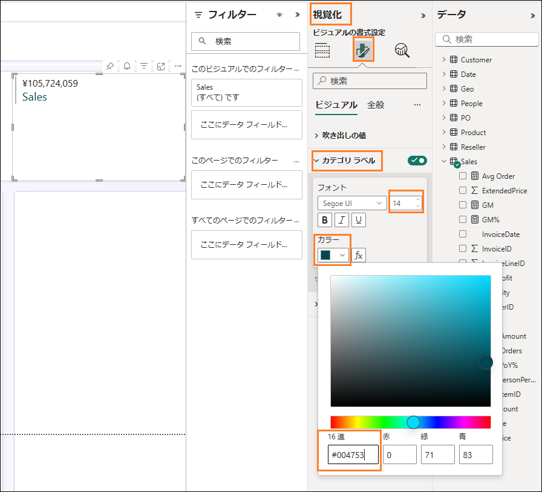

13. \[視覚化\] ペインで**全般**を選択します。

14. **効果セクション**を展開します。

15. **背景**スライダーを使用して、**オフ**に設定します。

16. **ビジュアル**のサイズを変更して、**スクリーンショットに表示されている左のボックス**に移動します。

    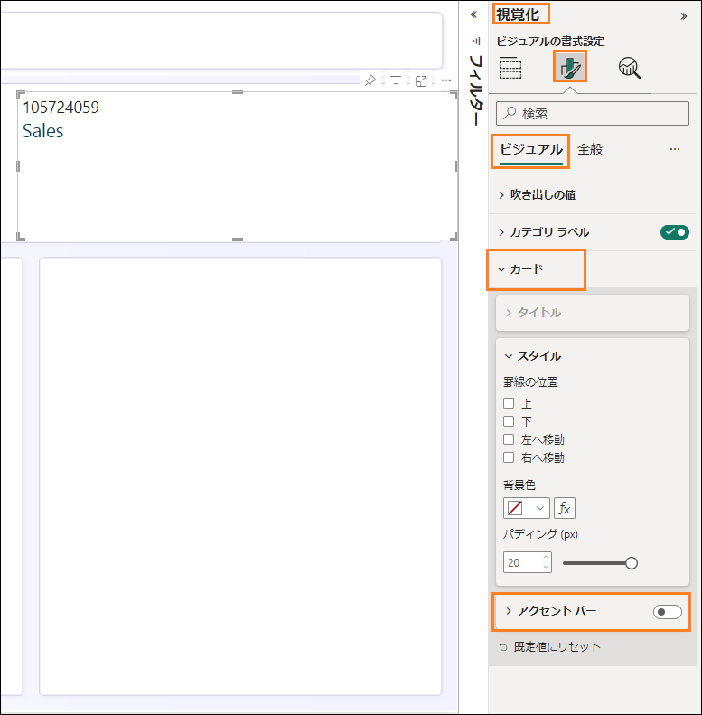

17. 別の KPI を追加してみましょう。先ほど作成した **Sales
    複数行カード**を選択します。キーボードの **Ctrl+C**
    を使用して、ビジュアルを**コピー**します。

18. キーボードの **Ctrl+V**
    を使用して、ビジュアルを**貼り付け**ます。ビジュアルがキャンバスに貼り付けられました。

19. **新しいビジュアルを強調表示**した状態で、**視覚化ペイン -\>
    ビジュアルのビルド -\> フィールド** セクションから **Sales**
    メジャーを削除します。

20. **Data** セクションで、**Sales** テーブルを展開し、**Units**
    メジャーを選択します。

21. **ビジュアル**のサイズを変更し、**Sales
    ビジュアルの下のボックスに配置**します。

    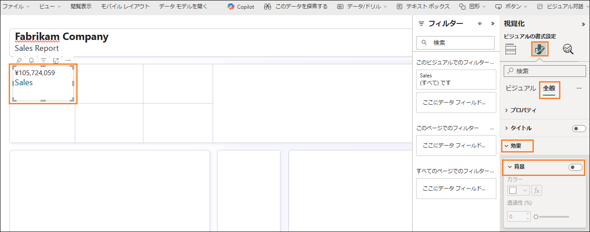

## タスク 5: レポートに折れ線グラフを追加する

折れ線グラフを作成して、リセラー会社ごとの売上の推移を視覚化しましょう。

1. キャンバス内で**空白**を選択し、複数行カード
    ビジュアルからフォーカスを外します。

2. **視覚化セクション**で、**折れ線グラフ**を選択します。

3. **データ セクション**で **Date** テーブルを展開します。

4. **Year** フィールドを選択します。Year は既定で合計され、Y
    軸に追加されることに注意してください。これを修正しましょう。

    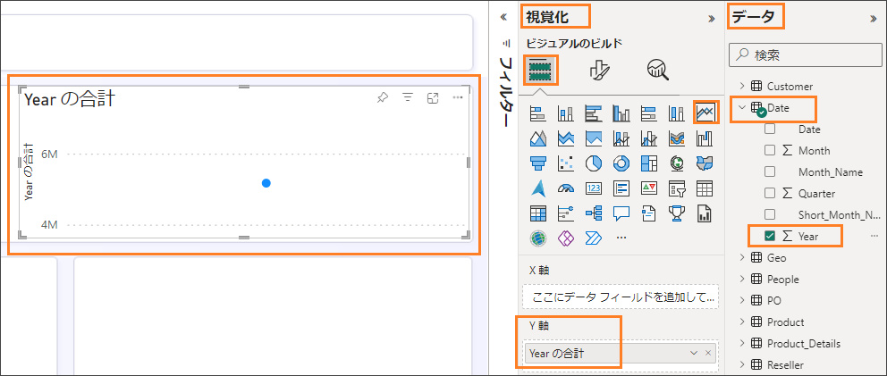

## タスク 6: レポートを保存する

レポートから移動してモデルを変更する前にレポートを保存しましょう。

1. メニューから**ファイル -\> 保存**を選択します。

2. \[レポートの保存\] ダイアログが開きます。レポートに
    **rpt_Sales_Report** という名前を付けます。
    
    **注:** レポート名の前に report の省略形である rpt を付けています。

3. レポートが **FAIAD\_\<ユーザー名\>**
    ワークスペースに保存されることを確認します**。**

4. **保存**を選択します。レポートが保存され、ビューモードになったことが通知されます。

    

## タスク 7: Date テーブルの Year 列を構成する

1. **上部のメニュー**から**編集**を選択して、編集モードに戻ります。

2. **上部のメニュー**から**データ
    モデルを開く**を選択します。セマンティック
    モデルが、新しいブラウザー ウィンドウ/タブで開くことが通知されます。

    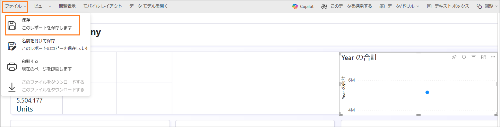

3. **右側のデータ パネル**で、テーブルを選択します。

4. **Date** テーブルを展開します。

5. **Year** 列を選択します。

6. 右側の**プロパティ** ペインで、**詳細**セクションを展開します。

7. **集計の方法**ドロップダウン リストで、**なし**を選択します。

    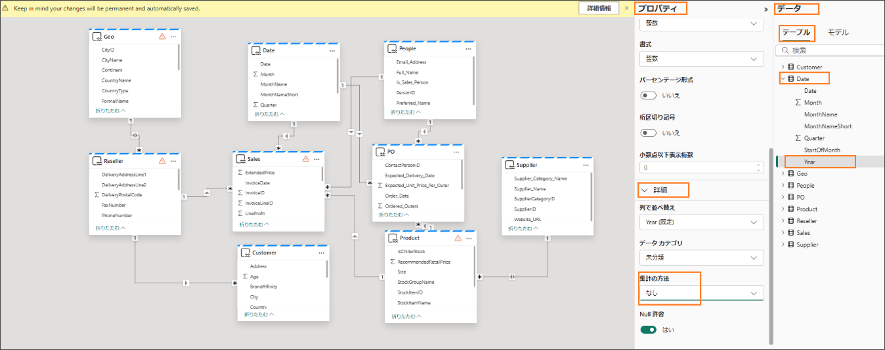

8. ブラウザーの**レポート ウィンドウ/タブ**に戻ります。

9. 右側の**データ ペイン**で、**Date** テーブルを展開します。\[Year\]
    は集計フィールドではなくなりました。

10. **折れ線グラフ ビジュアルを選択**した状態で、Y 軸から **Sum of Year
    を削除**します。

11. **Year** フィールドを選択すると、**X 軸**に追加されます。

12. **Sales** テーブルを展開し、**Sales メジャー**を選択します。

    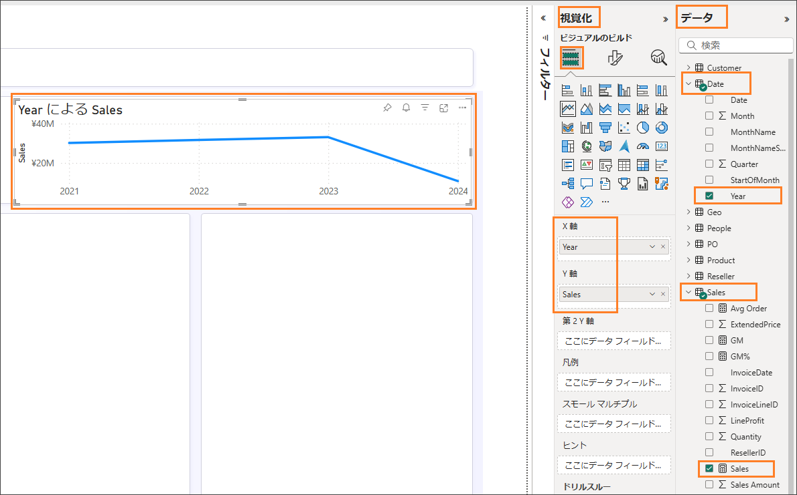

## タスク 8: Date テーブルの Month Name 列を構成する

1. このグラフに月を追加してみましょう。Date テーブルの
    **MonthNameShort** フィールドを **X 軸**の **Year**
    の下にドラッグします。ビジュアルが Sales
    の順に並べ替えられていることに注目してください。**MonthNameShort**
    の順に並べ替えてみましょう。

2. ビジュアルの右上隅にある**省略記号 (...)** を選択します。

3. **軸の並べ替え -\> Year Short_Month_Name** を選択します。

4. ビジュアルの右上隅にある**省略記号 (...)** を選択します。

5. **軸の並べ替え -\> 昇順で並べ替え**を選択します。

    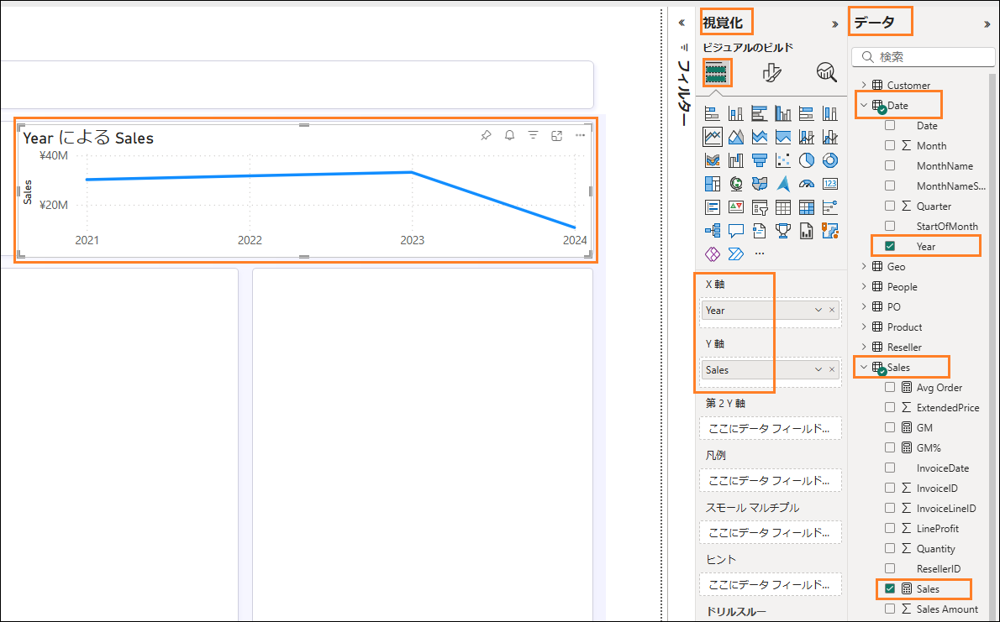

    **注:** 月がアルファベット順に並べられています。これを修正しましょう。

    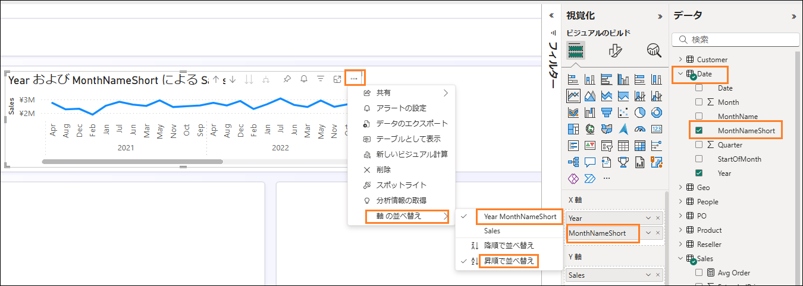

6. セマンティック モデルが開いている**ブラウザー
    ウィンドウ/タブ**に戻ります。

7. **データ** ペインで **Date** テーブルを展開します。

8. **MonthNameShort** 列を選択します。

9. 右側の**プロパティ** ペインで、**詳細**セクションを展開します。

10. **列で並べ替え**ドロップダウンで **Month** を選択します。

    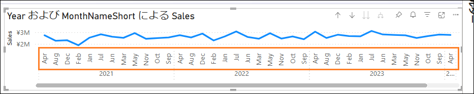

11. ブラウザーの**レポート
    ウィンドウ/タブ**に戻ります。月が正しく並べ替えられました。

    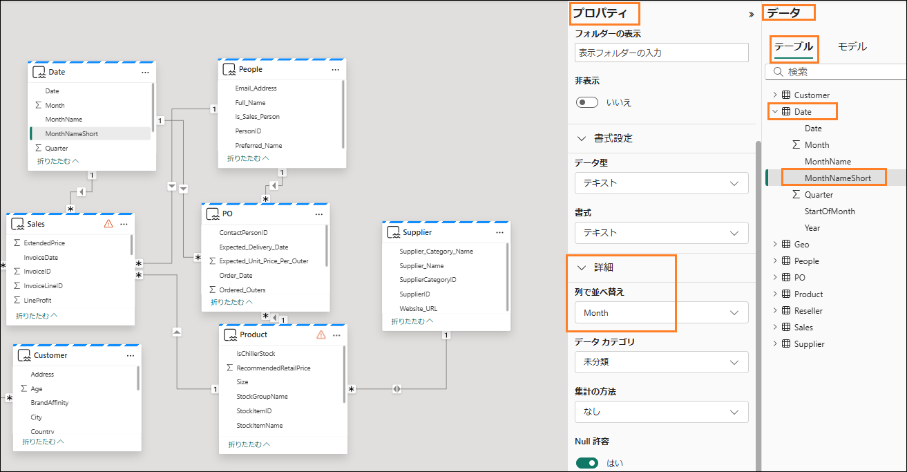

## タスク 9: 折れ線グラフを書式設定する

レポートの作成中にセマンティック
モデルを更新することがいかに簡単であるかに注目してください。これにより
Power BI Desktop のようなシームレスな対話型操作が実現します。

1. **折れ線グラフ ビジュアルを選択**した状態で、**データ セクション**の
    **Reseller** テーブルを展開します。

2. **Reseller -\> Reseller Company**
    フィールドを**凡例**セクションにドラッグします。

    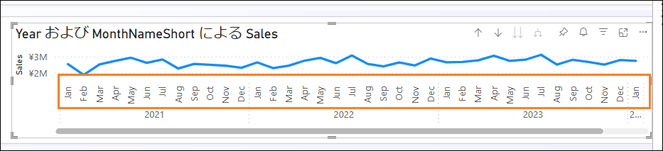

3. **折れ線グラフ ビジュアルを選択**した状態で、**視覚化**セクションで
    **ビジュアルの書式設定アイコン -\> 全般**を選択します。

4. **タイトル** セクションを展開します。

5. **タイトル**のテキストとして **Sales over time** を設定します。

6. **効果**セクションを展開します。

7. **背景**スライダーを使用して、**オフ**に設定します。

    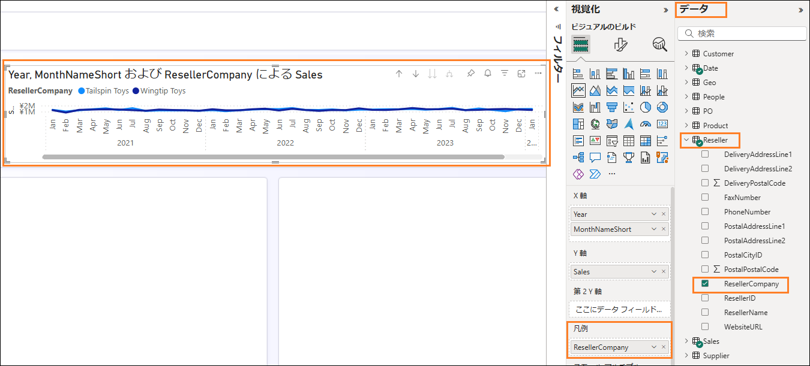

8. **視覚化**セクションで**ビジュアルの書式設定アイコン -\>
    ビジュアル**を選択します。

9. **線**セクションを展開します。

10. **設定の適用先** -\> **シリーズ ドロップダウン**で、**Tailspin
    Toys** を選択します。

11. **カラー** セクションを展開します。

12. **色**を **#F17925** に設定します。

13. **設定の適用先** -\> **シリーズ ドロップダウン**で、**Wingtip Toys**
    を選択します。

14. **色**を **#004753** に設定します。

15. **ビジュアル**のサイズを変更して、**スクリーンショットに表示されている右上のボックス**に移動します。

16. ビジュアルの右までスクロールして、**2024 年 4
    月までのデータがあることを確認します**。

    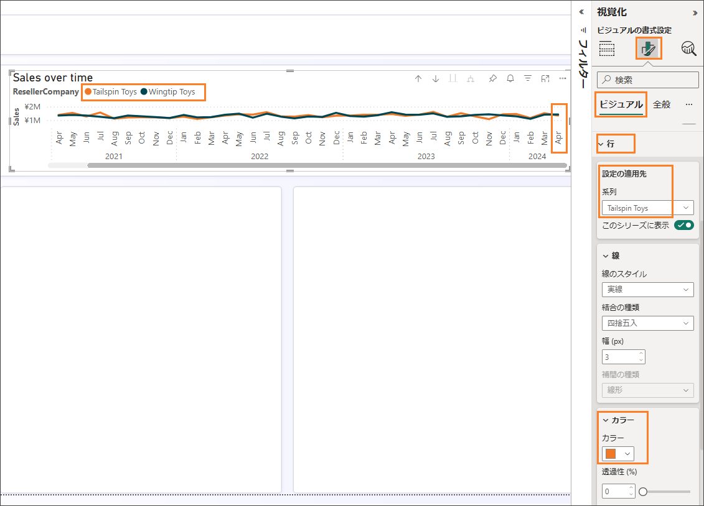

17. レポートを保存しましょう。メニューで**ファイル -\>
    保存**を選択します。

前にも説明していますが、このラボではすべてのビジュアルを作成するわけではありません。時間があるときに、その他のビジュアルをご自由に作成してください。

## タスク10: Power BI Desktop をセマンティック モデルに接続する

次に、Power BI Desktop をセマンティック
モデルに接続して、ビジュアルを構築するのがいかに簡単かを見てみましょう。

1. お使いのラボ環境の**デスクトップ**にある Reports フォルダー内の
    **FAIADTemplate.pbix** を開きます。

2. リボンから**ホーム -\> OneLake データ ハブ -\> Power BI
    セマンティック モデル**を選択します。

    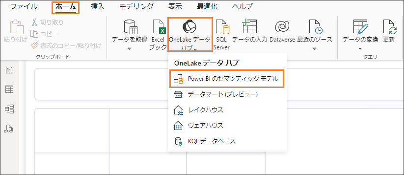

3. \[OneLake データ ハブ\] ダイアログが開きます。作成したセマンティック
    モデル sm_FAIAD を選択します。

4. **接続**を選択します。\[データ\] ペインに、セマンティック
    モデルからのテーブルがあることに注目してください。

    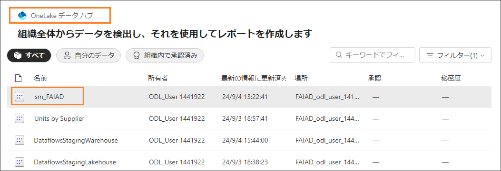

5. **左パネル**で、**モデル**
    **ビュー**を選択します。テーブル間のリレーションシップが表示されることに注目してください。

    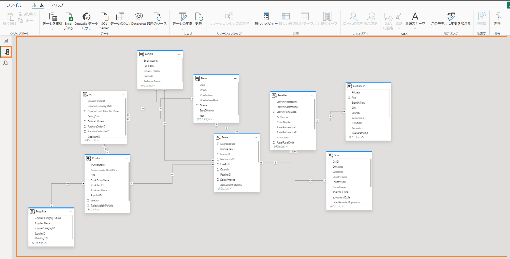

6. **左パネル**から**レポート ビュー**を選択して、レポート
    ビューに戻ります。

7. まだ開いていない場合は、お使いのラボ環境の**デスクトップ**にある
    **Reports** フォルダー内の **FAIAD.pbix** を開きます。

8. **レポート タイトルのビジュアル**を選択します。

9. リボンから**ホーム -\> コピー**を選択します。

    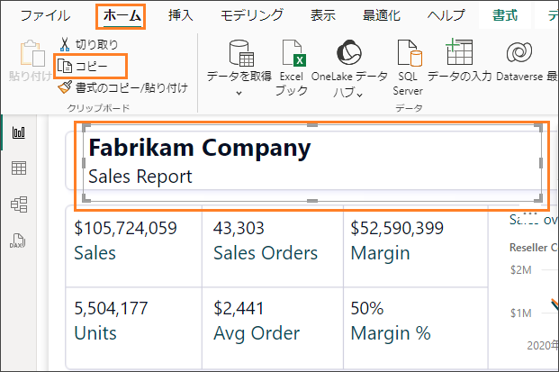

10. **FAIADTemplate.pbix** に移動し、レポート キャンバスを選択します。

11. リボンから**ホーム -\> 貼り付け**を選択します。

    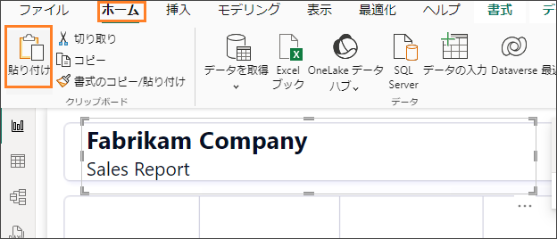

12. 同様に、**Sales と Units の KPI** をコピーして貼り付けます。参考 -
    複数のビジュアルを一緒にコピーして貼り付けることができます。

    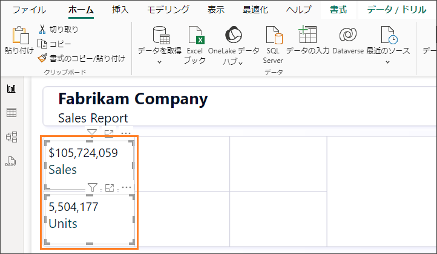

    既存のレポートからビジュアルをコピーし、セマンティック
    モデルに接続されているレポートに貼り付ける操作は簡単です。コピーと貼り付けを行う場合は、テーブル名、列名、メジャー名が同じであることが必要です。これらの名前が異なる場合は、エラーが発生する可能性があります。ただし、この問題は簡単に解決できます。

13. **FAIAD.pbix** に移動して、売上推移の折れ線グラフを選択します。

14. リボンから**ホーム -\> コピー**を選択します。

15. **FAIADTemplate.pbix** に移動し、レポート キャンバスを選択します。

16. リボンから**ホーム -\>
    貼り付け**を選択します。ビジュアルがレンダリングされないことを確認してください。これは現在、セマンティック
    モデルが日付フィールドから階層を作成しないためです。

17. これを修正しましょう。**視覚化**パネルの **X
    軸**で、**StartOfMonth** を削除します。

    

18. **データ ペイン**で **Date** テーブルを展開します。

19. **StartOfMonth** フィールドを **X**
    **軸**にドラッグします。これにより、ビジュアルが修正されます。場合によっては、ビジュアルを書式設定する必要があります。

    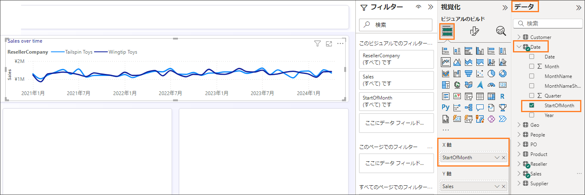

20. レポートを保存しましょう。リボンから**ファイル -\>
    保存**を選択します。

## タスク 11: 新しいデータを追加して Direct Lake モードをシミュレートする

通常、Import モードでは、ソース内のデータが更新されたら、Power BI
モデルを更新する必要があります。その後でレポート内のデータが更新されます。Direct
Query モードでは、ソースでデータが更新されると、Power BI
レポートで使用できるようになります。ただし、通常、direct query
モードは低速です。この問題を解決するために、Microsoft Fabric は Direct
Lake モードを導入しました。Direct Lake は、データをレイクから Power BI
エンジンに直接読み込んで分析できるようにするための高速パスです。

ADLS Gen2 でデータが更新され、更新を実行せずに変更が Power BI
レポートに直ちに反映されるシナリオを見てみましょう。

実際のシナリオでは、データはソースで更新されます。ここはトレーニング環境であるため、このシナリオをシミュレートします。2024
年 4 月までの販売データがあります。ADLS Gen2 で 2024 年 5
月のファイルへのショートカットを作成し、Sales ビューを更新して、2024 年
5 月の販売データを追加しましょう。

1. **ブラウザー**に戻ります。

2. 左のメニュー バーで **FAIAD\_\<ユーザー名\>**
    を選択して、ワークスペースのホームに移動します。

3. **lh_FAIAD** を選択して、レイクハウスに移動します。

    

4. 左側の**エクスプローラー
    ペイン**で、**テーブル**の横にある**省略記号**を選択します。

5. **新しいショートカット**を選択します。

    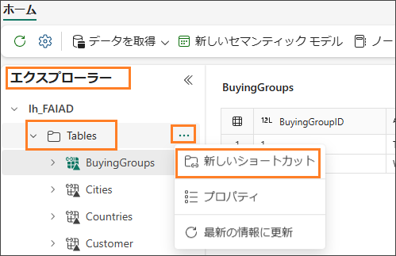

6. \[新しいショートカット\]
    ダイアログが開きます。**外部ソース**で、**Azure Data Lake Storage
    Gen2** を選択します。

    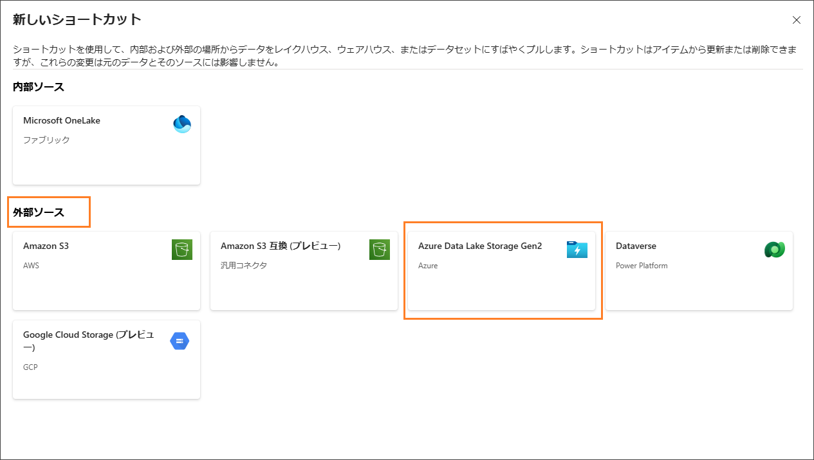

7. このラボの前半で接続を作成したため、新しい接続を作成する必要はなく、ADLS
    接続は既存の接続の下に表示されます。

8. このコースの前半でこの接続を作成しなかった場合は、**新しい接続の作成**をクリックして、次の手順に従います。

9. **\[接続設定\] -\> \[URL**\] に、リンク `https://stvnextblobstorage.dfs.core.windows.net/fabrikam-sales` を入力します。

10. **次へ**を選択します。

    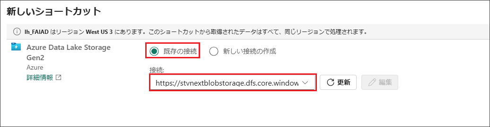

11. ADLS Gen2
    に接続され、左パネルにディレクトリ構造が表示されます。Delta-Parquet-Format-FY25
    を展開します。

12. **Sales.Invoices_May** を選択します。

13. **次へ**を選択します。

    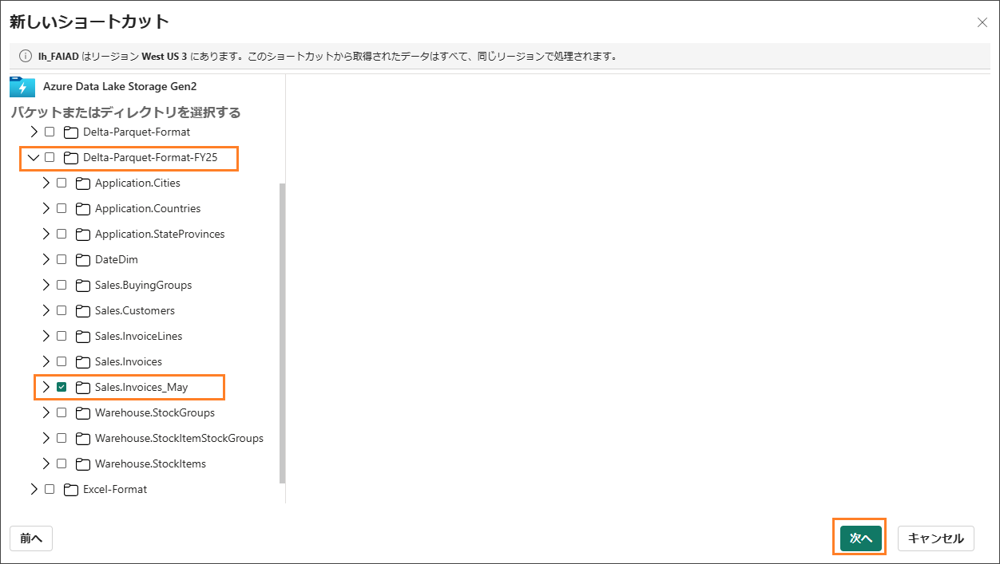

14. 名前を編集できる次のダイアログが表示されます。 Sales.Invoices_May の
    \[アクション\] の下にある**編集アイコン**を選択します。

15. 名前を **Sales.Invoices_May から InvoicesMay に**変更します。

16. 名前の横にある**チェック マーク**を選択して、変更を保存します。

17. **作成**を選択します。

    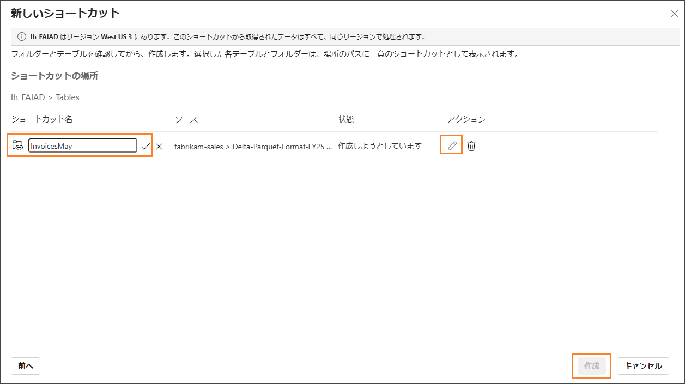

    左側の**エクスプローラー ペイン**に、InvoicesMay
    テーブルが表示されます。次に、Sales ビューを更新する必要があります。

18. 画面の**右上**で、**レイクハウス -\> SQL
    分析エンドポイント**を選択します。

    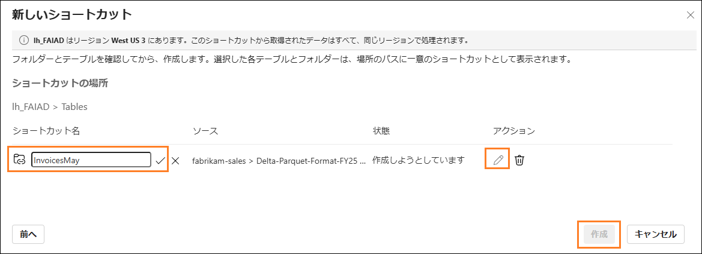

19. 上部のメニューから**ホーム -\> 新規 SQL クエリ**を選択します。新しい
    SQL クエリ ペインが開きます。

20. 次のコードを**コピー**して、SQL クエリ ペインに**貼り付け**ます。

```
ALTER VIEW [dbo].[Sales] AS (
select [$Outer].[InvoiceLineID] as [InvoiceLineID],
    [$Outer].[InvoiceID] as [InvoiceID],
    [$Outer].[StockItemID] as [StockItemID],
    [$Outer].[Quantity] as [Quantity],
    [$Outer].[UnitPrice] as [UnitPrice],
    [$Outer].[TaxRate] as [TaxRate],
    [$Outer].[TaxAmount] as [TaxAmount],
    [$Outer].[LineProfit] as [LineProfit],
    [$Outer].[ExtendedPrice] as [ExtendedPrice],
    [$Outer].[CustomerID] as [ResellerID],
    [$Outer].[SalespersonPersonID] as [SalespersonPersonID],
    [$Outer].[InvoiceDate] as [InvoiceDate],
    [$Outer].[t0_0] as [Sales Amount]
from 
(
    select [_].[InvoiceLineID] as [InvoiceLineID],
        [_].[InvoiceID] as [InvoiceID],
        [_].[StockItemID] as [StockItemID],
        [_].[Quantity] as [Quantity],
        [_].[UnitPrice] as [UnitPrice],
        [_].[TaxRate] as [TaxRate],
        [_].[TaxAmount] as [TaxAmount],
        [_].[LineProfit] as [LineProfit],
        [_].[ExtendedPrice] as [ExtendedPrice],
        [_].[CustomerID] as [CustomerID],
        [_].[SalespersonPersonID] as [SalespersonPersonID],
        [_].[InvoiceDate] as [InvoiceDate],
        [_].[ExtendedPrice] - [_].[TaxAmount] as [t0_0]
    from 
    (
        select [$Outer].[InvoiceLineID],
            [$Outer].[InvoiceID],
            [$Outer].[StockItemID],
            [$Outer].[Quantity],
            [$Outer].[UnitPrice],
            [$Outer].[TaxRate],
            [$Outer].[TaxAmount],
            [$Outer].[LineProfit],
            [$Outer].[ExtendedPrice],
            [$Inner].[CustomerID],
            [$Inner].[SalespersonPersonID],
            [$Inner].[InvoiceDate]
        from [lh_FAIAD].[dbo].[InvoiceLineItems] as [$Outer]
        inner join 
        (
            select [_].[InvoiceID] as [InvoiceID2],
                [_].[CustomerID] as [CustomerID],
                [_].[BillToResellerID] as [BillToResellerID],
                [_].[OrderID] as [OrderID],
                [_].[DeliveryMethodID] as [DeliveryMethodID],
                [_].[ContactPersonID] as [ContactPersonID],
                [_].[AccountsPersonID] as [AccountsPersonID],
                [_].[SalespersonPersonID] as [SalespersonPersonID],
                [_].[PackedByPersonID] as [PackedByPersonID],
                [_].[InvoiceDate] as [InvoiceDate],
                [_].[CustomerPurchaseOrderNumber] as [CustomerPurchaseOrderNumber],
                [_].[IsCreditNote] as [IsCreditNote],
                [_].[CreditNoteReason] as [CreditNoteReason],
                [_].[Comments] as [Comments],
                [_].[DeliveryInstructions] as [DeliveryInstructions],
                [_].[InternalComments] as [InternalComments],
                [_].[TotalDryItems] as [TotalDryItems],
                [_].[TotalChillerItems] as [TotalChillerItems],
                [_].[DeliveryRun] as [DeliveryRun],
                [_].[RunPosition] as [RunPosition],
                [_].[ReturnedDeliveryData] as [ReturnedDeliveryData],
                [_].[ConfirmedDeliveryTime] as [ConfirmedDeliveryTime],
                [_].[ConfirmedReceivedBy] as [ConfirmedReceivedBy],
                [_].[LastEditedBy] as [LastEditedBy2],
                [_].[LastEditedWhen] as [LastEditedWhen2]
            from 
            (
                select [$Table].[InvoiceID] as [InvoiceID],
                    [$Table].[CustomerID] as [CustomerID],
                    [$Table].[BillToResellerID] as [BillToResellerID],
                    [$Table].[OrderID] as [OrderID],
                    [$Table].[DeliveryMethodID] as [DeliveryMethodID],
                    [$Table].[ContactPersonID] as [ContactPersonID],
                    [$Table].[AccountsPersonID] as [AccountsPersonID],
                    [$Table].[SalespersonPersonID] as [SalespersonPersonID],
                    [$Table].[PackedByPersonID] as [PackedByPersonID],
                    [$Table].[InvoiceDate] as [InvoiceDate],
                    [$Table].[CustomerPurchaseOrderNumber] as [CustomerPurchaseOrderNumber],
                    [$Table].[IsCreditNote] as [IsCreditNote],
                    [$Table].[CreditNoteReason] as [CreditNoteReason],
                    [$Table].[Comments] as [Comments],
                    [$Table].[DeliveryInstructions] as [DeliveryInstructions],
                    [$Table].[InternalComments] as [InternalComments],
                    [$Table].[TotalDryItems] as [TotalDryItems],
                    [$Table].[TotalChillerItems] as [TotalChillerItems],
                    [$Table].[DeliveryRun] as [DeliveryRun],
                    [$Table].[RunPosition] as [RunPosition],
                    [$Table].[ReturnedDeliveryData] as [ReturnedDeliveryData],
                    [$Table].[ConfirmedDeliveryTime] as [ConfirmedDeliveryTime],
                    [$Table].[ConfirmedReceivedBy] as [ConfirmedReceivedBy],
                    [$Table].[LastEditedBy] as [LastEditedBy],
                    [$Table].[LastEditedWhen] as [LastEditedWhen]
                from [lh_FAIAD].[dbo].[Invoices] as [$Table]
                union all select [$Table].[InvoiceID] as [InvoiceID],
                    [$Table].[CustomerID] as [CustomerID],
                    [$Table].[BillToResellerID] as [BillToResellerID],
                    [$Table].[OrderID] as [OrderID],
                    [$Table].[DeliveryMethodID] as [DeliveryMethodID],
                    [$Table].[ContactPersonID] as [ContactPersonID],
                    [$Table].[AccountsPersonID] as [AccountsPersonID],
                    [$Table].[SalespersonPersonID] as [SalespersonPersonID],
                    [$Table].[PackedByPersonID] as [PackedByPersonID],
                    [$Table].[InvoiceDate] as [InvoiceDate],
                    [$Table].[CustomerPurchaseOrderNumber] as [CustomerPurchaseOrderNumber],
                    [$Table].[IsCreditNote] as [IsCreditNote],
                    [$Table].[CreditNoteReason] as [CreditNoteReason],
                    [$Table].[Comments] as [Comments],
                    [$Table].[DeliveryInstructions] as [DeliveryInstructions],
                    [$Table].[InternalComments] as [InternalComments],
                    [$Table].[TotalDryItems] as [TotalDryItems],
                    [$Table].[TotalChillerItems] as [TotalChillerItems],
                    [$Table].[DeliveryRun] as [DeliveryRun],
                    [$Table].[RunPosition] as [RunPosition],
                    [$Table].[ReturnedDeliveryData] as [ReturnedDeliveryData],
                    [$Table].[ConfirmedDeliveryTime] as [ConfirmedDeliveryTime],
                    [$Table].[ConfirmedReceivedBy] as [ConfirmedReceivedBy],
                    [$Table].[LastEditedBy] as [LastEditedBy],
                    [$Table].[LastEditedWhen] as [LastEditedWhen]
                from [lh_FAIAD].[dbo].[InvoicesMay] as [$Table]
            ) as [_]
        ) as [$Inner] on ([$Outer].[InvoiceID] = [$Inner].[InvoiceID2] or [$Outer].[InvoiceID] is null and [$Inner].[InvoiceID2] is null)
    ) as [_]
) as [$Outer]
where exists 
(
    select 1
    from 
    (
        select [ResellerID]
        from [lh_FAIAD].[dbo].[Reseller] as [$Table]
    ) as [$Inner]
    where [$Outer].[CustomerID] = [$Inner].[ResellerID] or [$Outer].[CustomerID] is null and [$Inner].[ResellerID] is null
)
)
```
21. ビジュアル クエリのメニューから実行を選択してコードを実行します。
コードが実行されると、Sales テーブルが更新され、2024 年 5 月のデータが含まれます。

    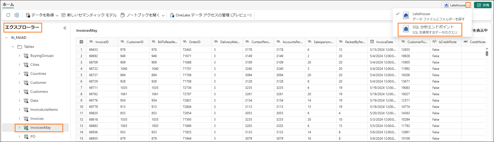

22. 左メニュー バーから **rpt_Sales_Report**
    を選択して、レポートに戻ります。

23. 上部のメニューで、**更新**を選択します。折れ線グラフに 2024 年 5
    月のデータが示されていることに注意してください。また、Sales の金額と
    Units も増加しています。

    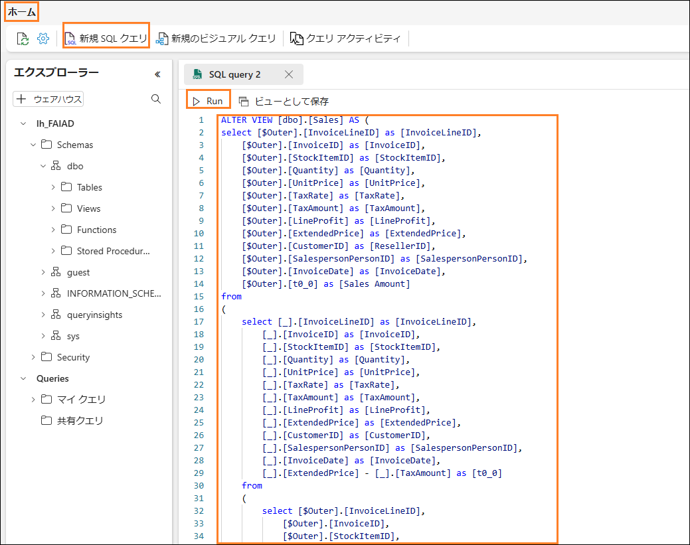

データが変更されたときに、データ
モデルとレポートを更新する必要はありません。これが Direct Lake と Direct
query の利点です。

問題の内容にリストされている課題をもう一度見てみましょう。

- **各種データ ソースごとに異なる更新時間に対応するには、1
    日に少なくとも 3 回はデータセットを更新する必要があります。**

Direct Lake
を使用してこれを解決しました。個々のデータフローはスケジュールに従って更新されます。データセットとレポートを更新する必要はありません。

- **ソース
    システムで発生したすべての更新を取得するために毎回完全な更新を行う必要があるため、更新操作は時間がかかります。**

これについても Direct Lake
を使用して解決しました。個々のデータフローはスケジュールに従って更新されます。データセットとレポートを更新する必要はないため、完全な更新について心配する必要はありません。

- **取得元のデータ
    ソースでエラーが発生すると、データセットの更新が中断されます。従業員ファイルが時間どおりにアップロードされず、データセットの更新が中断されてしまうことが何度もあります。**

データ
パイプラインを使用すると、エラー時およびさまざまな間隔で更新を再試行できるようになり、この問題の解決に役立ちます。

- **データ モデルに変更を加えるのに非常に長い時間がかかります。データ
    サイズが大きくて変換が複雑だと、Power Query
    によるプレビューの更新に時間がかかるためです。**

データフローとレイクハウスは効率的で、変更が簡単であることを確認しました。通常、データフローとレイクハウスのプレビューは読み込みにそれほど時間がかかりません。

- **社内標準は Mac ですが、Power BI Desktop を使用するには Windows PC
    が必要です。**

Microsoft Fabric は SaaS
オファリングです。必要となるのは、サービスにアクセスするためのブラウザーだけです。デスクトップにソフトウェアをインストールする必要はありません。

# ラボ環境をクリーンアップする

ラボ環境をクリーンアップする準備ができたら、以下のステップを実行します。

1. 左側のパネルで **FAIAD\_\<ユーザー名\>**
    ワークスペースを選択して、ワークスペースのホームに移動します。

2. 上部のメニューで**ワークスペースの設定**を選択します。

    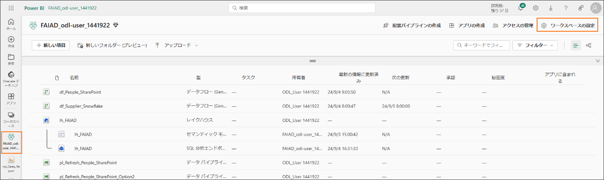

3. \[ワークスペースの設定\]
    ダイアログが開きます。**全般**セクションで、下にスクロールします。

4. **このワークスペースを削除する**を選択します。

5. ワークスペースを削除するダイアログが開きます。**削除**を選択します。

    これで、ワークスペースとワークスペースに含まれていたすべての項目が削除されます。

    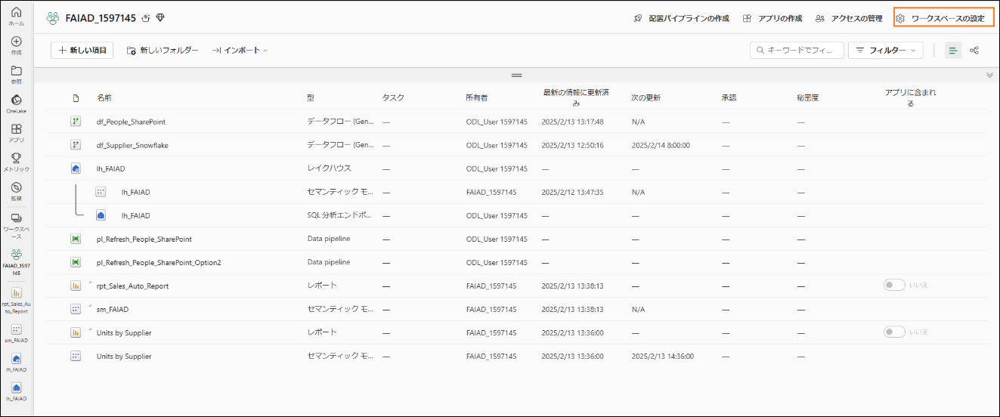

# リファレンス

Fabric Analyst in a Day (FAIAD) では、Microsoft Fabric
で使用できる主要な機能の一部をご紹介します。サービスのメニューにあるヘルプ
(?) セクションには、いくつかの優れたリソースへのリンクがあります。

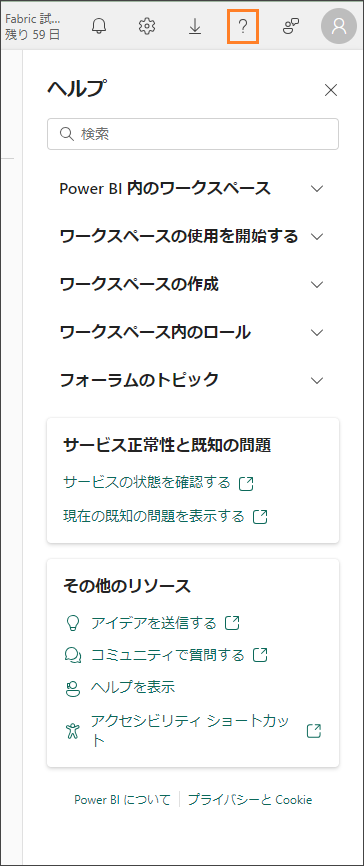

Microsoft Fabric
の次のステップに役立つリソースをいくつか以下に紹介します。

- ブログ記事で [Microsoft Fabric の GA
    に関するお知らせ](https://aka.ms/Fabric-Hero-Blog-Ignite23)の全文を確認する

- [ガイド付きツアー](https://aka.ms/Fabric-GuidedTour)を通じて Fabric
    を探索する

- [Microsoft Fabric
    の無料試用版](https://aka.ms/try-fabric)にサインアップする

- [Microsoft Fabric の Web
    サイト](https://aka.ms/microsoft-fabric)にアクセスする

- [Fabric
    の学習モジュール](https://aka.ms/learn-fabric)で新しいスキルを学ぶ

- [Fabric の技術ドキュメント](https://aka.ms/fabric-docs)を参照する

- [Fabric 入門編の無料の
    e-book](https://aka.ms/fabric-get-started-ebook) を読む

- [Fabric
    コミュニティ](https://aka.ms/fabric-community)に参加し、質問の投稿やフィードバックの共有を行い、他のユーザーから学びを得る

より詳しい Fabric
エクスペリエンスのお知らせに関するブログを参照してください。

- [Fabric の Data Factory
    エクスペリエンスに関するブログ](https://aka.ms/Fabric-Data-Factory-Blog) 

- [Fabric の Synapse Data Engineering
    エクスペリエンスに関するブログ](https://aka.ms/Fabric-DE-Blog) 

- [Fabric の Synapse Data Science
    エクスペリエンスに関するブログ](https://aka.ms/Fabric-DS-Blog) 

- [Fabric の Synapse Data Warehousing
    エクスペリエンスに関するブログ](https://aka.ms/Fabric-DW-Blog) 

- [Fabric の Synapse Real-Time Analytics
    エクスペリエンスに関するブログ](https://aka.ms/Fabric-RTA-Blog)

- [Power BI のお知らせに関するブログ](https://aka.ms/Fabric-PBI-Blog)

- [Fabric の Data Activator
    エクスペリエンスに関するブログ](https://aka.ms/Fabric-DA-Blog) 

- [Fabric
    の管理とガバナンスに関するブログ](https://aka.ms/Fabric-Admin-Gov-Blog)

- [Fabric の OneLake
    に関するブログ](https://aka.ms/Fabric-OneLake-Blog)

- [Dataverse と Microsoft Fabric
    の統合に関するブログ](https://aka.ms/Dataverse-Fabric-Blog)

© 2023 Microsoft Corporation. All rights reserved.

このデモ/ラボを使用すると、次の条件に同意したことになります。

このデモ/ラボで説明するテクノロジまたは機能は、ユーザーのフィードバックを取得し、学習エクスペリエンスを提供するために、Microsoft
Corporation
によって提供されます。ユーザーは、このようなテクノロジおよび機能を評価し、Microsoft
にフィードバックを提供するためにのみデモ/ラボを使用できます。それ以外の目的には使用できません。このデモ/ラボまたはその一部を、変更、コピー、配布、送信、表示、実行、再現、発行、ライセンス、著作物の作成、転送、または販売することはできません。

複製または再頒布のために他のサーバーまたは場所にデモ/ラボ
(またはその一部)
をコピーまたは複製することは明示的に禁止されています。

このデモ/ラボは、前に説明した目的のために複雑なセットアップまたはインストールを必要としないシミュレーション環境で潜在的な新機能や概念などの特定のソフトウェア
テクノロジ/製品の機能を提供します。このデモ/ラボで表されるテクノロジ/概念は、フル機能を表していない可能性があり、最終バージョンと動作が異なることがあります。また、そのような機能や概念の最終版がリリースされない場合があります。物理環境でこのような機能を使用するエクスペリエンスが異なる場合もあります。

**フィードバック**。このデモ/ラボで説明されているテクノロジ、機能、概念に関するフィードバックを
Microsoft
に提供する場合、ユーザーは任意の方法および目的でユーザーのフィードバックを使用、共有、および商品化する権利を無償で
Microsoft
に提供するものとします。また、ユーザーは、フィードバックを含む
Microsoft
のソフトウェアまたはサービスの特定部分を使用したり特定部分とインターフェイスを持ったりする製品、テクノロジ、サービスに必要な特許権を無償でサード
パーティに付与します。ユーザーは、フィードバックを含めるために
Microsoft がサード
パーティにソフトウェアまたはドキュメントをライセンスする必要があるライセンスの対象となるフィードバックを提供しません。これらの権限は、本契約の後も存続します。

Microsoft Corporation
は、明示、黙示、または法律上にかかわらず、商品性のすべての保証および条件、特定の目的、タイトル、非侵害に対する適合性など、デモ/ラボに関するすべての保証および条件を拒否します。Microsoft
は、デモ/ラボから派生する結果、出力の正確さ、任意の目的に対するデモ/ラボに含まれる情報の適合性に関して、いかなる保証または表明もしません。

**免責事項**

このデモ/ラボには、Microsoft Power BI
の新機能と機能強化の一部のみが含まれています。一部の機能は、製品の将来のリリースで変更される可能性があります。このデモ/ラボでは、新機能のすべてではなく一部について学習します。

