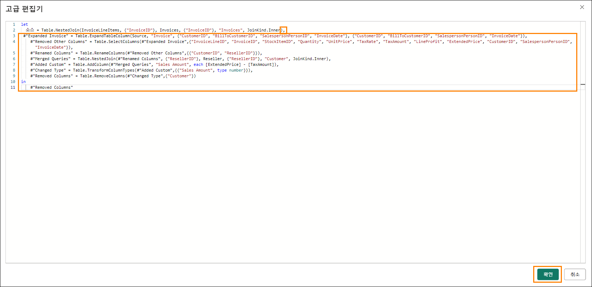

# Microsoft Fabric Fabric Analyst in a Day - 랩 3


# 목차

- 소개

- ADLS Gen2 바로 가기

  - 작업 1: 바로 가기 만들기

  - 시각적 쿼리를 사용하여 데이터 변환

  - 작업 2: 시각적 쿼리를 사용하여 Geo 뷰 만들기

  - 작업 3: 시각적 쿼리를 사용하여 Reseller 뷰 만들기

  - 작업 4: 시각적 쿼리를 사용하여 Sales 뷰 만들기

  - 작업 5: 시각적 쿼리를 사용하여 Product 뷰 만들기

- 참조

# 소개 

우리 시나리오에서 매출 데이터는 ERP 시스템에서 제공되며 ADLS Gen2에 저장됩니다. 매일 정오/오후 12시에 업데이트됩니다. 이 데이터를 레이크하우스로 변환하고 수집하여 모델에서 사용해야 합니다.

데이터를 수집할 수 있는 방법은 다양합니다.

- **바로 가기:** 이렇게 하면 데이터에 대한 링크가 만들어지고 시각적 쿼리 뷰를 사용하여 데이터를 변환할 수 있습니다. 이 랩에서는 바로 가기를 사용하겠습니다.

- **Notebooks:** 이를 위해서는 코드를 작성해야 합니다. 이는 개발자 친화적인 방식입니다.

- **데이터 흐름 2세대:** 아마도 Power Query 또는 데이터 흐름 1세대에 익숙할 것입니다. 데이터 흐름 2세대는 이름에서 알 수 있듯이 데이터 흐름의 최신 버전입니다. 이는 데이터를 여러 데이터 원본으로 변환하고 수집하는 추가 기능과 함께 Power Query / 데이터 흐름 1세대의 모든 기능을 제공합니다. 다음 두 랩에서 이것을 소개할 것입니다.

- **데이터 파이프라인:** 이는 오케스트레이션 도구입니다. 데이터를 추출, 변환, 수집하도록 활동을 조정할 수 있습니다. 데이터 파이프라인을 사용하여 데이터 흐름 2세대 활동을 실행하여 추출, 변환, 수집이 수행되도록 할 수 있습니다.

먼저 ADLS Gen2 데이터 원본의 데이터를 레이크하우스로 수집하는 바로 가기를 생성하겠습니다. 수집된 후에는 시각적 쿼리 뷰를 사용하여 변환합니다.

이 랩을 마치면 다음 사항을 알게 됩니다.

- 레이크하우스에서 바로 가기 생성 방법

- 시각적 쿼리 기능을 사용하여 데이터를 변환하는 방법

# ADLS Gen2 바로 가기

### 작업 1: 바로 가기 만들기

바로 가기를 사용하여 대상 위치로 이동하는 링크를 생성할 수 있습니다. 바로 가기를 통해 데이터를 레이크하우스로 물리적으로 이동하지 않고도 데이터에 액세스할 수 있습니다. 이것은 Windows 바탕 화면에 바로 가기를 만드는 것과 같습니다.

1. 이제 랩 2의 작업 8에서 생성한 **Fabric 작업 영역 (1)** 으로 돌아갑니다.

2. 이전 랩에서 다른 곳으로 이동하지 않은 경우 레이크하우스 화면이 표시됩니다. 다른 곳으로 이동해도 괜찮습니다. **lh_FAIAD** (**2)** 를 선택하여 레이크하우스로 이동합니다.

3. **탐색기** 창에서 **Tables** 옆의 **말줄임표 (3)** 를 선택합니다.

4. **새 바로 가기 (4)** 를 선택합니다.

    

5. **새 바로 가기** 대화 상자가 열립니다. **외부 원본**에서 **Azure Data Lake Storage Gen2** 를 선택합니다.

    

6. **새 연결 만들기 (1)** 을 선택합니다.

7. **URL** 속성에 다음 링크를 입력합니다. <https://stvnextblobstorage.dfs.core.windows.net/fabrikam-sales> **(2):**

8. 인증 종류 드롭다운에서 **SAS(공유 액세스 서명) (3)** 을 선택합니다.

9. SAS 토큰을 복사하여 SAS 토큰 (4) 필드에 붙여넣습니다.

   - **SAS 토큰:**

10. 화면 오른쪽 하단에서 **다음 (5)** 을 선택합니다.

    

11. 왼쪽 패널에 디렉터리 구조가 표시된 ADLS Gen2에 연결됩니다. **Delta-Parquet-Format-FY25 (1)** 를 확장합니다.

12. 다음 디렉터리 **(2)** 를 **선택** 한 후 **다음 (3)** 을 클릭합니다.

    a. Application.Cities

    b. Application.Countries

    c. Application.StateProvinces

    d. DateDim

    e. Sales.BuyingGroups

    f. Sales.Customers

    g. Sales.InvoiceLines

    h. Sales.Invoices

    i. Warehouse.StockGroups

    j. Warehouse.StockItemStockGroups

    k. Warehouse.StockItems

**참고**: Sales.Invoices_May는 선택되지 **않은** 유일한 디렉터리입니다.

   

13. 이름을 편집할 수 있는 다음 대화 상자로 이동합니다. **Application.Cities**에 대한 작업에서 **편집 아이콘 (1)** 을 선택합니다.

14. **Application.Cities를 Cities (2)** 로 이름을 변경합니다.

15. 이름 옆의 확인 표시를 선택하여 변경 사항을 저장합니다 **(3)**.

    

16. 마찬가지로 바로 가기 이름도 아래와 같이 이름을 바꿉니다.

    a. Application.Countries에서 **Countries**로

    b. Application.StateProvinces에서 **States**로

    c. DateDim에서 **Date**로

    d. Sales.BuyingGroups에서 **BuyingGroups**로

    e. Sales.Customers에서 **Customers**로

    f. Sales.InvoiceLines에서 **InvoiceLineItems**로

    g. Sales.Invoices에서 **Invoices**로

    h. Warehouse.StockGroups에서 **ProductGroups**로

    i. Warehouse.StockItemStockGroups에서 **ProductItemGroup**로

    j. Warehouse.StockItems에서 **ProductItem**로

> **참고**: 이름을 다시 확인하세요. 랩 도중 오타로 인해 오류가 발생할 수 있습니다.

17. **만들기**를 선택하여 바로 가기를 만듭니다.

    

18. 모든 바로 가기가 Tables로 생성되는 것을 확인할 수 있습니다. **BuyingGroups** 테이블을 선택하면 데이터 창에서 데이터 미리 뷰를 볼 수 있습니다.

    

다음 단계는 의미 체계 모델을 만들 수 있도록 데이터를 변환하는 것입니다.
데이터를 변환하는 뷰를 만들겠습니다.

# 시각적 쿼리를 사용하여 데이터 변환

### 작업 2: 시각적 쿼리를 사용하여 Geo 뷰 만들기

1. SQL 엔드포인트를 사용하여 레이크하우스에 액세스할 수 있습니다. 이를 통해 데이터를 쿼리하고 뷰를 만들 수 있습니다. 화면 **오른쪽 상단**에서 **Lakehouse (1) -> SQL 분석 엔드포인트 (2)** 를 선택합니다.

    

SQL 분석 엔드포인트로 이동합니다. 탐색기 패널이 변경된 것을 확인할 수 있습니다. 이제 뷰, 저장 프로시저, 쿼리 등을 만들 수 있습니다. Power Query와 같은 로우 코드 인터페이스를 제공하는 시각적 쿼리를 만들려고 합니다. 결과를 뷰로 저장합니다.

먼저 Geo 뷰를 생성하겠습니다. Geo 뷰를 생성하기 위해 Cities, States, Countries 테이블의 데이터를 병합해야 합니다.

2. 상단 메뉴에서 **새 SQL 쿼리 (1)** 옆의 드롭다운을 클릭하고 **새 시각적 쿼리 (2)** 를 선택합니다.

    

3. 쿼리를 작성하려면 시각적 쿼리 패널에 테이블을 추가해야 합니다. **Cities (1)** 테이블 옆의 말줄임표를 클릭하고 **캔버스에 삽입(2)** 을 선택합니다.

    

4. **States**와 **Countries** 테이블에 대해서도 동일한 단계를 반복합니다.

다음으로, 이 쿼리들을 병합해야 합니다. 시각적 쿼리 편집기에는 Power Query 편집기를 사용할 수 있는 옵션이 있습니다. 익숙한 기능이니 이 기능을 사용해보겠습니다.

5. 시각적 쿼리 편집기 메뉴 오른쪽의 **팝업으로 열기** 아이콘을 선택합니다. Power Query 편집기로 이동합니다.

    

6. Cities 쿼리를 선택한 상태 (1)에서 Power Query 편집기 리본 메뉴에서 **홈 (2) -> 결합 (3) -> 쿼리 병합 드롭다운 (4) -> 쿼리를 새 항목으로 병합 (5)** 을 선택합니다. 쿼리 병합 대화 상자가 열립니다.

    

7. **병합할 왼쪽 테이블**에서 **Cities**를 선택합니다.

8. **병합할 오른쪽 테이블**에서 **States**를 선택합니다.

9. 두 테이블에서 **StateProvinceID** 열을 선택합니다. 이 열을 사용하여 조인할 것입니다.

10. **조인 종류**로 **안쪽**을 선택합니다.

11. **확인**을 선택합니다.

    

병합이라는 새 쿼리가 생성되었음을 알 수 있습니다. States에서 열이 몇 개 필요합니다.

12. **Data 뷰**(아래쪽 패널)에서 **States** 열(오른쪽 마지막 열) 옆에 있는 **이중 화살표**를 클릭합니다.

13. 패널이 열립니다. 다음 열을 **선택**합니다.

    a. StateProvinceCode

    b. StateProvinceName

    c. CountryID

    d. SalesTerritory

14. **확인**을 선택합니다.

    

이제 Countries 쿼리를 병합해야 합니다.

15. 쿼리 병합을 선택한 상태 (1)에서 리본 메뉴에서 **홈 (2) -> 결합 (3) -> 쿼리 병합 드롭다운 (4) -> 쿼리 병합 (5)** 을 선택합니다.

    

16. 쿼리 병합 대화 상자가 열립니다. **병합할 오른쪽 테이블**에서 **Countries**를 선택합니다.

17. 두 테이블에서 **CountryID** 열을 선택합니다. 이 열을 사용하여 조인할 것입니다.

18. **조인 종류**로 **안쪽**을 선택합니다.

19. **확인**을 선택합니다.

    

Countries에서 열이 몇 개 필요합니다.

20. **Data 뷰**(하단 패널)에서 **Countries** 열 옆의 **이중 화살표**를 클릭합니다.

21. 패널이 열립니다. 다음 열을 **선택**합니다.

    a. CountryName

    b. FormalName

    c. IsoAlpha3Code

    d. IsoNumericCode

    e. CountryType

    f. Continent

    g. Region

    h. Subregion

22. **확인**을 선택합니다.

    

모든 열이 필요하지는 않습니다. 필요한 항목만 선택해야 합니다.

23. 쿼리 병합을 선택한 상태에서 리본 메뉴에서 **홈 -> 열 선택 -> 열 선택**을 선택합니다.

**참고:** 열 선택 옵션이 보이지 않는 경우 열 관리 항목 하단에서 찾을 수
있습니다.

  

24. 열 선택 대화 상자가 열립니다. 다음 열을 **선택 취소**합니다.

    a. StateProvinceID

    b. Location

    c. LastEditedBy

    d. ValidFrom

    e. ValidTo
    
    f. CountryID

25. **확인**을 선택합니다.

    

오른쪽의 적용된 단계 패널과 시각적 뷰 모두에 모든 단계가 기록되어 있으며, 프로세스는 Power Query와 같습니다. 이 쿼리에서 데이터가 로드되도록 쿼리 병합 및 로드 활성화의 이름을 변경하겠습니다.

26. 쿼리(왼쪽) 패널에서 **Merge** 쿼리를 **마우스 오른쪽 버튼으로 클릭**합니다. **이름 바꾸기**를 선택하고 쿼리 이름을 **Geo**로 바꿉니다.

27. 쿼리(왼쪽) 패널에서 **Geo** 쿼리를 **마우스 오른쪽 버튼으로 클릭**합니다. **로드 사용**을 선택하여 이 쿼리를 활성화합니다.

28. Cities, States 및 Countries쿼리가 **비활성화**되어 있는지 확인합니다.

29. Power Query 편집기의 오른쪽 하단에서 **저장**을 선택합니다.

    

시각적 쿼리 편집기로 이동합니다. 이제 이 쿼리를 뷰로 저장해 보겠습니다.

**참고**: Power Query 편집기를 사용하여 수행한 모든 단계는 시각적 쿼리 편집기를 통해서도 수행할 수 있습니다.

30. 시각적 쿼리 편집기 메뉴에서 **뷰로 저장**을 선택합니다.

    

뷰로 저장 대화 상자가 열립니다. SQL 쿼리가 사용 가능하다는 것을 알 수 있습니다. SQL을 검토하고 싶다면 검토할 수 있습니다.

31. **보기 이름**으로 **Geo**를 입력합니다.

32. **확인**을 선택하여 뷰를 저장합니다.

    

뷰가 저장되면 알림을 받게 됩니다.

33. 탐색기(왼쪽) 패널에서 **Views** 를 펼칩니다. 새로 생성된 Geo 뷰가 있습니다.

    

### 작업 3: 시각적 쿼리를 사용하여 Reseller 뷰 만들기

Customers 테이블과 BuyingGroups 테이블을 병합하여 생성되는 Reseller 뷰를 만들어 보겠습니다. 이번에는 시각적 쿼리를 사용하여 뷰를 만들어 보겠습니다.

1. 상단 메뉴에서 **새 SQL 쿼리 (1)** 옆의 드롭다운을 클릭하고 **새 시각적 쿼리 (2)** 를 선택합니다.

2. 쿼리를 작성하려면 시각적 쿼리 패널에 테이블을 추가해야 합니다. **BuyingGroups (1)** 테이블 옆의 말줄임표를 클릭하고 **캔버스에 삽입(2)** 을를 선택합니다.

    

3. **Customers** 테이블에 대해 동일한 단계를 반복합니다.

4. **Customers** 쿼리를 선택합니다. 선택하면 Customers에 파란색 테두리가 생기고 테이블 뒤에 "**+**" 기호가 표시됩니다(이는 테이블 뒤에 단계를 추가하고 있음을 나타냅니다). 테이블 뒤에 '**+**' 기호가 표시되지 않으면 다른 단계를 선택했을 수 있습니다. Table을 선택하면 바로 사용할 수 있습니다.

5. 시각적 쿼리 메뉴에서 **결합 -> 쿼리 병합**을 선택합니다.

    

병합 대화 상자가 열리고 Customers가 맨 위 테이블로 선택되어 있습니다.

6. **병합할 오른쪽 테이블**에서 **BuyingGroups**를 선택합니다.

7. 두 테이블에서 **BuyingGroupID** 열을 선택합니다. 이 열을 사용하여 조인할 것입니다.

8. **조인 종류**로 **안쪽**을 선택합니다.

9. **확인**을 선택합니다.

    

10. **데이터 뷰**(아래쪽 패널)에서 **BuyingGroups** 열(오른쪽 마지막 열) 옆의 **이중 화살표**를 클릭하여 BuyingGroups에서 필요한 열을 선택합니다.

11. 패널이 열립니다. **BuyingGroupName** 열을 **선택**합니다.

12. **확인**을 선택합니다.

    

모든 열이 필요하지는 않습니다. 필요한 것만 선택해 보겠습니다.

13. 시각적 쿼리 메뉴에서 **열 관리 -> 열 선택**을 선택합니다.

    

14. 열 선택 대화 상자가 열립니다. 다음 열을 **선택**합니다.

    a. ResellerID

    b. ResellerName

    c. PostalCityID

    d. PhoneNumber

    e. FaxNumber

    f. WebsiteURL

    g. DeliveryAddressLine1

    h. DeliveryAddressLine2

    i. DeliveryPostalCode

    j. PostalAddressLine1

    k. PostalAddressLine2

    l. PostalPostalCode

    m. BuyingGroupName

15. **확인**을 선택합니다.

    

16. BuyingGroupName 열의 이름을 변경해 보겠습니다. **데이터 뷰에서 BuyingGroupName** 열 머리글을 두 번 클릭하여 편집할 수 있도록 합니다.

17. 열 이름을 **ResellerCompany**로 **변경**합니다.

    

Customer 테이블에 모든 단계가 문서화되어 있습니다. 이제 이 뷰를 저장해
보겠습니다.

18. Customer 쿼리는 모든 단계에 포함되어 있으므로 저장해야 합니다. 로드 사용을 설정해야 합니다. **Customer** 쿼리 상자에서 **말줄임표**를 선택합니다.

19. **로드 사용**이 선택되어 있는지 확인합니다.

    

**참고**: 로드 사용이 선택되면 **Customer** 상자에 파란 테두리가
나타납니다.

20. 시각적 쿼리 메뉴에서 **뷰로 저장**을 선택합니다.

    

뷰로 저장 대화 상자가 열립니다. SQL 쿼리가 사용 가능하다는 것을 알 수
있습니다. 원하는 경우 검토할 수 있습니다.

21. **보기 이름**으로 **Reseller**를 입력합니다.

22. **확인**을 선택하여 뷰를 저장합니다.

    

뷰가 저장되면 알림을 받게 됩니다.

23. 탐색기(왼쪽) 패널에서 **Views**를 펼칩니다. 새로 생성된 Reseller 뷰가 있습니다.

    

### 작업 4: 시각적 쿼리를 사용하여 Sales 뷰 만들기

InvoiceLineItems 테이블과 Invoices 테이블을 Reseller 뷰에 병합하여
생성된 Sales 뷰를 만들어 봅시다. Power BI Desktop에는 이 쿼리가
있습니다. 고급 편집기에서 코드를 복사하겠습니다. 그러나 코드를 복사하기
전에 시각적 쿼리에서는 빈 쿼리를 만들 수 없으므로 시각적 쿼리를 사용하여
병합 테이블을 만들어야 합니다. 이 방법을 시도해 보겠습니다.

1. 상단 메뉴에서 **새 SQL 쿼리** 옆의 드롭다운을 클릭하고 **새 시각적 쿼리**를 선택합니다. 

    

2. **탐색기** 섹션에서 시각적 쿼리 패널에 테이블을 추가해야 합니다. **InvoiceLineItems** 테이블 옆의 말줄임표를 클릭하고 **Insert into canvas**를 선택합니다.

3. **Invoices** 테이블에 대해 동일한 단계를 반복합니다.

4. **탐색기 -> Views** 섹션에서 시각적 쿼리 패널에 테이블을 추가해야 합니다. **Reseller** 테이블 옆의 말줄임표를 클릭하고 **캔버스에 삽입**을 선택합니다.

5. 시각적 쿼리 편집기에서 **팝업으로 열기** 아이콘을 선택하여 Power Query 편집기를 엽니다.

    

6. **InvoiceLineItems** 쿼리를 선택한 상태에서 리본 메뉴에서 **홈 (2) -> 결합 (3) -> 쿼리 병합 드롭다운 (4) -> 쿼리를 새 항목으로 병합 (5)**을 선택합니다**.** 쿼리 병합 대화 상자가 열립니다.

    

7. **병합할 왼쪽 테이블**에서 **InvoiceLineItems**를 선택합니다.

8. **병합할 오른쪽 테이블**에서 **Invoices**를 선택합니다.

9. 두 테이블에서 **InvoiceID** 열을 선택합니다. 이 열을 사용하여 조인할 것입니다.

10. **조인 종류**로 **안쪽**을 선택합니다.

11. **확인**을 선택합니다.

    

Power BI Desktop에서 코드를 복사하여 고급 편집기를 사용하여 붙여
넣겠습니다.

12. 아직 열지 않았다면 랩 환경 바탕 화면의 **Reports** 폴더에 있는 **FAIAD**.**pbix**를 엽니다.

13. 리본 메뉴에서 **홈 -> 데이터 변환**을 선택합니다. Power Query 창이 열립니다. 이전 랩에서 알아본 것처럼 왼쪽 패널의 쿼리는 데이터 원본별로 구성됩니다.

    

14. 왼쪽의 **쿼리** 패널에서 **ADLSData** **(1)** 폴더 아래에 있는 **Sales (2)** 쿼리를 선택합니다 **.**

15. 리본 메뉴에서 **홈 -> 고급 편집기 (3)** 를 선택합니다. 고급 편집기 대화 상자가 열립니다.

    

**참고:** 고급 편집기를 찾을 수 없는 경우 **홈 -> 쿼리 -> 고급편집기**에서 액세스할 수 있습니다.

16. **3번째 줄**(#"Expanded Invoice"\...)부터 코드의 마지막 줄까지 코드를 선택합니다.

17. **마우스 오른쪽 버튼을 클릭**하고 **Copy**를 선택합니다.

18. **취소**를 선택하여 고급 편집기를 닫습니다.

    

19. Power Query 편집기가 열려 있는 **브라우저로 다시 이동**합니다.

20. 쿼리 **병합**이 선택되어 있는지 확인합니다.

21. 리본 메뉴에서 **홈 -> 고급 편집기**를 선택합니다. 고급 편집기 대화 상자가 열립니다.

    

22. **2번째 줄 끝에 쉼표를 추가합니다** (Source = Table.NestedJoin(InvoiceLineItems, {'InvoiceID'}, Invoices, {'InvoiceID'}, 'Invoices', JoinKind.Inner)

23. **Enter**를 클릭하여 새 줄을 시작합니다.

24. 키보드에서 **Ctrl+V**를 입력하여 Power BI Desktop에서 복사한 코드를 붙여 넣습니다.

**참고**: 랩 환경에서 일하는 경우 화면 오른쪽 상단의 **말줄임표 (...)** 를 선택하시기 바랍니다. 슬라이더를 사용하여 **VM 네이티브 클립보드**를 **활성화**합니다. 대화 상자에서 확인을 선택합니다. 쿼리 붙여 넣기가 완료되면 이 옵션을 비활성화할 수 있습니다.


25. 소스에서 마지막 두 줄의 코드를 강조 표시하고 **삭제**합니다.

26. **확인**을 선택하여 변경 내용을 저장합니다.

    

더 쉬운 방법은 고급 편집기에서 모든 코드를 삭제하고 아래 코드를 고급 편집기에 붙여 넣는 것입니다.

```
let 

  Source = Table.NestedJoin(InvoiceLineItems, {'InvoiceID'}, Invoices, {'InvoiceID'}, 'Invoices', JoinKind.Inner), 

    #'Expanded Invoice' = Table.ExpandTableColumn(Source, 'Invoices', {'CustomerID', 'BillToCustomerID', 'SalespersonPersonID', 'InvoiceDate'}, {'CustomerID', 'BillToCustomerID', 'SalespersonPersonID', 'InvoiceDate'}), 

    #'Removed Other Columns' = Table.SelectColumns(#'Expanded Invoice',{'InvoiceLineID', 'InvoiceID', 'StockItemID', 'Quantity', 'UnitPrice', 'TaxRate', 'TaxAmount', 'LineProfit', 'ExtendedPrice', 'CustomerID', 'SalespersonPersonID', 'InvoiceDate'}), 

    #'Renamed Columns' = Table.RenameColumns(#'Removed Other Columns',{{"CustomerID", "ResellerID"}}), 

    #'Merged Queries' = Table.NestedJoin(#'Renamed Columns', {'ResellerID'}, Reseller, {'ResellerID'}, 'Customer', JoinKind.Inner), 

    #'Added Custom' = Table.AddColumn(#'Merged Queries', 'Sales Amount', each [ExtendedPrice] - [TaxAmount]), 

    #'Changed Type' = Table.TransformColumnTypes(#'Added Custom',{{"Sales Amount", type number}}), 

    #"Removed Columns" = Table.RemoveColumns(#"Changed Type",{"Customer"}) 

in 

    #"Removed Columns" 
```

27. Power Query 편집기로 다시 이동합니다. 왼쪽의 쿼리 패널에서 쿼리 **병합을 두 번 클릭**하여 쿼리 이름을 바꿉니다.

28. 병합 쿼리의 이름을 **Sales**로 **바꿉니다**.

29. Sales 쿼리를 마우스 오른쪽 버튼으로 클릭하고 **로드 사용**을 선택하여 쿼리를 로드할 수 있도록 설정합니다.

    

30. **저장**을 선택하여 저장하고 Power Query 대화 상자를 닫습니다. 시각적 쿼리 편집기로 이동합니다.

31. 시각적 쿼리 메뉴에서 **뷰로 저장**을 선택합니다. 뷰로 저장 대화 상자가 열립니다. SQL 쿼리가 사용 가능하다는 것을 알 수 있습니다. 원하는 경우 검토할 수 있습니다.

32. **뷰 이름 (1)** 으로 **Sales**를 입력합니다.

33. **확인 (2)** 을 선택하여 보기를 저장합니다.

    

뷰가 저장되면 알림을 받게 됩니다.

34. 탐색기(왼쪽) 패널에서 **Views**를 펼칩니다. 새로 생성된 Sales 뷰가 있습니다.

    

### 작업 5: 시각적 쿼리를 사용하여 Product 뷰 만들기

**ProductItem**, **ProductItemGroup** 및 **ProductGroups** 테이블을
병합하여 생성되는 제품 보기를 만들어 보겠습니다. 작업을 진행하기 위해
고급 편집기에 코드를 복사하겠습니다.

1. 상단 메뉴에서 **새 SQL 쿼리 (1)** 옆의 드롭다운을 클릭하고 **새 시각적 쿼리 (2)** 를 선택합니다.

    

2. 탐색기 -> Views 섹션에서 시각적 쿼리 패널에 테이블을 추가해야 합니다. **ProductItem (1)** 테이블 옆의 줄임표를 클릭하고 **캔버스에 삽입(2)** 을 선택합니다.

    

3. **ProductItemGroup** 및 **ProductGroups** 테이블에 대해서도 동일한 단계를 반복합니다.

4. 시각적 쿼리 편집기에서 **포커스 모드 아이콘**을 선택하여 Power Query 편집기를 엽니다.

    

5. **ProductItem** 쿼리를 선택한 상태에서 리본 메뉴에서 **홈 (1) -> 결합 (2) -> 쿼리 병합 드롭다운 (3) -> 쿼리를 새 항목으로 병합 (4)** 을 선택합니다. 병합 대화 상자가 열립니다.

    

6. **병합할 왼쪽 테이블**에서 **ProductItem**을 선택합니다.

7. **병합할 오른쪽 테이블**에서 **ProductItemGroup**을 선택합니다.

8. 두 테이블에서 **StockItemID** 열을 선택합니다. 이 열을 사용하여 조인할 것입니다.

9. **조인 종류**로 **왼쪽 우선 외부**를 선택합니다.

10. **확인**을 선택합니다. 새 병합 쿼리가 만들어집니다.

    

11. 쿼리 병합을 선택한 상태에서 리본 메뉴에서 **홈 -> 고급 편집기**를 선택합니다. 고급 편집기 대화 상자가 열립니다.

    

**참고:** 고급 편집기를 찾을 수 없는 경우 **홈 -> 쿼리 -> 고급 편집기**에서 액세스할 수 있습니다.

12. 고급 편집기에서 **모든 코드를 선택**하고 **삭제**합니다.

13. 아래 코드를 고급 편집기에 **붙여 넣습니다**.

    ```
    let 

    Source = Table.NestedJoin(ProductItem, {'StockItemID'}, ProductItemGroup, {'StockItemID'}, 'ProductItemGroup', JoinKind.LeftOuter), 

    #'Expanded ProductItemGroup' = Table.ExpandTableColumn(Source, 'ProductItemGroup', {'StockGroupID'}, {'StockGroupID'}), 

    #'Merged queries' = Table.NestedJoin(#'Expanded ProductItemGroup', {'StockGroupID'}, ProductGroups, {'StockGroupID'}, 'ProductGroups', JoinKind.LeftOuter), 

    #'Expanded ProductGroups' = Table.ExpandTableColumn(#'Merged queries', 'ProductGroups', {'StockGroupName'}, {'StockGroupName'}), 

    #'Choose columns' = Table.SelectColumns(#'Expanded ProductGroups', {'StockItemID', 'StockItemName', 'SupplierID', 'Size', 'IsChillerStock', 'TaxRate', 'UnitPrice', 'RecommendedRetailPrice', 'TypicalWeightPerUnit', 'StockGroupName'}) 

    in 

    #'Choose columns' 
    ```

14. **확인**을 선택하여 고급 편집기를 닫습니다. Power Query 편집기로 다시 이동합니다.

    

15. 왼쪽의 쿼리 패널에서 쿼리 **병합을 두 번 클릭**하여 쿼리 이름을 바꿉니다.

16. **Merge 쿼리의 이름을 Product**로 변경합니다.

17. Product 쿼리를 마우스 오른쪽 버튼으로 클릭하고 **로드 사용**을 선택하여 쿼리를 로드할 수 있도록 설정합니다.

18. **저장**을 선택하여 저장하고 Power Query 대화 상자를 닫습니다. 시각적 쿼리 뷰로 이동합니다.

    

19. 시각적 쿼리 메뉴에서 **뷰로 저장**을 선택합니다. 뷰로 저장 대화 상자가 열립니다. SQL 쿼리가 사용 가능하다는 것을 알 수 있습니다. 원하는 경우 검토할 수 있습니다.

20. **보기 이름**으로 **Product**를 입력합니다.

21. **확인**을 선택하여 뷰를 저장합니다.

    

뷰가 저장되면 알림을 받게 됩니다.

22. 탐색기(왼쪽) 패널에서 **Views**를 펼칩니다. 새로 생성된 Product 뷰가 있습니다.

    

ADLS Gen2 데이터 원본에서 데이터를 변환했습니다. 이 랩에서는 바로 가기를 만드는 방법을 배우고 시각적 쿼리 뷰를 사용하여 데이터를 변환하는 다양한 옵션을 살펴보았습니다.

다음 랩에서는 데이터 흐름 2세대를 사용하고 다른 레이크하우스로 바로 가기를 만드는 방법에 대해 알아보겠습니다.

# 참조

Fabric Analyst in a Day(FAIAD)는 Microsoft Fabric에서 사용할 수 있는 몇 가지 주요 기능을 소개합니다. 서비스의 메뉴에 있는 도움말(?) 섹션에는 유용한 리소스로 연결되는 링크가 있습니다.


아래는 Microsoft Fabric의 다음 단계에 도움이 되는 몇 가지 추가 자료입니다.

- [Microsoft Fabric GA 발표](https://aka.ms/Fabric-Hero-Blog-Ignite23) 전문을 블로그 포스트로 읽기

- [가이드 투어](https://aka.ms/Fabric-GuidedTour)로 Fabric 탐색

- [Microsoft Fabric 무료 평가판](https://aka.ms/try-fabric) 신청

- [Microsoft Fabric 웹사이트](https://aka.ms/microsoft-fabric) 방문

- [Fabric 학습 모듈](https://aka.ms/learn-fabric)을 탐색해서 새로운 기술 익히기

- [Fabric 기술 문서](https://aka.ms/fabric-docs) 검토

- [Fabric 시작하기 무료 e북](https://aka.ms/fabric-get-started-ebook) 읽기

- [Fabric 커뮤니티](https://aka.ms/fabric-community)에 가입하여 질문을 게시하고 피드백을 공유하며 다른 사람들로부터 배우기

더 많은 심층 Fabric 환경 발표 블로그 포스트 읽기:

- [Fabric 블로그의 Data Factory 환경](https://aka.ms/Fabric-Data-Factory-Blog) 

- [Fabric 블로그의 Synapse Data Engineering 환경](https://aka.ms/Fabric-DE-Blog) 

- [Fabric 블로그의 Synapse Data Science 환경](https://aka.ms/Fabric-DS-Blog) 

- [Fabric 블로그의 Synapse Data Warehousing 환경](https://aka.ms/Fabric-DW-Blog) 

- [Fabric 블로그의 Synapse Real-Time Analytics 환경](https://aka.ms/Fabric-RTA-Blog)

- [Power BI 발표 블로그](https://aka.ms/Fabric-PBI-Blog)

- [Fabric 블로그의 Data Activator 환경](https://aka.ms/Fabric-DA-Blog) 

- [Fabric 블로그의 관리 및 거버넌스](https://aka.ms/Fabric-Admin-Gov-Blog)

- [Fabric 블로그의 OneLake](https://aka.ms/Fabric-OneLake-Blog)

- [Dataverse 및 Microsoft Fabric 통합 블로그](https://aka.ms/Dataverse-Fabric-Blog)

© 2025 Microsoft Corporation. All rights reserved.

이 데모/랩을 사용하면 다음 조건에 동의하게 됩니다.

이 데모/랩에 설명된 기술/기능은 학습 환경을 제공하고 사용자 의견을 얻기 위해 Microsoft Corporation에서 제공합니다. 데모/랩을 통해서만 이러한 기술적 특성과 기능을 평가하고 사용자 의견을 Microsoft에 제시할 수 있습니다. 다른 용도로는 사용할 수 없습니다. 이 데모/랩 또는 그 일부에 대해 수정, 복사, 배포, 전송, 표시, 수행, 재현, 게시, 라이선스 허여, 파생 작업 생성, 양도 또는 판매할 수 없습니다.

추가 복제 또는 재배포를 위한 다른 서버 또는 위치에 대한 데모/랩(또는 그 일부)의 복사 또는 재현은 명시적으로 금지됩니다.

이 데모/랩은 위에서 명시한 목적을 위해 복잡한 설정 또는 설치가 없는 시뮬레이션된 환경에서 잠재적인 새로운 기능과 개념을 포함하여 특정 소프트웨어 기술/제품의 특성 및 기능을 제공합니다. 이 데모/랩에서 서술된 기술/개념은 전체 기능을 나타내지 않을 수 있으며, 최종 버전이 작동하지 않을 수도 있습니다. 또한 해당 기능 또는 개념의 최종 버전을 릴리스하지 않을 수도 있습니다. 또한 실제 환경에서 이러한 특성과 기능을 사용한 경험이 다를 수도 있습니다.

**피드백**. 이 데모/랩에서 서술된 기술적 특성, 기능 및/또는 개념에 대한 사용자 의견을 Microsoft에 제시하면 Microsoft는 이 사용자 의견을 어떤 방식과 목적으로든 무료로 사용, 공유 및 상용화할 수 있습니다. 또한 제품, 기술 및 서비스에서 사용자 의견이 포함된 Microsoft 소프트웨어 또는 서비스의 특정 부분을 사용하거나 인터페이스하는 데 필요한 모든 특허권을 제3자에게 무료로 제공합니다. Microsoft에서 사용자 의견을 포함하기 때문에 Microsoft에서 해당 소프트웨어 또는 설명서의 사용을 인가해야 하는 라이선스에 종속된 사용자 의견은 제공할 수 없습니다. 이러한 권리는 본 계약에 의거하여 유효합니다.

Microsoft Corporation은 이에 따라 명시적, 묵시적 또는 법적 특정 목적에의 적합성, 권리 및 비침해 여부에 관계없이 모든 보증과 조건을 포함하여 데모/랩과 관련된 모든 보증 및 조건을 부인합니다. Microsoft는 어떤 목적으로든 결과의 정확성, 데모/랩의 사용으로 파생된 출력 또는 데모/랩에 포함된 정보의 적합성과 관련하여 어떠한 보증이나 진술도 하지 않습니다.

**고지 사항**

이 데모/랩에는 Microsoft Power BI의 새로운 기능 및 향상된 기능 중 일부만 포함되어 있습니다. 일부 기능은 제품의 향후 릴리스에서 변경될 수 있습니다. 이 데모/랩에서는 새로운 기능 모두가 아닌 일부에 대해 학습하게 됩니다.

