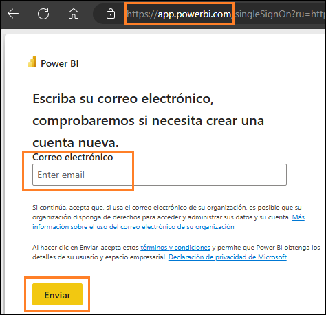
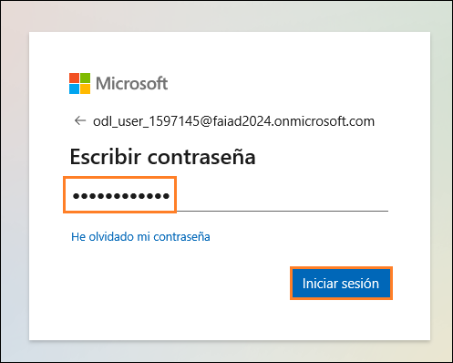
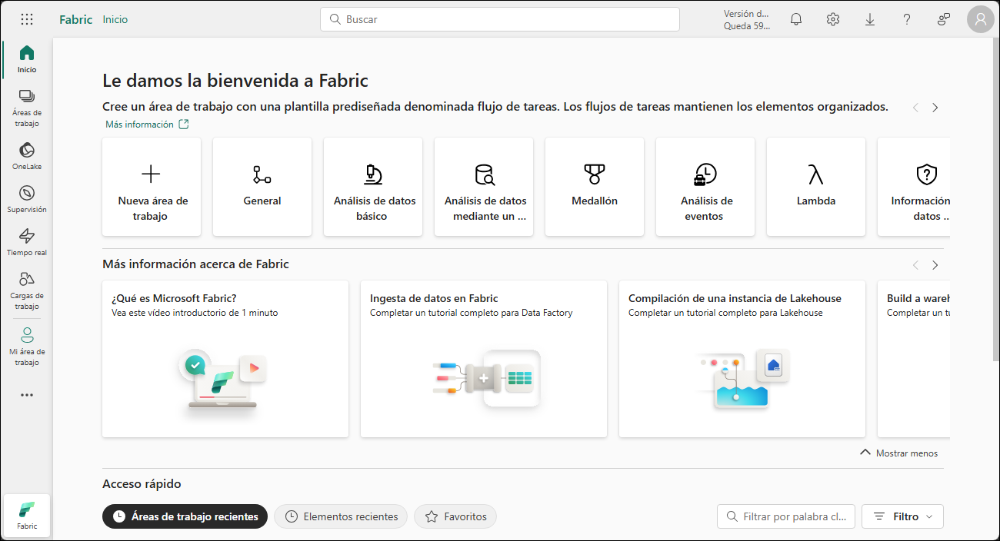
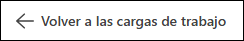
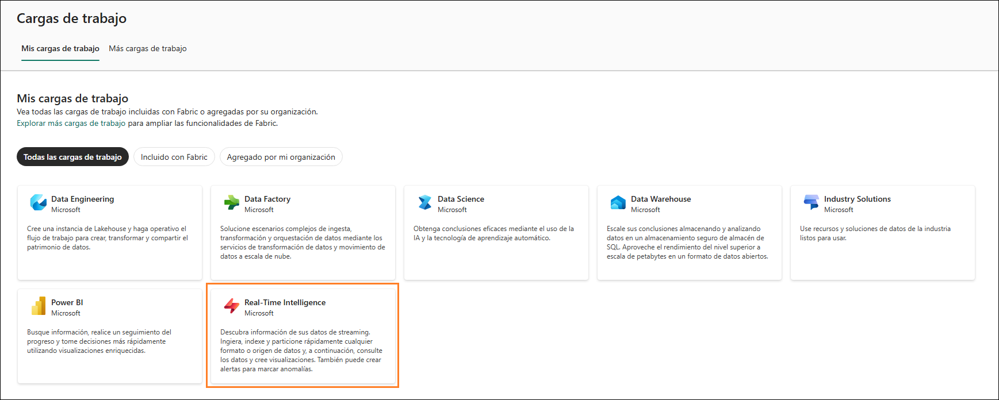
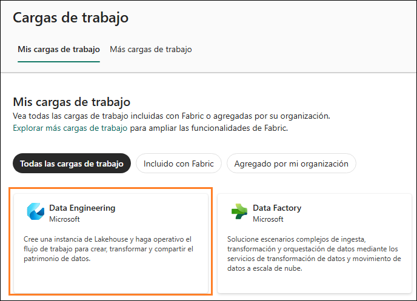
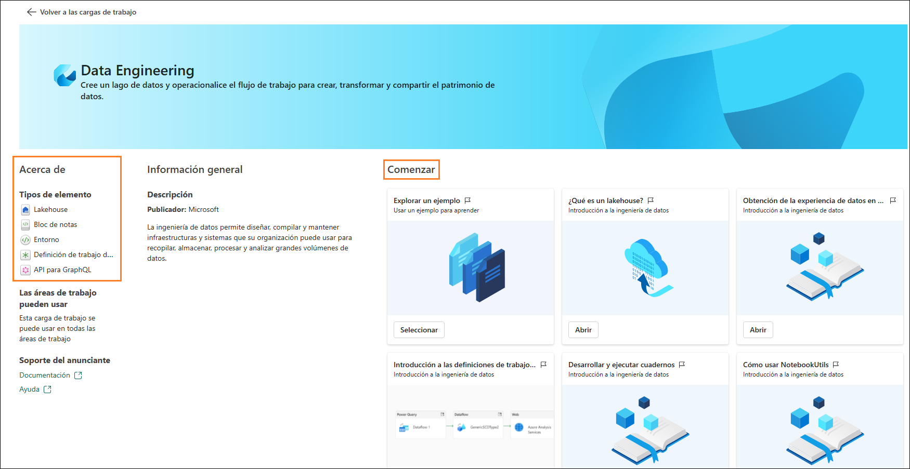
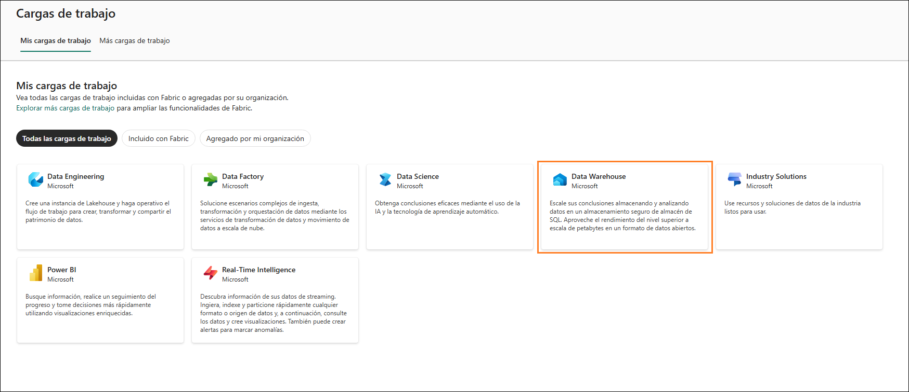
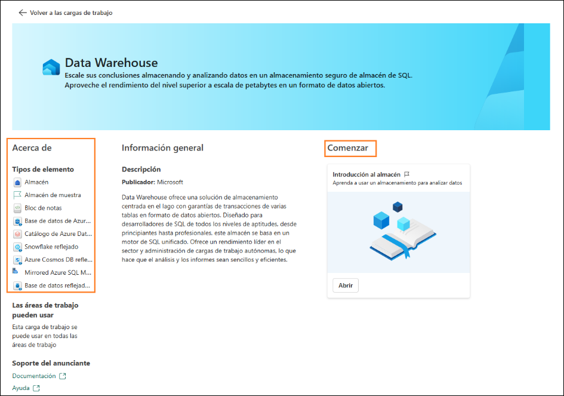

# Microsoft Fabric Fabric Analyst in a Day - Laboratorio 2

# Contenido
- Presentación 
- Licencia de Fabric
    - Tarea 1: Habilitar una licencia de prueba de Microsoft Fabric
- Área de trabajo de Fabric
    - Tarea 2: Crear un área de trabajo de Fabric
    - Tarea 3: Crear un almacén de lago de datos
- Información general de las experiencias de Fabric
    - Tarea 4: Experiencia de Data Factory
    - Tarea 5: Experiencia de Industry Solutions
    - Tarea 6: Experiencia de Real-Time Intelligence
    - Tarea 7: Experiencia de Data Engineering
    - Tarea 8: Experiencia de Data Science
    - Tarea 9: Experiencia de Data Warehouse
- Referencias

# Presentación 

Hoy tendrá ocasión de aprender diversas características clave de
Microsoft Fabric. Este es un taller introductorio destinado a
presentarle las diversas experiencias de productos y artículos
disponibles en Fabric. Al final de este taller, habrá aprendido a
utilizar almacenes de lago de datos, flujos de datos Gen2,
canalizaciones de datos, DirectLake, etc.

Al final de este laboratorio, habrá aprendido sobre:

- Crear un área de trabajo de Fabric

- Cómo crear un lakehouse

# Licencia de Fabric

### Tarea 1: Habilitar una licencia de prueba de Microsoft Fabric

1. Abra el **explorador** y vaya a [Microsoft Power BI Portal](https://app.powerbi.com). Se le
    llevará a la página de inicio de sesión.

    **Nota:** Si está utilizando el entorno de laboratorio, es posible que
    inicie sesión directamente.

    **Nota:** Si no está utilizando el entorno de laboratorio y tiene una
    cuenta de Power BI existente, es posible que desee utilizar el
    explorador en modo privado/incógnito.

2. Copie el **nombre de usuario** y péguelo en el campo **Correo
    electrónico** del cuadro de diálogo y seleccione **Enviar**.

    - **Correo electrónico/nombre de usuario:** <inject key="AzureAdUserEmail"></inject>

      

3. En la pestaña de **inicio de sesión de Microsoft Azure**, verá la pantalla de inicio de sesión. Introduzca el siguiente **correo electrónico/nombre de usuario** y luego haga clic en **Siguiente**.

    - Correo electrónico/nombre de usuario: <inject key="AzureAdUserEmail"></inject>

      

4. Ahora introduzca la siguiente **contraseña** y haga clic en **Iniciar sesión**.

    - Contraseña: <inject key="AzureAdUserPassword"></inject>

      

5. Se le dirigirá a la **página principal del servicio Power BI** que
    ya conoce.

6. Asumimos que está familiarizado con el diseño del servicio Power BI. Si tiene alguna pregunta, no dude en preguntar.

    Actualmente, está en **Mi área de trabajo**. Para trabajar con elementos
    de Fabric, necesitará una licencia de prueba y un área de trabajo que
    tenga una licencia de Fabric asignada. Configurémoslo.

7. En la esquina superior derecha de la pantalla, seleccione el **icono
    del usuario**.

8. Seleccione **Prueba gratuita**.

   

9. Se abre un cuadro de diálogo para actualizar a una prueba Microsoft
    Fabric gratuita. Seleccione **Activar.**

   

10. Se abre el cuadro de diálogo Se ha actualizado con éxito a una
    prueba Microsoft Fabric gratuita. Seleccione **Fabric Home Page**.

    

11. Se le dirigirá a la **página Inicio de Microsoft** **Fabric**.

    

# Área de trabajo de Fabric

### Tarea 2: Crear un área de trabajo de Fabric

1. Ahora creemos un área de trabajo con una licencia de Fabric.
    **Seleccione Áreas de trabajo (1)** en la barra de navegación de la
    izquierda. Se abre un cuadro de diálogo.

2. Haga clic en **+ Nueva área de trabajo (2)** que se encuentra en la
    parte inferior del menú emergente.

   

3. El cuadro de diálogo **Crear un área de trabajo** se abre en el lado
    derecho del explorador.

4. En el campo **Nombre**, introduzca **FAIAD_<inject key="Deployment ID" enableCopy="false"/>**.

    **Nota:** El espacio de trabajo debe ser único. Asegúrese de que
    aparezca una marca de verificación verde con "Este nombre está
    disponible" debajo del campo Nombre.

5. Si lo desea, puede escribir una Descripción para el área de trabajo.
    Este campo es opcional.

6. Haga clic para expandir la sección Avanzado.

   

7. En **Modo de licencia**, asegúrese de que **Prueba** esté
    seleccionado. (Debería estar seleccionado por defecto).

8. Seleccione **Aplicar** para crear un nuevo área de trabajo.

   

Se crea un nuevo área de trabajo y se nos dirige hasta ella. Traeremos
datos de los diferentes orígenes de datos a un lakehouse y utilizaremos
los datos del lakehouse para crear nuestro modelo y generar informes en
él. El primer paso es crear un almacén de lago de datos.

### Tarea 3: Crear un almacén de lago de datos

1. En el espacio de trabajo **FAIAD_<inject key="Deployment ID" enableCopy="false"/>** recién creado, localice el botón **+ Nuevo elemento (1)** en el panel de navegación de la izquierda. Aquí es donde puede comenzar a crear nuevos elementos en su espacio de trabajo.

2. En el cuadro de búsqueda, escriba **Lakehouse (2)** y, en los
    resultados de búsqueda, seleccione la opción **Lakehouse (3)**. Esto
    le permitirá crear un nuevo almacén de lago de datos para almacenar,
    consultar y administrar sus macrodatos.

   

3. Aparecerá un cuadro de diálogo Nuevo lakehouse. Introduzca lh_FAIAD
    en el cuadro de texto Nombre.

    **Nota:** lh aquí se refiere al almacén de lago de datos. Vamos a
    anteponer lh para que sea fácil de identificar y buscar.

4. Seleccione **Crear**.

   

En unos momentos, se crea un lakehouse y se le dirigirá a la interfaz
del mismo. En el **panel izquierdo**, observe que debajo de su área de
trabajo tendrá el icono del lakehouse. Puede navegar fácilmente hasta el
almacén de lago de datos si hace clic en este icono en cualquier
momento.

Dentro del explorador del almacén de lago de datos, verá **Tables** y
**Files**. El almacén de lago de datos podría exponer archivos Azure
Data Lake Storage Gen2 en la sección de archivos o un flujo de datos
podría cargar datos en las tablas del almacén de lago de datos. Existen
varias opciones disponibles. Le mostraremos algunas de las opciones en
las siguientes prácticas de laboratorio.

   

# Información general de las experiencias de Fabric

### Tarea 4: Experiencia de Data Factory

1. Seleccione el icono de Cargas de trabajo en la parte izquierda de su
    pantalla. Se abrirá un cuadro de diálogo con la lista de
    experiencias de Fabric. La lista de experiencias incluye Power BI,
    Data Factory, Industry Solutions, Real-Time Intelligence, Data
    Engineering, Data Science y Data Warehouse. Exploremos.

   

2. Seleccione **Data Factory**.

   

3. Se le dirigirá a la página principal de Data Factory. A
    continuación, se muestra una explicación detallada de sus secciones,
    diseñada para guiar paso a paso en el uso efectivo de Data Factory.
    El flujo de datos de segunda generación es la nueva generación de
    flujos de datos.

    ### ¿Qué es Data Factory?

    Data Factory es una herramienta que le ayuda a administrar y organizar
    datos de diferentes orígenes. Le permite recopilar, preparar y
    transformar los datos para que se puedan utilizar de forma eficaz. Tanto
    si es principiante como experto, Data Factory proporciona herramientas
    para que la transformación de datos sea más fácil y eficiente.

    ### Tipos de artículos:

    a. **Flujos de datos:** los flujos de datos son como recetas para
    transformar datos. Ofrecen más de 300 transformaciones diferentes que
    puede aplicar a sus datos. Esto significa que puede limpiar, combinar
    y cambiar los datos de muchas maneras para adaptarlos a sus
    necesidades.

    b. **Data pipeline:** las canalizaciones son flujos de trabajo que le
    ayudan a automatizar los procesos de datos. Le permiten crear flujos
    de trabajo de datos flexibles que se pueden adaptar a sus requisitos
    específicos. Esto facilita la gestión y el procesamiento de datos de
    forma estructurada.

    c. **Azure Data Factory (versión preliminar):** Azure Data Factory es
    un servicio de integración de datos basado en la nube que le permite
    crear flujos de trabajo basados en datos para orquestar y automatizar
    el movimiento y la transformación de datos.

    d. **Trabajo de Apache Airflow (versión preliminar):** Apache Airflow
    es una plataforma de código abierto que se utiliza para crear,
    programar y supervisar flujos de trabajo mediante programación. En
    Data Factory, le permite crear, programar y administrar flujos de
    trabajo de datos complejos.

    e. **Copiar trabajo (versión preliminar):** Copiar trabajo es una
    función que le permite copiar datos de un origen a otro. Proporciona
    una forma sencilla y eficaz de mover datos entre diferentes almacenes
    de datos.

    f. **Base de datos reflejada (versión preliminar):** una
    característica para crear versiones duplicadas de bases de datos para
    copia de seguridad, prueba o acceso de solo lectura.

    ### Comenzar:

    Para empezar a usar Data Factory, puede seguir estos pasos:

    a. **Aprender a usar Data Factory:** en esta sección encontrará ayuda
    para empezar a utilizar Data Factory. Proporciona orientación sobre
    cómo comenzar a usar la herramienta de manera efectiva.

    b. **Crear su primer flujo de datos:** aquí puede aprender a crear su
    primer flujo de datos. Los flujos de datos son esenciales para
    transformar sus datos de acuerdo con sus necesidades.

    c. **Crear la primera canalización de datos:** esta sección le guía
    sobre cómo crear su primera canalización de datos. Las canalizaciones
    ayudan a automatizar y administrar sus procesos de datos de manera
    eficiente.

    d. **Aprenda a supervisar Data Factory:** la supervisión es crucial
    para garantizar que sus procesos de datos funcionen sin problemas. En
    esta sección se aprende a supervisar las actividades de Data Factory.

    e. **Aprender a transformar datos con flujos de datos:** esta sección
    le ayuda a comprender cómo usar los flujos de datos para transformar
    sus datos de manera efectiva.

    f. **Crear su primera API para GraphQL:** si le interesa utilizar API
    con GraphQL, esta sección le guiará sobre cómo empezar.

    g. **Crear sus primeras funciones de datos de usuario:** esta sección
    le ayuda a crear funciones de datos de usuario, que son útiles para
    administrar y transformar los datos del usuario.

    

4. Haga clic en **Volver a las cargas de trabajo** en la esquina
    superior izquierda de la pantalla. Esta acción le llevará a la
    página principal de cargas de trabajo, donde puede explorar otras
    herramientas o secciones.

   

### Tarea 5: Experiencia de Industry Solutions

1. En la página **Cargas de trabajo**, haga clic en **Industry
    Solutions** para continuar.

   

2. Se le dirigirá a la página principal de **Industry Solutions**. A
    continuación, se muestra una descripción detallada de sus secciones,
    diseñadas para ayudarle a utilizar **Industry** **Solutions**
    de manera efectiva y paso a paso.

    ### ¿Qué es Industry Solutions?

    Industry Solutions son soluciones de datos listas para usar de Microsoft
    Fabric que proporcionan soluciones y recursos para diversos sectores.
    Industry Solutions le ayuda a comenzar con escenarios empresariales
    clave mediante el uso de modelos de datos, conectores, transformaciones,
    informes y otros activos relacionados con el sector.

    ### Tipos de artículos:

    a. **Soluciones de sostenibilidad:** admiten la ingesta, la
    estandarización y el análisis de datos ambientales, sociales y de
    gobernanza (ASG).

    b. **Soluciones de datos de comercio minorista:** ayudan a
    administrar grandes volúmenes de datos, a integrar datos de diversos
    orígenes y a proporcionar análisis en tiempo real para una toma de
    decisiones rápida. Los minoristas pueden utilizar estas soluciones
    para la optimización del inventario, la segmentación de clientes, la
    previsión de ventas, la fijación de precios dinámicos y la detección
    de fraude.

    c. **Soluciones de atención sanitaria:** están diseñadas
    estratégicamente para acelerar el tiempo de creación de valor para los
    clientes al abordar la necesidad crítica de transformar de manera
    eficiente los datos sanitarios en un formato adecuado para el
    análisis.

    ### Comenzar:

    Para empezar a usar Industry Solutions, siga estos pasos:

    a. **Obtener información sobre las soluciones de datos de atención
    sanitaria:** haga clic en el botón "Más información" para leer sobre
    las soluciones de datos de atención sanitaria y comprender cómo se
    pueden utilizar en sus proyectos.

    b. **Implementar soluciones de datos de atención sanitaria:** haga
    clic en el botón "Implementar" para comenzar a implementar
    soluciones de datos de atención sanitaria e implementarlas en sus
    proyectos.

    c. **Obtener información sobre las soluciones de sostenibilidad:**
    haga clic en el botón "Más información" para leer sobre las
    soluciones de sostenibilidad y comprender cómo se pueden utilizar en
    sus proyectos.

    d. **Implementar soluciones de sostenibilidad:** haga clic en el
    botón "Implementar" para comenzar a implementar soluciones de
    sostenibilidad e implementarlas en sus proyectos.

    e. **Obtener información sobre las soluciones de comercio
    minorista:** haga clic en el botón
    "Más información" para leer sobre las soluciones de comercio
    minorista y comprender cómo se pueden utilizar en sus proyectos.

    f. **Implementar soluciones de comercio minorista:** haga clic en el
    botón "Implementar" para comenzar a implementar soluciones de
    comercio minorista e implementarlas en sus proyectos.

3. Haga clic en Volver a las cargas de trabajo en la esquina superior
izquierda de la pantalla. Esta acción le llevará a la página principal
de cargas de trabajo, donde puede explorar otras herramientas o
secciones.

   

### Tarea 6: Experiencia de Real-Time Intelligence

1. En la página **Cargas de trabajo**, haga clic en **Real-Time
    Intelligence** para continuar.

   

2. Se le dirigirá a la página principal de **Real-Time Intelligence**.
    A continuación, se muestra una descripción detallada de sus
    secciones, diseñadas para ayudarle a utilizar **Real-Time
    Intelligence** de manera efectiva y paso a paso.

    ### ¿Qué es Real-Time Intelligence?

    Real-Time Intelligence es una herramienta que le ayuda a administrar y
    analizar datos de gran volumen y alta granularidad de varios orígenes.
    Le permite ingerir, analizar y tomar medidas sobre sus datos en tiempo
    real, lo que mejora sus operaciones comerciales con una toma de
    decisiones y acciones oportunas.

    ### Tipos de artículos:

    a. **Casa de eventos:** se utiliza para crear un área de trabajo de
    una o varias bases de datos KQL, que se puede compartir entre
    proyectos.

    b. **Conjunto de consultas KQL:** se utiliza para ejecutar consultas
    sobre los datos para producir tablas y objetos visuales que se pueden
    compartir.

    c. **Panel en tiempo real:** se utiliza para visualizar paneles de
    información en tiempo real en cuestión de segundos desde la ingesta de
    datos.

    d. **Eventstream:** se utiliza para capturar, transformar y enrutar
    el flujo de eventos en tiempo real.

    e. **Activador:** se utiliza para supervisar conjuntos de datos,
    consultas y flujos de eventos en busca de patrones.

    ### Comenzar:

    Para empezar a usar Real-Time Intelligence, siga estos pasos:

    a. **Explorar ejemplo de inteligencia de tiempo real:** haga clic en
    el botón "Abrir" para explorar el análisis de datos en tiempo real
    con una muestra.

    b. **Explorar un ejemplo:** haga clic en el botón "Seleccionar"
    para usar una muestra y obtener información sobre Real-Time
    Intelligence.

    c. **Introducción a la Inteligencia en tiempo real:** haga clic en el
    botón "Abrir" para obtener una descripción general de Real-Time
    Intelligence y comenzar a usar la herramienta de manera efectiva.

    d. **Obtenga información sobre KQL con datos de ejemplo:** haga clic
    en el botón "Abrir" para aprender KQL con datos de muestra.

    e. **¿Qué es un centro en tiempo real?:** haga clic en el botón
    "Abrir" para saber qué es un centro en tiempo real y cómo se puede
    utilizar.

    f. **Exploración de un activador de ejemplo:** haga clic en el botón
    "Abrir" para usar un activador de muestra y comprender las
    características y capacidades de Real-Time Intelligence.

    g. **Comenzar con Activator:** haga clic en el botón "Abrir" para
    comenzar con los conceptos de Activator y comenzar a usar la
    herramienta de manera efectiva.

    

3. Haga clic en Volver a las cargas de trabajo en la esquina superior
    izquierda de la pantalla. Esta acción le llevará a la página
    principal de cargas de trabajo, donde puede explorar otras
    herramientas o secciones.

   

### Tarea 7: Experiencia de Data Engineering

1. En la página **Cargas de trabajo**, haga clic en **Data
    Engineering** para continuar.

   

2. Se le dirigirá a la página principal de **Data Engineering**. A
    continuación, se muestra una descripción detallada de sus secciones,
    diseñadas para ayudarle a utilizar **Data** **Engineering** de
    manera efectiva y paso a paso.

    ### ¿Qué es Data Engineering?

    Data Engineering es una herramienta que le ayuda a diseñar, construir y
    mantener infraestructuras y sistemas para recopilar, almacenar, procesar
    y analizar grandes volúmenes de datos. Le permite crear un almacén de
    lago de datos y poner en funcionamiento su flujo de trabajo para crear,
    transformar y compartir su estado de datos.

    ### Tipos de artículos:

    a. **Lakehouse:** se utiliza para almacenar macrodatos para limpiar,
    consultar, generar informes y compartir.

    b. **Bloc de notas:** se utiliza para la ingesta de datos, la
    preparación, el análisis y otras tareas relacionadas con los datos
    utilizando varios lenguajes como Python, R y Scala.

    c. **Entorno:** se utiliza para configurar bibliotecas compartidas,
    configuraciones y recursos informáticos de Spark para portátiles y
    definiciones de trabajos de Spark.

    d. **Definición de trabajo de Spark:** se utiliza para definir,
    programar y administrar trabajos de Apache.

    e. **Canalización de datos:** se usa para orquestar una solución de
    datos.

    f. **API para GraphQL:** es una API para consultar múltiples orígenes
    de datos.

    g. **Importar bloc de notas:** se usa para importar blocs de notas
    desde la máquina local.

    ### Comenzar:

    Para empezar a usar Data Engineering, siga estos pasos:

    a. **Explorar un ejemplo:** haga clic en el botón "Seleccionar"
    para usar una muestra y obtener información sobre Data Engineering.

    b. **¿Qué es un lakehouse?:** haga clic en el botón "Abrir" para
    obtener información sobre los almacenes de lago de datos y cómo se
    pueden usar.

    c. **Obtención de la experiencia de datos en un lakehouse:** haga
    clic en el botón "Abrir" para comenzar con Data Engineering y los
    almacenes de lago de datos.

    d. **Introducción a las definiciones de trabajo de Spark:** haga clic
    en el botón "Abrir" para aprender a utilizar las definiciones de
    trabajo de Spark para el procesamiento de datos.

    e. **Desarrollar y ejecutar cuadernos:** haga clic en el botón
    "Abrir" para aprender a desarrollar y ejecutar cuadernos para el
    análisis de datos.

    f. **Cómo usar NotebookUtils:** haga clic en el botón "Abrir" para
    aprender a usar NotebookUtils para un análisis de datos mejorado.

    g. **Aprovechar los Notebooks para su almacén de lago de datos:**
    haga clic en el botón "Abrir" para aprender a aprovechar los
    notebooks para su almacén de lago de datos.

    h. **Aprovechar los conjuntos de datos para su almacén de lago de
    datos:** haga clic en el botón "Abrir" para aprender a aprovechar
    los conjuntos de datos para su almacén de lago de datos.

    i. **Crear sus primeras funciones de datos de usuario:** haga clic en
    el botón "Abrir" para aprender a crear funciones de datos de
    usuario.

    j. **Crear su primera API para GraphQL:** haga clic en el botón
    "Abrir" para aprender a crear una API para GraphQL.

    

3. Haga clic en **Volver a las cargas de trabajo** en la esquina
    superior izquierda de la pantalla. Esta acción le llevará a la
    página principal de cargas de trabajo, donde puede explorar otras
    herramientas o secciones.

   

### Tarea 8: Experiencia de Data Science

1. En la página **Cargas de trabajo**, haga clic en **Data**
    **Science** para continuar.

   

2. Se le dirigirá a la página principal de **Data Science**. A continuación, se muestra una descripción detallada de sus secciones, diseñadas para ayudarle a utilizar **Data Science** de manera efectiva y paso a paso.

    ### ¿Qué es Data Science?

    Data Science es una herramienta que le ayuda a desbloquear información
    valiosa mediante IA y tecnología de aprendizaje automático. Proporciona
    herramientas de IA diseñadas para ayudarle a completar flujos de trabajo
    de ciencia de datos a gran escala y aprovecha la IA para el
    enriquecimiento de datos y la información empresarial.

    ### Tipos de artículos:

    a. **Modelos de ML:** se usa para crear modelos de aprendizaje
    automático.

    b. **Experimento:** se utiliza para crear, ejecutar y hacer un
    seguimiento del desarrollo de múltiples modelos.

    c. **Bloc de notas:** se utiliza para explorar datos y crear
    soluciones de aprendizaje automático.

    d. **Entorno:** se utiliza para configurar bibliotecas compartidas,
    configuraciones y recursos informáticos de Spark para portátiles y
    definiciones de trabajos de Spark.

    e. **Aptitud de IA:** se utiliza para crear su propia experiencia de
    IA generativa.

    f. **Cuaderno de Python:** se usa para importar cuadernos de Python
    desde la máquina local.

    ### Comenzar:

    Para empezar a usar Data Science, siga estos pasos:

    a. **Explorar un ejemplo:** haga clic en el botón "Seleccionar"
    para usar una muestra y obtener información sobre Data Science.

    b. **Introducción a los modelos de ML:** haga clic en el botón
    "Abrir" para comenzar con los modelos de aprendizaje automático.

    c. **Introducción a los experimentos de ML:** haga clic en el botón
    "Abrir" para aprender a hacer experimentos de aprendizaje
    automático.

    d. **Desarrollar y ejecutar cuadernos:** haga clic en el botón
    "Abrir" para aprender a desarrollar y ejecutar cuadernos para el
    análisis de datos.

    e. **Introducción a Notebooks:** haga clic en el botón "Abrir" para
    comenzar con notebooks.

    

3. Haga clic en **Volver a las cargas de trabajo** en la esquina
    superior izquierda de la pantalla. Esta acción le llevará a la
    página principal de cargas de trabajo, donde puede explorar otras
    herramientas o secciones.

   

### Tarea 9: Experiencia de Data Warehouse

1. En la página **Cargas de trabajo**, haga clic en **Data Warehouse**
    para continuar.

   

2. Se le dirigirá a la página principal de **Data Warehouse**. A
    continuación, se muestra una descripción detallada de sus secciones,
    diseñadas para ayudarle a utilizar **Data Warehouse** de manera
    efectiva y paso a paso.

    ### ¿Qué es Data Warehouse?

    Data Warehouse es una herramienta que le ayuda a almacenar y analizar
    datos en un almacén seguro SQL. Le permite ampliar sus conocimientos al
    beneficiarse de un rendimiento de primer nivel a escala de petabytes en
    un formato de datos abiertos.

    ### Tipos de artículos:

    a. **Almacén:** se usa para crear un Data Warehouse.

    b. **Almacén de muestra:** se utiliza para explorar y probar las
    capacidades de almacenamiento de datos con conjuntos de datos y
    modelos preconfigurados.

    c. **Canalización de datos:** se usa para orquestar soluciones de
    datos.

    d. **Bloc de notas:** se utiliza para crear y compartir tareas
    interactivas de análisis y visualización de datos.

    e. **Base de datos de Azure SQL reflejada:** se utiliza para reflejar
    Azure SQL Database.

    f. **Catálogo de Azure Databricks reflejado:** se utiliza para
    reflejar datos de Azure Databricks para mejorar la integración y el
    análisis.

    g. **Snowflake reflejado:** se utiliza para reflejar la base de datos
    de Snowflake.

    h. **Azure Cosmos DB reflejado:** se utiliza para reflejar Azure
    Cosmos DB.

    i. **Mirrored Azure SQL Managed Database:** se utiliza para reflejar
    bases de datos administradas de Azure SQL para alta disponibilidad y
    recuperación ante desastres.

    j. **Base de datos reflejada:** se utiliza para replicar bases de
    datos para alta disponibilidad y recuperación ante desastres.

    ### Comenzar:

    Para comenzar a utilizar Data Warehouse, siga el siguiente paso:

    a. **Introducción al almacén:** haga clic en el botón "Abrir" para
    aprender a utilizar un almacén para analizar datos.

    

1. Haga clic en **Volver a las cargas de trabajo** en la esquina superior
izquierda de la pantalla. Esta acción le llevará a la página principal
de cargas de trabajo, donde puede explorar otras herramientas
o secciones.

    

En este laboratorio, exploramos la interfaz de Fabric y creamos un espacio de trabajo de Fabric y un Lakehouse. En el próximo laboratorio, aprenderemos a usar accesos directos en Lakehouse para conectarnos a los datos de ADLS Gen2 y a transformar estos datos mediante vistas.

# Referencias

Fabric Analyst in a Day (FAIAD) le presenta algunas funciones clave disponibles en Microsoft Fabric. En el menú del servicio, la sección Ayuda (?) tiene vínculos a algunos recursos excelentes.

Estos son algunos recursos más que podrán ayudarle a seguir avanzando
con Microsoft Fabric.

- Vea la publicación del blog para leer el [anuncio de disponibilidad general de Microsoft Fabric](https://aka.ms/Fabric-Hero-Blog-Ignite23) completo.

- Explore Fabric a través de la [Visita guiada](https://aka.ms/Fabric-GuidedTour)

- Regístrese en la [prueba gratuita de Microsoft Fabric](https://aka.ms/try-fabric)

- Visite el [sitio web de Microsoft Fabric](https://aka.ms/microsoft-fabric)

- Adquiera nuevas capacidades mediante la exploración de los [módulos de aprendizaje de Fabric](https://aka.ms/learn-fabric)

- Explore la [documentación técnica de Fabric](https://aka.ms/fabric-docs)

- Lea el [libro electrónico gratuito sobre cómo empezar a usar Fabric](https://aka.ms/fabric-get-started-ebook)

- Únase a la [comunidad de Fabric](https://aka.ms/fabric-community) para publicar sus preguntas, compartir sus comentarios y aprender de otros.

Obtenga más información en los blogs de anuncios de la experiencia
Fabric:

- [Experiencia de Data Factory en el blog de Fabric](https://aka.ms/Fabric-Data-Factory-Blog)

- [Experiencia de Synapse Data Engineering en el blog de Fabric](https://aka.ms/Fabric-DE-Blog)

- [Experiencia de Synapse Data Science en el blog de Fabric](https://aka.ms/Fabric-DS-Blog)

- [Experiencia de Synapse Data Warehousing en el blog de Fabric](https://aka.ms/Fabric-DW-Blog)

- [Experiencia de Synapse Real-Time Analytics en el blog de Fabric](https://aka.ms/Fabric-RTA-Blog)

- [Blog de anuncios de Power BI](https://aka.ms/Fabric-PBI-Blog)

- [Experiencia de Data Activator en el blog de Fabric](https://aka.ms/Fabric-DA-Blog)

- [Administración y gobernanza en el blog de Fabric](https://aka.ms/Fabric-Admin-Gov-Blog)

- [OneLake en el blog de Fabric](https://aka.ms/Fabric-OneLake-Blog)

- [Blog de integración de Dataverse y Microsoft Fabric](https://aka.ms/Dataverse-Fabric-Blog)

© 2025 Microsoft Corporation. Todos los derechos reservados.

Al participar en esta demostración o laboratorio práctico, acepta las siguientes condiciones:

Microsoft Corporation pone a su disposición la tecnología o funcionalidad descrita en esta demostración/laboratorio práctico con el fin de obtener comentarios por su parte y de facilitarle una experiencia de aprendizaje. Esta demostración/laboratorio práctico solo se puede usar para evaluar las características de tal tecnología o funcionalidad y para proporcionar comentarios a Microsoft. No se puede usar para ningún otro propósito. Ninguna parte de esta demostración/laboratorio práctico se puede modificar, copiar, distribuir, transmitir, mostrar, realizar, reproducir, publicar, licenciar, transferir ni vender, ni tampoco crear trabajos derivados de ella.

LA COPIA O REPRODUCCIÓN DE ESTA DEMOSTRACIÓN/LABORATORIO PRÁCTICO (O PARTE DE ELLA) EN CUALQUIER OTRO SERVIDOR O UBICACIÓN PARA SU REPRODUCCIÓN O DISTRIBUCIÓN POSTERIOR QUEDA EXPRESAMENTE PROHIBIDA.

ESTA DEMOSTRACIÓN/LABORATORIO PRÁCTICO PROPORCIONA CIERTAS FUNCIONES Y CARACTERÍSTICAS DE PRODUCTOS O TECNOLOGÍAS DE SOFTWARE (INCLUIDOS POSIBLES NUEVOS CONCEPTOS Y CARACTERÍSTICAS) EN UN ENTORNO SIMULADO SIN INSTALACIÓN O CONFIGURACIÓN COMPLEJA PARA EL PROPÓSITO ARRIBA DESCRITO. LA TECNOLOGÍA/CONCEPTOS DESCRITOS EN ESTA DEMOSTRACIÓN/LABORATORIO PRÁCTICO NO REPRESENTAN LA FUNCIONALIDAD COMPLETA DE LAS CARACTERÍSTICAS Y, EN ESTE SENTIDO, ES POSIBLE QUE NO FUNCIONEN DEL MODO EN QUE LO HARÁN EN UNA VERSIÓN FINAL. ASIMISMO, PUEDE QUE NO SE PUBLIQUE UNA VERSIÓN FINAL DE TALES CARACTERÍSTICAS O CONCEPTOS. DE IGUAL MODO, SU EXPERIENCIA CON EL USO DE ESTAS CARACTERÍSTICAS Y FUNCIONALIDADES EN UN ENTORNO FÍSICO PUEDE SER DIFERENTE.

**COMENTARIOS**. Si envía comentarios a Microsoft sobre las características, funcionalidades o conceptos de tecnología descritos en esta demostración/laboratorio práctico, acepta otorgar a Microsoft, sin cargo alguno, el derecho a usar, compartir y comercializar sus comentarios de cualquier modo y para cualquier fin. También concederá a terceros, sin cargo alguno, los derechos de patente necesarios para que sus productos, tecnologías y servicios usen o interactúen con cualquier parte específica de un software o servicio de Microsoft que incluya los comentarios. No enviará comentarios que estén sujetos a una licencia que obligue a Microsoft a conceder su software o documentación bajo licencia a terceras partes porque incluyamos sus comentarios en ellos. Estos derechos seguirán vigentes después del vencimiento de este acuerdo.

MICROSOFT CORPORATION RENUNCIA POR LA PRESENTE A TODAS LAS GARANTÍAS Y CONDICIONES RELATIVAS A LA DEMOSTRACIÓN/LABORATORIO PRÁCTICO, INCLUIDA CUALQUIER GARANTÍA Y CONDICIÓN DE COMERCIABILIDAD (YA SEA EXPRESA, IMPLÍCITA O ESTATUTARIA), DE IDONEIDAD PARA UN FIN DETERMINADO, DE TITULARIDAD Y DE AUSENCIA DE INFRACCIÓN. MICROSOFT NO DECLARA NI GARANTIZA LA EXACTITUD DE LOS RESULTADOS, EL RESULTADO DERIVADO DE LA REALIZACIÓN DE LA DEMOSTRACIÓN/LABORATORIO PRÁCTICO NI LA IDONEIDAD DE LA INFORMACIÓN CONTENIDA EN ELLA CON NINGÚN PROPÓSITO.

**DECLINACIÓN DE RESPONSABILIDADES**

Esta demostración/laboratorio práctico contiene solo una parte de las nuevas características y mejoras realizadas en Microsoft Power BI. Puede que algunas de las características cambien en versiones futuras del producto. En esta demostración/laboratorio práctico, conocerá algunas de estas nuevas características, pero no todas.

