# Microsoft Fabric Fabric Analyst in a Day - Laboratorio 5

   

# Contenido

- Presentación

- Flujo de datos de segunda generación

    - Tarea 1: Configurar la actualización programada para el flujo de datos del proveedor

- Canalización de datos

    - Tarea 2: Crear una canalización de datos

    - Tarea 3: Crear una canalización de datos simple

    - Tarea 4: Crear una nueva canalización de datos

    - Tarea 5: Crear la actividad Until

    - Tarea 6: Crear variables

    - Tarea 7: Configurar la actividad Until

    - Tarea 8: Configurar la actividad del flujo de datos

    - Tarea 9: Configurar la primera actividad de Establecer variable

    - Tarea 10: Configurar la segunda actividad de Establecer variable

    - Tarea 11: Configurar la tercera actividad de Establecer variable

    - Tarea 12: Configurar la actividad Esperar

    - Tarea 13: Configurar la actualización programada para la canalización de datos

- Referencias

# Presentación 

Hemos ingerido datos de diferentes orígenes de datos en un almacén de
lago de datos. En este laboratorio, configurará un programa de
actualización para los orígenes de datos. Solo para recapitular el requisito:

- **Datos del proveedor:** Snowflake se actualiza a la medianoche
    (00:00) todos los días.

- **Datos del empleado:** se actualizan en SharePoint a las 09:00
    todos los días. Sin embargo, hemos notado que a veces hay un retraso de 5 a 15  minutos. Necesitamos crear un programa de actualización para dar cabida a esto.

- **Datos de Customer:** siempre están actualizados en Dataverse.
    Anteriormente se actualizaban cuatro veces al día: a medianoche (00:00), a las 06:00, a mediodía (12:00) y a las 18:00. Ahora, el equipo de TI ha creado un vínculo a Dataverse para ingerir estos datos en un almacén de lago de datos de administración. También ha transformado estos datos. No necesitamos configurar la actualización, ya que nos estamos vinculando al almacén de lago de datos proporcionado por el equipo de TI.

- **Datos de ventas:** se actualizan en ADLS al mediodía (12:00) todos los días. No necesitamos configurar la actualización para esto, ya que hemos creado un acceso directo. En cuanto se actualizan los datos en ADLS, están disponibles.

Al final de este laboratorio, habrá aprendido:

- Cómo configurar una actualización programada del flujo de datos de segunda generación

- Cómo crear una canalización de datos

- Cómo configurar una actualización programada de una canalización de datos

# Flujo de datos de segunda generación

### Tarea 1: Configurar la actualización programada para el flujo de datos del proveedor

Comencemos configurando una actualización programada del flujo de datos del proveedor.

1. Volvamos al área de trabajo de Fabric, **FAIAD_<inject key="Deployment ID" enableCopy="false"/>** seleccionando el área de trabajo en el panel izquierdo.

2. Para maximizar el panel con la lista de artefactos, seleccione la flecha doble situada en la parte superior derecha del panel.

   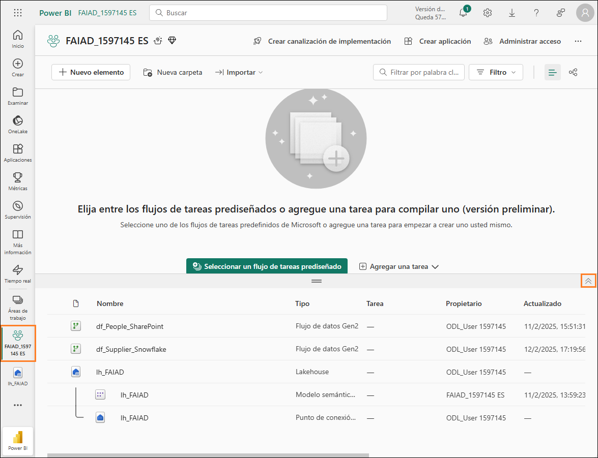

3. Todos los artefactos que ha creado se enumeran aquí. En la parte derecha de la pantalla, en el **cuadro de diálogo de Búsqueda**, introduzca **df**. Esto filtrará los artefactos a flujos de datos.

   

4. Mantenga el puntero sobre la fila **df_Supplier_Snowflake**. Observe que los iconos **Actualizar** y **Actualización programada** que conoce están disponibles. Seleccione los **puntos suspensivos (...)**.

5. Observe que hay una opción para eliminar, editar y exportar el flujo de datos. Podemos usar las propiedades para actualizar el nombre y la descripción del flujo de datos. Veremos cómo actualizar el historial en breve. Seleccione **Configuración**.

   

    **Nota:** Se abre la página de configuración. En el panel izquierdo, encontrará todos los flujos de datos enumerados.

6. En el panel central, seleccione el vínculo **Actualizar historial**.

   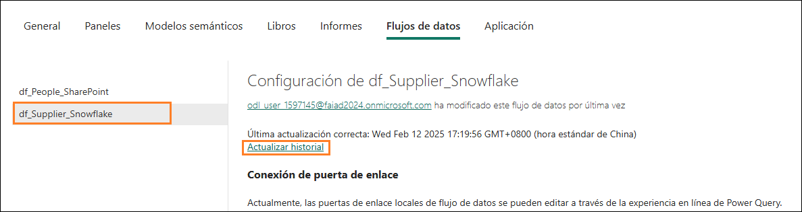

7. Tendrá una actualización en la lista. Esta es la actualización que se produjo cuando se publicó el flujo de datos. Seleccione el vínculo **Hora de inicio**.

    > **Nota:** La hora de inicio será diferente para usted.

    

    Se abre la pantalla de detalles. Esto proporcionará detalles de la actualización e indica la hora de inicio, finalización y duración. También enumera las tablas o actividades que se actualizaron. En caso de que haya un error, puede hacer clic en el nombre de la tabla o actividad
    para investigar más a fondo.

   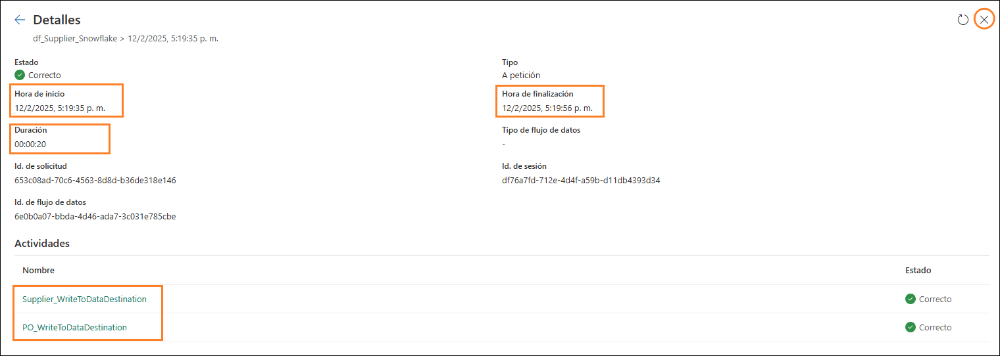

8. Puede cerrar la pantalla si hace clic en la **X** de la esquina superior derecha. Se le dirigirá de vuelta a la **página de configuración del flujo de datos**.

9. En Conexión de puerta de enlace, expanda **Credenciales de origen de datos**. Se muestra una lista de conexiones utilizadas en el flujo de datos. En este caso, el almacén de lago de datos y Snowflake.

    a. **Lakehouse:** esta es la conexión para ingerir datos del flujo de datos.

    b. **Snowflake:** esta es la conexión a los datos de origen de Snowflake.

   

10. Expanda **Actualizar.**

11. Establezca **Zona horaria** a su zona horaria preferida.

    **Nota:** dado que se trata de un entorno de laboratorio, puede configurar la zona horaria según su zona horaria preferida. En un escenario real, configurará la zona horaria según la ubicación de su origen de datos.

12. Establezca el control deslizante de **Configurar una programación de actualización en Activar**.

13. Establezca el **menú desplegable Frecuencia de actualización** en **Diaria**. Vea que también hay una opción para configurarla como Semanal.

14. Haga clic en el vínculo **Agregar otra hora**. Observe que se muestra la opción **Hora**.

15. Establezca la **Hora** en **medianoche/00:00**. Tenga en cuenta que puede configurar la actualización al final de la hora o media hora.

16. Seleccione **Aplicar** para guardar la configuración.

    **Nota:** Al hacer clic en el vínculo Agregar otro horario, puede agregar múltiples horas de actualización. También puede enviar notificaciones de error al propietario del flujo de datos y otros contactos.

    

    Como se ha mencionado anteriormente, necesitamos crear una lógica personalizada para gestionar el escenario donde el archivo de Empleado en SharePoint no se entrega a tiempo. Usemos la canalización de datos para resolver esto.

# Canalización de datos

### Tarea 2: Crear una canalización de datos

1. Volvamos al área de trabajo de Fabric, **FAIAD_<inject key="Deployment ID" enableCopy="false"/>** seleccionando el área de trabajo en el panel izquierdo.

2. En el menú superior, seleccione **+ Nuevo elemento (1) -\> Canalización de datos (2)**.

   

3. Se abre un nuevo cuadro de diálogo de canalización. Llame a la canalización **pl_Refresh_People_SharePoint (3)** y seleccione **Crear (4)**.

    

    Se le llevará a la **página de Canalización de datos**. Si ha trabajado con Azure Data Factory, esta pantalla le resultará familiar. Hagamos una descripción general rápida del diseño.

    Está en la pantalla **Inicio**. Si observa el menú superior, encontrará opciones para agregar las actividades más utilizadas: validar, ejecutar una canalización y ver el historial de ejecución. Además, en el panel central, encontrará opciones rápidas para comenzar a crear la canalización.

   

4. En el menú superior, seleccione **Actividades**. Ahora, en el menú, encontrará una lista de actividades de uso común.

5. Seleccione los **puntos suspensivos (...)** a la derecha del menú para ver todas las demás actividades disponibles. Usaremos algunas de estas actividades en el laboratorio.

   

6. En el menú superior, haga clic en **Ejecutar**. Encontrará opciones para ejecutar y programar la ejecución de la canalización. También encontrará la opción de ver el historial de ejecución utilizando Ver historial de ejecución.

7. En el menú superior, seleccione **Ver**. Aquí encontrará opciones para ver el código en formato JSON. También encontrará opciones para formatear las actividades.

    **Nota:** Si tiene un fondo JSON,   al final de la práctica de laboratorio, no dude en seleccionar Ver código JSON. Aquí notará que toda la orquestación que está realizando mediante la vista de diseño también se puede escribir en JSON.

    

### Tarea 3: Crear una canalización de datos simple

Comencemos a crear la canalización. Necesitamos una actividad para actualizar el flujo de datos. Busquemos una actividad que podamos utilizar.

1. En el menú superior, seleccione **Actividades -\> Flujo de datos**. La actividad del flujo de datos se agrega al panel de diseño central. Observe que el panel inferior ahora tiene opciones de configuración de la actividad de flujo de datos.

2. Vamos a configurar la actividad para conectarse a la actividad
    df_People_SharePoint. En el **panel** **inferior**, seleccione **Configuración**.

3. Asegúrese de que **Área de trabajo** está configurada en su área de trabajo de Fabric, **FAIAD_<inject key="Deployment ID" enableCopy="false"/>**

4. En el **menú desplegable Flujo de datos**, seleccione
**df_People_SharePoint**. Cuando se ejecute esta actividad del flujo de datos, se actualizará **df_People_SharePoint.** Fácil, ¿verdad?

    En nuestro escenario, los datos de los empleados no se actualizan según lo programado. A veces hay un retraso. Veamos si podemos solucionar esto.

    

5. En el **panel** **inferior**, seleccione **General** Pongamos un nombre y una descripción a la actividad.

6. En el campo **Nombre**, introduzca **dfactivity_People_SharePoint**.

7. En el campo **Descripción**, introduzca **Actividad de flujo de datos para actualizar el flujo de datos df_People_Sharepoint.** **En el menú superior, haga clic en + Nuevo elemento (1) y en la ventana emergente, haga clic en Canalización de datos (2).**

8. Observe que hay una opción para desactivar una actividad. Esta característica es útil durante las pruebas o la depuración. Déjela como **Activado**.

9. Hay una opción para configurar un **Tiempo de espera**. Dejemos el **valor predeterminado** como está, lo que debería dar tiempo suficiente para que el flujo de datos se actualice.

    **Nota:** Si los datos no están disponibles según lo programado, configuremos la actividad para que se vuelva a ejecutar cada 10 minutos, tres veces. Si también falla en el tercer intento, se informará de un error.

10. Establezca **Reintentar** en **3**.

11. Expanda la sección **Avanzadas**.

12. Establezca **Intervalo de reintento (s)** en **600**.

13. En el menú, seleccione el icono **Inicio -\> Guardar** para guardar la canalización.

    

    Observe la ventaja de utilizar la canalización de datos en comparación con configurar el flujo de datos en una actualización programada (como hicimos con los flujos de datos anteriores):

    - La canalización ofrece la opción de reintentar varias veces antes de que falle la actualización.

    - La canalización brinda la capacidad de actualizar en segundos, mientras que con el flujo de datos, la actualización programada es cada 30 minutos.

### Tarea 4: Crear una nueva canalización de datos

Agreguemos un poco más de complejidad a nuestro escenario. Hemos
observado que si los datos no están disponibles a las 09:00, normalmente lo estarán en cinco minutos. Si se pierde la ventana de tiempo, el archivo tardará 15 minutos en estar disponible. Queremos programar los reintentos a los cinco y 15 minutos. Veamos cómo se puede lograr esto mediante la creación de una nueva canalización de datos.

1. En el panel izquierdo, haga clic en **FAIAD_<inject key="Deployment ID" enableCopy="false"/>** para navegar a la página de inicio del área de trabajo.

2. En el menú superior, haga clic en **+ Nuevo elemento (1)** y en la **ventana emergente**, haga clic en **Canalización de datos (2)**.

   

3. Se abre un nuevo cuadro de diálogo de canalización. **Llame** a la canalización **pl_Refresh_People_SharePoint_Option2 (3)** y
seleccione **Crear (4)**.

   

### Tarea 5: Crear la actividad Until

1. Esto le llevará a la pantalla de la canalización de datos. En el menú, seleccione **Actividades**.

2. Haga clic en los **puntos suspensivos (...)** a la derecha.

3. En la lista de actividades, haga clic en **Hasta**.

    **Hasta:** es una actividad que se utiliza para iterar hasta que se cumpla una condición. En nuestro escenario, vamos a iterar y actualizar el flujo de datos hasta que tenga éxito o lo hayamos intentado tres veces.

    

### Tarea 6: Crear variables

1. Necesitamos crear variables que se utilizarán para iterar y
establecer el estado. Seleccione el **área en blanco** en el panel de diseño de la canalización.

2. Observe que el menú en el panel inferior cambia. Seleccione
**Variables**.

3. Seleccione **+** **Nuevo** para agregar una variable.

4. Observe que aparece una fila. Escriba **varCounter** en el **cuadro de texto Nombre**. Usaremos esta variable para iterar tres veces.

5. En el **menú desplegable** **Tipo**, seleccione **Integer**.

6. Introduzca un **Valor predeterminado** de **0**.

    **Nota:** Estamos escribiendo \"var\" en los nombres de las variables, por lo que es fácil encontrarlas y es un procedimiento recomendado.

    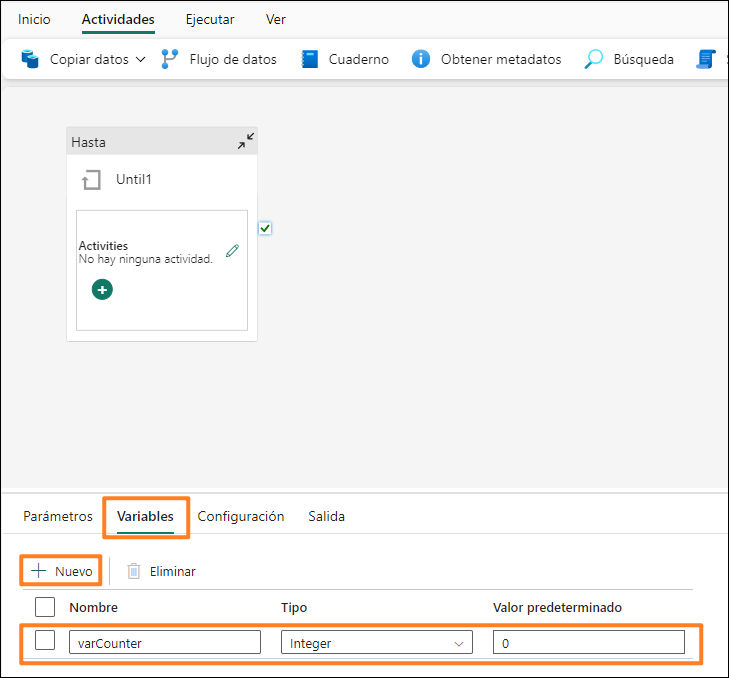

7. Seleccione **+ Nuevo** para agregar una nueva variable.

8. Observe que aparece una fila. Introduzca **varTempCounter** en el **cuadro de texto Nombre**. Vamos a utilizar esta variable de incremento variable varCounter.

9. En el **menú desplegable** **Tipo**, seleccione **Integer**.

10. Introduzca un **Valor predeterminado** de **0**.

11. Siga los mismos pasos para agregar tres variables más:

    a. **varIsSuccess** de tipo **String** y valor predeterminado
    **No**. Esta variable se utilizará para indicar si la actualización del flujo de datos se llevó a cabo correctamente.

    b. **varSuccess** de tipo **String** y valor predeterminado
    **Yes**. Esta variable se utilizará para establecer el valor de varIsSuccess si la actualización del flujo de datos se realiza correctamente.

    c. **varWaitTime** de tipo **Integer** y valor predeterminado
    **60**. Esta variable se utilizará para establecer el tiempo de espera si el flujo de datos falla. (Ya sea cinco minutos/300 segundos o 15 minutos/900 segundos).

    **Nota:** Asegúrese de que no haya espacios antes o después del nombre de la variable.

    

### Tarea 7: Configurar la actividad Until

1. Seleccione la actividad **Hasta**.

2. En el **panel inferior**, seleccione **General**.

3. Introduzca **Iterator** como **Nombre**.

4. Introduzca **Descripción** como **Iterator to refresh dataflow. It will retry up to 3 times**.

   

5. En el panel inferior, seleccione **Configuración (1)**.

6. Seleccione el **cuadro de diálogo Expresión (2)**. Necesitamos
introducir una expresión en este cuadro de texto que se evaluará
como true o false. La actividad Until continuará iterando mientras esta expresión se evalúa como false. Una vez que la expresión se evalúa como true, la actividad Until detiene la iteración y avanza a la siguiente actividad.

7. Seleccione el vínculo **Agregar contenido dinámico (3)** que aparece debajo del cuadro de texto.

   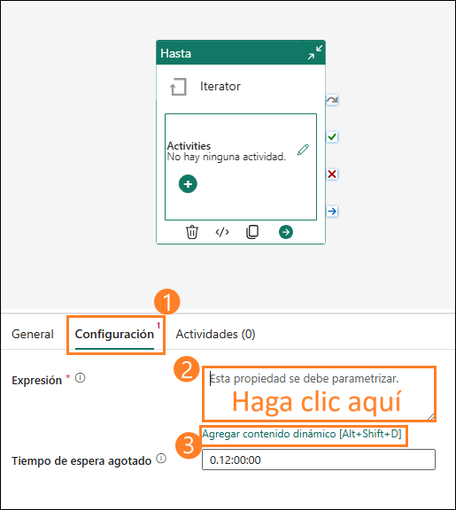

    Necesitamos escribir una expresión que se ejecute hasta que el valor de **varCounter sea 3** o el valor de **varIsSuccess sea Sí.** (varCounter y varIsSuccess son las variables que acabamos de crear).

8. Se abre el cuadro de diálogo **Generador de expresiones de
canalización**. En la mitad inferior del cuadro de diálogo, tendrá un menú:

    a. **Parámetros:** son constantes en una factoría de datos que una canalización puede consumir en cualquier expresión.

    b. **Variables del sistema:** estas variables se pueden usar en expresiones al definir entidades dentro de cualquiera de los servicios. Por ejemplo, id. de la canalización, nombre de la canalización, nombre del desencadenador, etc.

    c. **Parámetros de desencadenador:** parámetros que desencadenaron la canalización. Por ejemplo, el nombre del archivo o la ruta de acceso de la carpeta.

    d. **Funciones:** puede llamar funciones dentro de expresiones. Las funciones se clasifican en funciones de colección, conversión, fecha, lógica, matemáticas y cadena. Por ejemplo, concat es una función de cadena, add es una función matemática, etc.

    e. **Variables:** las variables de canalización son valores que se pueden establecer y modificar durante la ejecución de una canalización. A diferencia de los parámetros de canalización, que se definen en el nivel de canalización y no se pueden cambiar durante la ejecución de la misma, las variables de canalización se pueden configurar y modificar dentro de una canalización mediante una actividad Establecer variable. En breve utilizaremos la actividad Establecer variable.

   

9. Haga clic en **Funciones** el menú inferior.

10. En la sección **Funciones lógicas**, seleccione la función **or**. Observe que **\@or()** se agrega al cuadro de texto de expresión dinámica. La función or toma dos parámetros; estamos trabajando en el primero.

    

11. Coloque el cursor **entre los paréntesis** de la función **\@or**.

12. En la sección **Funciones lógicas**, seleccione la función
 **equals**. Observe que se agrega al cuadro de texto de expresión dinámica.

    **Nota:** Su función debería verse así **\@or(equals())**. La función equals también toma dos parámetros  . Comprobaremos si la variable varCounter es igual a 3.

    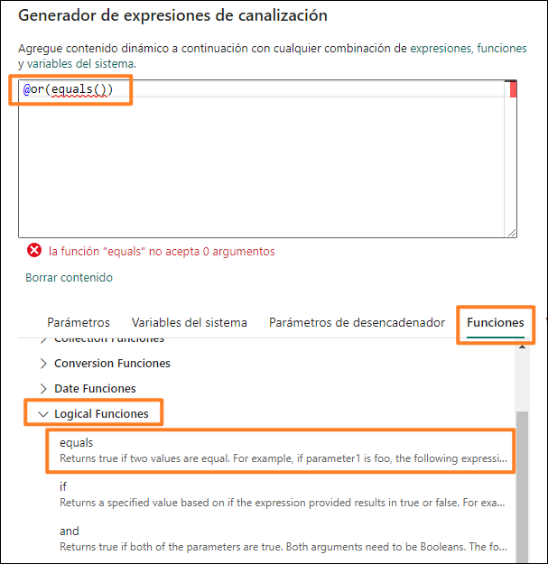

13. Ahora coloque el cursor **entre los paréntesis** de la función **\@equals** para agregar los parámetros.

14. En el menú inferior, seleccione **Variables**.

15. Seleccione la variable **varCounter** que será el primer parámetro.

16. Introduzca **3** como segundo parámetro de la función equals. Como en la captura de pantalla siguiente, su expresión será **\@or(equals(variables(\'varCounter\'),3))**

    

17. Necesitamos agregar el segundo parámetro a la función or. **Agregue una coma** entre los dos paréntesis finales. Esta vez intentaremos escribir el nombre de la función. Comience a escribir **equ** y obtendrá un menú desplegable de funciones disponibles (esto se llama IntelliSense). Seleccione la función **equals**.

    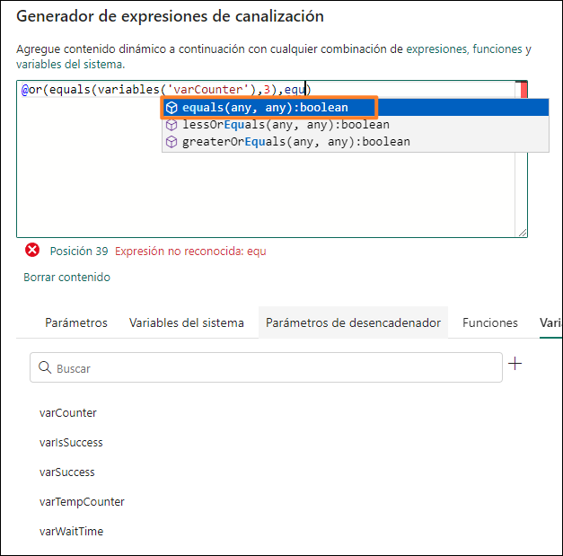

18. El primer parámetro de la función equals es una variable. Coloque el cursor **antes de la coma**.

19. Comience a escribir **variables**.

20. Con la ayuda de IntelliSense, seleccione **variables(\'varIsSuccess\')**.

21. Después de la coma, introduzcamos el segundo parámetro. Comience a escribir **variables**.

22. Con la ayuda de IntelliSense, seleccione **variables(\'varSuccess\')**. Aquí estamos comparando el valor de varIsSuccess con el valor de varSuccess. (varSuccess está predeterminado en Sí).

    

23. Su expresión debería ser: **\@or(equals(variables(\'varCounter\'),3),equals(variables(\'varIsSuccess\'), variables(\'varSuccess\')))**

24. Seleccione **Aceptar**.

    

### Tarea 8: Configurar la actividad del flujo de datos

1. Volverá a la pantalla de diseño. Con **la actividad Hasta**
 seleccionada, en el **panel inferior**, seleccione **Actividades**. Ahora agregaremos las actividades que deben ejecutarse.

2. Seleccione el icono **Editar** en la primera fila. Volverá a la pantalla de diseño de iterador en blanco.

    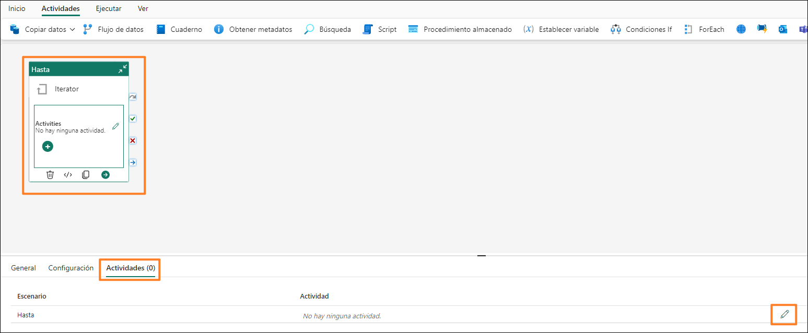

3. En el menú superior, seleccione **Actividades -\> Flujo de datos**. La actividad del flujo de datos se agrega al panel de diseño.

4. Con **la actividad del flujo de datos seleccionada**, en el panel inferior, seleccione **General**. Pongamos un nombre y una descripción a la actividad.

5. En el campo **Nombre**, introduzca **dfactivity_People_SharePoint**.

6. En el campo **Descripción**, introduzca **Dataflow activity to
 refresh df_People_Sharepoint dataflow.**

   

7. Seleccione **Configuración** en el panel inferior.

8. Asegúrese de que **Área de trabajo** está configurada en su área de trabajo, **FAIAD_<inject key="Deployment ID" enableCopy="false"/>**

9. En el **menú desplegable Flujo de datos**, seleccione **df_People_SharePoint**.

   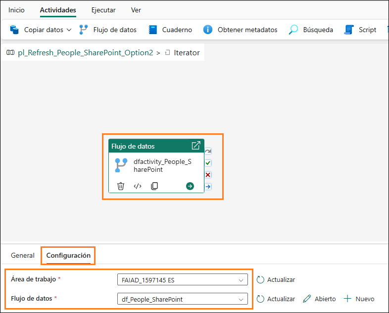

### Tarea 9: Configurar la primera actividad de Establecer variable

Hemos configurado la actividad del flujo de datos como lo hicimos
anteriormente en el laboratorio. Ahora agregaremos nueva lógica. Si la actualización del flujo de datos se realiza correctamente, debemos salir del iterador Hasta. Recuerde que una de las condiciones para que exista el iterador es establecer el valor de la variable varIsSuccess en Sí.

1. En el menú superior, seleccione **Actividades -\> Establecer
 variable**. La actividad variable establecida se agrega al lienzo de diseño.

2. Con **la actividad Establecer variable** seleccionada, en el panel inferior, seleccione **General**. Pongamos un nombre y una
 descripción a la actividad.

3. En el campo **Nombre**, introduzca **set_varIsSuccess**.

4. En el campo **Descripción**, introduzca **Set variable varIsSuccess to Yes.**

    **Nota:** Pase el cursor por encima de **la actividad del flujo de datos**. A la derecha del cuadro de actividad hay cuatro iconos. Según el resultado de la actividad, se pueden utilizar para conectarse a la siguiente:

    a. El icono de la **flecha curva gris** se utiliza para omitir la
    actividad.

    b. El icono de la **marca de verificación verde** se utiliza en caso de éxito de la actividad.

    c. El icono de la **marca roja con forma de x** se utiliza en caso de fallo de la actividad.

    d. El icono de la **flecha recta azul** se utiliza al finalizar la actividad.

5. Haga clic en la **marca de verificación verde** desde la actividad del flujo de datos dfactivity_People_SharePoint y arrastre para conectarse a la nueva **actividad de Establecer variable** de **set_varIsSuccess**. Entonces, si la actualización del flujo de datos se lleva a cabo con éxito, queremos ejecutar la actividad Establecer variable.

   

6. Con **la actividad Establecer variable** seleccionada, haga clic en **Configuración** en el menú inferior.

7. En el panel inferior, asegúrese de que **Tipo de variable** sea **Variable de canalización**.

8. En el campo **Nombre**, seleccione **varIsSuccess.** Esta es la variable cuyo valor vamos a establecer.

9. En el campo **Valor**, seleccione el **cuadro de diálogo**.
 Seleccione el vínculo **Agregar contenido dinámico**.

   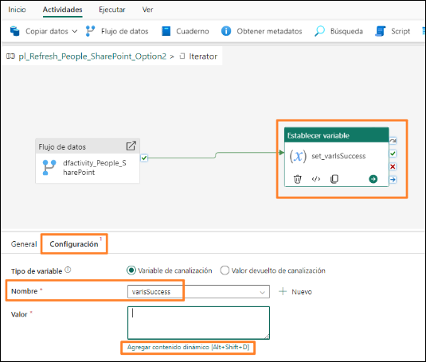

10. Se abre el cuadro de diálogo Generador de expresiones de
 canalización. Seleccione el área de texto **Agregue contenido
 dinámico a continuación con cualquier combinación de expresiones, funciones y variables del sistema (1)**.

11. En el menú inferior, haga clic en los **puntos suspensivos(...) (2)** seleccione **Variables (3) -\> varSuccess**. Observe que se introduce **\@variables(\'varSuccess\')** en el área de texto Agregar contenido dinámico debajo. Recuerde que cuando creamos variables, habíamos preestablecido el valor de la variable varSuccess en Sí. Entonces, asignamos el valor Sí a la variable varIsSuccess.

12. Seleccione **Aceptar**. Volverá al **panel de diseño del iterador**.

    

    

    Ahora necesitamos configurar el contador si falla la actividad del flujo de datos. En una canalización de datos, no podemos hacer referencia a una variable. Lo que significa que no podemos incrementar la variable de contador varCounter si agregamos uno a su valor (varCounter = varCounter + 1). Entonces, utilizamos la variable varTempCounter.

### Tarea 10: Configurar la segunda actividad de Establecer variable

1. En el menú superior, seleccione **Actividades -\> Establecer
 variable**. La actividad variable establecida se agrega al lienzo de diseño.

2. Con **la actividad Establecer variable** seleccionada, en el panel inferior, seleccione **General**. Pongamos un nombre y una
 descripción a la actividad.

3. En el campo **Nombre**, introduzca **set_varTempCounter**.

4. En el campo **Descripción**, introduzca **Increment variable
 varTempCounter.**

5. Haga clic en la **marca roja con forma de x** desde la actividad del flujo de datos hasta la nueva actividad Establecer variable. Entonces, si la actualización del flujo de datos falla, queremos ejecutar esta actividad Establecer variable.

   

6. Con **la actividad Establecer variable** seleccionada, seleccione **Configuración** en el menú inferior.

7. En el panel inferior, asegúrese de que **Tipo de variable** sea **Variable de canalización**.

8. En el campo **Nombre**, seleccione **varTempCounter**. Esta es la variable cuyo valor vamos a establecer.

9. En el campo **Valor**, seleccione el **cuadro de diálogo**.
 Seleccione el vínculo **Agregar contenido dinámico**.

10. Se abre el cuadro de diálogo Generador de expresiones de canalización. Introduzca **\@add(variables(\'varCounter\'),1)**

    **Nota:** Siéntase libre de escribir esta expresión, use el menú para seleccionar las funciones o copiarla y pegarla. Esta función establece el valor de la variable varTempCounter al valor de la variable varCounter más uno (varTempCounter = varCounter + 1).

    

Ahora necesitamos establecer el valor de la variable varCounter en el valor de varTempCounter.

### Tarea 11: Configurar la tercera actividad de Establecer variable

1. En el menú superior, seleccione **Actividades -\> Establecer
variable**. La actividad variable establecida se agrega al lienzo de diseño.

2. Con **la actividad Establecer variable** seleccionada, en el panel inferior, seleccione **General**. Pongamos un nombre y una
descripción a la actividad.

3. En el campo **Nombre**, introduzca **set_varCounter**.

4. En el campo **Descripción**, introduzca **Increment variable
varCounter.**

5. Haga clic en la **marca de verificación verde** desde la actividad Establecer variable set_varTempCounter y arrastre para conectarse a la nueva **actividad de Establecer variable de set_varCounter**.

   

6. Con **la actividad set_varCounter** seleccionada, haga clic en
**Configuración** en el menú inferior.

7. En el panel inferior, asegúrese de que **Tipo de variable** sea **Variable de canalización**.

8. En el campo **Nombre**, seleccione **varCounter**. Esta es la
variable cuyo valor vamos a establecer.

9. En el campo **Valor**, seleccione el **cuadro de diálogo**.
Seleccione el vínculo **Agregar contenido dinámico**.

10. Se abre el cuadro de diálogo Generador de expresiones de
canalización. Introduzca **\@variables(\'varTempCounter\')**.
Siéntase libre de escribir esta expresión o use el menú para
seleccionar las funciones o copiarla y pegarla.

11. Haga clic en Aceptar.

    

    **Nota:** Esta función establece el valor de la variable varCounter al valor de la variable varTempCounter (varCounter = varTempCounter). Al final de cada iteración, tanto varCounter como varTempCounter tienen el mismo valor.

### Tarea 12: Configurar la actividad Esperar

A continuación, debemos esperar cinco minutos/300 segundos si la
actualización del flujo de datos falla la primera vez antes de volver a intentarlo. Si la actualización del flujo de datos falla una segunda vez, debemos esperar 15 minutos/900 segundos y volver a intentarlo. Usaremos la actividad de espera y la variable varWaitTime para establecer el tiempo de espera.

1. En el menú superior, seleccione **Actividades -\> puntos suspensivos (...) -\> Esperar**. La actividad Esperar se agrega al lienzo de diseño.

2. Con la **actividad Esperar** seleccionada, en el panel inferior, seleccione **General**. Pongamos un nombre y una descripción a la actividad.

3. En el campo **Nombre**, introduzca **wait_onFailure**.

4. En el campo **Descripción**, introduzca **Wait for 300 seconds on 2nd try and 900 seconds on 3rd try.**

5. Haga clic en la **marca de verificación verde** desde la actividad Establecer variable set_varCounter y arrastre para conectarse a la nueva **actividad de Esperar wait_onFailure**.

   

6. Con **la actividad Esperar** seleccionada, haga clic en
**Configuración** en el menú inferior.

7. En el campo **Tiempo de espera en segundos**, seleccione el **cuadro de texto** y, después, el vínculo **Agregar contenido dinámico**.

8. Se abre el cuadro de diálogo Generador de expresiones de canalización. Introducir

    ```
        @if(
        greater(variables(‘varCounter’), 1),
        if(equals(variables(‘varCounter’), 2),
        mul(variables(‘varWaitTime’),15 ), 
        mul(variables(‘varWaitTime’), 0)
        ),
        mul(variables(‘varWaitTime’),5 )
        )
    ```
    Siéntase libre de escribir esta expresión o use el menú para seleccionar las funciones o copiarla y pegarla.

    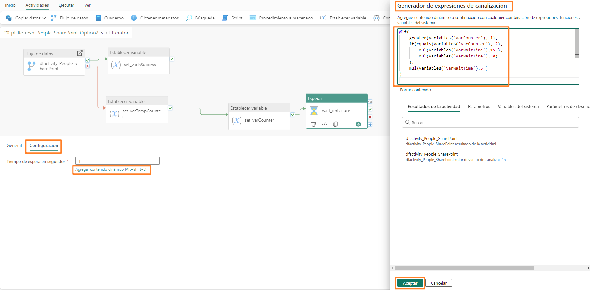

Aquí usamos dos nuevas funciones:

- **greater:** toma dos números como parámetros y compara cuál es
    mayor.

- **mul:** esta es una función de multiplicación, necesita dos
    parámetros para multiplicar.

    La expresión es una declaración if anidada. Está comprobando si el valor de la variable varCounter es mayor que 1.

    Si es true, comprueba si el valor de la variable varCounter es 2. Si es true, establece el tiempo de espera en varWaitTime multiplicado por 15. Recuerde, habíamos establecido el valor predeterminado de varWaitTime a 60. Eso sería 60\*15 = 900 segundos. Si el valor de la variable
    varCounter no es 2 (es mayor que 2, lo que significa que la
    actualización del flujo de datos ha fallado 3 veces, hemos terminado de iterar. No tenemos que esperar más), el tiempo de espera se establece en varWaitTime \*0. O sea, 0. Si el valor de la variable varCounter es 1, entonces multiplicamos varWaitTime \*5. Eso sería 60\*5 = 300 segundos.

9. Seleccione **Aceptar**.

    **Punto de control:** su iterador Hasta debería verse como la captura de
    pantalla siguiente.

    

10. Desde la parte superior izquierda del lienzo de diseño, seleccione **pl_Refresh_People_Sharepoint_Option2** para salir del iterador Hasta.

    

11. Hemos terminado de crear la canalización de datos. En el menú
superior, seleccione el **icono Inicio -\> Guardar** para guardar la canalización de datos.

    

### Tarea 13: Configurar la actualización programada para la canalización de datos

1. Podemos probar la canalización de datos si seleccionamos **Inicio -> Ejecutar.**

    **Nota:** Es posible que la actualización de la canalización de datos tarde unos minutos. Este es un entorno de capacitación, por lo que el archivo en SharePoint siempre está disponible. Por lo tanto, su canalización de datos nunca fallará.

2. Podemos configurar la canalización de datos para que se ejecute según una programación. En el menú superior, seleccione **Inicio -\> Programar**. Se abre el cuadro de diálogo de programación.

3. Establezca el botón de opción **Ejecución programada** en
 **Activar**.

4. Establezca **el menú desplegable Repetir** en **Diario**.

5. Establezca **Hora** en **09:00**.

6. Establezca la **Fecha y hora de inicio** en **Hoy**.

7. Establezca **Fecha y hora de finalización** en una **fecha futura**.

8. Establezca su **Zona horaria**.

    **Nota:** dado que se trata de un entorno de laboratorio, puede configurar la zona horaria según su zona horaria preferida. En un escenario real, configurará la zona horaria según la ubicación de su origen de datos.

9. Seleccione **Aplicar**.

10. Seleccione la marca con forma de **X** en la parte superior derecha del cuadro de diálogo para cerrarlo.

    

11. Seleccione el área de trabajo de Fabric **FAIAD_<inject key="Deployment ID" enableCopy="false"/>** en el panel izquierdo para navegar al área de trabajo**.**

    **Nota:** En la pantalla Programación, no hay ninguna opción para notificar sobre el éxito o el error (como la programación de flujos de datos). La notificación se puede llevar a cabo mediante una actividad en la canalización de datos. No lo haremos en este laboratorio, ya que es un entorno de laboratorio.

Hemos programado actualizaciones para los distintos orígenes de datos.
Crearemos un modelo semántico con relaciones, medidas y otras
operaciones de modelado en el próximo laboratorio.


# Referencias

Fabric Analyst in a Day (FAIAD) le presenta algunas funciones clave
disponibles en Microsoft Fabric. En el menú del servicio, la sección
Ayuda (?) tiene vínculos a algunos recursos excelentes.


   

Estos son algunos recursos más que podrán ayudarle a seguir avanzando
con Microsoft Fabric.

- Vea la publicación del blog para leer el [anuncio de disponibilidad general de Microsoft Fabric](https://aka.ms/Fabric-Hero-Blog-Ignite23) completo.

- Explore Fabric a través de la [Visita guiada](https://aka.ms/Fabric-GuidedTour)

- Regístrese en la [prueba gratuita de Microsoft Fabric](https://aka.ms/try-fabric)

- Visite el [sitio web de Microsoft Fabric](https://aka.ms/microsoft-fabric)

- Adquiera nuevas capacidades mediante la exploración de los [módulos de aprendizaje de Fabric](https://aka.ms/learn-fabric)

- Explore la [documentación técnica de Fabric](https://aka.ms/fabric-docs)

- Lea el [libro electrónico gratuito sobre cómo empezar a usar Fabric](https://aka.ms/fabric-get-started-ebook)

- Únase a la [comunidad de Fabric](https://aka.ms/fabric-community) para publicar sus preguntas, compartir sus comentarios y aprender de otros.

Obtenga más información en los blogs de anuncios de la experiencia
Fabric:

- [Experiencia de Data Factory en el blog de Fabric](https://aka.ms/Fabric-Data-Factory-Blog) 

- [Experiencia de Synapse Data Engineering en el blog de Fabric](https://aka.ms/Fabric-DE-Blog) 

- [Experiencia de Synapse Data Science en el blog de Fabric](https://aka.ms/Fabric-DS-Blog) 

- [Experiencia de Synapse Data Warehousing en el blog de Fabric](https://aka.ms/Fabric-DW-Blog) 

- [Experiencia de Synapse Real-Time Analytics en el blog de Fabric](https://aka.ms/Fabric-RTA-Blog)

- [Blog de anuncios de Power BI](https://aka.ms/Fabric-PBI-Blog)

- [Experiencia de Data Activator en el blog de Fabric](https://aka.ms/Fabric-DA-Blog) 

- [Administración y gobernanza en el blog de Fabric](https://aka.ms/Fabric-Admin-Gov-Blog)

- [OneLake en el blog de Fabric](https://aka.ms/Fabric-OneLake-Blog)

- [Blog de integración de Dataverse y Microsoft Fabric](https://aka.ms/Dataverse-Fabric-Blog)

© 2025 Microsoft Corporation. Todos los derechos reservados.

Al participar en esta demostración o laboratorio práctico, acepta las siguientes condiciones:

Microsoft Corporation pone a su disposición la tecnología o funcionalidad descrita en esta demostración/laboratorio práctico con el fin de obtener comentarios por su parte y de facilitarle una experiencia de aprendizaje. Esta demostración/laboratorio práctico solo se puede usar para evaluar las características de tal tecnología o funcionalidad y para proporcionar comentarios a Microsoft. No se puede usar para ningún otro propósito. Ninguna parte de esta demostración/laboratorio práctico se puede modificar, copiar, distribuir, transmitir, mostrar, realizar, reproducir, publicar, licenciar, transferir ni vender, ni tampoco crear trabajos derivados de ella.

LA COPIA O REPRODUCCIÓN DE ESTA DEMOSTRACIÓN/LABORATORIO PRÁCTICO (O PARTE DE ELLA) EN CUALQUIER OTRO SERVIDOR O UBICACIÓN PARA SU REPRODUCCIÓN O DISTRIBUCIÓN POSTERIOR QUEDA EXPRESAMENTE PROHIBIDA.

ESTA DEMOSTRACIÓN/LABORATORIO PRÁCTICO PROPORCIONA CIERTAS FUNCIONES Y CARACTERÍSTICAS DE PRODUCTOS O TECNOLOGÍAS DE SOFTWARE (INCLUIDOS POSIBLES NUEVOS CONCEPTOS Y CARACTERÍSTICAS) EN UN ENTORNO SIMULADO SIN INSTALACIÓN O CONFIGURACIÓN COMPLEJA PARA EL PROPÓSITO ARRIBA DESCRITO. LA TECNOLOGÍA/CONCEPTOS DESCRITOS EN ESTA DEMOSTRACIÓN/LABORATORIO PRÁCTICO NO REPRESENTAN LA FUNCIONALIDAD COMPLETA DE LAS CARACTERÍSTICAS Y, EN ESTE SENTIDO, ES POSIBLE QUE NO FUNCIONEN DEL MODO EN QUE LO HARÁN EN UNA VERSIÓN FINAL. ASIMISMO, PUEDE QUE NO SE PUBLIQUE UNA VERSIÓN FINAL DE TALES CARACTERÍSTICAS O CONCEPTOS. DE IGUAL MODO, SU EXPERIENCIA CON EL USO DE ESTAS CARACTERÍSTICAS Y FUNCIONALIDADES EN UN ENTORNO FÍSICO PUEDE SER DIFERENTE.

**COMENTARIOS**. Si envía comentarios a Microsoft sobre las características, funcionalidades o conceptos de tecnología descritos en esta demostración/laboratorio práctico, acepta otorgar a Microsoft, sin cargo alguno, el derecho a usar, compartir y comercializar sus comentarios de cualquier modo y para cualquier fin. También concederá a terceros, sin cargo alguno, los derechos de patente necesarios para que sus productos, tecnologías y servicios usen o interactúen con cualquier parte específica de un software o servicio de Microsoft que incluya los comentarios. No enviará comentarios que estén sujetos a una licencia que obligue a Microsoft a conceder su software o documentación bajo licencia a terceras partes porque incluyamos sus comentarios en ellos. Estos derechos seguirán vigentes después del vencimiento de este acuerdo.

MICROSOFT CORPORATION RENUNCIA POR LA PRESENTE A TODAS LAS GARANTÍAS Y CONDICIONES RELATIVAS A LA DEMOSTRACIÓN/LABORATORIO PRÁCTICO, INCLUIDA CUALQUIER GARANTÍA Y CONDICIÓN DE COMERCIABILIDAD (YA SEA EXPRESA, IMPLÍCITA O ESTATUTARIA), DE IDONEIDAD PARA UN FIN DETERMINADO, DE TITULARIDAD Y DE AUSENCIA DE INFRACCIÓN. MICROSOFT NO DECLARA NI GARANTIZA LA EXACTITUD DE LOS RESULTADOS, EL RESULTADO DERIVADO DE LA REALIZACIÓN DE LA DEMOSTRACIÓN/LABORATORIO PRÁCTICO NI LA IDONEIDAD DE LA INFORMACIÓN CONTENIDA EN ELLA CON NINGÚN PROPÓSITO.

**DECLINACIÓN DE RESPONSABILIDADES**

Esta demostración/laboratorio práctico contiene solo una parte de las nuevas características y mejoras realizadas en Microsoft Power BI. Puede que algunas de las características cambien en versiones futuras del producto. En esta demostración/laboratorio práctico, conocerá algunas de estas nuevas características, pero no todas.