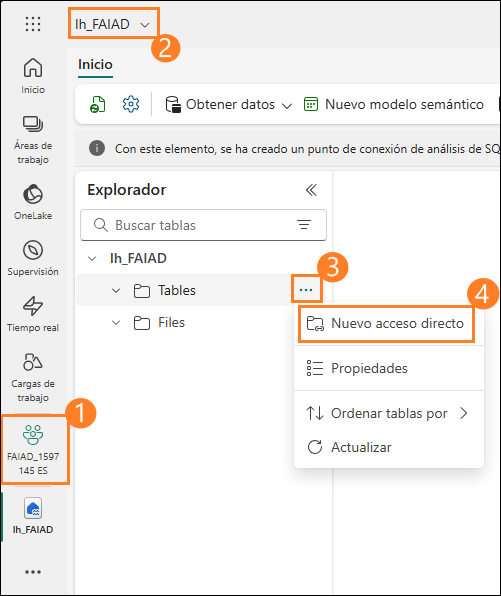
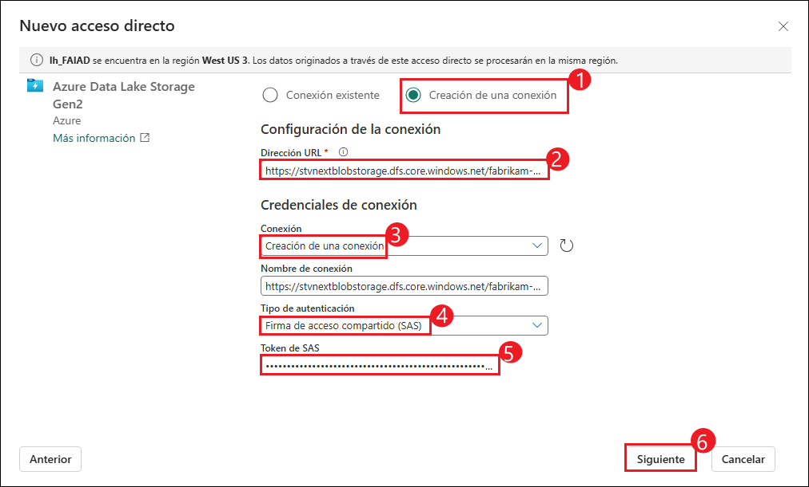
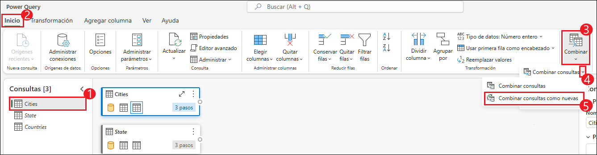
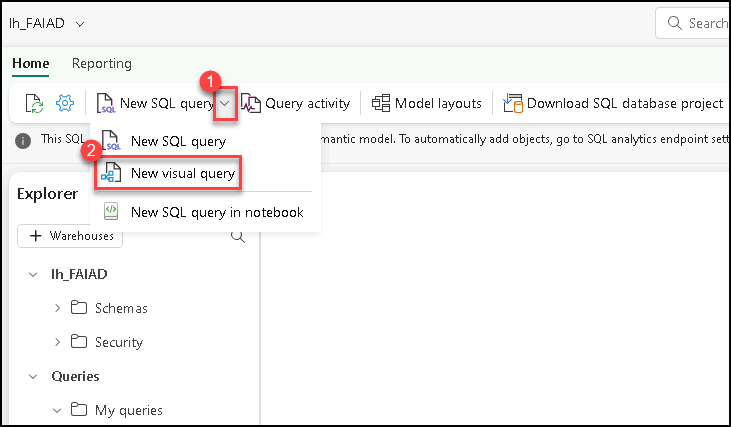
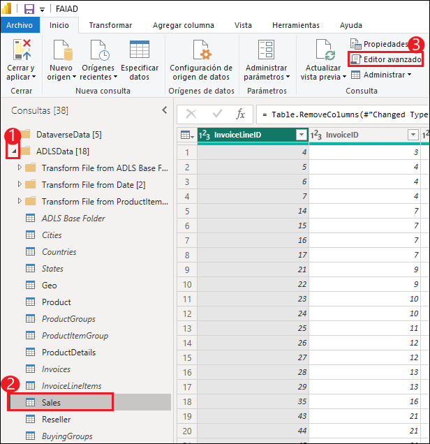
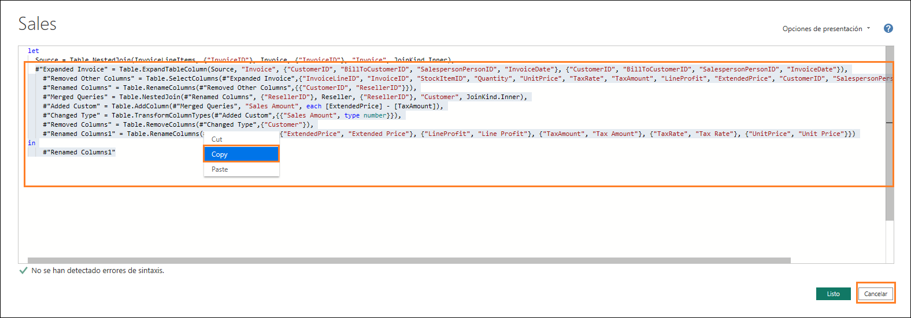
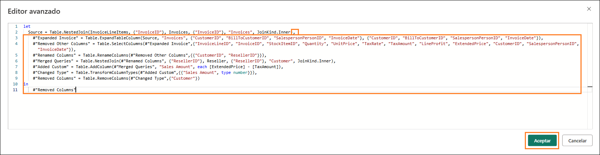
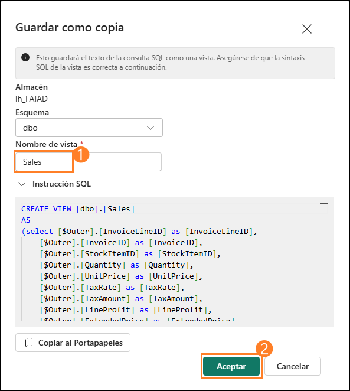

# Microsoft Fabric Fabric Analyst in a Day - Laboratorio 3


# Contenido
 
- Presentación	
- Acceso directo a ADLS Gen2	
   - Tarea 1: Crear acceso directo	
- Transformar datos mediante una consulta visual	
   - Tarea 2: Crear una vista Geo con consultas visuales
   - Tarea 3: Crear una vista Reseller con consultas visuales	
   - Tarea 4: Crear una vista Sales con consultas visuales	
   - Tarea 5: Crear una vista de producto con consultas visuales	
- Referencias	

# Presentación 

En nuestro escenario, los Datos de ventas provienen del sistema ERP y se almacenan en ADLS Gen2. Se actualiza a mediodía/12:00 todos los días. Necesitamos transformar e ingerir estos datos en un almacén de lago de datos y usarlos en nuestro modelo.

Hay varias formas de ingerir estos datos.

- **Accesos directos:** esto crea un vínculo con los datos, y podemos utilizar las vistas de consulta Visual para transformarlos. Usaremos accesos directos en este laboratorio.

- **Notebooks:** esto requiere que escribamos código. Es un enfoque amigable para los desarrolladores.

- **Flujo de datos Gen2:** probablemente esté familiarizado con Power Query o el flujo de datos de primera generación. El flujo de datos Gen2, como su nombre indica, es la versión más nueva del flujo de datos. Proporciona todas las capacidades de Power Query y el flujo de datos de primera generación con la capacidad adicional de transformar e ingerir datos en múltiples orígenes de datos. Presentaremos esto en los próximos laboratorios.

- **Canalización de datos:** esta es una herramienta de orquestación. Se pueden orquestar actividades para extraer, transformar e ingerir datos. Usaremos la canalización de datos para ejecutar la actividad del flujo de datos Gen2, que, a su vez, hará la extracción, transformación e ingestión.

Comenzaremos creando un acceso directo para ingerir datos en un almacén
de lago de datos desde el origen de datos de ADLS Gen2. Una vez
ingeridos, usaremos vistas de consulta visual para transformarlos.

Al final de este laboratorio, habrá aprendido:

- Cómo crear un acceso directo al almacén de lago de datos

- Cómo transformar datos mediante una consulta visual

# Acceso directo a ADLS Gen2

## Tarea 1: Crear acceso directo

Los accesos directos se utilizan para crear un vínculo a la ubicación de
destino. Los accesos directos proporcionan acceso a los datos sin
necesidad de mover físicamente los datos al almacén de lago de datos.
Esto es como crear accesos directos en el escritorio de Windows.

1. Volvamos al **área de trabajo de Fabric** que creó en el Laboratorio 2, Tarea 8.

2. Si no ha salido de la práctica de laboratorio anterior, estará en la pantalla del almacén de lago de datos. Si ha salido, no pasa nada. Seleccione **lh_FAIAD** para ir al almacén de lago de datos.

3. En el panel del **explorador** de la izquierda, seleccione los **puntos suspensivos** al lado de las **Tables**.

4. Seleccione **Nuevo acceso directo.**

    

5. Se abre el cuadro de diálogo **Nuevo acceso directo**. En **Orígenes externos**, seleccione **Azure Data Lake Storage Gen2**.

    

6. Seleccione Crear una nueva conexión.

7. Escriba el siguiente vínculo para la propiedad **URL**: <https://stvnextblobstorage.dfs.core.windows.net/fabrikam-sales>

8. Seleccione **Firma de acceso compartido (SAS)** en el menú desplegable Tipo de autenticación.

9. Copie el **Token de SAS** de la pestaña **Variables de entorno** (junto a la pestaña Guía de laboratorio) y맗칠guela en el cuadro **Token de SAS**.

10. Seleccione **Siguiente** en la esquina inferior derecha de la pantalla.
 
    

11. Se conectará a ADLS Gen2 con la estructura de directorios que se muestra en el panel izquierdo. Expanda **Delta-Parquet-Format-FY25.**

12. **Seleccione** los siguientes directorios:
    
    a. Application.Cities
    
    b. Application.Countries
    
    c. Application.StateProvinces
    
    d. DateDim
    
    e. Sales.BuyingGroups
    
    f. Sales.Customers
    
    g. Sales.InvoiceLines
    
    h. Sales.Invoices
    
    i. Warehouse.StockGroups
    
    j. Warehouse.StockItemStockGroups
    
    k. Warehouse.StockItems
    
       **Nota:** Sales.Invoices_May es el único directorio que no **está** seleccionado.

13. Seleccione **Siguiente**.

    

14. Se le dirigirá al siguiente cuadro de diálogo, donde podemos editar los nombres. Seleccione el **icono Editar** en Acciones para **Application.Cities**.

15. Cambie el nombre de **Application.Cities a Cities.**

16. Seleccione la marca de verificación al lado del nombre para guardar el cambio.
 
    

17. Del mismo modo, cambie el nombre de los nombres de acceso directo como se muestra a맊ontinuación:

    a. Application.Countries a **Countries**
    
    b. Application.StateProvinces a **States**
    
    c. DateDim a **Date**
    
    d. Sales.BuyingGroups a **BuyingGroups**
    
    e. Sales.Customers a **Customers**
    
    f. Sales.InvoiceLines a **InvoiceLineItems**
    
    g. Sales.Invoices a **Invoices**
    
    h. Warehouse.StockGroups a **ProductGroups**
    
    i. Warehouse.StockItemStockGroups a **ProductItemGroup**
    
    j. Warehouse.StockItems a **ProductItem**
    
       **Nota:** Compruebe dos veces los nombres. Un error tipográfico puede causar errores durante el laboratorio.

18. Seleccione **Crear** para crear el acceso directo.

    

19. Observe que todos los accesos directos se crean como tablas. Seleccione la tabla **BuyingGroups** y맖bserve que podemos ver una versión preliminar de los datos en el panel de datos.

    

El siguiente paso es transformar los datos, para que podamos crear un
modelo semántico. Vamos a맊rear vistas para transformar los datos.

# Transformar datos mediante una consulta visual

### Tarea 2: Crear una vista Geo con consultas visuales

1. Podemos tener acceso al almacén de lago de datos mediante un punto de conexión SQL. Esto permite consultar los datos y crear vistas. En la **parte superior derecha** de la pantalla, seleccione **Lakehouse -\> Punto de conexión de análisis SQL**.

    

    Esto le llevará al punto de conexión de análisis de SQL. Observe que el panel del Explorador ha cambiado. Ahora puede crear vistas, procedimientos almacenados, consultas y mucho más. Vamos a맊rear una consulta visual, ya que proporciona una interfaz similar a Power Query, y la guardaremos como una vista.Comenzaremos creando una vista Geo. Necesitamos fusionar los datos de la consulta Cities, States yCountries para crear la vista Geo.

2. En el menú principal, haga clic en el menú desplegable junto a **Nueva consulta SQL** y, a맊ontinuación, seleccione **Nueva consulta visual**.

    

3. Tendremos que arrastrar tablas al panel Consulta de objeto visual para crear una consulta. Vamos a arrastrar la consulta Cities, States y Countries al panel de consulta de objeto visual.

    

    Necesitamos fusionar estas consultas. Y la consulta visual viene con la opción de usar el Editor de Power Query. Usemos esto, ya que estamos familiarizados con esto.

4. En el menú del editor de consultas visuales, seleccione el icono **Abrir en menú emergente** (hacia맓a derecha). Se le llevará al Editor de Power Query.

    

5. Con la consulta Cities seleccionada, en la cinta del Editor de Power Query, seleccione **Inicio - \> Combinar consultas -\> Combinar consultas como nuevas**. Se abrirá el cuadro de diálogo Combinar consultas.

    **Nota:** Si no ve Combinar consultas en la cinta de opciones Inicio, haga clic en la lista desplegable para Combinar y seleccionar Combinar consultas.
 
    

6. En **Tabla izquierda para combinación**, seleccione **Cities**.

7. En **Tabla derecha para combinación**, seleccione **States**.

8. Seleccione las columnas **StateProvinceID** de ambas tablas. Vamos a unirnos usando esta columna.

9. Seleccione **Interior** como el **Tipo de combinación**.

10. Seleccione **Aceptar**.

    

    Observe que se ha creado una nueva consulta llamada Merge. Necesitamos algunas columnas de States.

11. En la **vista Datos** (panel inferior), haga clic en la **doble flecha** al lado de la columna **States** (última columna a la derecha).

12. Se abre un panel. **Seleccione** las siguientes columnas:

    a. StateProvinceCode

    b. StateProvinceName

    c. CountryID

    d. SalesTerritory

13. Seleccione **Aceptar**.

    

    Necesitamos fusionar la consulta Countries ahora.

14. Con la consulta de combinación seleccionada, seleccione **Inicio -\> Combinar consultas -\> Combinar consultas** de la cinta de opciones.

    **Nota:** Si no ve Combinar consultas en la cinta de opciones Inicio,
haga clic en la lista desplegable para Combinar y seleccionar Combinar
consultas.
 
    

15. Se abrirá el cuadro de diálogo Combinar consulta. En **Tabla derecha para combinación**, seleccione **Countries**.

16. Seleccione las columnas **CountryID** de ambas tablas. Vamos a unirnos usando esta columna.

17. Seleccione **Interior** como el **Tipo de combinación**.

18. Seleccione **Aceptar**.

    

    Necesitamos algunas columnas de Countries.

19. En el panel **vista Datos** (panel inferior), haga clic en la **doble flecha** al lado de la columna **Countries**.

20. Se abre un panel. **Seleccione** las siguientes columnas:
 
    a. CountryName
    
    b. FormalName
    
    c. IsoAlpha3Code
    
    d. IsoNumericCode
    
    e. CountryType
    
    f. Continent
    
    g. Region
    
    h. Subregion

21. Seleccione **Aceptar**.

    

    No necesitamos todas las columnas. Seleccione solo aquellos que necesitamos.

22. Con la consulta de combinación seleccionada, en la cinta de opciones seleccione **Inicio -\> Elegir맊olumnas -\> Elegir columnas**.

    **Nota:** Si la opción Elegir columnas no está visible, puede encontrarla en Administrar columnas.
 
    

23. Se abrirá el cuadro de diálogo Elegir columnas. **Desmarque** las siguientes columnas.

    a. StateProvinceID

    b. Location

    c. LastEditedBy

    d. ValidFrom

    e. ValidTo

    f. CountryID

24. Seleccione **Aceptar**.

    

    Observe que el proceso es como el de Power Query, tenemos todos los pasos registrados tanto en el panel Pasos aplicados de la derecha como en la vista visual. Vamos a cambiar el nombre de Combinar consulta a Habilitar carga de modo que se carguen los datos desde esta consulta.

25. **Haga clic con el botón derecho en Combinar** consulta en el panel Consultas (izquierda). Seleccione **Cambiar nombre** y cambie el nombre de la consulta a **Geo**.

26. **Haga clic con el botón derecho en la consulta Geo** en el panel Consultas (izquierdo). Seleccione **Habilitar carga** para habilitar esta consulta.

27. Asegúrese de que las consultas de Cities, States y Countries estén **deshabilitadas**.

28. Seleccione **Guardar**, que se encuentra en la parte inferior derecha del editor de Power Query.

    

    Se nos dirigirá al editor de consultas visuales. Guardemos ahora esta consulta como una vista.
    
    **Nota:** Todos los pasos que hemos realizado con el Editor de Power Query también se pueden llevar a맊abo con el editor de consultas visuales.

29. En el menú del editor de consultas visuales, seleccione **Guardar como copia**.

    

    Se abre el cuadro de diálogo Guardar como copia. Observe que la consulta SQL está disponible. Puede revisarlo, si así lo desea.

30. Escriba **Geo** como **Nombre de la vista**.

31. Seleccione **Aceptar** para guardar la vista.

    

    Recibirá una alerta una vez que se guarde la vista.

32. En el panel Explorador (izquierda), expanda **Views.** Tenemos la vista Geo recién creada.
 
    

### Tarea 3: Crear una vista Reseller con consultas visuales

Vamos a crear una vista Reseller, que se crea al combinar la tabla
Customers con la tabla BuyingGroups. Esta vez crearemos la vista
mediante la consulta Visual.

1. En el menú principal, haga clic en el menú desplegable junto a **Nueva consulta SQL** y, a맊ontinuación, seleccione **Nueva consulta visual**.

2. En la sección Explorador, arrastre las tablas Customers y BuyingGroups a la sección de consulta de objeto visual.

    

    

3. **Seleccione la consulta Customers**. Cuando se selecciona, Customers tendrá un borde azul y hay un signo \"+\" después de Tabla (esto indica que estamos agregando un paso después de Tabla. Si맕o ve el signo \"+\" después de la tabla, es posible que haya seleccionado un paso diferente. Seleccione Tabla y estará listo).

4. En el menú Consulta visual, seleccione **Combinar -\> Combinar consultas**.

    

    Se abre el cuadro de diálogo Combinar con Customers seleccionado como la tabla superior.

5. En la **tabla derecha para combinación**, seleccione **BuyingGroups**.

6. Seleccione las columnas **BuyingGroupID** de ambas tablas. Vamos a unirnos usando esta columna.

7. Seleccione **Interior** como el **Tipo de combinación**.

8. Seleccione **Aceptar**.

    

9. En la **Vista de datos** (panel inferior), haga clic en la **doble flecha** al lado de la columna **BuyingGroups** (última columna a la derecha) para seleccionar las columnas que necesitamos de BuyingGroups.

10. Se abre un panel. **Seleccione la columna** **BuyingGroupName**.

11. Seleccione **Aceptar**.

    

    No necesitamos todas las columnas. Seleccione solo aquellos que necesitamos.

12. En el menú Consulta visual, seleccione **Administrar columnas -\> Elegir columnas**.

    

13. Se abrirá el cuadro de diálogo Elegir columnas. **Seleccione** las siguientes columnas.

    a. ResellerID

    b. ResellerName

    c. PostalCityID

    d. PhoneNumber

    e. FaxNumber

    f. WebsiteURL

    g. DeliveryAddressLine1

    h. DeliveryAddressLine2

    i. DeliveryPostalCode

    j. PostalAddressLine1

    k. PostalAddressLine2

    l. PostalPostalCode

    m. BuyingGroupName

14. Seleccione **Aceptar**.

    

15. Vamos a cambiar el nombre de la columna BuyingGroupName. En la **vista Datos, haga doble clic en el encabezado de columna BuyingGroupName** para hacer que sea editable.

16. **Cambie el nombre** de la columna a **ResellerCompany**.

    

    Observe que la tabla Cliente tiene todos los pasos documentados. Ahora guardemos esta vista.

17. Necesitamos guardar la consulta Customer, ya que tiene todos los pasos. Necesitamos habilitar la carga. Seleccione los **puntos suspensivos** en el cuadro de consulta **Customer**.

18. Asegúrese de que la opción **Habilitar carga** esté activada.

    

    **Nota:** La casilla **Customer** debe tener un borde azul si se activa la opción Habilitar carga.

19. En el menú de consultas visuales, seleccione **Guardar como copia**.

    

    Se abre el cuadro de diálogo Guardar como copia. Observe que la consulta SQL está disponible. Puede revisarlo, si así lo desea.

20. Escriba **Reseller** como **Nombre de la vista**.

21. Seleccione **Aceptar** para guardar la vista.

    

    Recibirá una alerta una vez que se guarde la vista.

22. En el panel Explorador (izquierda), expanda **Views.** Tenemos la vista Reseller recién creada.

    

### Tarea 4: Crear una vista Sales con consultas visuales

Vamos a crear la vista Sales, que se crea combinando la tabla
InvoiceLineItems e Invoices y la vista Reseller. Tenemos esta consulta
en Power BI Desktop. Copiaremos el código del Editor avanzado. Pero
antes de copiar el código, necesitamos crear una tabla de fusión
utilizando Visual query ya que crear una consulta en blanco no es
posible en la consulta visual. Vamos a probar este método.

1. En el menú principal, haga clic en el menú desplegable junto a **Nueva consulta SQL** y, a맊ontinuación, seleccione **Nueva consulta visual**.

    

2. En la sección **Explorador -\> Table**, arrastre las tablas **InvoiceLineItems** e **Invoices** a la sección de consulta visual.

3. En la sección **Explorador -\> Views**, arrastre la vista **Reseller** a la sección de consulta visual

4. En el editor de consultas visuales, seleccione **Abrir en ventana emergente** para abrir el Editor de Power Query.

    

5. Con la consulta InvoiceLineItems seleccionada, en la cinta del editor, seleccione **Inicio - \> Combinar consultas -\> Combinar consultas como nuevas**.

    **Nota:** Si no ve Combinar consultas en la cinta de opciones Inicio, haga clic en la lista desplegable para Combinar y seleccionar Combinar consultas.

    

    Se abrirá el cuadro de diálogo Combinar.

6. En **Tabla izquierda para combinación**, seleccione **InvoiceLineItems**.

7. En **Tabla derecha para combinación**, seleccione **Invoices**.

8. Seleccione las columnas **InvoiceID** de ambas tablas. Vamos a unirnos usando esta columna.

9. Seleccione **Interior** como el **Tipo de combinación**.

10. Seleccione **Aceptar**.

    

    Vamos a copiar el código de Power BI Desktop y pegarlo con el Editor avanzado.

11. Si aún no lo ha abierto, abra **FAIAD.pbix**, que se encuentra en la carpeta **Reports** en el escritorio de su entorno de laboratorio.

12. En la cinta de opciones, seleccione **Inicio -\> Transformar datos**. Se abre la ventana de Power Query. Como habrá notado en la práctica de laboratorio anterior, las consultas en el panel izquierdo están organizadas por orígenes de datos.

    

13. En el panel izquierdo, en la carpeta ADLSData, seleccione la consulta **Sales.**

14. En la cinta de opciones, seleccione **Inicio -\> Editor avanzado**. Se abre el cuadro de diálogo del Editor avanzado.

    

    **Nota:** Si no encuentra el Editor avanzado, puede acceder a él en **Inicio -\> Consulta -\> Editor avanzado**.

15. **Seleccione el código de la Línea 3** (#\"Expanded Invoice\" ...) hasta la última línea de código.

16. **Haga clic con el botón derecho** y seleccione **Copy**.

17. Seleccione **Cancelar** para cerrar el Editor avanzado.

    

18. **Regrese a la ventana/pestaña del navegador** donde tiene abierto el Editor de Power Query.

19. Asegúrese de que se ha seleccionado la consulta **Combinar**.

20. En la cinta de opciones, seleccione **Inicio -\> Editor avanzado**. Se abre el cuadro de diálogo del Editor avanzado.

    

21. Al final de la **línea 2 agregue una coma** (Source = Table.NestedJoin(InvoiceLineItems, {\"InvoiceID\", Invoices,}\"InvoiceID\" {}, \"Invoices\", JoinKind.Inner)

22. Haga clic en **Entrar** para empezar una nueva línea.

23. Introduzca **Ctrl+V** en el teclado para pegar el código que Power BI Desktop ha copiado.

    **Nota:** Si está trabajando en el entorno de laboratorio, seleccione los **puntos suspensivos (...)** en la맗arte superior derecha de la pantalla. Utilice el control deslizante para **habilitar** **Portapapeles nativo de VM**. Seleccione Aceptar en el cuadro de diálogo. Una vez que haya terminado de pegar las consultas, puede desactivar esta opción.

    

    

24. Resalte las dos últimas líneas de código (en Origen) y **elimínelas**.

25. Seleccione **Aceptar** para guardar las modificaciones.

    ```
    let
      Source = Table.NestedJoin(InvoiceLineItems, {"InvoiceID"}, Invoices, {"InvoiceID"}, "Invoices", JoinKind.Inner),
        #"Expanded Invoice" = Table.ExpandTableColumn(Source, "Invoices", {"CustomerID", "BillToCustomerID", "SalespersonPersonID", "InvoiceDate"}, {"CustomerID", "BillToCustomerID", "SalespersonPersonID", "InvoiceDate"}),
        #"Removed Other Columns" = Table.SelectColumns(#"Expanded Invoice",{"InvoiceLineID", "InvoiceID", "StockItemID", "Quantity", "UnitPrice", "TaxRate", "TaxAmount", "LineProfit", "ExtendedPrice", "CustomerID", "SalespersonPersonID", "InvoiceDate"}),
        #"Renamed Columns" = Table.RenameColumns(#"Removed Other Columns",{{"CustomerID", "ResellerID"}}),
        #"Merged Queries" = Table.NestedJoin(#"Renamed Columns", {"ResellerID"}, Reseller, {"ResellerID"}, "Customer", JoinKind.Inner),
        #"Added Custom" = Table.AddColumn(#"Merged Queries", "Sales Amount", each [ExtendedPrice] - [TaxAmount]),
        #"Changed Type" = Table.TransformColumnTypes(#"Added Custom",{{"Sales Amount", type number}}),
        #"Removed Columns" = Table.RemoveColumns(#"Changed Type",{"Customer"})
    in
        #"Removed Columns"
    ```

    

    Si resulta más fácil, elimine todo el código del Editor avanzado y pegue el siguiente código en el Editor avanzado.

26. Se le llevará de vuelta al Editor de Power Query. En el panel de consultas izquierdo, **haga doble clic en Combinar** consulta para cambiar su nombre.

27. **Cambie el nombre** de la consulta de combinación a **Sales**.

28. Haga clic con el botón derecho en la consulta de Sales y seleccione **Habilitar carga** para permitir que se cargue la consulta.

    

29. Seleccione **Guardar** para guardar y cerrar el cuadro de diálogo de Power Query. Esto le llevará a맓a consulta visual.

30. En el menú de consultas visuales, seleccione **Guardar como copia**. Se abre el cuadro de diálogo Guardar como copia. Observe que la consulta SQL está disponible. Puede revisarlo, si así lo desea.

31. Escriba **Sales** como **Nombre de la vista**.

32. Seleccione **Aceptar** para guardar la vista.

    

    Recibirá una alerta una vez que se guarde la vista.

33. En el panel Explorador (izquierda), expanda **Views.** Tenemos la vista Sales recién creada.

    

### Tarea 5: Crear una vista de producto con consultas visuales

Vamos a crear la vista Producto, que se crea mediante la combinación de
las tablas **ProductItem**, **ProductItemGroup** y **ProductGroups**.
Para avanzar en las cosas, copiaremos el código en el Editor avanzado.

1. En la barra de menús de Almacén de lago de datos, seleccione **Inicio -\> menú desplegable Nueva consulta SQL 游몱 Nueva consulta visual**. Se마bre una nueva consulta de objeto visual.

2. En la sección Explorador, arrastre las tablas **ProductItem, ProductItemGroup y ProductGroups** a la sección de consulta visual

3. En el editor de consultas visuales, seleccione el **icono de modo de enfoque** para abrir el Editor de Power Query.

    

4. Con la consulta **ProductItem** seleccionada, en la cinta del editor, seleccione **Inicio - \> Combinar consultas -\> Combinar consultas como nuevas.** Se abrirá el cuadro de diálogo Combinar.

    

5. En **Tabla izquierda para combinación**, seleccione **ProductItem**.

6. En **Tabla derecha para combinación**, seleccione **ProductItemGroup**.

7. Seleccione las columnas **StockItemID** de ambas tablas. Vamos a unirnos usando esta columna.

8. Seleccione **Externa izquierda** como **Tipo de combinación**.

9. Seleccione **Aceptar.** Se crea la nueva consulta de combinación.

    

10. Con la consulta de combinación seleccionada, en la cinta de opciones, seleccione **Inicio -\> Editor마vanzado**. Se abre el cuadro de diálogo del Editor avanzado.
 
    

    **Nota:** Si no encuentra el Editor avanzado, puede acceder a él en **Inicio -\> Consulta -\> Editor avanzado**.

11. **Seleccione todo el código** en el Editor avanzado y **elimínelo**.

12. **Pegue** el código siguiente en el Editor avanzado.

    ```
    let
       Source = Table.NestedJoin(ProductItem, {"StockItemID"}, ProductItemGroup, {"StockItemID"}, "ProductItemGroup", JoinKind.LeftOuter),
       #"Expanded ProductItemGroup" = Table.ExpandTableColumn(Source, "ProductItemGroup", {"StockGroupID"}, {"StockGroupID"}),
       #"Merged queries" = Table.NestedJoin(#"Expanded ProductItemGroup", {"StockGroupID"}, ProductGroups, {"StockGroupID"}, "ProductGroups", JoinKind.LeftOuter),
       #"Expanded ProductGroups" = Table.ExpandTableColumn(#"Merged queries", "ProductGroups", {"StockGroupName"}, {"StockGroupName"}),
       #"Choose columns" = Table.SelectColumns(#"Expanded ProductGroups", {"StockItemID", "StockItemName", "SupplierID", "Size", "IsChillerStock", "TaxRate", "UnitPrice", "RecommendedRetailPrice", "TypicalWeightPerUnit", "StockGroupName"})
    in
       #"Choose columns"
    ```

13. Seleccione **Aceptar** para cerrar el Editor avanzado. Se le llevará de vuelta al Editor de Power Query.
 
    

14. En el panel de consultas izquierdo, **haga doble clic en Combinar** consulta para cambiar su nombre.

15. **Cambie el nombre** de la consulta de combinación a **Product**.

16. Haga clic con el botón derecho en la consulta de Product y seleccione **Habilitar carga** para permitir que se cargue la consulta.

17. Seleccione **Guardar** para guardar y cerrar el cuadro de diálogo de Power Query. Esto le llevará a맓a consulta visual.

    

18. En el menú de consultas visuales, seleccione **Guardar como copia**. Se abre el cuadro de diálogo Guardar como copia. Observe que la consulta SQL está disponible. Puede revisarlo, si así lo desea.

19. Escriba **Product** como **Nombre de la vista**.

20. Seleccione **Aceptar** para guardar la vista.

    

    Recibirá una alerta una vez que se guarde la vista.

21. En el panel Explorador (izquierda), expanda **Views.** Tenemos la vista Product recién creada.

    

Hemos transformado los datos del origen de datos ADLS Gen2. En este
laboratorio, hemos aprendido a crear accesos directos y hemos explorado
diversas opciones para usar vistas de consulta visual para transformar
datos.

En la siguiente práctica de laboratorio, aprenderemos a usar el flujo de
datos Gen2 y a crear un acceso directo a otro almacén de lago de datos.

# Referencias

Fabric Analyst in a Day (FAIAD) le presenta algunas funciones clave
disponibles en Microsoft Fabric. En el menú del servicio, la sección
Ayuda (?) tiene vínculos a algunos recursos excelentes.


Estos son algunos recursos más que podrán ayudarle a seguir avanzando
con Microsoft Fabric.

- Vea la publicación맋el막log para leer el[anuncio de disponibilidad general de Microsoft Fabric](https://aka.ms/Fabric-Hero-Blog-Ignite23) completo.

- Explore Fabric a través de la [Visita guiada](https://aka.ms/Fabric-GuidedTour)

- Regístrese en la [prueba gratuita de Microsoft Fabric](https://aka.ms/try-fabric)

- Visite el [sitio web de Microsoft Fabric](https://aka.ms/microsoft-fabric)

- Adquiera nuevas capacidades mediante la exploración de los [módulos de aprendizaje de Fabric](https://aka.ms/learn-fabric)

- Explore la [documentación técnica de Fabric](https://aka.ms/fabric-docs)

- Lea el [libro electrónico gratuito sobre cómo empezar a usar Fabric](https://aka.ms/fabric-get-started-ebook)

- Únase a la [comunidad de Fabric](https://aka.ms/fabric-community) para publicar sus preguntas, compartir sus comentarios y aprender de otros.

Obtenga más información en los blogs de anuncios de la experiencia
Fabric:

- [Experiencia de Data Factory en el blog de Fabric](https://aka.ms/Fabric-Data-Factory-Blog) 

- [Experiencia de Synapse Data Engineering en el blog de Fabric](https://aka.ms/Fabric-DE-Blog) 

- [Experiencia de Synapse Data Science en el blog de Fabric](https://aka.ms/Fabric-DS-Blog) 

- [Experiencia de Synapse Data Warehousing en el blog de Fabric](https://aka.ms/Fabric-DW-Blog) 

- [Experiencia de Synapse Real-Time Analytics en el blog de Fabric](https://aka.ms/Fabric-RTA-Blog)

- [Blog de anuncios de Power BI](https://aka.ms/Fabric-PBI-Blog)

- [Experiencia de Data Activator en el blog de Fabric](https://aka.ms/Fabric-DA-Blog) 

- [Administración y gobernanza en el blog de Fabric](https://aka.ms/Fabric-Admin-Gov-Blog)

- [OneLake en el blog de Fabric](https://aka.ms/Fabric-OneLake-Blog)

- [Blog de integración de Dataverse y Microsoft Fabric](https://aka.ms/Dataverse-Fabric-Blog)

© 2023 Microsoft Corporation. Todos los derechos reservados.

Al participar en esta demostración o laboratorio práctico, acepta las siguientes condiciones:

Microsoft Corporation pone a su disposición la tecnología o funcionalidad descrita en esta demostración/laboratorio práctico con el fin de obtener comentarios por su parte y de facilitarle una experiencia de aprendizaje. Esta demostración/laboratorio práctico solo se puede usar para evaluar las características de tal tecnología o funcionalidad y para proporcionar comentarios a Microsoft. No se puede usar para ningún otro propósito. Ninguna parte de esta demostración/laboratorio práctico se puede modificar, copiar, distribuir, transmitir, mostrar, realizar, reproducir, publicar, licenciar, transferir ni vender, ni tampoco crear trabajos derivados de ella.

LA COPIA O REPRODUCCIÓN DE ESTA DEMOSTRACIÓN/LABORATORIO PRÁCTICO (O PARTE DE ELLA) EN CUALQUIER OTRO SERVIDOR O UBICACIÓN PARA SU REPRODUCCIÓN O DISTRIBUCIÓN POSTERIOR QUEDA EXPRESAMENTE PROHIBIDA.

ESTA DEMOSTRACIÓN/LABORATORIO PRÁCTICO PROPORCIONA CIERTAS FUNCIONES Y CARACTERÍSTICAS DE PRODUCTOS O TECNOLOGÍAS DE SOFTWARE (INCLUIDOS POSIBLES NUEVOS CONCEPTOS Y CARACTERÍSTICAS) EN UN ENTORNO SIMULADO SIN INSTALACIÓN O CONFIGURACIÓN COMPLEJA PARA EL PROPÓSITO ARRIBA DESCRITO. LA TECNOLOGÍA/CONCEPTOS DESCRITOS EN ESTA DEMOSTRACIÓN/LABORATORIO PRÁCTICO NO REPRESENTAN LA FUNCIONALIDAD COMPLETA DE LAS CARACTERÍSTICAS Y, EN ESTE SENTIDO, ES POSIBLE QUE NO FUNCIONEN DEL MODO EN QUE LO HARÁN EN UNA VERSIÓN FINAL. ASIMISMO, PUEDE QUE NO SE PUBLIQUE UNA VERSIÓN FINAL DE TALES CARACTERÍSTICAS O CONCEPTOS. DE IGUAL MODO, SU EXPERIENCIA CON EL USO DE ESTAS CARACTERÍSTICAS Y FUNCIONALIDADES EN UN ENTORNO FÍSICO PUEDE SER DIFERENTE.

**COMENTARIOS**. Si envía comentarios a Microsoft sobre las características, funcionalidades o conceptos de tecnología descritos en esta demostración/laboratorio práctico, acepta otorgar a Microsoft, sin cargo alguno, el derecho a usar, compartir y comercializar sus comentarios de cualquier modo y para cualquier fin. También concederá a terceros, sin cargo alguno, los derechos de patente necesarios para que sus productos, tecnologías y servicios usen o interactúen con cualquier parte específica de un software o servicio de Microsoft que incluya los comentarios. No enviará comentarios que estén sujetos a una licencia que obligue a Microsoft a conceder su software o documentación bajo licencia a terceras partes porque incluyamos sus comentarios en ellos. Estos derechos seguirán vigentes después del vencimiento de este acuerdo.

MICROSOFT CORPORATION RENUNCIA POR LA PRESENTE A TODAS LAS GARANTÍAS Y CONDICIONES RELATIVAS A LA DEMOSTRACIÓN/LABORATORIO PRÁCTICO, INCLUIDA CUALQUIER GARANTÍA Y CONDICIÓN DE COMERCIABILIDAD (YA SEA EXPRESA, IMPLÍCITA O ESTATUTARIA), DE IDONEIDAD PARA UN FIN DETERMINADO, DE TITULARIDAD Y DE AUSENCIA DE INFRACCIÓN. MICROSOFT NO DECLARA NI GARANTIZA LA EXACTITUD DE LOS RESULTADOS, EL RESULTADO DERIVADO DE LA REALIZACIÓN DE LA DEMOSTRACIÓN/LABORATORIO PRÁCTICO NI LA IDONEIDAD DE LA INFORMACIÓN CONTENIDA EN ELLA CON NINGÚN PROPÓSITO.

**DECLINACIÓN DE RESPONSABILIDADES**

Esta demostración/laboratorio práctico contiene solo una parte de las nuevas características y mejoras realizadas en Microsoft Power BI. Puede que algunas de las características cambien en versiones futuras del producto. En esta demostración/laboratorio práctico, conocerá algunas de estas nuevas características, pero no todas.

