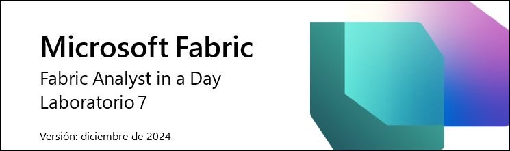

# Microsoft Fabric Fabric Analyst in a Day Laboratorio 7 
 
# Contenido

- Introducción
- Power BI
	- Tarea 1: Crear un informe de forma automática	
	- Tarea 2: Configurar el fondo para un nuevo informe	
	- Tarea 3: Agregar un encabezado al informe	
	- Tarea 4: Agregar KPI al informe	
	- Tarea 5: Agregar un gráfico de líneas al informe	
	- Tarea 6: Guardar el informe
	- Tarea 7: Configurar la columna Year en la tabla Date
	- Tarea 8: Configurar la columna Month Name en la tabla Date
	- Tarea 9: Aplicar formato al gráfico de líneas
	- Tarea 10: Conectar Power BI Desktop al modelo semántico
	- Tarea 11: Agregar nuevos datos para simular el modo Direct Lake	
- Limpieza del entorno de laboratorio
- Referencias	

# Introducción 

En este curso, se le ha presentado el almacén de lago de datos, se
ingieren datos de diferentes orígenes de datos en el almacén de lago de
datos, se establece un calendario de actualización para las orígenes de
datos y se crea un modelo de datos. Ahora vamos a crear un informe.

Al final de este laboratorio, habrá aprendido:

-   Cómo crear un informe de forma automática

-   Cómo crear un informe a partir de un lienzo en blanco

-   Cómo crear un informe con Power BI Desktop

-   Cómo usar el modo Direct Lake, que da como resultado una
    actualización automática de los datos

# Power BI

### Tarea 1: Crear un informe de forma automática

Comencemos con la opción de creación automática de informes. Y, más
adelante en el laboratorio, volveremos a crear el informe que tenemos en
Power BI.

1. Volvamos al **área de trabajo de Fabric** que creó en el laboratorio
    anterior.

2. En la parte inferior del panel de navegación de la izquierda,
    seleccione el icono **Selector de experiencia de Fabric**.

3. Se abre el cuadro de diálogo de experiencia de Fabric. Seleccione
    **Power BI**. Se le llevará a la **página Inicio de Power BI**.

    

4. Seleccione **Nuevo informe** en el menú superior.

    

5. Se le dirigirá a la **pantalla Crear el primer informe**. Habrá
    opciones para crear un informe usando Excel, CSV, introducir datos
    manualmente y crear un informe o elegir un modelo semántico
    publicado. Hemos creado un modelo semántico en los laboratorios
    anteriores. Usemos ese. Seleccione la opción **Selección de un
    modelo semántico publicado**.

    

6. Se abre la página Elija un conjunto de datos para usar en su
    informe. Observe que tenemos varias opciones. **Seleccione
    sm_FAIAD**.

    a. **sm_FAIAD:** este es el modelo semántico que hemos creado y que
        queremos utilizar para crear el informe.

    b. **lh_FAIAD:** este es el almacén de lago de datos en el que
        ingerimos todos los datos.

    c. **Units by Supplier:** este es el conjunto de datos que creamos
        con T-SQL.

    d. **DataflowsStagingWarehouse:** este es el almacén provisional
        que se crea de manera predeterminada. No utilizamos esto porque
        no organizamos datos.

    e. **DataflowsStagingLakehouse:** este es el Lakehouse provisional
        que se crea de manera predeterminada. No utilizamos esto porque
        no organizamos datos.

7. Haga clic en la flecha **junto al botón Crear informe de forma
    automática**. Observe que hay dos opciones: Crear informe de forma
    automática y Crear un informe en blanco. Probemos la creación
    automática: seleccione **Crear informe de forma automática**.

    

8. Power BI comenzará a crear de forma automática el informe. Observe
    que hay una opción para seleccionar previamente los datos si así lo
    queremos también. Una vez que el informe esté listo, aparecerá un
    cuadro de diálogo en la parte superior derecha de la pantalla.
    Seleccione **Ver informe ahora o se cargará automáticamente en unos
    segundos**.

    

**Punto de control:** tendrá un informe similar a la captura de pantalla
siguiente. Hay algunos KPI y algunos objetos visuales de tendencias.
Este es un buen comienzo si está analizando un nuevo modelo y necesita
un impulso.

**Nota:** Observe que en el menú superior tiene la opción de editar el
informe o ver algunos de los datos como tablas. No dude en explorar
estas opciones.

9. Guardemos este informe. En el menú superior, seleccione **Guardar**.

10. Se abre el cuadro de diálogo Guardar el informe. Nombre el informe
    como **rpt_Sales_Auto_Report**\
    **Nota:** Estamos anteponiendo rpt al nombre del informe, que es la
    abreviatura de informe (en inglés).

11. Asegúrese de que el informe esté guardado en el área de trabajo
    **FAIAD\_\<username\>.**

12. Seleccione **Guardar.**

    

**Nota:** El informe creado automáticamente puede verse diferente ya que
se \"creó automáticamente\". También depende de las relaciones y medidas
que creó en el laboratorio anterior (Laboratorio 6).

La captura de pantalla anterior muestra el aspecto que el informe creado
automáticamente **puede** tener si ha creado todas las relaciones y
medidas, incluidas las relaciones opcionales (Laboratorio 6).

La siguiente captura de pantalla es el aspecto que **puede** tener el
informe creado automáticamente si omite la creación de las relaciones y
medidas opcionales (Laboratorio 6).

### Tarea 2: Configurar el fondo para un nuevo informe

Creemos un nuevo informe usando un lienzo en blanco.

1. En el **panel izquierdo**, seleccione el nombre del área de trabajo,
    **FAIAD\_\<username\>** por el que se navegará en el área de
    trabajo.

2. En el menú superior, seleccione **Nuevo -\> Informe**. Se le
    dirigirá a la página de creación de su primer informe.

    

3. Seleccione la opción **Selección de un modelo semántico publicado**,
    para que podamos elegir el modelo que hemos creado.

    

4. Se abre el cuadro de diálogo Selección de un modelo semántico para
    usarlo en su informe. Seleccione **sm_FAIAD**.

5. Haga clic en la flecha **junto al botón Crear informe de forma
    automática**. Seleccione **Crear un informe en blanco.** Se le
    dirigirá a una página del informe similar a la página del informe de
    Power BI Desktop.

    

6. Si aún no lo ha abierto, abra **FAIAD.pbix**, que se encuentra en la
    carpeta **Reports** en el **escritorio** de su entorno de
    laboratorio.

Vamos a utilizar este informe como referencia. Comenzaremos agregando el
fondo del lienzo. Crearemos el encabezado del informe, agregaremos un
par de KPI y crearemos el gráfico de líneas de Ventas a lo largo del
tiempo. Por razones de tiempo y sabiendo que tiene experiencia en la
creación de objetos visuales en Power BI Desktop, no crearemos todos los
objetos visuales.

7. Vuelva al **lienzo de Power BI** en su explorador.

8. Seleccione el **icono** de **la página Formato** en el panel de
    Visualizaciones.

9. Expanda la **sección Fondo del lienzo**.

10. Seleccione la opción **Examinar** de la opción **Imagen**. Se abre
    el cuadro de diálogo Explorador de archivos.

11. Vaya a la carpeta **Reports** en el **escritorio** de su entorno de
    laboratorio.

12. Seleccione **Summary Background.png.**

13. Establezca el menú desplegable **Ajuste de imagen** en **Ajustar**.

14. Establezca la Transparencia en **0 %**.

    

### Tarea 3: Agregar un encabezado al informe

1. Agreguemos el encabezado en el margen superior. En el **menú**,
    seleccione **Cuadro de texto**.

2. Introduzca **Fabrikam Company** como primera línea en el cuadro de
    texto.

3. Introduzca **Sales Report** como segunda línea en el cuadro de
    texto.

4. Resalte **Fabrikam Company** y establezca la **Fuente** en **Segoe
    UI** y el **tamaño de fuente** a **18, negrita**.

5. Resalte **Informe de ventas** y establezca la **Fuente** en **Segoe
    UI** y el **tamaño de fuente** a **14.**

6. Con el **cuadro de texto seleccionado**, en el panel del cuadro de
    texto Formato de la derecha, **expanda la sección Efectos**.

7. Utilice el control deslizante **Fondo** para configurarlo en
    **Desactivado**.

8. Cambie el tamaño del cuadro de texto **para que quepa en el margen
    superior**.

    

### Tarea 4: Agregar KPI al informe

1. Agreguemos KPI de ventas. Seleccione el **espacio en blanco** en el
    lienzo para quitar el foco del cuadro de texto.

2. En la **sección** **Visualizaciones**, seleccione el **objeto visual
    Tarjeta de varias filas**.

3. En la **sección Datos**, expanda la **tabla** **Sales**.

4. Seleccione **la medida Sales**.

    

5. Con **el objeto visual de tarjeta de varias filas seleccionado**,
    seleccione el **icono Dar formato a objeto visual** en la sección
    Visualizaciones.

6. Expanda la sección **Etiquetas de categorías**.

7. Aumente el **tamaño de fuente** a **14**.

8. Seleccione el **menú desplegable Color**. Se abre el cuadro de
    diálogo Paleta de colores.

9. Seleccione **Más colores**.

10. Establezca el valor Hex en **#004753**.

    

11. Expanda la sección **Tarjetas**.

12. Utilice el control deslizante **Barra de énfasis** para configurarlo
    en **Desactivado**.

    

13. Seleccione **General** en el panel de Visualizaciones.

14. Expanda la **sección Efectos**.

15. Utilice el control deslizante **Fondo** para configurarlo en
    **Desactivado**.

16. Cambie el tamaño del **objeto visual** y muévalo al **cuadro
    izquierdo como se muestra en la captura de pantalla**.

    

17. Vamos a agregar otro KPI. Seleccione la **Tarjeta de varias filas de
    Sales** que acabamos de crear. **Copie** el objeto visual mediante
    la selección de **Ctrl+C** desde tu teclado.

18. **Pegue** el objeto visual mediante la selección de **Ctrl+V** desde
    tu teclado. Observe que el objeto visual se pega en el lienzo.

19. Con el **nuevo objeto visual resaltado**, en la sección
    **Visualizaciones -\> Crear objeto visual -\> Campos**, elimine la
    medida **Sales**.

20. Desde la sección **Datos**, expanda la tabla **Sales** y seleccione
    la medida **Units**.

21. Cambie el tamaño del **objeto visual** y **colóquelo en el cuadro
    debajo del objeto visual Sales**.

    

### Tarea 5: Agregar un gráfico de líneas al informe

Creemos un gráfico de líneas para visualizar las ventas a lo largo del
tiempo por empresa revendedora.

1. Seleccione el **espacio en blanco** en el lienzo para quitar el foco
    del objeto visual de tarjeta de varias filas.

2. En la **sección** **Visualizaciones**, seleccione **Gráfico de
    líneas**.

3. En la **sección Datos**, expanda la tabla **Date**.

4. Seleccione el campo **Year**. Tenga en cuenta que Year se suma de
    forma predeterminada y se agrega al eje Y. Rectifiquemos esto.

    

### Tarea 6: Guardar el informe

Guardemos el informe antes de salir de él para realizar cambios en el
modelo.

1. En el menú, seleccione **Archivo -\> Guardar**.

2. Se abre el cuadro de diálogo Guardar el informe. Nombre el informe
    como **rpt_Sales_Report**\
    **Nota:** Estamos anteponiendo rpt al nombre del informe, que es la
    abreviatura de informe (en inglés).

3. Asegúrese de que el informe esté guardado en el área de trabajo
    **FAIAD\_\<username\>.**

4. Seleccione **Guardar.** Observe que el informe se guarda y usted se
    encuentra en modo de vista.

    

### Tarea 7: Configurar la columna Year en la tabla Date

1. En el **menú superior**, seleccione **Editar** para volver al modo
    de edición.

2. En el **menú superior**, seleccione **Abrir modelo de datos**.
    Observe que el modelo semántico se abre en una nueva ventana o
    pestaña del navegador.

    

3. En el panel **Datos** **de la derecha,** seleccione Tablas.

4. Expanda la tabla **Date**.

5. Seleccione la columna **Year**.

6. En el panel **Propiedades** de la derecha, expanda la sección
    **Avanzado**.

7. En el menú desplegable **Resumir por**, seleccione **Ninguno**.

    

8. Vuelva a la **ventana/pestaña del informe** del navegador.

9. En el **panel Datos** de la derecha, expanda la tabla **Date**.
    Observe que Year no es un campo de suma.

10. Con el **objeto visual Gráfico de líneas seleccionado**, **elimine
    la Sum of Year** del eje Y.

11. Seleccione el campo **Year** y se agregará al **eje X**.

12. Expanda la tabla **Sales** y seleccione la **medida Sales**.

    

### Tarea 8: Configurar la columna Month Name en la tabla Date

1. Agreguemos Mes a este gráfico. Desde la tabla Date, arrastre el
    campo **MonthNameShort** debajo de **Year** en el **eje X**. Observe
    que el objeto visual está ordenado por Sales. Ordenémoslo por
    **MonthNameShort**.

2. Haga clic en los **puntos suspensivos (...)** en la esquina superior
    derecha del objeto visual.

3. Seleccione **Ordenar eje -\> Year Short_Month_Name**.

4. Haga clic en los **puntos suspensivos (...)** en la esquina superior
    derecha del objeto visual.

5. Seleccione **Ordenar eje -\> Orden ascendente**.

    

**Nota:** Los meses están ordenados alfabéticamente. Vamos a arreglarlo.

6. Regrese a la **ventana/pestaña del navegador** donde tiene abierto
    el modelo semántico.

7. En el panel **Datos**, expanda la tabla **Date**.

8. Seleccione la columna **MonthNameShort**.

9. En el panel **Propiedades** de la derecha, expanda la sección
    **Avanzado**.

10. En el menú desplegable **Ordenar por columna** seleccione **Month**.

    

11. Vuelva a la **ventana/pestaña del informe** del navegador. Observe
    que ahora los meses están ordenados correctamente.

    

### Tarea 9: Aplicar formato al gráfico de líneas

Observe lo fácil que es actualizar el modelo semántico mientras se crean
los informes. Esto proporciona una interacción fluida como Power BI
Desktop.

1. Con el **objeto visual Gráfico de líneas seleccionado**, en la
    **sección Datos**, expanda la tabla **Reseller**.

2. Arrastre **Reseller -\> Reseller Company** a la sección **Leyenda**.

    

3. Con el **objeto visual Gráfico de líneas seleccionado**, en la
    sección **Visualizaciones**, seleccione **icono Formato visual -\>
    General**.

4. Expanda la sección **Título**.

5. Establezca el texto **Título** en **Ventas a lo largo del tiempo**.

6. Expanda la sección **Efectos**.

7. Utilice el control deslizante **Fondo** para configurarlo en
    **Desactivado**.

    

8. En la sección **Visualizaciones**, seleccione el **icono Formato de
    objeto visual -\> Objeto visual**.

9. Expanda la sección **Líneas**.

10. En el **menú desplegable Aplicar configuración a -\> Serie,**
    seleccione **Tailspin Toys.**

11. Expanda la sección **Colores**.

12. Establezca **color** en **#F17925**

13. En el **menú desplegable Aplicar configuración a -\> Serie,**
    seleccione **Wingtip Toys.**

14. Establezca **color** en **#004753**

15. Cambie el tamaño del **objeto visual** y muévalo al **cuadro
    superior derecho como se muestra en la captura de pantalla**.

16. Desplácese hacia la derecha en el objeto visual y **observe que
    tenemos datos hasta abril de 2024**.

    

17. Guardemos el informe: desde el menú, seleccione **Archivo -\>
    Guardar**.

Como se mencionó anteriormente, no crearemos todos los objetos visuales
en esta práctica de laboratorio. Siéntase libre de crear más objetos
visuales si lo desea.

### Tarea 10: Conectar Power BI Desktop al modelo semántico

Ahora, veamos lo fácil que es Conectar Power BI Desktop al modelo
semántico y crear objetos visuales.

1. Abra **FAIADTemplate.pbix**, que se encuentra en la carpeta
    **Reports** en el **escritorio** de su entorno de laboratorio.

2. En la cinta de opciones, seleccione **Inicio -\> Centro de
    conectividad de datos de OneLake -\> Modelos semánticos de Power
    BI**.

    

3. Se abre el cuadro de diálogo del centro de datos de OneLake.
    Seleccione **sm_FAIAD**, el modelo semántico que hemos creado.

4. Seleccione **Conectar**. Observe que en el panel de datos tenemos
    las tablas del modelo semántico.

    

5. En el **panel izquierdo**, seleccione **Vista de modelo**. Observe
    que podemos ver la relación entre tablas.

    

6. En el **panel izquierdo**, seleccione **Vista Informe** para volver
    a la vista del informe.

7. Si aún no lo ha abierto, abra **FAIAD.pbix**, que se encuentra en la
    carpeta **Reports** en el **escritorio** de su entorno de
    laboratorio.

8. Seleccione el **objeto visual del título del informe**.

9. En la cinta de opciones, seleccione **Inicio -\> Copiar**.

    

10. Vaya a **FAIADTemplate.pbix** y seleccione el lienzo del informe.

11. En la cinta de opciones, seleccione **Inicio -\> Pegar**.

    

12. Del mismo modo, copie y pegue los **KPI de Sales y Units**. Para su
    información, se pueden copiar y pegar varios objetos visuales
    juntos.

    

Observe que es fácil copiar objetos visuales de un informe existente y
pegarlos en un informe que se conecta al modelo semántico. Tenga en
cuenta que los nombres de las tablas, columnas y medidas deben ser los
mismos para que funcione la función de copiar y pegar. Si no son los
mismos, es posible que tenga un error, pero esto se puede resolver
fácilmente.

13. Vaya a **FAIAD.pbix** y seleccione el gráfico de líneas de Ventas a
    lo largo del tiempo.

14. En la cinta de opciones, seleccione **Inicio -\> Copiar**.

15. Vaya a **FAIADTemplate.pbix** y seleccione el lienzo del informe.

16. En la cinta de opciones, seleccione **Inicio -\> Pegar**. Observe
    que el objeto visual no se representa. Esto se debe a que
    actualmente el modelo semántico no crea una jerarquía a partir del
    campo date.

17. Vamos a arreglarlo. En el panel **Visualización**, en **Eje X**
    elimine **StartOfMonth**.

    

18. En el **panel Datos**, expanda la tabla **Date**.

19. Arrastre el campo **StartOfMonth** al **Eje X**. Esto corrige el
    objeto visual. Puede que tenga que dar formato al objeto visual.

    

20. Guardemos el informe: en la cinta de opciones, seleccione **Archivo
    -\> Guardar**.

### Tarea 11: Agregar nuevos datos para simular el modo Direct Lake

Normalmente, en el modo Import, una vez que se actualizan los datos en
el origen, necesitamos actualizar el modelo de Power BI y después se
actualizan los datos en el informe. Con el modo de Direct Query, una vez
que los datos se actualizan en el origen, están disponibles en el
informe de Power BI. Sin embargo, el modo de Direct Query suele ser
lento. Para resolver este problema, Microsoft Fabric presenta el modo
Direct Lake. Direct Lake es una ruta rápida para cargar los datos del
lago directamente en el motor de Power BI listos para su análisis.

Exploremos el escenario en el que los datos se actualizan en ADLS Gen2 y
los cambios se reflejan inmediatamente en el informe de Power BI sin
ejecutar ninguna actualización.

En un escenario real, los datos se actualizan en el origen. Como estamos
en un entorno de formación, simularemos esto. Tenemos datos de ventas
hasta abril de 2024. Agreguemos datos de ventas de mayo de 2024 creando
un acceso directo al archivo de mayo de 2024 en ADLS Gen2 y actualizando
Sales view.

1. Vuelva al **explorador**.

2. Seleccione **FAIAD\_\<username\>** en la barra de menús de la
    izquierda para navegar hasta la página de inicio del área de
    trabajo.

3. Seleccione **lh_FAIAD** para ir al almacén de lago de datos.

    

4. En el **panel del explorador** de la izquierda, seleccione los
    **puntos suspensivos** al lado de las **Tables**.

5. Seleccione **Nuevo acceso directo**.

    

6. Se abre el cuadro de diálogo Nuevo acceso directo. En **Orígenes
    externos**, seleccione **Azure Data Lake Storage Gen2**.

    

7. Dado que ha creado una conexión anteriormente en los laboratorios,
    no es necesario que cree una nueva conexión y verá su conexión ADLS
    en las conexiones existentes.

8. Si no ha creado esta conexión anteriormente en el curso, haga clic
    en **Crear nueva conexión** y complete los siguientes pasos:

9. En Configuración de **conexión -\> Dirección URL**, introduzca este
    vínculo
    <https://stvnextblobstorage.dfs.core.windows.net/fabrikam-sales>

10. Seleccione **Siguiente**.

    

11. Se conectará a ADLS Gen2 con la estructura de directorios que se
    muestra en el panel izquierdo. Expanda
    **Delta-Parquet-Format-FY25.**

12. Seleccione **Sales.Invoices_May.**

13. Seleccione **Siguiente**.

    

14. Se le dirigirá al siguiente cuadro de diálogo, donde podemos editar
    los nombres. Seleccione el **icono Editar** en Acciones para
    **Sales.Invoices_May**.

15. Cambie el nombre de **Sales.Invoices_May a InvoicesMay.**

16. Seleccione la **marca de verificación** al lado del nombre para
    guardar el cambio.

17. Seleccione **Crear**.

    

Observe en el **Panel del explorador** de la izquierda que tenemos la
tabla InvoicesMay. Ahora necesitamos actualizar Sales view.

18. En la **parte superior derecha** de la pantalla, seleccione
    **Lakehouse -\> Punto de conexión de análisis SQL**.

    

19. En el menú superior, seleccione **Inicio -\> Nueva consulta SQL**.
    Se abre un nuevo panel de consulta SQL.

20. **Copie** el siguiente código y **péguelo** en el panel de consulta
    SQL**.**

> [ALTER VIEW \[dbo\].\[Sales\] AS (]{.mark}
>
> [select \[\$Outer\].\[InvoiceLineID\] as \[InvoiceLineID\],]{.mark}
>
> [\[\$Outer\].\[InvoiceID\] as \[InvoiceID\],]{.mark}
>
> [\[\$Outer\].\[StockItemID\] as \[StockItemID\],]{.mark}
>
> [\[\$Outer\].\[Quantity\] as \[Quantity\],]{.mark}
>
> [\[\$Outer\].\[UnitPrice\] as \[UnitPrice\],]{.mark}
>
> [\[\$Outer\].\[TaxRate\] as \[TaxRate\],]{.mark}
>
> [\[\$Outer\].\[TaxAmount\] as \[TaxAmount\],]{.mark}
>
> [\[\$Outer\].\[LineProfit\] as \[LineProfit\],]{.mark}
>
> [\[\$Outer\].\[ExtendedPrice\] as \[ExtendedPrice\],]{.mark}
>
> [\[\$Outer\].\[CustomerID\] as \[ResellerID\],]{.mark}
>
> [\[\$Outer\].\[SalespersonPersonID\] as
> \[SalespersonPersonID\],]{.mark}
>
> [\[\$Outer\].\[InvoiceDate\] as \[InvoiceDate\],]{.mark}
>
> [\[\$Outer\].\[t0_0\] as \[Sales Amount\]]{.mark}
>
> [from]{.mark}
>
> [(]{.mark}
>
> [select \[\_\].\[InvoiceLineID\] as \[InvoiceLineID\],]{.mark}
>
> [\[\_\].\[InvoiceID\] as \[InvoiceID\],]{.mark}
>
> [\[\_\].\[StockItemID\] as \[StockItemID\],]{.mark}
>
> [\[\_\].\[Quantity\] as \[Quantity\],]{.mark}
>
> [\[\_\].\[UnitPrice\] as \[UnitPrice\],]{.mark}
>
> [\[\_\].\[TaxRate\] as \[TaxRate\],]{.mark}
>
> [\[\_\].\[TaxAmount\] as \[TaxAmount\],]{.mark}
>
> [\[\_\].\[LineProfit\] as \[LineProfit\],]{.mark}
>
> [\[\_\].\[ExtendedPrice\] as \[ExtendedPrice\],]{.mark}
>
> [\[\_\].\[CustomerID\] as \[CustomerID\],]{.mark}
>
> [\[\_\].\[SalespersonPersonID\] as \[SalespersonPersonID\],]{.mark}
>
> [\[\_\].\[InvoiceDate\] as \[InvoiceDate\],]{.mark}
>
> [\[\_\].\[ExtendedPrice\] - \[\_\].\[TaxAmount\] as \[t0_0\]]{.mark}
>
> [from]{.mark}
>
> [(]{.mark}
>
> [select \[\$Outer\].\[InvoiceLineID\],]{.mark}
>
> [\[\$Outer\].\[InvoiceID\],]{.mark}
>
> [\[\$Outer\].\[StockItemID\],]{.mark}
>
> [\[\$Outer\].\[Quantity\],]{.mark}
>
> [\[\$Outer\].\[UnitPrice\],]{.mark}
>
> [\[\$Outer\].\[TaxRate\],]{.mark}
>
> [\[\$Outer\].\[TaxAmount\],]{.mark}
>
> [\[\$Outer\].\[LineProfit\],]{.mark}
>
> [\[\$Outer\].\[ExtendedPrice\],]{.mark}
>
> [\[\$Inner\].\[CustomerID\],]{.mark}
>
> [\[\$Inner\].\[SalespersonPersonID\],]{.mark}
>
> [\[\$Inner\].\[InvoiceDate\]]{.mark}
>
> [from \[lh_FAIAD\].\[dbo\].\[InvoiceLineItems\] as \[\$Outer\]]{.mark}
>
> [inner join]{.mark}
>
> [(]{.mark}
>
> [select \[\_\].\[InvoiceID\] as \[InvoiceID2\],]{.mark}
>
> [\[\_\].\[CustomerID\] as \[CustomerID\],]{.mark}
>
> [\[\_\].\[BillToResellerID\] as \[BillToResellerID\],]{.mark}
>
> [\[\_\].\[OrderID\] as \[OrderID\],]{.mark}
>
> [\[\_\].\[DeliveryMethodID\] as \[DeliveryMethodID\],]{.mark}
>
> [\[\_\].\[ContactPersonID\] as \[ContactPersonID\],]{.mark}
>
> [\[\_\].\[AccountsPersonID\] as \[AccountsPersonID\],]{.mark}
>
> [\[\_\].\[SalespersonPersonID\] as \[SalespersonPersonID\],]{.mark}
>
> [\[\_\].\[PackedByPersonID\] as \[PackedByPersonID\],]{.mark}
>
> [\[\_\].\[InvoiceDate\] as \[InvoiceDate\],]{.mark}
>
> [\[\_\].\[CustomerPurchaseOrderNumber\] as
> \[CustomerPurchaseOrderNumber\],]{.mark}
>
> [\[\_\].\[IsCreditNote\] as \[IsCreditNote\],]{.mark}
>
> [\[\_\].\[CreditNoteReason\] as \[CreditNoteReason\],]{.mark}
>
> [\[\_\].\[Comments\] as \[Comments\],]{.mark}
>
> [\[\_\].\[DeliveryInstructions\] as \[DeliveryInstructions\],]{.mark}
>
> [\[\_\].\[InternalComments\] as \[InternalComments\],]{.mark}
>
> [\[\_\].\[TotalDryItems\] as \[TotalDryItems\],]{.mark}
>
> [\[\_\].\[TotalChillerItems\] as \[TotalChillerItems\],]{.mark}
>
> [\[\_\].\[DeliveryRun\] as \[DeliveryRun\],]{.mark}
>
> [\[\_\].\[RunPosition\] as \[RunPosition\],]{.mark}
>
> [\[\_\].\[ReturnedDeliveryData\] as \[ReturnedDeliveryData\],]{.mark}
>
> [\[\_\].\[ConfirmedDeliveryTime\] as
> \[ConfirmedDeliveryTime\],]{.mark}
>
> [\[\_\].\[ConfirmedReceivedBy\] as \[ConfirmedReceivedBy\],]{.mark}
>
> [\[\_\].\[LastEditedBy\] as \[LastEditedBy2\],]{.mark}
>
> [\[\_\].\[LastEditedWhen\] as \[LastEditedWhen2\]]{.mark}
>
> [from]{.mark}
>
> [(]{.mark}
>
> [select \[\$Table\].\[InvoiceID\] as \[InvoiceID\],]{.mark}
>
> [\[\$Table\].\[CustomerID\] as \[CustomerID\],]{.mark}
>
> [\[\$Table\].\[BillToResellerID\] as \[BillToResellerID\],]{.mark}
>
> [\[\$Table\].\[OrderID\] as \[OrderID\],]{.mark}
>
> [\[\$Table\].\[DeliveryMethodID\] as \[DeliveryMethodID\],]{.mark}
>
> [\[\$Table\].\[ContactPersonID\] as \[ContactPersonID\],]{.mark}
>
> [\[\$Table\].\[AccountsPersonID\] as \[AccountsPersonID\],]{.mark}
>
> [\[\$Table\].\[SalespersonPersonID\] as
> \[SalespersonPersonID\],]{.mark}
>
> [\[\$Table\].\[PackedByPersonID\] as \[PackedByPersonID\],]{.mark}
>
> [\[\$Table\].\[InvoiceDate\] as \[InvoiceDate\],]{.mark}
>
> [\[\$Table\].\[CustomerPurchaseOrderNumber\] as
> \[CustomerPurchaseOrderNumber\],]{.mark}
>
> [\[\$Table\].\[IsCreditNote\] as \[IsCreditNote\],]{.mark}
>
> [\[\$Table\].\[CreditNoteReason\] as \[CreditNoteReason\],]{.mark}
>
> [\[\$Table\].\[Comments\] as \[Comments\],]{.mark}
>
> [\[\$Table\].\[DeliveryInstructions\] as
> \[DeliveryInstructions\],]{.mark}
>
> [\[\$Table\].\[InternalComments\] as \[InternalComments\],]{.mark}
>
> [\[\$Table\].\[TotalDryItems\] as \[TotalDryItems\],]{.mark}
>
> [\[\$Table\].\[TotalChillerItems\] as \[TotalChillerItems\],]{.mark}
>
> [\[\$Table\].\[DeliveryRun\] as \[DeliveryRun\],]{.mark}
>
> [\[\$Table\].\[RunPosition\] as \[RunPosition\],]{.mark}
>
> [\[\$Table\].\[ReturnedDeliveryData\] as
> \[ReturnedDeliveryData\],]{.mark}
>
> [\[\$Table\].\[ConfirmedDeliveryTime\] as
> \[ConfirmedDeliveryTime\],]{.mark}
>
> [\[\$Table\].\[ConfirmedReceivedBy\] as
> \[ConfirmedReceivedBy\],]{.mark}
>
> [\[\$Table\].\[LastEditedBy\] as \[LastEditedBy\],]{.mark}
>
> [\[\$Table\].\[LastEditedWhen\] as \[LastEditedWhen\]]{.mark}
>
> [from \[lh_FAIAD\].\[dbo\].\[Invoices\] as \[\$Table\]]{.mark}
>
> [union all select \[\$Table\].\[InvoiceID\] as \[InvoiceID\],]{.mark}
>
> [\[\$Table\].\[CustomerID\] as \[CustomerID\],]{.mark}
>
> [\[\$Table\].\[BillToResellerID\] as \[BillToResellerID\],]{.mark}
>
> [\[\$Table\].\[OrderID\] as \[OrderID\],]{.mark}
>
> [\[\$Table\].\[DeliveryMethodID\] as \[DeliveryMethodID\],]{.mark}
>
> [\[\$Table\].\[ContactPersonID\] as \[ContactPersonID\],]{.mark}
>
> [\[\$Table\].\[AccountsPersonID\] as \[AccountsPersonID\],]{.mark}
>
> [\[\$Table\].\[SalespersonPersonID\] as
> \[SalespersonPersonID\],]{.mark}
>
> [\[\$Table\].\[PackedByPersonID\] as \[PackedByPersonID\],]{.mark}
>
> [\[\$Table\].\[InvoiceDate\] as \[InvoiceDate\],]{.mark}
>
> [\[\$Table\].\[CustomerPurchaseOrderNumber\] as
> \[CustomerPurchaseOrderNumber\],]{.mark}
>
> [\[\$Table\].\[IsCreditNote\] as \[IsCreditNote\],]{.mark}
>
> [\[\$Table\].\[CreditNoteReason\] as \[CreditNoteReason\],]{.mark}
>
> [\[\$Table\].\[Comments\] as \[Comments\],]{.mark}
>
> [\[\$Table\].\[DeliveryInstructions\] as
> \[DeliveryInstructions\],]{.mark}
>
> [\[\$Table\].\[InternalComments\] as \[InternalComments\],]{.mark}
>
> [\[\$Table\].\[TotalDryItems\] as \[TotalDryItems\],]{.mark}
>
> [\[\$Table\].\[TotalChillerItems\] as \[TotalChillerItems\],]{.mark}
>
> [\[\$Table\].\[DeliveryRun\] as \[DeliveryRun\],]{.mark}
>
> [\[\$Table\].\[RunPosition\] as \[RunPosition\],]{.mark}
>
> [\[\$Table\].\[ReturnedDeliveryData\] as
> \[ReturnedDeliveryData\],]{.mark}
>
> [\[\$Table\].\[ConfirmedDeliveryTime\] as
> \[ConfirmedDeliveryTime\],]{.mark}
>
> [\[\$Table\].\[ConfirmedReceivedBy\] as
> \[ConfirmedReceivedBy\],]{.mark}
>
> [\[\$Table\].\[LastEditedBy\] as \[LastEditedBy\],]{.mark}
>
> [\[\$Table\].\[LastEditedWhen\] as \[LastEditedWhen\]]{.mark}
>
> [from \[lh_FAIAD\].\[dbo\].\[InvoicesMay\] as \[\$Table\]]{.mark}
>
> [) as \[\_\]]{.mark}
>
> [) as \[\$Inner\] on (\[\$Outer\].\[InvoiceID\] =
> \[\$Inner\].\[InvoiceID2\] or \[\$Outer\].\[InvoiceID\] is null and
> \[\$Inner\].\[InvoiceID2\] is null)]{.mark}
>
> [) as \[\_\]]{.mark}
>
> [) as \[\$Outer\]]{.mark}
>
> [where exists]{.mark}
>
> [(]{.mark}
>
> [select 1]{.mark}
>
> [from]{.mark}
>
> [(]{.mark}
>
> [select \[ResellerID\]]{.mark}
>
> [from \[lh_FAIAD\].\[dbo\].\[Reseller\] as \[\$Table\]]{.mark}
>
> [) as \[\$Inner\]]{.mark}
>
> [where \[\$Outer\].\[CustomerID\] = \[\$Inner\].\[ResellerID\] or
> \[\$Outer\].\[CustomerID\] is null and \[\$Inner\].\[ResellerID\] is
> null]{.mark}
>
> [)]{.mark}
>
> [)]{.mark}

21. En el menú de consulta del objeto visual, seleccione **Ejecutar**
    para ejecutar el código.

Una vez ejecutado el código, hemos actualizado la tabla Sales para que
incluya los datos de mayo de 2024.

22. Seleccione **rpt_Sales_Report** en la barra de menús izquierda para
    volver al informe**.**

23. En el menú superior, seleccione **Actualizar**. Observe ahora que en
    el gráfico de líneas hay datos para mayo de 2024. Además, observe
    que el importe y las Unidades de ventas han aumentado.

    

No tenemos que actualizar el modelo de datos ni informar cuando los
datos cambian. Esta es la ventaja de Direct Lake y Direct query.

Revisemos los desafíos que se enumeran en el planteamiento del problema:

-   **Debe actualizar su conjunto de datos al menos tres veces al día
    para adaptarse a los diferentes tiempos de actualización para los
    diferentes orígenes de datos.**

Resolvimos esto con Direct Lake. Cada flujo de datos individual se
actualiza según su programación. No es necesario actualizar los
conjuntos de datos y los informes.

-   **Sus operaciones de actualización tardan mucho tiempo, ya que
    necesita hacer una actualización completa cada vez para capturar
    cualquier actualización que haya ocurrido en los sistemas de
    origen.**

De nuevo, resolvimos esto con Direct Lake. Cada flujo de datos
individual se actualiza según su programación. No es necesario
actualizar los conjunto de datos y los informes, por lo que no tenemos
que preocuparnos por la actualización completa.

-   **Cualquier error en cualquiera de los orígenes de datos de los que
    extrae provocará que se interrumpa la actualización del conjunto de
    datos. Muchas veces, el archivo del empleado no se carga a tiempo,
    lo que provoca que se interrumpa la actualización del conjunto de
    datos.**

Las canalizaciones de datos ayudan a resolver este problema al ofrecer
la capacidad de volver a intentar la actualización en caso de error y en
diferentes intervalos.

-   **Se necesita mucho tiempo para hacer cambios en su modelo de datos,
    ya que Power Query tarda mucho en actualizar sus versiones
    preliminares, dado el gran tamaño de los datos y las
    transformaciones complejas.**

Vimos que los flujos de datos y los almacenes de lago de datos son
eficientes y es fácil realizar cambios en ellos. Normalmente, la versión
preliminar en flujos de datos y almacenes de lago de datos no tarda
mucho en cargarse.

-   **Necesita que un PO con Windows use Power BI Desktop aunque el
    estándar corporativo es Mac.**

Microsoft Fabric es una oferta SaaS. Lo único que necesitamos es un
explorador para acceder al servicio. No tenemos que instalar ningún
software en nuestros escritorios.

# Limpieza del entorno de laboratorio

Una vez que esté todo listo para limpiar el entorno del laboratorio,
siga los pasos a continuación.

1. Seleccione el área de trabajo **FAIAD\_\<nombre de usuario\>** en el
    panel izquierdo para navegar a la página de inicio del área de
    trabajo.

2. En el menú superior, seleccione **Configuración del área de
    trabajo**.

    

3. Se abre el cuadro de diálogo de Configuración del área de trabajo.
    En la sección **General**, desplácese hacia abajo.

4. Seleccione **Quitar esta área de trabajo**.

5. Se abrirá el cuadro de diálogo de eliminar área de trabajo.
    Seleccione **Eliminar**.

Esto eliminará el área de trabajo y todos los elementos que contenía.

# Referencias

Fabric Analyst in a Day (FAIAD) le presenta algunas funciones clave
disponibles en Microsoft Fabric. En el menú del servicio, la sección
Ayuda (?) tiene vínculos a algunos recursos excelentes.

Estos son algunos recursos más que podrán ayudarle a seguir avanzando
con Microsoft Fabric.

-   Vea la publicación del blog para leer el [anuncio de disponibilidad
    general de Microsoft
    Fabric](https://aka.ms/Fabric-Hero-Blog-Ignite23) completo.

-   Explore Fabric a través de la [Visita
    guiada](https://aka.ms/Fabric-GuidedTour)

-   Regístrese en la [prueba gratuita de Microsoft
    Fabric](https://aka.ms/try-fabric)

-   Visite el [sitio web de Microsoft
    Fabric](https://aka.ms/microsoft-fabric)

-   Adquiera nuevas capacidades mediante la exploración de los [módulos
    de aprendizaje de Fabric](https://aka.ms/learn-fabric)

-   Explore la [documentación técnica de
    Fabric](https://aka.ms/fabric-docs)

-   Lea el [libro electrónico gratuito sobre cómo empezar a usar
    Fabric](https://aka.ms/fabric-get-started-ebook)

-   Únase a la [comunidad de Fabric](https://aka.ms/fabric-community)
    para publicar sus preguntas, compartir sus comentarios y aprender de
    otros.

Obtenga más información en los blogs de anuncios de la experiencia
Fabric:

-   [Experiencia de Data Factory en el blog de
    Fabric](https://aka.ms/Fabric-Data-Factory-Blog) 

-   [Experiencia de Synapse Data Engineering en el blog de
    Fabric](https://aka.ms/Fabric-DE-Blog) 

-   [Experiencia de Synapse Data Science en el blog de
    Fabric](https://aka.ms/Fabric-DS-Blog) 

-   [Experiencia de Synapse Data Warehousing en el blog de
    Fabric](https://aka.ms/Fabric-DW-Blog) 

-   [Experiencia de Synapse Real-Time Analytics en el blog de
    Fabric](https://aka.ms/Fabric-RTA-Blog)

-   [Blog de anuncios de Power BI](https://aka.ms/Fabric-PBI-Blog)

-   [Experiencia de Data Activator en el blog de
    Fabric](https://aka.ms/Fabric-DA-Blog) 

-   [Administración y gobernanza en el blog de
    Fabric](https://aka.ms/Fabric-Admin-Gov-Blog)

-   [OneLake en el blog de Fabric](https://aka.ms/Fabric-OneLake-Blog)

-   [Blog de integración de Dataverse y Microsoft
    Fabric](https://aka.ms/Dataverse-Fabric-Blog)

> © 2023 Microsoft Corporation. Todos los derechos reservados.
>
> Al participar en esta demostración o laboratorio práctico, acepta las
> siguientes condiciones:
>
> Microsoft Corporation pone a su disposición la tecnología o
> funcionalidad descrita en esta demostración/laboratorio práctico con
> el fin de obtener comentarios por su parte y de facilitarle una
> experiencia de aprendizaje. Esta demostración/laboratorio práctico
> solo se puede usar para evaluar las características de tal tecnología
> o funcionalidad y para proporcionar comentarios a Microsoft. No se
> puede usar para ningún otro propósito. Ninguna parte de esta
> demostración/laboratorio práctico se puede modificar, copiar,
> distribuir, transmitir, mostrar, realizar, reproducir, publicar,
> licenciar, transferir ni vender, ni tampoco crear trabajos derivados
> de ella.
>
> LA COPIA O REPRODUCCIÓN DE ESTA DEMOSTRACIÓN/LABORATORIO PRÁCTICO (O
> PARTE DE ELLA) EN CUALQUIER OTRO SERVIDOR O UBICACIÓN PARA SU
> REPRODUCCIÓN O DISTRIBUCIÓN POSTERIOR QUEDA EXPRESAMENTE PROHIBIDA.
>
> ESTA DEMOSTRACIÓN/LABORATORIO PRÁCTICO PROPORCIONA CIERTAS FUNCIONES Y
> CARACTERÍSTICAS DE PRODUCTOS O TECNOLOGÍAS DE SOFTWARE (INCLUIDOS
> POSIBLES NUEVOS CONCEPTOS Y CARACTERÍSTICAS) EN UN ENTORNO SIMULADO
> SIN INSTALACIÓN O CONFIGURACIÓN COMPLEJA PARA EL PROPÓSITO ARRIBA
> DESCRITO. LA TECNOLOGÍA/CONCEPTOS DESCRITOS EN ESTA
> DEMOSTRACIÓN/LABORATORIO PRÁCTICO NO REPRESENTAN LA FUNCIONALIDAD
> COMPLETA DE LAS CARACTERÍSTICAS Y, EN ESTE SENTIDO, ES POSIBLE QUE NO
> FUNCIONEN DEL MODO EN QUE LO HARÁN EN UNA VERSIÓN FINAL. ASIMISMO,
> PUEDE QUE NO SE PUBLIQUE UNA VERSIÓN FINAL DE TALES CARACTERÍSTICAS O
> CONCEPTOS. DE IGUAL MODO, SU EXPERIENCIA CON EL USO DE ESTAS
> CARACTERÍSTICAS Y FUNCIONALIDADES EN UN ENTORNO FÍSICO PUEDE SER
> DIFERENTE.
>
> **COMENTARIOS**. Si envía comentarios a Microsoft sobre las
> características, funcionalidades o conceptos de tecnología descritos
> en esta demostración/laboratorio práctico, acepta otorgar a Microsoft,
> sin cargo alguno, el derecho a usar, compartir y comercializar sus
> comentarios de cualquier modo y para cualquier fin. También concederá
> a terceros, sin cargo alguno, los derechos de patente necesarios para
> que sus productos, tecnologías y servicios usen o interactúen con
> cualquier parte específica de un software o servicio de Microsoft que
> incluya los comentarios. No enviará comentarios que estén sujetos a
> una licencia que obligue a Microsoft a conceder su software o
> documentación bajo licencia a terceras partes porque incluyamos sus
> comentarios en ellos. Estos derechos seguirán vigentes después del
> vencimiento de este acuerdo.
>
> MICROSOFT CORPORATION RENUNCIA POR LA PRESENTE A TODAS LAS GARANTÍAS Y
> CONDICIONES RELATIVAS A LA DEMOSTRACIÓN/LABORATORIO PRÁCTICO, INCLUIDA
> CUALQUIER GARANTÍA Y CONDICIÓN DE COMERCIABILIDAD (YA SEA EXPRESA,
> IMPLÍCITA O ESTATUTARIA), DE IDONEIDAD PARA UN FIN DETERMINADO, DE
> TITULARIDAD Y DE AUSENCIA DE INFRACCIÓN. MICROSOFT NO DECLARA NI
> GARANTIZA LA EXACTITUD DE LOS RESULTADOS, EL RESULTADO DERIVADO DE LA
> REALIZACIÓN DE LA DEMOSTRACIÓN/LABORATORIO PRÁCTICO NI LA IDONEIDAD DE
> LA INFORMACIÓN CONTENIDA EN ELLA CON NINGÚN PROPÓSITO.
>
> **DECLINACIÓN DE RESPONSABILIDADES**
>
> Esta demostración/laboratorio práctico contiene solo una parte de las
> nuevas características y mejoras realizadas en Microsoft Power BI.
> Puede que algunas de las características cambien en versiones futuras
> del producto. En esta demostración/laboratorio práctico, conocerá
> algunas de estas nuevas características, pero no todas.

