# Microsoft Fabric - Fabric Analyst in a Day - Laboratório 3


# Sumário 
- Introdução	
- Atalho para o ADLS Gen2	
    - Tarefa 1: Criar um atalho
- Transformar dados usando uma consulta Visual	
    - Tarefa 2: Criar exibição Geo usando uma consulta Visual
    - Tarefa 3: Criar exibição Reseller usando uma consulta Visual
    - Tarefa 4: Criar a exibição Sales usando uma consulta Visual
    - Tarefa 5: Criar exibição Product usando uma consulta Visual
- Referências

# Introdução 

Em nosso cenário, os Dados de Venda são obtidos do sistema ERP e
armazenados em um ADLS Gen2. Eles são atualizados ao meio-dia/12h, todos
os dias. Precisamos transformar e ingerir esses dados no Lakehouse e
usá-los em nosso modelo.

Há várias maneiras de ingerir esses dados.

- **Atalhos:** cria um link com os dados e podemos usar modos de
    exibição de consulta Visual para transformá-los. Usaremos os Atalhos
    neste laboratório.

- **Notebooks:** isso exige que escrevamos código. É uma abordagem
    para desenvolvedores.

- **Fluxo de Dados Gen2:** você provavelmente conhece o Power Query ou
    o Fluxo de Dados Gen1. O Fluxo de Dados Gen2, como o nome indica, é
    a versão mais recente do Fluxo de Dados. Ele oferece todos os
    recursos do Power Query/Fluxo de Dados Gen1 com o recurso adicional
    de transformar e ingerir dados em diversas fontes de dados.
    Apresentaremos isso nos próximos laboratórios.

- **Pipeline de Dados:** é uma ferramenta de orquestração. As
    atividades podem ser orquestradas para extrair, transformar e
    ingerir dados. Usaremos o Pipeline de Dados para executar a
    atividade do Fluxo de Dados Gen2 que, por sua vez, realizará a
    extração, a transformação e a ingestão.

Começaremos criando um atalho para ingerir dados em um Lakehouse da
fonte de dados ADLS Gen2. Uma vez ingeridos, usaremos modos de exibição
de consulta Visual para transformá-los.

Ao final deste laboratório, você terá aprendido:

- Como criar um atalho para Lakehouse

- Como transformar dados usando uma consulta Visual

# Atalho para o ADLS Gen2

### Tarefa 1: Criar um atalho

Os atalhos são usados para criar um link com o local de destino. Os
atalhos fornecem acesso aos dados sem a necessidade de mover fisicamente
os dados para o lakehouse. É como criar atalhos na área de trabalho do
Windows.

1. Vamos voltar ao **workspace do Fabric** que você criou no
    Laboratório 2, Tarefa 8.

2. Se você não saiu do laboratório anterior, estará na tela Lakehouse.
    Caso contrário, não tem problema. Selecione **lh_FAIAD** para
    acessar o Lakehouse.

3. No **painel Explorer**, selecione as **reticências** ao lado de
    **Tabelas**.

4. Selecione **Novo atalho.**

    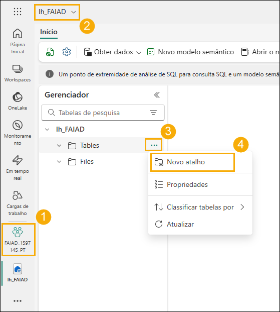

5.  **A caixa de diálogo Novo atalho** é aberta. Em **Fontes externas**,
    selecione **Azure Data Lake Storage Gen2**.

    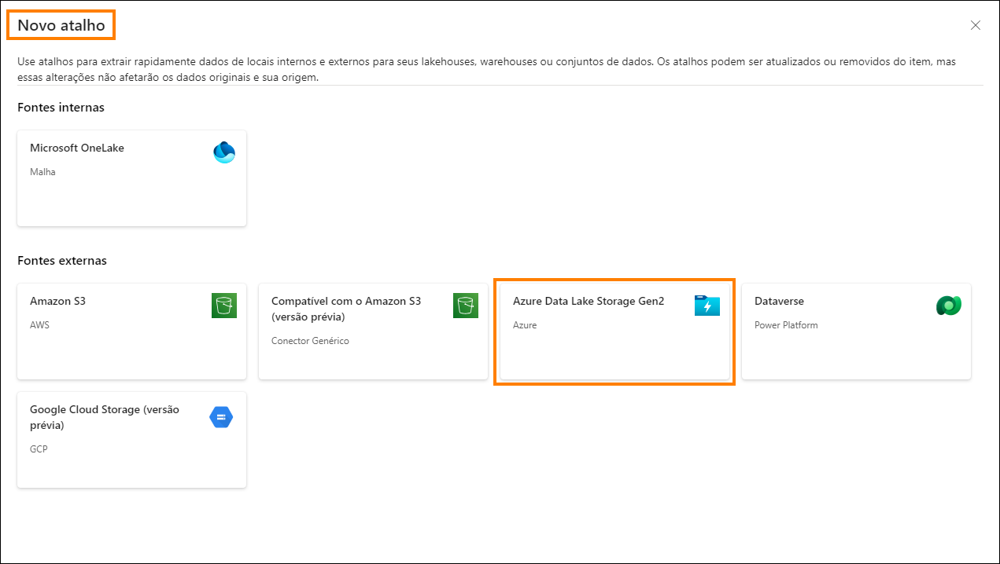

6. Selecione Criar nova conexão.

7. Insira o seguinte link para a propriedade **URL**: `https://stvnextblobstorage.dfs.core.windows.net/fabrikam-sales`

8. Selecione **Assinatura de Acesso Compartilhado (SAS)** no menu
    suspenso Tipo de autenticação.

9. Copie o **token SAS** da guia **Variáveis de ambiente** (ao lado da
    Guia de Laboratório) e cole-o na caixa **Token SAS** box.

10. Selecione **Avançar** na parte inferior direita da tela.

    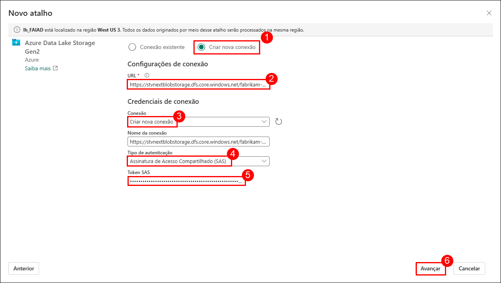

11. Você será conectado ao ADLS Gen2 com a estrutura de diretórios
    exibida no painel esquerdo. Expanda **Delta-Parquet-Format-FY25.**

12. **Selecione** os seguintes diretórios:

    a. Application.Cities

    b. Application.Countries

    c. Application.StateProvinces

    d. DateDim

    e. Sales.BuyingGroups

    f. Sales.Customers

    g. Sales.InvoiceLines

    h. Sales.Invoices

    i. Warehouse.StockGroups

    j. Warehouse.StockItemStockGroups

    k. Warehouse.StockItems

    **Observação:** Sales.Invoices_May é o único diretório que **não está**
    selecionado.

13. Selecione **Avançar**.

    

14. Você irá para a próxima caixa de diálogo para editar os nomes.
    Selecione o **ícone Editar**, em Ações, para **Application.Cities**.

15. Renomeie **Application.Cities para Cities.**

16. Selecione a marca de seleção ao lado do nome para salvar a
    alteração.

    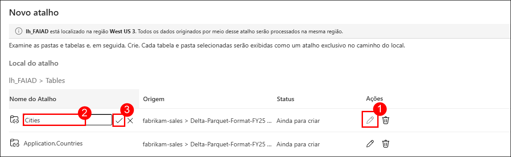

17. Da mesma forma, renomeie os nomes de atalhos como abaixo:

    a. Application.Countries para **Countries**

    b. Application.StateProvinces para **States**

    c. DateDim para **Date**

    d. Sales.BuyingGroups para **BuyingGroups**

    e. Sales.Customers para **Customers**

    f. Sales.InvoiceLines para **InvoiceLineItems**

    g. Sales.Invoices para **Invoices**

    h. Warehouse.StockGroups para **ProductGroups**

    i. Warehouse.StockItemStockGroups para **ProductItemGroup**

    j. Warehouse.StockItems para **ProductItem**

    > **Observação:** confira novamente os nomes. Um erro de digitação pode
    > causar erros durante o laboratório.

18. Selecione **Criar** para criar o atalho.

    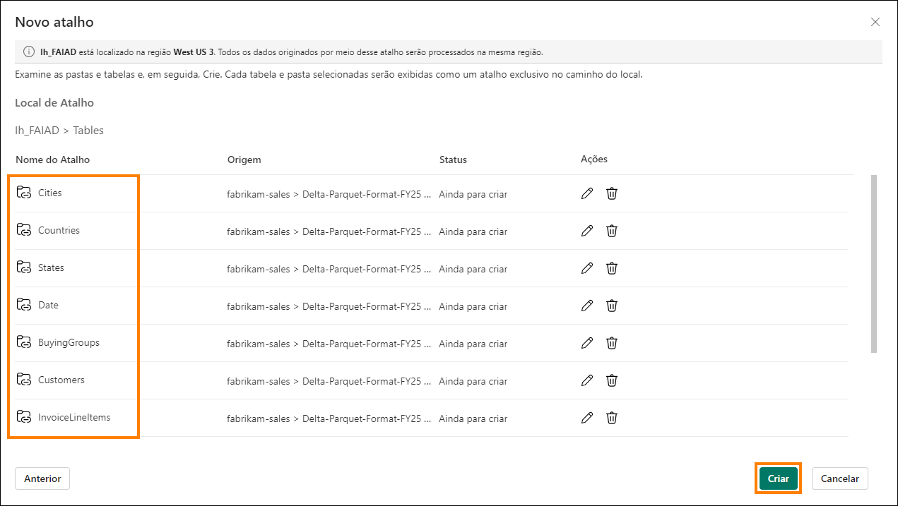

19. Observe que todos os atalhos são criados como tabelas. Selecione a
    tabela **BuyingGroups** e observe que podemos ver uma prévia dos
    dados no painel de dados.

    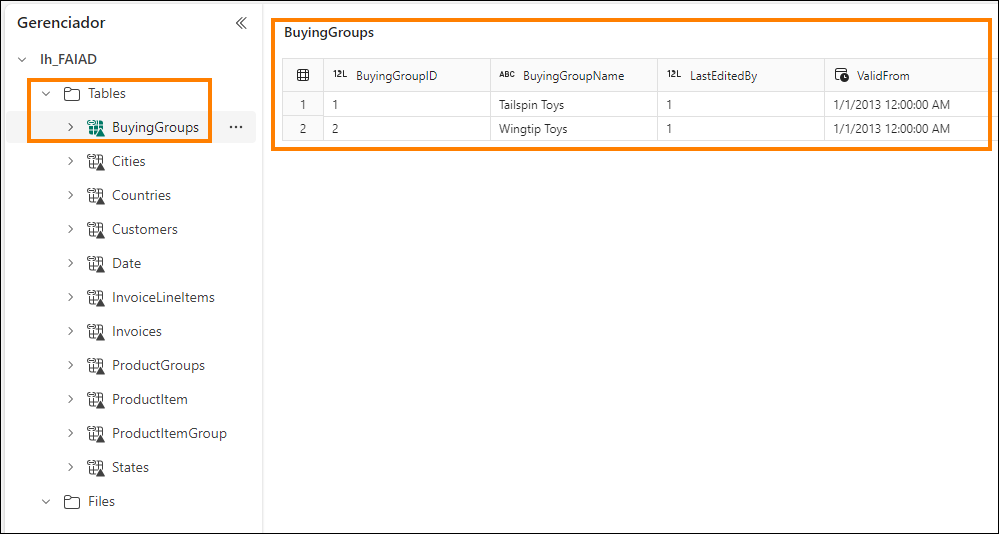

A próxima etapa é transformar os dados, 
para que possamos criar um
modelo semântico. Vamos criar exibições  para transformar os dados.

# Transformar dados usando uma consulta Visual

### Tarefa 2: Criar exibição Geo usando uma consulta Visual

1. Podemos acessar o lakehouse usando um ponto de extremidade SQL. Isso
    possibilita consultar os dados e criar exibições. No **canto
    superior direito** da tela, selecione **Lakehouse -\> ponto de
    extremidade do SQL Analytics**.

    

    Você irá para o ponto de extremidade de análise SQL. Observe que o
    painel Explorer foi alterado. Agora você pode criar exibições,
    procedimentos armazenados, consultas e muito mais. Vamos criar uma
    consulta visual, pois ela fornece uma interface semelhante à do Power
    Query, e salvá-la como uma exibição.

    Começaremos criando uma exibição Geo. Precisamos mesclar dados da
    consulta Cities, States e Countries para criar a exibição Geo.

2. No menu superior, clique no menu suspenso ao lado de **Nova consulta
    SQL** e depois selecione **Nova consulta visual**.

    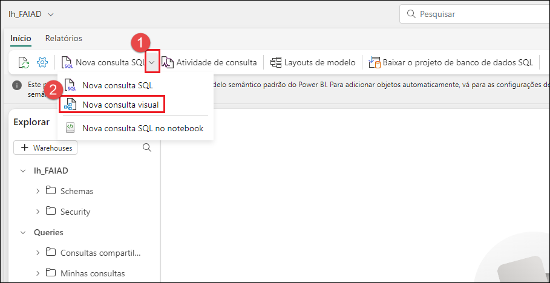

3. Precisamos arrastar tabelas para o painel Consulta visual para criar
    uma consulta. Vamos arrastar a consulta **Cities, States** e
    **Countries** para o painel de consulta visual.

    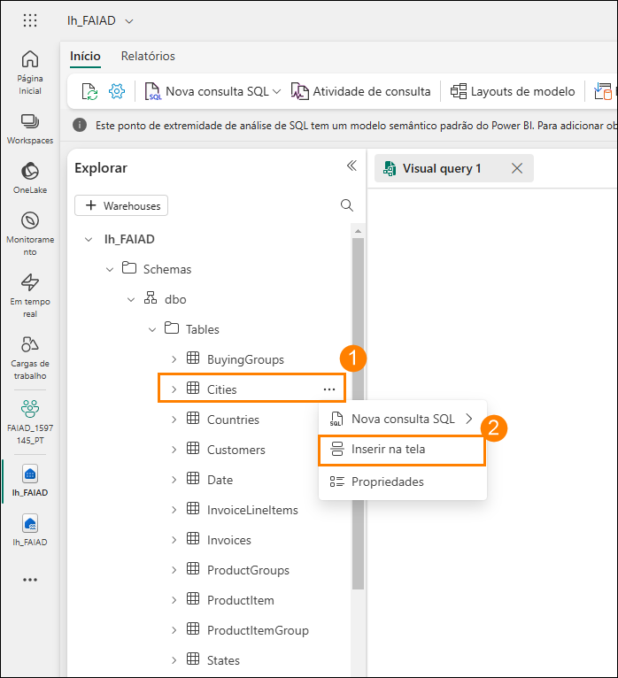

    Precisamos mesclar essas consultas. E a consulta visual vem com a opção
    de usar o Editor do Power Query. Vamos usar isso, já que estamos
    familiarizados.

4. No menu do Editor de consultas visuais, selecione o ícone **Abrir em
    popup** (na direção direita).

    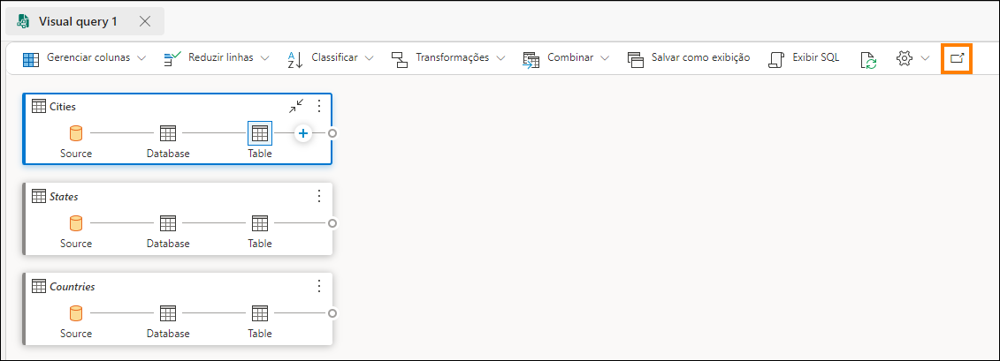

5. Com a consulta Cities selecionada, na faixa de opções do Editor do
    Power Query, selecione **Página Inicial - \> Mesclar consultas -\>
    Mesclar consultas como novas**. A caixa de diálogo Mesclar consultas
    é aberta.

    > **Observação:** se você não vir Mesclar consultas na faixa de opções
    > Página Inicial, clique na lista suspensa para Combinar e selecione
    > Mesclar consultas.

    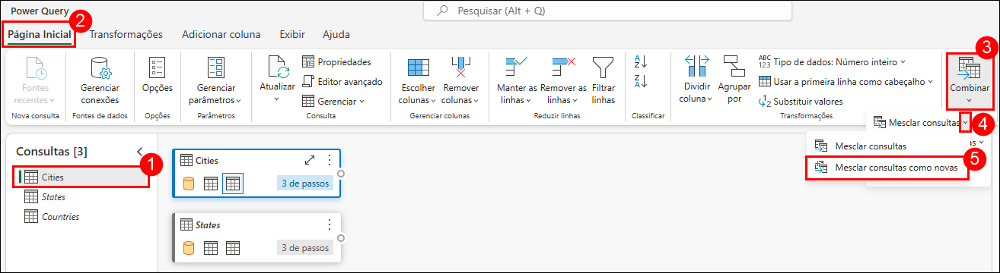

6. Na tabela **à esquerda para mesclar**, selecione **Cities**.

7. Na tabela **à direita para mesclar**, selecione **States**.

8. Selecione as colunas **StateProvinceID** das duas tabelas. Vamos
    usar esta coluna.

9. Selecione **Interna** como o **tipo de União**.

10. Selecione **OK.**

    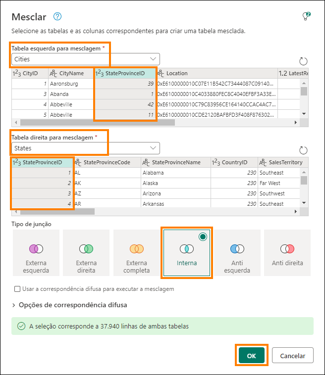

     Observe que uma nova consulta chamada Merge foi criada. Precisamos de
     algumas colunas de States.

11. Na **exibição Dados** (painel inferior), clique na **seta dupla** ao
    lado da coluna **States** (última coluna à direita).

12. Um painel é aberto. **Selecione** as colunas a seguir:

    a. StateProvinceCode

    b. StateProvinceName

    c. CountryID

    d. SalesTerritory

13. Selecione **OK**.

    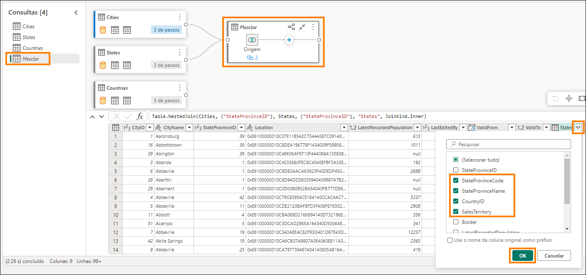

    Precisamos mesclar a consulta Countries agora.

14. Com a consulta Merge selecionada, selecione **Página Inicial - \>
    Mesclar consultas** na faixa de opções.

    **Observação:** se você não vir Mesclar consultas na faixa de opções
    Página Inicial, clique na lista suspensa para Combinar e selecione
    Mesclar consultas.

    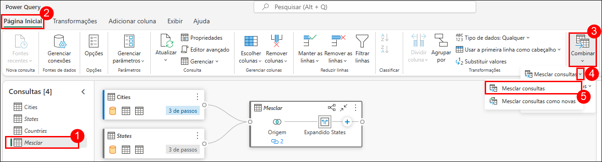

15. A caixa de diálogo Mesclar é aberta. Na tabela **à direita para
    mesclar**, selecione **Countries**.

16. Selecione as colunas **CountryID** das duas tabelas. Vamos usar esta
    coluna.

17. Selecione **Interna** como o **tipo de União**.

18. Selecione **OK.**

    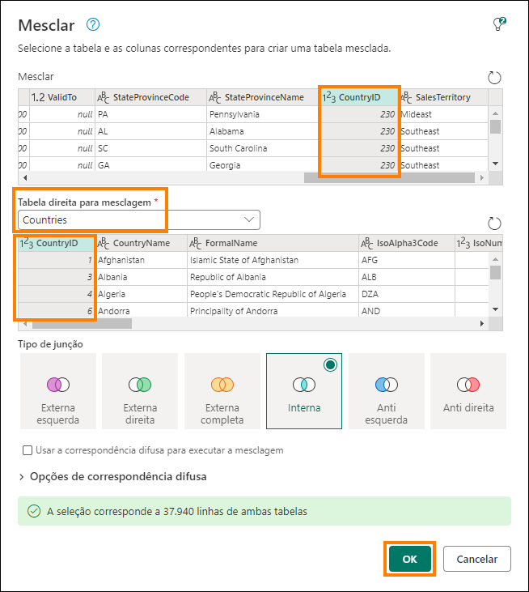

    Precisamos de algumas colunas de Countries.

19. Na **exibição Dados** (painel inferior), clique na **seta dupla** ao
    lado da coluna **Countries**.

20. Um painel é aberto. **Selecione** as colunas a seguir:

    a. CountryName

    b. FormalName

    c. IsoAlpha3Code

    d. IsoNumericCode

    e. CountryType

    f. Continent

    g. Region

    h. Subregion

21. Selecione **OK**.

    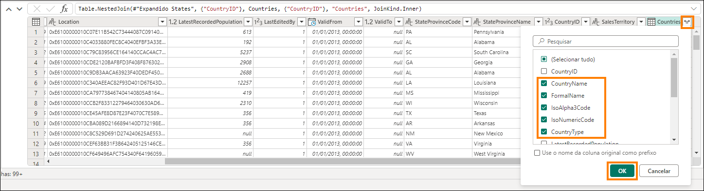

    Não precisamos de todas as colunas. Vamos selecionar apenas aquelas de
    que precisamos.

22. Com a consulta Merge selecionada, selecione **Página Inicial - \>
    Escolher colunas -\> Escolher colunas** na faixa de opções.

    > **Observação:** se a opção Escolher colunas não estiver visível, você
    > poderá encontrá-la em Gerenciar colunas.

    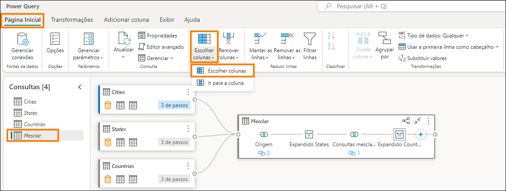

23. A caixa de diálogo Escolher colunas é aberta. **Desmarque** as
    colunas a seguir.

    a. StateProvinceID

    b. Location

    c. LastEditedBy

    d. ValidFrom

    e. ValidTo

    f. CountryID

24. Selecione **OK**.

    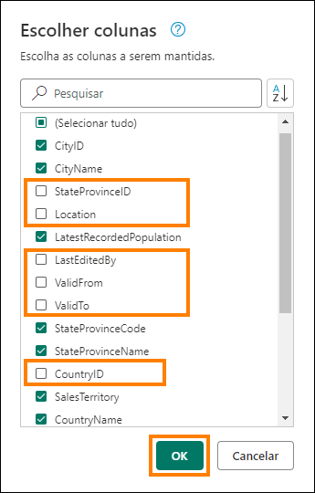

    Observe que o processo é como o Power Query. Temos todas as etapas
    gravadas tanto no painel Etapas Aplicadas à direita quanto na exibição
    visual. Vamos renomear a consulta Merge e Habilitar carga, para que os
    dados sejam carregados a partir dessa consulta.

25. **Clique com o botão direito do mouse na consulta Merge** no painel
    Consultas (à esquerda). Selecione **Renomear** e renomeie a consulta
    para **Geo**.

26. **Clique com o botão direito do mouse na consulta Geo** no painel
    Consultas (à esquerda). Selecione **Habilitar carga** para habilitar
    essa consulta.

27. Verifique se as consultas Cities, States e Countries estão
    **desabilitadas**.

28. Selecione **Salvar** encontrado no canto inferior direito do Editor
    do Power Query.

    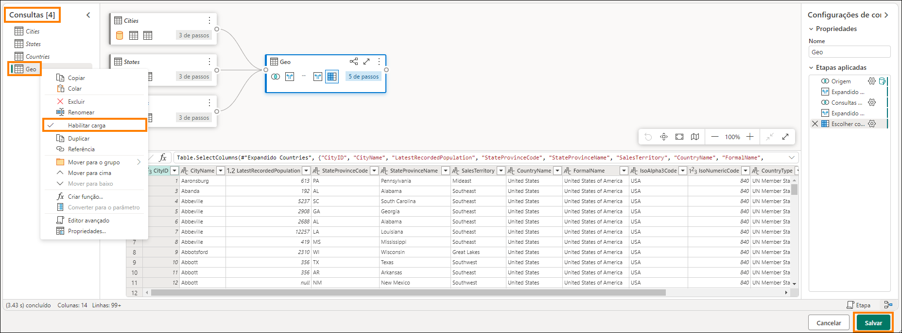

    Navegaremos até o Editor de consulta de visual. Agora vamos salvar essa
    consulta como uma exibição.

    **Observação**: todas as etapas que executamos usando o Editor do Power
    Query podem ser executadas usando o editor de consulta Visual também.

29. No menu Editor de consultas Visual, selecione **Salvar como
    exibição**.

    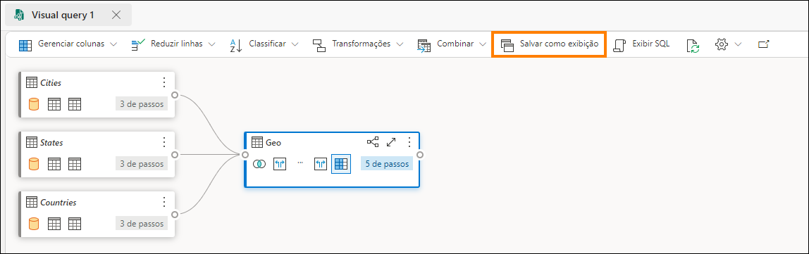

    A caixa de diálogo Salvar como exibição é aberta. Observe que a consulta
    SQL está disponível. Você pode revê-la, se quiser.

30. Insira **Geo** como **Nome da exibição**.

31. Selecione **OK** para salvar a exibição.

    

    Você receberá um alerta assim que a exibição for salva.

32. No painel Explorer (à esquerda), expanda **Exibições**. Temos a
    exibição recém-criada Geo.

    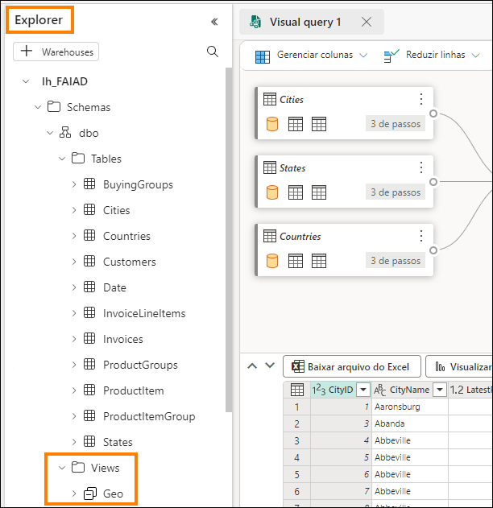

### Tarefa 3: Criar exibição Reseller usando uma consulta Visual

Vamos criar a exibição Reseller, mesclando a tabela Customers com a
tabela BuyingGroups. Desta vez, criaremos a exibição usando a consulta
Visual.

1. No menu superior, clique no menu suspenso ao lado de **Nova consulta
    SQL** e depois selecione **Nova consulta visual**.

2. Na seção Explorer, arraste as tabelas Customers e BuyingGroups para
    a seção de consulta de visual.

    

    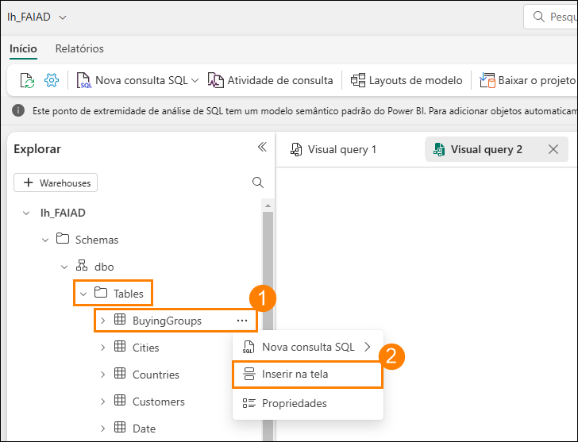

3. **Selecione a consulta Customers**. Quando selecionada, Customers
    terá uma borda azul e um sinal de \"+\" depois da Tabela (isso
    indica que estamos adicionando uma etapa depois da Tabela. Se você
    não vir o sinal de \"+\" após a tabela, talvez tenha selecionado uma
    etapa diferente. Selecione Tabela e pronto).

4. No menu Consulta de Visual, selecione **Combinar -\> Mesclar
    consultas**.

    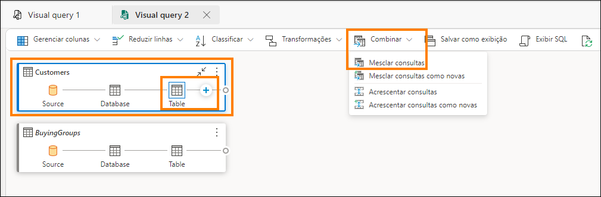

    A caixa de diálogo Mesclar é aberta com Customers selecionada como a
    tabela superior.

5. Na tabela **à direita para mesclar**, selecione **BuyingGroups**.

6. Selecione as colunas **BuyingGroupID** das duas tabelas. Vamos usar
    esta coluna.

7. Selecione **Interna** como o **tipo de União**.

8. Selecione **OK**.

    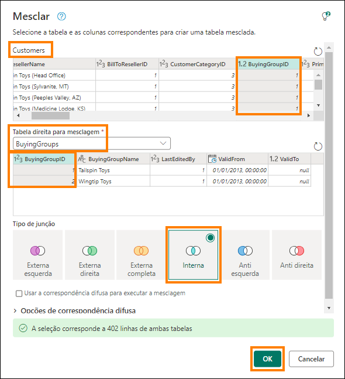

9. Na **exibição Dados** (painel inferior), clique na **seta dupla** ao
    lado da coluna **BuyingGroups** (última coluna à direita) para
    selecionar as colunas que precisamos de BuyingGroups.

10. Um painel é aberto. **Selecione a coluna** **BuyingGroupName** .

11. Selecione **OK**.

    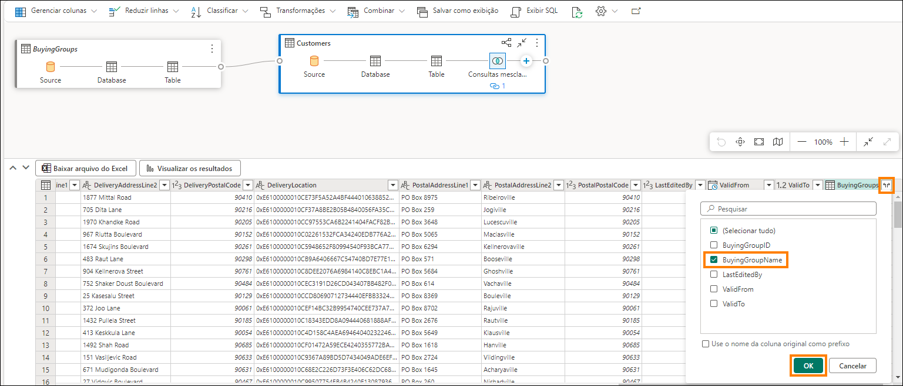

    Não precisamos de todas as colunas. Vamos selecionar apenas aquelas de
    que precisamos.

12. No menu de consulta de Visual, selecione **Gerenciar colunas -\>
    Escolher colunas**.

    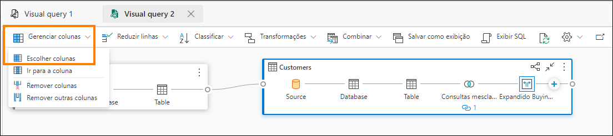

13. A caixa de diálogo Escolher colunas é aberta. **Selecione** as
    colunas a seguir.

    a. ResellerID

    b. ResellerName

    c. PostalCityID

    d. PhoneNumber

    e. FaxNumber

    f. WebsiteURL

    g. DeliveryAddressLine1

    h. DeliveryAddressLine2

    i. DeliveryPostalCode

    j. PostalAddressLine1

    k. PostalAddressLine2

    l. PostalPostalCode

    m. BuyingGroupName

14. Selecione **OK**.

    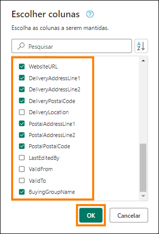

15. Vamos renomear a coluna BuyingGroupName. Na **exibição Dados, clique
    duas vezes no cabeçalho da coluna BuyingGroupName** para torná-lo
    editável.

16. **Renomeie** a coluna como **ResellerCompany.**

    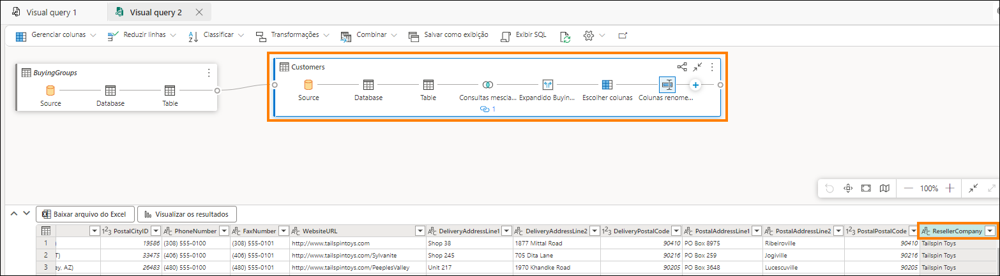

    Observe que a tabela Customer tem todas as etapas documentadas. Vamos
    salvar esta exibição.

17. Precisamos salvar a consulta do Customer, pois ela tem todas as
    etapas. Precisamos habilitar o carregamento. Selecione as
    **reticências** na caixa de consulta **Customer**.

18. Verifique se a opção **Habilitar carga** está marcada.

    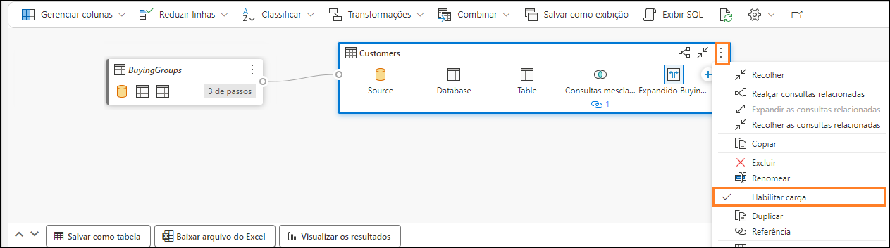

    **Observação:** a caixa **Cliente** deve ter uma borda azul se a opção
    Habilitar carregamento estiver marcada.

19. No menu de consultas Visual, selecione **Salvar como exibição**.

    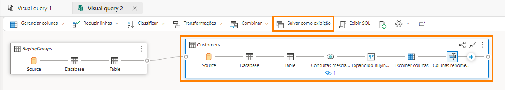

    A caixa de diálogo Salvar como exibição é aberta. Observe que a consulta
    SQL está disponível. Você pode revê-la, se quiser.

20. Insira **Reseller** como **Nome da exibição**.

21. Selecione **OK** para salvar a exibição.

    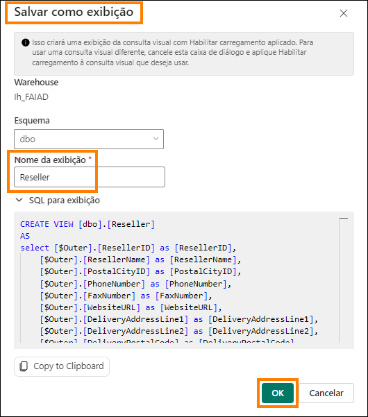

    Você receberá um alerta assim que a exibição for salva.

22. No painel Explorer (à esquerda), expanda **Exibições.** Temos a
    exibição recém-criada Reseller.

    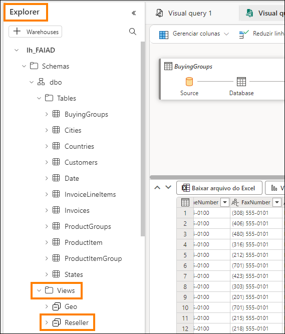

### Tarefa 4: Criar a exibição Sales usando uma consulta Visual

Vamos criar a exibição Sales, mesclando a tabela InvoiceLineItems and
Invoices e a exibição Reseller. Temos essa consulta no Power BI Desktop.
Vamos copiar o código do Editor Avançado. Mas antes de copiar o código,
precisamos criar uma tabela de mesclagem usando a consulta Visual, pois
a criação de uma consulta em branco não é possível na consulta Visual.
Vamos testar esse método.

1.  No menu superior, clique no menu
    suspenso ao lado de **Nova consulta SQL** e depois selecione **Nova
    consulta visual**.

    

2. Na seção **Explorer -\> Tabela**, arraste as tabelas
    **InvoiceLineItems** e **Invoices** para a seção de consulta visual.

3. Na seção **Explorer -\> Exibições**, arraste a exibição **Reseller**
    para a seção de consulta visual

4. No Editor de consulta Visual, selecione o ícone **Abrir em popup**
    para abrir o Editor do Power Query.

    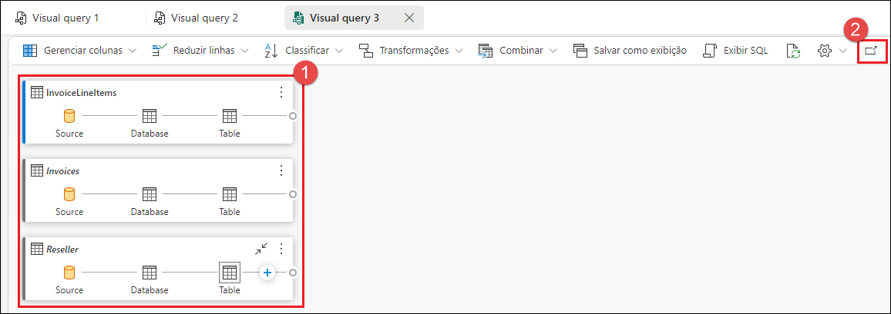

5. Com a consulta InvoiceLineItems selecionada, na faixa de opções,
    selecione **Página Inicial - \> Mesclar consultas -\> Mesclar
    consultas como novas**.

    **Observação:** se você não vir Mesclar consultas na faixa de opções
    Página Inicial, clique na lista suspensa para Combinar e selecione
    Mesclar consultas.

    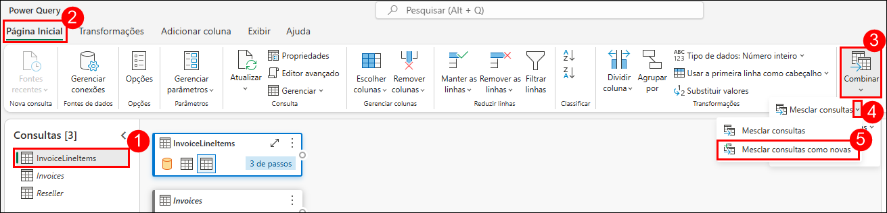

    A caixa de diálogo Mesclar é aberta.

6. Na tabela **à esquerda para mesclar**, selecione
    **InvoiceLineItems**.

7. Na tabela **à direita para mesclar**, selecione **Invoices**.

8. Selecione as colunas **InvoiceID** das duas tabelas. Vamos usar esta
    coluna.

9. Selecione **Interna** como o **tipo de União**.

10. Selecione **OK.**

    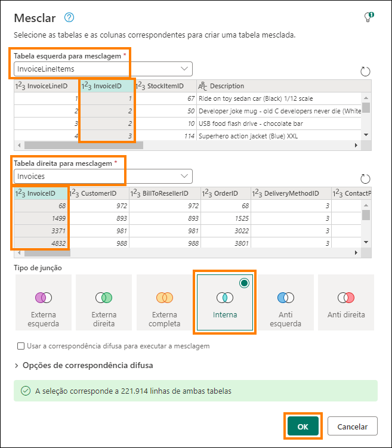

    Vamos copiar o código do Power BI Desktop e colá-lo usando o Editor
    Avançado.

11. Se você ainda não tiver aberto, abra o arquivo **FAIAD.pbix** que
    está na pasta **Reports** na área de trabalho do seu ambiente de
    laboratório.

12. Na faixa de opções, selecione **Página Inicial -\> Transformar
    dados**. A janela do Power Query é aberta. Como você observou no
    laboratório anterior, as consultas no painel esquerdo são
    organizadas por fonte de dados.

    

13. No painel esquerdo, na pasta ADLSData, selecione a consulta
    **Sales.**

14. Na faixa de opções, selecione **Página Inicial -\> Editor
    Avançado**. A caixa de diálogo Editor Avançado é aberta.

    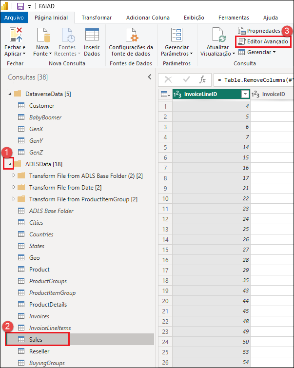

    **Observação:** se você não conseguir encontrar o Editor Avançado,
    poderá acessá-lo em **Início -\> Consulta -\> Editor Avançado**.

15. **Selecione código da Linha 3** (#\"Expanded Invoice\"\...) até a
    última linha de código.

16. **Clique com o botão direito do mouse** e selecione **Copiar**.

17. Selecione **Cancelar** para fechar o Editor Avançado.

    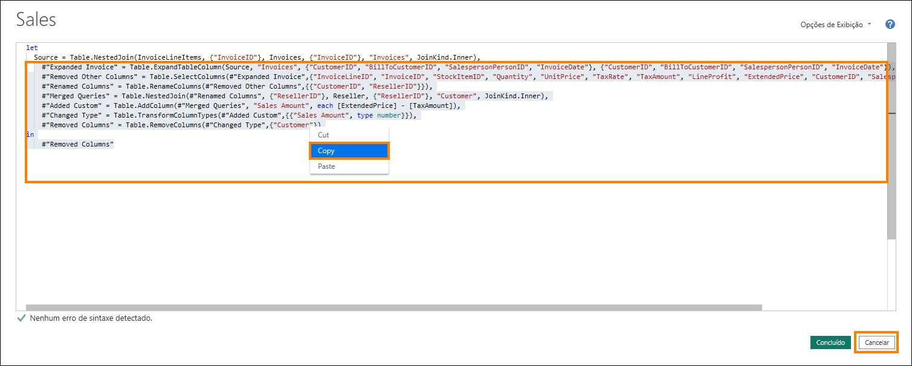

18. **Volte a acessar o navegador** onde o Editor do Power Query está
    aberto.

19. Verifique se você tem a consulta **Merge** selecionada.

20. Na faixa de opções, selecione **Página Inicial -\> Editor
    Avançado**. A caixa de diálogo Editor Avançado é aberta.

    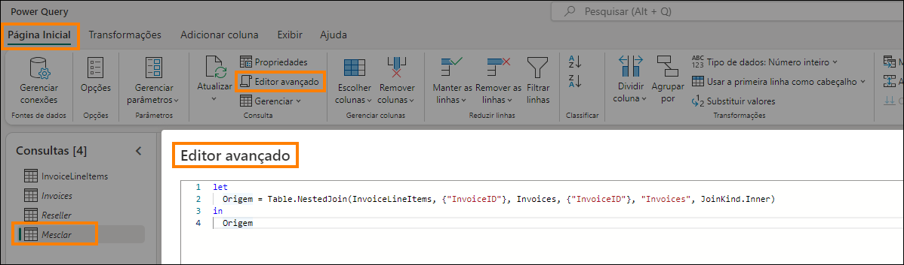

21. No **final da linha 2, adicione uma vírgula** (Source =
    Table.NestedJoin(InvoiceLineItems, {\"InvoiceID\"}, Invoices,
    {\"InvoiceID\"}, \"Invoices\", JoinKind.Inner)

22. Pressione **Enter** para começar uma nova linha.

23. Digite **Ctrl+V** no teclado para colar o código copiado do Power BI
    Desktop.

    **Observação:** se você estiver trabalhando no ambiente de laboratório,
    selecione as **reticências(...)** no canto superior direito da tela. Use
    o controle deslizante para **habilitar** **VM Native Clipboard**.
    Selecione OK na caixa de diálogo. Depois que terminar de colar as
    consultas, você poderá desabilitar essa opção.

    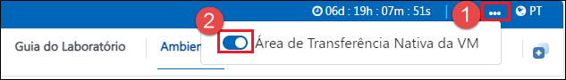

    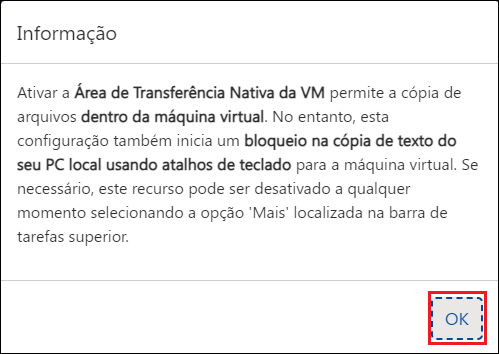

24. Realce as duas últimas linhas de código (na Origem) e **exclua-o**.

25. Selecione **OK** para salvar as alterações.

    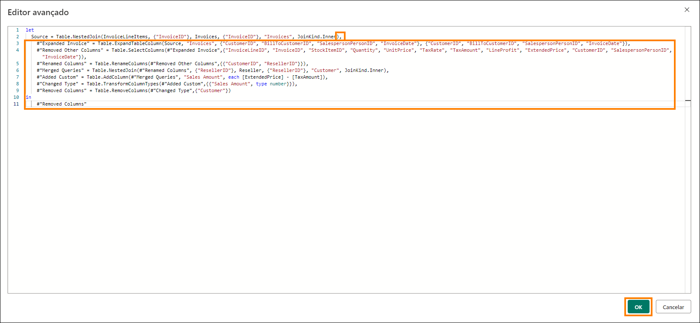

    Se for mais fácil, exclua todo o código no Editor Avançado e cole o
    código abaixo no Editor Avançado.

    ```
    let
      Source = Table.NestedJoin(InvoiceLineItems, {"InvoiceID"}, Invoices, {"InvoiceID"}, "Invoices", JoinKind.Inner),
        #"Expanded Invoice" = Table.ExpandTableColumn(Source, "Invoices", {"CustomerID", "BillToCustomerID", "SalespersonPersonID", "InvoiceDate"}, {"CustomerID", "BillToCustomerID", "SalespersonPersonID", "InvoiceDate"}),
        #"Removed Other Columns" = Table.SelectColumns(#"Expanded Invoice",{"InvoiceLineID", "InvoiceID", "StockItemID", "Quantity", "UnitPrice", "TaxRate", "TaxAmount", "LineProfit", "ExtendedPrice", "CustomerID", "SalespersonPersonID", "InvoiceDate"}),
        #"Renamed Columns" = Table.RenameColumns(#"Removed Other Columns",{{"CustomerID", "ResellerID"}}),
        #"Merged Queries" = Table.NestedJoin(#"Renamed Columns", {"ResellerID"}, Reseller, {"ResellerID"}, "Customer", JoinKind.Inner),
        #"Added Custom" = Table.AddColumn(#"Merged Queries", "Sales Amount", each [ExtendedPrice] - [TaxAmount]),
        #"Changed Type" = Table.TransformColumnTypes(#"Added Custom",{{"Sales Amount", type number}}),
        #"Removed Columns" = Table.RemoveColumns(#"Changed Type",{"Customer"})
    in
        #"Removed Columns"
    ```

26. Você voltará para o Editor do Power Query. À esquerda, no painel Consultas, **clique duas vezes na consulta Merge** para renomeá-la.

 27. **Renomeie** a consulta Merge para **Sales**.

 28. Clique com o botão direito do mouse na consulta Sales e selecione **Habilitar carga** para permitir que a consulta seja carregada.

        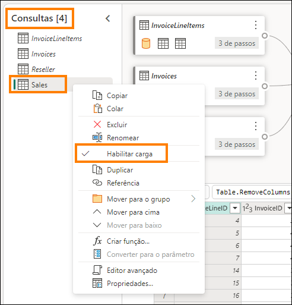

29. Selecione **Salvar** para salvar e fechar a caixa de diálogo Power Query. Você será direcionado à consulta Visual.

30. No menu de consultas Visual, selecione **Salvar como exibição**. A caixa de diálogo Salvar como exibição é aberta. Observe que a consulta SQL está disponível. Você pode revê-la, se quiser.

31. Insira **Sales** como **Nome da exibição**.

32. Selecione **OK** para salvar a exibição.

    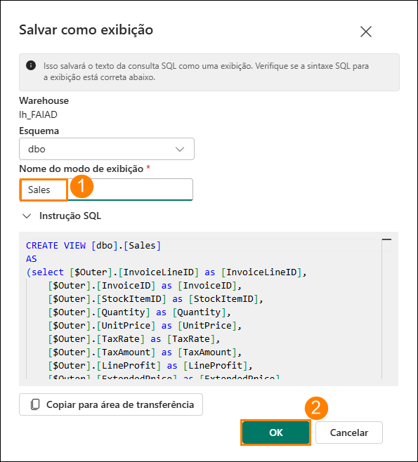

    Você receberá um alerta assim que a exibição for salva.

33. No painel Explorer (à esquerda), expanda **Exibições.** Temos a
    exibição recém-criada Sales.

    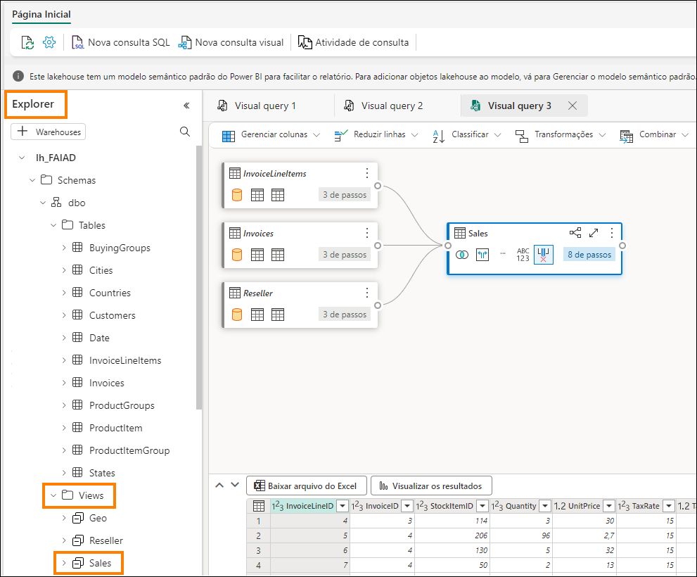

### Tarefa 5: Criar exibição Product usando uma consulta Visual

Vamos criar a exibição Product, mesclando as tabelas **ProductItem,
ProductItemGroup** e **ProductGroups**. Para continuar, vamos copiar o
código no Editor Avançado.

1. Na barra de menu Lakehouse, selecione **Página Inicial -\> o menu
    suspenso Nova Consulta SQL Nova consulta visual**.

2. Na seção Explorer, arraste as tabelas **ProductItem,
    ProductItemGroup e ProductGroups** para a seção de consulta Visual

3. No Editor de consulta Visual, selecione o **ícone Modo de foco**
    para abrir o Editor do Power Query.

    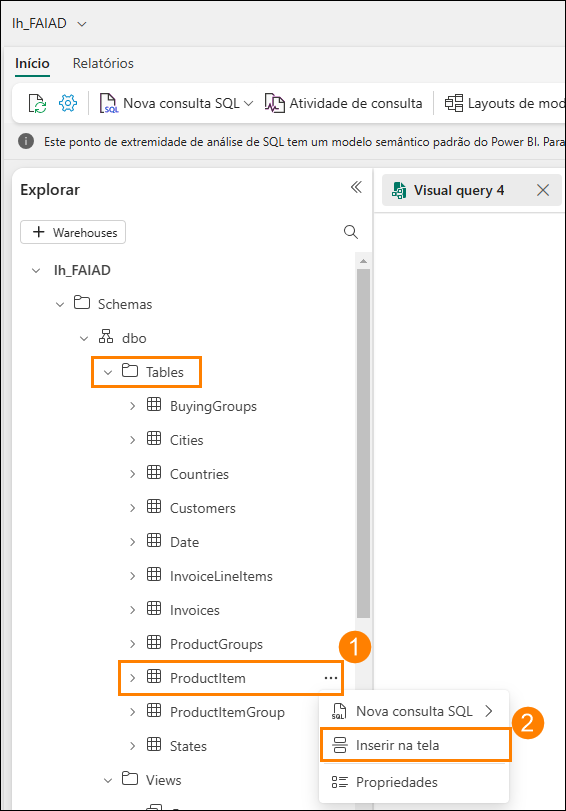

4. Com a consulta **ProductItem** selecionada, na faixa de opções,
    selecione **Página Inicial - \> Mesclar consultas -\> Mesclar
    consultas como novas.** A caixa de diálogo Mesclar é aberta.

    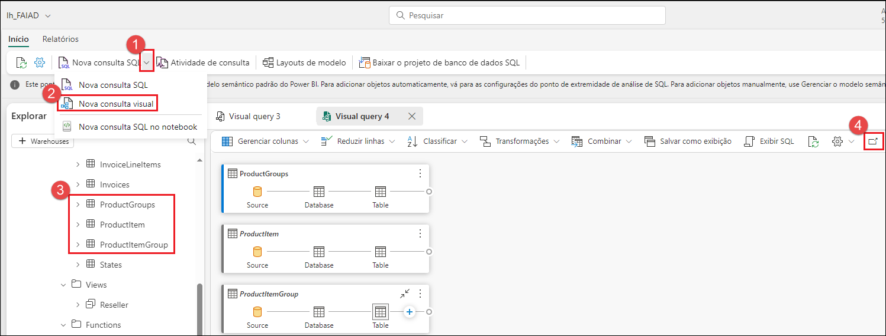

5. Na tabela **à esquerda para mesclar**, selecione **ProductItem**.

6. Na tabela **à direita para mesclar**, selecione
    **ProductItemGroup**.

7. Selecione as colunas **StockItemID** das duas tabelas. Vamos usar
    esta coluna.

8. Selecione **Externa esquerda** como **Tipo de junção**.

9. Selecione **OK.** Uma nova consulta Merge é criada.

    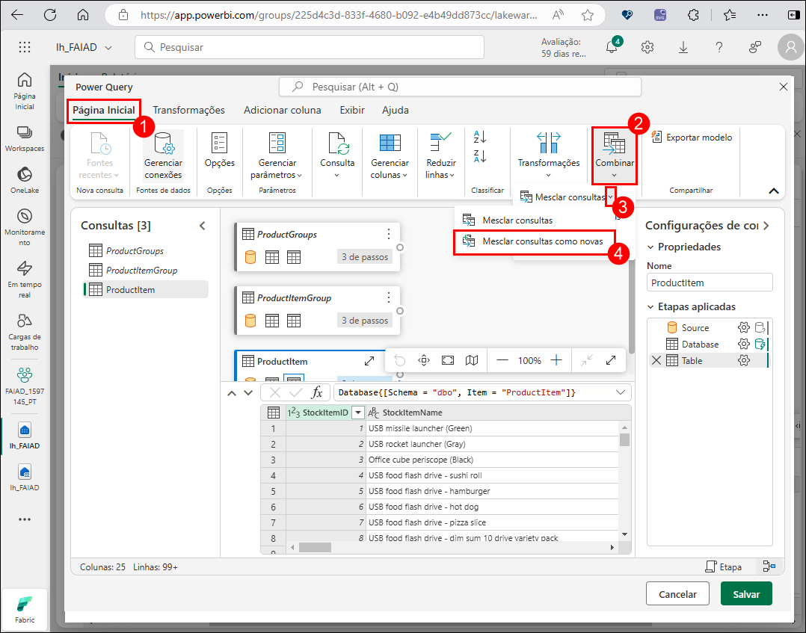

10. Com a consulta Merge selecionada, selecione **Página Inicial - \>
    Editor Avançado** na faixa de opções. A caixa de diálogo Editor
    Avançado é aberta.

    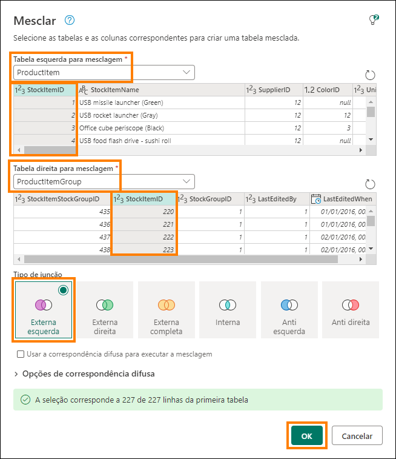

    **Observação:** se você não conseguir encontrar o Editor Avançado,
    poderá acessá-lo em **Início -\> Consulta -\> Editor Avançado**.

11. **Selecione todo o código** no Editor Avançado e **exclua-o**.

12. **Cole** o código abaixo no Editor Avançado.

    ```
    let
       Source = Table.NestedJoin(ProductItem, {"StockItemID"}, ProductItemGroup, {"StockItemID"}, "ProductItemGroup", JoinKind.LeftOuter),
       #"Expanded ProductItemGroup" = Table.ExpandTableColumn(Source, "ProductItemGroup", {"StockGroupID"}, {"StockGroupID"}),
       #"Merged queries" = Table.NestedJoin(#"Expanded ProductItemGroup", {"StockGroupID"}, ProductGroups, {"StockGroupID"}, "ProductGroups", JoinKind.LeftOuter),
       #"Expanded ProductGroups" = Table.ExpandTableColumn(#"Merged queries", "ProductGroups", {"StockGroupName"}, {"StockGroupName"}),
       #"Choose columns" = Table.SelectColumns(#"Expanded ProductGroups", {"StockItemID", "StockItemName", "SupplierID", "Size", "IsChillerStock", "TaxRate", "UnitPrice", "RecommendedRetailPrice", "TypicalWeightPerUnit", "StockGroupName"})
    in
       #"Choose columns"
    ```

13. Selecione **OK** para fechar o Editor Avançado. Você voltará para o
    Editor do Power Query.

    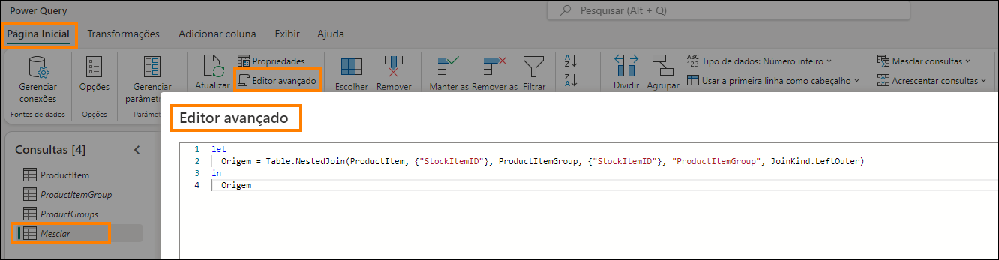

14. À esquerda, no painel Consultas, **clique duas vezes na consulta
    Merge** para renomeá-la.

15. **Renomeie** a consulta Merge para **Product**.

16. Clique com o botão direito do mouse na consulta Product e selecione
    **Habilitar carga** para permitir que a consulta seja carregada.

17. Selecione **Salvar** para salvar e fechar a caixa de diálogo Power
    Query. Você será direcionado à consulta Visual.

    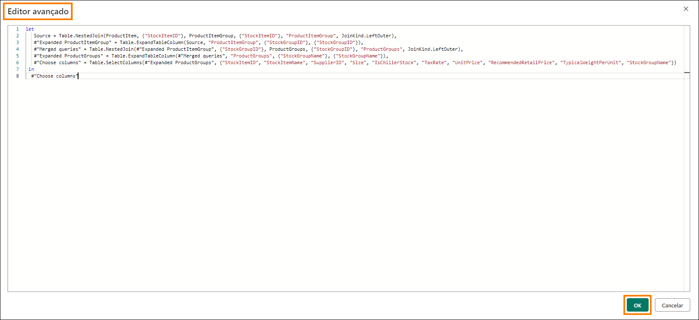

18. No menu de consultas Visual, selecione **Salvar como exibição**. A
    caixa de diálogo Salvar como exibição é aberta. Observe que a
    consulta SQL está disponível. Você pode revê-la, se quiser.

19. Insira **Product** como **Nome da exibição**.

20. Selecione **OK** para salvar a exibição.

    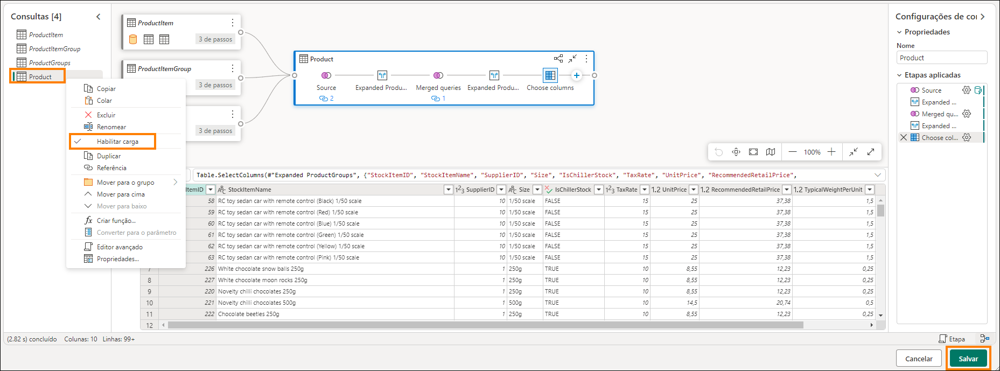

    Você receberá um alerta assim que a exibição for salva.

21. No painel Explorer (à esquerda), expanda **Exibições.** Temos a
    exibição recém-criada Product.

    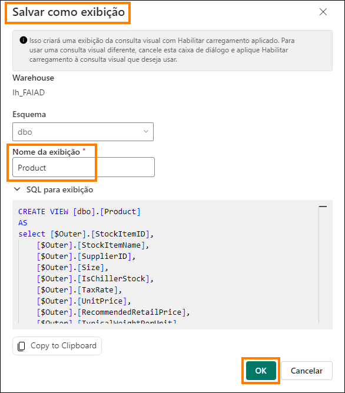

    Transformamos os dados da fonte de dados ADLS Gen2. Neste laboratório,
    aprendemos a criar atalhos e exploramos várias opções para usar modos de
    exibição de consulta visual para transformar dados.

    No próximo laboratório, aprenderemos a usar o Fluxo de Dados Gen2 e
    criar o Atalho para outro Lakehouse.

# Referências

O Fabric Analyst in a Day (FAIAD) apresenta algumas das principais
funções disponíveis no Microsoft Fabric. No menu do serviço, a seção
Ajuda (?) tem links para ótimos recursos.

   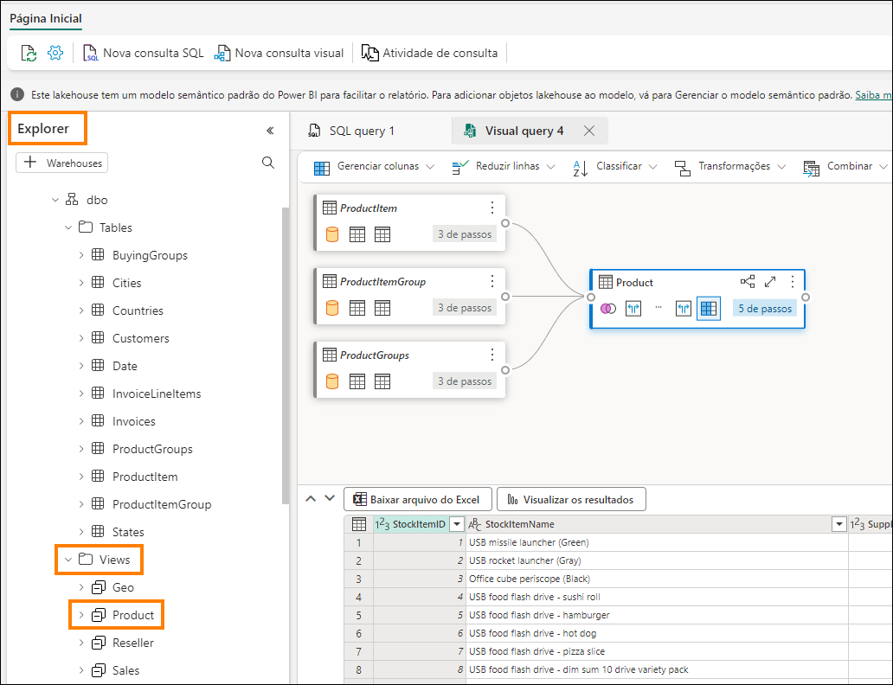

Veja aqui mais alguns recursos que ajudarão você com as próximas etapas do Microsoft Fabric.

- Veja a postagem do blog para ler o [anúncio completo de GA do Microsof t Fabric](https://www.microsoft.com/en-us/microsoft-fabric/blog/2023/11/15/prepare-your-data-for-ai-innovation-with-microsoft-fabric-now-generally-available/)
- Explore o Fabric por meio do [Tour Guiado](https://guidedtour.microsoft.com/en-us/guidedtour/microsoft-fabric/microsoft-fabric/1/1)
- Inscreva-se para a [avaliação gratuita do Microsof t Fabric](https://www.microsoft.com/en-us/microsoft-fabric/getting-started)
- Visite o [site do Microsof t Fabric](https://www.microsoft.com/en-in/microsoft-fabric)
- Aprenda novas habilidades explorando os [módulos de Aprendizagem do Fabric](https://learn.microsoft.com/en-us/training/browse/?products=fabric&resource_type=module)
- Explore a [documentação técnica do Fabric](https://learn.microsoft.com/en-us/fabric/)
- Leia o [livro eletrônico gratuito sobre como começar a usar o Fabric](https://info.microsoft.com/ww-landing-unlocking-transformative-data-value-with-microsoft-fabric.html)
- Participe da [comunidade do Fabric](https://community.fabric.microsoft.com/) para postar suas 
perguntas, compartilhar seus comentários e aprender com outras pessoas

Leia os blogs de comunicados de experiências do Fabric em mais detalhes:

- [Experiência do Data Factory no blog do Fabric](https://blog.fabric.microsoft.com/en-us/blog/introducing-data-factory-in-microsoft-fabric/)
- [Experiência do Synapse Data Engineering no blog do Fabric](https://blog.fabric.microsoft.com/en-us/blog/introducing-synapse-data-engineering-in-microsoft-fabric/)
- [Experiência do Synapse Data Science no blog do Fabric](https://blog.fabric.microsoft.com/en-us/blog/introducing-synapse-data-science-in-microsoft-fabric/)
- [Experiência do Synapse Data Warehousing no blog do Fabric](https://blog.fabric.microsoft.com/en-us/blog/introducing-synapse-data-warehouse-in-microsoft-fabric/)
- [Experiência do Synapse Real-Time Analytics no blog do Fabric](https://blog.fabric.microsoft.com/en-us/blog/sense-analyze-and-generate-insights-with-synapse-real-time-analytics-in-microsoft-fabric/)
- [Blog de comunicado do Power BI](https://powerbi.microsoft.com/en-us/blog/empower-power-bi-users-with-microsoft-fabric-and-copilot/)
- [Experiência do Data Activator no blog do Fabric](https://blog.fabric.microsoft.com/en-us/blog/driving-actions-from-your-data-with-data-activator/)
- [Administração e governança no blog do Fabric](https://blog.fabric.microsoft.com/en-us/blog/administration-security-and-governance-in-microsoft-fabric/)
- [OneLake no blog do Fabric](https://blog.fabric.microsoft.com/en-us/blog/microsoft-onelake-in-fabric-the-onedrive-for-data/)
- [Blog de integração do Dataverse e Microsof t Fabric](https://www.microsoft.com/en-us/dynamics-365/blog/it-professional/2023/05/24/new-dataverse-enhancements-and-ai-powered-productivity-with-microsoft-365-copilot/)


© 2023 Microsoft Corporation. Todos os direitos reservados.

Ao usar esta demonstração/este laboratório, você concorda com os seguintes termos:

A tecnologia/funcionalidade descrita nesta demonstração/neste laboratório é fornecida pela Microsoft Corporation para obter seus comentários e oferecer uma experiência de aprendizado. Você pode usar a demonstração/o laboratório somente para avaliar tais funcionalidades e recursos de tecnologia e fornecer comentários à Microsoft. Você não pode usá-los para nenhuma outra finalidade. Você não pode modificar, copiar, distribuir, transmitir, exibir, executar,
reproduzir, publicar, licenciar, criar obras derivadas, transferir nem vender esta demonstração/este laboratório ou qualquer parte deles.

A CÓPIA OU A REPRODUÇÃO DA DEMONSTRAÇÃO/DO LABORATÓRIO (OU DE QUALQUER PARTE DELES) EM QUALQUER OUTRO SERVIDOR OU LOCAL PARA REPRODUÇÃO OU REDISTRIBUIÇÃO ADICIONAL É EXPRESSAMENTE PROIBIDA.

ESTA DEMONSTRAÇÃO/ESTE LABORATÓRIO FORNECE DETERMINADOS RECURSOS E FUNCIONALIDADES DE PRODUTO/TECNOLOGIA DE SOFTWARE, INCLUINDO NOVOS RECURSOS E CONCEITOS POTENCIAIS, EM UM AMBIENTE SIMULADO SEM CONFIGURAÇÃO NEM INSTALAÇÃO COMPLEXA PARA A FINALIDADE DESCRITA ACIMA. A TECNOLOGIA/OS CONCEITOS REPRESENTADOS NESTA DEMONSTRAÇÃO/NESTE LABORATÓRIO PODEM NÃO REPRESENTAR A FUNCIONALIDADE COMPLETA DOS RECURSOS E PODEM NÃO FUNCIONAR DA MESMA MANEIRA QUE UMA VERSÃO FINAL. ALÉM DISSO, PODEMOS NÃO LANÇAR UMA VERSÃO FINAL DE TAIS RECURSOS OU CONCEITOS. SUA EXPERIÊNCIA COM O USO DE TAIS RECURSOS E FUNCIONALIDADES EM UM AMBIENTE FÍSICO TAMBÉM PODE SER DIFERENTE.

**COMENTÁRIOS**. Caso você forneça comentários sobre os recursos de tecnologia, as funcionalidades e/ou os conceitos descritos nesta demonstração/neste laboratório à Microsoft, você concederá à Microsoft, sem encargos, o direito de usar, compartilhar e comercializar seus comentários de qualquer forma e para qualquer finalidade. Você também concede a terceiros, sem encargos, quaisquer direitos de patente necessários para que seus produtos, suas
tecnologias e seus serviços usem ou interajam com partes específicas de um software ou um serviço da Microsoft que inclua os comentários. Você não fornecerá comentários que estejam sujeitos a uma licença que exija que a Microsoft licencie seu software ou sua documentação para terceiros em virtude da inclusão de seus comentários neles. Esses direitos continuarão em vigor após o término do contrato.

POR MEIO DESTE, A MICROSOFT CORPORATION SE ISENTA DE TODAS AS GARANTIAS E CONDIÇÕES REFERENTES À DEMONSTRAÇÃO/AO LABORATÓRIO, INCLUINDO TODAS AS GARANTIAS E CONDIÇÕES DE COMERCIALIZAÇÃO, SEJAM ELAS EXPRESSAS, IMPLÍCITAS OU ESTATUTÁRIAS, E DE ADEQUAÇÃO A UMA FINALIDADE ESPECÍFICA, TÍTULO E NÃO VIOLAÇÃO. A MICROSOFT NÃO DECLARA NEM GARANTE A PRECISÃO DOS RESULTADOS DERIVADOS DO USO DA DEMONSTRAÇÃO/DO LABORATÓRIO NEM A ADEQUAÇÃO DAS INFORMAÇÕES CONTIDAS NA DEMONSTRAÇÃO/NO LABORATÓRIO A QUALQUER FINALIDADE.
 
**AVISO DE ISENÇÃO DE RESPONSABILIDADE**
Esta demonstração/este laboratório contém apenas uma parte dos novos recursos e aprimoramentos do Microsoft Power BI. Alguns dos recursos podem ser alterados em versões futuras do produto. Nesta demonstração/neste laboratório, você aprenderá sobre alguns dos novos recursos, mas não todos.
