#  {#section .TOC-Heading}

> Microsoft Fabric
>
> Fabric Analyst in a Day
>
> Laboratório 0

Microsoft Fabric Fabric Analyst in a Day

Laboratório 7

Versão: dezembro de 2024

> Laboratório 0

# Sumário {#sumário .TOC-Heading}

[Introdução [3](#introdução)](#introdução)

[Power BI [3](#power-bi)](#power-bi)

[Tarefa 1: Criar relatório automaticamente
[3](#tarefa-1-criar-relatório-automaticamente)](#tarefa-1-criar-relatório-automaticamente)

[Tarefa 2: Configurar plano de fundo para um Novo relatório
[7](#tarefa-2-configurar-plano-de-fundo-para-um-novo-relatório)](#tarefa-2-configurar-plano-de-fundo-para-um-novo-relatório)

[Tarefa 3: Adicionar cabeçalho ao relatório
[9](#tarefa-3-adicionar-cabeçalho-ao-relatório)](#tarefa-3-adicionar-cabeçalho-ao-relatório)

[Tarefa 4: Adicionar KPIs ao relatório
[10](#tarefa-4-adicionar-kpis-ao-relatório)](#tarefa-4-adicionar-kpis-ao-relatório)

[Tarefa 5: Adicionar gráfico de linhas ao relatório
[12](#tarefa-5-adicionar-gráfico-de-linhas-ao-relatório)](#tarefa-5-adicionar-gráfico-de-linhas-ao-relatório)

[Tarefa 6: Salvar o relatório
[13](#tarefa-6-salvar-o-relatório)](#tarefa-6-salvar-o-relatório)

[Tarefa 7: Configurar a coluna Year na tabela Date
[13](#tarefa-7-configurar-a-coluna-year-na-tabela-date)](#tarefa-7-configurar-a-coluna-year-na-tabela-date)

[Tarefa 8: Configurar a coluna Month Name na tabela Date
[14](#tarefa-8-configurar-a-coluna-month-name-na-tabela-date)](#tarefa-8-configurar-a-coluna-month-name-na-tabela-date)

[Tarefa 9: Formatar gráfico de linhas
[15](#tarefa-9-formatar-gráfico-de-linhas)](#tarefa-9-formatar-gráfico-de-linhas)

[Tarefa 10: Conectar o Power BI Desktop ao modelo semântico
[17](#tarefa-10-conectar-o-power-bi-desktop-ao-modelo-semântico)](#tarefa-10-conectar-o-power-bi-desktop-ao-modelo-semântico)

[Tarefa 11: Adicionar novos dados para simular o modo Direct Lake
[20](#tarefa-11-adicionar-novos-dados-para-simular-o-modo-direct-lake)](#tarefa-11-adicionar-novos-dados-para-simular-o-modo-direct-lake)

[Limpar o ambiente do laboratório
[28](#limpar-o-ambiente-do-laboratório)](#limpar-o-ambiente-do-laboratório)

[Referências [29](#referências)](#referências)

# 

# 

# 

# 

# 

# 

# 

# 

# 

# 

# Introdução

Neste curso, conhecemos o Lakehouse, fizemos a ingestão de dados de
diferentes fontes de dados no Lakehouse, definimos uma agenda de
atualização para as fontes de dados e criamos um modelo de dados. Agora
você vai criar um relatório.

Ao final deste laboratório, você terá aprendido:

- Como criar um relatório automaticamente

- Como criar um relatório a partir de uma tela em branco

- Como criar um relatório usando o Power BI Desktop

- Como experimentar o modo Direct Lake resultante da atualização
    automática de dados

# Power BI

### Tarefa 1: Criar relatório automaticamente

Vamos começar usando a opção de criação automática de relatório. E, mais
adiante no laboratório, recriaremos o relatório que temos no Power BI.

1. Vamos voltar ao **workspace do Fabric** que você criou no
    laboratório anterior.

2. Na parte inferior esquerda da tela, selecione o ícone **Fabric
    experience selector**.

3. A caixa de diálogo de experiência do Fabric é aberta. Selecione
    **Power BI**. Você será direcionado a uma **Página Inicial do Power
    BI**.

    

4. No menu superior, selecione **Novo relatório**.

    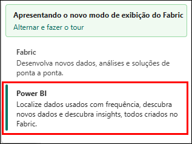

5. Você será direcionado para **Criar seu primeiro relatório**. Haverá
    opções para criar um relatório usando o Excel, csv, inserir dados
    manualmente ou escolher um modelo semântico publicado. Criamos um
    modelo semântico nos laboratórios anteriores. Vamos usá-lo.
    Selecione a opção **Escolher um modelo semântico publicado**.

    

6. Escolha um conjunto de dados para usar quando a página do relatório
    é aberta. Observe que temos várias opções. Selecione **sm_FAIAD**.

    a. **sm_FAIAD:** é o modelo semântico que criamos e queremos usar
        para criar o relatório.

    b. **lh_FAIAD:** é o lakehouse em que ingerimos todos os dados.

    c. **DataflowsStagingWarehouse:** é o depósito temporário criado
        por padrão. Não usamos essa opção porque não preparamos dados.

    d. **DataflowsStagingLakehouse:** é o lakehouse temporário criado
        por padrão. Não usamos essa opção porque não preparamos dados.

7. Clique na **seta ao lado do botão Relatório de criação automática**.
    Existem duas opções: Criar relatório automaticamente e Criar um
    relatório em branco. Vamos tentar criar automaticamente. Selecione
    **Relatório de criação automática**.

    

8. O Power BI começará a criar automaticamente o relatório. Observe que
    há uma opção para pré-selecionar dados, se preferirmos. Quando o
    relatório estiver pronto, uma caixa de diálogo será exibida na parte
    superior direita da tela. Selecione **Exiba o relatório agora ou ele
    será carregado automaticamente em alguns segundos**.

    

**Ponto de verificação:** você terá um relatório semelhante à captura de
tela abaixo. Existem alguns KPIs e alguns visuais de tendências. Este é
um bom começo se você estiver analisando um novo modelo e precisar de um
impulso inicial.

**Observação:** No menu superior, você tem a opção de editar o relatório
ou visualizar alguns dos dados como tabelas. Fique à vontade para
explorar essas opções.

9. Vamos salvar este relatório. No menu superior, selecione **Salvar**.

10. A caixa de diálogo Salvar seu relatório é aberta. Nomeie o relatório
    como **rpt_Sales_Auto_Report**.\
    **Observação:** estamos prefixando o nome do relatório com rpt, que
    é a abreviação de relatório.

11. Verifique se o relatório está salvo no workspace, **FAIAD\_\<nome de
    usuário\>**.

12. Selecione **Salvar**.

    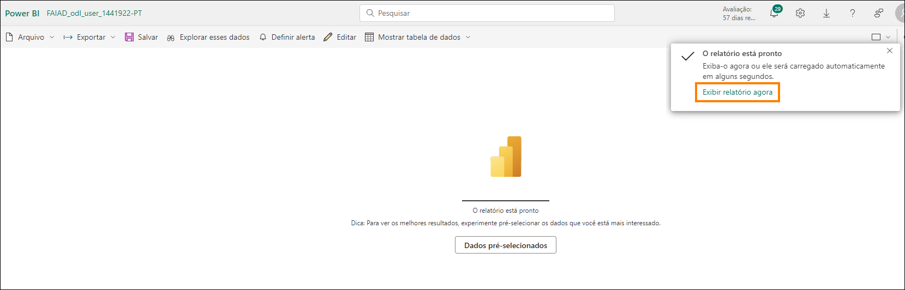

**Observação:** A aparência do relatório criado automaticamente pode ser
diferente para você, pois ele é \"criado automaticamente\". Depende
também dos relacionamento e das medidas que você criou no laboratório
anterior (Laboratório 6).

A captura de tela acima mostra como o relatório criado automaticamente
**poderá** ser exibido se você tiver criado todos os relacionamentos e
medidas, incluindo os relacionamentos opcionais (Laboratório 6).

A captura de tela abaixo mostra como o relatório criado automaticamente
**poderá** ser exibido se você tiver pulado a criação de relacionamentos
e medidas opcionais (Laboratório 6).

### Tarefa 2: Configurar plano de fundo para um Novo relatório

Vamos criar um novo relatório usando uma tela em branco.

1. No **painel esquerdo**, selecione o nome do seu workspace,
    **FAIAD\_\<nome de usuário\>** para ser direcionado para o
    workspace.

2. No menu superior, selecione **Novo -\> Relatório**. Você será
    direcionado para criar sua primeira página de relatório.

      

3. Selecione **Escolher um modelo semântico publicado**, para que
    possamos escolher o modelo que criamos.

    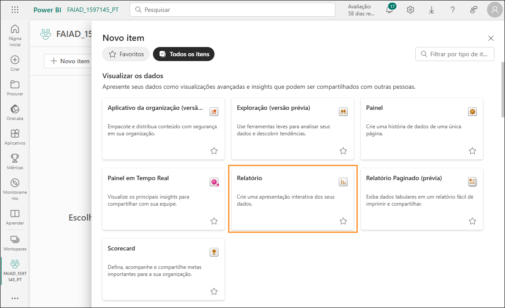

4. Escolha um modelo semântico para usar quando a caixa de diálogo do
    relatório é aberta. Selecione **sm_FAIAD**.

5. Clique na **seta ao lado do botão Relatório de criação automática**.
    Selecione **Criar um relatório em branco**. Você acessará uma página
    do relatório que se parece com a página do relatório do Power BI
    Desktop.

    

6. Se você ainda não tiver aberto, abra o arquivo **FAIAD.pbix** que
    está na pasta **Reports** na **área de trabalho** do seu ambiente de
    laboratório.

Usaremos este relatório como referência. Começaremos adicionando o plano
de fundo da tela. Criaremos o cabeçalho do relatório, adicionaremos
alguns KPIs e criaremos o gráfico de linhas Sales over time. Por uma
questão de tempo e sabendo que você tem experiência com a criação de
visuais no Power BI Desktop, não criaremos todos os visuais.

   

7. Volte para a **tela do Power BI** no seu navegador.

8. Selecione o **ícone** **Formatar página** no painel Visualizações.

9. Expanda a seção **Tela de fundo**.

10. Selecione a opção **Procurar** na opção **Imagem**. A caixa de
    diálogo Explorador de Arquivos é aberta.

11. Acesse pasta **Reports** na **área de trabalho** do seu ambiente de
    laboratório.

12. Selecione **Summary Background.png**.

13. Defina a lista suspensa **Ajuste da imagem** como **Ajuste**.

14. Defina Transparência como **0%**.

    

### Tarefa 3: Adicionar cabeçalho ao relatório

1. Vamos adicionar o cabeçalho na margem superior. No **menu**,
    selecione **Caixa de texto**.

2. Insira **Fabrikam Company** como a primeira linha da caixa de texto.

3. Insira **Sales Report** como a segunda linha na caixa de texto.

4. Realce **Fabrikam Company** e defina a **fonte** como **Segoe UI** e
    **tamanho da fonte** como **18, negrito**.

5. Realce **Sales Report** e defina a **fonte** como **Segoe UI** e
    **tamanho da fonte** como **14**.

6. Com a **caixa de texto selecionada**, no painel Formatar caixa de
    texto à direita, **expanda Efeitos**.

7. Use o controle deslizante **Tela de fundo** para defini-lo como
    **Desativado**.

8. Redimensione a **caixa de texto para caber na margem superior**.

    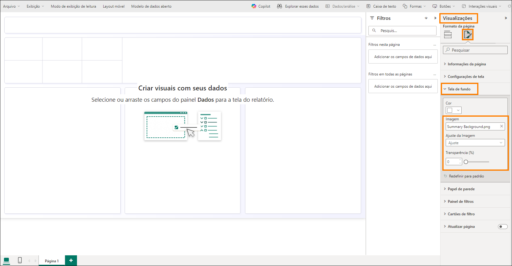

### Tarefa 4: Adicionar KPIs ao relatório

1. Vamos adicionar KPI de vendas. Selecione o **espaço em branco** na
    tela para tirar o foco da caixa de texto.

2. Na **seção** **Visualizações**, selecione o **visual de cartão de
    várias linhas**.

3. Na **seção Dados**, expanda a **tabela** **Sales**.

4. Selecione a **medida Sales**.

    

5. Com o **visual de cartão de várias linhas selecionado**, selecione o
    **ícone** **Formatar visual** na seção Visualizações.

6. Expanda a seção **Rótulos da categoria**.

7. Aumente o **tamanho da fonte** para **14**.

8. Selecione a **lista suspensa Cor**. A caixa de diálogo Paleta de
    cores é aberta.

9. Selecione **Mais Cores**.

10. Defina o valor Hex **#004753**.

    

11. Expanda a seção **Cartões**.

12. Use o controle deslizante **Barra de destaque** para defini-lo como
    **Desativado**.

    

13. Selecione **Geral** no painel Visualizações.

14. Expanda a seção **Efeitos**.

15. Use o controle deslizante **Tela de fundo** para defini-lo como
    **Desativado**.

16. Redimensione o **visual** e mova-o para a **caixa esquerda como
    mostrado na captura de tela**.

    

17. Vamos adicionar outro KPI. Selecione o **cartão de várias linhas
    Sales** que acabamos de criar. **Copie** o visual pressionando
    **Ctrl+C** no teclado.

18. **Copie** o visual pressionando **Ctrl+V** no teclado. O visual é
    colado na tela.

19. Com o **novo visual realçado**, no **painel Visualizações -\> Criar
    visual -\> seção Campos**, remova a medida **Sales**.

20. Na seção **Dados**, expanda a tabela **Sales** e selecione a medida
    **Units**.

21. Redimensione o **visual** e **coloque-o na caixa abaixo do visual
    Sales**.

    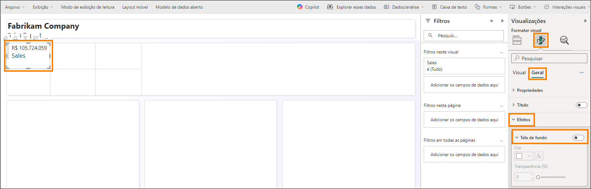

### Tarefa 5: Adicionar gráfico de linhas ao relatório

Vamos criar um gráfico de linhas para visualizar Vendas ao longo do
tempo por Reseller Company.

1. Selecione o **espaço em branco** na tela para tirar o foco do visual
    de cartão de várias linhas.

2. Na **seção** **Visualizações**, selecione **Gráfico de linhas**.

3. Na seção **Dados**, expanda a tabela **Date**.

4. Selecione o campo **Year**. Observe que Year é somado por padrão e
    adicionado ao eixo Y. Vamos retificar isso. Observe que o relatório
    está salvo e você está no modo de exibição.

    

### Tarefa 6: Salvar o relatório

Para fazer as alterações no modelo, salve o relatório antes de sair.

1. No menu, selecione **Arquivo -\> Salvar**.

2. A caixa de diálogo Salvar seu relatório é aberta. Nomeie o relatório
    como **rpt_Sales_Report**.\
    **Observação:** estamos prefixando o nome do relatório com rpt, que
    é a abreviação de relatório.

3. Verifique se o relatório está salvo no workspace **FAIAD\_\<nome de
    usuário\>.**

4. Selecione **Salvar**.

    

### Tarefa 7: Configurar a coluna Year na tabela Date

1. No menu **superior**, selecione **Editar** para voltar ao modo de
    edição.

2. No **menu superior**, selecione **Abrir modelo de dados**. Observe
    que o modelo semântico é aberto em uma nova janela/guia do
    navegador.

    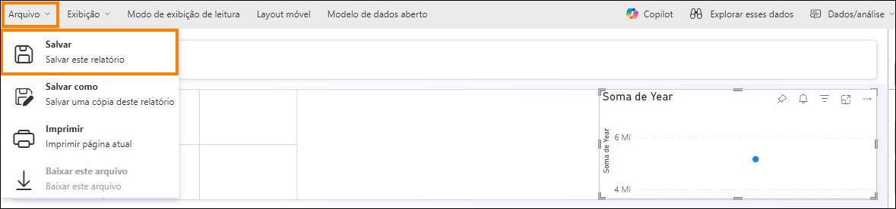

3. No painel **Dados** **à direita,** selecione Tabelas.

4. Expanda a tabela **Date**.

5. Selecione a coluna **Year**.

6. No painel **Propriedades**, à direita, expanda a seção **Avançado**.

7. Na lista suspensa **Resumir por**, selecione **Nenhum**.

    

8. Volte para a **janela/guia do relatório** do navegador.

9. No painel **Dados** da direita, expanda a tabela **Date**. Observe
    que Year não é campo de soma.

10. Com o **Visual de gráfico de linhas selecionado**, **remova Soma de
    Year** do eixo Y.

11. Selecione o campo **Year** e ele será adicionado ao **Eixo X**.

12. Expanda a tabela **Sales** e selecione a **medida Sales**.

    

### Tarefa 8: Configurar a coluna Month Name na tabela Date

1. Vamos adicionar Month a este gráfico. Na tabela Date, arraste o
    campo **MonthNameShort** abaixo de **Year** no **Eixo X**. Observe
    que o visual é classificado por Sales. Vamos classificá-lo por
    **MonthNameShort**.

2. Selecione as **reticências (...)** no canto superior direito do
    visual.

3. Selecione **Classificar eixo -\> Year Short_Month_Name**.

4. Selecione as **reticências (...)** no canto superior direito do
    visual.

5. Selecione **Classificar eixo -\> Classificar em ordem crescente**.

    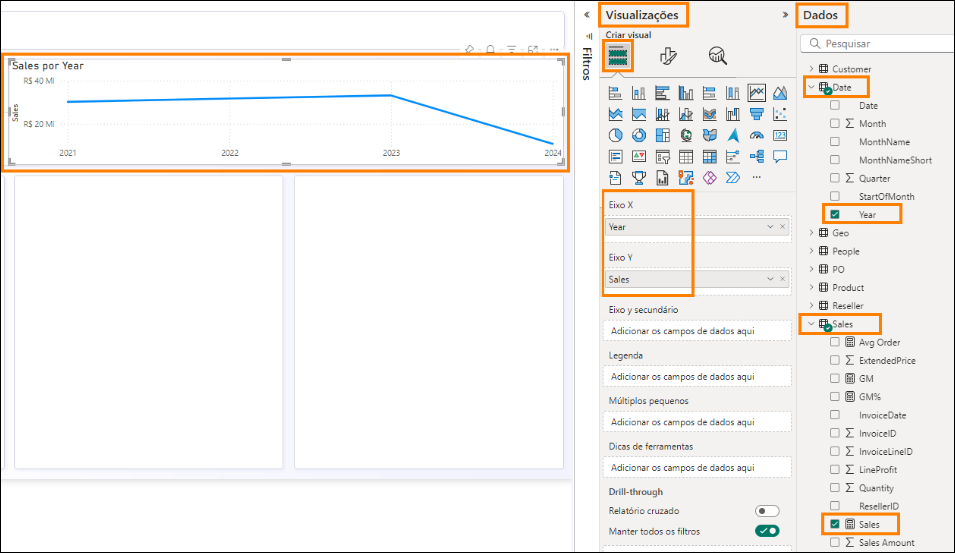

**Observação:** Os meses são classificados em ordem alfabética. Vamos
corrigir isso.

   

6. Volte a acessar a **janela/guia do navegador** onde o modelo
    semântico está aberto.

7. No painel **Dados**, expanda a tabela **Date**.

8. Selecione a coluna **MonthNameShort**.

9. No painel **Propriedades**, à direita, expanda a seção **Avançado**.

10. Na lista suspensa **Classificar por coluna**, selecione **Month**.

    

11. Volte para a **janela/guia do relatório** do navegador. Observe que
    agora os meses estão classificados corretamente.

    

### Tarefa 9: Formatar gráfico de linhas

Observe como é fácil atualizar o modelo semântico durante a criação dos
relatórios. Isso proporciona uma interação perfeita, como Power BI
Desktop.

1. Com o **Visual de gráfico de linhas selecionado**, na seção
    **Dados**, expanda a tabela **Reseller**.

2. Arraste o campo **Reseller -\> Reseller Company** na seção
    **Legenda**.

    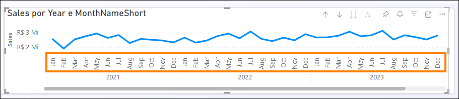

3. Com o **Visual de gráfico de linhas selecionado**, na seção
    **Visualizações**, selecione o **ícone Formatar visual -\> Geral**.

4. Expanda a seção **Título**.

5. Defina o texto de **Título** como **Sales over time**.

6. Expanda a seção **Efeitos**.

7. Use o controle deslizante **Tela de fundo** para defini-lo como
    **Desativado**.

    

8. Na seção **Visualizações**, selecione o **ícone Formatar visual -\>
    Visual**.

9. Expanda a seção **Linhas**.

10. Na lista suspensa **Aplicar configurações a -\> Série -\>,**
    selecione **Tailspin Toys.**

11. Expanda a seção **Cores**.

12. Defina **cor** como **#F17925**

13. Na lista suspensa **Aplicar configurações a -\> Série -\>,**
    selecione **Wingtip Toys.**

14. Defina **cor** como **#004753**

15. Redimensione o **visual** e mova-o para a **caixa superior direita
    como mostrado na captura de tela**.

16. Role para a direita no visual e **observe que temos dados até abril
    de 2024**.

    

17. Vamos salvar o relatório. No menu, selecione **Arquivo \> Salvar**.

Conforme mencionado anteriormente, não criaremos todos os visuais neste
laboratório. Quando quiser, fique à vontade para criar mais visuais.

### Tarefa 10: Conectar o Power BI Desktop ao modelo semântico

Agora vamos ver como é fácil conectar o Power BI Desktop ao modelo
semântico e criar visuais.

1. Abra o arquivo **FAIADTemplate.pbix** que está na pasta **Reports**
    na **área de trabalho** do seu ambiente de laboratório.

2. Na faixa de opções, selecione **Página Inicial -\> OneLake data hub
    -\> Modelos semânticos do Power BI**.

    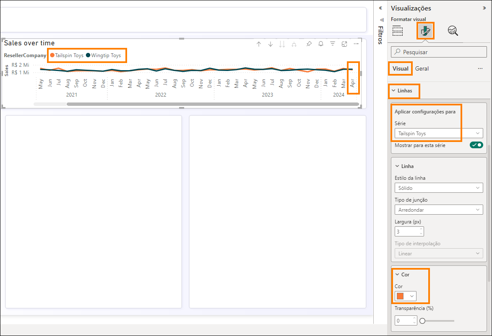

3. A caixa de diálogo do hub de dados do OneLake é aberta. Selecione
    **sm_FAIAD**, o modelo semântico que criamos.

4. Selecione **Conectar**. Observe que, no painel Dados, temos as
    tabelas do modelo semântico.

    

5. No **painel esquerdo**, selecione o **modo de exibição do modelo**.
    Observe que podemos visualizar o relacionamento entre tabelas.

    

6. No **painel esquerdo**, selecione a **exibição Relatório** para
    voltar ao modo de exibição Relatório.

7. Se você ainda não tiver aberto, abra o arquivo **FAIAD.pbix** que
    está na pasta **Reports** na **área de trabalho** do seu ambiente de
    laboratório.

8. Selecione o **visual título do relatório**.

9. Na faixa de opções, selecione **Página Inicial -\> Copiar**.

    

10. Acesse **FAIADTemplate.pbix** e selecione a tela do relatório.

11. Na faixa de opções, selecione **Página Inicial -\> Colar**.

    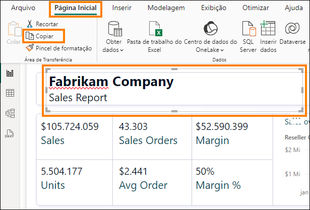

12. Da mesma forma, copie e cole os **KPIs Sales e Units**. A saber: é
    possível copiar e colar vários visuais juntos.

    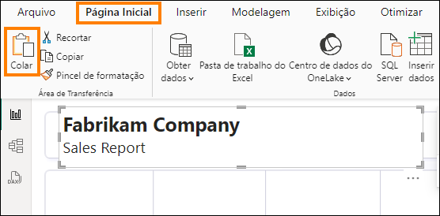

Observe que é fácil copiar elementos visuais de um relatório existente e
colá-los em um relatório que se conecta ao modelo semântico. Os nomes de
tabelas, nomes de colunas e nomes de medidas devem ser os mesmos para
que a função de copiar e colar funcione. Se não forem iguais, você
poderá receber um erro, mas isso pode ser fácil de resolver.

13. Acesse **FAIAD.pbix** e selecione Sales ao longo do gráfico de
    linhas do tempo.

14. Na faixa de opções, selecione **Página Inicial -\> Copiar**.

15. Acesse **FAIADTemplate.pbix** e selecione a tela do relatório.

16. Na faixa de opções, selecione **Página Inicial -\> Colar**. Observe
    que o visual não é renderizado. Isso ocorre porque o modelo
    semântico atualmente não cria hierarquia a partir do campo Date.

17. Vamos corrigir isso. No painel **Visualização** , no **eixo X**,
    exclua **StartOfMonth**.

    

18. No **painel Dados**, expanda a tabela **Date**.

19. Arraste o campo **StartOfMonth** para o **eixo X**. Isso corrige o
    visual. Você pode precisar formatar o visual.

    

20. Vamos salvar o relatório. Na faixa de opções, selecione **Arquivo
    -\> Salvar**.

### Tarefa 11: Adicionar novos dados para simular o modo Direct Lake

Geralmente, no modo Import, depois que os dados são atualizados na
fonte, precisamos atualizar o modelo do Power BI após o qual os dados no
relatório são atualizados. Com o modo Direct Query, depois que os dados
são atualizados na fonte, eles ficam disponíveis no relatório do Power
BI. No entanto, o modo direct query geralmente é lento. Para resolver
esse problema, o Microsoft Fabric introduziu o modo Direct Lake. Direct
Lake é um caminho rápido para carregar os dados do lake diretamente para
o mecanismo do Power BI, pronto para análise.

Vamos explorar o cenário em que os dados são atualizados no ADLS Gen2 e
as alterações são refletidas imediatamente no relatório do Power BI sem
executar nenhuma atualização.

Em um cenário real, os dados são atualizados na fonte. Como estamos em
um ambiente de treinamento, vamos simular isto. Temos dados de Vendas
até abril de 2024. Vamos adicionar dados de Vendas para maio de 2024
criando um atalho para o arquivo de maio de 2024 no ADLS Gen2 e
atualizando a exibição Sales.

1. Volte para o **navegador**.

2. Selecione **FAIAD\_\<nome de usuário\>** na barra de menus à
    esquerda a fim de navegar até a home page do workspace.

3. Selecione **lh_FAIAD** para acessar o Lakehouse.

    

4. No **painel Explorer**, à esquerda, selecione as **reticências** ao
    lado de **Tabelas**.

5. Selecione **Novo atalho**.

    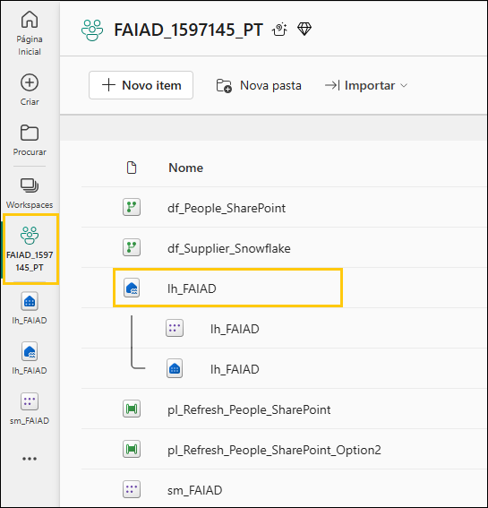

6. A caixa de diálogo Novo atalho é aberta. Em **Fontes externas**,
    selecione **Azure Data Lake Storage Gen2**.

    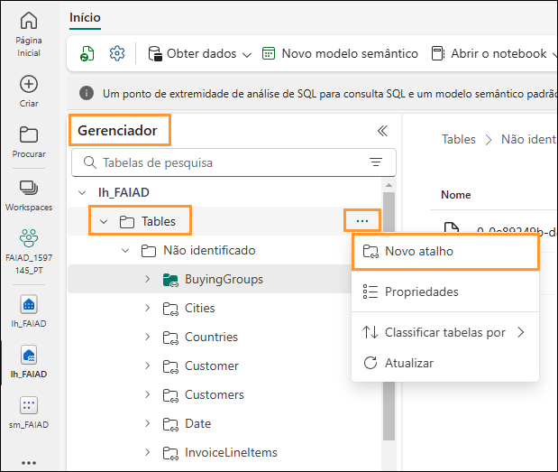

7. Como você criou uma conexão anteriormente nos laboratórios, não
    precisa criar uma conexão agora e verá sua conexão ADLS nas conexões
    existentes.

8. Se você não criou essa conexão anteriormente no curso, clique em
    Criar nova conexão e conclua as seguintes etapas:

9. Em Configurações de conexão -\> URL, insira este link:
    <https://stvnextblobstorage.dfs.core.windows.net/fabrikam-sales>

10. Selecione **Próximo**.

    

11. Você será conectado ao ADLS Gen2 com a estrutura de diretórios
    exibida no painel esquerdo. Expanda **Delta-Parquet-Format-FY25.**

12. Selecione **Sales.Invoices_May.**

13. Selecione **Próximo**.

    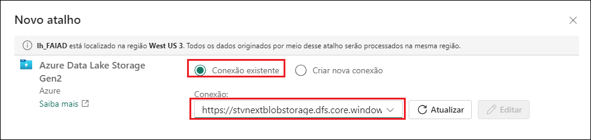

14. Você irá para a próxima caixa de diálogo para editar os nomes.
    Selecione o **ícone Editar**, em Ações, para **Sales.Invoices_May**.

15. Renomeie **Sales.Invoices_May para InvoicesMay.**

16. Selecione a **marca de seleção** ao lado do nome para salvar a
    alteração.

17. Selecione **Criar**.

    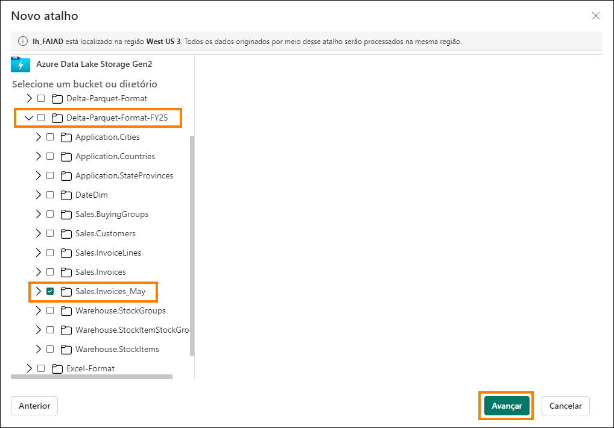

Observe no **painel Explorer** à esquerda, que temos a tabela
InvoicesMay. Agora precisamos atualizar a exibição Sales.

18. No **canto superior direito** da tela, selecione **Lakehouse -\>
    ponto de extremidade do SQL Analytics**.

    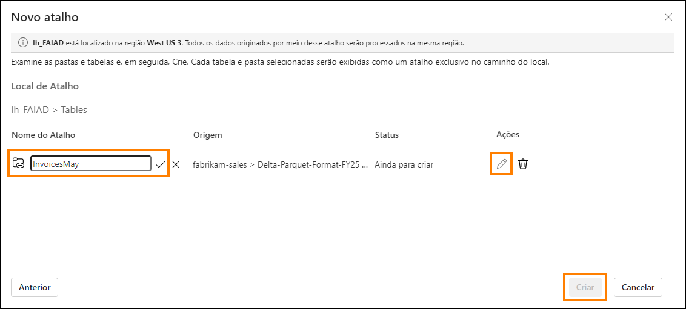

19. No menu superior, selecione **Página Inicial -\> Nova consulta
    SQL**. Um painel de nova consulta SQL é aberto.

20. **Copie** o código abaixo e **cole-o** no painel da consulta
    SQL**.**

> [ALTER VIEW \[dbo\].\[Sales\] AS (]{.mark}
>
> [select \[\$Outer\].\[InvoiceLineID\] as \[InvoiceLineID\],]{.mark}
>
> [\[\$Outer\].\[InvoiceID\] as \[InvoiceID\],]{.mark}
>
> [\[\$Outer\].\[StockItemID\] as \[StockItemID\],]{.mark}
>
> [\[\$Outer\].\[Quantity\] as \[Quantity\],]{.mark}
>
> [\[\$Outer\].\[UnitPrice\] as \[UnitPrice\],]{.mark}
>
> [\[\$Outer\].\[TaxRate\] as \[TaxRate\],]{.mark}
>
> [\[\$Outer\].\[TaxAmount\] as \[TaxAmount\],]{.mark}
>
> [\[\$Outer\].\[LineProfit\] as \[LineProfit\],]{.mark}
>
> [\[\$Outer\].\[ExtendedPrice\] as \[ExtendedPrice\],]{.mark}
>
> [\[\$Outer\].\[CustomerID\] as \[ResellerID\],]{.mark}
>
> [\[\$Outer\].\[SalespersonPersonID\] as
> \[SalespersonPersonID\],]{.mark}
>
> [\[\$Outer\].\[InvoiceDate\] as \[InvoiceDate\],]{.mark}
>
> [\[\$Outer\].\[t0_0\] as \[Sales Amount\]]{.mark}
>
> [from]{.mark}
>
> [(]{.mark}
>
> [select \[\_\].\[InvoiceLineID\] as \[InvoiceLineID\],]{.mark}
>
> [\[\_\].\[InvoiceID\] as \[InvoiceID\],]{.mark}
>
> [\[\_\].\[StockItemID\] as \[StockItemID\],]{.mark}
>
> [\[\_\].\[Quantity\] as \[Quantity\],]{.mark}
>
> [\[\_\].\[UnitPrice\] as \[UnitPrice\],]{.mark}
>
> [\[\_\].\[TaxRate\] as \[TaxRate\],]{.mark}
>
> [\[\_\].\[TaxAmount\] as \[TaxAmount\],]{.mark}
>
> [\[\_\].\[LineProfit\] as \[LineProfit\],]{.mark}
>
> [\[\_\].\[ExtendedPrice\] as \[ExtendedPrice\],]{.mark}
>
> [\[\_\].\[CustomerID\] as \[CustomerID\],]{.mark}
>
> [\[\_\].\[SalespersonPersonID\] as \[SalespersonPersonID\],]{.mark}
>
> [\[\_\].\[InvoiceDate\] as \[InvoiceDate\],]{.mark}
>
> [\[\_\].\[ExtendedPrice\] - \[\_\].\[TaxAmount\] as \[t0_0\]]{.mark}
>
> [from]{.mark}
>
> [(]{.mark}
>
> [select \[\$Outer\].\[InvoiceLineID\],]{.mark}
>
> [\[\$Outer\].\[InvoiceID\],]{.mark}
>
> [\[\$Outer\].\[StockItemID\],]{.mark}
>
> [\[\$Outer\].\[Quantity\],]{.mark}
>
> [\[\$Outer\].\[UnitPrice\],]{.mark}
>
> [\[\$Outer\].\[TaxRate\],]{.mark}
>
> [\[\$Outer\].\[TaxAmount\],]{.mark}
>
> [\[\$Outer\].\[LineProfit\],]{.mark}
>
> [\[\$Outer\].\[ExtendedPrice\],]{.mark}
>
> [\[\$Inner\].\[CustomerID\],]{.mark}
>
> [\[\$Inner\].\[SalespersonPersonID\],]{.mark}
>
> [\[\$Inner\].\[InvoiceDate\]]{.mark}
>
> [from \[lh_FAIAD\].\[dbo\].\[InvoiceLineItems\] as \[\$Outer\]]{.mark}
>
> [inner join]{.mark}
>
> [(]{.mark}
>
> [select \[\_\].\[InvoiceID\] as \[InvoiceID2\],]{.mark}
>
> [\[\_\].\[CustomerID\] as \[CustomerID\],]{.mark}
>
> [\[\_\].\[BillToResellerID\] as \[BillToResellerID\],]{.mark}
>
> [\[\_\].\[OrderID\] as \[OrderID\],]{.mark}
>
> [\[\_\].\[DeliveryMethodID\] as \[DeliveryMethodID\],]{.mark}
>
> [\[\_\].\[ContactPersonID\] as \[ContactPersonID\],]{.mark}
>
> [\[\_\].\[AccountsPersonID\] as \[AccountsPersonID\],]{.mark}
>
> [\[\_\].\[SalespersonPersonID\] as \[SalespersonPersonID\],]{.mark}
>
> [\[\_\].\[PackedByPersonID\] as \[PackedByPersonID\],]{.mark}
>
> [\[\_\].\[InvoiceDate\] as \[InvoiceDate\],]{.mark}
>
> [\[\_\].\[CustomerPurchaseOrderNumber\] as
> \[CustomerPurchaseOrderNumber\],]{.mark}
>
> [\[\_\].\[IsCreditNote\] as \[IsCreditNote\],]{.mark}
>
> [\[\_\].\[CreditNoteReason\] as \[CreditNoteReason\],]{.mark}
>
> [\[\_\].\[Comments\] as \[Comments\],]{.mark}
>
> [\[\_\].\[DeliveryInstructions\] as \[DeliveryInstructions\],]{.mark}
>
> [\[\_\].\[InternalComments\] as \[InternalComments\],]{.mark}
>
> [\[\_\].\[TotalDryItems\] as \[TotalDryItems\],]{.mark}
>
> [\[\_\].\[TotalChillerItems\] as \[TotalChillerItems\],]{.mark}
>
> [\[\_\].\[DeliveryRun\] as \[DeliveryRun\],]{.mark}
>
> [\[\_\].\[RunPosition\] as \[RunPosition\],]{.mark}
>
> [\[\_\].\[ReturnedDeliveryData\] as \[ReturnedDeliveryData\],]{.mark}
>
> [\[\_\].\[ConfirmedDeliveryTime\] as
> \[ConfirmedDeliveryTime\],]{.mark}
>
> [\[\_\].\[ConfirmedReceivedBy\] as \[ConfirmedReceivedBy\],]{.mark}
>
> [\[\_\].\[LastEditedBy\] as \[LastEditedBy2\],]{.mark}
>
> [\[\_\].\[LastEditedWhen\] as \[LastEditedWhen2\]]{.mark}
>
> [from]{.mark}
>
> [(]{.mark}
>
> [select \[\$Table\].\[InvoiceID\] as \[InvoiceID\],]{.mark}
>
> [\[\$Table\].\[CustomerID\] as \[CustomerID\],]{.mark}
>
> [\[\$Table\].\[BillToResellerID\] as \[BillToResellerID\],]{.mark}
>
> [\[\$Table\].\[OrderID\] as \[OrderID\],]{.mark}
>
> [\[\$Table\].\[DeliveryMethodID\] as \[DeliveryMethodID\],]{.mark}
>
> [\[\$Table\].\[ContactPersonID\] as \[ContactPersonID\],]{.mark}
>
> [\[\$Table\].\[AccountsPersonID\] as \[AccountsPersonID\],]{.mark}
>
> [\[\$Table\].\[SalespersonPersonID\] as
> \[SalespersonPersonID\],]{.mark}
>
> [\[\$Table\].\[PackedByPersonID\] as \[PackedByPersonID\],]{.mark}
>
> [\[\$Table\].\[InvoiceDate\] as \[InvoiceDate\],]{.mark}
>
> [\[\$Table\].\[CustomerPurchaseOrderNumber\] as
> \[CustomerPurchaseOrderNumber\],]{.mark}
>
> [\[\$Table\].\[IsCreditNote\] as \[IsCreditNote\],]{.mark}
>
> [\[\$Table\].\[CreditNoteReason\] as \[CreditNoteReason\],]{.mark}
>
> [\[\$Table\].\[Comments\] as \[Comments\],]{.mark}
>
> [\[\$Table\].\[DeliveryInstructions\] as
> \[DeliveryInstructions\],]{.mark}
>
> [\[\$Table\].\[InternalComments\] as \[InternalComments\],]{.mark}
>
> [\[\$Table\].\[TotalDryItems\] as \[TotalDryItems\],]{.mark}
>
> [\[\$Table\].\[TotalChillerItems\] as \[TotalChillerItems\],]{.mark}
>
> [\[\$Table\].\[DeliveryRun\] as \[DeliveryRun\],]{.mark}
>
> [\[\$Table\].\[RunPosition\] as \[RunPosition\],]{.mark}
>
> [\[\$Table\].\[ReturnedDeliveryData\] as
> \[ReturnedDeliveryData\],]{.mark}
>
> [\[\$Table\].\[ConfirmedDeliveryTime\] as
> \[ConfirmedDeliveryTime\],]{.mark}
>
> [\[\$Table\].\[ConfirmedReceivedBy\] as
> \[ConfirmedReceivedBy\],]{.mark}
>
> [\[\$Table\].\[LastEditedBy\] as \[LastEditedBy\],]{.mark}
>
> [\[\$Table\].\[LastEditedWhen\] as \[LastEditedWhen\]]{.mark}
>
> [from \[lh_FAIAD\].\[dbo\].\[Invoices\] as \[\$Table\]]{.mark}
>
> [union all select \[\$Table\].\[InvoiceID\] as \[InvoiceID\],]{.mark}
>
> [\[\$Table\].\[CustomerID\] as \[CustomerID\],]{.mark}
>
> [\[\$Table\].\[BillToResellerID\] as \[BillToResellerID\],]{.mark}
>
> [\[\$Table\].\[OrderID\] as \[OrderID\],]{.mark}
>
> [\[\$Table\].\[DeliveryMethodID\] as \[DeliveryMethodID\],]{.mark}
>
> [\[\$Table\].\[ContactPersonID\] as \[ContactPersonID\],]{.mark}
>
> [\[\$Table\].\[AccountsPersonID\] as \[AccountsPersonID\],]{.mark}
>
> [\[\$Table\].\[SalespersonPersonID\] as
> \[SalespersonPersonID\],]{.mark}
>
> [\[\$Table\].\[PackedByPersonID\] as \[PackedByPersonID\],]{.mark}
>
> [\[\$Table\].\[InvoiceDate\] as \[InvoiceDate\],]{.mark}
>
> [\[\$Table\].\[CustomerPurchaseOrderNumber\] as
> \[CustomerPurchaseOrderNumber\],]{.mark}
>
> [\[\$Table\].\[IsCreditNote\] as \[IsCreditNote\],]{.mark}
>
> [\[\$Table\].\[CreditNoteReason\] as \[CreditNoteReason\],]{.mark}
>
> [\[\$Table\].\[Comments\] as \[Comments\],]{.mark}
>
> [\[\$Table\].\[DeliveryInstructions\] as
> \[DeliveryInstructions\],]{.mark}
>
> [\[\$Table\].\[InternalComments\] as \[InternalComments\],]{.mark}
>
> [\[\$Table\].\[TotalDryItems\] as \[TotalDryItems\],]{.mark}
>
> [\[\$Table\].\[TotalChillerItems\] as \[TotalChillerItems\],]{.mark}
>
> [\[\$Table\].\[DeliveryRun\] as \[DeliveryRun\],]{.mark}
>
> [\[\$Table\].\[RunPosition\] as \[RunPosition\],]{.mark}
>
> [\[\$Table\].\[ReturnedDeliveryData\] as
> \[ReturnedDeliveryData\],]{.mark}
>
> [\[\$Table\].\[ConfirmedDeliveryTime\] as
> \[ConfirmedDeliveryTime\],]{.mark}
>
> [\[\$Table\].\[ConfirmedReceivedBy\] as
> \[ConfirmedReceivedBy\],]{.mark}
>
> [\[\$Table\].\[LastEditedBy\] as \[LastEditedBy\],]{.mark}
>
> [\[\$Table\].\[LastEditedWhen\] as \[LastEditedWhen\]]{.mark}
>
> [from \[lh_FAIAD\].\[dbo\].\[InvoicesMay\] as \[\$Table\]]{.mark}
>
> [) as \[\_\]]{.mark}
>
> [) as \[\$Inner\] on (\[\$Outer\].\[InvoiceID\] =
> \[\$Inner\].\[InvoiceID2\] or \[\$Outer\].\[InvoiceID\] is null and
> \[\$Inner\].\[InvoiceID2\] is null)]{.mark}
>
> [) as \[\_\]]{.mark}
>
> [) as \[\$Outer\]]{.mark}
>
> [where exists]{.mark}
>
> [(]{.mark}
>
> [select 1]{.mark}
>
> [from]{.mark}
>
> [(]{.mark}
>
> [select \[ResellerID\]]{.mark}
>
> [from \[lh_FAIAD\].\[dbo\].\[Reseller\] as \[\$Table\]]{.mark}
>
> [) as \[\$Inner\]]{.mark}
>
> [where \[\$Outer\].\[CustomerID\] = \[\$Inner\].\[ResellerID\] or
> \[\$Outer\].\[CustomerID\] is null and \[\$Inner\].\[ResellerID\] is
> null]{.mark}
>
> [)]{.mark}
>
> [)]{.mark}

21. No menu de consulta visual, selecione **Executar** para executar o
    código.

Depois que o código é executado, atualizamos a tabela Sales para incluir
dados de maio de 2024.

   

22. Selecione **rpt_Sales_Report** na barra de menus à esquerda para
    voltar para o relatório**.**

23. No menu superior, selecione **Atualizar**. Observe agora no gráfico
    de linhas que há dados de maio de 2024. Observe também que o valor
    de Sales e Units aumentou.

    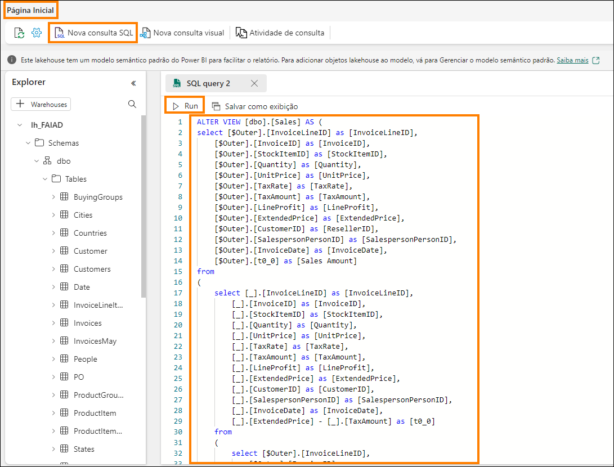

Não precisamos atualizar o modelo de dados e o relatório quando os dados
mudam. Esta é a vantagem do Direct Lake e do Direct query.

Vamos verificar novamente os desafios listados na declaração do
problema:

- **Você precisa atualizar seu conjunto de dados pelo menos três vezes
    por dia para acomodar os diferentes horários de atualização para as
    diferentes fontes de dados.**

Resolvemos isso usando Direct Lake. Cada Fluxo de Dados individual é
atualizado em sua agenda. Os conjuntos de dados e os relatórios não
precisam ser atualizados.

- **As operações de atualização podem demorar, pois é sempre
    necessário fazer uma atualização completa para capturar tudo o que
    foi atualizado nos sistemas de origem.**

Novamente, resolvemos isso usando Direct Lake. Cada Fluxo de Dados
individual é atualizado em sua agenda. Os conjuntos de dados e os
relatórios não precisam ser atualizados, portanto não precisamos nos
preocupar com a atualização completa.

- **Os erros detectados em qualquer uma das fontes das quais você está
    extraindo dados resultarão na interrupção da atualização do conjunto
    de dados. Muitas vezes o arquivo do funcionário não é carregado no
    prazo, resultando na interrupção da atualização do conjunto de
    dados.**

Os Pipelines de Dados ajudam a resolver esse problema, oferecendo o
recurso de tentar novamente a atualização em caso de falha e em
intervalos diferentes.

- **As alterações no modelo de dados demoram muito tempo, pois o Power
    Query leva tempo para atualizar as versões preliminares devido aos
    tamanhos de dados grandes e às transformações complexas.**

Percebemos que os Fluxos de Dados e o Lakehouses são eficientes e fáceis
de alterar. Geralmente, a pré-visualização em Fluxos de Dados e
Lakehouses não demora muito para carregar.

- **Você precisa de um computador com Windows para usar o Power BI
    Desktop mesmo que o padrão corporativo seja Mac.**

O Microsoft Fabric é uma oferta de SaaS. Tudo o que precisamos é de um
navegador para acessar o serviço. Não precisamos instalar nenhum
software em nossos desktops.

# Limpar o ambiente do laboratório

Quando você estiver pronto para limpar o ambiente do laboratório, siga
as etapas abaixo.

1. Selecione o workspace **FAIAD\_\<nome de usuário\>** no painel
    esquerdo para navegar até a home page do workspace.

2. No menu superior, selecione **Configurações do Workspace**.

    

3. A caixa de diálogo Configurações de workspace será aberta. Na seção
    **Geral**, desça a tela.

4. Selecione **Remover este workspace**.

5. A caixa de diálogo Excluir workspace será aberta. Selecione
    **Excluir**.

    Isso excluirá o workspace e todos os itens nele contidos.

    

# Referências

O Fabric Analyst in a Day (FAIAD) apresenta algumas das principais
funções disponíveis no Microsoft Fabric. No menu do serviço, a seção
Ajuda (?) tem links para ótimos recursos.

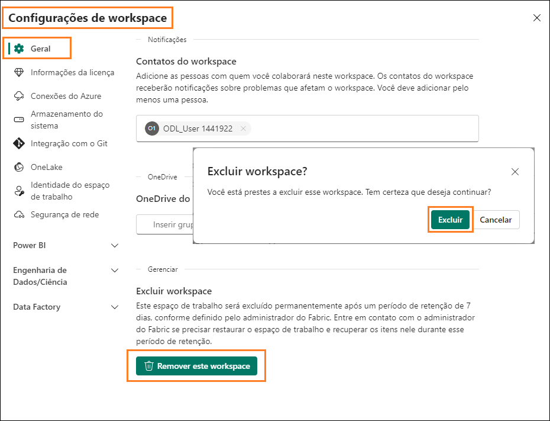

Veja aqui mais algus recursos que ajudarão você com as próximas etapas
do Microsoft Fabric.

- Veja a postagem do blog para ler o [anúncio completo de GA do
    Microsoft Fabric](https://aka.ms/Fabric-Hero-Blog-Ignite23)

- Explore o Fabric por meio do [Tour
    Guiado](https://aka.ms/Fabric-GuidedTour)

- Inscreva-se para a [avaliação gratuita do Microsoft
    Fabric](https://aka.ms/try-fabric)

- Visite o [site do Microsoft Fabric](https://aka.ms/microsoft-fabric)

- Aprenda novas habilidades explorando os [módulos de Aprendizagem do
    Fabric](https://aka.ms/learn-fabric)

- Explore a [documentação técnica do
    Fabric](https://aka.ms/fabric-docs)

- Leia o [livro eletrônico gratuito sobre como começar a usar o
    Fabric](https://aka.ms/fabric-get-started-ebook)

- Participe da [comunidade do Fabric](https://aka.ms/fabric-community)
    para postar suas perguntas, compartilhar seus comentários e aprender
    com outras pessoas

Leia os blogs de comunicados de experiências do Fabric em mais detalhes:

- [Experiência do Data Factory no blog do
    Fabric](https://aka.ms/Fabric-Data-Factory-Blog) 

- [Experiência do Synapse Data Engineering no blog do
    Fabric](https://aka.ms/Fabric-DE-Blog) 

- [Experiência do Synapse Data Science no blog do
    Fabric](https://aka.ms/Fabric-DS-Blog) 

- [Experiência do Synapse Data Warehousing no blog do
    Fabric](https://aka.ms/Fabric-DW-Blog) 

- [Experiência do Synapse Real-Time Analytics no blog do
    Fabric](https://aka.ms/Fabric-RTA-Blog)

- [Blog de comunicado do Power BI](https://aka.ms/Fabric-PBI-Blog)

- [Experiência do Data Activator no blog do
    Fabric](https://aka.ms/Fabric-DA-Blog) 

- [Administração e governança no blog do
    Fabric](https://aka.ms/Fabric-Admin-Gov-Blog)

- [OneLake no blog do Fabric](https://aka.ms/Fabric-OneLake-Blog)

- [Blog de integração do Dataverse e Microsoft
    Fabric](https://aka.ms/Dataverse-Fabric-Blog)

> © 2023 Microsoft Corporation. Todos os direitos reservados.
>
> Ao usar esta demonstração/este laboratório, você concorda com os
> seguintes termos:
>
> A tecnologia/funcionalidade descrita nesta demonstração/neste
> laboratório é fornecida pela Microsoft Corporation para obter seus
> comentários e oferecer uma experiência de aprendizado. Você pode usar
> a demonstração/o laboratório somente para avaliar tais funcionalidades
> e recursos de tecnologia e fornecer comentários à Microsoft. Você não
> pode usá-los para nenhuma outra finalidade. Você não pode modificar,
> copiar, distribuir, transmitir, exibir, executar, reproduzir,
> publicar, licenciar, criar obras derivadas, transferir nem vender esta
> demonstração/este laboratório ou qualquer parte deles.
>
> A CÓPIA OU A REPRODUÇÃO DA DEMONSTRAÇÃO/DO LABORATÓRIO (OU DE QUALQUER
> PARTE DELES) EM QUALQUER OUTRO SERVIDOR OU LOCAL PARA REPRODUÇÃO OU
> REDISTRIBUIÇÃO ADICIONAL É EXPRESSAMENTE PROIBIDA.
>
> ESTA DEMONSTRAÇÃO/ESTE LABORATÓRIO FORNECE DETERMINADOS RECURSOS E
> FUNCIONALIDADES DE PRODUTO/TECNOLOGIA DE SOFTWARE, INCLUINDO NOVOS
> RECURSOS E CONCEITOS POTENCIAIS, EM UM AMBIENTE SIMULADO SEM
> CONFIGURAÇÃO NEM INSTALAÇÃO COMPLEXA PARA A FINALIDADE DESCRITA ACIMA.
> A TECNOLOGIA/OS CONCEITOS REPRESENTADOS NESTA DEMONSTRAÇÃO/NESTE
> LABORATÓRIO PODEM NÃO REPRESENTAR A FUNCIONALIDADE COMPLETA DOS
> RECURSOS E PODEM NÃO FUNCIONAR DA MESMA MANEIRA QUE UMA VERSÃO FINAL.
> ALÉM DISSO, PODEMOS NÃO LANÇAR UMA VERSÃO FINAL DE TAIS RECURSOS OU
> CONCEITOS. SUA EXPERIÊNCIA COM O USO DE TAIS RECURSOS E
> FUNCIONALIDADES EM UM AMBIENTE FÍSICO TAMBÉM PODE SER DIFERENTE.
>
> **COMENTÁRIOS**. Caso você forneça comentários sobre os recursos de
> tecnologia, as funcionalidades e/ou os conceitos descritos nesta
> demonstração/neste laboratório à Microsoft, você concederá à
> Microsoft, sem encargos, o direito de usar, compartilhar e
> comercializar seus comentários de qualquer forma e para qualquer
> finalidade. Você também concede a terceiros, sem encargos, quaisquer
> direitos de patente necessários para que seus produtos, suas
> tecnologias e seus serviços usem ou interajam com partes específicas
> de um software ou um serviço da Microsoft que inclua os comentários.
> Você não fornecerá comentários que estejam sujeitos a uma licença que
> exija que a Microsoft licencie seu software ou sua documentação para
> terceiros em virtude da inclusão de seus comentários neles. Esses
> direitos continuarão em vigor após o término do contrato.
>
> POR MEIO DESTE, A MICROSOFT CORPORATION SE ISENTA DE TODAS AS
> GARANTIAS E CONDIÇÕES REFERENTES À DEMONSTRAÇÃO/AO LABORATÓRIO,
> INCLUINDO TODAS AS GARANTIAS E CONDIÇÕES DE COMERCIALIZAÇÃO, SEJAM
> ELAS EXPRESSAS, IMPLÍCITAS OU ESTATUTÁRIAS, E DE ADEQUAÇÃO A UMA
> FINALIDADE ESPECÍFICA, TÍTULO E NÃO VIOLAÇÃO. A MICROSOFT NÃO DECLARA
> NEM GARANTE A PRECISÃO DOS RESULTADOS DERIVADOS DO USO DA
> DEMONSTRAÇÃO/DO LABORATÓRIO NEM A ADEQUAÇÃO DAS INFORMAÇÕES CONTIDAS
> NA DEMONSTRAÇÃO/NO LABORATÓRIO A QUALQUER FINALIDADE.
>
> **AVISO DE ISENÇÃO DE RESPONSABILIDADE**
>
> Esta demonstração/este laboratório contém apenas uma parte dos novos
> recursos e aprimoramentos do Microsoft Power BI. Alguns dos recursos
> podem ser alterados em versões futuras do produto. Nesta
> demonstração/neste laboratório, você aprenderá sobre alguns dos novos
> recursos, mas não todos.
