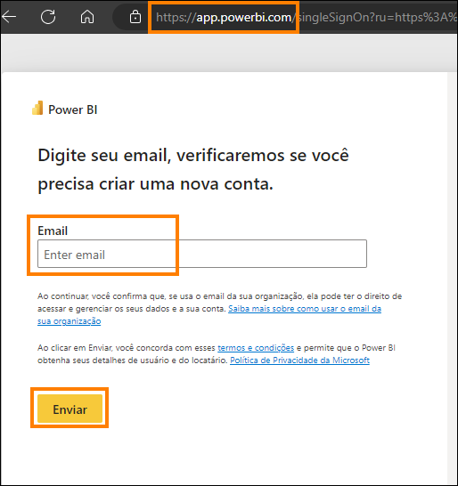
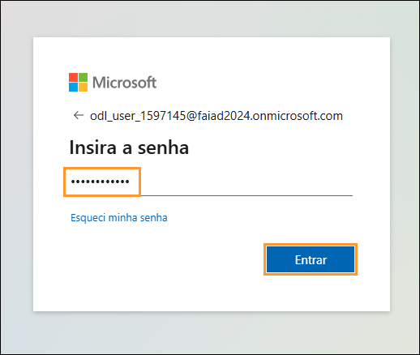
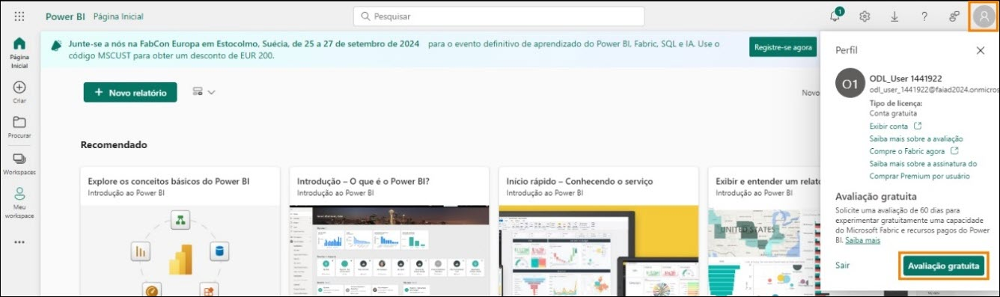
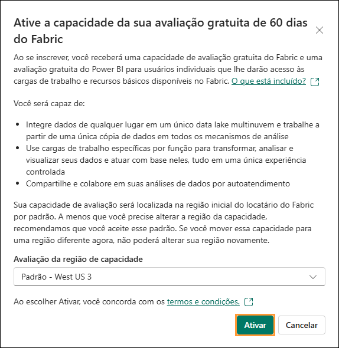
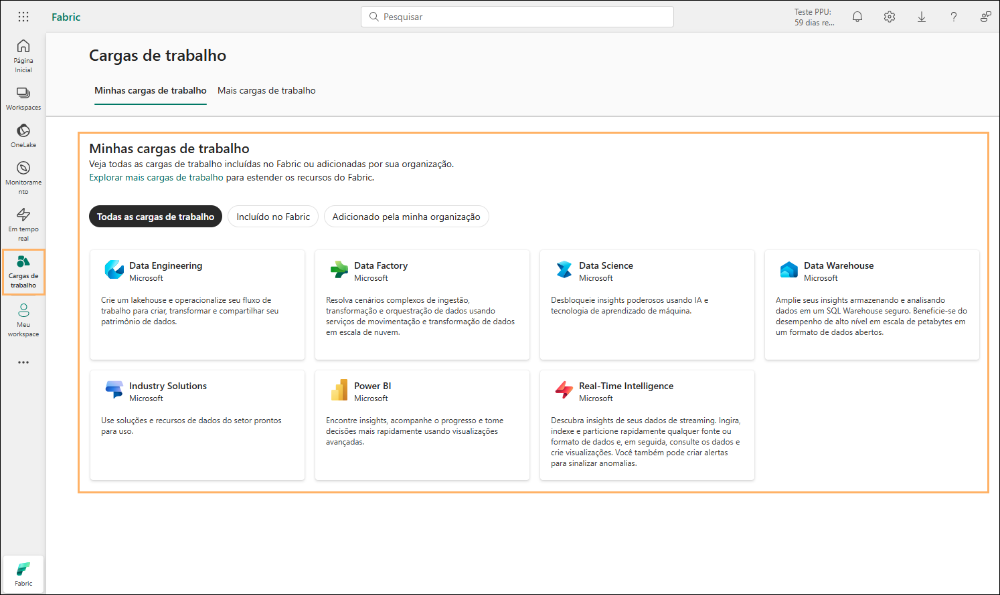
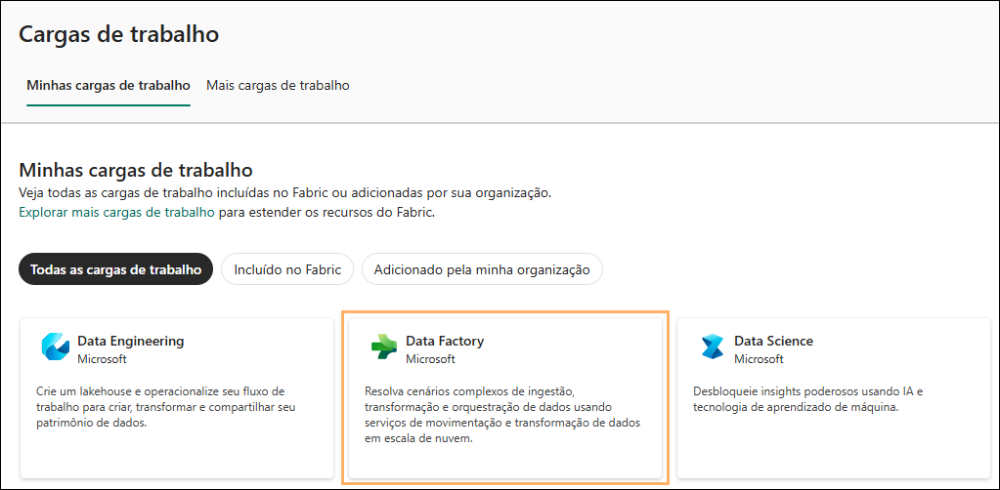
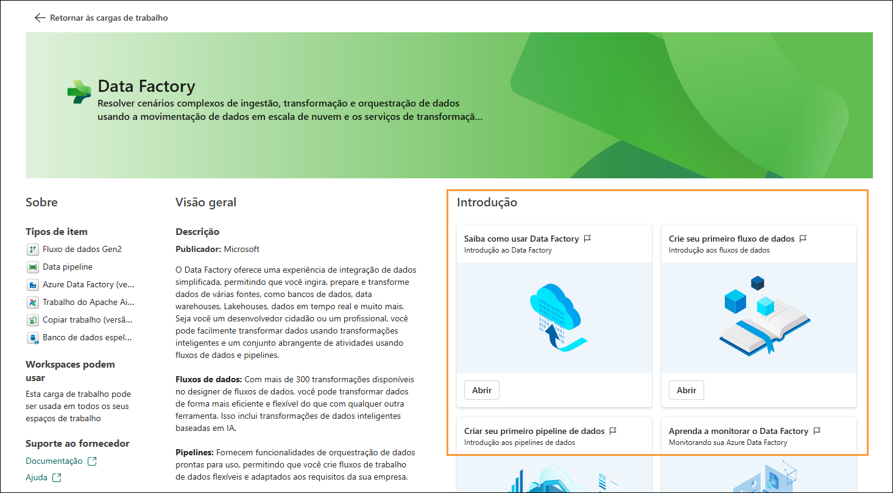
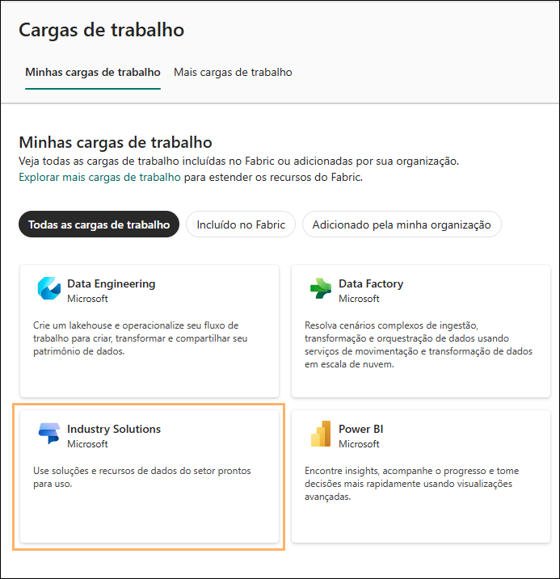
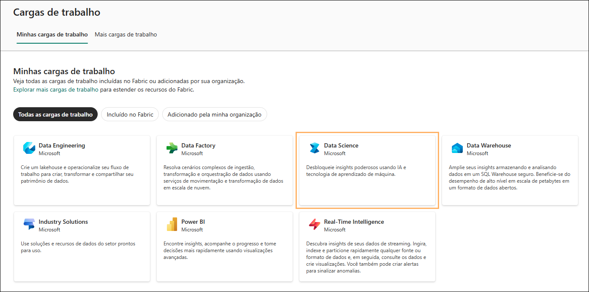
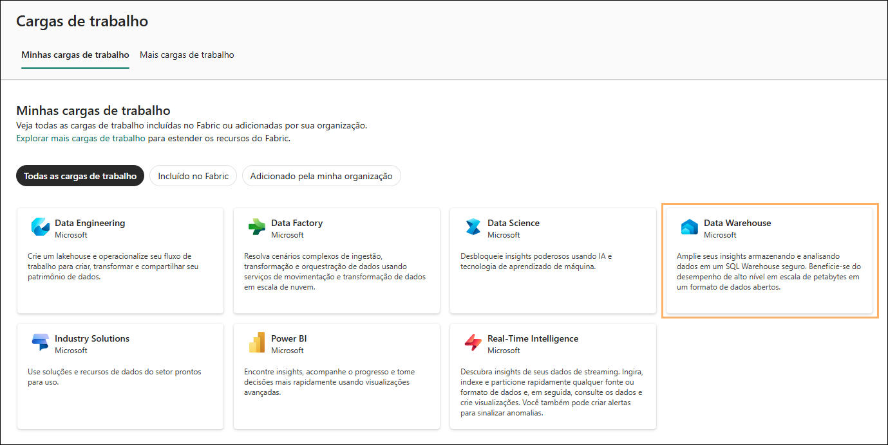

# Microsoft Fabric - Fabric Analyst in a Day - Laboratório 2

# Sumário
- Introdução
- Licença do Fabric
    - Tarefa 1: Habilitar uma licença de avaliação do Microsoft Fabric
- Workspace do Fabric
    - Tarefa 2: Criar um espaço de trabalho do Fabric
    - Tarefa 3: Criar um Lakehouse
- Visão geral das experiências do Fabric
    - Tarefa 4: Experiência do Data Factory
    - Tarefa 5: Experiência do Industry Solutions
    - Tarefa 6: Experiência do Real-Time Intelligence
    - Tarefa 7: Experiência do Data Engineering
    - Tarefa 8: Experiência do Data Science
    - Tarefa 9: Experiência do Data Warehouse
- Referências

# Introdução 

Hoje você aprenderá sobre vários recursos importantes do Microsoft
Fabric. Este é um workshop introdutório destinado a apresentar as
diversas experiências de produtos e os vários itens disponíveis no
Fabric. Ao final deste workshop, você saberá como usar os recursos
Lakehouse, Fluxo de Dados Gen2, Pipeline de Dados, DirectLake, entre
outros.

Ao final deste laboratório, você terá aprendido a:

- Como criar um espaço de trabalho do Fabric

- Como criar um Lakehouse

# Licença do Fabric

## Tarefa 1: Habilitar uma licença de avaliação do Microsoft Fabric

1. Abra o **navegador** e acesse [Microsoft Power BI Portal](https://app.powerbi.com). Você será
    direcionado para a página de logon.

   **Observação:** se você estiver usando o ambiente de laboratório, ele
poderá conectar você diretamente.

   **Observação:** Se você não estiver usando o ambiente de laboratório e
já tiver uma conta do Power BI, talvez queira usar o navegador no modo
particular/anônimo.

2. Copie o **Nome de usuário** e cole-o no campo **Email** da caixa de
    texto e selecione **Enviar**.

    - Email/Nome de usuário: <inject key="AzureAdUserEmail"></inject>

      

3. Na guia **Entrar no Microsoft Azure**, você verá a tela de login.
    Nessa tela, insira o seguinte
    **Email/Nome de usuário** e clique em **Avançar**.

    - Email/Nome de usuário: <inject key="AzureAdUserEmail"></inject>

      

4. Agora, insira a seguinte **Senha** e clique em **Entrar**.

    - Senha: <inject key="AzureAdUserPassword"></inject>

      

5. Você será direcionado à conhecida **Página Inicial de Serviço do
    Power BI**.

6. Presumimos que você esteja familiarizado com o layout do Serviço do
    Power BI. Se você tiver alguma dúvida, não hesite em perguntar ao
    instrutor.

    Atualmente, você está em **Meu workspace**. Para trabalhar com itens do
Fabric, você precisará de uma licença de avaliação e de um espaço de
trabalho que tenha uma licença do Fabric atribuída. Vamos configurar
tudo.

7. No canto superior direito da tela, selecione o **ícone de usuário**.

8. Selecione **Avaliação gratuita**.

   
9. A caixa de diálogo de Atualizar para uma avaliação gratuita do
    Microsoft Fabric é aberta. Selecione **Ativar**.

   

10. A caixa de diálogo Atualizado com êxito para uma avaliação gratuita do Microsoft Fabric é aberta. Selecione **Fabric Home Page**.

    

11. Você será direcionado à **Página Inicial do Microsoft** **Fabric**.

    

# Workspace do Fabric

## Tarefa 2: Criar um espaço de trabalho do Fabric

1. Agora vamos criar um espaço de trabalho com uma licença do Fabric.
    Selecione **Workspaces (1)** na barra de navegação esquerda. Uma
    caixa de diálogo é aberta.

2. Clique em **+ Novo espaço de trabalho (2)** encontrado na parte
    inferior do menu pop-out.

   

3. A caixa de diálogo **Criar um espaço de trabalho** é aberta no lado
    direito do navegador.

4. No campo **Nome**, insira **FAIAD_<inject key="Deployment ID" enableCopy="false"/>**

   **Observação:** o nome do espaço de trabalho deve ser exclusivo.
Verifique se há uma marca de seleção verde em "Este nome está
disponível", abaixo do campo Nome.

5. Se preferir, você pode inserir uma Descrição para o workspace. Esse
    campo é opcional.

6. Clique em Avançado para expandir a seção.

   

7. Em **Modo de licença**, verifique se **Avaliação** está selecionada.
    (Essa opção deve estar selecionada por padrão.)

8. Selecione **Aplicar** para criar um novo workspace.

   

Um novo espaço de trabalho é criado e você será direcionado para ele.
Traremos dados de diferentes fontes de dados para o Lakehouse e usaremos
os dados do Lakehouse para criar nosso modelo e relatá-lo. A primeira
etapa é criar um Lakehouse.

## Tarefa 3: Criar um Lakehouse

1. No espaço de trabalho recém-criado **FAIAD_<inject key="Deployment ID" enableCopy="false"/>**,
    localize o botão **+ Novo item (1)** no painel de navegação
    esquerdo. É aqui que você pode começar a criar novos itens em seu
    espaço de trabalho.

2. Na caixa de pesquisa, digite **Lakehouse (2)** e, nos resultados da
    pesquisa, selecione a opção **Lakehouse (3)**. Isso permitirá que
    você crie um novo Lakehouse para armazenar, consultar
    e gerenciar seu big data.

   

3. Uma caixa de diálogo Novo lakehouse será exibida. Insira lh_FAIAD na
    caixa de texto Nome.

   **Observação:** "lh" aqui se refere a Lakehouse. Estamos usando o
prefixo "lh" para facilitar
a identificação e a pesquisa.

4. Selecione **Criar**.

   

Em alguns instantes, um Lakehouse será criado e você será direcionado
para a interface do Lakehouse. No **painel esquerdo**, observe que
abaixo do seu workspace você terá o ícone Lakehouse. Você pode navegar
facilmente até o Lakehouse clicando neste ícone a qualquer momento.

No Explorador do Lakehouse, você observará **Tables e Files**. O
Lakehouse poderá expor arquivos do Azure Data Lake Storage Gen2 na seção
de arquivos, ou um fluxo de dados poderá carregar dados para as tabelas
do Lakehouse. Existem várias opções disponíveis. Mostraremos algumas das
opções nos laboratórios a seguir.

   

# Visão geral das experiências do Fabric

## Tarefa 4: Experiência do Data Factory

1. Selecione o ícone Cargas de trabalho no lado esquerdo da tela. Uma
    caixa de diálogo com a lista de experiências do Fabric será aberta.
    A lista de experiências inclui o Power BI, o Data Factory,
    o Industry Solutions, o Real-Time Intelligence, o Data Engineering,
    o Data Science e o Data Warehouse. Vamos explorar.

   

2. Selecione **Data Factory**.

   

3. Você será direcionado para a Página Inicial do Data Factory. A
    seguir, está uma explicação detalhada de suas seções, desenvolvidas
    para guiar você passo a passo no uso eficaz do Data Factory. Fluxo
    de Dados Gen2 é a próxima geração de Fluxo de Dados.

    ### O que é o Data Factory?

    O Data Factory é uma ferramenta que ajuda a gerenciar e organizar dados
    de fontes diferentes. Ele permite que você colete, prepare e transforme
    dados, para que possam ser usados de forma eficaz. Seja você um
    iniciante ou um especialista, o Data Factory fornece ferramentas para
    tornar a transformação de dados mais fácil e eficiente.

    ### Tipos de item:

    a. **Fluxos de dados:** são como receitas para transformar dados.
    Eles oferecem mais de 300 transformações diferentes que você pode
    aplicar aos seus dados. Isso significa que você pode limpar, combinar
    e alterar os dados de várias maneiras para atender às suas
    necessidades.

    b. **Pipelines:** são fluxos de trabalho que ajudam a automatizar
    processos de dados. Eles permitem que você crie fluxos de trabalho de
    dados flexíveis que podem ser adaptados às suas necessidades
    específicas. Isso facilita o gerenciamento e o processamento de dados
    de forma estruturada.

    c. **Azure Data Factory (versão preliminar):** é um serviço de
    integração de dados baseado em nuvem que permite criar fluxos de
    trabalho controlados por dados para orquestrar e automatizar a
    movimentação e a transformação de dados.

    d. **Trabalho do Apache Airflow (versão preliminar):** o Apache
    Airflow é uma plataforma de código aberto usada para criar, agendar e
    monitorar fluxos de trabalho de forma programática. No Data Factory,
    ele permite criar, agendar e gerenciar fluxos de trabalho de dados
    complexos.

    e. **Copiar Trabalho (versão preliminar):** é um recurso que permite
    copiar dados de uma fonte para outra. Ele fornece uma maneira simples
    e eficiente de mover dados entre diferentes armazenamentos.

    f. **Banco de Dados Espelhado (versão preliminar):** um recurso para
    criar versões espelhadas de bancos de dados para backup, teste ou
    acesso somente leitura.

    ### Introdução:

    Para começar a usar o Data Factory, você pode seguir estas etapas:

    a. **Saiba como usar o Data Factory:** essa seção ajuda você a
    começar a usar o Data Factory. Ela fornece orientação sobre como
    começar a usar a ferramenta de forma eficaz.

    b. **Criar seu primeiro fluxo de dados:** aqui, você pode aprender
    como criar seu primeiro fluxo de dados. Os fluxos de dados são
    essenciais para transformar os dados de acordo com suas necessidades.

    c. **Criar seu primeiro pipeline de dados:** essa seção orienta você
    sobre como criar seu primeiro pipeline de dados. Os pipelines ajudam a
    automatizar e gerenciar os processos de dados de forma eficaz.

    d. **Saiba como monitorar o Data Factory:** o monitoramento é crucial
    para garantir que os processos de dados estejam funcionando sem
    problemas. Essa seção ensina como monitorar as atividades do Data
    Factory.

    e. **Saiba como transformar dados com fluxos de dados:** essa seção
    ajuda você a entender como usar fluxos de dados para transformar os
    dados de forma eficaz.

    f. **Criar sua primeira API para o GraphQL:** se você estiver
    interessado em usar APIs com o GraphQL, essa seção orientará você
    sobre como começar.

    g. **Criar suas primeiras funções de dados do usuário:** essa seção
    ajuda você a criar funções de dados do usuário, que são úteis para
    gerenciar e transformar dados do usuário.

    

4. Clique em **Retornar às cargas de trabalho** no canto superior
    esquerdo da tela. Essa ação levará você para a página principal de
    cargas de trabalho, na qual você poderá explorar outras ferramentas
    ou seções.

   

## Tarefa 5: Experiência do Industry Solutions

1. Na página **Cargas de trabalho**, clique em **Industry Solutions**
    para prosseguir.

   

2. Você será direcionado para a **Página Inicial do Industry
    Solutions**. A seguir, está uma visão geral detalhada de suas
    seções, desenvolvidas para ajudar você a usar o **Industry**
    **Solutions** de forma eficaz e passo a passo.

    ### O que são Industry Solutions?

    Industry Solutions são soluções de dados prontas para uso no Microsoft
    Fabric que fornecem soluções e recursos para vários setores. As Industry
    Solutions ajudam você a começar a usar os principais cenários de
    negócios usando modelos de dados, conectores, transformações, relatórios
    e outros ativos relacionados ao setor.

    ### Tipos de item:

    a. **Soluções de sustentabilidade:** oferece suporte à ingestão,
    padronização e análise de dados de ESG (governança ambiental, social e
    corporativa).

    b. **Soluções de varejo:** ajuda no gerenciamento de grandes volumes
    de dados, integrando dados de várias fontes e fornecendo análises em
    tempo real para tomada rápida de decisões. Os varejistas podem usar
    essas soluções para otimização de estoque, segmentação de clientes,
    previsão de vendas, preços dinâmicos e detecção de fraudes.

    c. **Soluções de serviços de saúde:** são estrategicamente projetadas
    para acelerar o tempo de retorno para os clientes, atendendo à
    necessidade crítica de transformar com eficiência os dados de saúde em
    um formato adequado para análise.

    ### Introdução:

    Para começar a usar o Industry Solutions, siga estas etapas:

    a. **Saiba mais sobre soluções de dados de saúde:** clique no botão
    "Saiba mais" para ler sobre soluções de dados de saúde e entender
    como elas podem ser usadas em seus projetos.

    b. **Implantar soluções de dados de saúde:** clique no botão
    "Implantar" para começar a implantar soluções de dados de saúde e
    implementá-las em seus projetos.

    c. **Saiba mais sobre soluções de sustentabilidade:** clique no botão
    "Saiba mais" para ler sobre soluções de sustentabilidade e entender
    como elas podem ser usadas em seus projetos.

    d. **Implantar soluções de sustentabilidade:** clique no botão
    "Implantar" para começar a implantar soluções de sustentabilidade e
    implementá-las em seus projetos.

    e. **Saiba mais sobre soluções de varejo:** clique no botão "Saiba
    mais" para ler sobre soluções de varejo e entender como elas podem
    ser usadas em seus projetos.

    f. **Implantar soluções de varejo:** clique no botão "Implantar"
    para começar a implantar soluções de varejo e implementá-las em seus
    projetos.

3. Clique em Retornar às cargas de trabalho no canto superior esquerdo
    da tela. Essa ação levará você para a página principal de cargas de
    trabalho, na qual você poderá explorar outras ferramentas ou seções.

   

## Tarefa 6: Experiência do Real-Time Intelligence

1. Na página **Cargas de trabalho**, clique em **Real-Time
    Intelligence** para prosseguir.

   

2. Você será direcionado para a Página Inicial do **Real-Time Intelligence**. A seguir, está uma visão geral detalhada de suas seções, desenvolvidas para ajudar você a usar o **Real-Time Intelligence** de forma eficaz e passo a passo.

    ### O que é o Real-Time Intelligence?

    O Real-Time Intelligence é uma ferramenta que ajuda você a gerenciar e
    analisar dados de alto volume e alta granularidade de várias fontes. Ele
    permite ingerir, analisar e tomar medidas sobre os dados em tempo real,
    melhorando as operações de negócios com tomadas de decisões e ações em
    tempo hábil.

    ### Tipos de item:

    a. **Eventhouse:** usado para criar um espaço de trabalho de um ou
    vários bancos de dados KQL, que podem ser compartilhados entre
    projetos.

    b. **Conjunto de consultas KQL:** usado para executar consultas nos
    dados para produzir tabelas e visuais compartilháveis.

    c. **Dashboard em Tempo Real:** usado para visualizar dashboards em
    tempo real em segundos após a ingestão de dados.

    d. **Eventstream:** usado para capturar, transformar e rotear fluxo
    de eventos em tempo real.

    e. **Activator:** usado para monitorar conjuntos de dados, consultas
    e fluxos de eventos para padrões.

    ### Introdução:

    Para começar a usar o Real-Time Intelligence, siga estas etapas:

    a. **Explorar exemplo de inteligência em tempo real:** clique no
    botão "Abrir" para explorar a análise de dados em tempo real com um
    exemplo.

    b. **Explorar um exemplo:** clique no botão "Selecionar" para usar
    um exemplo e aprender sobre o Real-Time Intelligence.

    c. **Introdução à Inteligência em Tempo Real:** clique no botão
    "Abrir" para obter uma visão geral do Real-Time Intelligence e
    começar a usar a ferramenta de forma eficaz.

    d. **Aprender KQL com dados de amostra:** clique no botão "Abrir"
    para aprender KQL usando dados de amostra.

    e. **O que é um Hub em Tempo Real**: clique no botão "Abrir" para
    saber o que é um Hub em Tempo Real e como ele pode ser usado.

    f. **Explorar um ativador de amostra**: clique no botão "Abrir"
    para usar um ativador de amostra e entender os recursos e as
    capacidades do Real-Time Intelligence.

    g. **Introdução ao ativador**: clique no botão "Abrir" para começar
    a usar os conceitos do ativador e a ferramenta de forma eficaz.

    

3. Clique em Retornar às cargas de trabalho no canto superior esquerdo
    da tela. Essa ação levará você para a página principal de cargas de
    trabalho, na qual você poderá explorar outras ferramentas ou seções.

   

## Tarefa 7: Experiência do Data Engineering

1. Na página **Cargas de trabalho**, clique em **Data Engineering**
    para prosseguir.

   

2. Você será direcionado para a **Página Inicial do Data Engineering**.
    A seguir, está uma visão geral detalhada de suas seções,
    desenvolvidas para ajudar você a usar o **Data** **Engineering** de
    forma eficaz e passo a passo.

    ### O que é o Data Engineering?

    O Data Engineering é uma ferramenta que ajuda a projetar, criar e manter
    infraestruturas e sistemas para coleta, armazenamento, processamento e
    análise de grandes volumes de dados. Ele permite que você crie um
    lakehouse e operacionalize seu fluxo de trabalho para criar, transformar
    e compartilhar seu patrimônio de dados.

    ### Tipos de item:

    a. **Lakehouse**: usado para armazenar Big Data para limpeza,
    consulta, geração de relatórios e compartilhamento.

    b. **Notebook**: usado para ingestão, preparação, análise e outras
    tarefas relacionadas a dados usando várias linguagens, como Python, R
    e Scala.

    c. **Ambiente**: usado para configurar bibliotecas compartilhadas,
    configurações de computação do Spark e recursos para notebooks e
    definições de trabalho do Spark.

    d. **Definição de Trabalho do Spark**: usada para definir, agendar e
    gerenciar trabalhos do Apache.

    e. **Pipeline de dados**: usado para orquestrar a solução de dados.

    f. **API for GraphQL**: é a API para consultar várias fontes de
    dados.

    g. **Importar notebook**: usado para importar notebooks de um
    computador local.

    ### Introdução:

    Para começar a usar o Data Engineering, siga estas etapas:

    a. **Explorar um exemplo**: clique no botão "Selecionar" para usar
    um exemplo e aprender sobre o Data Engineering.

    b. **O que é um Lakehouse?**: clique no botão "Abrir" para saber
    mais sobre lakehouses e como eles podem ser usados.

    c. **Obter experiência de dados no Lakehouse**: clique no botão
    "Abrir" para começar a trabalhar com a engenharia de dados usando
    Lakehouses.

    d. **Introdução às Definições de Trabalho do Spark**: clique no botão
    "Abrir" para saber como usar as Definições de Trabalho do Spark para
    processamento de dados.

    e. **Desenvolver e executar notebooks**: clique no botão "Abrir"
    para saber como desenvolver e executar notebooks para análise de
    dados.

    f. **Como usar o NotebookUtils**: clique no botão "Abrir" para
    saber como usar o NotebookUtils para uma análise de dados aprimorada.

    g. **Aproveitar notebooks para seu lakehouse**: clique no botão
    "Abrir" para saber como aproveitar os notebooks para seu lakehouse.

    h. **Aproveitar conjuntos de dados para seu lakehouse**: clique no
    botão "Abrir" para saber como aproveitar os conjuntos de dados para
    seu lakehouse.

    i. **Criar suas primeiras funções de dados do usuário**: clique no
    botão "Abrir" para saber como criar funções de dados do usuário.

    j. **Criar sua primeira API for GraphQL**: clique no botão "Abrir"
    para saber como criar uma API for GraphQL.

    

3. Clique em **Retornar às cargas de trabalho** no canto superior
    esquerdo da tela. Essa ação levará você para a página principal de
    cargas de trabalho, na qual você poderá explorar outras ferramentas
    ou seções.

   

## Tarefa 8: Experiência do Data Science

1. Na página **Cargas de trabalho**, clique em **Data** **Science**
    para prosseguir.

   

2. Você será direcionado para a **Página Inicial do Data Science**. A
    seguir, está uma visão geral detalhada de suas seções, desenvolvidas
    para ajudar você a usar o **Data Science** de forma eficaz.

    ### O que é o Data Science?

    O Data Science é uma ferramenta que ajuda você a revelar insights
    avançados usando IA e tecnologia de aprendizado de máquina. Ele fornece
    ferramentas de IA projetadas para ajudar você a concluir fluxos de
    trabalho de ciência de dados em grande escala e aproveitar a IA para
    enriquecimento de dados e insights de negócios.

    ### Tipos de item:

    a. **Modelo de ML**: usado para criar modelos de machine learning.

    b. **Experimento**: usado para criar, executar e acompanhar o
    desenvolvimento de vários modelos.

    c. **Notebook**: usado para explorar dados e criar soluções de
    machine learning.

    d. **Ambiente**: usado para configurar bibliotecas compartilhadas,
    configurações de computação do Spark e recursos para notebooks e
    definições de trabalho do Spark.

    e. **Habilidade de IA**: usada para criar sua própria experiência de
    IA generativa.

    f. **Notebook Python**: usado para importar notebooks Python de um
    computador local.

    ### Introdução:

    Para começar a usar o Data Science, siga estas etapas:

    a. **Explorar um exemplo**: clique no botão "Selecionar" para usar
    um exemplo e aprender sobre o Data Science.

    b. **Introdução aos Modelos de ML**: clique no botão "Abrir" para
    saber como começar a usar os modelos de machine learning.

    c. **Introdução aos Experimentos de ML**: clique no botão "Abrir"
    para saber como conduzir experimentos de machine learning.

    d. **Desenvolver e executar notebooks**: clique no botão "Abrir"
    para saber como desenvolver e executar notebooks para análise de
    dados.

    e. **Introdução aos Notebooks**: clique no botão "Abrir" para saber
    como começar a usar os notebooks.

    

3. Clique em **Retornar às cargas de trabalho** no canto superior
    esquerdo da tela. Essa ação levará você para a página principal de
    cargas de trabalho, na qual você poderá explorar outras ferramentas
    ou seções.

   

## Tarefa 9: Experiência do Data Warehouse

1. Na página **Cargas de trabalho**, clique em **Data Warehouse** para
    prosseguir.

   

2. Você será direcionado para a **Página Inicial do Data Warehouse**. A
    seguir, está uma visão geral detalhada de suas seções, desenvolvidas
    para ajudar você a usar o **Data Warehouse** de forma eficaz e passo
    a passo.

    ### O que é o Data Warehouse?

    O Data Warehouse é uma ferramenta que ajuda a armazenar e analisar dados
    em um depósito de SQL seguro. Ele permite que você escale verticalmente
    seus insights beneficiando-se do desempenho de nível superior em escala
    de petabytes em um formato de dados abertos.

    ### Tipos de item:

    a. **Warehouse**: usado para criar um Data Warehouse.

    b. **Warehouse de amostra**: usado para explorar e testar recursos de
    armazenamento de dados com conjuntos de dados e modelos
    pré-configurados.

    c. **Pipeline de dados**: usado para orquestrar soluções de dados.

    d. **Notebook**: usado para criar e compartilhar tarefas interativas
    de visualização e análise de dados.

    e. **Banco de Dados SQL do Azure espelhado**: usado para espelhar o
    Banco de Dados SQL do Azure.

    f. **Catálogo espelhado do Azure Databricks**: usado para espelhar os
    dados do Azure Databricks para integração e análise aprimoradas.

    g. **Snowflake espelhado**: usado para espelhar o banco de dados
    Snowflake.

    h. **Azure Cosmos DB espelhado**: usado para espelhar o Azure Cosmos
    DB.

    i. **Banco de dados gerenciado SQL do Azure espelhado**: usado para
    espelhar os Bancos de dados gerenciados SQL do Azure para alta
    disponibilidade e recuperação de desastres.

    j. **Banco de dados espelhado**: usado para replicar bancos de dados
    para alta disponibilidade e recuperação de desastres.

    ### Introdução:

    Para começar a usar o Data Warehouse, siga a etapa abaixo:

    a. **Introdução ao warehouse**: clique no botão "Abrir" para saber
    como usar um warehouse para analisar dados.

    

1. Clique em **Retornar às cargas de trabalho** no canto superior esquerdo
da tela. Essa ação levará você para a página principal de cargas de
trabalho, na qual você poderá explorar outras ferramentas ou seções.

   

Neste laboratório, explorámos a interface do Fabric e criámos um espaço de trabalho do Fabric e um Lakehouse. No próximo laboratório, aprenderemos como utilizar os Atalhos no Lakehouse para ligar aos dados do ADLS Gen2 e como transformar esses dados utilizando visualizações.

# Referências

O Fabric Analyst in a Day (FAIAD) apresenta algumas das principais
funções disponíveis no Microsoft Fabric. No menu do serviço, a seção
Ajuda (?) tem links para ótimos recursos.

Veja aqui mais alguns recursos que ajudarão você com as próximas etapas do Microsoft Fabric.

- Veja a postagem do blog para ler o [anúncio completo de GA do Microsof t Fabric](https://www.microsoft.com/en-us/microsoft-fabric/blog/2023/11/15/prepare-your-data-for-ai-innovation-with-microsoft-fabric-now-generally-available/)
- Explore o Fabric por meio do [Tour Guiado](https://guidedtour.microsoft.com/en-us/guidedtour/microsoft-fabric/microsoft-fabric/1/1)
- Inscreva-se para a [avaliação gratuita do Microsof t Fabric](https://www.microsoft.com/en-us/microsoft-fabric/getting-started)
- Visite o [site do Microsof t Fabric](https://www.microsoft.com/en-in/microsoft-fabric)
- Aprenda novas habilidades explorando os [módulos de Aprendizagem do Fabric](https://learn.microsoft.com/en-us/training/browse/?products=fabric&resource_type=module)
- Explore a [documentação técnica do Fabric](https://learn.microsoft.com/en-us/fabric/)
- Leia o [livro eletrônico gratuito sobre como começar a usar o Fabric](https://info.microsoft.com/ww-landing-unlocking-transformative-data-value-with-microsoft-fabric.html)
- Participe da [comunidade do Fabric](https://community.fabric.microsoft.com/) para postar suas 
perguntas, compartilhar seus comentários e aprender com outras pessoas

Leia os blogs de comunicados de experiências do Fabric em mais detalhes:

- [Experiência do Data Factory no blog do Fabric](https://blog.fabric.microsoft.com/en-us/blog/introducing-data-factory-in-microsoft-fabric/)
- [Experiência do Synapse Data Engineering no blog do Fabric](https://blog.fabric.microsoft.com/en-us/blog/introducing-synapse-data-engineering-in-microsoft-fabric/)
- [Experiência do Synapse Data Science no blog do Fabric](https://blog.fabric.microsoft.com/en-us/blog/introducing-synapse-data-science-in-microsoft-fabric/)
- [Experiência do Synapse Data Warehousing no blog do Fabric](https://blog.fabric.microsoft.com/en-us/blog/introducing-synapse-data-warehouse-in-microsoft-fabric/)
- [Experiência do Synapse Real-Time Analytics no blog do Fabric](https://blog.fabric.microsoft.com/en-us/blog/sense-analyze-and-generate-insights-with-synapse-real-time-analytics-in-microsoft-fabric/)
- [Blog de comunicado do Power BI](https://powerbi.microsoft.com/en-us/blog/empower-power-bi-users-with-microsoft-fabric-and-copilot/)
- [Experiência do Data Activator no blog do Fabric](https://blog.fabric.microsoft.com/en-us/blog/driving-actions-from-your-data-with-data-activator/)
- [Administração e governança no blog do Fabric](https://blog.fabric.microsoft.com/en-us/blog/administration-security-and-governance-in-microsoft-fabric/)
- [OneLake no blog do Fabric](https://blog.fabric.microsoft.com/en-us/blog/microsoft-onelake-in-fabric-the-onedrive-for-data/)
- [Blog de integração do Dataverse e Microsof t Fabric](https://www.microsoft.com/en-us/dynamics-365/blog/it-professional/2023/05/24/new-dataverse-enhancements-and-ai-powered-productivity-with-microsoft-365-copilot/)

© 2025 Microsoft Corporation. Todos os direitos reservados.

Ao usar esta demonstração/este laboratório, você concorda com os seguintes termos:

A tecnologia/funcionalidade descrita nesta demonstração/neste laboratório é fornecida pela Microsoft Corporation para obter seus comentários e oferecer uma experiência de aprendizado. Você pode usar a demonstração/o laboratório somente para avaliar tais funcionalidades e recursos de tecnologia e fornecer comentários à Microsoft. Você não pode usá-los para nenhuma outra finalidade. Você não pode modificar, copiar, distribuir, transmitir, exibir, executar,
reproduzir, publicar, licenciar, criar obras derivadas, transferir nem vender esta demonstração/este laboratório ou qualquer parte deles.

A CÓPIA OU A REPRODUÇÃO DA DEMONSTRAÇÃO/DO LABORATÓRIO (OU DE QUALQUER PARTE DELES) EM QUALQUER OUTRO SERVIDOR OU LOCAL PARA REPRODUÇÃO OU REDISTRIBUIÇÃO ADICIONAL É EXPRESSAMENTE PROIBIDA.

ESTA DEMONSTRAÇÃO/ESTE LABORATÓRIO FORNECE DETERMINADOS RECURSOS E FUNCIONALIDADES DE PRODUTO/TECNOLOGIA DE SOFTWARE, INCLUINDO NOVOS RECURSOS E CONCEITOS POTENCIAIS, EM UM AMBIENTE SIMULADO SEM CONFIGURAÇÃO NEM INSTALAÇÃO COMPLEXA PARA A FINALIDADE DESCRITA ACIMA. A TECNOLOGIA/OS CONCEITOS REPRESENTADOS NESTA DEMONSTRAÇÃO/NESTE LABORATÓRIO PODEM NÃO REPRESENTAR A FUNCIONALIDADE COMPLETA DOS RECURSOS E PODEM NÃO FUNCIONAR DA MESMA MANEIRA QUE UMA VERSÃO FINAL. ALÉM DISSO, PODEMOS NÃO LANÇAR UMA VERSÃO FINAL DE TAIS RECURSOS OU CONCEITOS. SUA EXPERIÊNCIA COM O USO DE TAIS RECURSOS E FUNCIONALIDADES EM UM AMBIENTE FÍSICO TAMBÉM PODE SER DIFERENTE.

**COMENTÁRIOS**. Caso você forneça comentários sobre os recursos de tecnologia, as funcionalidades e/ou os conceitos descritos nesta demonstração/neste laboratório à Microsoft, você concederá à Microsoft, sem encargos, o direito de usar, compartilhar e comercializar seus comentários de qualquer forma e para qualquer finalidade. Você também concede a terceiros, sem encargos, quaisquer direitos de patente necessários para que seus produtos, suas
tecnologias e seus serviços usem ou interajam com partes específicas de um software ou um serviço da Microsoft que inclua os comentários. Você não fornecerá comentários que estejam sujeitos a uma licença que exija que a Microsoft licencie seu software ou sua documentação para terceiros em virtude da inclusão de seus comentários neles. Esses direitos continuarão em vigor após o término do contrato.

POR MEIO DESTE, A MICROSOFT CORPORATION SE ISENTA DE TODAS AS GARANTIAS E CONDIÇÕES REFERENTES À DEMONSTRAÇÃO/AO LABORATÓRIO, INCLUINDO TODAS AS GARANTIAS E CONDIÇÕES DE COMERCIALIZAÇÃO, SEJAM ELAS EXPRESSAS, IMPLÍCITAS OU ESTATUTÁRIAS, E DE ADEQUAÇÃO A UMA FINALIDADE ESPECÍFICA, TÍTULO E NÃO VIOLAÇÃO. A MICROSOFT NÃO DECLARA NEM GARANTE A PRECISÃO DOS RESULTADOS DERIVADOS DO USO DA DEMONSTRAÇÃO/DO LABORATÓRIO NEM A ADEQUAÇÃO DAS INFORMAÇÕES CONTIDAS NA DEMONSTRAÇÃO/NO LABORATÓRIO A QUALQUER FINALIDADE.
 
**AVISO DE ISENÇÃO DE RESPONSABILIDADE**
Esta demonstração/este laboratório contém apenas uma parte dos novos recursos e aprimoramentos do Microsoft Power BI. Alguns dos recursos podem ser alterados em versões futuras do produto. Nesta demonstração/neste laboratório, você aprenderá sobre alguns dos novos recursos, mas não todos.

